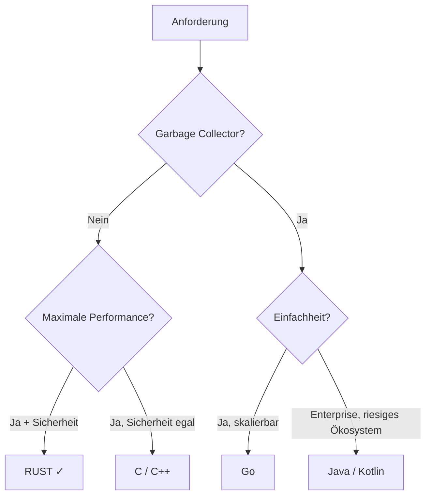
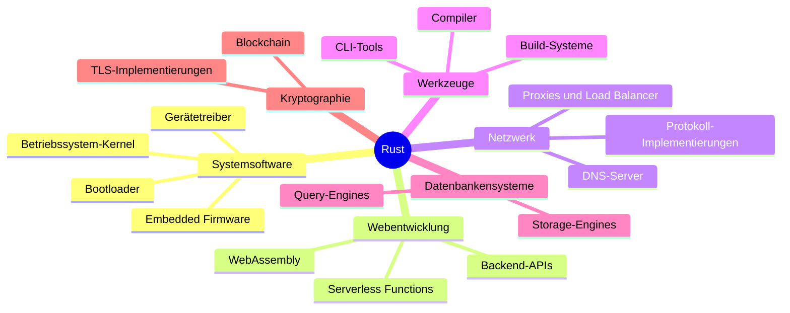

# Kapitel 1: Was ist Rust?

> [!NOTE]
> Dieses Kapitel richtet sich an alle, die verstehen möchten, **warum** Rust existiert, **woher** es kommt und **welche Probleme** es löst. Sie müssen noch keinen einzigen Rust-Code kennen – das Ziel ist zunächst ein klares mentales Bild der Sprache.

---

## Schritt 1: Lernziele & Lernplan

### Lernziele nach der Bloom-Taxonomie

Nach dem Durcharbeiten dieses Kapitels werden Sie in der Lage sein:

1. **Erinnern & Verstehen (Bloom-Stufe 1–2):** Sie können die Geschichte von Rust, die Rolle von Graydon Hoare und Mozilla sowie das Servo-Projekt in eigenen Worten erklären.
2. **Analysieren (Bloom-Stufe 4):** Sie können die Kernziele von Rust – Speichersicherheit, Nebenläufigkeit ohne Datenwettbewerbe und Zero-Cost Abstractions – analysieren und anhand konkreter Beispiele von den Zielen anderer Sprachen (C++, Go, Java) abgrenzen.
3. **Bewerten (Bloom-Stufe 5):** Sie können für ein gegebenes Softwareprojekt begründet entscheiden, ob Rust eine geeignete Sprache ist, und Ihre Entscheidung mit den Stärken und Schwächen von Rust gegenüber Alternativen belegen.

### Lernplan

| Phase | Tätigkeit | Zeit |
|---|---|---|
| Lesen | Kapitel vollständig lesen | 45 Min. |
| Aktives Erinnern | Fragen ohne Spickzettel beantworten | 15 Min. |
| Vertiefung | Feynman-Technik: Stoff einem Freund erklären | 10 Min. |
| Übungen | Drei Übungsaufgaben bearbeiten | 20 Min. |
| Rückblick | Cheat Sheet ansehen & Lücken schließen | 10 Min. |

---

## Schritt 2: Die Definition

### Was ist Rust?

Rust ist eine **systemnah programmierbare, statisch typisierte, kompilierte Programmiersprache**, die **Speichersicherheit ohne Garbage Collector** garantiert. Der offizielle Slogan lautet:

> *"A language empowering everyone to build reliable and efficient software."*

Das ist keine leere Marketingphrase. Rust erreicht Speichersicherheit nicht durch Laufzeitprüfungen (wie ein Garbage Collector in Java oder Go), sondern durch ein revolutionäres **Typsystem**, das zur Kompilierzeit Fehler aufdeckt, die in C oder C++ erst zur Laufzeit – oft Wochen nach dem Deployment – als Sicherheitslücken zutage treten.

Rust ist gleichzeitig:

- **systemnahe Sprache** – Sie können Kernel-Module, Treiber, Embedded-Firmware schreiben
- **Hochsprachenmächtig** – Closures, Iteratoren, Pattern Matching, Traits fühlen sich wie moderne Hochsprachen an
- **ohne Laufzeitsystem** – kein Garbage Collector, kein JIT-Compiler, kein virtueller Maschinenstack

> [!IMPORTANT]
> Rust ist **nicht** objektorientiert im klassischen Sinne. Es gibt keine Vererbungshierarchie wie in Java oder C++. Stattdessen bietet Rust **Traits** (ähnlich Interfaces) und **Komposition** als zentrale Abstraktionsmechanismen.

---

## Schritt 3: Das Problem & Die Motivation

### Warum brauchte die Welt eine neue Systemprogrammiersprache?

Um 2006 war die Welt der Systemprogrammierung fest in zwei Lagern geteilt:

**Lager 1: C und C++**
Jahrzehntelang war C die Sprache der Betriebssysteme, Treiber und Performance-kritischen Anwendungen. C++ fügte Abstraktionen hinzu, blieb aber mit C kompatibel. Das Problem: Beide Sprachen überlassen dem Programmierer die vollständige Kontrolle über den Speicher – und damit auch alle Fehler.

Laut Microsofts Security Response Center stammen **~70% aller CVEs** (Common Vulnerabilities and Exposures) in ihren Produkten aus Speicherfehlern: Use-after-free, Buffer Overflows, dangling Pointers. Dieselbe Statistik zeigt sich bei Googles Chrome-Browser und im Linux-Kernel.

**Lager 2: Garbage-Collected-Sprachen**
Java, C#, Go und Python lösen das Speicherproblem durch automatische Speicherverwaltung. Aber: Ein Garbage Collector pausiert das Programm unvorhersehbar (GC-Pausen), verbraucht zusätzlichen Speicher und macht deterministische Latenz unmöglich. In einem Echtzeitsystem, einem Betriebssystem-Kernel oder einem eingebetteten Mikrocontroller ist das inakzeptabel.

### Das Dilemma

```
Kontrolle & Performance          Sicherheit & Produktivität
       C / C++          <-------->        Java / Go / Python
   (kein GC, schnell)              (GC, sicher, aber langsam/groß)
```

Dieses Dilemma schien unauflösbar. Rust bricht es auf.

### Graydon Hoare und der Fahrstuhl

Die Geschichte beginnt 2006 mit **Graydon Hoare**, einem Softwareentwickler, der zu dieser Zeit für Mozilla arbeitete. Wie er selbst berichtete, stand er in seinem Apartmentgebäude vor einem Fahrstuhl, der aufgrund eines Speicherfehlers in seiner Steuersoftware ständig abstürzte. Der Fahrstuhl-Controller war in C oder C++ geschrieben – und Hoare dachte: *„Das muss besser gehen."*

Er begann Rust als Hobbyprojekt und arbeitete es in seiner Freizeit aus. 2009 übernahm Mozilla das Projekt offiziell und begann, es als Forschungsprojekt zu fördern. Das Ziel: Eine Sprache, die **so schnell wie C++ ist**, aber **so sicher wie Haskell**.

### Mozilla und das Servo-Projekt

Mozilla Research startete 2012 das **Servo-Projekt**: Ein experimenteller Browser-Engine, geschrieben vollständig in Rust. Servo war das erste echte Testfeld für Rust im großen Maßstab. Die Erkenntnisse aus Servo flossen direkt in die Sprachentwicklung zurück.

> [!NOTE]
> Servo wurde entwickelt, um Browser-Engines von Grund auf neuzugestalten – mit paralleler Layout-Berechnung (was in Gecko/Firefox aufgrund von Datenwettbewerben nicht möglich war) und ohne Speicherlecks. Rust machte beides möglich.

2015 erschien Rust **1.0** – die erste stabile Version. Ab diesem Zeitpunkt galt die Garantie: Stabiler Code, der heute funktioniert, wird durch zukünftige Rust-Versionen nicht gebrochen (Backward Compatibility).

### Rust heute

Seit 2016 wird Rust konsistent zur **beliebtesten Programmiersprache** in der Stack Overflow Developer Survey gewählt – und das Jahr für Jahr. Rust-Code findet sich heute in:

- **Linux-Kernel** (seit 2022 offiziell als zweite Sprache neben C akzeptiert)
- **Android-Betriebssystem** (Google schreibt neue Systemkomponenten in Rust)
- **Windows-Kernel** (Microsoft experimentiert mit Rust-Treibern)
- **AWS, Cloudflare, Discord, Dropbox, Meta** (alle setzen Rust in kritischen Infrastrukturprojekten ein)
- **WebAssembly** (Rust ist die meistgenutzte Sprache für WASM-Projekte)

---

## Schritt 4: Der naive Versuch – Fehlerhafter Code in C

Um zu verstehen, warum Rust entstand, betrachten wir zunächst, **welche Fehler Rust verhindert**. Das folgende Beispiel ist in C geschrieben – einer Sprache, die diese Fehler nicht verhindert.

### Beispiel: Use-after-free in C

```c
#include <stdio.h>
#include <stdlib.h>

int main() {
    // Speicher für ein Integer allokieren
    int *zahl = malloc(sizeof(int));
    *zahl = 42;
    
    printf("Wert: %d\n", *zahl);  // Ausgabe: 42
    
    // Speicher freigeben
    free(zahl);
    
    // BUG: Speicher wurde freigegeben, Zeiger wird aber noch verwendet!
    // Dies ist undefined behavior – manchmal funktioniert es,
    // manchmal kommt ein falscher Wert, manchmal ein Crash.
    printf("Nach free: %d\n", *zahl);  // UNDEFINED BEHAVIOR!
    
    return 0;
}
```

Dieser Code ist in C **gültig** – er kompiliert ohne Fehler oder Warnungen. Zur Laufzeit kann er:
- Zufällig den richtigen Wert ausgeben (der Speicher wurde zufällig noch nicht überschrieben)
- Einen falschen Wert ausgeben
- Das Programm zum Absturz bringen
- Eine Sicherheitslücke erzeugen, durch die ein Angreifer Schadcode einschleusen kann

### Beispiel: Buffer Overflow in C

```c
#include <string.h>
#include <stdio.h>

int main() {
    char buffer[10];
    
    // BUG: "Hallo, Welt!" ist 12 Zeichen lang + Nullterminator = 13 Bytes
    // buffer hat nur 10 Bytes – wir schreiben 3 Bytes über das Ende!
    strcpy(buffer, "Hallo, Welt!");
    
    printf("%s\n", buffer);
    
    return 0;
}
```

Buffer Overflows sind die Grundlage klassischer Exploit-Techniken wie Stack Smashing. Sie sind in C leicht zu schreiben und schwer zu erkennen.

> [!CAUTION]
> Diese Fehlerklassen sind **nicht** auf schlecht ausgebildete Entwickler beschränkt. Sie finden sich im Linux-Kernel, in OpenSSL, in Microsoft-Produkten – geschrieben von erfahrensten Systemsprogrammierern weltweit. Das Problem ist strukturell, nicht personell.

---

## Schritt 5: Die Anatomie des Fehlers – Speicherdiagramme

### Was ist ein Dangling Pointer?

```
Vor free():                    Nach free():

Stack:                         Stack:
+----------+                   +----------+
| zahl     |---> Heap:         | zahl     |---> Heap:
+----------+     +------+      +----------+     +------+
                 |  42  |                       | ???? |  ← freigegeben!
                 +------+                       +------+
```

Der Zeiger `zahl` zeigt noch auf die Speicheradresse, obwohl der Speicher bereits freigegeben wurde. Der Heap-Allocator kann diesen Speicher nun für etwas anderes verwenden. Was in diesem Bereich steht, ist undefiniert.

### Was ist ein Buffer Overflow?

```
buffer[10] im Stack:

Adresse:  [0x100] [0x101] [0x102] [0x103] [0x104] [0x105] [0x106] [0x107] [0x108] [0x109]
Inhalt:    'H'     'a'     'l'     'l'     'o'     ','     ' '     'W'     'e'     'l'

Overflow:  [0x10A] [0x10B] [0x10C]
Inhalt:    't'      '!'    '\0'    ← Schreibt über buffer-Ende in fremden Stack-Speicher!
```

Der Overflow überschreibt benachbarte Stack-Variablen, Return-Adressen oder andere kritische Daten.

### Wie verhindert Rust diese Fehler?

Rust hat ein dreiteiliges Schutzsystem:

1. **Ownership** – Jeder Wert hat genau einen Besitzer. Wenn der Besitzer den Scope verlässt, wird der Wert automatisch freigegeben. Kein manuelles `free()` nötig.
2. **Borrowing** – Referenzen können ausgeliehen werden, aber der Compiler prüft, dass kein Verweis auf freigegebenen Speicher existiert.
3. **Lifetimes** – Der Compiler verfolgt, wie lange Referenzen gültig sind, und lehnt Code ab, der Dangling Pointers erzeugen würde.

---

## Schritt 6: Die Lösung – Rust-Code

### Dasselbe Konzept, sicher in Rust

```rust
fn main() {
    // String wird auf dem Heap allokiert
    let s = String::from("Hallo, Welt!");
    
    println!("Wert: {}", s);
    
    // s verlässt den Scope am Ende von main()
    // Rust gibt den Speicher automatisch frei – kein free() nötig
    // Nach diesem Punkt ist s nicht mehr zugänglich
}
// <-- s.drop() wird hier automatisch aufgerufen
```

Versuchen wir, nach dem "freigeben" auf `s` zuzugreifen:

```rust
fn main() {
    let s = String::from("Hallo");
    
    // Ownership wird an 's2' übertragen (Move)
    let s2 = s;
    
    // BUG: s ist jetzt ungültig!
    println!("{}", s); // COMPILER-FEHLER!
}
```

Der Rust-Compiler gibt folgenden Fehler aus:

```
error[E0382]: borrow of moved value: `s`
 --> src/main.rs:7:20
  |
2 |     let s = String::from("Hallo");
  |         - move occurs because `s` has type `String`
4 |     let s2 = s;
  |              - value moved here
7 |     println!("{}", s);
  |                    ^ value borrowed here after move
```

**Dieser Fehler erscheint zur Kompilierzeit** – nicht zur Laufzeit, nicht beim Benutzer, nicht im Produktionssystem. Das ist die fundamentale Stärke von Rust.

### Zero-Cost Abstractions – Das Beste aus beiden Welten

Ein weiteres Kernziel von Rust sind **Zero-Cost Abstractions**. Das Konzept kommt ursprünglich aus C++ (Bjarne Stroustrup: *"What you don't use, you don't pay for"*), aber Rust setzt es konsequenter um.

```rust
// Hochsprachen-Code mit Iteratoren und Closures
fn main() {
    let zahlen = vec![1, 2, 3, 4, 5, 6, 7, 8, 9, 10];
    
    let summe_der_quadrate: i32 = zahlen
        .iter()
        .filter(|&&x| x % 2 == 0)   // Nur gerade Zahlen
        .map(|&x| x * x)              // Quadrieren
        .sum();                        // Summieren
    
    println!("Summe der Quadrate gerader Zahlen: {}", summe_der_quadrate);
    // Ausgabe: 220 (4 + 16 + 36 + 64 + 100)
}
```

Dieser funktionale, hochsprachliche Code wird vom Rust-Compiler in **genau dieselbe Maschinencode-Sequenz** übersetzt wie eine handgeschriebene `for`-Schleife mit einem Array. Es gibt keinen Laufzeit-Overhead für die Abstraktion.

---

## Schritt 7: Kleines Tutorial – Rust verstehen ohne zu installieren

Sie müssen Rust noch nicht installiert haben, um die Kernkonzepte zu verstehen. Dieses Tutorial zeigt Ihnen, wie Sie online erste Experimente machen können.

### Schritt 7.1: Den Rust Playground aufrufen

Besuchen Sie [https://play.rust-lang.org](https://play.rust-lang.org). Dies ist ein offizieller Online-Editor, in dem Sie Rust-Code direkt im Browser ausführen können.

### Schritt 7.2: Ein erstes Programm ausführen

Kopieren Sie folgenden Code in den Editor und klicken Sie auf **Run**:

```rust
fn main() {
    println!("Hallo von Rust!");
    
    // Rust kann den Typ automatisch inferieren
    let x = 5;
    let y = 10;
    let summe = x + y;
    
    println!("{} + {} = {}", x, y, summe);
    
    // Immutabilität ist der Standard
    // x = 7; // Das würde einen Fehler erzeugen!
}
```

**Erwartete Ausgabe:**
```
Hallo von Rust!
5 + 10 = 15
```

### Schritt 7.3: Den Ownership-Mechanismus erleben

Fügen Sie folgenden Code in den Playground ein und beobachten Sie den Compiler-Fehler:

```rust
fn main() {
    let s1 = String::from("Hallo");
    let s2 = s1;  // Ownership wird übertragen
    
    println!("{}", s1);  // Fehler! s1 ist nicht mehr gültig
}
```

Klicken Sie auf **Build** (nicht Run). Sie sehen den Ownership-Fehler. Korrigieren Sie ihn:

```rust
fn main() {
    let s1 = String::from("Hallo");
    let s2 = s1.clone();  // Explizites Klonen – jetzt hat jeder eine Kopie
    
    println!("s1 = {}", s1);  // OK
    println!("s2 = {}", s2);  // OK
}
```

### Schritt 7.4: Immutabilität und Mutabilität

```rust
fn main() {
    let x = 5;
    // x = 6;  // Fehler: x ist nicht mut
    
    let mut y = 5;
    y = 6;  // OK: y ist mut
    println!("y = {}", y);
    
    // Shadowing erlaubt das "Überschreiben" ohne mut
    let z = 5;
    let z = z + 1;  // Neues z, shadowed das alte
    println!("z = {}", z);  // 6
}
```

### Schritt 7.5: Den Rust-Compiler als Tutor nutzen

Der Rust-Compiler ist außergewöhnlich hilfsbereit. Erzeugen Sie absichtlich einen Fehler:

```rust
fn addiere(a: i32, b: i32) -> i32 {
    a + b
}

fn main() {
    let ergebnis = addiere(1, 2, 3);  // Falsche Anzahl Argumente
    println!("{}", ergebnis);
}
```

Der Compiler erklärt genau, was falsch ist und wie es behoben werden kann. Rust ist bekannt dafür, die **besten Fehlermeldungen aller Compiler** zu haben.

---

## Schritt 8: Mentale Modelle & Deep Dive

### 8.1 Rust im Sprachuniversum (ASCII-Art)

```
                    SPRACHUNIVERSUM
    
    Kontrolle  ←──────────────────────→  Sicherheit
    (manuell)                           (automatisch)
    
    Assembly
        │
        C          ← Maximale Kontrolle, maximale Gefahr
        │
       C++          ← Kontrolle + Abstraktionen, aber unsicher
        │
      RUST   ←─── Kontrolle + Sicherheit + Abstraktionen
        │
       Go    ←─── GC, einfach, aber mit Runtime-Overhead
        │
      Java    ←─── JVM, GC, sicher aber schwer
        │
     Python   ←─── Einfach, interpretiert, langsam
    
    Performance ←──────────────────────→  Produktivität
```

### 8.2 Das Rust-Dreieck der Garantien

```
         Speicher-
         sicherheit
             △
            / \
           /   \
          /     \
         /       \
        /  RUST   \
       /───────────\
      /             \
Nebenläufigkeit ──── Performance
  (ohne Data         (Zero-Cost
   Races)           Abstractions)
```

Traditionell musste man zwei der drei Ecken opfern, um die dritte zu erhalten. Rust behauptet, alle drei gleichzeitig zu bieten.

### 8.3 Vergleich: Rust vs. C++ vs. Go vs. Java



### 8.4 Detaillierter Sprachvergleich

#### Rust vs. C++

| Kriterium | C++ | Rust |
|---|---|---|
| **Speichersicherheit** | Manuell, fehleranfällig | Garantiert durch Compiler |
| **Abstraktion** | RAII, Templates, Smart Pointer | Ownership, Traits, Generics |
| **Kompilierzeit** | Meist schneller | Langsamer (strengere Analyse) |
| **Lernkurve** | Sehr steil, viele UB-Fallen | Steil, aber konsistenter |
| **Ökosystem** | Sehr reif (Boost, Qt, etc.) | Wächst rasant (crates.io) |
| **Fehlerbehandlung** | Exceptions (optional, oft deaktiviert) | `Result<T, E>`, kein Panic als default |
| **Null-Pointer** | Möglich (UB) | Unmöglich (`Option<T>` stattdessen) |
| **Data Races** | Möglich | Unmöglich (Compilerfehler) |
| **Interoperabilität** | Ziel | Exzellentes C-FFI |

#### Rust vs. Go

| Kriterium | Go | Rust |
|---|---|---|
| **Lernkurve** | Flach, in Wochen lernbar | Steil, Monate bis Sicherheit |
| **Garbage Collector** | Ja (moderne, geringe Pausen) | Nein |
| **Performance** | Sehr gut, aber GC-Overhead | C++-Niveau |
| **Nebenläufigkeit** | Goroutines (einfach) | async/await + Threads (sicher) |
| **Anwendungsgebiet** | Microservices, Tools, APIs | Systeme, Embedded, WebAssembly |
| **Deployment** | Einzelne Binary (mit Runtime) | Einzelne Binary (ohne Runtime) |
| **Typ-System** | Einfach, structural typing | Algebraische Typen, Traits |

#### Rust vs. Java/Kotlin

| Kriterium | Java/Kotlin | Rust |
|---|---|---|
| **JVM** | Ja | Nein |
| **Startup-Zeit** | Langsam (JVM-Start) | Sofortig |
| **Speicherverbrauch** | Hoch (JVM Overhead) | Minimal |
| **Ökosystem** | Riesig, sehr reif | Wächst, moderner |
| **OOP** | Klassisches OOP | Traits + Komposition |
| **Null-Safety** | Kotlin: Ja; Java: Nur Optional | Ja, durch `Option<T>` |
| **Anwendungsgebiet** | Enterprise, Android, Backend | Systeme, Embedded, WASM, Backend |

### 8.5 Die Kernziele im Detail

#### Zero-Cost Abstractions

Das Konzept "Zero-Cost Abstractions" bedeutet:

```
Hochsprachiger Rust-Code:       Generierter Maschinencode:
┌─────────────────────┐         ┌────────────────────────┐
│ zahlen               │         │ mov eax, 0             │
│   .iter()            │  ──→   │ loop:                  │
│   .filter(|x| ...)   │         │   cmp [rsi+rax*4], 2   │
│   .map(|x| x*x)      │         │   jne skip             │
│   .sum()             │         │   mov ecx, [rsi+rax*4] │
└─────────────────────┘         │   imul ecx, ecx        │
                                 │   add edx, ecx         │
                                 │   skip: inc eax        │
                                 │   cmp eax, len         │
                                 │   jl loop              │
                                 └────────────────────────┘
```

Der Iterator-Chain wird vollständig **inline-expandiert** und optimiert. Es entsteht kein Overhead durch Funktionsaufrufe, Heap-Allokationen oder virtuelle Dispatch-Tabellen.

#### Fearless Concurrency

Rust nennt sein Nebenläufigkeitsmodell "Fearless Concurrency". Der Compiler verhindert Data Races zur Kompilierzeit:

```rust
use std::thread;

fn main() {
    let daten = vec![1, 2, 3, 4, 5];
    
    // Rust erkennt, dass wir daten in zwei Threads gleichzeitig nutzen wollen
    let handle1 = thread::spawn(|| {
        // Fehler! daten wurde in den Thread gemoved oder es gibt Data Race
        println!("{:?}", daten);
    });
    
    let handle2 = thread::spawn(|| {
        println!("{:?}", daten);  // Fehler! daten kann nicht zweimal bewegt werden
    });
    
    handle1.join().unwrap();
    handle2.join().unwrap();
}
```

Lösung mit unveränderlichem Teilen über `Arc`:

```rust
use std::sync::Arc;
use std::thread;

fn main() {
    let daten = Arc::new(vec![1, 2, 3, 4, 5]);
    
    let daten1 = Arc::clone(&daten);
    let daten2 = Arc::clone(&daten);
    
    let handle1 = thread::spawn(move || {
        println!("Thread 1: {:?}", daten1);
    });
    
    let handle2 = thread::spawn(move || {
        println!("Thread 2: {:?}", daten2);
    });
    
    handle1.join().unwrap();
    handle2.join().unwrap();
}
```

### 8.6 Anwendungsgebiete von Rust



#### Konkrete Beispiele aus der Industrie

**Cloudflare:** Hat seinen DNS-Server `1.1.1.1` teilweise in Rust reimplementiert. Ergebnis: 40% weniger Speicherverbrauch, keine Speichersicherheitslücken mehr.

**Discord:** Hat seinen Read-States-Dienst von Go nach Rust migriert. Ergebnis: Latenz sank von Millisekunden auf Mikrosekunden, GC-Pausen wurden eliminiert, Speicherverbrauch sank von 10 GB auf 1.5 GB.

**Dropbox:** Hat seine Datensynchronisations-Engine "Nucleus" in Rust geschrieben. Ergebnis: 50% weniger CPU-Nutzung im Vergleich zur Go-Implementierung.

**Mozilla Firefox:** Teile der Browser-Engine sind nun in Rust geschrieben (CSS-Engine Stylo, Media-Decoder). Ergebnis: Weniger Sicherheitslücken, bessere Performance.

**Linux-Kernel:** Seit Kernel 6.1 (Dezember 2022) ist Rust als zweite offizielle Sprache für Kernel-Entwicklung akzeptiert. Neue Treiber können in Rust geschrieben werden.

---

## Schritt 9: Drei Übungen

### Übung 1 (Leicht): Rust-Faktencheck

Beantworten Sie die folgenden Fragen aus dem Gedächtnis (ohne zurückzublättern):

1. Wer hat Rust erfunden, und in welchem Jahr begann die Entwicklung?
2. Was ist der Unterschied zwischen einem Garbage Collector und Rusts Ownership-System?
3. Was bedeutet "Zero-Cost Abstractions"?
4. Nennen Sie drei Anwendungsgebiete von Rust.
5. Was war das Servo-Projekt, und welche Bedeutung hatte es für Rust?

> [!TIP]
> **Hint:** Schauen Sie sich erst nach dem Beantworten die Antworten im Kapitel an. Aktives Erinnern ist effektiver als passives Lesen. Schreiben Sie Ihre Antworten auf Papier.

**Erwartete Antworten (Kontrolle):**
1. Graydon Hoare, 2006 (als Hobbyprojekt)
2. GC läuft zur Laufzeit und pausiert das Programm. Ownership ist eine Kompilierzeit-Garantie ohne Laufzeit-Overhead.
3. Hochsprachige Abstraktionen (Iteratoren, Closures etc.) erzeugen denselben Maschinencode wie manuell geschriebener Low-Level-Code.
4. Systemsoftware, WebAssembly, Netzwerkanwendungen, CLI-Tools, Datenbanken, Embedded Systems
5. Ein experimenteller Browser-Engine-Prototyp bei Mozilla, der als erstes großes Testfeld für Rust diente.

---

### Übung 2 (Mittel): Sprachen-Entscheidungsmatrix

Sie arbeiten als Architekt und müssen für drei verschiedene Projekte eine Sprache wählen. Analysieren Sie jedes Projekt und begründen Sie Ihre Wahl:

**Projekt A:** Ein Microservice für eine E-Commerce-Plattform, der Produktdaten als REST-API bereitstellt. Das Team besteht aus 10 Junior-Entwicklern. Time-to-Market ist kritisch.

**Projekt B:** Ein eingebettetes Steuerungssystem für medizinische Geräte (Insulinpumpe). Speicher ist auf 256 KB begrenzt, kein Betriebssystem vorhanden. Korrektheit ist absolut kritisch.

**Projekt C:** Ein Kommandozeilen-Tool zum Parsen und Transformieren von großen CSV-Dateien (mehrere GB). Performance ist wichtig, das Tool wird von einem einzelnen Entwickler geschrieben.

> [!TIP]
> **Hint:** Es gibt keine einzig richtige Antwort. Denken Sie an: Lernkurve, Teamgröße, Speicheranforderungen, Sicherheitsanforderungen, Ökosystem-Reifegrad.

**Musterantworten:**
- **Projekt A:** Go oder Java/Spring – einfache Lernkurve, riesiges Ökosystem für REST-APIs, Juniorfreundlich. Rust wäre überdimensioniert.
- **Projekt B:** Rust oder C – kein GC, kein Betriebssystem nötig. Rust ist gegenüber C vorzuziehen wegen der Sicherheitsgarantien in einem medizinischen Kontext.
- **Projekt C:** Rust – exzellente Performance, kein GC, ideales Ökosystem für CLI-Tools (`clap`, `csv`-Crate). Ein einzelner erfahrener Entwickler kann die Lernkurve meistern.

---

### Übung 3 (Schwer): Fehleranalyse und Übersetzung

Analysieren Sie den folgenden C-Code. Identifizieren Sie alle Speicherfehler und schreiben Sie dann eine konzeptuell äquivalente Rust-Version, die diese Fehler verhindert.

**C-Code:**

```c
#include <stdio.h>
#include <stdlib.h>
#include <string.h>

typedef struct {
    char* name;
    int alter;
} Person;

Person* erstelle_person(const char* name, int alter) {
    Person* p = malloc(sizeof(Person));
    p->name = malloc(strlen(name) + 1);
    strcpy(p->name, name);
    p->alter = alter;
    return p;
}

void druecke_aus(Person* p) {
    printf("Name: %s, Alter: %d\n", p->name, p->alter);
}

int main() {
    Person* p1 = erstelle_person("Alice", 30);
    Person* p2 = p1;  // Beide zeigen auf dasselbe Objekt!
    
    druecke_aus(p1);
    
    free(p1->name);
    free(p1);
    
    // BUG: p2 ist jetzt ein dangling pointer!
    druecke_aus(p2);  // Undefined behavior
    
    // BUG: Doppeltes free!
    free(p2->name);
    free(p2);
    
    return 0;
}
```

> [!TIP]
> **Hints:**
> - Rust-Structs können `String` (statt `char*`) verwenden
> - Ownership macht das "beide zeigen auf dasselbe Objekt"-Problem unmöglich
> - Implementieren Sie `Display` für Ihren Struct (oder verwenden Sie `#[derive(Debug)]`)
> - `drop()` wird automatisch aufgerufen

**Musterlösung Rust:**

```rust
#[derive(Debug)]
struct Person {
    name: String,
    alter: u32,
}

impl Person {
    fn neu(name: &str, alter: u32) -> Person {
        Person {
            name: name.to_string(),
            alter,
        }
    }
    
    fn ausgeben(&self) {
        println!("Name: {}, Alter: {}", self.name, self.alter);
    }
}

// Drop wird automatisch implementiert für String und Person
// Kein manuelles free() notwendig

fn main() {
    let p1 = Person::neu("Alice", 30);
    
    p1.ausgeben();
    
    // let p2 = p1;  // Das würde p1 ungültig machen
    // p1.ausgeben(); // Compilerfehler!
    
    // Stattdessen: Referenz ausleihen
    let referenz = &p1;
    referenz.ausgeben();  // OK – p1 bleibt Besitzer
    
    // p1 wird am Ende von main automatisch freigegeben
    // Doppeltes free ist unmöglich
}
```

---

## Schritt 10: Lernstrategie & Merkzettel

### 10.1 Cheat Sheet – Rust auf einen Blick

```
┌─────────────────────────────────────────────────────────────┐
│                    RUST CHEAT SHEET – Kapitel 1             │
├─────────────────────────────────────────────────────────────┤
│ GESCHICHTE                                                   │
│  • 2006: Graydon Hoare beginnt Rust als Hobbyprojekt        │
│  • 2009: Mozilla übernimmt das Projekt                      │
│  • 2012: Servo-Projekt startet (Browser-Engine in Rust)     │
│  • 2015: Rust 1.0 – erste stabile Version                   │
│  • 2022: Rust im Linux-Kernel                               │
├─────────────────────────────────────────────────────────────┤
│ KERNZIELE                                                    │
│  1. Speichersicherheit ohne GC (Ownership + Borrowing)      │
│  2. Nebenläufigkeit ohne Data Races (Fearless Concurrency)  │
│  3. Zero-Cost Abstractions (Performance wie C/C++)          │
├─────────────────────────────────────────────────────────────┤
│ FEHLER DIE RUST VERHINDERT                                  │
│  • Use-after-free        • Buffer Overflow                  │
│  • Dangling Pointers     • Double Free                      │
│  • Null Pointer Deref    • Data Races                       │
├─────────────────────────────────────────────────────────────┤
│ RUST VS. ALTERNATIVEN                                       │
│  vs. C/C++:  Sicherer, aber ähnliche Performance           │
│  vs. Go:     Kein GC, komplexer, schneller                  │
│  vs. Java:   Kein JVM, kleiner Footprint, schneller        │
├─────────────────────────────────────────────────────────────┤
│ ANWENDUNGSGEBIETE                                           │
│  • Betriebssysteme & Treiber  • WebAssembly                 │
│  • Embedded Systems           • CLI-Tools                   │
│  • Netzwerk-Software          • Datenbanken                 │
└─────────────────────────────────────────────────────────────┘
```

### 10.2 Active Recall – Fragen für die Spaced Repetition

Speichern Sie diese Fragen in Ihrem Anki-Deck oder schreiben Sie sie auf Karteikarten:

| Vorderseite (Frage) | Rückseite (Antwort) |
|---|---|
| Wer erfand Rust und wann? | Graydon Hoare, 2006 als Hobbyprojekt |
| Wann erschien Rust 1.0? | 2015 |
| Was ist das Servo-Projekt? | Experimenteller Browser-Engine in Rust, Testfeld für die Sprache |
| Was bedeutet "Zero-Cost Abstractions"? | Hochsprachige Abstraktionen erzeugen denselben Code wie Low-Level-Code |
| Was verhindert Rust, das C nicht verhindert? | Use-after-free, Buffer Overflow, Dangling Pointers, Data Races |
| Warum kein Garbage Collector in Rust? | GC erzeugt Laufzeit-Overhead und Pausen – inkompatibel mit Systemprogrammierung |
| Was ist "Fearless Concurrency"? | Data Races werden zur Kompilierzeit ausgeschlossen |
| Rust im Linux-Kernel: Seit wann? | Seit Kernel 6.1, Dezember 2022 |

### 10.3 Feynman-Technik: Rust einfach erklären

Versuchen Sie, die folgende Erklärung einem Zwölfjährigen zu geben (ohne Fachbegriffe):

> *"Stellen Sie sich vor, Sie leihen Ihrem Freund Ihr Fahrrad. In den meisten Programmiersprachen können Sie das Fahrrad auch noch fahren, während Ihr Freund es hat – und dann stürzen beide. Rust sagt: 'Entweder fährst DU das Fahrrad, oder DEIN FREUND – aber nie beide gleichzeitig.' Der Lehrer (Compiler) prüft das, bevor Sie losfahren, nicht erst wenn Sie gefallen sind."*

Schreiben Sie Ihre eigene Analogie in zwei bis drei Sätzen auf. Das Verbalisieren des Konzepts festigt es im Langzeitgedächtnis.

### 10.4 Vertiefungsressourcen

- **Offizielle Dokumentation:** [The Rust Book](https://doc.rust-lang.org/book/) – kostenlos online
- **Interaktiv lernen:** [Rustlings](https://github.com/rust-lang/rustlings) – kleine Übungsaufgaben
- **Spielen:** [Rust Playground](https://play.rust-lang.org) – Code direkt im Browser testen
- **Tiefer eintauchen:** [Rust by Example](https://doc.rust-lang.org/rust-by-example/) – Konzepte durch Beispiele

---

## Schritt 11: Zusammenfassung

Rust ist eine Systemprogrammiersprache, die das scheinbar unlösbare Dilemma zwischen **Kontrolle/Performance** und **Sicherheit/Produktivität** auflöst.

**Entstehung:** 2006 von Graydon Hoare als Reaktion auf die allgegenwärtigen Speicherfehler in Systemprogrammen entwickelt. Mozilla übernahm das Projekt 2009 und nutzte es für den experimentellen Browser-Engine Servo. 2015 erschien Rust 1.0.

**Die drei Kernziele:**
1. **Speichersicherheit ohne Garbage Collector** – durch das Ownership-System, das zur Kompilierzeit prüft, dass kein Speicher falsch verwendet wird
2. **Fearless Concurrency** – Datenwettbewerbe sind durch das Typsystem zur Kompilierzeit ausgeschlossen
3. **Zero-Cost Abstractions** – hochsprachige Features erzeugen keinen Laufzeit-Overhead

**Fehlerklassen, die Rust verhindert:** Use-after-free, Buffer Overflow, Dangling Pointers, Double Free, Null Pointer Dereferenzierung, Data Races.

**Wann Rust wählen?**
- Wenn Performance auf C/C++-Niveau benötigt wird
- Wenn Speichersicherheit kritisch ist (medizinisch, sicherheitskritisch)
- Wenn kein Garbage Collector möglich ist (Embedded, Kernel, Echtzeit)
- Wenn Sie WebAssembly entwickeln
- Wenn Sie Lust haben, eine modern designte Sprache zu lernen

**Wann eine Alternative wählen?**
- Schnelle Prototypen: Python
- Großes Enterprise-Ökosystem nötig: Java/Kotlin
- Einfache Microservices mit einem großen Team: Go
- Maximale Interoperabilität mit C++-Code: C++

> [!NOTE]
> Im nächsten Kapitel werden Sie Rust auf Ihrem System installieren und Ihre Entwicklungsumgebung einrichten. Sie lernen `rustup`, den Versions-Manager für Rust, und konfigurieren alle notwendigen Tools.

---

**Lizenz- und Attributionshinweis**: Teile dieses Kapitels basieren auf Übersetzungen des offiziellen Buches [The Rust Programming Language](https://doc.rust-lang.org/book/) von Steve Klabnik und Carol Nichols, lizenziert unter [MIT](https://opensource.org/licenses/MIT) und [Apache 2.0](https://www.apache.org/licenses/LICENSE-2.0).
