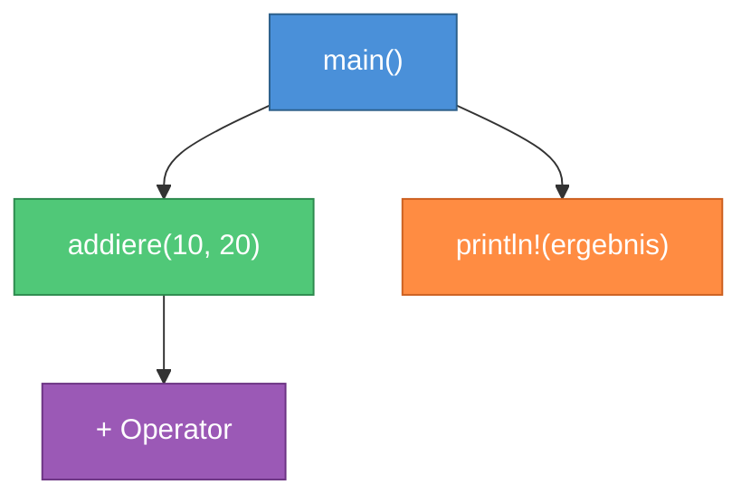
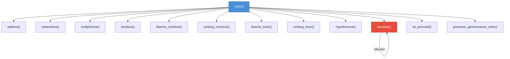

# Kapitel 10: Funktionen in Rust

> [!IMPORTANT]
> Dieses Kapitel behandelt eines der fundamentalsten Konzepte in Rust: **Funktionen**. Sie werden lernen, wie Sie Code strukturieren, wiederverwenden und verständlich machen – und dabei eines der subtilsten aber wichtigsten Rust-Konzepte verstehen: den Unterschied zwischen **Statements** und **Expressions**.

---

## Schritt 1: Lernziele & Lernplan

Bevor Sie in die Materie einsteigen, ist es wichtig, sich über die Lernziele klar zu werden. Die folgenden Ziele orientieren sich an der **Bloom'schen Taxonomie** – einem bewährten Rahmenwerk zur Klassifizierung kognitiver Lernleistungen.

### 1.1 Lernziele nach Bloom

| Bloom-Stufe | Lernziel | Beschreibung |
|---|---|---|
| **Verstehen** | Funktionssignaturen lesen und erklären | Sie können eine beliebige Rust-Funktionssignatur lesen und auf Deutsch erklären, was die Funktion erwartet und zurückgibt. |
| **Anwenden** | Eigene Funktionen schreiben | Sie können selbstständig Funktionen mit Parametern, Typen und Rückgabewerten verfassen, ohne auf Hilfsmittel zurückzugreifen. |
| **Analysieren** | Statements vs. Expressions unterscheiden | Sie können in beliebigem Rust-Code jeden Ausdruck und jede Anweisung korrekt klassifizieren und begründen, warum ein Semikolon einen Rückgabewert „vernichtet". |
| **Evaluieren** | Compiler-Fehler diagnostizieren | Sie können typische Compilerfehler rund um Rückgabetypen (`mismatched types`, `expected X found ()`) eigenständig analysieren und beheben. |
| **Erschaffen** | Kleine Bibliothek mathematischer Hilfsfunktionen | Sie erstellen eine modulare, gut dokumentierte Sammlung von Rust-Funktionen, die in einem echten Projekt verwendbar wäre. |

### 1.2 Lernplan & Roadmap

Die folgende Roadmap zeigt Ihnen den Weg durch dieses Kapitel. Haken Sie jeden Schritt ab, sobald Sie ihn abgeschlossen haben:

```
LERNPLAN: Kapitel 10 – Funktionen
══════════════════════════════════════════════════════════

 Phase 1: Grundlagen (ca. 30 Minuten)
 ──────────────────────────────────────
 ☐ 1. Was ist eine Funktion? (Abschnitt 2)
 ☐ 2. fn-Schlüsselwort und snake_case verstehen
 ☐ 3. Motivation und Nutzen von Funktionen (Abschnitt 3)

 Phase 2: Fehler verstehen (ca. 20 Minuten)
 ──────────────────────────────────────────
 ☐ 4. Naiven (fehlerhaften) Code analysieren (Abschnitt 4)
 ☐ 5. Compiler-Ausgabe verstehen (Abschnitt 5)
 ☐ 6. Korrekten Code schreiben (Abschnitt 6)

 Phase 3: Kernkonzept (ca. 40 Minuten)
 ──────────────────────────────────────
 ☐ 7. Statements vs. Expressions tief verstehen (Abschnitt 8)
 ☐ 8. Das Semikolon-Prinzip verinnerlichen
 ☐ 9. Stack-Frame-Modell verstehen

 Phase 4: Praxis (ca. 45 Minuten)
 ──────────────────────────────────
 ☐ 10. Tutorial: Mathematische Bibliothek aufbauen (Abschnitt 7)
 ☐ 11. Drei Übungsaufgaben lösen (Abschnitt 9)

 Phase 5: Konsolidierung (ca. 15 Minuten)
 ──────────────────────────────────────────
 ☐ 12. Cheat Sheet durcharbeiten (Abschnitt 10)
 ☐ 13. Active Recall: Alle Fragen beantworten
 ☐ 14. Zusammenfassung lesen

 Geschätzte Gesamtdauer: ~2,5 Stunden
══════════════════════════════════════════════════════════
```

### 1.3 Voraussetzungen

Für dieses Kapitel sollten Sie bereits folgendes kennen:

- **Variablen** (`let`, `let mut`) aus Kapitel 5
- **Skalare Datentypen** (`i32`, `f64`, `bool`, `char`) aus Kapitel 6
- **Arrays und Tupel** aus Kapitel 8
- **Das Konzept des Kompilierens** – Rust ist eine kompilierte Sprache

> [!NOTE]
> Falls Sie bei einem der oben genannten Themen Unsicherheiten haben, empfehlen wir Ihnen, die entsprechenden Kapitel nochmals zu wiederholen, bevor Sie hier weiterlesen. Funktionen bauen auf diesen Grundlagen auf.

---

## Schritt 2: Die Definition – Was ist eine Funktion in Rust?

### 2.1 Der Begriff „Funktion"

Eine **Funktion** ist eine benannte, abgeschlossene Einheit von Code, die eine bestimmte Aufgabe erfüllt. Man kann sie sich wie ein Werkzeug in einem Werkzeugkasten vorstellen: Sie definieren das Werkzeug einmal und verwenden es beliebig oft an unterschiedlichen Stellen Ihres Programms.

In der Mathematik kennen Sie Funktionen bereits: `f(x) = x² + 1` beschreibt eine Zuordnung, bei der jeder Eingabe `x` genau ein Ausgabewert `x² + 1` zugeordnet wird. Rust-Funktionen funktionieren ähnlich, können aber auch Nebeneffekte haben (z.B. Text ausgeben, auf Dateien schreiben).

### 2.2 Das `fn`-Schlüsselwort

In Rust werden Funktionen mit dem Schlüsselwort **`fn`** (Abkürzung für *function*) deklariert. Die grundlegende Struktur lautet:

```rust
fn funktionsname() {
    // Funktionskörper
}
```

Das ist die einfachste mögliche Funktion: Sie hat keinen Namen mit informativer Bedeutung (den sollten Sie natürlich sinnvoll wählen), keine Parameter und keinen expliziten Rückgabewert.

### 2.3 Die snake_case-Konvention

Rust verwendet für Funktionsnamen (und Variablennamen) **snake_case**: alle Buchstaben kleingeschrieben, Wörter durch Unterstriche getrennt.

| ✅ Korrekt (snake_case) | ❌ Falsch (andere Stile) |
|---|---|
| `berechne_summe` | `BerechneSumme` (PascalCase – für Structs) |
| `erstelle_benutzerprofil` | `ErstelleBenutzerprofil` |
| `berechne_flaeche_rechteck` | `berechneFlaeche` (camelCase – für andere Sprachen) |
| `parse_eingabe` | `ParseEingabe` |

> [!NOTE]
> Der Rust-Compiler wird Sie **warnen** (aber nicht mit einem Fehler abbrechen), wenn Sie keine snake_case-Benennung verwenden. Die Warnung lautet: `warning: function `MeineFunktion` should have a snake case name`. Es ist eine starke Konvention in der Rust-Community, diese Warnung ernst zu nehmen.

### 2.4 Die vollständige Anatomie einer Funktion

```rust
fn berechne_summe(x: i32, y: i32) -> i32 {
    x + y
}
```

Zerlegen wir diese Funktion in ihre Bestandteile:

```
fn berechne_summe ( x: i32 , y: i32 ) -> i32 { x + y }
│  │               │ │  │    │  │    │    │   │ │     │
│  │               │ │  │    │  │    │    │   │ └─────┘
│  │               │ │  │    │  │    │    │   │   Funktionskörper
│  │               │ │  │    │  │    │    │   └── Öffnende geschweifte Klammer
│  │               │ │  │    │  │    │    └────── Rückgabetyp
│  │               │ │  │    │  │    └─────────── Rückgabe-Pfeil
│  │               │ │  │    │  └──────────────── Typ des 2. Parameters
│  │               │ │  │    └─────────────────── Name des 2. Parameters
│  │               │ │  └──────────────────────── Typ des 1. Parameters
│  │               │ └─────────────────────────── Name des 1. Parameters
│  │               └───────────────────────────── Parameterliste (Klammern)
│  └───────────────────────────────────────────── Funktionsname
└──────────────────────────────────────────────── fn-Schlüsselwort
```

### 2.5 Wo können Funktionen deklariert werden?

In Rust können Funktionen an verschiedenen Stellen im Code definiert werden:

**1. Auf der obersten Ebene (global)** – Das ist die häufigste und empfohlene Variante:

```rust
fn main() {
    begruessung();
}

fn begruessung() {
    println!("Willkommen in Rust!");
}
```

> [!NOTE]
> Anders als in C oder C++ müssen Sie in Rust Funktionen **nicht** deklarieren, bevor Sie sie aufrufen. Rust „sieht" alle Funktionen in einer Datei, egal in welcher Reihenfolge sie definiert sind. Sie können `main()` also am Anfang der Datei schreiben und alle Hilfsfunktionen darunter – das ist sogar ein häufiger und empfohlener Stil.

**2. Innerhalb einer anderen Funktion (verschachtelt)** – Möglich, aber selten:

```rust
fn main() {
    fn interne_funktion() {
        println!("Ich bin nur in main() sichtbar!");
    }

    interne_funktion(); // Funktioniert
}

// interne_funktion(); // FEHLER! Außerhalb von main() nicht sichtbar
```

Verschachtelte Funktionen sind keine Closures (die lernen Sie in einem späteren Kapitel). Sie haben keinen Zugriff auf die lokalen Variablen der äußeren Funktion – sie sind nur in ihrem Sichtbarkeitsbereich sichtbar.

---

## Schritt 3: Das Problem & Die Motivation – Warum brauchen wir Funktionen?

### 3.1 Das Problem: Code-Wiederholung

Stellen Sie sich vor, Sie schreiben ein Programm, das mehrfach den Flächeninhalt eines Rechtecks berechnen muss:

```rust
fn main() {
    // Erstes Rechteck
    let breite1 = 10;
    let hoehe1 = 5;
    let flaeche1 = breite1 * hoehe1;
    println!("Fläche 1: {} Quadratmeter", flaeche1);

    // Zweites Rechteck
    let breite2 = 7;
    let hoehe2 = 3;
    let flaeche2 = breite2 * hoehe2;
    println!("Fläche 2: {} Quadratmeter", flaeche2);

    // Drittes Rechteck
    let breite3 = 15;
    let hoehe3 = 8;
    let flaeche3 = breite3 * hoehe3;
    println!("Fläche 3: {} Quadratmeter", flaeche3);
}
```

Dieser Code funktioniert, hat aber mehrere ernste Probleme:

**Problem 1: DRY-Verletzung (Don't Repeat Yourself)**
Die Berechnungslogik (`breite * hoehe`) und das Ausgabeformat (`"Fläche X: {} Quadratmeter"`) werden dreimal wiederholt. Bei einer Änderung (z.B. soll die Einheit von „Quadratmeter" zu „m²" geändert werden) müssen Sie **drei Stellen** anpassen – und riskieren, eine zu vergessen.

**Problem 2: Schlechte Testbarkeit**
Wie testen Sie, ob die Berechnung korrekt ist? Sie müssten das gesamte Programm ausführen und die Ausgabe manuell prüfen. Eine isolierte Funktion kann mit automatisierten Tests überprüft werden.

**Problem 3: Schlechte Lesbarkeit**
Beim Lesen des Codes muss der Leser die Bedeutung von `breite1 * hoehe1` jedes Mal neu erschließen. Ein Funktionsname wie `berechne_flaeche(breite, hoehe)` kommuniziert die Absicht sofort.

**Problem 4: Keine Wiederverwendung**
Wenn ein anderes Modul oder Programm die gleiche Berechnung benötigt, muss der Code kopiert werden (Copy-Paste-Programmierung – ein Albtraum in der Wartung).

### 3.2 Die Lösung: Funktionen

```rust
fn berechne_flaeche(breite: i32, hoehe: i32) -> i32 {
    breite * hoehe
}

fn gib_flaeche_aus(breite: i32, hoehe: i32) {
    let flaeche = berechne_flaeche(breite, hoehe);
    println!("Fläche: {} Quadratmeter", flaeche);
}

fn main() {
    gib_flaeche_aus(10, 5);
    gib_flaeche_aus(7, 3);
    gib_flaeche_aus(15, 8);
}
```

Jetzt gilt:
- **Eine Stelle** für die Berechnungslogik – eine Änderung wirkt sich überall aus
- **Testbar** – `berechne_flaeche(4, 5)` kann isoliert getestet werden
- **Lesbar** – Der Code in `main()` liest sich wie Prosa
- **Wiederverwendbar** – `berechne_flaeche` kann von überall aufgerufen werden

### 3.3 Die drei Säulen der Funktionen

```
┌─────────────────────────────────────────────────────────┐
│                   WOZU FUNKTIONEN?                       │
├─────────────────┬───────────────────┬───────────────────┤
│  WIEDERVERW.    │   ABSTRAKTION     │   TESTBARKEIT     │
├─────────────────┼───────────────────┼───────────────────┤
│ • Code einmal   │ • Komplexität     │ • Einzelne        │
│   schreiben,    │   verstecken      │   Teile isoliert  │
│   viele Male    │ • Lesbarkeit      │   testen          │
│   aufrufen      │   verbessern      │ • Bugs schneller  │
│ • DRY-Prinzip   │ • Namen geben     │   finden          │
│   einhalten     │   bedeutungsvoll  │ • Vertrauen in    │
│                 │   wählen          │   den Code        │
└─────────────────┴───────────────────┴───────────────────┘
```

> [!TIP]
> Eine gute Faustregel: Wenn Sie denselben Code-Block **zweimal** schreiben, schreiben Sie ihn als Funktion. Wenn eine Funktion mehr als **20-30 Zeilen** hat, überlegen Sie, ob sie in kleinere Funktionen aufgeteilt werden kann.

---

## Schritt 4: Der naive Versuch – Fehlerhafter Code

Um wirklich zu verstehen, wie Rust-Funktionen korrekt geschrieben werden, ist es äußerst lehrreich, zuerst typische Fehler zu sehen. Denn der Rust-Compiler ist berühmt für seine ausgezeichneten Fehlermeldungen.

### 4.1 Fehler 1: Fehlende Typ-Annotationen bei Parametern

```rust
// FEHLER: Fehlende Typannotationen
fn addiere(x, y) -> i32 {
    x + y
}

fn main() {
    let ergebnis = addiere(3, 4);
    println!("Ergebnis: {}", ergebnis);
}
```

**Was der Programmierer dachte:** „Rust kann doch Typen inferieren – warum nicht auch bei Parametern?"

**Was der Compiler sagt:**
```
error: expected one of `:`, `@`, or `|`, found `,`
 --> src/main.rs:2:15
  |
2 | fn addiere(x, y) -> i32 {
  |               ^ expected one of `:`, `@`, or `|`
  |
  = note: anonymous parameters are removed in the 2018 edition (see RFC 1685)
```

**Warum dieser Fehler?** Rust erfordert explizite Typannotationen für **alle** Funktionsparameter. Das ist eine bewusste Design-Entscheidung: Funktionssignaturen sollen als Dokumentation dienen. Wenn jemand Ihren Code liest, soll er sofort sehen, welche Typen erwartet werden – ohne den gesamten Funktionskörper zu analysieren.

### 4.2 Fehler 2: Mehrere Parameter mit gemeinsamem Typ falsch schreiben

```rust
// FEHLER: Typ nur einmal für beide Parameter angegeben
fn multipliziere(x, y: i32) -> i32 {
    x * y
}
```

**Was der Programmierer dachte:** „Wenn beide `i32` sind, kann ich das doch zusammenfassen!"

**Rust erlaubt das nicht.** Jeder Parameter braucht seine eigene Typannotation:

```rust
// RICHTIG: Typ für jeden Parameter einzeln
fn multipliziere(x: i32, y: i32) -> i32 {
    x * y
}
```

> [!IMPORTANT]
> Im Gegensatz zu manchen anderen Sprachen (wie TypeScript mit `function f(x, y: number)`) müssen Sie in Rust den Typ **für jeden Parameter einzeln** angeben. `(x, y: i32)` ist ein Syntaxfehler. Es muss `(x: i32, y: i32)` sein.

### 4.3 Fehler 3: Semikolon beim Rückgabewert

Dies ist **der häufigste Anfängerfehler in Rust** und verdient besondere Aufmerksamkeit:

```rust
// FEHLER: Semikolon beim letzten Ausdruck
fn fuenf() -> i32 {
    5; // Fehler! Das Semikolon macht aus der Expression ein Statement
}

fn main() {
    let x = fuenf();
    println!("x = {}", x);
}
```

**Was der Compiler sagt:**
```
error[E0308]: mismatched types
 --> src/main.rs:2:14
  |
1 | fn fuenf() -> i32 {
  |    -----    ^^^
  |    |        |
  |    |        expected `i32` because of return type
  |    this function's body doesn't return a value of the expected type
2 |     5;
  |      ^ help: consider removing this semicolon
  |
  = note: expected type `i32`
             found type `()`
```

Beachten Sie: Der Compiler erkennt das Problem und gibt sogar den Hinweis: **„consider removing this semicolon"**. Das ist Rust's berühmte Freundlichkeit in Fehlermeldungen.

### 4.4 Fehler 4: Rückgabetyp vergessen

```rust
// FEHLER: Rückgabetyp nicht deklariert, aber Wert zurückgegeben
fn quadrat(x: i32) {
    x * x // Rust erwartet (), erhält aber i32
}
```

**Was der Compiler sagt:**
```
error[E0308]: mismatched types
 --> src/main.rs:2:5
  |
1 | fn quadrat(x: i32) {
  |                    ^ implicitly returns `()` as its body has no tail or `return` expression
2 |     x * x
  |     ^^^^^ expected `()`, found `i32`
```

### 4.5 Fehler 5: Falscher Typ im Rückgabewert

```rust
// FEHLER: Rückgabetyp ist f64, aber es wird i32 zurückgegeben
fn halbiere(x: f64) -> i32 {
    x / 2.0
}
```

**Was der Compiler sagt:**
```
error[E0308]: mismatched types
 --> src/main.rs:2:5
  |
1 | fn halbiere(x: f64) -> i32 {
  |                        ^^^ expected due to this return type
2 |     x / 2.0
  |     ^^^^^^^ expected `i32`, found `f64`
```

---

## Schritt 5: Die Anatomie des Fehlers

Lassen Sie uns die Compiler-Fehlermeldungen systematisch verstehen, denn das ist eine Fähigkeit, die Sie in Ihrer gesamten Rust-Karriere täglich benötigen.

### 5.1 Aufbau einer Rust-Fehlermeldung

```
error[E0308]: mismatched types
│     │        │
│     │        └── Fehlerbeschreibung (in natürlicher Sprache)
│     └─────────── Fehlercode (durchsuchbar auf doc.rust-lang.org/error_codes)
└───────────────── Schweregrad (error = Kompilierung schlägt fehl, warning = Warnung)

 --> src/main.rs:2:14
 │    │           │  └── Spalte
 │    │           └───── Zeile
 │    └───────────────── Dateiname
 └────────────────────── Pfeil zeigt auf Position

  |
2 |     5;
  |      ^ help: consider removing this semicolon
  │
  └── ^ = Position des Problems, gefolgt von einem Hinweis

  = note: expected type `i32`
             found type `()`
  └── Weitere Erklärung: Was erwartet wurde vs. was gefunden wurde
```

### 5.2 Der häufigste Fehler im Detail: `expected i32, found ()`

Wenn Sie sehen:
```
expected `i32`, found `()`
```

bedeutet das fast immer eines von zwei Dingen:

1. **Sie haben ein Semikolon zu viel** am letzten Ausdruck in der Funktion
2. **Sie haben keinen expliziten Rückgabewert** in allen Code-Pfaden

Das `()` ist der **Unit-Typ** in Rust – er bedeutet „kein sinnvoller Wert". Wenn eine Funktion ohne Rückgabetyp deklariert wird (oder wenn ein Ausdruck durch ein Semikolon zum Statement wird), ist der Wert `()`.

### 5.3 Den Fehler E0308 nachschlagen

Sie können jeden Rust-Fehlercode mit folgendem Befehl im Terminal nachschlagen:

```bash
rustc --explain E0308
```

Das gibt Ihnen eine ausführliche Erklärung mit Beispielen direkt im Terminal.

### 5.4 Tabelle der häufigsten Funktions-Fehler

| Fehlercode | Fehlermeldung | Häufigste Ursache | Lösung |
|---|---|---|---|
| E0308 | `mismatched types` | Semikolon beim Rückgabewert | Semikolon entfernen |
| E0308 | `expected X, found ()` | Rückgabetyp deklariert, aber kein Wert zurückgegeben | `return`-Ausdruck oder Semikolon entfernen |
| E0425 | `cannot find function` | Tippfehler im Funktionsnamen | Funktionsnamen prüfen |
| E0061 | `wrong number of arguments` | Falsche Anzahl von Argumenten | Aufruf anpassen |
| E0308 | `mismatched types` (Argument) | Falscher Typ beim Argument | Typ konvertieren oder Signatur anpassen |

---

## Schritt 6: Die Lösung – Korrekter Code

### 6.1 Die korrekte Funktion mit Rückgabewert

```rust
fn fuenf() -> i32 {
    5  // KEIN Semikolon! Dies ist eine Expression, die zurückgegeben wird
}

fn main() {
    let x = fuenf();
    println!("x = {}", x); // Ausgabe: x = 5
}
```

**Zeile für Zeile erklärt:**

- **Zeile 1:** `fn fuenf() -> i32 {`
  - `fn` – Schlüsselwort für Funktionsdefinition
  - `fuenf` – Name der Funktion (snake_case)
  - `()` – Keine Parameter
  - `-> i32` – Die Funktion gibt einen 32-Bit-Integer zurück
  - `{` – Beginn des Funktionskörpers

- **Zeile 2:** `5`
  - Dies ist eine **Expression** (kein Semikolon!)
  - Sie evaluiert zum Wert `5`
  - Da sie die letzte Expression im Funktionskörper ist, ist sie der **Rückgabewert**

- **Zeile 3:** `}`
  - Ende des Funktionskörpers

- **Zeile 6:** `let x = fuenf();`
  - `fuenf()` wird aufgerufen und gibt `5` zurück
  - Dieser Wert wird der Variable `x` zugewiesen

### 6.2 Die korrekte Funktion mit Parametern und Rückgabewert

```rust
fn addiere(x: i32, y: i32) -> i32 {
    x + y  // Implizite Rückgabe: kein Semikolon
}

fn main() {
    let a = 10;
    let b = 20;
    let summe = addiere(a, b);
    println!("{} + {} = {}", a, b, summe); // Ausgabe: 10 + 20 = 30
}
```

### 6.3 Die korrekte Funktion mit explizitem `return`

```rust
fn betrag(x: i32) -> i32 {
    if x < 0 {
        return -x; // Frühe Rückgabe mit return
    }
    x // Implizite Rückgabe für den positiven Fall
}

fn main() {
    println!("Betrag von -7: {}", betrag(-7));  // Ausgabe: 7
    println!("Betrag von  3: {}", betrag(3));   // Ausgabe: 3
}
```

**Zeile für Zeile erklärt:**

- **`if x < 0 { return -x; }`** – Wenn `x` negativ ist, kehrt die Funktion sofort mit `-x` zurück. Das `return` ist hier **notwendig**, weil wir mitten in der Funktion zurückkehren wollen.
- **`x`** – Wenn `x` nicht negativ war, wird diese Zeile erreicht. `x` ohne Semikolon ist der Rückgabewert.

> [!TIP]
> In Rust ist es idiomatisch, `return` **nur** für frühe Rückgaben zu verwenden. Die letzte Expression ohne Semikolon ist der bevorzugte Stil für den „normalen" Rückgabewert. Vermeiden Sie `return x;` am Ende einer Funktion – schreiben Sie stattdessen einfach `x`.

### 6.4 Die korrekte Funktion ohne Rückgabewert

```rust
fn begruessung(name: &str) {
    println!("Hallo, {}!", name);
    // Implizit: gibt () zurück
}

fn main() {
    begruessung("Alice");  // Ausgabe: Hallo, Alice!
    begruessung("Bob");    // Ausgabe: Hallo, Bob!
}
```

Diese Funktion hat keinen `-> Typ` in der Signatur. Das bedeutet implizit `-> ()` (Unit). Sie gibt keinen nützlichen Wert zurück – ihr Zweck ist die **Nebeneffekte** (in diesem Fall die Ausgabe in der Konsole).

---

## Schritt 7: Kleines Tutorial – Mathematische Hilfsbibliothek aufbauen

In diesem Tutorial bauen wir Schritt für Schritt eine kleine Bibliothek mathematischer Hilfsfunktionen auf. Dies ist ein realistisches Szenario, das zeigt, wie Funktionen in echten Projekten verwendet werden.

### Schritt 7.1: Projekt erstellen

Öffnen Sie Ihr Terminal und erstellen Sie ein neues Rust-Projekt:

```bash
cargo new mathe_bibliothek
cd mathe_bibliothek
```

Öffnen Sie `src/main.rs` und beginnen Sie mit einer leeren Hauptfunktion:

```rust
fn main() {
    println!("Mathe-Bibliothek startet...");
}
```

Kompilieren und testen:
```bash
cargo run
```

### Schritt 7.2: Grundlegende arithmetische Funktionen

Fügen Sie folgende Funktionen **oberhalb** von `main()` ein:

```rust
/// Berechnet die Summe zweier ganzer Zahlen.
///
/// # Parameter
/// * `a` - Die erste Zahl
/// * `b` - Die zweite Zahl
///
/// # Rückgabe
/// Die Summe von `a` und `b`
fn addiere(a: i64, b: i64) -> i64 {
    a + b
}

/// Berechnet die Differenz zweier ganzer Zahlen.
fn subtrahiere(a: i64, b: i64) -> i64 {
    a - b
}

/// Berechnet das Produkt zweier ganzer Zahlen.
fn multipliziere(a: i64, b: i64) -> i64 {
    a * b
}

/// Dividiert zwei Zahlen. Gibt None zurück, wenn der Divisor 0 ist.
///
/// # Hinweis
/// Division durch 0 ist in den ganzen Zahlen nicht definiert.
fn dividiere(a: i64, b: i64) -> Option<i64> {
    if b == 0 {
        return None; // Frühe Rückgabe: Division durch 0 ist undefiniert
    }
    Some(a / b) // Implizite Rückgabe
}
```

**Erklärung der neuen Konzepte:**

- **`///`-Kommentare:** Das sind Dokumentationskommentare in Rust. Sie werden von `cargo doc` verarbeitet und in HTML-Dokumentation umgewandelt.
- **`Option<i64>`:** Das ist ein Typ, der entweder `Some(wert)` oder `None` sein kann. Damit signalisieren wir, dass die Division manchmal keinen Wert liefert (bei Division durch 0). Details zu `Option` kommen in einem späteren Kapitel.
- **`Some(a / b)`:** Wir verpacken das Ergebnis in `Some(...)`, um zu signalisieren, dass ein Wert vorhanden ist.

### Schritt 7.3: Geometrische Funktionen

Ergänzen Sie die Datei mit Funktionen für geometrische Berechnungen:

```rust
/// Berechnet den Flächeninhalt eines Rechtecks.
///
/// # Parameter
/// * `breite` - Die Breite des Rechtecks (muss positiv sein)
/// * `hoehe` - Die Höhe des Rechtecks (muss positiv sein)
fn flaeche_rechteck(breite: f64, hoehe: f64) -> f64 {
    breite * hoehe
}

/// Berechnet den Umfang eines Rechtecks.
fn umfang_rechteck(breite: f64, hoehe: f64) -> f64 {
    2.0 * (breite + hoehe)
}

/// Berechnet den Flächeninhalt eines Kreises.
///
/// Verwendet π ≈ 3.141592653589793
fn flaeche_kreis(radius: f64) -> f64 {
    std::f64::consts::PI * radius * radius
}

/// Berechnet den Umfang eines Kreises (Kreisumfang).
fn umfang_kreis(radius: f64) -> f64 {
    2.0 * std::f64::consts::PI * radius
}

/// Berechnet die Hypothenuse eines rechtwinkligen Dreiecks.
///
/// Verwendet den Satz des Pythagoras: c = √(a² + b²)
fn hypothenuse(a: f64, b: f64) -> f64 {
    (a * a + b * b).sqrt() // .sqrt() ist eine Methode auf f64
}
```

**Neue Konzepte:**

- **`std::f64::consts::PI`:** Der Wert von π aus der Standardbibliothek. `std` ist die Standardbibliothek, `f64` ist das Modul für 64-Bit-Gleitkommazahlen, `consts` enthält mathematische Konstanten.
- **`.sqrt()`:** Eine Methode (eine Art Funktion), die auf einem `f64`-Wert aufgerufen wird. Methoden werden in Kapitel über Structs vertieft behandelt.

### Schritt 7.4: Zahlentheoretische Funktionen

```rust
/// Berechnet die Fakultät einer nicht-negativen ganzen Zahl.
///
/// Fakultät(0) = 1
/// Fakultät(n) = n × Fakultät(n-1)
///
/// # Warnung
/// Für große n kann es zu einem Überlauf kommen!
fn fakultaet(n: u64) -> u64 {
    if n == 0 {
        return 1; // Frühe Rückgabe: 0! = 1 (per Definition)
    }
    n * fakultaet(n - 1) // Rekursiver Aufruf
}

/// Prüft, ob eine Zahl eine Primzahl ist.
///
/// # Algorithmus
/// Probedivision: Teilt n durch alle Zahlen von 2 bis √n
fn ist_primzahl(n: u64) -> bool {
    if n < 2 {
        return false;
    }
    if n == 2 {
        return true;
    }
    if n % 2 == 0 {
        return false;
    }

    let mut teiler = 3;
    while teiler * teiler <= n {
        if n % teiler == 0 {
            return false;
        }
        teiler += 2;
    }

    true // Implizite Rückgabe: keine Teiler gefunden → Primzahl
}

/// Berechnet den größten gemeinsamen Teiler (GGT) mit dem Euklidischen Algorithmus.
fn groesster_gemeinsamer_teiler(mut a: u64, mut b: u64) -> u64 {
    while b != 0 {
        let rest = a % b;
        a = b;
        b = rest;
    }
    a // Wenn b = 0, ist a der GGT
}
```

**Neue Konzepte:**

- **`mut` in Parametern:** Mit `mut a: u64` wird der Parameter `a` als veränderbar deklariert. In Rust sind Variablen standardmäßig unveränderbar – das gilt auch für Parameter.
- **Rekursion:** `fakultaet(n - 1)` ruft die Funktion aus sich selbst heraus auf. Mehr dazu in Abschnitt 10.4.2.

### Schritt 7.5: Die main()-Funktion mit allen Tests

Ersetzen Sie die `main()`-Funktion durch folgendes:

```rust
fn main() {
    println!("=== Mathe-Bibliothek ===\n");

    // Arithmetik
    println!("--- Arithmetik ---");
    println!("7 + 3 = {}", addiere(7, 3));
    println!("7 - 3 = {}", subtrahiere(7, 3));
    println!("7 × 3 = {}", multipliziere(7, 3));

    match dividiere(10, 3) {
        Some(ergebnis) => println!("10 ÷ 3 = {}", ergebnis),
        None => println!("Division durch 0 nicht möglich!"),
    }
    match dividiere(10, 0) {
        Some(ergebnis) => println!("10 ÷ 0 = {}", ergebnis),
        None => println!("10 ÷ 0: Division durch 0 nicht möglich!"),
    }

    // Geometrie
    println!("\n--- Geometrie ---");
    println!("Rechteck 4×3: Fläche = {}, Umfang = {}",
        flaeche_rechteck(4.0, 3.0),
        umfang_rechteck(4.0, 3.0)
    );
    println!("Kreis r=5: Fläche ≈ {:.2}, Umfang ≈ {:.2}",
        flaeche_kreis(5.0),
        umfang_kreis(5.0)
    );
    println!("Hypothenuse (3, 4) = {}", hypothenuse(3.0, 4.0));

    // Zahlentheorie
    println!("\n--- Zahlentheorie ---");
    println!("7! = {}", fakultaet(7));
    println!("Ist 17 prim? {}", ist_primzahl(17));
    println!("Ist 18 prim? {}", ist_primzahl(18));
    println!("GGT(48, 18) = {}", groesster_gemeinsamer_teiler(48, 18));
}
```

**Erwartete Ausgabe:**
```
=== Mathe-Bibliothek ===

--- Arithmetik ---
7 + 3 = 10
7 - 3 = 4
7 × 3 = 21
10 ÷ 3 = 3
10 ÷ 0: Division durch 0 nicht möglich!

--- Geometrie ---
Rechteck 4×3: Fläche = 12, Umfang = 14
Kreis r=5: Fläche ≈ 78.54, Umfang ≈ 31.42
Hypothenuse (3, 4) = 5

--- Zahlentheorie ---
7! = 5040
Ist 17 prim? true
Ist 18 prim? false
GGT(48, 18) = 6
```

---

## Schritt 8: Mentale Modelle & Deep Dive

Dieser Abschnitt erklärt die tieferen Konzepte hinter Rust-Funktionen. Er ist besonders wichtig, um Missverständnisse zu vermeiden.

### 8.1 Statements vs. Expressions – Das Kernkonzept

Dies ist **das wichtigste Konzept** in diesem Kapitel und eines der Konzepte, das Rust-Anfänger am häufigsten verwirrt. Nehmen Sie sich Zeit, es wirklich zu verstehen.

#### 8.1.1 Was ist ein Statement (Anweisung)?

Ein **Statement** ist eine Anweisung, die eine Aktion ausführt, aber **keinen Wert zurückgibt**. Statements sind vollständige, abgeschlossene Handlungseinheiten.

Beispiele für Statements in Rust:

```rust
fn main() {
    // Dies sind alles Statements:

    let x = 5;              // Variable-Deklarations-Statement
    let mut y = 10;         // Mutable Variable-Deklarations-Statement
    y = 15;                 // Zuweisung ist ein Statement (!)
    println!("Wert: {y}");  // Makroaufruf als Statement
}
```

> [!IMPORTANT]
> **Zuweisungen sind in Rust Statements, nicht Expressions!** Das ist ein wichtiger Unterschied zu C, C++, Java und JavaScript. In C können Sie schreiben: `a = b = 5;` (Kettenweise Zuweisung). In Rust ist das **nicht möglich**, weil `b = 5` keinen Wert zurückgibt.

**Versuch einer ungültigen Kettenzuweisung:**

```rust
fn main() {
    let y = 6;
    let x = (let y = 6); // FEHLER!
}
```

**Compiler-Ausgabe:**
```
error: expected expression, found `let` statement
 --> src/main.rs:3:13
  |
3 |     let x = (let y = 6);
  |              ^^^
  |
  = note: `let` expressions are not supported here
```

In C wäre `int x = (int y = 6);` möglicherweise kompilierbar (mit Warnung). In Rust ist es ein Fehler, weil `let y = 6` kein Wert ist.

#### 8.1.2 Was ist eine Expression (Ausdruck)?

Eine **Expression** ist ein Ausdruck, der zu einem **Wert evaluiert**. Expressions haben immer einen Typ und einen Wert.

**Kategorien von Expressions:**

**Kategorie 1: Literale**
```rust
42          // Expression vom Typ i32, Wert: 42
3.14        // Expression vom Typ f64, Wert: 3.14
true        // Expression vom Typ bool, Wert: true
'a'         // Expression vom Typ char, Wert: 'a'
"Hallo"     // Expression vom Typ &str, Wert: "Hallo"
```

**Kategorie 2: Arithmetische und logische Ausdrücke**
```rust
5 + 3       // Expression, evaluiert zu 8
10 * 2 - 4  // Expression, evaluiert zu 16
x > 5       // Expression, evaluiert zu true oder false (je nach x)
!true       // Expression, evaluiert zu false
```

**Kategorie 3: Variablenreferenzen**
```rust
let x = 42;
x           // Expression, evaluiert zum Wert von x (42)
```

**Kategorie 4: Funktionsaufrufe**
```rust
addiere(3, 4)    // Expression, evaluiert zu 7
"hello".len()    // Expression, evaluiert zu 5
```

**Kategorie 5: Makroaufrufe**
```rust
// Manche Makros sind Expressions:
vec![1, 2, 3]   // Expression vom Typ Vec<i32>
format!("{}", x) // Expression vom Typ String

// println! gibt () zurück – technisch eine Expression, aber mit Unit-Wert
println!("Hallo")  // Expression vom Typ ()
```

**Kategorie 6: Block-Expressions**

Das ist besonders interessant und wichtig für Rust:

```rust
let y = {
    let x = 3;
    x + 1      // Kein Semikolon! Dies ist der Wert des Blocks
};             // y = 4
```

Ein Block `{ ... }` ist in Rust eine Expression, die zum Wert der letzten Expression im Block evaluiert. Das erlaubt komplexe Berechnungen direkt in Zuweisungen.

**Kategorie 7: `if` als Expression**

```rust
let zahl = 6;
let beschreibung = if zahl % 2 == 0 {
    "gerade"
} else {
    "ungerade"
};
println!("Die Zahl ist {}", beschreibung); // "Die Zahl ist gerade"
```

`if` ist in Rust eine Expression! Beide Zweige müssen den gleichen Typ zurückgeben. Das ist wie der ternäre Operator `?:` in anderen Sprachen, aber lesbarer.

**Kategorie 8: `loop` als Expression**

```rust
let mut zaehler = 0;
let ergebnis = loop {
    zaehler += 1;
    if zaehler == 10 {
        break zaehler * 2; // break mit Wert
    }
};
println!("Ergebnis: {}", ergebnis); // Ausgabe: Ergebnis: 20
```

#### 8.1.3 Das Semikolon-Prinzip – Die goldene Regel

> [!IMPORTANT]
> **Die goldene Regel:** Ein Semikolon `;` am Ende einer Expression **verwandelt diese Expression in ein Statement**. Das Statement hat den Wert `()` (Unit). Die ursprüngliche Expression „verschwindet".

Visualisierung:

```
Expression:       5 + 3        → evaluiert zu 8
                   ↓
Mit Semikolon:    5 + 3;       → Statement, Wert wird „weggeworfen"
                               → liefert ()
```

Konkrete Auswirkung auf Funktionen:

```rust
// Version A: Ohne Semikolon (Expression)
fn gib_fuenf() -> i32 {
    5  // Expression → Rückgabewert ist 5
}

// Version B: Mit Semikolon (Statement)
fn gib_einheit() -> () {  // oder einfach: fn gib_einheit()
    5;  // Statement → der Wert 5 wird weggeworfen
        // Impliziter Rückgabewert: ()
}

// Version C: Mehrere Zeilen
fn berechne() -> i32 {
    let x = 3;     // Statement (let-Deklaration)
    let y = 4;     // Statement (let-Deklaration)
    x + y          // Expression (kein Semikolon) → Rückgabewert ist 7
}
```

#### 8.1.4 Vergleich: Rust vs. C/Java/Python

Um das Konzept zu festigen, vergleichen wir Rust mit anderen Sprachen:

| Konzept | C/Java | Python | Rust |
|---|---|---|---|
| `a = b = 5` (Kettenzuweisung) | ✅ Erlaubt | ✅ Erlaubt | ❌ Fehler |
| `if` als Ausdruck | `condition ? a : b` | `a if cond else b` | `if cond { a } else { b }` |
| Block mit Wert | ❌ Nicht möglich | ❌ Nicht möglich | ✅ `{ ...; expr }` |
| Letzter Ausdruck als Rückgabe | ❌ Nur `return` | ✅ Implizit (last expr) | ✅ (ohne Semikolon) |
| Semikolon verwandelt Expr → Stmt | ❌ Kein Unterschied | ❌ Keine Semikolons | ✅ Ja! |

### 8.2 Stack-Frame und Funktionsaufruf

Um wirklich zu verstehen, was beim Aufruf einer Funktion passiert, müssen wir uns anschauen, was im Speicher passiert.

#### 8.2.1 Der Stack

Der **Stack** ist ein Teil des Arbeitsspeichers, der nach dem LIFO-Prinzip (Last In, First Out) funktioniert – wie ein Stapel von Tellern. Jeder Funktionsaufruf legt einen **Stack-Frame** (auch: Activation Record) auf den Stack.

Ein Stack-Frame enthält:
- Die Rücksprungadresse (wo die Ausführung nach `return` fortgesetzt wird)
- Die Funktionsparameter
- Die lokalen Variablen der Funktion

Wenn die Funktion zurückkehrt, wird ihr Stack-Frame vom Stack entfernt.

#### 8.2.2 ASCII-Art: Stack-Frame-Diagramm

Betrachten wir folgenden Code:

```rust
fn addiere(x: i32, y: i32) -> i32 {
    let summe = x + y;
    summe
}

fn main() {
    let a = 10;
    let b = 20;
    let ergebnis = addiere(a, b);
    println!("{}", ergebnis);
}
```

Der Stack während der Ausführung:

```
PROGRAMM-AUSFÜHRUNG                    STACK (wächst nach unten)
════════════════════════════════════════════════════════════════

1. main() startet:

                                        ┌─────────────────────┐
                                        │    STACK-FRAME main  │
                                        │─────────────────────│
                                        │ a = 10              │
                                        │ b = 20              │
                                        │ ergebnis = ???      │ ← noch nicht bekannt
                                        └─────────────────────┘


2. addiere(a, b) wird aufgerufen:

                                        ┌─────────────────────┐
                                        │    STACK-FRAME main  │
                                        │─────────────────────│
                                        │ a = 10              │
                                        │ b = 20              │
                                        │ ergebnis = ???      │
                                        │ Rücksprungadresse   │ ← wo main weitermacht
                                        ├─────────────────────┤
                                        │  STACK-FRAME addiere │
                                        │─────────────────────│
                                        │ x = 10              │ ← Kopie von a
                                        │ y = 20              │ ← Kopie von b
                                        │ summe = 30          │
                                        └─────────────────────┘


3. addiere() kehrt zurück (liefert 30):

                                        ┌─────────────────────┐
                                        │    STACK-FRAME main  │
                                        │─────────────────────│
                                        │ a = 10              │
                                        │ b = 20              │
                                        │ ergebnis = 30       │ ← jetzt bekannt
                                        └─────────────────────┘
                                        (addiere-Frame ist weg!)


4. println! gibt "30" aus, main() kehrt zurück:

                                        (Stack ist leer)
```

> [!NOTE]
> **Wichtige Beobachtung:** Die Parameter `x` und `y` von `addiere` sind **Kopien** der Werte von `a` und `b`. Wenn `addiere` den Wert von `x` ändern würde, hätte das **keine Auswirkung** auf `a` in `main`. Das ist das Konzept der „Übergabe per Wert" (pass by value). In Rust ist das der Standard für einfache Typen wie `i32`.

#### 8.2.3 Mermaid Call-Graph

Ein Call-Graph zeigt, welche Funktion welche andere Funktion aufruft:



Für die Mathe-Bibliothek aus dem Tutorial:



### 8.3 Rekursion im Detail

#### 8.3.1 Wie Rekursion funktioniert

Beim rekursiven Aufruf von `fakultaet(5)`:

```
fakultaet(5)
  = 5 * fakultaet(4)
          = 4 * fakultaet(3)
                  = 3 * fakultaet(2)
                          = 2 * fakultaet(1)
                                  = 1 * fakultaet(0)
                                          = 1
                                  = 1 * 1 = 1
                          = 2 * 1 = 2
                  = 3 * 2 = 6
          = 4 * 6 = 24
  = 5 * 24 = 120
```

#### 8.3.2 Stack-Tiefe bei Rekursion

Jeder rekursive Aufruf legt einen neuen Stack-Frame auf den Stack:

```
STACK bei fakultaet(5):

┌─────────────────────┐  ← Oberste Frame
│ fakultaet(0)        │  return 1
├─────────────────────┤
│ fakultaet(1)        │  return 1 * 1 = 1
├─────────────────────┤
│ fakultaet(2)        │  return 2 * 1 = 2
├─────────────────────┤
│ fakultaet(3)        │  return 3 * 2 = 6
├─────────────────────┤
│ fakultaet(4)        │  return 4 * 6 = 24
├─────────────────────┤
│ fakultaet(5)        │  return 5 * 24 = 120
├─────────────────────┤
│ main()              │
└─────────────────────┘  ← Stack-Boden
```

#### 8.3.3 Stack-Overflow

Wenn die Rekursionstiefe zu groß wird, wird der Stack-Speicher vollständig aufgefüllt. Das Ergebnis ist ein **Stack-Overflow** – ein Programmabsturz.

```rust
fn unendliche_rekursion() -> i32 {
    unendliche_rekursion() // Hört nie auf!
}

fn main() {
    let _x = unendliche_rekursion(); // ABSTURZ: Stack overflow
}
```

> [!WARNING]
> **Stack-Overflow in Rust:** Rust hat keinen eingebauten Schutz gegen Stack-Overflow durch Rekursion. Wenn Ihre Rekursion zu tief wird (typischerweise ab ~8.000–100.000 Ebenen je nach System), wird Ihr Programm mit der Meldung `thread 'main' has overflowed its stack` abstürzen.

> [!NOTE]
> **Tail-Call-Optimierung (TCO):** Manche Sprachen (wie Haskell oder Scheme) optimieren rekursive Aufrufe, die die letzte Operation einer Funktion sind (tail calls), sodass kein neuer Stack-Frame benötigt wird. **Rust garantiert keine TCO**. Der `rustc`-Compiler optimiert manchmal Tail-Calls, aber das ist nicht garantiert. Für tiefe Rekursionen sollten Sie iterative Lösungen bevorzugen.

**Iterative Alternative zu `fakultaet`:**

```rust
fn fakultaet_iterativ(n: u64) -> u64 {
    let mut ergebnis = 1;
    for i in 2..=n {
        ergebnis *= i;
    }
    ergebnis // Kein Stack-Overflow möglich
}
```

### 8.4 Verschachtelte Funktionen

```rust
fn aeussere_funktion() {
    println!("Ich bin die äußere Funktion");

    fn innere_funktion() {
        println!("Ich bin die innere Funktion");
        // Kein Zugriff auf Variablen von aeussere_funktion!
    }

    innere_funktion(); // Erlaubt: innerhalb der äußeren Funktion
}

fn main() {
    aeussere_funktion();
    // innere_funktion(); // FEHLER: Nicht sichtbar außerhalb von aeussere_funktion
}
```

> [!NOTE]
> Verschachtelte Funktionen in Rust sind **keine Closures**. Sie können nicht auf die Variablen der umgebenden Funktion zugreifen. Das ist ein wichtiger Unterschied zu Sprachen wie JavaScript oder Python. Wenn Sie auf umgebende Variablen zugreifen möchten, benötigen Sie Closures (Kapitel über Closures).

### 8.5 Funktionen als Werte (Vorschau: Funktionszeiger)

In Rust können Funktionen als Werte behandelt werden – als sogenannte **Funktionszeiger** (function pointers):

```rust
fn verdopple(x: i32) -> i32 {
    x * 2
}

fn verdreifache(x: i32) -> i32 {
    x * 3
}

fn wende_an(f: fn(i32) -> i32, wert: i32) -> i32 {
    f(wert)  // Ruft die übergebene Funktion auf
}

fn main() {
    // Eine Funktion als Variable speichern:
    let op: fn(i32) -> i32 = verdopple;
    println!("{}", op(5));  // Ausgabe: 10

    // Funktion als Argument übergeben:
    println!("{}", wende_an(verdopple, 5));    // Ausgabe: 10
    println!("{}", wende_an(verdreifache, 5)); // Ausgabe: 15
}
```

**Erklärung:**

- `fn(i32) -> i32` ist der **Typ** eines Funktionszeigers: eine Funktion, die einen `i32` entgegennimmt und einen `i32` zurückgibt.
- `let op: fn(i32) -> i32 = verdopple;` speichert die Funktion `verdopple` in der Variable `op`.
- `wende_an(f: fn(i32) -> i32, wert: i32)` ist eine **Höherstufige Funktion** (higher-order function), die eine andere Funktion als Parameter entgegennimmt.

> [!TIP]
> In der Praxis werden Closures häufiger verwendet als Funktionszeiger, weil sie flexibler sind (sie können auf umgebende Variablen zugreifen). Mehr dazu in einem späteren Kapitel.

### 8.6 Sichtbarkeit mit `pub`

Standardmäßig sind Funktionen in Rust **privat** – nur in dem Modul sichtbar, in dem sie definiert werden. Um eine Funktion von anderen Modulen aus zugänglich zu machen, verwenden Sie das `pub`-Schlüsselwort:

```rust
// In einer Bibliotheks-Datei (lib.rs)

pub fn oeffentliche_funktion() {
    println!("Ich bin von überall zugänglich!");
    private_funktion(); // Privat-Funktionen können intern verwendet werden
}

fn private_funktion() {
    println!("Ich bin nur in diesem Modul sichtbar.");
}
```

Das wird in Kapitel über Module ausführlich behandelt. Für jetzt reicht es zu wissen: `pub fn` = öffentlich zugänglich, `fn` ohne `pub` = privat (nur im selben Modul).

---

## Schritt 9: Drei Übungsaufgaben

### Übung 1: Leicht – Temperaturumrechnung

**Aufgabenstellung:**

Schreiben Sie zwei Funktionen zur Temperaturumrechnung:
1. `celsius_zu_fahrenheit(celsius: f64) -> f64` – Rechnet Celsius in Fahrenheit um. Formel: `F = (C × 9/5) + 32`
2. `fahrenheit_zu_celsius(fahrenheit: f64) -> f64` – Rechnet Fahrenheit in Celsius um. Formel: `C = (F - 32) × 5/9`

Schreiben Sie auch eine `main()`-Funktion, die:
- 0°C in Fahrenheit umrechnet (ergibt 32°F)
- 100°C in Fahrenheit umrechnet (ergibt 212°F)
- 72°F in Celsius umrechnet (ergibt ca. 22.22°C)

> [!TIP]
> **Hint 1:** In Rust müssen Sie `9.0 / 5.0` schreiben, nicht `9 / 5` – letzteres wäre Ganzzahldivision und ergäbe 1!
>
> **Hint 2:** Verwenden Sie `{:.2}` in `println!`, um die Ausgabe auf 2 Dezimalstellen zu runden: `println!("{:.2}", wert)`

<details>
<summary>Lösung anzeigen (nur nach eigenem Versuch!)</summary>

```rust
fn celsius_zu_fahrenheit(celsius: f64) -> f64 {
    (celsius * 9.0 / 5.0) + 32.0
}

fn fahrenheit_zu_celsius(fahrenheit: f64) -> f64 {
    (fahrenheit - 32.0) * 5.0 / 9.0
}

fn main() {
    println!("0°C = {:.1}°F", celsius_zu_fahrenheit(0.0));    // 32.0°F
    println!("100°C = {:.1}°F", celsius_zu_fahrenheit(100.0)); // 212.0°F
    println!("72°F = {:.2}°C", fahrenheit_zu_celsius(72.0));   // 22.22°C
}
```

</details>

---

### Übung 2: Mittel – Fibonacci-Folge

**Aufgabenstellung:**

Die Fibonacci-Folge ist: 0, 1, 1, 2, 3, 5, 8, 13, 21, 34, ...
Jede Zahl ist die Summe der beiden vorherigen.

Schreiben Sie:
1. Eine **rekursive** Funktion `fibonacci_rekursiv(n: u32) -> u64`, die die n-te Fibonacci-Zahl berechnet.
2. Eine **iterative** Funktion `fibonacci_iterativ(n: u32) -> u64`, die dasselbe tut, aber ohne Rekursion.
3. Eine `main()`-Funktion, die beide Varianten für n = 0 bis 10 vergleicht und zeigt, dass sie dieselben Ergebnisse liefern.

**Zusatzaufgabe:** Messen Sie die Zeit für `fibonacci_rekursiv(35)` und `fibonacci_iterativ(35)`. Welche ist schneller?

> [!TIP]
> **Hint 1:** Fibonacci(0) = 0, Fibonacci(1) = 1 – das sind Ihre Basis-Fälle.
>
> **Hint 2:** Für die iterative Version brauchen Sie zwei Variablen, die die letzten beiden Fibonacci-Zahlen speichern. In jeder Iteration errechnen Sie die nächste und schieben die alten vor.
>
> **Hint 3:** Für die Zeitmessung: `use std::time::Instant; let start = Instant::now(); /* ... */ println!("{:?}", start.elapsed());`

<details>
<summary>Lösung anzeigen (nur nach eigenem Versuch!)</summary>

```rust
fn fibonacci_rekursiv(n: u32) -> u64 {
    if n == 0 {
        return 0;
    }
    if n == 1 {
        return 1;
    }
    fibonacci_rekursiv(n - 1) + fibonacci_rekursiv(n - 2)
}

fn fibonacci_iterativ(n: u32) -> u64 {
    if n == 0 {
        return 0;
    }
    if n == 1 {
        return 1;
    }

    let mut vorvorherige: u64 = 0;
    let mut vorherige: u64 = 1;

    for _ in 2..=n {
        let naechste = vorvorherige + vorherige;
        vorvorherige = vorherige;
        vorherige = naechste;
    }

    vorherige
}

fn main() {
    println!("{:^5} {:^15} {:^15}", "n", "Rekursiv", "Iterativ");
    println!("{}", "─".repeat(37));

    for n in 0..=10 {
        let r = fibonacci_rekursiv(n);
        let i = fibonacci_iterativ(n);
        println!("{:^5} {:^15} {:^15}", n, r, i);
    }

    // Zeitmessung
    use std::time::Instant;

    let start = Instant::now();
    let _r = fibonacci_rekursiv(35);
    println!("\nRekursiv(35): {:?}", start.elapsed());

    let start = Instant::now();
    let _i = fibonacci_iterativ(35);
    println!("Iterativ(35):  {:?}", start.elapsed());
}
```

</details>

---

### Übung 3: Schwer – Mini-Taschenrechner mit Funktionszeigern

**Aufgabenstellung:**

Bauen Sie einen Mini-Taschenrechner, der:
1. Die vier Grundrechenarten als separate Funktionen implementiert: `addiere`, `subtrahiere`, `multipliziere`, `dividiere_sicher`
2. Eine Funktion `berechne(op: fn(f64, f64) -> f64, a: f64, b: f64) -> f64` definiert, die eine beliebige Rechenoperation auf zwei Zahlen anwendet.
3. Eine Funktion `operationsname(op: fn(f64, f64) -> f64) -> &'static str`, die den Funktionszeiger einer Operation nimmt und ihren Namen als String zurückgibt.
4. Eine `main()`-Funktion, die alle vier Operationen mit `a = 10.0` und `b = 3.0` demonstriert und dabei die `berechne`-Funktion verwendet.

**Hinweis zu `&'static str`:** Das ist ein String-Slice mit statischer Lebensdauer – er lebt für die gesamte Dauer des Programms. Das wird in späteren Kapiteln erklärt; für jetzt reicht es, den Typ so zu verwenden.

> [!TIP]
> **Hint 1:** Funktionszeiger können mit `==` verglichen werden! `if op as usize == addiere as usize` prüft, ob `op` auf `addiere` zeigt. (Oder eleganter: Verwenden Sie eine enum oder match mit Funktionspointern als Patterns – aber das kommt erst später.)
>
> **Hint 2:** Für `dividiere_sicher(a: f64, b: f64) -> f64`: Wenn `b == 0.0`, geben Sie `f64::NAN` zurück (Not a Number).
>
> **Hint 3:** Sie können Funktionen direkt vergleichen mit: `if (op as usize) == (addiere as usize)`

<details>
<summary>Lösung anzeigen (nur nach eigenem Versuch!)</summary>

```rust
fn addiere(a: f64, b: f64) -> f64 {
    a + b
}

fn subtrahiere(a: f64, b: f64) -> f64 {
    a - b
}

fn multipliziere(a: f64, b: f64) -> f64 {
    a * b
}

fn dividiere_sicher(a: f64, b: f64) -> f64 {
    if b == 0.0 {
        f64::NAN
    } else {
        a / b
    }
}

fn berechne(op: fn(f64, f64) -> f64, a: f64, b: f64) -> f64 {
    op(a, b)
}

fn operationsname(op: fn(f64, f64) -> f64) -> &'static str {
    if (op as usize) == (addiere as usize) {
        "Addition (+)"
    } else if (op as usize) == (subtrahiere as usize) {
        "Subtraktion (-)"
    } else if (op as usize) == (multipliziere as usize) {
        "Multiplikation (×)"
    } else if (op as usize) == (dividiere_sicher as usize) {
        "Division (÷)"
    } else {
        "Unbekannte Operation"
    }
}

fn main() {
    let a = 10.0_f64;
    let b = 3.0_f64;

    let operationen: [fn(f64, f64) -> f64; 4] = [
        addiere,
        subtrahiere,
        multipliziere,
        dividiere_sicher,
    ];

    println!("Mini-Taschenrechner: {} ○ {}", a, b);
    println!("{}", "═".repeat(40));

    for op in operationen {
        let ergebnis = berechne(op, a, b);
        println!("{:25} = {:.4}", operationsname(op), ergebnis);
    }

    println!("\nDivision durch 0:");
    let ergebnis_null = berechne(dividiere_sicher, 5.0, 0.0);
    println!("5.0 ÷ 0.0 = {} (NaN = Not a Number)", ergebnis_null);
}
```

**Erwartete Ausgabe:**
```
Mini-Taschenrechner: 10 ○ 3
════════════════════════════════════════
Addition (+)              = 13.0000
Subtraktion (-)           = 7.0000
Multiplikation (×)        = 30.0000
Division (÷)              = 3.3333

Division durch 0:
5.0 ÷ 0.0 = NaN (NaN = Not a Number)
```

</details>

---

## Schritt 10: Lernstrategie & Merkzettel

### 10.1 Cheat Sheet: Rust-Funktionssyntax

```
╔══════════════════════════════════════════════════════════════════╗
║           RUST-FUNKTIONEN – CHEAT SHEET                         ║
╠══════════════════════════════════════════════════════════════════╣
║                                                                  ║
║  GRUNDSTRUKTUR:                                                  ║
║  fn name(param1: Typ1, param2: Typ2) -> RückgabeTyp {           ║
║      // Körper                                                   ║
║      letzter_ausdruck_ohne_semikolon  // implizite Rückgabe     ║
║  }                                                               ║
║                                                                  ║
╠══════════════════════════════════════════════════════════════════╣
║  OHNE PARAMETER, OHNE RÜCKGABE:                                  ║
║  fn tue_etwas() { println!("Hallo!"); }                         ║
║                                                                  ║
║  MIT PARAMETERN, OHNE RÜCKGABE:                                  ║
║  fn begruessung(name: &str) { println!("Hi, {name}!"); }       ║
║                                                                  ║
║  OHNE PARAMETER, MIT RÜCKGABE:                                   ║
║  fn magische_zahl() -> i32 { 42 }                               ║
║                                                                  ║
║  MIT PARAMETERN UND RÜCKGABE:                                    ║
║  fn addiere(a: i32, b: i32) -> i32 { a + b }                   ║
║                                                                  ║
║  FRÜHE RÜCKGABE:                                                 ║
║  fn max(a: i32, b: i32) -> i32 {                                ║
║      if a > b { return a; }                                     ║
║      b  // implizite Rückgabe                                   ║
║  }                                                               ║
╠══════════════════════════════════════════════════════════════════╣
║  STATEMENTS vs. EXPRESSIONS                                      ║
║                                                                  ║
║  Statement:   let x = 5;        → gibt () zurück               ║
║  Expression:  5 + 3             → gibt 8 zurück                 ║
║  Expression:  { let x=3; x+1 } → gibt 4 zurück                 ║
║  Expression:  if c { a } else { b } → gibt a oder b zurück     ║
║                                                                  ║
║  ⚠️  ACHTUNG: 5;  (mit Semikolon) → Statement, gibt () zurück  ║
╠══════════════════════════════════════════════════════════════════╣
║  HÄUFIGE FEHLER                                                  ║
║                                                                  ║
║  ❌ fn f(x, y: i32)    → ✅ fn f(x: i32, y: i32)               ║
║  ❌ fn f() -> i32 { 5; } → ✅ fn f() -> i32 { 5 }              ║
║  ❌ fn f() { 5 }        → ✅ fn f() -> i32 { 5 }               ║
║  ❌ let x = (let y = 6) → ✅ let y = 6; let x = y;             ║
╠══════════════════════════════════════════════════════════════════╣
║  KONVENTIONEN                                                    ║
║                                                                  ║
║  • snake_case für Funktionsnamen                                 ║
║  • return nur für frühe Rückgaben                                ║
║  • letzter Ausdruck ohne Semikolon = Rückgabewert               ║
║  • Typen MÜSSEN für alle Parameter angegeben werden             ║
╚══════════════════════════════════════════════════════════════════╝
```

### 10.2 Active Recall – Fragen zum Selbsttest

Beantworten Sie diese Fragen **ohne** in den Text zu schauen. Erst danach verifizieren Sie Ihre Antworten.

**Grundlagen:**
1. Was ist der Unterschied zwischen einem **Parameter** und einem **Argument**?
2. Wie heißt die Benennungskonvention für Funktionen in Rust?
3. Muss bei einem Funktionsaufruf `fn foo(x: i32, y: i32)` jeder Parameter seinen eigenen Typ haben oder können Sie `(x, y: i32)` schreiben?
4. Was bedeutet `-> ()` in einer Funktionssignatur?

**Statements vs. Expressions:**
5. Was ist der Unterschied zwischen einem **Statement** und einer **Expression**?
6. Was ist der Wert von `{ let x = 3; x + 1 }`?
7. Was gibt die Funktion `fn f() -> i32 { 5; }` zurück? (Tipp: Semikolon!)
8. Können Sie in Rust schreiben `let a = (let b = 5);`? Warum oder warum nicht?
9. Welchen Typ hat `if true { 1 } else { 2 }` in Rust?

**Rückgabewerte:**
10. Was ist der Unterschied zwischen `return x;` und dem Schreiben von `x` als letztem Ausdruck?
11. Wann sollten Sie `return` verwenden?
12. Was passiert, wenn Sie `return x;` mit Semikolon am Ende schreiben?

**Stack:**
13. Was ist ein **Stack-Frame**?
14. Was wird in einem Stack-Frame gespeichert?
15. Was passiert mit dem Stack-Frame, wenn eine Funktion zurückkehrt?

**Antworten:**
<details>
<summary>Antworten anzeigen</summary>

1. **Parameter** = formale Definition in der Funktionssignatur (z.B. `x: i32`). **Argument** = konkreter Wert beim Aufruf (z.B. `5`).
2. **snake_case** – alle Buchstaben klein, Wörter mit Unterstrichen getrennt.
3. Nein! Jeder Parameter braucht seinen eigenen Typ: `(x: i32, y: i32)`. `(x, y: i32)` ist ein Syntaxfehler.
4. `-> ()` bedeutet, die Funktion gibt den **Unit-Typ** zurück – also keinen nützlichen Wert. Das ist der implizite Rückgabetyp, wenn kein `->` angegeben wird.
5. **Statement** = eine Anweisung, die eine Aktion ausführt, aber **keinen Wert** zurückgibt (z.B. `let x = 5;`). **Expression** = ein Ausdruck, der zu einem **Wert** evaluiert (z.B. `5 + 3` → 8).
6. Der Wert ist **4**. `let x = 3` ist ein Statement, `x + 1` ist eine Expression, die zu 4 evaluiert, und da sie die letzte Expression im Block ist, ist sie der Wert des Blocks.
7. Die Funktion gibt **`()`** (Unit) zurück! Das Semikolon nach `5` macht `5` zu einem Statement – der Wert `5` wird weggeworfen. Das ist ein Compilerfehler, da der deklarierte Rückgabetyp `i32` ist.
8. Nein! `let b = 5` ist ein **Statement** und hat keinen Wert. `let a = <statement>` ist ein Fehler, weil Sie einem Statement keinen anderen Statement zuweisen können.
9. Der Typ ist **`i32`**. `if` ist in Rust eine Expression, beide Zweige müssen den gleichen Typ haben.
10. Beide geben den Wert zurück. Der Unterschied: `return x;` kann **überall** in der Funktion stehen (frühe Rückgabe). `x` als letzter Ausdruck ist idiomatisches Rust für den „normalen" Rückgabepfad.
11. `return` sollte nur für **frühe Rückgaben** verwendet werden (wenn Sie mitten in der Funktion zurückkehren wollen, bevor Sie den letzten Ausdruck erreicht haben).
12. `return x;` mit Semikolon ist tatsächlich syntaktisch korrekt, da `return x` selbst das Statement mit dem Semikolon abschließt. Das Semikolon gehört zum `return`-Statement, nicht zur Expression.
13. Ein **Stack-Frame** (oder Activation Record) ist ein Speicherbereich auf dem Stack, der für einen einzelnen Funktionsaufruf reserviert wird.
14. Im Stack-Frame gespeichert: Rücksprungadresse, Funktionsparameter, lokale Variablen.
15. Der Stack-Frame wird vom Stack entfernt (freigegeben), und die Ausführung wird an der Rücksprungadresse fortgesetzt.

</details>

### 10.3 Feynman-Technik: Erklären Sie es wie einem 10-Jährigen

Die **Feynman-Technik** ist eine der effektivsten Lernmethoden: Wenn Sie ein Konzept wirklich verstanden haben, können Sie es einfach erklären.

**Übung:** Erklären Sie den Unterschied zwischen Statements und Expressions jemandem, der noch nie programmiert hat.

**Beispielerklärung (Statements):**
> „Stellen Sie sich vor, Sie schicken jemandem eine SMS: ‚Kauf Milch!' Das ist eine Anweisung – sie hat kein Ergebnis, das zurückkommt. Sie haben einfach etwas getan. Genauso ist `let x = 5;` eine Anweisung in Rust – es wird etwas getan (eine Variable erstellt), aber es kommt kein Wert zurück."

**Übung:** Erklären Sie das Semikolon-Prinzip.

**Beispielerklärung (Semikolon):**
> „Das Semikolon ist wie ein ‚Ende!'-Stempel. Wenn ich sage ‚5 + 3' – das ist eine Frage: ‚Was ist 5 + 3?', und die Antwort ist 8. Aber wenn ich ‚5 + 3;' sage – mit diesem Stempel am Ende – dann sage ich: ‚Berechne 5 + 3, aber ich will die Antwort nicht.' Die Antwort fliegt weg, und nichts kommt zurück."

### 10.4 Spaced Repetition – Wiederholungsplan

```
WIEDERHOLUNGSPLAN: Kapitel 10 – Funktionen
════════════════════════════════════════════

HEUTE:           Kapitel durcharbeiten + Übungen lösen
MORGEN:          Active Recall (alle 15 Fragen beantworten)
IN 3 TAGEN:      Cheat Sheet auswendig schreiben
IN 1 WOCHE:      Übung 2 (Fibonacci) ohne Hinweise neu lösen
IN 2 WOCHEN:     Erklären Sie Statements vs. Expressions
                 einer anderen Person
IN 1 MONAT:      Schreiben Sie eine eigene kleine Bibliothek
                 (mindestens 5 Funktionen) als Projekt
════════════════════════════════════════════
```

---

## Schritt 11: Zusammenfassung

### 11.1 Was Sie gelernt haben

In diesem Kapitel haben Sie die wichtigsten Grundlagen zu Rust-Funktionen erarbeitet:

**Funktionsdeklaration:**
- Funktionen werden mit dem Schlüsselwort `fn` deklariert
- Rust verwendet **snake_case** für Funktionsnamen
- Typannotationen sind für **alle Parameter obligatorisch** (kein Inferenz wie bei Variablen)
- Jeder Parameter braucht **seinen eigenen Typ**: `(x: i32, y: i32)`, nicht `(x, y: i32)`

**Parameter und Rückgabewerte:**
- **Parameter** = formale Definition in der Signatur; **Argument** = konkreter Wert beim Aufruf
- Rückgabetypen werden mit `-> Typ` angegeben
- Ohne `->` ist der implizite Rückgabetyp `()` (Unit)
- `return` für frühe Rückgaben; letzter Ausdruck ohne Semikolon für normale Rückgaben

**Das wichtigste Konzept: Statements vs. Expressions:**
- **Statements** führen Aktionen aus, geben aber **keinen Wert** zurück (`let x = 5;`)
- **Expressions** evaluieren zu einem **Wert** (`5 + 3`, `{ let x=3; x+1 }`, `if cond { a } else { b }`)
- Ein **Semikolon** verwandelt eine Expression in ein Statement – der Wert geht verloren
- Der häufigste Anfängerfehler: versehentliches Semikolon beim Rückgabewert

**Stack und Rekursion:**
- Jeder Funktionsaufruf erzeugt einen **Stack-Frame**
- Rekursion kann zu **Stack-Overflow** führen
- Rust garantiert **keine Tail-Call-Optimierung**
- Iterative Lösungen sind für tiefe Rekursionen vorzuziehen

**Sichtbarkeit:**
- Standardmäßig sind Funktionen **privat** (nur im selben Modul sichtbar)
- `pub fn` macht Funktionen öffentlich zugänglich

### 11.2 Mentale Modell-Übersicht

```
RUST-FUNKTIONEN – MENTALES MODELL
════════════════════════════════════════════════════════════

  fn berechne(x: i32, y: i32) -> i32 {
      let temp = x * 2;    ← Statement: kein Wert
      temp + y             ← Expression: gibt Wert zurück
  }                        ← Wert von temp + y = Rückgabewert

  ┌─────────────────────────────────────┐
  │ BEIM AUFRUF: berechne(3, 4)         │
  │                                     │
  │  Stack Frame:                       │
  │  ┌─────────────┐                   │
  │  │ x = 3       │                   │
  │  │ y = 4       │                   │
  │  │ temp = 6    │                   │
  │  │ return: 10  │                   │
  │  └─────────────┘                   │
  │  → Rückgabewert: 10                │
  └─────────────────────────────────────┘

  GOLDENE REGEL:
  Expression  → hat einen Wert
  Expression; → Statement (Wert wird weggeworfen)
  Letzter Ausdruck ohne ; → Rückgabewert der Funktion
════════════════════════════════════════════════════════════
```

### 11.3 Verbindungen zu anderen Kapiteln

| Thema | Kapitel |
|---|---|
| Variablen und `let` | Kapitel 5 |
| Datentypen (`i32`, `f64`, `bool`) | Kapitel 6, 8 |
| **Dieses Kapitel: Funktionen** | **Kapitel 10** |
| Funktionen im Detail (Closures) | Kapitel 11 |
| Kontrollstrukturen in Funktionen | Kapitel 15 |
| Ownership und Borrowing in Funktionen | Kapitel 17–20 |
| Methoden (Funktionen auf Structs) | Kapitel 27 |
| Module und Sichtbarkeit | Kapitel 30+ |

### 11.4 Weiterführende Ressourcen

- **The Rust Programming Language Book:** Kapitel 3.3 „Functions" – [https://doc.rust-lang.org/book/ch03-03-how-functions-work.html](https://doc.rust-lang.org/book/ch03-03-how-functions-work.html)
- **Rust by Example:** Functions – [https://doc.rust-lang.org/rust-by-example/fn.html](https://doc.rust-lang.org/rust-by-example/fn.html)
- **Rustlings:** Exercises über functions – `rustlings watch functions`
- **Fehlercode-Referenz:** [https://doc.rust-lang.org/error_codes/E0308.html](https://doc.rust-lang.org/error_codes/E0308.html)

---

## Anhang A: Vollständiges Beispielprogramm

Hier ist ein vollständiges, lauffähiges Rust-Programm, das alle Konzepte dieses Kapitels vereint:

```rust
// ═══════════════════════════════════════════════════════════════════
// Kapitel 10: Vollständiges Beispielprogramm – Alle Konzepte vereint
// ═══════════════════════════════════════════════════════════════════

// ─────────────────────────────────────────────────────────────────
// Abschnitt A: Grundlegende Funktionen (Statements vs. Expressions)
// ─────────────────────────────────────────────────────────────────

/// Gibt den konstanten Wert 42 zurück.
/// Demonstriert: Implizite Rückgabe durch letzten Ausdruck ohne Semikolon.
fn magische_zahl() -> i32 {
    42 // Expression, kein Semikolon → Rückgabewert
}

/// Zeigt den Unterschied zwischen Statements und Expressions.
fn statements_vs_expressions() {
    // Statement: let-Deklaration gibt () zurück
    let _x = 5; // Statement

    // Expression: der Block { ... } evaluiert zu einem Wert
    let y = {
        let x = 3; // Statement innerhalb des Blocks
        x + 1      // Expression – Wert des Blocks ist 4
    }; // y = 4

    println!("Block-Expression: y = {}", y);

    // if als Expression:
    let zahl = 7;
    let parität = if zahl % 2 == 0 { "gerade" } else { "ungerade" };
    println!("Die Zahl {} ist {}", zahl, parität);

    // loop als Expression:
    let mut zaehler = 0;
    let ergebnis = loop {
        zaehler += 1;
        if zaehler == 5 {
            break zaehler * 10; // loop gibt 50 zurück
        }
    };
    println!("Loop-Expression: ergebnis = {}", ergebnis);
}

// ─────────────────────────────────────────────────────────────────
// Abschnitt B: Funktionen mit Parametern und Rückgabewerten
// ─────────────────────────────────────────────────────────────────

/// Addiert zwei i32-Werte. Demonstriert implizite Rückgabe.
fn addiere(x: i32, y: i32) -> i32 {
    x + y
}

/// Berechnet den absoluten Betrag. Demonstriert frühe Rückgabe mit return.
fn betrag(x: i32) -> i32 {
    if x < 0 {
        return -x; // Frühe Rückgabe
    }
    x // Implizite Rückgabe
}

/// Berechnet Maximum zweier Zahlen.
fn maximum(a: i32, b: i32) -> i32 {
    if a > b { a } else { b } // if als Expression direkt als Rückgabewert
}

/// Prüft, ob eine Zahl im Bereich [min, max] liegt.
fn ist_in_bereich(wert: i32, min: i32, max: i32) -> bool {
    wert >= min && wert <= max
}

// ─────────────────────────────────────────────────────────────────
// Abschnitt C: Verschachtelte Funktionen
// ─────────────────────────────────────────────────────────────────

fn zeige_verschachtelt() {
    fn begruesse(name: &str) {
        println!("  Hallo von innen: {}!", name);
    }

    println!("Äußere Funktion starts:");
    begruesse("Rust");
    begruesse("Welt");
    println!("Äußere Funktion endet.");
}

// ─────────────────────────────────────────────────────────────────
// Abschnitt D: Funktionszeiger (Higher-Order Functions)
// ─────────────────────────────────────────────────────────────────

fn verdopple(x: i32) -> i32 { x * 2 }
fn quadriere(x: i32) -> i32 { x * x }
fn negiere(x: i32) -> i32 { -x }

/// Wendet eine Funktion auf jeden Wert eines Arrays an und gibt ein neues Array zurück.
fn transformiere(werte: [i32; 5], op: fn(i32) -> i32) -> [i32; 5] {
    [
        op(werte[0]),
        op(werte[1]),
        op(werte[2]),
        op(werte[3]),
        op(werte[4]),
    ]
}

// ─────────────────────────────────────────────────────────────────
// Abschnitt E: Rekursion
// ─────────────────────────────────────────────────────────────────

/// Rekursive Potenzierung: basis^exponent
fn potenz(basis: i64, exponent: u32) -> i64 {
    if exponent == 0 {
        return 1; // Basisfall: x^0 = 1
    }
    basis * potenz(basis, exponent - 1)
}

// ─────────────────────────────────────────────────────────────────
// HAUPTPROGRAMM
// ─────────────────────────────────────────────────────────────────

fn main() {
    println!("╔══════════════════════════════════════════╗");
    println!("║  Kapitel 10: Funktionen – Demo           ║");
    println!("╚══════════════════════════════════════════╝\n");

    // A: Grundlagen
    println!("─── A: Statements vs. Expressions ───");
    println!("Magische Zahl: {}", magische_zahl());
    statements_vs_expressions();

    // B: Parameter und Rückgabewerte
    println!("\n─── B: Parameter und Rückgabewerte ───");
    println!("addiere(7, 8) = {}", addiere(7, 8));
    println!("betrag(-15)   = {}", betrag(-15));
    println!("betrag(15)    = {}", betrag(15));
    println!("maximum(3, 7) = {}", maximum(3, 7));
    println!("5 in [1..10]? {}", ist_in_bereich(5, 1, 10));
    println!("15 in [1..10]? {}", ist_in_bereich(15, 1, 10));

    // C: Verschachtelte Funktionen
    println!("\n─── C: Verschachtelte Funktionen ───");
    zeige_verschachtelt();

    // D: Funktionszeiger
    println!("\n─── D: Funktionszeiger ───");
    let zahlen = [1, 2, 3, 4, 5];

    let verdoppelt = transformiere(zahlen, verdopple);
    print!("Verdoppelt:  ");
    for z in verdoppelt { print!("{} ", z); }
    println!();

    let quadriert = transformiere(zahlen, quadriere);
    print!("Quadriert:   ");
    for z in quadriert { print!("{} ", z); }
    println!();

    let negiert = transformiere(zahlen, negiere);
    print!("Negiert:     ");
    for z in negiert { print!("{} ", z); }
    println!();

    // E: Rekursion
    println!("\n─── E: Rekursion ───");
    println!("2^10 = {}", potenz(2, 10));
    println!("3^5  = {}", potenz(3, 5));
    println!("10^3 = {}", potenz(10, 3));

    println!("\n✅ Alle Konzepte aus Kapitel 10 demonstriert!");
}
```

**Erwartete Ausgabe:**
```
╔══════════════════════════════════════════╗
║  Kapitel 10: Funktionen – Demo           ║
╚══════════════════════════════════════════╝

─── A: Statements vs. Expressions ───
Magische Zahl: 42
Block-Expression: y = 4
Die Zahl 7 ist ungerade
Loop-Expression: ergebnis = 50

─── B: Parameter und Rückgabewerte ───
addiere(7, 8) = 15
betrag(-15)   = 15
betrag(15)    = 15
maximum(3, 7) = 7
5 in [1..10]? true
15 in [1..10]? false

─── C: Verschachtelte Funktionen ───
Äußere Funktion starts:
  Hallo von innen: Rust!
  Hallo von innen: Welt!
Äußere Funktion endet.

─── D: Funktionszeiger ───
Verdoppelt:  2 4 6 8 10
Quadriert:   1 4 9 16 25
Negiert:     -1 -2 -3 -4 -5

─── E: Rekursion ───
2^10 = 1024
3^5  = 243
10^3 = 1000

✅ Alle Konzepte aus Kapitel 10 demonstriert!
```

---

## Anhang B: Häufig gestellte Fragen (FAQ)

**Frage: Kann ich in Rust eine Funktion innerhalb einer anderen Funktion aufrufen, bevor sie definiert wurde?**

Ja! Rust verarbeitet alle Funktionsdefinitionen in einer Datei, bevor es mit der Ausführung beginnt. Die Reihenfolge der Definition spielt keine Rolle.

**Frage: Was ist der Unterschied zwischen `fn foo() -> ()` und `fn foo()`?**

Kein Unterschied – beide sind äquivalent. `-> ()` (Rückgabe des Unit-Typs) ist der implizite Rückgabetyp, wenn kein `->` angegeben wird. Sie werden `-> ()` in der Praxis fast nie explizit schreiben.

**Frage: Kann eine Funktion mehrere Werte zurückgeben?**

Rust-Funktionen können direkt nur einen Wert zurückgeben. Sie können aber ein **Tupel** zurückgeben, das mehrere Werte enthält:

```rust
fn min_max(zahlen: &[i32]) -> (i32, i32) {
    let mut min = zahlen[0];
    let mut max = zahlen[0];
    for &z in zahlen {
        if z < min { min = z; }
        if z > max { max = z; }
    }
    (min, max)  // Tupel zurückgeben
}

fn main() {
    let zahlen = [3, 1, 4, 1, 5, 9, 2, 6];
    let (minimum, maximum) = min_max(&zahlen); // Destructuring
    println!("Min: {}, Max: {}", minimum, maximum);
}
```

**Frage: Warum kann ich `let x = (let y = 6);` nicht schreiben, wie in manchen anderen Sprachen?**

Das ist eine bewusste Design-Entscheidung des Rust-Teams. In C ist `a = b = c = 5` möglich, weil Zuweisung eine Expression ist. Das kann aber zu subtilen Bugs führen (z.B. `if (x = 5)` statt `if (x == 5)` in C). Rust macht Zuweisung zu einem Statement, um diese Fehlerklasse zu eliminieren.

**Frage: Was ist der Unterschied zwischen `return x` und `return x;`?**

`return x` ist ein Ausdruck (der den Typ `!` – den Never-Typ – hat, weil Ausführung nach `return` nicht normal weitergeht). In der Praxis schreibt man immer `return x;` mit Semikolon – das Semikolon beendet das `return`-Statement. Beides funktioniert identisch.

**Frage: Kann ich eine Funktion überladen (overloading) wie in Java oder C++?**

Nein. Rust unterstützt kein Funktions-Overloading. Jede Funktion muss einen eindeutigen Namen haben. Stattdessen verwenden Sie in Rust **Traits** und **Generics**, um ähnliche Funktionalität für verschiedene Typen zu implementieren. Das lernen Sie in späteren Kapiteln.

---

**Lizenz- und Attributionshinweis**: Teile dieses Kapitels basieren auf Übersetzungen des offiziellen Buches [The Rust Programming Language](https://doc.rust-lang.org/book/) von Steve Klabnik und Carol Nichols, lizenziert unter [MIT](https://opensource.org/licenses/MIT) und [Apache 2.0](https://www.apache.org/licenses/LICENSE-2.0).