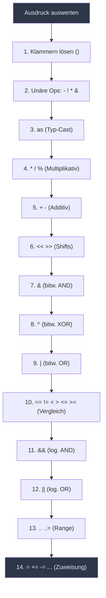
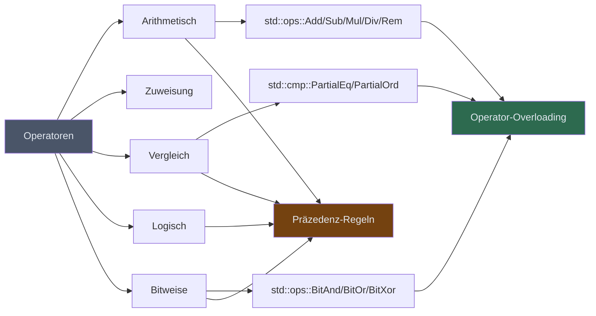

# Kapitel 12: Operatoren in Rust

> [!NOTE]
> Dieses Kapitel behandelt alle grundlegenden Operatortypen in Rust: arithmetische, Zuweisungs-, logische, relationale und bitweise Operatoren. Außerdem lernen Sie die Operator-Präzedenz kennen und erfahren, wie Sie durch Operator-Overloading via Traits eigene Typen mit Standard-Operatoren ausstatten können.

---

## 1. Lernziele & Lernplan

Bevor Sie in die Materie eintauchen, formulieren wir klare Lernziele nach der **Bloom'schen Taxonomie**. Diese helfen Ihnen, den eigenen Lernfortschritt zu messen und zu überprüfen.

### Bloom-Lernziele

| Stufe | Lernziel |
|-------|----------|
| **Erinnern & Verstehen** | Sie können alle Operatortypen in Rust (arithmetisch, Zuweisung, logisch, relational, bitweise) benennen und deren Bedeutung in eigenen Worten erklären. |
| **Anwenden** | Sie können einen einfachen Taschenrechner in Rust implementieren, der alle arithmetischen Operatoren korrekt verwendet, und dabei Präzedenzregeln durch gezielte Klammerung steuern. |
| **Analysieren & Evaluieren** | Sie können typische Präzedenz-Fehler in fremdem Rust-Code identifizieren, die Compiler-Fehlermeldungen interpretieren und Operator-Overloading via Traits für eigene Datentypen entwerfen und begründen. |

### Lernplan

Dieses Kapitel ist so strukturiert, dass Sie zunächst die **theoretischen Grundlagen** aller Operatortypen kennenlernen (Abschnitte 2–3), dann **typische Fallstricke** durch fehlerhafte Beispiele verstehen (Abschnitte 4–5), anschließend die **korrekten Lösungsstrategien** erarbeiten (Abschnitt 6), ein **kleines Praxisprojekt** umsetzen (Abschnitt 7) und schließlich mit dem **Deep Dive** zu Präzedenz und Operator-Overloading Ihr Wissen vertiefen (Abschnitt 8). Drei gestaffelte Übungen (Abschnitt 9) und ein Cheat Sheet (Abschnitt 10) runden das Kapitel ab.

**Geschätzter Zeitaufwand:** 3–5 Stunden (inkl. Übungen)

---

## 2. Die Definition — Alle Operatortypen

Ein **Operator** ist ein spezielles Symbol (oder eine Symbolkombination) in einer Programmiersprache, das eine bestimmte Operation auf einem oder mehreren **Operanden** ausführt und ein Ergebnis liefert. Rust besitzt eine reichhaltige Sammlung von Operatoren, die alle aus funktionalen und sicherheitstechnischen Erwägungen heraus gestaltet wurden.

### 2.1 Arithmetische Operatoren

Arithmetische Operatoren führen mathematische Berechnungen durch. In Rust sind sie für alle numerischen Basistypen definiert.

| Operator | Name | Beispiel | Ergebnis |
|----------|------|---------|---------|
| `+` | Addition | `5 + 3` | `8` |
| `-` | Subtraktion | `10 - 4` | `6` |
| `*` | Multiplikation | `6 * 7` | `42` |
| `/` | Division | `15 / 4` | `3` (Integer-Division!) |
| `%` | Modulo (Rest) | `15 % 4` | `3` |
| `-` (unär) | Negation | `-5` | `-5` |

```rust
fn main() {
    let a: i32 = 17;
    let b: i32 = 5;

    let addition       = a + b;   // 22
    let subtraktion    = a - b;   // 12
    let multiplikation = a * b;   // 85
    let division       = a / b;   // 3  (Ganzzahl-Division: Rest wird abgeschnitten)
    let modulo         = a % b;   // 2

    println!("Addition:       {} + {} = {}", a, b, addition);
    println!("Subtraktion:    {} - {} = {}", a, b, subtraktion);
    println!("Multiplikation: {} * {} = {}", a, b, multiplikation);
    println!("Division:       {} / {} = {}", a, b, division);
    println!("Modulo:         {} % {} = {}", a, b, modulo);
}
```

> [!IMPORTANT]
> Bei der **Integer-Division** in Rust (`/`) wird der Dezimalteil **abgeschnitten**, nicht gerundet. `17 / 5` ergibt `3`, nicht `3.4`. Möchten Sie eine Fließkomma-Division, müssen Sie beide Operanden als `f32` oder `f64` deklarieren.

#### Fließkomma-Arithmetik

```rust
fn main() {
    let x: f64 = 17.0;
    let y: f64 = 5.0;

    println!("{} / {} = {}", x, y, x / y);   // 3.4
    println!("{} % {} = {}", x, y, x % y);   // 2.0

    // Weitere nützliche f64-Operationen
    let quadratwurzel = (16.0_f64).sqrt();    // 4.0
    let potenz        = (2.0_f64).powi(10);  // 1024.0
    let absolutwert   = (-7.5_f64).abs();    // 7.5

    println!("Quadratwurzel von 16 = {}", quadratwurzel);
    println!("2 hoch 10 = {}", potenz);
    println!("Absolutwert von -7.5 = {}", absolutwert);
}
```

> [!NOTE]
> In Rust gibt es **keinen impliziten Typ-Cast**. Sie können einen `i32` nicht direkt zu einem `f64` addieren. Sie müssen explizit konvertieren: `let ergebnis = (ganzzahl as f64) + fliesskomma;`

#### Ganzzahl-Überlauf (Integer Overflow)

Ein wichtiges Sicherheitsmerkmal von Rust: Im **Debug-Modus** führt ein Ganzzahl-Überlauf zu einem **Panic** (Laufzeitabbruch). Im **Release-Modus** wrappen die Werte stillschweigend (Zweierkomplement). Explizite Methoden erlauben kontrollierten Umgang:

```rust
fn main() {
    let max: u8 = 255;

    // Wrapping: Überlauf wird explizit "eingerollt"
    let gewickelt = max.wrapping_add(1);          // 0

    // Saturating: Überlauf wird auf den Maximalwert begrenzt
    let gesaettigt = max.saturating_add(1);       // 255

    // Checked: Gibt Option<T> zurück
    let geprüft = max.checked_add(1);             // None

    // Overflowing: Gibt (Wert, bool) zurück
    let (wert, ueberlauf) = max.overflowing_add(1); // (0, true)

    println!("Wrapping:    {}", gewickelt);
    println!("Saturating:  {}", gesaettigt);
    println!("Checked:     {:?}", geprüft);
    println!("Overflowing: ({}, {})", wert, ueberlauf);
}
```

---

### 2.2 Zuweisungsoperatoren

Zuweisungsoperatoren weisen einer Variablen einen Wert zu. In Rust ist die einfache Zuweisung `=` ein **Statement** (kein Ausdruck) — das bedeutet, dass `x = y = 5` (verkettete Zuweisung wie in C) in Rust **nicht** möglich ist.

#### Einfache Zuweisung

```rust
fn main() {
    let mut x = 10;  // Erstmaliger Wert
    x = 20;          // Neue Zuweisung (x muss mut sein!)
    println!("x = {}", x); // 20
}
```

#### Zusammengesetzte Zuweisungsoperatoren (Compound Assignment)

Diese Operatoren kombinieren eine arithmetische oder bitweise Operation mit einer Zuweisung:

| Operator | Langform | Bedeutung |
|----------|----------|-----------|
| `+=` | `x = x + n` | Addiere und weise zu |
| `-=` | `x = x - n` | Subtrahiere und weise zu |
| `*=` | `x = x * n` | Multipliziere und weise zu |
| `/=` | `x = x / n` | Dividiere und weise zu |
| `%=` | `x = x % n` | Modulo und weise zu |
| `&=` | `x = x & n` | Bitweises AND und weise zu |
| `\|=` | `x = x \| n` | Bitweises OR und weise zu |
| `^=` | `x = x ^ n` | Bitweises XOR und weise zu |
| `<<=` | `x = x << n` | Linksshift und weise zu |
| `>>=` | `x = x >> n` | Rechtsshift und weise zu |

```rust
fn main() {
    let mut wert = 100;

    wert += 10;   // wert = 110
    println!("Nach +=:  {}", wert);

    wert -= 5;    // wert = 105
    println!("Nach -=:  {}", wert);

    wert *= 2;    // wert = 210
    println!("Nach *=:  {}", wert);

    wert /= 3;    // wert = 70
    println!("Nach /=:  {}", wert);

    wert %= 8;    // wert = 6
    println!("Nach %=:  {}", wert);

    wert <<= 2;   // wert = 24  (6 * 4)
    println!("Nach <<=: {}", wert);

    wert >>= 1;   // wert = 12
    println!("Nach >>=: {}", wert);
}
```

> [!NOTE]
> Alle zusammengesetzten Zuweisungsoperatoren setzen voraus, dass die Variable als `mut` deklariert ist. Andernfalls gibt der Compiler einen Fehler aus.

---

### 2.3 Vergleichsoperatoren (Relationale Operatoren)

Vergleichsoperatoren vergleichen zwei Werte und liefern immer einen `bool`-Wert (`true` oder `false`).

| Operator | Bedeutung | Beispiel | Ergebnis |
|----------|-----------|---------|---------|
| `==` | Gleichheit | `5 == 5` | `true` |
| `!=` | Ungleichheit | `5 != 3` | `true` |
| `<` | Kleiner als | `3 < 5` | `true` |
| `>` | Größer als | `5 > 3` | `true` |
| `<=` | Kleiner oder gleich | `5 <= 5` | `true` |
| `>=` | Größer oder gleich | `5 >= 6` | `false` |

```rust
fn main() {
    let a = 42;
    let b = 17;

    println!("{} == {} : {}", a, b, a == b);  // false
    println!("{} != {} : {}", a, b, a != b);  // true
    println!("{} <  {} : {}", a, b, a <  b);  // false
    println!("{} >  {} : {}", a, b, a >  b);  // true
    println!("{} <= {} : {}", a, b, a <= b);  // false
    println!("{} >= {} : {}", a, b, a >= b);  // true

    // Vergleich mit Strings
    let s1 = "Hallo";
    let s2 = "Welt";
    println!("\"{}\" < \"{}\" : {}", s1, s2, s1 < s2); // true (lexikografisch)
}
```

> [!WARNING]
> In Rust können Sie **Werte verschiedener Typen nicht direkt vergleichen**. `5_i32 == 5_i64` führt zu einem Compile-Fehler. Sie müssen explizit casten: `(5_i32 as i64) == 5_i64`.

---

### 2.4 Logische Operatoren

Logische Operatoren verknüpfen `bool`-Werte und liefern wieder einen `bool`.

| Operator | Name | Beschreibung |
|----------|------|-------------|
| `&&` | Logisches UND | `true`, wenn **beide** Operanden `true` sind |
| `\|\|` | Logisches ODER | `true`, wenn **mindestens ein** Operand `true` ist |
| `!` | Logisches NICHT | Kehrt den `bool`-Wert um |

```rust
fn main() {
    let sonnig = true;
    let warm   = false;
    let regen  = false;

    // AND: Beide Bedingungen müssen erfüllt sein
    let perfektes_wetter = sonnig && warm;
    println!("Perfektes Wetter: {}", perfektes_wetter); // false

    // OR: Mindestens eine Bedingung muss erfüllt sein
    let schlechtes_wetter = !sonnig || regen;
    println!("Schlechtes Wetter: {}", schlechtes_wetter); // false

    // NOT: Umkehrung
    println!("Kein Regen: {}", !regen); // true

    // Komplexere Ausdrücke
    let gehe_spazieren = sonnig && !regen;
    println!("Gehe spazieren: {}", gehe_spazieren); // true
}
```

#### Kurzschluss-Auswertung (Short-Circuit Evaluation)

`&&` und `||` verwenden **Kurzschluss-Auswertung**: Wenn das Ergebnis bereits durch den ersten Operanden bestimmt ist, wird der zweite gar nicht ausgewertet.

```rust
fn teuer_berechnen() -> bool {
    println!("Teuer berechneter Wert ...");
    true
}

fn main() {
    let x = false;

    // Da x == false, ist x && ... immer false → teuer_berechnen() wird NICHT aufgerufen!
    let ergebnis = x && teuer_berechnen();
    println!("Ergebnis: {}", ergebnis);
    // Ausgabe: "Ergebnis: false"  (KEIN "Teuer berechneter Wert ...")

    println!("---");

    let y = true;
    // Da y == true, ist y || ... immer true → teuer_berechnen() wird NICHT aufgerufen!
    let ergebnis2 = y || teuer_berechnen();
    println!("Ergebnis2: {}", ergebnis2);
    // Ausgabe: "Ergebnis2: true"  (KEIN "Teuer berechneter Wert ...")
}
```

> [!TIP]
> Nutzen Sie die Kurzschluss-Auswertung bewusst, um **teure Operationen** oder **potenziell fehlerhafte Aufrufe** (z.B. Null-Checks) effizient zu vermeiden. Prüfen Sie mit `&&` zuerst die einfachere Bedingung.

---

### 2.5 Bitweise Operatoren

Bitweise Operatoren arbeiten auf Ebene der einzelnen Bits eines Integers. Sie sind besonders wichtig in der Systemprogrammierung, für Flags, Masken und effiziente Berechnungen.

| Operator | Name | Beschreibung |
|----------|------|-------------|
| `&` | Bitweises AND | Bit ist 1, wenn beide Bits 1 sind |
| `\|` | Bitweises OR | Bit ist 1, wenn mindestens ein Bit 1 ist |
| `^` | Bitweises XOR | Bit ist 1, wenn genau ein Bit 1 ist |
| `!` | Bitweises NOT | Alle Bits werden invertiert (bei Integer-Typen) |
| `<<` | Linksshift | Bits werden nach links verschoben (= Multiplikation mit 2^n) |
| `>>` | Rechtsshift | Bits werden nach rechts verschoben (= Division durch 2^n) |

```rust
fn main() {
    let a: u8 = 0b1100_1010;  // 202
    let b: u8 = 0b1010_1100;  // 172

    println!("a         = {:08b} = {}", a, a);
    println!("b         = {:08b} = {}", b, b);
    println!("a & b     = {:08b} = {}", a & b, a & b);   // AND
    println!("a | b     = {:08b} = {}", a | b, a | b);   // OR
    println!("a ^ b     = {:08b} = {}", a ^ b, a ^ b);   // XOR
    println!("!a        = {:08b} = {}", !a, !a);          // NOT
    println!("a << 2    = {:08b} = {}", a << 2, a << 2); // Linksshift
    println!("a >> 2    = {:08b} = {}", a >> 2, a >> 2); // Rechtsshift
}
```

**Ausgabe:**
```
a         = 11001010 = 202
b         = 10101100 = 172
a & b     = 10001000 = 136
a | b     = 11101110 = 238
a ^ b     = 01100110 = 102
!a        = 00110101 = 53
a << 2    = 00101000 = 40
a >> 2    = 00110010 = 50
```

#### Praxisbeispiel: Bit-Flags

Bitweise Operatoren werden häufig für **Bitmasken** und **Flags** verwendet:

```rust
// Bit-Flags für Zugriffsrechte (Unix-Stil)
const LESEN      : u8 = 0b0000_0100;  // 4
const SCHREIBEN  : u8 = 0b0000_0010;  // 2
const AUSFUEHREN : u8 = 0b0000_0001;  // 1

fn main() {
    // Benutzer-Rechte: Lesen + Schreiben
    let mut rechte: u8 = LESEN | SCHREIBEN;
    println!("Rechte: {:03b} ({})", rechte, rechte); // 110 (6)

    // Ausführungsrecht hinzufügen
    rechte |= AUSFUEHREN;
    println!("Rechte: {:03b} ({})", rechte, rechte); // 111 (7)

    // Schreibrecht entfernen (AND mit invertierter Maske)
    rechte &= !SCHREIBEN;
    println!("Rechte: {:03b} ({})", rechte, rechte); // 101 (5)

    // Prüfen ob Leserecht vorhanden
    if rechte & LESEN != 0 {
        println!("Leserecht: JA");
    }

    // Schreibrecht umschalten (XOR)
    rechte ^= SCHREIBEN;
    println!("Rechte nach Toggle: {:03b} ({})", rechte, rechte); // 111 (7)
}
```

> [!TIP]
> In der Praxis empfiehlt sich für Bit-Flags oft das Crate [`bitflags`](https://crates.io/crates/bitflags), das typsichere Bit-Flag-Typen generiert. Für systemnahe Programmierung sind die rohen bitweisen Operatoren jedoch unverzichtbar.

---

### 2.6 Weitere Operatoren in Rust

Neben den klassischen Gruppen gibt es in Rust noch weitere wichtige Operatoren:

#### Range-Operatoren

```rust
fn main() {
    // Exklusiver Range: 0, 1, 2, 3, 4 (5 ist NICHT enthalten)
    for i in 0..5 {
        print!("{} ", i);
    }
    println!();

    // Inklusiver Range: 0, 1, 2, 3, 4, 5 (5 ist enthalten)
    for i in 0..=5 {
        print!("{} ", i);
    }
    println!();
}
```

#### Der `?`-Operator (Fehlerweiterleitung)

```rust
use std::num::ParseIntError;

fn parse_und_verdoppeln(s: &str) -> Result<i32, ParseIntError> {
    let zahl: i32 = s.trim().parse()?;  // ? gibt bei Fehler sofort zurück
    Ok(zahl * 2)
}

fn main() {
    println!("{:?}", parse_und_verdoppeln("21"));   // Ok(42)
    println!("{:?}", parse_und_verdoppeln("abc"));  // Err(...)
}
```

#### Der `as`-Operator (Typ-Konvertierung)

```rust
fn main() {
    let x: i32 = 300;
    let y: u8 = x as u8;       // 44 (Überlauf durch Abschneiden)
    let z: f64 = x as f64;     // 300.0
    let w: i32 = 3.99_f64 as i32; // 3 (Nachkommastellen abgeschnitten)

    println!("i32 {} als u8:  {}", x, y);
    println!("i32 {} als f64: {}", x, z);
    println!("f64 3.99 als i32: {}", w);
}
```

---

## 3. Das Problem & Die Motivation — Warum Präzedenz wichtig ist

Stellen Sie sich vor, Sie schreiben einen mathematischen Ausdruck in Rust. Welches Ergebnis erwarten Sie?

```rust
let ergebnis = 2 + 3 * 4;
```

Wenn Rust von links nach rechts auswerten würde:
- `(2 + 3) * 4 = 5 * 4 = 20`

Wenn Rust die mathematische Konvention (Punkt vor Strich) einhält:
- `2 + (3 * 4) = 2 + 12 = 14`

Das korrekte Ergebnis in Rust ist **14**, weil `*` eine **höhere Präzedenz** als `+` hat. Die Operator-Präzedenz (auch Rangfolge oder Vorrang genannt) legt fest, **in welcher Reihenfolge** Operatoren ausgewertet werden, wenn keine Klammern vorhanden sind.

### Warum ist das so wichtig?

**Präzedenzfehler** sind besonders heimtückisch, weil:

1. **Kein Compile-Fehler**: Der Code kompiliert fehlerfrei — die Logik ist schlicht falsch.
2. **Subtile Bugs**: Die Fehler zeigen sich oft erst bei Randfällen oder bestimmten Eingaben.
3. **Schwer zu debuggen**: Ein falscher Vergleich oder eine falsche Berechnung kann tiefe Systemfehler verursachen.
4. **Gemischte Operatortypen**: Besonders gefährlich ist die Kombination von arithmetischen, logischen und bitweisen Operatoren.

### Ein Motivationsbeispiel aus der Praxis

Betrachten Sie diesen Code, der prüfen soll, ob eine Zahl im Bereich [10, 20] liegt:

```rust
let n = 15;
// FALSCH! Typischer Anfängerfehler:
if 10 < n < 20 {  // Compile-Fehler in Rust!
    println!("Im Bereich");
}
```

In manchen anderen Sprachen würde dieser Code "funktionieren", aber falsche Ergebnisse liefern. In Rust erkennt der Compiler das Problem sofort. Die korrekte Form ist:

```rust
let n = 15;
if 10 < n && n < 20 {
    println!("Im Bereich");
}
```

Oder noch eleganter mit Rust-Ranges:

```rust
let n = 15;
if (10..20).contains(&n) {
    println!("Im Bereich");
}
```

---

## 4. Der naive Versuch — Typische Präzedenz-Fehler

Sehen wir uns nun konkrete Beispiele für häufige Präzedenzfehler an, wie sie Anfängern oft unterlaufen.

### Fehler 1: Arithmetik und Vergleich vermischen

```rust
fn main() {
    let a = 5;
    let b = 3;
    let c = 2;

    // NAIVER VERSUCH: Gemeinter Ausdruck: (a + b) * c == 16
    // TATSÄCHLICH: a + (b * c) == 16  →  a + 6 == 16  →  11 == 16  →  false!
    let ergebnis = a + b * c == 16;
    println!("Ergebnis: {}", ergebnis); // false (obwohl (5+3)*2 = 16!)
}
```

### Fehler 2: Bitweise vs. Logische Operatoren

```rust
fn main() {
    let x: u8 = 5;  // 0000_0101
    let y: u8 = 3;  // 0000_0011

    // NAIVER VERSUCH: Gemeint war logisches AND der Wahrheitswerte
    // TATSÄCHLICH: Bitweises AND der Zahlen → 0000_0001 = 1 (truthy in anderen Sprachen)
    // In Rust: Typen passen nicht zusammen für 'if x & y { ... }'

    // Häufiger Fehler: Verwechslung von & (bitweise) und && (logisch)
    let beide_ungerade_falsch = (x & 1) & (y & 1); // Gibt 1 zurück, kein bool!
    // println!("if {}: ...", beide_ungerade_falsch);  // Fehler: erwartet bool, nicht u8

    // KORREKT mit logischen Operatoren:
    let beide_ungerade = (x & 1 == 1) && (y & 1 == 1);
    println!("Beide ungerade: {}", beide_ungerade); // true
}
```

### Fehler 3: Shift-Operator Präzedenz

```rust
fn main() {
    let basis: u32 = 2;

    // NAIVER VERSUCH: 2^(3+1) = 2^4 = 16
    // TATSÄCHLICH: (2 << 3) + 1 = 16 + 1 = 17  (weil << höhere Präzedenz als + hat)
    let falsch = basis << 3 + 1;
    // Rust-Compiler: Fehler! u32 << u32 — der Wert 4 ist >32 für u32-Shift → Panic!
    // Tatsächlich: basis << (3 + 1) ist was hier berechnet wird!
    // Wegen Rechts-Assoziativität von + : basis << (3+1) = 2 << 4 = 32

    // Sei vorsichtig! In Rust hat + niedrigere Präzedenz als <<
    // Also: basis << 3 + 1  →  basis << (3 + 1)  →  2 << 4  →  32
    println!("2 << 3 + 1 = {}", basis << 3 + 1); // 32, nicht 17!

    // KLARE Schreibweise:
    let klar_gemeint_1 = (basis << 3) + 1; // 17
    let klar_gemeint_2 = basis << (3 + 1); // 32

    println!("(2 << 3) + 1 = {}", klar_gemeint_1); // 17
    println!("2 << (3 + 1) = {}", klar_gemeint_2); // 32
}
```

### Fehler 4: Negation und Exponentiation

```rust
fn main() {
    // Kein ** Operator in Rust (anders als Python)
    // Verwenden Sie .powi() oder .powf()

    let basis: f64 = -2.0;

    // NAIVER GEDANKE: (-2)^2 = 4
    let ergebnis = basis.powi(2); // 4.0 ✓ (korrekt über Methode)

    // Unäre Negation hat in Rust sehr hohe Präzedenz!
    let x: i32 = -3;
    let y: i32 = -x * -x; // = (-(-3)) * (-3) = 3 * (-3) = -9? Nein!
    // Tatsächlich: (-x) * (-x) = (3) * (3) = 9
    println!("y = {}", y); // 9

    // Aber Vorsicht:
    let z = -x * x; // (-x) * x = 3 * (-3) = -9
    println!("z = {}", z); // -9
}
```

### Fehler 5: Logische vs. Bitweise NOT

```rust
fn main() {
    let wahr = true;

    // !wahr  = false  (logisches NOT, für bool)
    println!("!wahr = {}", !wahr); // false

    let zahl: u8 = 5; // 0000_0101
    // !zahl  = 250   (bitweises NOT, für Integer: alle Bits invertiert)
    println!("!5u8  = {}", !zahl); // 250 = 1111_1010

    // WICHTIG: In Rust ist ! kontextabhängig!
    // Auf bool: logisches NOT
    // Auf Integer: bitweises NOT
}
```

---

## 5. Die Anatomie des Fehlers — Compiler-Ausgaben verstehen

Rust's Compiler (`rustc`) ist bekannt für seine präzisen und hilfreichen Fehlermeldungen. Lassen Sie uns typische Compiler-Fehler bei Operator-Problemen analysieren.

### Fehler-Typ 1: Typkonflikt bei Operatoren

**Code:**
```rust
fn main() {
    let x: i32 = 5;
    let y: f64 = 3.14;
    let z = x + y; // Fehler!
}
```

**Compiler-Ausgabe:**
```
error[E0308]: mismatched types
 --> src/main.rs:4:17
  |
4 |     let z = x + y; // Fehler!
  |                 ^ expected `i32`, found `f64`
  |
help: you can convert `y` from `f64` to `i32` and panic if the converted value doesn't fit
  |
4 |     let z = x + y as i32;
  |                 +++++++
```

**Bedeutung:**
- `expected 'i32'`: Der linke Operand `x` ist `i32`, also erwartet `+` auch rechts ein `i32`.
- `found 'f64'`: Aber `y` ist `f64`.
- Die `help`-Nachricht zeigt den Lösungsweg.

**Korrektur:**
```rust
fn main() {
    let x: i32 = 5;
    let y: f64 = 3.14;

    // Option 1: Beide als f64
    let z1 = (x as f64) + y;
    println!("z1 = {}", z1); // 8.14

    // Option 2: y als i32 (Nachkommastellen gehen verloren!)
    let z2 = x + (y as i32);
    println!("z2 = {}", z2); // 8
}
```

---

### Fehler-Typ 2: Verwendung von `=` statt `==`

**Code:**
```rust
fn main() {
    let x = 5;
    if x = 5 { // Fehler! Zuweisung statt Vergleich
        println!("x ist fünf");
    }
}
```

**Compiler-Ausgabe:**
```
error[E0308]: mismatched types
 --> src/main.rs:3:8
  |
3 |     if x = 5 { // Fehler! Zuweisung statt Vergleich
  |        ^^^^^
  |        |
  |        expected `bool`, found `()`
  |
  = note: in Rust, `=` is an assignment statement, not an expression
```

**Bedeutung:** In Rust ist `=` ein Statement (gibt `()` zurück), kein Ausdruck. Die `if`-Bedingung erwartet einen `bool`, erhält aber `()`. Der Compiler erkennt dieses häufige C/C++/Java-Muster und gibt einen hilfreichen Hinweis.

---

### Fehler-Typ 3: Vergleich ohne `==`

**Code:**
```rust
fn main() {
    let a = 5;
    let b = 5;
    if a = b { // Fehler!
        println!("gleich");
    }
}
```

```
error[E0308]: mismatched types
 --> src/main.rs:4:8
  |
4 |     if a = b { // Fehler!
  |        ^^^^^ expected `bool`, found `()`
  |
note: `=` assigns a value. Did you mean to use `==` to compare?
```

---

### Fehler-Typ 4: Shift um zu viele Bits

**Code:**
```rust
fn main() {
    let x: u8 = 1;
    let y = x << 8; // Fehler: 8 ist >= 8 (die Bit-Breite von u8)
}
```

**Compiler-Ausgabe (Debug-Mode, Panic):**
```
thread 'main' panicked at 'attempt to shift left with overflow'
```

**Oder im Fall eines konstanten Ausdrucks:**
```
error: this arithmetic operation will overflow
 --> src/main.rs:3:13
  |
3 |     let y = x << 8;
  |             ^^^^^^ attempt to shift left by `8_u32`, which would overflow
```

---

### ASCII-Tabelle: Häufige Operator-Fehler

```
┌─────────────────────────────────────────────────────────────────────┐
│              HÄUFIGE OPERATOR-FEHLER IN RUST (Übersicht)            │
├──────────────────────┬──────────────────────┬───────────────────────┤
│  FEHLER              │  URSACHE             │  LÖSUNG               │
├──────────────────────┼──────────────────────┼───────────────────────┤
│  x + y (i32 + f64)  │  Typkonflikt         │  (x as f64) + y       │
│  if x = 5           │  = ist kein bool     │  if x == 5            │
│  let x = !5_u8      │  Bitweises NOT!      │  Bewusst einsetzen    │
│  10 < n < 20        │  Kein Chaining       │  10<n && n<20         │
│  x << 8 (bei u8)    │  Shift-Overflow      │  x << 7 (max)         │
│  a + b * c == r     │  Präzedenzfehler     │  (a+b)*c == r         │
│  &a                 │  Referenz, nicht AND │  a & b (bitweise)     │
└──────────────────────┴──────────────────────┴───────────────────────┘
```

---

## 6. Die Lösung — Korrekte Verwendung von Operatoren

### 6.1 Klammern als universelles Mittel

Die sicherste Strategie gegen Präzedenzfehler ist die **explizite Klammerung**. Schreiben Sie lieber eine Klammer zu viel als zu wenig:

```rust
fn main() {
    let a = 2;
    let b = 3;
    let c = 4;

    // Ohne Klammern: Präzedenz-abhängig
    let zweideutig = a + b * c;      // = a + (b*c) = 2 + 12 = 14

    // Mit Klammern: Absolut eindeutig
    let klar_1 = (a + b) * c;       // = 5 * 4 = 20
    let klar_2 = a + (b * c);       // = 2 + 12 = 14

    println!("Ohne Klammern: {}", zweideutig);  // 14
    println!("(a+b)*c:       {}", klar_1);      // 20
    println!("a+(b*c):       {}", klar_2);      // 14
}
```

> [!TIP]
> **Faustregel**: Wenn Sie sich bei der Präzedenz nicht 100% sicher sind, setzen Sie Klammern. Der Compiler optimiert diese weg — sie kosten zur Laufzeit nichts. Ihr Code wird lesbarer und sicherer.

### 6.2 Typen konsistent halten

```rust
fn berechne_bmi(gewicht_kg: f64, groesse_m: f64) -> f64 {
    // Korrekt: Beide Operanden sind f64
    gewicht_kg / (groesse_m * groesse_m)
}

fn main() {
    let gewicht = 75.0_f64;  // kg
    let groesse = 1.80_f64;  // m

    let bmi = berechne_bmi(gewicht, groesse);
    println!("BMI: {:.1}", bmi); // 23.1
}
```

### 6.3 Vergleiche korrekt strukturieren

```rust
fn alter_pruefen(alter: u32) -> &'static str {
    if alter < 18 {
        "minderjährig"
    } else if alter >= 18 && alter < 65 {
        "erwachsen"
    } else {
        "Senior"
    }
}

fn main() {
    println!("{}", alter_pruefen(15));  // minderjährig
    println!("{}", alter_pruefen(30));  // erwachsen
    println!("{}", alter_pruefen(70));  // Senior
}
```

### 6.4 Bitweise Operatoren korrekt verwenden

```rust
fn ist_ungerade(n: i32) -> bool {
    n & 1 == 1  // Bitweises AND mit 1, dann Vergleich
                // Präzedenz: (n & 1) == 1  ✓
}

fn ist_potenz_von_2(n: u32) -> bool {
    n > 0 && (n & (n - 1)) == 0
    // Präzedenz: n>0 && ((n & (n-1)) == 0)
    // Das klassische Bit-Trick für Potenzen von 2
}

fn main() {
    for i in 0..=16 {
        if ist_potenz_von_2(i) {
            println!("{} ist eine Potenz von 2", i);
        }
    }
    // Ausgabe: 1, 2, 4, 8, 16
}
```

---

## 7. Kleines Tutorial — Schritt-für-Schritt Taschenrechner-Projekt

Nun bauen wir einen vollständigen **Kommandozeilen-Taschenrechner** in Rust. Dieses Projekt demonstriert den Einsatz aller Operatortypen in einer realen Anwendung.

### Schritt 1: Neues Projekt anlegen

```bash
cargo new taschenrechner
cd taschenrechner
```

### Schritt 2: Grundstruktur definieren

Öffnen Sie `src/main.rs` und ersetzen Sie den Inhalt:

```rust
use std::io::{self, Write};

fn main() {
    println!("=== Rust Taschenrechner ===");
    println!("Operatoren: +, -, *, /, %, ** (Potenz)");
    println!("Geben Sie 'ende' ein zum Beenden.\n");

    loop {
        print("Eingabe: ");
        io::stdout().flush().unwrap();

        let mut eingabe = String::new();
        io::stdin().read_line(&mut eingabe).unwrap();
        let eingabe = eingabe.trim();

        if eingabe.eq_ignore_ascii_case("ende") {
            println!("Auf Wiedersehen!");
            break;
        }

        match berechne(eingabe) {
            Ok(ergebnis)  => println!("= {}", ergebnis),
            Err(meldung)  => println!("Fehler: {}", meldung),
        }
    }
}
```

> [!NOTE]
> Wir verwenden hier `print!` mit anschließendem `flush()`, damit die Ausgabe ohne Zeilenumbruch erscheint. Rust puffert die Standardausgabe, daher ist das explizite `flush()` notwendig.

### Schritt 3: Parser implementieren

```rust
#[derive(Debug)]
enum Fehler {
    UnbekannterOperator(String),
    UngueltigeZahl(String),
    DivisionDurchNull,
    ZuWenigeArgumente,
}

impl std::fmt::Display for Fehler {
    fn fmt(&self, f: &mut std::fmt::Formatter<'_>) -> std::fmt::Result {
        match self {
            Fehler::UnbekannterOperator(op)  =>
                write!(f, "Unbekannter Operator: '{}'", op),
            Fehler::UngueltigeZahl(s)        =>
                write!(f, "Ungültige Zahl: '{}'", s),
            Fehler::DivisionDurchNull        =>
                write!(f, "Division durch Null!"),
            Fehler::ZuWenigeArgumente        =>
                write!(f, "Format: <Zahl> <Operator> <Zahl>"),
        }
    }
}
```

### Schritt 4: Berechnungsfunktion

```rust
fn berechne(ausdruck: &str) -> Result<f64, Fehler> {
    let teile: Vec<&str> = ausdruck.split_whitespace().collect();

    if teile.len() < 3 {
        return Err(Fehler::ZuWenigeArgumente);
    }

    let a: f64 = teile[0]
        .parse()
        .map_err(|_| Fehler::UngueltigeZahl(teile[0].to_string()))?;

    let operator = teile[1];

    let b: f64 = teile[2]
        .parse()
        .map_err(|_| Fehler::UngueltigeZahl(teile[2].to_string()))?;

    match operator {
        "+"  => Ok(a + b),
        "-"  => Ok(a - b),
        "*"  => Ok(a * b),
        "/"  => {
            if b == 0.0 {
                Err(Fehler::DivisionDurchNull)
            } else {
                Ok(a / b)
            }
        }
        "%"  => {
            if b == 0.0 {
                Err(Fehler::DivisionDurchNull)
            } else {
                Ok(a % b)
            }
        }
        "**" => Ok(a.powf(b)),
        op   => Err(Fehler::UnbekannterOperator(op.to_string())),
    }
}
```

### Schritt 5: Erweiterte Version mit Bit-Operatoren

```rust
fn berechne_ganzzahl(ausdruck: &str) -> Result<i64, Fehler> {
    let teile: Vec<&str> = ausdruck.split_whitespace().collect();

    if teile.len() < 3 {
        return Err(Fehler::ZuWenigeArgumente);
    }

    let a: i64 = teile[0]
        .parse()
        .map_err(|_| Fehler::UngueltigeZahl(teile[0].to_string()))?;

    let operator = teile[1];

    let b: i64 = teile[2]
        .parse()
        .map_err(|_| Fehler::UngueltigeZahl(teile[2].to_string()))?;

    match operator {
        "+"   => Ok(a + b),
        "-"   => Ok(a - b),
        "*"   => Ok(a * b),
        "/"   => {
            if b == 0 { Err(Fehler::DivisionDurchNull) } else { Ok(a / b) }
        }
        "%"   => {
            if b == 0 { Err(Fehler::DivisionDurchNull) } else { Ok(a % b) }
        }
        "&"   => Ok(a & b),   // Bitweises AND
        "|"   => Ok(a | b),   // Bitweises OR
        "^"   => Ok(a ^ b),   // Bitweises XOR
        "<<"  => Ok(a << b),  // Linksshift
        ">>"  => Ok(a >> b),  // Rechtsshift
        op    => Err(Fehler::UnbekannterOperator(op.to_string())),
    }
}
```

### Schritt 6: Tests schreiben

```rust
#[cfg(test)]
mod tests {
    use super::*;

    #[test]
    fn test_addition() {
        let ergebnis = berechne("10 + 5").unwrap();
        assert_eq!(ergebnis, 15.0);
    }

    #[test]
    fn test_subtraktion() {
        let ergebnis = berechne("10 - 3").unwrap();
        assert_eq!(ergebnis, 7.0);
    }

    #[test]
    fn test_multiplikation() {
        let ergebnis = berechne("6 * 7").unwrap();
        assert_eq!(ergebnis, 42.0);
    }

    #[test]
    fn test_division() {
        let ergebnis = berechne("15 / 4").unwrap();
        assert_eq!(ergebnis, 3.75);
    }

    #[test]
    fn test_modulo() {
        let ergebnis = berechne("17 % 5").unwrap();
        assert_eq!(ergebnis, 2.0);
    }

    #[test]
    fn test_potenz() {
        let ergebnis = berechne("2 ** 10").unwrap();
        assert_eq!(ergebnis, 1024.0);
    }

    #[test]
    fn test_division_durch_null() {
        assert!(berechne("5 / 0").is_err());
    }

    #[test]
    fn test_ungueltige_eingabe() {
        assert!(berechne("abc + 5").is_err());
    }

    #[test]
    fn test_bitweise_and() {
        let ergebnis = berechne_ganzzahl("12 & 10").unwrap();
        assert_eq!(ergebnis, 8); // 1100 & 1010 = 1000
    }

    #[test]
    fn test_linksshift() {
        let ergebnis = berechne_ganzzahl("1 << 4").unwrap();
        assert_eq!(ergebnis, 16);
    }
}
```

### Schritt 7: Ausführen und Testen

```bash
# Tests ausführen
cargo test

# Programm starten
cargo run
```

**Beispiel-Session:**
```
=== Rust Taschenrechner ===
Operatoren: +, -, *, /, %, ** (Potenz)
Geben Sie 'ende' ein zum Beenden.

Eingabe: 15 + 27
= 42
Eingabe: 100 / 7
= 14.285714285714286
Eingabe: 2 ** 10
= 1024
Eingabe: abc + 5
Fehler: Ungültige Zahl: 'abc'
Eingabe: 5 / 0
Fehler: Division durch Null!
Eingabe: ende
Auf Wiedersehen!
```

> [!TIP]
> Führen Sie `cargo test` regelmäßig aus, während Sie neue Operatoren hinzufügen. Das **Test-Driven Development** (TDD) Prinzip hilft Ihnen, Bugs frühzeitig zu entdecken und sicherzustellen, dass Ihre Implementierung korrekt ist.

---

## 8. Mentale Modelle & Deep Dive

### 8.1 Die vollständige Operator-Präzedenz-Tabelle

Rust folgt im Wesentlichen den üblichen mathematischen Konventionen. Die folgende Tabelle listet die Operatoren nach absteigender Präzedenz (höchste Priorität oben):

| Rang | Operator(en) | Assoziativität | Beschreibung |
|------|-------------|----------------|-------------|
| 1 | `()` `[]` `.` | Links | Klammern, Indexierung, Felderzugriff |
| 2 | `-` (unär) `!` `*` `&` `&mut` | Rechts | Unäre Operatoren, Dereferenzierung, Referenz |
| 3 | `as` | Links | Typ-Konvertierung |
| 4 | `*` `/` `%` | Links | Multiplikation, Division, Modulo |
| 5 | `+` `-` | Links | Addition, Subtraktion |
| 6 | `<<` `>>` | Links | Bitweise Shifts |
| 7 | `&` | Links | Bitweises AND |
| 8 | `^` | Links | Bitweises XOR |
| 9 | `\|` | Links | Bitweises OR |
| 10 | `==` `!=` `<` `>` `<=` `>=` | Keine | Vergleiche |
| 11 | `&&` | Links | Logisches AND |
| 12 | `\|\|` | Links | Logisches OR |
| 13 | `..` `..=` | Keine | Range-Operatoren |
| 14 | `=` `+=` `-=` `*=` `/=` etc. | Rechts | Zuweisung |
| 15 | `return` `break` `continue` | — | Kontrollfluss |

> [!IMPORTANT]
> Beachten Sie: Rust hat **keine festgelegte Präzedenz** für einige Operatoren gegenüber anderen in allen Kontexten — der Compiler erzwingt häufig explizite Klammern, wenn Ausdrücke mehrdeutig erscheinen. Verlassen Sie sich nicht auf die Präzedenz-Tabelle als alleinige Quelle; **Klammern** sind immer die sicherste Wahl.

#### Visualisierung der Auswertungsreihenfolge

```rust
// Beispiel: a + b * c - d / e > f && g || h
// Schritt 1: Multiplikation und Division  (Rang 4)
//   → a + (b*c) - (d/e) > f && g || h
// Schritt 2: Addition und Subtraktion     (Rang 5)
//   → ((a + (b*c)) - (d/e)) > f && g || h
// Schritt 3: Vergleich                    (Rang 10)
//   → (((a + (b*c)) - (d/e)) > f) && g || h
// Schritt 4: Logisches AND               (Rang 11)
//   → ((((a + (b*c)) - (d/e)) > f) && g) || h
// Schritt 5: Logisches OR                (Rang 12)
//   → (((((a + (b*c)) - (d/e)) > f) && g) || h)

fn main() {
    let a = 10; let b = 3; let c = 4; let d = 8; let e = 2;
    let f = 14; let g = true; let h = false;

    // Ohne Klammern (verwirrend!):
    let ergebnis1 = a + b * c - d / e > f && g || h;

    // Mit Klammern (klar!):
    let ergebnis2 = (((a + (b * c)) - (d / e)) > f) && g || h;

    println!("Gleich: {}", ergebnis1 == ergebnis2); // true
    println!("Ergebnis: {}", ergebnis1);
}
```

---

### 8.2 Mermaid-Diagramm: Operator-Präzedenz-Hierarchie



---

### 8.3 Operator-Overloading via Traits

Eine der mächtigsten Funktionen von Rust ist das **Operator-Overloading** (Operator-Überladen). Dabei definieren Sie für eigene Typen das Verhalten von Standard-Operatoren wie `+`, `-`, `*`, `==` usw. durch Implementierung bestimmter **Traits** aus dem Modul `std::ops`.

#### Die wichtigsten Operator-Traits

| Trait | Operator | Beschreibung |
|-------|----------|-------------|
| `std::ops::Add` | `+` | Addition |
| `std::ops::Sub` | `-` | Subtraktion |
| `std::ops::Mul` | `*` | Multiplikation |
| `std::ops::Div` | `/` | Division |
| `std::ops::Rem` | `%` | Modulo |
| `std::ops::Neg` | `-` (unär) | Negation |
| `std::ops::Not` | `!` | Logisches/Bitweises NOT |
| `std::ops::BitAnd` | `&` | Bitweises AND |
| `std::ops::BitOr` | `\|` | Bitweises OR |
| `std::ops::BitXor` | `^` | Bitweises XOR |
| `std::ops::Shl` | `<<` | Linksshift |
| `std::ops::Shr` | `>>` | Rechtsshift |
| `std::ops::Index` | `[]` | Indexierung (lesend) |
| `std::ops::IndexMut` | `[]` | Indexierung (schreibend) |
| `std::cmp::PartialEq` | `==` `!=` | Gleichheitsvergleich |
| `std::cmp::PartialOrd` | `<` `>` `<=` `>=` | Ordnungsvergleich |

#### Beispiel 1: Vektoraddition mit `Add`-Trait

Implementieren wir einen 2D-Vektor mit Operator-Unterstützung:

```rust
use std::ops::{Add, Sub, Mul, Neg};
use std::fmt;

#[derive(Debug, Clone, Copy, PartialEq)]
struct Vec2 {
    x: f64,
    y: f64,
}

impl Vec2 {
    fn new(x: f64, y: f64) -> Self {
        Vec2 { x, y }
    }

    fn laenge(&self) -> f64 {
        (self.x * self.x + self.y * self.y).sqrt()
    }

    fn skalarprodukt(&self, andere: &Vec2) -> f64 {
        self.x * andere.x + self.y * andere.y
    }
}

// Addition: v1 + v2
impl Add for Vec2 {
    type Output = Vec2;

    fn add(self, rhs: Vec2) -> Vec2 {
        Vec2::new(self.x + rhs.x, self.y + rhs.y)
    }
}

// Subtraktion: v1 - v2
impl Sub for Vec2 {
    type Output = Vec2;

    fn sub(self, rhs: Vec2) -> Vec2 {
        Vec2::new(self.x - rhs.x, self.y - rhs.y)
    }
}

// Skalarmultiplikation: v * skalar
impl Mul<f64> for Vec2 {
    type Output = Vec2;

    fn mul(self, skalar: f64) -> Vec2 {
        Vec2::new(self.x * skalar, self.y * skalar)
    }
}

// Negation: -v
impl Neg for Vec2 {
    type Output = Vec2;

    fn neg(self) -> Vec2 {
        Vec2::new(-self.x, -self.y)
    }
}

// Ausgabe-Formatierung
impl fmt::Display for Vec2 {
    fn fmt(&self, f: &mut fmt::Formatter<'_>) -> fmt::Result {
        write!(f, "({:.2}, {:.2})", self.x, self.y)
    }
}

fn main() {
    let v1 = Vec2::new(3.0, 4.0);
    let v2 = Vec2::new(1.0, -2.0);

    println!("v1 = {}", v1);           // (3.00, 4.00)
    println!("v2 = {}", v2);           // (1.00, -2.00)

    let summe = v1 + v2;
    println!("v1 + v2 = {}", summe);   // (4.00, 2.00)

    let differenz = v1 - v2;
    println!("v1 - v2 = {}", differenz); // (2.00, 6.00)

    let skaliert = v1 * 2.5;
    println!("v1 * 2.5 = {}", skaliert); // (7.50, 10.00)

    let negiert = -v1;
    println!("-v1 = {}", negiert);     // (-3.00, -4.00)

    println!("|v1| = {:.2}", v1.laenge()); // 5.00

    println!("v1 · v2 = {:.2}", v1.skalarprodukt(&v2)); // -5.00

    println!("v1 == v1: {}", v1 == v1); // true (dank PartialEq)
    println!("v1 == v2: {}", v1 == v2); // false
}
```

#### Beispiel 2: Komplexe Zahlen

```rust
use std::ops::{Add, Sub, Mul};
use std::fmt;

#[derive(Debug, Clone, Copy, PartialEq)]
struct Komplex {
    real: f64,
    imag: f64,
}

impl Komplex {
    fn new(real: f64, imag: f64) -> Self {
        Komplex { real, imag }
    }

    fn betrag(&self) -> f64 {
        (self.real * self.real + self.imag * self.imag).sqrt()
    }

    fn konjugiert(&self) -> Komplex {
        Komplex::new(self.real, -self.imag)
    }
}

impl Add for Komplex {
    type Output = Komplex;
    fn add(self, rhs: Komplex) -> Komplex {
        Komplex::new(self.real + rhs.real, self.imag + rhs.imag)
    }
}

impl Sub for Komplex {
    type Output = Komplex;
    fn sub(self, rhs: Komplex) -> Komplex {
        Komplex::new(self.real - rhs.real, self.imag - rhs.imag)
    }
}

impl Mul for Komplex {
    type Output = Komplex;
    fn mul(self, rhs: Komplex) -> Komplex {
        // (a+bi)(c+di) = (ac-bd) + (ad+bc)i
        Komplex::new(
            self.real * rhs.real - self.imag * rhs.imag,
            self.real * rhs.imag + self.imag * rhs.real,
        )
    }
}

impl fmt::Display for Komplex {
    fn fmt(&self, f: &mut fmt::Formatter<'_>) -> fmt::Result {
        if self.imag >= 0.0 {
            write!(f, "{:.2} + {:.2}i", self.real, self.imag)
        } else {
            write!(f, "{:.2} - {:.2}i", self.real, -self.imag)
        }
    }
}

fn main() {
    let z1 = Komplex::new(3.0, 4.0);   // 3 + 4i
    let z2 = Komplex::new(1.0, -2.0);  // 1 - 2i

    println!("z1 = {}", z1);
    println!("z2 = {}", z2);
    println!("z1 + z2 = {}", z1 + z2); // 4 + 2i
    println!("z1 - z2 = {}", z1 - z2); // 2 + 6i
    println!("z1 * z2 = {}", z1 * z2); // (3+4i)(1-2i) = 3-6i+4i-8i² = 11-2i

    println!("|z1| = {:.2}", z1.betrag()); // 5.00
    println!("z1* = {}", z1.konjugiert()); // 3 - 4i
}
```

#### Beispiel 3: PartialOrd und Ord für benutzerdefinierte Sortierung

```rust
use std::cmp::Ordering;

#[derive(Debug, Clone, Eq, PartialEq)]
struct Student {
    name: String,
    note: u32, // 1 (beste) bis 6 (schlechteste)
}

impl Student {
    fn new(name: &str, note: u32) -> Self {
        Student { name: name.to_string(), note }
    }
}

// Sortierung nach Note (aufsteigend = bessere Note zuerst)
impl PartialOrd for Student {
    fn partial_cmp(&self, other: &Self) -> Option<Ordering> {
        Some(self.cmp(other))
    }
}

impl Ord for Student {
    fn cmp(&self, other: &Self) -> Ordering {
        self.note.cmp(&other.note) // Kleinere Note = besserer Student
    }
}

fn main() {
    let mut studenten = vec![
        Student::new("Anna",  2),
        Student::new("Bernd", 1),
        Student::new("Clara", 3),
        Student::new("David", 1),
    ];

    studenten.sort(); // Nutzt unsere Ord-Implementierung

    println!("Rangliste:");
    for (rang, s) in studenten.iter().enumerate() {
        println!("  {}. {} (Note: {})", rang + 1, s.name, s.note);
    }

    // Vergleichsoperatoren funktionieren jetzt:
    let a = Student::new("X", 2);
    let b = Student::new("Y", 3);
    println!("\nNote 2 < Note 3: {}", a < b); // true (besser = "kleiner")
    println!("Note 2 > Note 3: {}", a > b); // false
}
```

> [!NOTE]
> Wenn Sie `Ord` implementieren, müssen Sie auch `PartialOrd`, `Eq` und `PartialEq` implementieren. Oft können Sie `Eq` und `PartialEq` per `derive` ableiten (`#[derive(Eq, PartialEq)]`), müssen `Ord` und `PartialOrd` aber manuell implementieren, wenn die Standardreihenfolge nicht passt.

#### Beispiel 4: Operator-Overloading mit `AddAssign`

```rust
use std::ops::AddAssign;

#[derive(Debug, Clone, Copy, PartialEq)]
struct Geldmenge {
    cent: i64, // Alles in Cent, um Fließkomma-Fehler zu vermeiden
}

impl Geldmenge {
    fn new(euro: i64, cent: i64) -> Self {
        Geldmenge { cent: euro * 100 + cent }
    }

    fn euro(&self) -> i64 { self.cent / 100 }
    fn rest_cent(&self) -> i64 { (self.cent % 100).abs() }
}

impl std::ops::Add for Geldmenge {
    type Output = Geldmenge;
    fn add(self, rhs: Geldmenge) -> Geldmenge {
        Geldmenge { cent: self.cent + rhs.cent }
    }
}

impl AddAssign for Geldmenge {
    fn add_assign(&mut self, rhs: Geldmenge) {
        self.cent += rhs.cent;
    }
}

impl std::fmt::Display for Geldmenge {
    fn fmt(&self, f: &mut std::fmt::Formatter<'_>) -> std::fmt::Result {
        write!(f, "{},{:02} €", self.euro(), self.rest_cent())
    }
}

fn main() {
    let preis1 = Geldmenge::new(12, 99);
    let preis2 = Geldmenge::new(5, 50);
    let preis3 = Geldmenge::new(0, 49);

    println!("Preis 1: {}", preis1); // 12,99 €
    println!("Preis 2: {}", preis2); // 5,50 €
    println!("Preis 3: {}", preis3); // 0,49 €

    // + Operator
    let gesamt = preis1 + preis2 + preis3;
    println!("Gesamt:  {}", gesamt); // 18,98 €

    // += Operator
    let mut warenkorb = Geldmenge::new(0, 0);
    warenkorb += preis1;
    warenkorb += preis2;
    println!("Warenkorb: {}", warenkorb); // 18,49 €
}
```

> [!WARNING]
> Beim Operator-Overloading sollten Sie stets die **Erwartungen der Nutzer** Ihres Typs im Blick behalten. Implementieren Sie `+` nur dann, wenn es semantisch eine Addition darstellt. Verwirrende Überladungen (z.B. `+` für Datenbankabfragen) verstoßen gegen das **Principle of Least Surprise** und machen Code schwer wartbar.

---

### 8.4 Operator-Präzedenz: Interaktives Beispiel

Lassen Sie uns die Präzedenz an einem umfangreichen Beispiel systematisch nachverfolgen:

```rust
fn main() {
    // Komplexer Ausdruck - was ist das Ergebnis?
    let a: i32 = 2;
    let b: i32 = 3;
    let c: i32 = 4;
    let d: i32 = 5;
    let e: bool = true;
    let f: bool = false;

    // Schritt für Schritt aufgelöst:
    let ausdruck = a + b * c - d / a > b && e || f;

    // Manuelle Auflösung:
    // 1. Multiplikation: b * c = 3 * 4 = 12
    // 2. Division:       d / a = 5 / 2 = 2 (Ganzzahl!)
    // 3. Addition:       a + 12 = 2 + 12 = 14
    // 4. Subtraktion:    14 - 2 = 12
    // 5. Vergleich:      12 > b = 12 > 3 = true
    // 6. AND:            true && e = true && true = true
    // 7. OR:             true || f = true || false = true

    println!("Ausdruck: {}", ausdruck); // true

    // Explizit mit Klammern für Klarheit:
    let explizit = ((((a + (b * c)) - (d / a)) > b) && e) || f;
    println!("Gleich:   {}", ausdruck == explizit); // true

    // Einzelschritte nachvollziehen:
    println!("\nSchritt-für-Schritt:");
    println!("b * c   = {}", b * c);           // 12
    println!("d / a   = {}", d / a);           // 2
    println!("a + 12  = {}", a + b * c);       // 14
    println!("14 - 2  = {}", a + b * c - d/a); // 12
    println!("12 > 3  = {}", (a + b*c - d/a) > b); // true
    println!("true && e = {}", ((a + b*c - d/a) > b) && e); // true
    println!("true || f = {}", (((a + b*c - d/a) > b) && e) || f); // true
}
```

---

### 8.5 Besonderheiten von Rust gegenüber anderen Sprachen

| Merkmal | Rust | C/C++ | Python | Java |
|---------|------|-------|--------|------|
| Integer-Überlauf (Debug) | Panic | Undefined Behavior | Kein Überlauf | Wrapping |
| Integer-Überlauf (Release) | Wrapping | Undefined Behavior | Kein Überlauf | Wrapping |
| Impliziter Type-Cast | Nein | Ja (teilweise) | Ja (teilweise) | Ja (teilweise) |
| `=` in `if`-Bedingung | Compile-Fehler | Warnung | Compile-Fehler | Compile-Fehler |
| Kettenvgl. `a < b < c` | Compile-Fehler | Falsch (kein Fehler) | Korrekt | Compile-Fehler |
| `**` Potenz-Operator | Nicht vorhanden | Nicht vorhanden | Vorhanden | Nicht vorhanden |
| `!` auf Integer | Bitweises NOT | Logisches NOT | — | — |
| Operator-Overloading | Via Traits | Via Klassen | Via Magic Methods | Nicht möglich |

---

## 9. Drei Übungen

### Übung 1 (Leicht): Temperaturumrechner

**Aufgabe:** Schreiben Sie ein Rust-Programm, das eine Temperatur in Celsius entgegennimmt und in Fahrenheit sowie Kelvin umrechnet. Verwenden Sie dabei arithmetische Operatoren korrekt.

**Formeln:**
- Fahrenheit: `F = (C * 9.0 / 5.0) + 32.0`
- Kelvin: `K = C + 273.15`

**Erwartete Ausgabe für `C = 100.0`:**
```
100.0 °C = 212.0 °F
100.0 °C = 373.15 K
```

**Starter-Code:**
```rust
fn celsius_zu_fahrenheit(c: f64) -> f64 {
    // Ihre Implementierung hier
    todo!()
}

fn celsius_zu_kelvin(c: f64) -> f64 {
    // Ihre Implementierung hier
    todo!()
}

fn main() {
    let celsius = 100.0_f64;
    println!("{} °C = {} °F", celsius, celsius_zu_fahrenheit(celsius));
    println!("{} °C = {} K", celsius, celsius_zu_kelvin(celsius));
}
```

<details>
<summary>💡 Hint 1</summary>
Achten Sie auf den Typ: Verwenden Sie `f64`-Literale (z.B. `9.0` statt `9`), um eine Ganzzahl-Division zu vermeiden.
</details>

<details>
<summary>💡 Hint 2</summary>
Die Formel für Fahrenheit enthält Addition und Multiplikation. Denken Sie an die Präzedenz: `*` und `/` werden vor `+` ausgewertet. Die Formel `(C * 9.0 / 5.0) + 32.0` ist korrekt — die Klammern sind eigentlich redundant, aber erhöhen die Lesbarkeit.
</details>

<details>
<summary>✅ Lösung</summary>

```rust
fn celsius_zu_fahrenheit(c: f64) -> f64 {
    (c * 9.0 / 5.0) + 32.0
}

fn celsius_zu_kelvin(c: f64) -> f64 {
    c + 273.15
}

fn main() {
    let temperaturen = [-273.15, 0.0, 20.0, 37.0, 100.0];
    for &celsius in &temperaturen {
        println!("{:7.2} °C = {:8.2} °F = {:7.2} K",
            celsius,
            celsius_zu_fahrenheit(celsius),
            celsius_zu_kelvin(celsius)
        );
    }
}
```
</details>

---

### Übung 2 (Mittel): Bitweise Zugriffsrechte-Verwaltung

**Aufgabe:** Implementieren Sie ein System zur Verwaltung von Unix-ähnlichen Zugriffsrechten mit bitweisen Operatoren.

**Anforderungen:**
1. Definieren Sie Konstanten für LESEN (4), SCHREIBEN (2), AUSFÜHREN (1).
2. Implementieren Sie Funktionen:
   - `rechte_hinzufuegen(rechte: u8, neu: u8) -> u8`
   - `rechte_entfernen(rechte: u8, zu_entfernen: u8) -> u8`
   - `hat_recht(rechte: u8, recht: u8) -> bool`
   - `rechte_anzeigen(rechte: u8)` — gibt "rwx", "rw-", "r--" etc. aus

**Beispielausgabe:**
```
Rechte 7: rwx
Rechte 6: rw-
Rechte 5: r-x
Rechte 4: r--
Rechte 0: ---
```

<details>
<summary>💡 Hint 1</summary>
Verwenden Sie `|=` zum Hinzufügen von Rechten und `&= !recht` zum Entfernen. Für `hat_recht` nutzen Sie `(rechte & recht) != 0`.
</details>

<details>
<summary>💡 Hint 2</summary>
Für die Anzeige: Prüfen Sie jedes Bit einzeln. `if hat_recht(rechte, LESEN) { 'r' } else { '-' }`. Nutzen Sie einen String-Builder oder `format!`.
</details>

<details>
<summary>✅ Lösung</summary>

```rust
const LESEN:      u8 = 0b100; // 4
const SCHREIBEN:  u8 = 0b010; // 2
const AUSFUEHREN: u8 = 0b001; // 1

fn rechte_hinzufuegen(rechte: u8, neu: u8) -> u8 {
    rechte | neu
}

fn rechte_entfernen(rechte: u8, zu_entfernen: u8) -> u8 {
    rechte & !zu_entfernen
}

fn hat_recht(rechte: u8, recht: u8) -> bool {
    (rechte & recht) != 0
}

fn rechte_anzeigen(rechte: u8) -> String {
    let r = if hat_recht(rechte, LESEN)      { 'r' } else { '-' };
    let w = if hat_recht(rechte, SCHREIBEN)  { 'w' } else { '-' };
    let x = if hat_recht(rechte, AUSFUEHREN) { 'x' } else { '-' };
    format!("{}{}{}", r, w, x)
}

fn main() {
    for rechte in (0..=7u8).rev() {
        println!("Rechte {}: {}", rechte, rechte_anzeigen(rechte));
    }

    println!("\n--- Test ---");
    let mut meine_rechte: u8 = LESEN; // nur Lesen
    println!("Start:        {}", rechte_anzeigen(meine_rechte));

    meine_rechte = rechte_hinzufuegen(meine_rechte, SCHREIBEN);
    println!("+ Schreiben:  {}", rechte_anzeigen(meine_rechte));

    meine_rechte = rechte_hinzufuegen(meine_rechte, AUSFUEHREN);
    println!("+ Ausführen:  {}", rechte_anzeigen(meine_rechte));

    meine_rechte = rechte_entfernen(meine_rechte, SCHREIBEN);
    println!("- Schreiben:  {}", rechte_anzeigen(meine_rechte));

    println!("\nHat Leserecht:       {}", hat_recht(meine_rechte, LESEN));
    println!("Hat Schreibrecht:    {}", hat_recht(meine_rechte, SCHREIBEN));
    println!("Hat Ausführungsrecht:{}", hat_recht(meine_rechte, AUSFUEHREN));
}
```
</details>

---

### Übung 3 (Schwer): Matrix-Typ mit Operator-Overloading

**Aufgabe:** Implementieren Sie einen generischen 2×2-Matrix-Typ `Matrix2x2` mit vollständigem Operator-Overloading.

**Anforderungen:**
1. Struct `Matrix2x2` mit vier `f64`-Feldern (a, b, c, d) für die Matrix `[[a,b],[c,d]]`.
2. Implementieren Sie:
   - `Add` (Matrix + Matrix)
   - `Sub` (Matrix - Matrix)
   - `Mul` (Matrix × Matrix — Matrizenmultiplikation!)
   - `Mul<f64>` (Matrix × Skalar)
   - `Neg` (Negation: -Matrix)
   - `PartialEq` (Gleichheit)
   - `Display` (schöne Ausgabe)
3. Methoden: `determinante()`, `transponiert()`, `einheitsmatrix()`

**Matrizenmultiplikation:**
```
[[a,b],[c,d]] × [[e,f],[g,h]] = [[ae+bg, af+bh],[ce+dg, cf+dh]]
```

<details>
<summary>💡 Hint 1</summary>
Beginnen Sie mit dem Struct und der Display-Implementierung. Testen Sie die Ausgabe, bevor Sie Operatoren hinzufügen. Die Einheitsmatrix ist `[[1,0],[0,1]]`.
</details>

<details>
<summary>💡 Hint 2</summary>
Für die Matrizenmultiplikation: `result.a = self.a * rhs.a + self.b * rhs.c`, etc. Das ist die Zeilen-mal-Spalten-Regel. Notieren Sie sich die Formel auf Papier, bevor Sie mit dem Tippen beginnen.
</details>

<details>
<summary>💡 Hint 3</summary>
Die Determinante einer 2×2-Matrix `[[a,b],[c,d]]` ist `a*d - b*c`.
</details>

<details>
<summary>✅ Lösung</summary>

```rust
use std::ops::{Add, Sub, Mul, Neg};
use std::fmt;

#[derive(Debug, Clone, Copy, PartialEq)]
struct Matrix2x2 {
    a: f64, b: f64,
    c: f64, d: f64,
}

impl Matrix2x2 {
    fn new(a: f64, b: f64, c: f64, d: f64) -> Self {
        Matrix2x2 { a, b, c, d }
    }

    fn einheitsmatrix() -> Self {
        Matrix2x2::new(1.0, 0.0, 0.0, 1.0)
    }

    fn determinante(&self) -> f64 {
        self.a * self.d - self.b * self.c
    }

    fn transponiert(&self) -> Matrix2x2 {
        Matrix2x2::new(self.a, self.c, self.b, self.d)
    }

    fn invertiert(&self) -> Option<Matrix2x2> {
        let det = self.determinante();
        if det.abs() < f64::EPSILON {
            None // Nicht invertierbar
        } else {
            Some(Matrix2x2::new(
                 self.d / det, -self.b / det,
                -self.c / det,  self.a / det,
            ))
        }
    }
}

impl Add for Matrix2x2 {
    type Output = Matrix2x2;
    fn add(self, rhs: Matrix2x2) -> Matrix2x2 {
        Matrix2x2::new(
            self.a + rhs.a, self.b + rhs.b,
            self.c + rhs.c, self.d + rhs.d,
        )
    }
}

impl Sub for Matrix2x2 {
    type Output = Matrix2x2;
    fn sub(self, rhs: Matrix2x2) -> Matrix2x2 {
        Matrix2x2::new(
            self.a - rhs.a, self.b - rhs.b,
            self.c - rhs.c, self.d - rhs.d,
        )
    }
}

impl Mul for Matrix2x2 {
    type Output = Matrix2x2;
    fn mul(self, rhs: Matrix2x2) -> Matrix2x2 {
        Matrix2x2::new(
            self.a * rhs.a + self.b * rhs.c,
            self.a * rhs.b + self.b * rhs.d,
            self.c * rhs.a + self.d * rhs.c,
            self.c * rhs.b + self.d * rhs.d,
        )
    }
}

impl Mul<f64> for Matrix2x2 {
    type Output = Matrix2x2;
    fn mul(self, skalar: f64) -> Matrix2x2 {
        Matrix2x2::new(
            self.a * skalar, self.b * skalar,
            self.c * skalar, self.d * skalar,
        )
    }
}

impl Neg for Matrix2x2 {
    type Output = Matrix2x2;
    fn neg(self) -> Matrix2x2 {
        Matrix2x2::new(-self.a, -self.b, -self.c, -self.d)
    }
}

impl fmt::Display for Matrix2x2 {
    fn fmt(&self, f: &mut fmt::Formatter<'_>) -> fmt::Result {
        write!(f, "| {:6.2}  {:6.2} |\n| {:6.2}  {:6.2} |",
            self.a, self.b, self.c, self.d)
    }
}

fn main() {
    let m1 = Matrix2x2::new(1.0, 2.0, 3.0, 4.0);
    let m2 = Matrix2x2::new(5.0, 6.0, 7.0, 8.0);
    let e  = Matrix2x2::einheitsmatrix();

    println!("M1:\n{}\n", m1);
    println!("M2:\n{}\n", m2);

    println!("M1 + M2:\n{}\n", m1 + m2);
    println!("M1 - M2:\n{}\n", m1 - m2);
    println!("M1 * M2:\n{}\n", m1 * m2);
    println!("M1 * 2.0:\n{}\n", m1 * 2.0);
    println!("-M1:\n{}\n", -m1);

    println!("det(M1) = {}", m1.determinante()); // -2
    println!("M1^T:\n{}\n", m1.transponiert());

    println!("E:\n{}\n", e);
    println!("M1 * E = M1? {}", m1 * e == m1); // true

    match m1.invertiert() {
        Some(inv) => println!("M1^(-1):\n{}\n", inv),
        None      => println!("M1 ist nicht invertierbar"),
    }
}
```
</details>

---

## 10. Lernstrategie & Merkzettel

### Lernstrategie

**Für das Langzeitgedächtnis:**

1. **Spaced Repetition**: Wiederholen Sie die Präzedenz-Tabelle in steigenden Abständen (nach 1, 3, 7, 14, 30 Tagen).
2. **Aktives Erinnern**: Schließen Sie dieses Kapitel und versuchen Sie, alle Operatoren aus dem Gedächtnis aufzuschreiben.
3. **Anwendung**: Lösen Sie täglich 1–2 kleine Coding-Challenges auf [Exercism.io](https://exercism.io/tracks/rust) mit Fokus auf Operatoren.
4. **Teach-back**: Erklären Sie einem Kollegen oder Lernpartner, warum `a + b * c == d` auf `a + (b * c) == d` vereinfacht werden kann.
5. **Variieren**: Schreiben Sie denselben Ausdruck auf fünf verschiedene Arten und verifizieren Sie durch Tests, dass alle dasselbe Ergebnis liefern.

---

### Cheat Sheet: Alle Operatoren in Rust

```
╔══════════════════════════════════════════════════════════════════════════════╗
║                    RUST OPERATOR CHEAT SHEET                               ║
╠══════════════╦═══════════════════════════════════════════════════════════════╣
║ ARITHMETISCH ║  +  Addition           5 + 3 = 8                            ║
║              ║  -  Subtraktion        10 - 4 = 6                           ║
║              ║  *  Multiplikation     6 * 7 = 42                           ║
║              ║  /  Division           15 / 4 = 3  (Ganzzahl!)              ║
║              ║  %  Modulo             15 % 4 = 3                           ║
║              ║  -  Negation (unär)    -5                                   ║
╠══════════════╬═══════════════════════════════════════════════════════════════╣
║ ZUWEISUNG    ║  =   Zuweisung         x = 5                               ║
║              ║  +=  Add+Zuweisung     x += 3  (x = x + 3)                 ║
║              ║  -=  Sub+Zuweisung     x -= 3  (x = x - 3)                 ║
║              ║  *=  Mul+Zuweisung     x *= 3  (x = x * 3)                 ║
║              ║  /=  Div+Zuweisung     x /= 3  (x = x / 3)                 ║
║              ║  %=  Mod+Zuweisung     x %= 3  (x = x % 3)                 ║
║              ║  &=  AND+Zuweisung     x &= 3                               ║
║              ║  |=  OR+Zuweisung      x |= 3                               ║
║              ║  ^=  XOR+Zuweisung     x ^= 3                               ║
║              ║  <<= Shift+Zuweisung   x <<= 1                              ║
║              ║  >>= Shift+Zuweisung   x >>= 1                              ║
╠══════════════╬═══════════════════════════════════════════════════════════════╣
║ VERGLEICH    ║  ==  Gleichheit        5 == 5 → true                        ║
║              ║  !=  Ungleichheit      5 != 3 → true                        ║
║              ║  <   Kleiner           3 < 5  → true                        ║
║              ║  >   Größer            5 > 3  → true                        ║
║              ║  <=  Kleiner-gleich    5 <= 5 → true                        ║
║              ║  >=  Größer-gleich     5 >= 6 → false                       ║
╠══════════════╬═══════════════════════════════════════════════════════════════╣
║ LOGISCH      ║  &&  Logisches AND     true && false → false                ║
║              ║  ||  Logisches OR      true || false → true                 ║
║              ║  !   Logisches NOT     !true → false                        ║
╠══════════════╬═══════════════════════════════════════════════════════════════╣
║ BITWEISE     ║  &   Bitweises AND     0b1100 & 0b1010 = 0b1000             ║
║              ║  |   Bitweises OR      0b1100 | 0b1010 = 0b1110             ║
║              ║  ^   Bitweises XOR     0b1100 ^ 0b1010 = 0b0110             ║
║              ║  !   Bitweises NOT     !0b1010_u8 = 0b0101_0101             ║
║              ║  <<  Linksshift        1 << 4 = 16                          ║
║              ║  >>  Rechtsshift       16 >> 2 = 4                          ║
╠══════════════╬═══════════════════════════════════════════════════════════════╣
║ SONSTIGE     ║  as  Typ-Cast          x as f64                             ║
║              ║  ?   Fehler-Prop.      result?                               ║
║              ║  ..  Range (exkl.)     0..5  = [0,1,2,3,4]                 ║
║              ║  ..= Range (inkl.)     0..=5 = [0,1,2,3,4,5]               ║
║              ║  *   Dereferenz        *ptr                                  ║
║              ║  &   Referenz          &wert                                 ║
╠══════════════╬═══════════════════════════════════════════════════════════════╣
║ OPERATOR-    ║  Add  →  +     Sub  →  -     Mul  →  *    Div  →  /        ║
║ OVERLOADING  ║  Rem  →  %     Neg  →  -     Not  →  !                     ║
║ (Traits)     ║  BitAnd→ &     BitOr→  |     BitXor→ ^                     ║
║              ║  Shl  →  <<    Shr  →  >>    Index→ []                     ║
║              ║  PartialEq→==  PartialOrd→<>  Ord→sort()                   ║
╠══════════════╬═══════════════════════════════════════════════════════════════╣
║ PRÄZEDENZ    ║  HOH: ()  []  .   →   unär -!*&   →   as                   ║
║ (hoch→niedrig)  MED: * / %  →  + -   →   << >>  →  &  →  ^  →  |        ║
║              ║  NIE: == != < > <= >=  →  &&  →  ||  →  ..  →  =          ║
╚══════════════╩═══════════════════════════════════════════════════════════════╝
```

### Goldene Regeln für Operatoren in Rust

> [!TIP]
> **Goldene Regeln** — Merken Sie sich diese fünf Punkte:
>
> 1. **Klammern schaden nie**: Im Zweifelsfall immer klammern — der Compiler optimiert sie weg.
> 2. **Kein impliziter Cast**: Rust mischt nie Typen automatisch. Immer explizit `as` verwenden.
> 3. **Integer-Division rundet ab**: `7 / 2 = 3`, nicht `3.5`. Für Dezimalstellen: `f64` verwenden.
> 4. **`&` vs. `&&`**: `&` ist bitweises AND (für Integers), `&&` ist logisches AND (für `bool`).
> 5. **Überlauf ist ein Fehler**: Im Debug-Mode führt Überlauf zu einem Panic. Nutzen Sie `wrapping_*`, `saturating_*` oder `checked_*`-Methoden für kontrollierten Umgang.

---

## 11. Zusammenfassung

In diesem Kapitel haben Sie das gesamte Spektrum der Rust-Operatoren kennengelernt:

### Was Sie gelernt haben

| Thema | Kernaussage |
|-------|-------------|
| **Arithmetische Operatoren** | `+`, `-`, `*`, `/`, `%` für Zahlen; Integer-Division schneidet Nachkommastellen ab; Überlauf im Debug-Mode ist ein Panic |
| **Zuweisungsoperatoren** | `=` ist ein Statement (kein Ausdruck); `+=`, `-=`, `*=` etc. sind Kurzformen für zusammengesetzte Operationen; Variable muss `mut` sein |
| **Vergleichsoperatoren** | `==`, `!=`, `<`, `>`, `<=`, `>=` liefern immer `bool`; Typkonsistenz ist Pflicht; kein Vergleichs-Chaining |
| **Logische Operatoren** | `&&`, `\|\|`, `!`; Kurzschluss-Auswertung; `&&` hat höhere Präzedenz als `\|\|` |
| **Bitweise Operatoren** | `&`, `\|`, `^`, `!`, `<<`, `>>`; arbeiten auf Bit-Ebene; wichtig für Flags/Masken in der Systemprogrammierung |
| **Operator-Präzedenz** | Multiplikativ vor additiv vor shift vor bitweise vor Vergleich vor logisch vor Zuweisung; Klammern für Klarheit |
| **Operator-Overloading** | Via Traits aus `std::ops`; ermöglicht `+`, `-`, `*`, `==` für eigene Typen; semantische Konsistenz ist Pflicht |

### Konzeptionelle Verbindungen



### Ausblick auf das nächste Kapitel

Im nächsten Kapitel widmen wir uns den **Übungen zu Operatoren** — einem praxisorientierten Kapitel, in dem Sie das Gelernte in einer Reihe von gestaffelten Programmieraufgaben anwenden. Dabei werden wir sowohl die Standard-Operatoren als auch Operator-Overloading in realistischen Szenarien einsetzen.

> [!IMPORTANT]
> **Vor dem nächsten Kapitel:** Stellen Sie sicher, dass Sie mindestens Übung 1 und 2 aus diesem Kapitel ohne Hilfe der Lösungen gelöst haben. Das aktive Problemlösen ist der wichtigste Schritt zur Festigung des Gelernten.

---

## Weiterführende Ressourcen

- **The Rust Reference — Expressions**: [https://doc.rust-lang.org/reference/expressions.html](https://doc.rust-lang.org/reference/expressions.html)
- **std::ops Dokumentation**: [https://doc.rust-lang.org/std/ops/index.html](https://doc.rust-lang.org/std/ops/index.html)
- **Rust by Example — Operators**: [https://doc.rust-lang.org/rust-by-example/primitives/ops.html](https://doc.rust-lang.org/rust-by-example/primitives/ops.html)
- **Exercism Rust Track**: [https://exercism.io/tracks/rust](https://exercism.io/tracks/rust)
- **Rustlings**: [https://github.com/rust-lang/rustlings](https://github.com/rust-lang/rustlings) (Übungsaufgaben `variables` und `primitive_types`)

---

**Lizenz- und Attributionshinweis**: Teile dieses Kapitels basieren auf Übersetzungen des offiziellen Buches [The Rust Programming Language](https://doc.rust-lang.org/book/) von Steve Klabnik und Carol Nichols, lizenziert unter [MIT](https://opensource.org/licenses/MIT) und [Apache 2.0](https://www.apache.org/licenses/LICENSE-2.0).