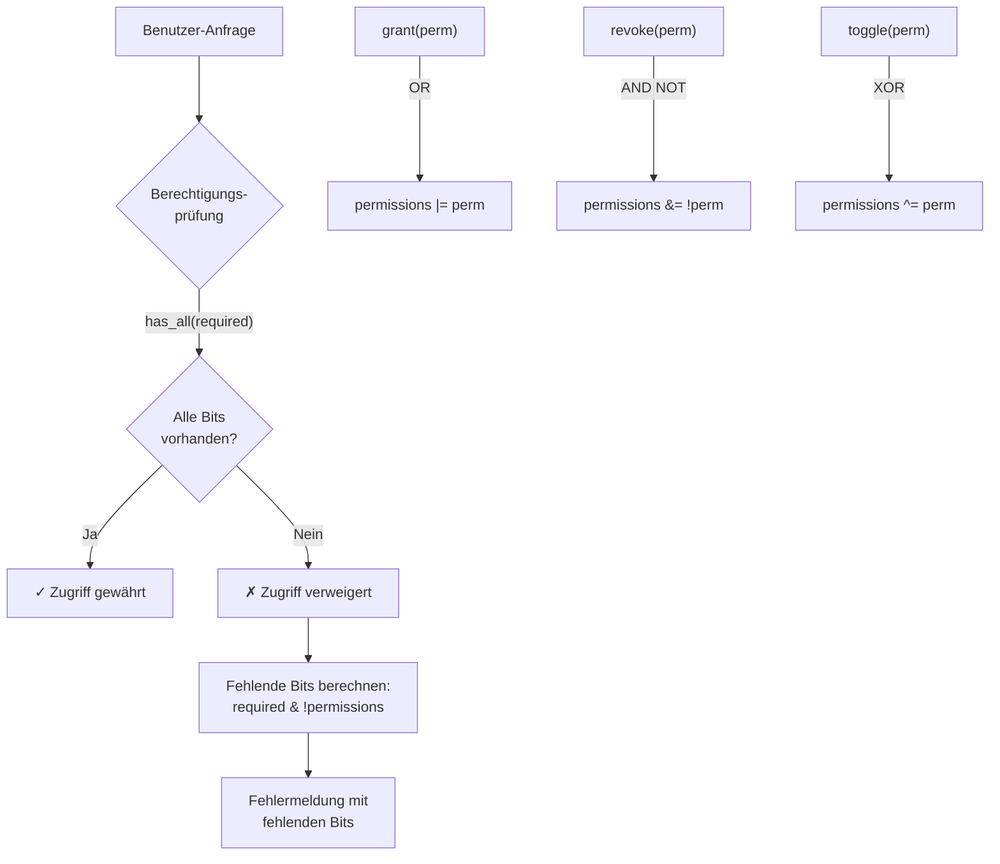

# Kapitel 13: Übungen zu Operatoren — Bit-Maskierung, Bit-Shifting und das Berechtigungssystem

---

## 1. Lernziele & Lernplan

Willkommen zu Kapitel 13! Dieses Kapitel ist eines der praxisnächsten des gesamten Kurses. Sie haben in Kapitel 12 die Grundlagen aller Rust-Operatoren kennengelernt — arithmetisch, logisch, bitweise und vergleichend. Jetzt setzen wir dieses Wissen in reale, anwendbare Fertigkeiten um.

Bit-Operationen sind kein akademisches Kuriosum. Sie sind das Fundament von Betriebssystemen, Netzwerkprotokollen, Datenkompression, Kryptographie, Gerätetreibern, Spieleprogrammierung und überall dort, wo Ressourcen sparsam eingesetzt werden müssen. Rust eignet sich durch seine Null-Kosten-Abstraktionen und seine Typsicherheit besonders gut für diese Art der Low-Level-Programmierung.

---

### 🎯 Lernziele nach Bloom'scher Taxonomie

| Bloom-Stufe | Ziel | Messbares Ergebnis |
|---|---|---|
| **Erinnern & Verstehen** | Sie können erläutern, was Bit-Maskierung, Bit-Shifting und Flag-Operationen sind und wie sie in Rust syntaktisch aussehen. | Sie schreiben kommentierte Codebeispiele ohne Nachschlagen. |
| **Anwenden** | Sie setzen, löschen und schalten einzelne Bits in einer Ganzzahl korrekt um und erklären das Vorgehen Schritt für Schritt. | Sie implementieren ein Flag-Register für ein selbstgewähltes Szenario. |
| **Analysieren & Erschaffen** | Sie entwerfen und implementieren ein vollständiges, erweiterbares Berechtigungssystem in Rust, das auf Bit-Masken basiert. | Sie bauen ein `Permission`-System mit `struct`, `impl`-Blöcken und aussagekräftigen Methoden. |

---

### 📅 Vorgeschlagener Lernplan

Dieses Kapitel ist in drei Phasen aufgebaut, die Sie idealerweise über zwei bis drei Lernsessions verteilen:

**Session 1 (ca. 45–60 Minuten):**
- Abschnitte 1–4: Lernziele, Definition, Motivation und naive Versuche lesen
- Alle Codebeispiele in `cargo new bit_uebungen` ausprobieren

**Session 2 (ca. 60–90 Minuten):**
- Abschnitte 5–7: Fehleranalyse, die Lösung und das Tutorial durcharbeiten
- Das Berechtigungssystem Schritt für Schritt selbst nachbauen

**Session 3 (ca. 45–60 Minuten):**
- Abschnitte 8–11: Mentale Modelle, Übungen und Zusammenfassung
- Mindestens die leichte und mittlere Übung lösen; Cheat Sheet ausdrucken oder speichern

> [!TIP]
> Legen Sie während des Lesens ein Rust-Projekt an und führen Sie jeden Codeblock aktiv aus. Passive Lektüre allein reicht bei Bit-Operationen nicht aus — Sie müssen die Muster im Code *sehen* und *erleben*, damit sie sich einprägen.

---

## 2. Die Definition — Was sind Bit-Operationen?

Um Bit-Operationen zu verstehen, müssen wir zunächst auf die unterste Ebene der Datenspeicherung schauen: das **Bit**.

### 2.1 Das Bit — Die kleinste Informationseinheit

Ein **Bit** (Binary Digit) kann genau zwei Zustände annehmen: `0` oder `1`. Acht Bits ergeben ein **Byte**. Ein `u8` in Rust ist beispielsweise ein 8-Bit-Integer ohne Vorzeichen, der Werte von 0 bis 255 annehmen kann.

```
Dezimal:  42
Binär:    0 0 1 0 1 0 1 0
Bit-Nr:   7 6 5 4 3 2 1 0
                  ↑       ↑
               Bit 5   Bit 1
```

Jedes Bit hat eine **Positionsnummer**, die von rechts (Position 0, niedrigstwertiges Bit, LSB) nach links (Position 7, höchstwertiges Bit, MSB) zählt. Der Wert eines gesetzten Bits an Position `n` beträgt `2^n`.

| Bit-Position | Wert (2^n) |
|---|---|
| 0 | 1 |
| 1 | 2 |
| 2 | 4 |
| 3 | 8 |
| 4 | 16 |
| 5 | 32 |
| 6 | 64 |
| 7 | 128 |

So ergibt sich für 42:
```
32 + 8 + 2 = 42
Bit 5 + Bit 3 + Bit 1 = 42
```

### 2.2 Die Bit-Operatoren in Rust

Rust stellt folgende bitweise Operatoren bereit:

| Operator | Name | Beschreibung |
|---|---|---|
| `&` | Bitweises UND (AND) | Ergebnis ist 1, wenn **beide** Bits 1 sind |
| `\|` | Bitweises ODER (OR) | Ergebnis ist 1, wenn **mindestens ein** Bit 1 ist |
| `^` | Bitweises XOR | Ergebnis ist 1, wenn **genau ein** Bit 1 ist |
| `!` | Bitweises NICHT (NOT) | Kehrt alle Bits um (bei vorzeichenlosen Typen) |
| `<<` | Left Shift | Verschiebt alle Bits nach links |
| `>>` | Right Shift | Verschiebt alle Bits nach rechts |

> [!NOTE]
> In Rust ist der `!`-Operator für ganzzahlige Typen das bitweise NOT (auch als Komplement bezeichnet). Im Gegensatz zu C/C++ ist `!` in Rust **ausschließlich** das bitweise NOT für Integer — das logische NOT heißt `!` ebenfalls, aber nur für `bool`-Werte. Rust unterscheidet hier durch den Typ automatisch.

### 2.3 Bit-Maskierung — Das Konzept

Eine **Bit-Maske** (engl. *bitmask*) ist ein speziell gewählter Zahlenwert, dessen Binärdarstellung dazu dient, bestimmte Bits in einer anderen Zahl zu **isolieren**, zu **setzen**, zu **löschen** oder **umzuschalten**.

**Die drei Grundoperationen der Bit-Maskierung:**

```
┌─────────────────────────────────────────────────────────┐
│  SETZEN (OR):     register = register | maske           │
│  LÖSCHEN (AND):   register = register & (!maske)        │
│  UMSCHALTEN(XOR): register = register ^ maske           │
└─────────────────────────────────────────────────────────┘
```

### 2.4 Bit-Shifting — Das Konzept

**Bit-Shifting** bedeutet, alle Bits einer Zahl um eine bestimmte Anzahl von Positionen nach links (`<<`) oder rechts (`>>`) zu verschieben.

```
Links-Shift  (<<): x << n  entspricht  x * 2^n
Rechts-Shift (>>): x >> n  entspricht  x / 2^n  (für positive Zahlen)
```

### 2.5 Flags — Das Konzept

**Flags** (Flaggen, Markierungen) sind einzelne Bits innerhalb eines Registers (einer Ganzzahl), die boolesche Eigenschaften repräsentieren. Anstatt acht separate `bool`-Variablen zu verwenden, packt man acht Zustände in ein einziges `u8`. Dieses Muster ist extrem speicher- und cacheeffizient.

```rust
// Statt acht booleans:
let kann_lesen:    bool = true;
let kann_schreiben: bool = false;
let kann_ausfuehren: bool = false;
// ... (5 weitere)

// Besser: Acht Flags in einem Byte:
let berechtigungen: u8 = 0b0000_0001; // nur "kann_lesen" gesetzt
```

---

## 3. Das Problem & Die Motivation — Warum Bit-Operationen?

### 3.1 Ein reales Szenario: Dateiberechtigungen

Jeder, der mit Linux oder Unix gearbeitet hat, kennt Befehle wie:

```bash
chmod 755 mein_programm
ls -la
# -rwxr-xr-x  mein_programm
```

Diese Ziffern `755` sind ein oktales Berechtigungssystem — ein klassisches Beispiel für Bit-Flags. Jede Ziffer repräsentiert drei Bits: Lesen, Schreiben, Ausführen. Und das für drei Gruppen: Eigentümer, Gruppe, Andere. Insgesamt: 9 Bits in einer Zahl gespeichert.

```
rwxrwxrwx
│││││││││
│││││││└─ Andere: Ausführen (Bit 0)
││││││└── Andere: Schreiben (Bit 1)
│││││└─── Andere: Lesen    (Bit 2)
││││└──── Gruppe: Ausführen (Bit 3)
│││└───── Gruppe: Schreiben (Bit 4)
││└────── Gruppe: Lesen    (Bit 5)
│└─────── Eigentümer: Ausführen (Bit 6)
└──────── Eigentümer: Schreiben (Bit 7)
          Eigentümer: Lesen    (Bit 8)
```

### 3.2 Warum nicht einfach `bool`-Variablen verwenden?

Betrachten Sie folgendes Szenario: Sie entwickeln einen eingebetteten Mikrocontroller-Treiber (Embedded System). Ihr Gerät hat 64 KB RAM. Ein `bool` in Rust belegt **ein ganzes Byte** (aus Alignment-Gründen), obwohl es nur 1 Bit Information trägt.

```
Ansatz mit bool:
8 booleans × 1 Byte = 8 Byte

Ansatz mit Bit-Flags:
8 Flags × 1 Bit = 1 Byte  (8× effizienter!)
```

Bei 1.000 Dateiobjekten:
```
bool-Ansatz:  1.000 × 8 Byte =  8.000 Byte = ~7,8 KB
Bit-Ansatz:   1.000 × 1 Byte =  1.000 Byte = ~0,98 KB
```

Das ist ein **Faktor 8** bei Speicherverbrauch!

### 3.3 Performance-Vorteile

Bit-Operationen sind extrem schnell. Moderne CPUs führen bitweise AND, OR, XOR und Shifts in einem einzigen Taktzyklus aus. Es gibt keine schnellere Art, mehrere boolesche Zustände gleichzeitig zu prüfen:

```rust
// Prüfe ALLE Berechtigungen gleichzeitig in einem Befehl:
if berechtigungen & (LESEN | SCHREIBEN | AUSFUEHREN) == (LESEN | SCHREIBEN | AUSFUEHREN) {
    println!("Vollzugriff!");
}
```

### 3.4 Weitere Anwendungsbereiche

| Domäne | Anwendung |
|---|---|
| **Betriebssysteme** | Prozess-Flags, Speicherschutz-Bits, Systemaufruf-Flags |
| **Netzwerkprotokolle** | TCP-Flags (SYN, ACK, FIN, RST, PSH, URG), IP-Header-Flags |
| **Kryptographie** | Bit-Permutationen, XOR-Verschlüsselung |
| **Grafikprogrammierung** | Pixel-Farben (RGBA als u32), Bit-Blitting |
| **Spieleprogrammierung** | Zustandsmaschinen, Kollisionsmasken |
| **Hardware-Programmierung** | Steuerregister von Mikrocontrollern |
| **Datenkompression** | Huffman-Codes, Lauflängenkodierung |
| **Datenbankindizes** | Bitmap-Indizes für schnelle Abfragen |

> [!IMPORTANT]
> Bit-Operationen sind kein "fortgeschrittenes" oder "seltenes" Thema. Sie werden in der Praxis ständig gebraucht, sobald Sie näher an Hardware, Betriebssysteme oder Performance-kritischen Code heranrücken. Als Rust-Entwickler werden Sie diesen Techniken regelmäßig begegnen.

---

## 4. Der naive Versuch — Typische Fehler bei Bit-Operationen

Bevor wir die korrekte Lösung zeigen, schauen wir uns an, was typische Anfänger-Fehler bei Bit-Operationen sind. Das hilft Ihnen, die häufigsten Fallen zu vermeiden.

### 4.1 Fehler 1: Dezimal statt Binär denken

```rust
fn main() {
    // FALSCH: Dezimale Werte für Bit-Flags
    let lesen:    u8 = 1;
    let schreiben: u8 = 2;
    let ausfuehren: u8 = 3; // ← FEHLER! Sollte 4 sein, nicht 3!

    let berechtigungen: u8 = lesen | schreiben | ausfuehren;
    println!("{}", berechtigungen); // Was kommt raus?
}
```

**Was geht schief?**

```
lesen      = 0b0000_0001  (Bit 0)
schreiben  = 0b0000_0010  (Bit 1)
ausfuehren = 0b0000_0011  (Bit 0 UND Bit 1 gesetzt — FALSCH!)

Das OR-Ergebnis:
  0b0000_0001
| 0b0000_0010
| 0b0000_0011
= 0b0000_0011  = 3

ausfuehren überschneidet sich mit lesen und schreiben!
```

> [!WARNING]
> Bit-Flags müssen immer **Potenzen von 2** sein (1, 2, 4, 8, 16, 32, ...), damit sie sich nicht überschneiden. Dies ist die häufigste Anfängerfalle bei Bit-Operationen.

### 4.2 Fehler 2: Falsches Löschen von Bits

```rust
fn main() {
    let mut berechtigungen: u8 = 0b0000_0111; // lesen, schreiben, ausführen gesetzt
    let schreiben: u8 = 0b0000_0010;

    // FALSCH: Versucht, schreiben zu löschen mit AND — aber das ist falsch!
    berechtigungen = berechtigungen & schreiben;
    // Das lässt NUR schreiben stehen und löscht ALLES andere!

    println!("{:08b}", berechtigungen); // Ausgabe: 00000010 — nicht was wir wollten!
}
```

**Richtig wäre:**
```rust
berechtigungen = berechtigungen & !schreiben;
// !0b0000_0010 = 0b1111_1101
// 0b0000_0111 & 0b1111_1101 = 0b0000_0101 ← schreiben ist weg, lesen und ausführen bleiben
```

### 4.3 Fehler 3: Vergessen, dass `!` für vorzeichenbehaftete Typen problematisch sein kann

```rust
fn main() {
    let flag: i8 = 0b0000_0010; // i8 statt u8!
    let negiert = !flag;
    println!("{}", negiert); // Ausgabe: -3 (wegen Zweierkomplement!)
}
```

Bei `i8` (vorzeichenbehaftet) wird das NOT-Bit-Muster als negative Zahl interpretiert! Verwenden Sie für Bit-Flags **immer vorzeichenlose Typen** (`u8`, `u16`, `u32`, `u64`, `u128`).

### 4.4 Fehler 4: Shift um mehr als die Bit-Breite

```rust
fn main() {
    let x: u8 = 1u8;
    // ACHTUNG: In Rust ist Shift um >= Bit-Breite ein Compile-Fehler (im Debug-Modus)
    // oder undefiniertes Verhalten in anderen Sprachen
    let y = x << 8; // Fehler! u8 hat nur 8 Bits (Positionen 0-7)
}
```

In Rust erhalten Sie bei einem Shift um die volle Breite oder mehr:
- **Im Debug-Build**: Panic (Laufzeitfehler)
- **Im Release-Build**: Implementierungsabhängiges Verhalten

> [!CAUTION]
> Verschieben Sie Bits **niemals** um einen Wert, der größer oder gleich der Bit-Breite des Typs ist. Bei `u8` sind nur Shifts von 0 bis 7 sicher. Bei `u32` von 0 bis 31, usw.

### 4.5 Fehler 5: Operator-Priorität vergessen

```rust
fn main() {
    let a: u8 = 0b1010;
    let b: u8 = 0b1100;
    let c: u8 = 0b0001;

    // FALSCH — was berechnet Rust hier wirklich?
    let ergebnis = a | b & c;
    // & hat höhere Priorität als |!
    // Das ist dasselbe wie: a | (b & c)
    // = 0b1010 | (0b1100 & 0b0001)
    // = 0b1010 | 0b0000
    // = 0b1010
    println!("{:08b}", ergebnis); // 00001010

    // Was Sie wahrscheinlich wollten: (a | b) & c
    let ergebnis_korrekt = (a | b) & c;
    println!("{:08b}", ergebnis_korrekt); // 00000001
}
```

**Priorität der bitweisen Operatoren in Rust (von hoch zu niedrig):**
```
!   (höchste Priorität)
<<  >>
&
^
|   (niedrigste Priorität)
```

> [!TIP]
> Setzen Sie bei Bit-Operationen mit mehreren Operatoren **immer explizite Klammern**, auch wenn Sie die Priorität kennen. Das macht den Code lesbarer und verhindert subtile Fehler.

### 4.6 Fehler 6: Typ-Inkompatibilität beim Shift

```rust
fn main() {
    let position: u8 = 3;
    let flag = 1u8 << position; // Das funktioniert in Rust!

    // Aber das nicht:
    // let flag2 = 1 << 3u8; // Funktioniert aber trotzdem, da Rust Typen inferiert
    
    // Das kann ein Problem werden bei:
    let n: u64 = 40;
    let shifted = 1u32 << n; // FEHLER: Mismatched types, n ist u64, Shift erwartet u32
    let shifted_korrekt = 1u64 << n; // OK
    println!("{}", shifted_korrekt);
}
```

---

## 5. Die Anatomie des Fehlers — Bit-Muster verstehen

Um Bit-Operationen wirklich zu meistern, müssen wir die Bit-Muster visualisieren können. In diesem Abschnitt zeigen wir detaillierte ASCII-Diagramme.

### 5.1 Das AND-Gatter — Bits isolieren

Das bitweise AND (`&`) ergibt `1` nur wenn **beide** Bits `1` sind. Es wird verwendet, um bestimmte Bits zu **isolieren** oder zu **löschen**.

```
Wahrheitstabelle AND:
┌───┬───┬────────┐
│ A │ B │ A & B  │
├───┼───┼────────┤
│ 0 │ 0 │   0    │
│ 0 │ 1 │   0    │
│ 1 │ 0 │    0    │
│ 1 │ 1 │   1    │  ← Nur hier ist das Ergebnis 1
└───┴───┴────────┘
```

**Beispiel: Bit 3 isolieren aus dem Wert 0b1010_1101**

```
Wert:    1 0 1 0 1 1 0 1   (= 173)
Maske:   0 0 0 0 1 0 0 0   (= 8, isoliert Bit 3)
         ─────────────────
AND:     0 0 0 0 1 0 0 0   (= 8, zeigt ob Bit 3 gesetzt war)

Bit 7 ───────────────────► Bit 0

Interpretation: Ergebnis != 0  →  Bit 3 ist gesetzt ✓
```

**Verwendung in Rust:**
```rust
let wert: u8 = 0b1010_1101;
let maske: u8 = 1 << 3; // 0b0000_1000
let bit3_isoliert = wert & maske;

if bit3_isoliert != 0 {
    println!("Bit 3 ist gesetzt!");
}
// Noch eleganter:
if (wert & maske) != 0 {
    println!("Bit 3 ist gesetzt!");
}
```

### 5.2 Das OR-Gatter — Bits setzen

Das bitweise OR (`|`) ergibt `1`, wenn **mindestens ein** Bit `1` ist. Es wird verwendet, um Bits zu **setzen**.

```
Wahrheitstabelle OR:
┌───┬───┬────────┐
│ A │ B │ A | B  │
├───┼───┼────────┤
│ 0 │ 0 │   0    │
│ 0 │ 1 │   1    │
│ 1 │ 0 │   1    │
│ 1 │ 1 │   1    │  ← Mindestens eines reicht
└───┴───┴────────┘
```

**Beispiel: Bit 5 setzen in 0b0010_0011**

```
Vorher:  0 0 1 0 0 0 1 1   (= 35)
Maske:   0 0 1 0 0 0 0 0   (= 32, setzt Bit 5)
         ─────────────────
OR:      0 0 1 0 0 0 1 1   (= 35, Bit 5 war schon gesetzt)

Bit 7 ───────────────────► Bit 0
```

Wenn Bit 5 noch nicht gesetzt war:

```
Vorher:  0 0 0 0 0 0 1 1   (= 3)
Maske:   0 0 1 0 0 0 0 0   (= 32, setzt Bit 5)
         ─────────────────
OR:      0 0 1 0 0 0 1 1   (= 35, Bit 5 ist jetzt gesetzt ✓)

Bit 7 ───────────────────► Bit 0
```

**Verwendung in Rust:**
```rust
let mut flags: u8 = 0b0000_0011;
let bit5_maske: u8 = 1 << 5; // 0b0010_0000

flags = flags | bit5_maske;
// Kurzform:
flags |= bit5_maske;

println!("{:08b}", flags); // 00100011
```

### 5.3 Das XOR-Gatter — Bits umschalten

Das bitweise XOR (`^`) ergibt `1`, wenn **genau ein** Bit `1` ist. Es wird verwendet, um Bits zu **umzuschalten** (Toggle).

```
Wahrheitstabelle XOR:
┌───┬───┬────────┐
│ A │ B │ A ^ B  │
├───┼───┼────────┤
│ 0 │ 0 │   0    │
│ 0 │ 1 │   1    │
│ 1 │ 0 │   1    │
│ 1 │ 1 │   0    │  ← Gleiche Bits → 0 (Unterschied zählt)
└───┴───┴────────┘
```

**Beispiel: Bit 2 umschalten (zweimal)**

```
Durchgang 1:
Vorher:  0 0 0 0 0 1 1 1   (= 7)
Maske:   0 0 0 0 0 1 0 0   (= 4, togglet Bit 2)
         ─────────────────
XOR:     0 0 0 0 0 0 1 1   (= 3, Bit 2 ist aus)

Durchgang 2:
Vorher:  0 0 0 0 0 0 1 1   (= 3)
Maske:   0 0 0 0 0 1 0 0   (= 4, togglet Bit 2)
         ─────────────────
XOR:     0 0 0 0 0 1 1 1   (= 7, Bit 2 ist wieder an!)
```

XOR ist sein eigenes Inverses: `x ^ maske ^ maske == x`. Daher eignet es sich perfekt für An/Aus-Schalter.

### 5.4 Das NOT-Komplement — Alle Bits umkehren

Das bitweise NOT (`!`) kehrt alle Bits um (Einerkomplement):

```
Wert:    0 0 0 0 0 0 1 0   (= 2,  für u8)
         ─────────────────
NOT:     1 1 1 1 1 1 0 1   (= 253, für u8)

Bit 7 ───────────────────► Bit 0
```

**Wichtig für Löschen von Bits:**

Um ein bestimmtes Bit zu löschen, kombinieren wir NOT mit AND:

```
Ziel: Bit 1 in 0b0000_0111 löschen

Maske:     0 0 0 0 0 0 1 0   (= 2, Bit 1)
NOT Maske: 1 1 1 1 1 1 0 1   (= 253)

Wert:      0 0 0 0 0 1 1 1   (= 7)
NOT Maske: 1 1 1 1 1 1 0 1   (= 253)
           ─────────────────
AND:       0 0 0 0 0 1 0 1   (= 5, Bit 1 ist gelöscht, alle anderen bleiben)
```

### 5.5 Left Shift — Multiplikation mit Zweierpotenzen

```
x << n  entspricht  x * 2^n

Ausgangswert:   0 0 0 0 0 0 0 1   (= 1)

Nach  << 1:     0 0 0 0 0 0 1 0   (= 2)
Nach  << 2:     0 0 0 0 0 1 0 0   (= 4)
Nach  << 3:     0 0 0 0 1 0 0 0   (= 8)
Nach  << 4:     0 0 0 1 0 0 0 0   (= 16)
Nach  << 5:     0 0 1 0 0 0 0 0   (= 32)
Nach  << 6:     0 1 0 0 0 0 0 0   (= 64)
Nach  << 7:     1 0 0 0 0 0 0 0   (= 128)

Bits wandern von rechts nach links!
←←←←←←←←←←←←←←←←←←←←←←←
```

### 5.6 Right Shift — Division durch Zweierpotenzen

```
x >> n  entspricht  x / 2^n  (ganzzahlig, rundet ab)

Ausgangswert:   1 0 0 0 0 0 0 0   (= 128)

Nach  >> 1:     0 1 0 0 0 0 0 0   (= 64)
Nach  >> 2:     0 0 1 0 0 0 0 0   (= 32)
Nach  >> 3:     0 0 0 1 0 0 0 0   (= 16)
Nach  >> 4:     0 0 0 0 1 0 0 0   (= 8)
Nach  >> 5:     0 0 0 0 0 1 0 0   (= 4)
Nach  >> 6:     0 0 0 0 0 0 1 0   (= 2)
Nach  >> 7:     0 0 0 0 0 0 0 1   (= 1)

Bits wandern von links nach rechts!
→→→→→→→→→→→→→→→→→→→→→→→
```

**Praktisches Beispiel: Schnelle Multiplikation und Division**

```rust
fn main() {
    let x: u32 = 100;

    // Statt x * 2:
    let doppelt = x << 1;   // 200

    // Statt x * 8:
    let achtfach = x << 3;  // 800

    // Statt x / 4:
    let viertel = x >> 2;   // 25

    // Statt x / 16:
    let sechzehntel = x >> 4; // 6 (ganzzahlig)

    println!("x={}, x<<1={}, x<<3={}, x>>2={}, x>>4={}",
             x, doppelt, achtfach, viertel, sechzehntel);
    // x=100, x<<1=200, x<<3=800, x>>2=25, x>>4=6
}
```

> [!NOTE]
> Moderne Compiler (einschließlich Rust/LLVM) optimieren `x * 2` automatisch zu `x << 1`. Sie müssen Shifts für Multiplikationen nicht manuell schreiben — der Compiler erledigt das für Sie. Shifts sind aber nützlich, wenn Sie die Absicht explicit machen wollen oder in `const`-Kontext arbeiten.

---

## 6. Die Lösung — Korrekte Bit-Operationen und das Berechtigungssystem

Jetzt bauen wir ein vollständiges, korrektes Berechtigungssystem. Wir starten mit den Grundbausteinen und erweitern schrittweise.

### 6.1 Die drei Grundoperationen — Korrekte Implementierung

```rust
fn main() {
    let mut register: u8 = 0b0000_0000;

    // === BITS SETZEN mit OR ===
    let maske_bit2: u8 = 1 << 2; // = 0b0000_0100

    register |= maske_bit2;
    println!("Nach Setzen von Bit 2:      {:08b}", register);
    // Ausgabe: 00000100

    register |= 1 << 5; // Bit 5 setzen
    println!("Nach Setzen von Bit 5:      {:08b}", register);
    // Ausgabe: 00100100

    // === BITS PRÜFEN mit AND ===
    if (register & maske_bit2) != 0 {
        println!("Bit 2 ist gesetzt: ✓");
    }

    if (register & (1 << 3)) == 0 {
        println!("Bit 3 ist NICHT gesetzt: ✓");
    }

    // === BITS LÖSCHEN mit AND + NOT ===
    register &= !(1 << 5); // Bit 5 löschen
    println!("Nach Löschen von Bit 5:     {:08b}", register);
    // Ausgabe: 00000100

    // === BITS UMSCHALTEN mit XOR ===
    register ^= maske_bit2; // Bit 2 umschalten (war an → jetzt aus)
    println!("Nach Toggle von Bit 2 (1x): {:08b}", register);
    // Ausgabe: 00000000

    register ^= maske_bit2; // Bit 2 umschalten (war aus → jetzt an)
    println!("Nach Toggle von Bit 2 (2x): {:08b}", register);
    // Ausgabe: 00000100
}
```

### 6.2 Das vollständige Berechtigungssystem

Jetzt kombinieren wir alles zu einem echten, produktionsreifen System:

```rust
// Berechtigungs-Konstanten (als u16 für 16 mögliche Berechtigungen)
const LESEN:          u16 = 1 << 0;  // 0b0000_0000_0000_0001 = 1
const SCHREIBEN:      u16 = 1 << 1;  // 0b0000_0000_0000_0010 = 2
const AUSFUEHREN:     u16 = 1 << 2;  // 0b0000_0000_0000_0100 = 4
const LOESCHEN:       u16 = 1 << 3;  // 0b0000_0000_0000_1000 = 8
const ERSTELLEN:      u16 = 1 << 4;  // 0b0000_0000_0001_0000 = 16
const UMBENENNEN:     u16 = 1 << 5;  // 0b0000_0000_0010_0000 = 32
const BERECHTIGUNGEN: u16 = 1 << 6;  // 0b0000_0000_0100_0000 = 64
const ADMIN:          u16 = 1 << 7;  // 0b0000_0000_1000_0000 = 128

// Kombinierte Berechtigungsgruppen
const VOLLZUGRIFF:     u16 = LESEN | SCHREIBEN | AUSFUEHREN |
                             LOESCHEN | ERSTELLEN | UMBENENNEN |
                             BERECHTIGUNGEN | ADMIN;
const STANDARD_NUTZER: u16 = LESEN | SCHREIBEN | ERSTELLEN;
const GAST:            u16 = LESEN;

/// Repräsentiert einen Benutzer mit einem Berechtigungs-Register.
struct Benutzer {
    name: String,
    berechtigungen: u16,
}

impl Benutzer {
    /// Erstellt einen neuen Benutzer ohne Berechtigungen.
    fn neu(name: &str) -> Self {
        Benutzer {
            name: name.to_string(),
            berechtigungen: 0,
        }
    }

    /// Erteilt eine oder mehrere Berechtigungen.
    fn berechtigung_erteilen(&mut self, berechtigung: u16) {
        self.berechtigungen |= berechtigung;
    }

    /// Entzieht eine oder mehrere Berechtigungen.
    fn berechtigung_entziehen(&mut self, berechtigung: u16) {
        self.berechtigungen &= !berechtigung;
    }

    /// Schaltet eine Berechtigung um.
    fn berechtigung_umschalten(&mut self, berechtigung: u16) {
        self.berechtigungen ^= berechtigung;
    }

    /// Prüft, ob ALLE angegebenen Berechtigungen vorhanden sind.
    fn hat_alle_berechtigungen(&self, berechtigungen: u16) -> bool {
        (self.berechtigungen & berechtigungen) == berechtigungen
    }

    /// Prüft, ob MINDESTENS EINE der angegebenen Berechtigungen vorhanden ist.
    fn hat_eine_berechtigung(&self, berechtigungen: u16) -> bool {
        (self.berechtigungen & berechtigungen) != 0
    }

    /// Gibt eine lesbare Darstellung der Berechtigungen aus.
    fn berechtigungen_anzeigen(&self) {
        println!("Benutzer: {}", self.name);
        println!("  Bitregister: {:016b}", self.berechtigungen);
        println!("  Berechtigungen:");
        let alle = [
            (LESEN,          "Lesen"),
            (SCHREIBEN,      "Schreiben"),
            (AUSFUEHREN,     "Ausführen"),
            (LOESCHEN,       "Löschen"),
            (ERSTELLEN,      "Erstellen"),
            (UMBENENNEN,     "Umbenennen"),
            (BERECHTIGUNGEN, "Berechtigungen verwalten"),
            (ADMIN,          "Admin"),
        ];
        for (flag, name) in &alle {
            let symbol = if (self.berechtigungen & flag) != 0 { "✓" } else { "✗" };
            println!("    {} {}", symbol, name);
        }
    }
}

fn main() {
    // Gast erstellen
    let mut gast = Benutzer::neu("Gast");
    gast.berechtigung_erteilen(GAST);
    gast.berechtigungen_anzeigen();
    println!();

    // Standard-Nutzer erstellen
    let mut nutzer = Benutzer::neu("Anna");
    nutzer.berechtigung_erteilen(STANDARD_NUTZER);
    nutzer.berechtigungen_anzeigen();
    println!();

    // Admin erstellen
    let mut admin = Benutzer::neu("Admin");
    admin.berechtigung_erteilen(VOLLZUGRIFF);
    admin.berechtigungen_anzeigen();
    println!();

    // Berechtigungen ändern
    println!("Anna erhält Ausführen-Berechtigung:");
    nutzer.berechtigung_erteilen(AUSFUEHREN);
    println!("  Neues Register: {:016b}", nutzer.berechtigungen);

    println!("Anna verliert Schreiben-Berechtigung:");
    nutzer.berechtigung_entziehen(SCHREIBEN);
    println!("  Neues Register: {:016b}", nutzer.berechtigungen);

    // Zugriffsprüfung
    println!();
    println!("=== Zugriffsprüfungen ===");
    let datei_aktion = LESEN | SCHREIBEN;
    println!("Anna kann lesen UND schreiben: {}",
             nutzer.hat_alle_berechtigungen(datei_aktion));
    println!("Gast hat irgendeine Berechtigung von [Schreiben, Admin]: {}",
             gast.hat_eine_berechtigung(SCHREIBEN | ADMIN));
}
```

---

## 7. Kleines Tutorial — Das Berechtigungssystem Schritt für Schritt bauen

In diesem Tutorial bauen Sie das Berechtigungssystem selbst auf. Jeder Schritt erklärt *was* und *warum*.

### Schritt 1: Das Projekt anlegen

```bash
cargo new berechtigungssystem
cd berechtigungssystem
```

### Schritt 2: Konstanten für Berechtigungs-Flags definieren

Öffnen Sie `src/main.rs` und beginnen Sie mit den Konstanten:

```rust
// src/main.rs

// Einzelne Berechtigungs-Bits
// Wir verwenden u32, um bis zu 32 Berechtigungen zu unterstützen.
pub const PERM_READ:    u32 = 1 << 0;  // 00000001
pub const PERM_WRITE:   u32 = 1 << 1;  // 00000010
pub const PERM_EXEC:    u32 = 1 << 2;  // 00000100
pub const PERM_DELETE:  u32 = 1 << 3;  // 00001000
pub const PERM_CREATE:  u32 = 1 << 4;  // 00010000
pub const PERM_RENAME:  u32 = 1 << 5;  // 00100000
pub const PERM_CHMOD:   u32 = 1 << 6;  // 01000000
pub const PERM_SUDO:    u32 = 1 << 7;  // 10000000
```

**Warum `1 << n`?**

```
1 << 0 = 0b0000_0001  (nur Bit 0 gesetzt)
1 << 1 = 0b0000_0010  (nur Bit 1 gesetzt)
1 << 2 = 0b0000_0100  (nur Bit 2 gesetzt)
...
```

Jede Konstante hat **genau ein Bit** gesetzt. Dadurch überschneiden sich keine zwei Flags.

### Schritt 3: Vordefinierte Rollen erstellen

```rust
// Kombinierte Rollen-Berechtigungen
pub const ROLE_GUEST: u32 = PERM_READ;
pub const ROLE_USER:  u32 = PERM_READ | PERM_WRITE | PERM_CREATE;
pub const ROLE_POWER: u32 = ROLE_USER | PERM_EXEC | PERM_RENAME | PERM_DELETE;
pub const ROLE_ADMIN: u32 = u32::MAX; // Alle Bits gesetzt = alle Berechtigungen
```

> [!NOTE]
> `u32::MAX` ist `0xFFFF_FFFF` = `0b1111_1111_1111_1111_1111_1111_1111_1111`. Alle 32 Bits sind gesetzt. Das bedeutet, dass ein Admin alle denkbaren Berechtigungen hat — auch zukünftige, die noch nicht definiert wurden!

### Schritt 4: Die `Permissions`-Struktur

```rust
/// Verwaltet Berechtigungen als Bit-Register.
#[derive(Debug, Clone, Copy)]
pub struct Permissions(u32);

impl Permissions {
    /// Keine Berechtigungen.
    pub fn none() -> Self {
        Permissions(0)
    }

    /// Alle Berechtigungen.
    pub fn all() -> Self {
        Permissions(u32::MAX)
    }

    /// Aus einem vordefinierten Rollen-Wert.
    pub fn from_role(role: u32) -> Self {
        Permissions(role)
    }

    /// Berechtigung setzen (OR).
    pub fn grant(&mut self, perm: u32) {
        self.0 |= perm;
    }

    /// Berechtigung entziehen (AND NOT).
    pub fn revoke(&mut self, perm: u32) {
        self.0 &= !perm;
    }

    /// Berechtigung umschalten (XOR).
    pub fn toggle(&mut self, perm: u32) {
        self.0 ^= perm;
    }

    /// Prüft, ob ALLE angegebenen Berechtigungen vorhanden sind.
    pub fn has_all(&self, perm: u32) -> bool {
        (self.0 & perm) == perm
    }

    /// Prüft, ob MINDESTENS EINE Berechtigung vorhanden ist.
    pub fn has_any(&self, perm: u32) -> bool {
        (self.0 & perm) != 0
    }

    /// Prüft, ob KEINE der angegebenen Berechtigungen vorhanden ist.
    pub fn has_none(&self, perm: u32) -> bool {
        (self.0 & perm) == 0
    }

    /// Rohwert des Registers.
    pub fn raw(&self) -> u32 {
        self.0
    }
}
```

**Warum `struct Permissions(u32)`?**

Das ist ein **Newtype-Pattern** — wir umhüllen `u32` in einem eigenen Typ. Das bietet zwei Vorteile:

1. Typsicherheit: Sie können keine `u32`-Zahl aus anderem Kontext versehentlich als `Permissions` verwenden
2. Methoden: Wir können Methoden direkt auf dem Typ definieren

### Schritt 5: Die `User`-Struktur

```rust
/// Repräsentiert einen Systembenutzter.
#[derive(Debug)]
pub struct User {
    pub id: u32,
    pub username: String,
    pub permissions: Permissions,
}

impl User {
    pub fn new(id: u32, username: &str, role: u32) -> Self {
        User {
            id,
            username: username.to_string(),
            permissions: Permissions::from_role(role),
        }
    }

    /// Prüft Zugriff und gibt einen beschreibenden Fehler zurück.
    pub fn check_access(&self, required: u32) -> Result<(), String> {
        if self.permissions.has_all(required) {
            Ok(())
        } else {
            let fehlende = required & !self.permissions.raw();
            Err(format!(
                "Zugriff verweigert für '{}': Fehlende Berechtigungen (Bits: {:08b})",
                self.username, fehlende
            ))
        }
    }
}
```

### Schritt 6: Display-Implementierung für lesbare Ausgabe

```rust
use std::fmt;

impl fmt::Display for Permissions {
    fn fmt(&self, f: &mut fmt::Formatter<'_>) -> fmt::Result {
        let flags = [
            (PERM_READ,   "read"),
            (PERM_WRITE,  "write"),
            (PERM_EXEC,   "exec"),
            (PERM_DELETE, "delete"),
            (PERM_CREATE, "create"),
            (PERM_RENAME, "rename"),
            (PERM_CHMOD,  "chmod"),
            (PERM_SUDO,   "sudo"),
        ];

        let aktive: Vec<&str> = flags
            .iter()
            .filter(|(flag, _)| (self.0 & flag) != 0)
            .map(|(_, name)| *name)
            .collect();

        if aktive.is_empty() {
            write!(f, "(keine)")
        } else {
            write!(f, "[{}]", aktive.join(", "))
        }
    }
}
```

### Schritt 7: Die `main`-Funktion

```rust
fn main() {
    // Benutzer erstellen
    let mut alice = User::new(1, "alice", ROLE_USER);
    let mut bob   = User::new(2, "bob",   ROLE_GUEST);
    let mut carol = User::new(3, "carol", ROLE_ADMIN);

    println!("=== Benutzersystem initialisiert ===");
    println!("Alice: {}", alice.permissions);
    println!("Bob:   {}", bob.permissions);
    println!("Carol: {}", carol.permissions);
    println!();

    // Zugriffsprüfungen
    println!("=== Zugriffsprüfungen ===");
    match alice.check_access(PERM_READ | PERM_WRITE) {
        Ok(())   => println!("Alice darf lesen+schreiben: ✓"),
        Err(msg) => println!("{}", msg),
    }

    match bob.check_access(PERM_WRITE) {
        Ok(())   => println!("Bob darf schreiben: ✓"),
        Err(msg) => println!("{}", msg),
    }

    // Berechtigungen dynamisch ändern
    println!();
    println!("=== Berechtigungsänderungen ===");
    alice.permissions.grant(PERM_EXEC);
    println!("Alice erhält Exec: {}", alice.permissions);

    bob.permissions.revoke(PERM_READ);
    println!("Bob verliert Read: {}", bob.permissions);

    // Toggle-Demo
    println!();
    println!("=== Toggle-Demo für Carol ===");
    println!("Vorher: {:032b}", carol.permissions.raw());
    carol.permissions.toggle(PERM_SUDO);
    println!("Nach Toggle SUDO: {:032b}", carol.permissions.raw());
    carol.permissions.toggle(PERM_SUDO);
    println!("Nach 2. Toggle:   {:032b}", carol.permissions.raw());

    // Bit-Shift als Multiplikation
    println!();
    println!("=== Bit-Shift Multiplikation ===");
    let basis: u32 = 7;
    for i in 0..=4 {
        println!("{} << {} = {} (= {} * 2^{})", basis, i, basis << i, basis, i);
    }
}
```

### Schritt 8: Kompilieren und ausführen

```bash
cargo run
```

**Erwartete Ausgabe (gekürzt):**
```
=== Benutzersystem initialisiert ===
Alice: [read, write, create]
Bob:   [read]
Carol: [read, write, exec, delete, create, rename, chmod, sudo]

=== Zugriffsprüfungen ===
Alice darf lesen+schreiben: ✓
Zugriff verweigert für 'bob': Fehlende Berechtigungen (Bits: 00000010)

=== Berechtigungsänderungen ===
Alice erhält Exec: [read, write, exec, create]
Bob verliert Read: (keine)

=== Toggle-Demo für Carol ===
Vorher: 11111111111111111111111111111111
Nach Toggle SUDO: 11111111111111111111111101111111
Nach 2. Toggle:   11111111111111111111111111111111

=== Bit-Shift Multiplikation ===
7 << 0 = 7 (= 7 * 2^0)
7 << 1 = 14 (= 7 * 2^1)
7 << 2 = 28 (= 7 * 2^2)
7 << 3 = 56 (= 7 * 2^3)
7 << 4 = 112 (= 7 * 2^4)
```

---

## 8. Mentale Modelle & Deep Dive

### 8.1 Das Bit-Register als Schaltertafel

Stellen Sie sich ein Bit-Register wie eine Reihe von Lichtschaltern vor:

```
┌────────────────────────────────────────────────────────────────┐
│                    BERECHTIGUNGS-REGISTER                       │
│                                                                  │
│  Bit: 7      6      5      4      3      2      1      0        │
│      ┌──┐  ┌──┐  ┌──┐  ┌──┐  ┌──┐  ┌──┐  ┌──┐  ┌──┐         │
│      │ 1│  │ 0│  │ 1│  │ 0│  │ 0│  │ 1│  │ 1│  │ 1│         │
│      └──┘  └──┘  └──┘  └──┘  └──┘  └──┘  └──┘  └──┘         │
│       ▲            ▲                   ▲    ▲    ▲             │
│      SUDO        RENAME              EXEC WRITE READ           │
│       AN          AUS                 AN   AN    AN             │
└────────────────────────────────────────────────────────────────┘

Dezimalwert: 128 + 32 + 4 + 2 + 1 = 167
Binär:       1010_0111
```

### 8.2 Bit-Operationen als Mengenlehre

Eine elegante Art, Bit-Operationen zu verstehen, ist als **Mengenoperationen**:

```
Menge A = {LESEN, SCHREIBEN, ERSTELLEN}  = 0b0001_0011
Menge B = {SCHREIBEN, AUSFUEHREN, ADMIN} = 0b1000_0110

A ∩ B (AND):  {SCHREIBEN}                = 0b0000_0010
A ∪ B (OR):   {LESEN, SCHREIBEN, ERSTELLEN, AUSFUEHREN, ADMIN}
                                          = 0b1001_0111
A △ B (XOR):  {LESEN, ERSTELLEN, AUSFUEHREN, ADMIN}
                                          = 0b1001_0101
∁A   (NOT):   Alles außer LESEN, SCHREIBEN, ERSTELLEN
                                          = 0b1110_1100
```

### 8.3 Mermaid-Diagramm: Berechtigungsfluss



### 8.4 RGB-Farben als Bit-Masken — Ein praktisches Beispiel

Eine 32-Bit-Farbe (ARGB) ist ein klassisches Beispiel für Bit-Masken:

```
ARGB-Farbe: 0xFF_AA_33_77

┌──────────────────────────────────────────────────────────────┐
│  Bits 31-24   Bits 23-16   Bits 15-8   Bits 7-0             │
│  ──────────   ──────────   ─────────   ────────             │
│     0xFF          0xAA        0x33       0x77               │
│   Alpha=255    Rot=170    Grün=51    Blau=119               │
└──────────────────────────────────────────────────────────────┘
```

```rust
fn main() {
    let farbe: u32 = 0xFF_AA_33_77;

    // Farbkomponenten extrahieren mit Masken und Shifts
    let alpha = (farbe >> 24) & 0xFF;
    let rot   = (farbe >> 16) & 0xFF;
    let gruen = (farbe >>  8) & 0xFF;
    let blau  = (farbe >>  0) & 0xFF;

    println!("Farbe: #{:08X}", farbe);
    println!("Alpha: {} ({:08b})", alpha, alpha);
    println!("Rot:   {} ({:08b})", rot,   rot);
    println!("Grün:  {} ({:08b})", gruen, gruen);
    println!("Blau:  {} ({:08b})", blau,  blau);

    // Farbe neu zusammensetzen
    let neue_farbe: u32 = (alpha << 24) | (rot << 16) | (gruen << 8) | blau;
    println!("Rekonstruiert: #{:08X}", neue_farbe);
    assert_eq!(farbe, neue_farbe);
    println!("Identisch: ✓");
}
```

### 8.5 Bit-Counting — Wie viele Berechtigungen hat ein Benutzer?

```rust
fn count_permissions(perms: u32) -> u32 {
    // Rust hat eine eingebaute Methode dafür:
    perms.count_ones()
}

fn main() {
    let admin_perms: u32 = 0b1111_1111;
    let user_perms:  u32 = 0b0000_0111;

    println!("Admin hat {} Berechtigungen", count_permissions(admin_perms)); // 8
    println!("User hat {} Berechtigungen",  count_permissions(user_perms));  // 3

    // Alle Bit-Methoden von Integer-Typen:
    let x: u32 = 0b1010_0110;
    println!("Gesetzte Bits:    {}", x.count_ones());    // 4
    println!("Nicht gesetzte:   {}", x.count_zeros());   // 28
    println!("Führende Nullen:  {}", x.leading_zeros()); // 24
    println!("Trailing Nullen:  {}", x.trailing_zeros());// 1
    println!("Bit-Umkehrung:    {:032b}", x.reverse_bits());
}
```

### 8.6 Bit-Operationen und Performance — Eine Benchmark-Intuition

Warum sind Bit-Operationen so schnell? Hier eine vereinfachte Erklärung:

```
CPU-Operationen und ihre typischen Kosten (stark vereinfacht):

  ADD (Addition):       ~1 Taktzyklus
  SUB (Subtraktion):    ~1 Taktzyklus
  AND, OR, XOR, NOT:    ~1 Taktzyklus  ← Bit-Operationen!
  SHL, SHR (Shift):     ~1 Taktzyklus  ← Shifts!
  MUL (Multiplikation): ~3-5 Taktzyklen (je nach CPU)
  DIV (Division):       ~20-40 Taktzyklen!!! ← Sehr teuer!

Ergebnis:
  x >> 3  (Shift)   = ~1  Taktzyklus
  x / 8   (Division)= ~20-40 Taktzyklen
  → Shift ist ~20-40x schneller für Zweierpotenz-Divisionen!
```

Das ist der Grund, warum Systemsoftware und Performance-kritischer Code intensiv Bit-Operationen verwendet.

### 8.7 Vollständige Bit-Operationstabelle für `u8`

```
Wert A:   0101_1010  (= 90)
Wert B:   0011_1100  (= 60)

  A & B:  0001_1000  (= 24)   Gemeinsame gesetzte Bits
  A | B:  0111_1110  (= 126)  Alle gesetzten Bits
  A ^ B:  0110_0110  (= 102)  Unterschiedliche Bits
    !A:   1010_0101  (= 165)  Alle Bits umgekehrt (u8)
  A << 1: 1011_0100  (= 180)  Links verschoben (Bit 7 geht verloren)
  A >> 1: 0010_1101  (= 45)   Rechts verschoben (mit 0 aufgefüllt)
  A << 2: 0110_1000  (= 104)  2× links verschoben
  A >> 2: 0001_0110  (= 22)   2× rechts verschoben
```

### 8.8 Das Zweierkomplement — Vorzeichenbehaftete Zahlen

Bei vorzeichenbehafteten Typen (`i8`, `i16`, `i32`, `i64`) funktioniert der Right-Shift anders:

```
Arithmetischer Right-Shift (vorzeichenbehaftet):
  Das Vorzeichen-Bit wird erhalten ("sign extension")

  -8 als i8:  1111_1000
  >> 1:       1111_1100  = -4  ← Vorzeichen-Bit bleibt 1

Logischer Right-Shift (vorzeichenlos):
  0 wird von links eingefüllt

  -8 als u8:  1111_1000  (= 248)
  >> 1:       0111_1100  = 124  ← 0 wird eingefüllt
```

Rust verwendet den **arithmetischen** Shift für vorzeichenbehaftete Typen und den **logischen** Shift für vorzeichenlose Typen — das ist korrekt und sicher.

> [!WARNING]
> Verwenden Sie für Bit-Flags **ausschließlich vorzeichenlose Typen** (`u8`, `u16`, `u32`, `u64`, `u128`). Bei vorzeichenbehafteten Typen kann das höchste Bit das Vorzeichen beeinflussen und zu unerwarteten Ergebnissen bei Shifts und NOT führen.

---

## 9. Drei Übungen

### Übung 1 (Leicht): Der Bit-Inspektor 🔍

**Aufgabe:**

Schreiben Sie eine Funktion `bit_status(wert: u8)`, die für jeden der 8 Bits angibt, ob er gesetzt (`1`) oder gelöscht (`0`) ist. Geben Sie eine schöne ASCII-Darstellung aus.

**Gewünschte Ausgabe für `wert = 0b1010_1101`:**

```
Wert: 173 (0b10101101)
┌──────┬──────┬──────┬──────┬──────┬──────┬──────┬──────┐
│ Bit7 │ Bit6 │ Bit5 │ Bit4 │ Bit3 │ Bit2 │ Bit1 │ Bit0 │
├──────┼──────┼──────┼──────┼──────┼──────┼──────┼──────┤
│  1   │  0   │  1   │  0   │  1   │  1   │  0   │  1   │
│  AN  │ AUS  │  AN  │ AUS  │  AN  │  AN  │ AUS  │  AN  │
└──────┴──────┴──────┴──────┴──────┴──────┴──────┴──────┘
Gesetzte Bits: 5
```

**Hints:**

<details>
<summary>💡 Hint 1 (Grundstruktur)</summary>

Iterieren Sie über die Bit-Positionen 7 bis 0 (von oben nach unten):
```rust
for i in (0..8).rev() {
    let bit = (wert >> i) & 1;
    // bit ist jetzt 0 oder 1
}
```
</details>

<details>
<summary>💡 Hint 2 (Tabellenformat)</summary>

Bauen Sie die Ausgabe in drei Zeilen auf:
1. Header mit Bit-Nummern
2. Trennlinie
3. Werte (0 oder 1)
4. Status (AN oder AUS)

Verwenden Sie `format!` und String-Verkettung oder eine `Vec<String>`.
</details>

<details>
<summary>💡 Hint 3 (count_ones)</summary>

Für die Anzahl gesetzter Bits:
```rust
let anzahl = wert.count_ones();
```
</details>

**Musterlösung:**

```rust
fn bit_status(wert: u8) {
    println!("Wert: {} ({:#010b})", wert, wert);

    let mut header    = String::from("┌");
    let mut trenner   = String::from("├");
    let mut werte_z   = String::from("│");
    let mut status_z  = String::from("│");
    let mut footer    = String::from("└");

    for i in (0..8).rev() {
        let bit = (wert >> i) & 1;
        let label = format!(" Bit{} ", i);
        let breite = label.len();

        header   += &format!("{}┬", "─".repeat(breite));
        trenner  += &format!("{}┼", "─".repeat(breite));
        footer   += &format!("{}┴", "─".repeat(breite));

        let bit_str = format!("{:^width$}", bit, width = breite);
        let status  = format!("{:^width$}", if bit == 1 { "AN" } else { "AUS" }, width = breite);
        werte_z  += &format!("{}│", bit_str);
        status_z += &format!("{}│", status);
    }
    // Letzte Zeichen anpassen
    header  = header[..header.len()-3].to_string() + "┐";
    trenner = trenner[..trenner.len()-3].to_string() + "┤";
    footer  = footer[..footer.len()-3].to_string() + "┘";

    println!("{}", header);
    println!("│ Bit7 │ Bit6 │ Bit5 │ Bit4 │ Bit3 │ Bit2 │ Bit1 │ Bit0 │");
    println!("{}", trenner);
    println!("{}",  werte_z);
    println!("{}",  status_z);
    println!("{}", footer);
    println!("Gesetzte Bits: {}", wert.count_ones());
}

fn main() {
    bit_status(0b1010_1101);
}
```

---

### Übung 2 (Mittel): Der Berechtigungs-Diff 🔄

**Aufgabe:**

Schreiben Sie eine Funktion `berechtigungs_diff(alt: u32, neu: u32)`, die anzeigt, welche Berechtigungen hinzugekommen sind und welche entfernt wurden.

**Gewünschte Ausgabe:**

```
=== Berechtigungs-Änderungen ===
Hinzugekommen (+):
  + exec  (Bit 2)
  + sudo  (Bit 7)
Entfernt (-):
  - write (Bit 1)
  - create (Bit 4)
Unverändert: read, delete, rename, chmod
```

**Hints:**

<details>
<summary>💡 Hint 1 (Differenz-Bits finden)</summary>

```rust
let hinzugekommen = neu & !alt;  // Bits, die neu gesetzt wurden
let entfernt      = alt & !neu;  // Bits, die gelöscht wurden
let unveraendert  = alt & neu;   // Bits, die in beiden vorhanden sind
```
</details>

<details>
<summary>💡 Hint 2 (Iteration über definierte Flags)</summary>

Definieren Sie ein Array aller bekannten Flags und iterieren Sie darüber:
```rust
let flags = [
    (PERM_READ,   "read",   0u32),
    (PERM_WRITE,  "write",  1u32),
    // ...
];
for (flag, name, bit_nr) in &flags {
    if (hinzugekommen & flag) != 0 {
        println!("  + {} (Bit {})", name, bit_nr);
    }
}
```
</details>

<details>
<summary>💡 Hint 3 (Unverändertes)</summary>

Sammeln Sie unverändertes in einen `Vec<&str>` und geben Sie es mit `.join(", ")` aus.
</details>

**Musterlösung:**

```rust
const PERM_READ:   u32 = 1 << 0;
const PERM_WRITE:  u32 = 1 << 1;
const PERM_EXEC:   u32 = 1 << 2;
const PERM_DELETE: u32 = 1 << 3;
const PERM_CREATE: u32 = 1 << 4;
const PERM_RENAME: u32 = 1 << 5;
const PERM_CHMOD:  u32 = 1 << 6;
const PERM_SUDO:   u32 = 1 << 7;

fn berechtigungs_diff(alt: u32, neu: u32) {
    let flags = [
        (PERM_READ,   "read",   0u32),
        (PERM_WRITE,  "write",  1),
        (PERM_EXEC,   "exec",   2),
        (PERM_DELETE, "delete", 3),
        (PERM_CREATE, "create", 4),
        (PERM_RENAME, "rename", 5),
        (PERM_CHMOD,  "chmod",  6),
        (PERM_SUDO,   "sudo",   7),
    ];

    let hinzugekommen = neu & !alt;
    let entfernt      = alt & !neu;
    let unveraendert  = alt & neu;

    println!("=== Berechtigungs-Änderungen ===");

    println!("Hinzugekommen (+):");
    let mut hat_hinzugekommen = false;
    for (flag, name, bit_nr) in &flags {
        if (hinzugekommen & flag) != 0 {
            println!("  + {} (Bit {})", name, bit_nr);
            hat_hinzugekommen = true;
        }
    }
    if !hat_hinzugekommen { println!("  (keine)"); }

    println!("Entfernt (-):");
    let mut hat_entfernt = false;
    for (flag, name, bit_nr) in &flags {
        if (entfernt & flag) != 0 {
            println!("  - {} (Bit {})", name, bit_nr);
            hat_entfernt = true;
        }
    }
    if !hat_entfernt { println!("  (keine)"); }

    let unv: Vec<&str> = flags.iter()
        .filter(|(flag, _, _)| (unveraendert & flag) != 0)
        .map(|(_, name, _)| *name)
        .collect();

    if !unv.is_empty() {
        println!("Unverändert: {}", unv.join(", "));
    } else {
        println!("Unverändert: (keine)");
    }
}

fn main() {
    let alte_perms: u32 = PERM_READ | PERM_WRITE | PERM_DELETE | PERM_CREATE | PERM_RENAME | PERM_CHMOD;
    let neue_perms: u32 = PERM_READ | PERM_EXEC | PERM_DELETE | PERM_RENAME | PERM_CHMOD | PERM_SUDO;
    berechtigungs_diff(alte_perms, neue_perms);
}
```

---

### Übung 3 (Schwer): Das Mehrebenen-Berechtigungssystem 🏗️

**Aufgabe:**

Erweitern Sie das Berechtigungssystem um folgende Features:

1. **Vererbung**: Ein Benutzer kann die Berechtigungen eines anderen Benutzers erben (`inherit_from`)
2. **Berechtigungsgruppen**: Mehrere Benutzer können zu einer `Group` zusammengefasst werden, die gemeinsame Berechtigungen hat
3. **Effektive Berechtigungen**: Die effektiven Berechtigungen eines Benutzers sind die Vereinigung seiner eigenen und aller seiner Gruppen-Berechtigungen
4. **Überschreibung**: Der Benutzer kann Berechtigungen explizit **verweigern** (deny), die Gruppen-Berechtigungen überschreiben

**Schema:**

```
Effektive Berechtigung =
    (Gruppen-Berechtigungen | Eigene Berechtigungen)
    & !(Explizite Verweigerungen)
```

**Hints:**

<details>
<summary>💡 Hint 1 (Datenstruktur)</summary>

```rust
struct Group {
    name: String,
    permissions: u32,
}

struct User {
    name: String,
    own_permissions: u32,
    denied_permissions: u32,  // Explizit verweigerte Bits
    groups: Vec<Group>,
}
```
</details>

<details>
<summary>💡 Hint 2 (Effektive Berechtigungen berechnen)</summary>

```rust
fn effective_permissions(&self) -> u32 {
    let group_perms: u32 = self.groups
        .iter()
        .fold(0u32, |acc, g| acc | g.permissions);
    
    let combined = group_perms | self.own_permissions;
    combined & !self.denied_permissions
}
```
</details>

<details>
<summary>💡 Hint 3 (Vererbung implementieren)</summary>

```rust
fn inherit_from(&mut self, other: &User) {
    // Übernehme alle Berechtigungen des anderen Users, außer seine Verweigerungen
    let ererbte = other.effective_permissions();
    self.own_permissions |= ererbte;
}
```
</details>

**Musterlösung (Skelett):**

```rust
#[derive(Debug, Clone)]
struct Group {
    name: String,
    permissions: u32,
}

impl Group {
    fn new(name: &str, permissions: u32) -> Self {
        Group { name: name.to_string(), permissions }
    }
}

#[derive(Debug)]
struct AdvancedUser {
    name: String,
    own_permissions: u32,
    denied_permissions: u32,
    groups: Vec<Group>,
}

impl AdvancedUser {
    fn new(name: &str) -> Self {
        AdvancedUser {
            name: name.to_string(),
            own_permissions: 0,
            denied_permissions: 0,
            groups: Vec::new(),
        }
    }

    fn join_group(&mut self, group: Group) {
        self.groups.push(group);
    }

    fn grant(&mut self, perm: u32) {
        self.own_permissions |= perm;
        // Wenn explizit gewährt, Verweigerung aufheben:
        self.denied_permissions &= !perm;
    }

    fn deny(&mut self, perm: u32) {
        self.denied_permissions |= perm;
        // Verweigerung entfernt auch eigene Erlaubnis:
        self.own_permissions &= !perm;
    }

    fn effective_permissions(&self) -> u32 {
        let group_perms: u32 = self.groups
            .iter()
            .fold(0u32, |acc, g| acc | g.permissions);
        let combined = group_perms | self.own_permissions;
        combined & !self.denied_permissions
    }

    fn inherit_from(&mut self, other: &AdvancedUser) {
        let ererbte = other.effective_permissions();
        self.own_permissions |= ererbte;
    }

    fn has_permission(&self, perm: u32) -> bool {
        (self.effective_permissions() & perm) == perm
    }

    fn show(&self) {
        println!("Benutzer: {}", self.name);
        println!("  Eigene Perms:    {:08b}", self.own_permissions);
        println!("  Verweigert:      {:08b}", self.denied_permissions);
        println!("  Effektiv:        {:08b}", self.effective_permissions());
        if !self.groups.is_empty() {
            let namen: Vec<&str> = self.groups.iter().map(|g| g.name.as_str()).collect();
            println!("  Gruppen:         {}", namen.join(", "));
        }
    }
}

fn main() {
    // Gruppen definieren
    let entwickler_gruppe = Group::new("Entwickler",
        PERM_READ | PERM_WRITE | PERM_EXEC | PERM_CREATE);
    let admin_gruppe = Group::new("Admin",
        PERM_READ | PERM_WRITE | PERM_EXEC | PERM_DELETE |
        PERM_CREATE | PERM_RENAME | PERM_CHMOD | PERM_SUDO);

    // Benutzer erstellen und Gruppen zuweisen
    let mut alice = AdvancedUser::new("Alice");
    alice.join_group(entwickler_gruppe.clone());
    alice.grant(PERM_RENAME); // Zusätzliche eigene Berechtigung

    let mut bob = AdvancedUser::new("Bob");
    bob.join_group(entwickler_gruppe.clone());
    bob.deny(PERM_EXEC); // Bob darf trotz Gruppen-Berechtigung nicht ausführen

    let mut carol = AdvancedUser::new("Carol");
    carol.join_group(admin_gruppe);

    // Dave erbt von Carol
    let mut dave = AdvancedUser::new("Dave");
    dave.inherit_from(&carol);
    dave.deny(PERM_SUDO); // Aber kein SUDO

    println!("=== Erweiterte Benutzerverwaltung ===\n");
    alice.show();
    println!();
    bob.show();
    println!();
    carol.show();
    println!();
    dave.show();

    println!("\n=== Zugriffsprüfungen ===");
    println!("Alice kann exec: {}", alice.has_permission(PERM_EXEC));
    println!("Bob kann exec:   {}", bob.has_permission(PERM_EXEC));
    println!("Dave kann sudo:  {}", dave.has_permission(PERM_SUDO));
}
```

---

## 10. Lernstrategie & Merkzettel

### 10.1 Die drei goldenen Regeln für Bit-Operationen

```
┌─────────────────────────────────────────────────────────────────┐
│  GOLDENE REGEL 1: Flags sind immer Potenzen von 2               │
│  ────────────────────────────────────────────────────────────── │
│  const FLAG_A: u32 = 1 << 0;  // 1                             │
│  const FLAG_B: u32 = 1 << 1;  // 2                             │
│  const FLAG_C: u32 = 1 << 2;  // 4                             │
│  ✗ const FLAG_D: u32 = 3;     // FALSCH! (Bit 0 UND Bit 1)     │
└─────────────────────────────────────────────────────────────────┘

┌─────────────────────────────────────────────────────────────────┐
│  GOLDENE REGEL 2: Nur vorzeichenlose Typen für Bit-Flags        │
│  ────────────────────────────────────────────────────────────── │
│  ✓ u8, u16, u32, u64, u128                                      │
│  ✗ i8, i16, i32, i64 (Vorzeichen-Bit macht Probleme)           │
└─────────────────────────────────────────────────────────────────┘

┌─────────────────────────────────────────────────────────────────┐
│  GOLDENE REGEL 3: Explizite Klammern bei gemischten Operatoren  │
│  ────────────────────────────────────────────────────────────── │
│  ✓ (a | b) & c    // Klar und eindeutig                         │
│  ✗ a | b & c      // Was gilt zuerst? (& vor |)                 │
└─────────────────────────────────────────────────────────────────┘
```

### 10.2 Cheat Sheet — Bit-Operationen auf einen Blick

```
╔══════════════════════════════════════════════════════════════════╗
║             RUST BIT-OPERATIONEN CHEAT SHEET                     ║
╠══════════════════════════════════════════════════════════════════╣
║                                                                  ║
║  BITS SETZEN           register |= (1 << n);                    ║
║                        register |= maske;                        ║
║                                                                  ║
║  BITS LÖSCHEN          register &= !(1 << n);                   ║
║                        register &= !maske;                       ║
║                                                                  ║
║  BITS UMSCHALTEN       register ^= (1 << n);                    ║
║                        register ^= maske;                        ║
║                                                                  ║
║  BITS PRÜFEN (Alle)    (register & maske) == maske              ║
║  BITS PRÜFEN (Eines)   (register & maske) != 0                  ║
║  BITS PRÜFEN (Keine)   (register & maske) == 0                  ║
║                                                                  ║
╠══════════════════════════════════════════════════════════════════╣
║                                                                  ║
║  SHIFTS                                                          ║
║  x << n  =  x * 2^n   (Links-Shift = Mult. mit Zweierpotenz)   ║
║  x >> n  =  x / 2^n   (Rechts-Shift = Div. durch Zweierpotenz) ║
║                                                                  ║
║  ACHTUNG:  Shift >= Bit-Breite → Panic (Debug) / UB (Release)   ║
║                                                                  ║
╠══════════════════════════════════════════════════════════════════╣
║                                                                  ║
║  WAHRHEITSTABELLEN                                               ║
║  AND: 0&0=0, 0&1=0, 1&0=0, 1&1=1                               ║
║  OR:  0|0=0, 0|1=1, 1|0=1, 1|1=1                               ║
║  XOR: 0^0=0, 0^1=1, 1^0=1, 1^1=0                               ║
║  NOT: !0=1, !1=0 (bitweise für alle Bits)                       ║
║                                                                  ║
╠══════════════════════════════════════════════════════════════════╣
║                                                                  ║
║  PRIORITÄT (hoch → niedrig):                                     ║
║  ! >> << >> & ^ |                                                ║
║  Merke: "NOT-SHIFT-AND-XOR-OR" oder Klammern setzen!            ║
║                                                                  ║
╠══════════════════════════════════════════════════════════════════╣
║                                                                  ║
║  NÜTZLICHE INTEGER-METHODEN                                      ║
║  x.count_ones()     Anzahl gesetzter Bits                       ║
║  x.count_zeros()    Anzahl nicht gesetzter Bits                  ║
║  x.leading_zeros()  Führende Nullen                             ║
║  x.trailing_zeros() Abschließende Nullen                        ║
║  x.reverse_bits()   Bits umkehren                               ║
║  x.rotate_left(n)   Rotation nach links                         ║
║  x.rotate_right(n)  Rotation nach rechts                        ║
║                                                                  ║
╠══════════════════════════════════════════════════════════════════╣
║                                                                  ║
║  AUSGABEFORMATE                                                  ║
║  {:b}     Binär (ohne führende Nullen)                          ║
║  {:08b}   Binär mit 8 Stellen (führende Nullen)                 ║
║  {:x}     Hex klein (0a3f)                                       ║
║  {:X}     Hex groß (0A3F)                                        ║
║  {:#b}    Binär mit 0b-Präfix                                   ║
║  {:#x}    Hex mit 0x-Präfix                                      ║
║  {:#010b} Binär mit 0b-Präfix und 10 Zeichen Breite             ║
║                                                                  ║
╚══════════════════════════════════════════════════════════════════╝
```

### 10.3 Häufige Fehler und ihre Lösungen

| Fehler | Problem | Lösung |
|---|---|---|
| `const X: u8 = 3;` als Flag | Bit 0 und Bit 1 überschneiden sich | `const X: u8 = 1 << 2;` (nächste Potenz) |
| `reg & maske` zum Löschen | Behält nur die Maske-Bits | `reg & !maske` |
| Shift um 8+ bei `u8` | Panic oder UB | Maximaler Shift: Bit-Breite - 1 |
| Gemischte Prioritäten ohne Klammern | Falsches Ergebnis | Immer explizite Klammern |
| `i32` für Flags | Vorzeichen-Bit-Probleme | `u32` verwenden |
| `!=` statt `== 0` beim Prüfen | Bekommst den Maskenwert, nicht true/false | `(reg & mask) != 0` für bool |

### 10.4 Mnemoniken (Gedächtnishilfen)

```
Bits SETZEN     →  OR  (|)   →  "ODER ich setze es"
Bits LÖSCHEN    →  AND NOT   →  "UND NICHT das Bit"
Bits TOGGLE     →  XOR (^)   →  "eXklusiv wechseln"
Bits PRÜFEN     →  AND (& )  →  "UND, ob es gesetzt ist"

Merkregel:   "SOL-TUP"
             Setzen=OR, Löschen=AND-Not, Toggle=XOR, Testen=AND-Prüfen
```

### 10.5 Lernstrategie für Bit-Operationen

**Stufe 1 — Verstehen (heute):**
- Alle Beispiele in diesem Kapitel ausführen
- Jeden Wert in binärer Form aufschreiben
- Den Cheat Sheet ausdrucken und neben den Bildschirm legen

**Stufe 2 — Anwenden (diese Woche):**
- Das Berechtigungssystem aus Abschnitt 7 komplett selbst neu schreiben (ohne zu schauen)
- Die drei Übungen lösen

**Stufe 3 — Vertiefen (nächste Woche):**
- Recherchieren Sie, wie Linux-Dateiberechtigungen intern implementiert sind (Stichwort: `stat`, `mode_t`)
- Lesen Sie über Rust's `bitflags!`-Crate (externe Bibliothek für komfortables Flag-Management)
- Experimentieren Sie mit Bit-Operationen bei RGB-Farben oder TCP-Paketen

> [!TIP]
> Das `bitflags`-Crate (`cargo add bitflags`) stellt ein mächtiges Makro bereit, das automatisch Setter, Getter, Toggle und formatierte Ausgabe für Bit-Flags generiert. Es wird in der Rust-Community weit verbreitet eingesetzt (z.B. in `wgpu`, `vulkano`, `winit`). Für Produktionscode empfiehlt sich der Einsatz dieses Crates, aber das manuelle Verständnis der zugrunde liegenden Bit-Operationen bleibt unerlässlich.

---

## 11. Zusammenfassung

In diesem Kapitel haben Sie eine der fundamentalsten Techniken der systemnahen Programmierung erlernt und praktisch angewandt: **Bit-Operationen**.

### 11.1 Was Sie gelernt haben

| Thema | Kernaussage |
|---|---|
| **Bit-Flags** | Potenzen von 2 als Flags, immer vorzeichenlose Typen |
| **Bits setzen** | `register \|= maske` (OR-Operator) |
| **Bits löschen** | `register &= !maske` (AND mit NOT-Maske) |
| **Bits umschalten** | `register ^= maske` (XOR-Operator) |
| **Bits prüfen (alle)** | `(register & maske) == maske` |
| **Bits prüfen (eines)** | `(register & maske) != 0` |
| **Left Shift** | `x << n` entspricht `x * 2^n` |
| **Right Shift** | `x >> n` entspricht `x / 2^n` |
| **Operator-Priorität** | `!` > `<<` `>>` > `&` > `^` > `\|` |
| **Fehler vermeiden** | Keine i-Typen für Flags, kein Shift >= Bit-Breite, immer Klammern |

### 11.2 Das Berechtigungssystem in der Retrospektive

Das Berechtigungssystem, das wir in diesem Kapitel entwickelt haben, demonstriert vier wichtige Rust-Prinzipien:

1. **Typsicherheit durch Newtype-Pattern**: `struct Permissions(u32)` ist nicht dasselbe wie eine rohe `u32`
2. **Ausdrucksstarke APIs**: Methoden wie `grant()`, `revoke()`, `toggle()` machen die Absicht klar
3. **Erweiterbarkeit**: Das System lässt sich um beliebig viele Flags erweitern (bis zu 32 bei `u32`, 64 bei `u64`, 128 bei `u128`)
4. **Performance**: Alle Operationen sind O(1) und werden in einem einzigen CPU-Befehl ausgeführt

### 11.3 Bit-Operationen im Rust-Ökosystem

Rust nutzt Bit-Operationen durchgehend in der Standardbibliothek und im Ökosystem:

- **`std::fs::Permissions`**: Dateiberechtigungen auf Unix-Systemen
- **`std::io::OpenOptions`**: Flags für das Öffnen von Dateien
- **`bitflags`-Crate**: Typsicheres Flag-Management
- **`nix`-Crate**: Unix-Systemaufrufe mit Bit-Flags
- **`wgpu`**: GPU-Berechtigungs-Flags für Vertex, Fragment, Compute Shader
- **`tokio`**: Interne Zustandsmasken für async Tasks

### 11.4 Ausblick auf Kapitel 14

In Kapitel 14 werden Sie die Entwicklungsumgebung weiter professionalisieren und das Antigravity CLI kennenlernen. Die Bit-Operationen aus diesem Kapitel werden Sie in späteren Kapiteln wiedersehen, wenn wir uns mit Enumerations (`enum`) und dem Pattern Matching beschäftigen — denn Rust's `enum` bietet eine typsichere Alternative zu manuellen Bit-Flags für viele Anwendungsfälle.

> [!IMPORTANT]
> **Wichtigste Erkenntnis dieses Kapitels:** Bit-Operationen sind keine Magie — sie sind einfache, deterministische Transformationen von Null-und-Eins-Mustern. Wenn Sie die vier Grundoperationen (OR=Setzen, AND NOT=Löschen, XOR=Toggle, AND=Prüfen) und das Prinzip der Zweierpotenzen als Flags verinnerlichen, können Sie jedes Bit-basierte System verstehen und implementieren.

---

### Weiterführende Ressourcen

- 📖 [Rust Reference — Bit Operations](https://doc.rust-lang.org/reference/expressions/operator-expr.html#arithmetic-and-logical-binary-operators)
- 📖 [bitflags-Crate Dokumentation](https://docs.rs/bitflags/latest/bitflags/)
- 📖 [Rustonomicon — Bit-Level Manipulation](https://doc.rust-lang.org/nomicon/)
- 📖 [Hacker's Delight — Klassisches Buch über Bit-Tricks](https://en.wikipedia.org/wiki/Hacker%27s_Delight)
- 🎓 [Stanford Bit-Twiddling Hacks](https://graphics.stanford.edu/~seander/bithacks.html)

---

**Lizenz- und Attributionshinweis**: Teile dieses Kapitels basieren auf Übersetzungen des offiziellen Buches [The Rust Programming Language](https://doc.rust-lang.org/book/) von Steve Klabnik und Carol Nichols, lizenziert unter [MIT](https://opensource.org/licenses/MIT) und [Apache 2.0](https://www.apache.org/licenses/LICENSE-2.0).