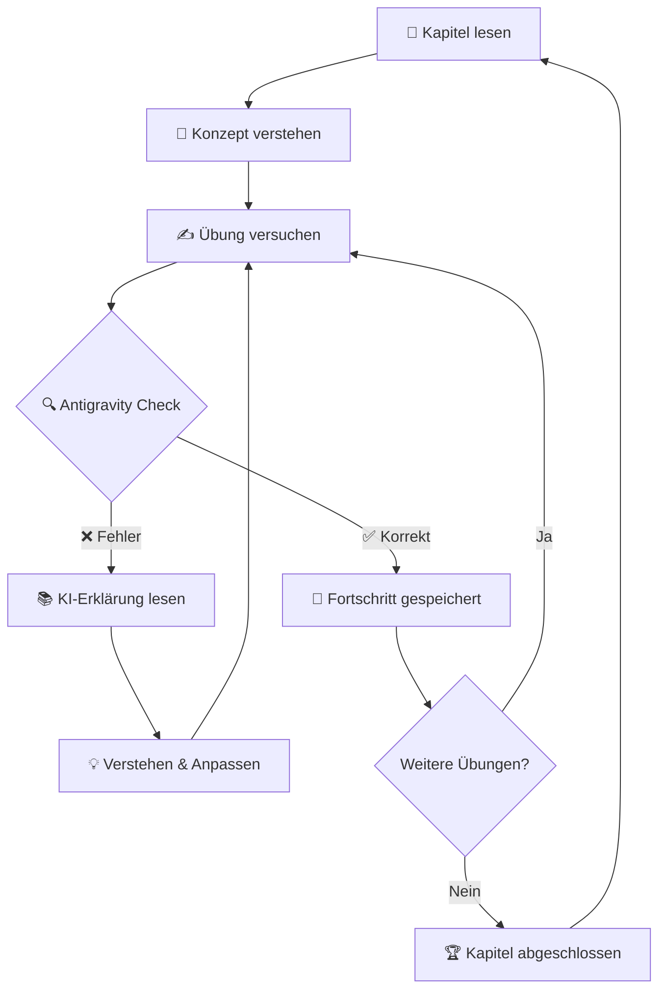
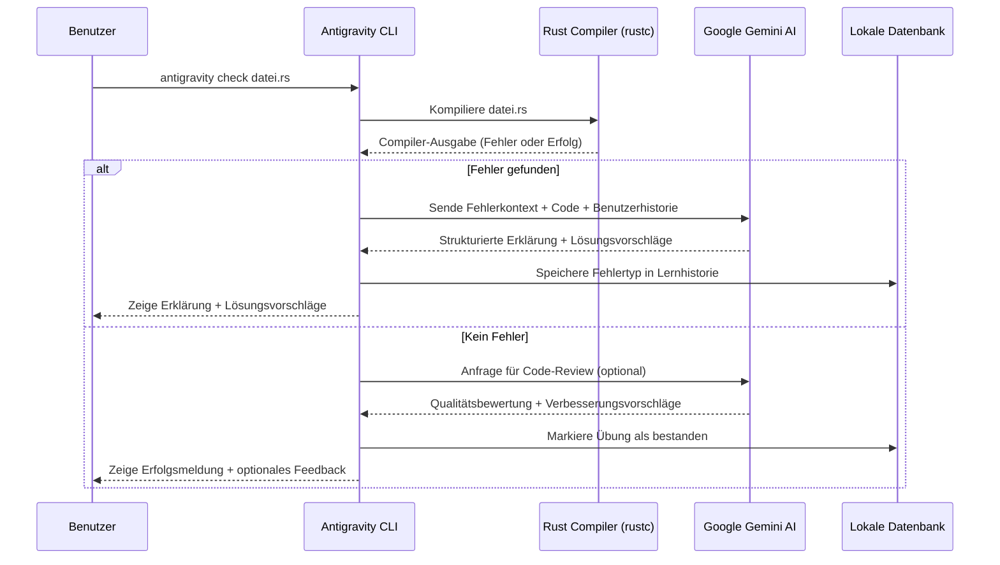
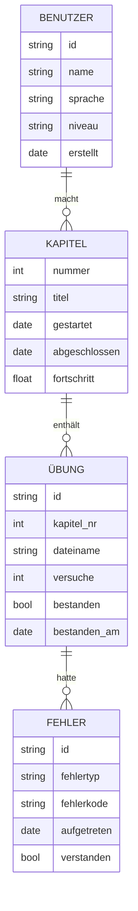
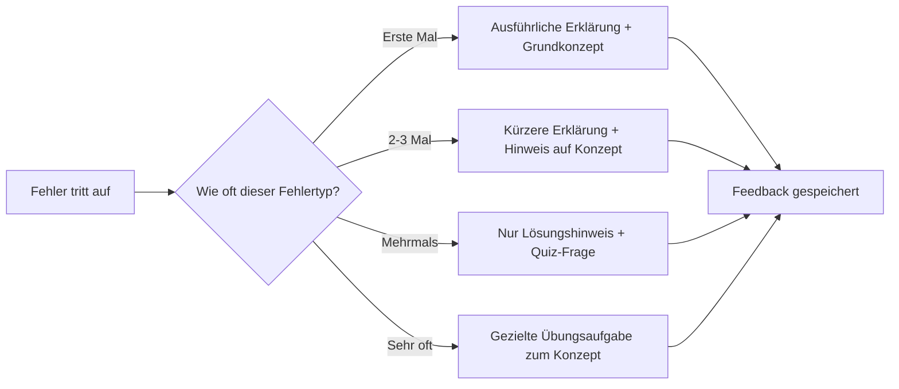
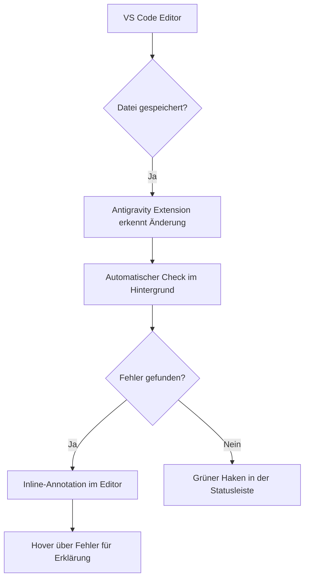

# Kapitel 14: Das Antigravity CLI — Ihr KI-gestützter Lernbegleiter für Rust

> [!IMPORTANT]
> Dieses Kapitel stellt Ihnen das **Antigravity CLI** vor — ein KI-gestütztes Kommandozeilenwerkzeug, das auf Google Gemini AI basiert und speziell dafür entwickelt wurde, Ihren Lernprozess zu automatisieren, Ihre Übungen automatisch zu überprüfen und Ihnen präzises, individuelles Feedback zu liefern. Es ist kein Ersatz für das Denken — es ist Ihr intelligenter Sparringspartner beim Lernen von Rust.

---

## 1. Lernziele & Lernplan

Bevor Sie mit dem Lesen beginnen, sollten Sie wissen, was Sie am Ende dieses Kapitels erreicht haben werden. Die folgenden Lernziele orientieren sich an der **Bloom'schen Taxonomie** — einem wissenschaftlich fundierten Modell zur Klassifikation von Lernzielen:

### Lernziele nach Bloom

| Bloom-Ebene | Lernziel | Prüfungsform |
|---|---|---|
| **Erinnern & Verstehen** | Sie können erklären, was das Antigravity CLI ist, auf welcher Technologie es basiert und welche Kernfunktionen es bereitstellt. | Mündliche Erklärung oder schriftliche Zusammenfassung |
| **Anwenden** | Sie sind in der Lage, das Antigravity CLI auf Ihrem eigenen System zu installieren, zu konfigurieren und für konkrete Rust-Übungsaufgaben einzusetzen. | Praktische Übungsaufgabe mit Live-Feedback des CLI |
| **Analysieren & Bewerten** | Sie können den Unterschied zwischen einem klassischen, manuellen Lernworkflow und einem KI-gestützten Workflow mit dem Antigravity CLI analysieren und die Vorteile sowie Grenzen des Tools kritisch bewerten. | Vergleichende Reflexion oder Diskussion |

### Ihr Lernplan für dieses Kapitel

Das folgende Schema gibt Ihnen eine zeitliche Orientierung:

```
Gesamtlesezeit (geschätzt): ca. 90–120 Minuten
Praktische Übungszeit:      ca. 60–90 Minuten
Empfohlene Reihenfolge:

  [1] Lernziele lesen          →  5 Minuten
  [2] Definition & Motivation  →  15 Minuten
  [3] Naiver Versuch & Fehler  →  10 Minuten
  [4] Die Lösung (Kernkapitel) →  30 Minuten
  [5] Tutorial (Installation)  →  30 Minuten praktisch
  [6] Deep Dive & Diagramme    →  15 Minuten
  [7] Drei Übungsaufgaben      →  60–90 Minuten
  [8] Merkzettel & Zusammenf.  →  10 Minuten
```

> [!TIP]
> Falls Sie bereits Erfahrung mit Kommandozeilenwerkzeugen haben, können Sie den Abschnitt über die Installation (Kapitel 7) direkt überspringen und mit dem Tutorial beginnen. Falls Sie Neuling sind, lesen Sie bitte jeden Abschnitt der Reihe nach — die Inhalte bauen aufeinander auf.

---

## 2. Die Definition — Was ist das Antigravity CLI?

### 2.1 Eine erste Begriffsklärung

Das **Antigravity CLI** (Command Line Interface) ist ein KI-gestütztes Kommandozeilenwerkzeug, das auf der **Google Gemini AI**-Technologie basiert. Es wurde entwickelt, um Lernende beim Erlernen von Programmiersprachen — und insbesondere von Rust — zu unterstützen.

Der Begriff "CLI" steht für *Command Line Interface*, also eine **Befehlszeilenschnittstelle**. Im Gegensatz zu grafischen Benutzeroberflächen (GUIs) interagiert man mit einem CLI ausschließlich über Texteingaben im Terminal. Dies ist in der Softwareentwicklung absolut üblich und für Programmierer eine grundlegende Fähigkeit.

Das Wort "Antigravity" beschreibt metaphorisch die Kernidee des Tools: Es soll die **Schwerkraft der Lernbarrieren** aufheben — die Frustration, alleine zu lernen, ohne Feedback, ohne Anleitung, ohne sofortige Antworten auf dringende Fragen.

### 2.2 Die technische Grundlage: Google Gemini AI

Im Herzen des Antigravity CLI liegt **Google Gemini AI** — eines der leistungsfähigsten Large Language Models (LLMs) der Welt. Gemini ist darauf trainiert worden, natürliche Sprache zu verstehen, Code zu analysieren, Fehler zu erkennen und verständliche Erklärungen zu liefern.

> [!NOTE]
> Ein **Large Language Model (LLM)** ist ein KI-System, das auf gigantischen Mengen von Textdaten trainiert wurde und dadurch in der Lage ist, menschliche Sprache zu verstehen, zu generieren und zu analysieren. Bekannte Beispiele sind GPT-4 von OpenAI, Claude von Anthropic und eben **Gemini von Google DeepMind**.

Was das Antigravity CLI von einem einfachen Chatbot wie ChatGPT oder dem regulären Gemini-Chat unterscheidet, ist seine **Integration in Ihren lokalen Entwicklungsworkflow**. Während Sie bei einem Chatbot manuell Code kopieren, einfügen, Fragen formulieren und Antworten interpretieren müssen, übernimmt das Antigravity CLI all das automatisch:

- Es liest Ihre Rust-Quelldatei direkt ein
- Es kompiliert den Code und fängt Fehler ab
- Es analysiert den Fehler mit Gemini AI
- Es gibt Ihnen sofortiges, kontextuelles Feedback
- Es verfolgt Ihren Lernfortschritt

### 2.3 Abgrenzung: Was ist das Antigravity CLI *nicht*?

Es ist wichtig, auch zu verstehen, was das Tool **nicht** ist, um realistische Erwartungen zu haben:

| Es IST... | Es ist NICHT... |
|---|---|
| Ein intelligenter Lernbegleiter | Ein automatischer Code-Generator, der für Sie lernt |
| Ein Feedback-System für Ihre Übungen | Ein Ersatz für das Lesen von Dokumentation |
| Ein Werkzeug zur Fortschrittsverfolgung | Ein Schummelsystem für Prüfungen |
| Ein Sparringspartner für Code-Reviews | Ein allwissender Orakel ohne Fehler |
| Ein Produktivitätswerkzeug für Lernende | Ein professionelles CI/CD-System |

> [!CAUTION]
> Das Antigravity CLI ist ein **Lernwerkzeug**. Es kann Fehler machen, falsche Hinweise geben oder unvollständige Erklärungen liefern. Sie sollten seine Ausgaben immer kritisch hinterfragen und mit der offiziellen Rust-Dokumentation abgleichen. KI-Systeme sind keine unfehlbaren Autoritäten — sie sind **Hilfsmittel**.

---

## 3. Das Problem & Die Motivation — Warum braucht man ein solches Tool?

### 3.1 Die typische Lernsituation ohne KI-Unterstützung

Stellen Sie sich folgende Situation vor: Sie haben sich entschieden, Rust zu lernen. Sie lesen das offizielle Rust-Buch (»The Rust Programming Language«), verstehen die Theorie, setzen sich an den Computer und schreiben Ihr erstes Programm. Dann passiert das Unvermeidliche:

```
error[E0382]: borrow of moved value: `s`
 --> src/main.rs:6:20
  |
3 |     let s = String::from("Hallo");
  |         - move occurs because `s` has type `String`,
  |           which does not implement the `Copy` trait
5 |     let s2 = s;
  |              - value moved here
6 |     println!("{}", s);
  |                    ^ value borrowed here after move
```

Was sehen Sie? Eine kryptische Fehlermeldung, die Ihnen sagt, dass ein »Borrow of moved value« stattgefunden hat. Als Anfänger werden Sie vermutlich denken: *»Was bitte ist ein 'move'? Was ist ein 'borrow'? Warum kann ich `s` nicht einfach benutzen?«*

### 3.2 Die typische Reaktion ohne Unterstützung

Ohne KI-Unterstützung läuft ein Anfänger typischerweise durch folgende Schritte:

**Schritt 1: Verwirrt sein**
Die Fehlermeldung wird gelesen, aber nicht verstanden. Die Terminologie ist fremd.

**Schritt 2: Googeln**
Eine Suche nach »Rust borrow of moved value« liefert Stack Overflow-Einträge, GitHub-Issues und Forendiskussionen — die meisten davon für erfahrene Entwickler geschrieben.

**Schritt 3: Mehr Verwirrung**
Die gefundenen Antworten setzen oft Vorwissen voraus, das Anfänger noch nicht haben. Der Lernende liest Begriffe wie »Ownership«, »Lifetime«, »Stack«, »Heap« — und versteht nichts davon im Zusammenhang.

**Schritt 4: Frustration**
Nach 30–60 Minuten ohne Fortschritt tritt Frustration ein. Viele Lernende geben an diesem Punkt auf oder springen zu einer anderen Programmiersprache.

**Schritt 5: Suboptimale Lösung**
Falls der Lernende nicht aufgibt, findet er vielleicht eine Lösung — aber oft eine, die er nicht versteht. Er kopiert Code, der »irgendwie funktioniert«, aber das zugrundeliegende Konzept bleibt unverstanden.

### 3.3 Die Statistik des Scheiterns

Die Lernforschung zeigt eindeutig: **Feedback ist der wichtigste Faktor für erfolgreiches Lernen.** Ohne sofortiges, präzises Feedback:

- Sinkt die Motivation dramatisch
- Werden Fehlkonzepte verfestigt statt korrigiert
- Steigt die Zeit bis zur Kompetenz um das 3–5-fache
- Verdoppelt sich die Abbruchquote bei selbstgesteuerten Lernprozessen

John Hattie, der Bildungsforscher, zeigt in seiner »Visible Learning«-Studie, dass **Feedback** den größten Effekt auf den Lernerfolg hat — mit einem Effektgröße von d = 0,73, was weit über dem Durchschnitt von d = 0,40 liegt.

### 3.4 Die spezifische Herausforderung bei Rust

Rust ist nicht irgendeine Programmiersprache. Sie ist bekannt dafür, eine der **steilsten Lernkurven** im Bereich der Programmiersprachen zu haben. Die Hauptgründe dafür sind:

**1. Das Ownership-System**
Rust hat ein einzigartiges Speicherverwaltungssystem, das es in keiner anderen weit verbreiteten Sprache gibt. Konzepte wie Ownership, Borrowing und Lifetimes sind für Anfänger extrem kontraintuitiv.

**2. Der strenge Compiler**
Der Rust-Compiler ist absichtlich sehr streng. Er verhindert ganze Klassen von Bugs zur Kompilierzeit — aber das bedeutet, dass er viele Fehlermeldungen produziert, die für Anfänger schwer zu interpretieren sind.

**3. Das fehlende Laufzeit-Feedback**
In Sprachen wie Python oder JavaScript sehen Sie Fehler oft erst zur Laufzeit. In Rust werden die meisten Fehler zur Kompilierzeit abgefangen — was gut für Produktionscode, aber schwierig für Lernende ist.

> [!NOTE]
> Die Stack Overflow Developer Survey 2023 zeigte, dass **Rust** acht Jahre in Folge als die beliebteste Programmiersprache von Entwicklern gewählt wurde — aber gleichzeitig eine der am wenigsten verbreiteten ist. Das paradoxe Ergebnis erklärt sich durch die hohe Lernkurve: Viele Entwickler *wollen* Rust lernen, aber scheitern am Einstieg.

### 3.5 Die Lösung: Sofortiges, kontextuelles Feedback durch KI

Das Antigravity CLI adressiert exakt diese Probleme:

1. **Sofortiges Feedback** — Keine Wartezeit, kein manuelles Googeln
2. **Kontextuelles Feedback** — Die KI versteht Ihren spezifischen Code, nicht eine allgemeine Frage
3. **Anpassbares Niveau** — Das Feedback kann auf Ihren Kenntnisstand zugeschnitten werden
4. **Wiederholbares Lernen** — Sie können denselben Fehler mehrfach erklären lassen, mit verschiedenen Ansätzen
5. **Fortschrittsverfolgung** — Das System merkt sich, was Sie bereits gelernt haben

---

## 4. Der naive Versuch — Schlechter Lern-Workflow ohne KI-Unterstützung

### 4.1 Das Anti-Pattern: Der »Copy-Paste-Lernende«

Lassen Sie uns einen typischen, dysfunktionalen Lernworkflow ohne KI-Unterstützung genauer betrachten. Wir nennen diese Person »Der Copy-Paste-Lernende«:

```
1. Liest Kapitel im Buch
2. Versteht ca. 60% des Inhalts
3. Öffnet Editor, versucht Übungsaufgabe
4. Compiler-Fehler erscheint
5. Kopiert Fehlermeldung in Google
6. Findet einen Stack Overflow-Post
7. Kopiert die Lösung aus Stack Overflow
8. Fügt sie ein — Fehler weg!
9. Geht zur nächsten Aufgabe
10. Wiederholt Schritte 1–9
```

Das Problem: In Schritt 8 wurde **nichts gelernt**. Der Lernende hat den Fehler behoben, aber nicht verstanden, *warum* er auftrat und *warum* die Lösung funktioniert. Beim nächsten ähnlichen Fehler muss er denselben Prozess wiederholen.

### 4.2 Das Anti-Pattern: Der »Passive Leser«

Ein weiteres häufiges Anti-Pattern ist der »Passive Leser«:

```
1. Liest das gesamte Rust-Buch durch
2. Macht keine praktischen Übungen
3. Glaubt, Rust zu verstehen
4. Versucht, ein echtes Projekt zu schreiben
5. Scheitert an der Komplexität
6. Realisiert, dass theoretisches Wissen ≠ praktische Kompetenz
7. Fängt wieder von vorne an
```

Dieses Anti-Pattern ist besonders tückisch, weil der Lernende das **Gefühl** hat, Fortschritte zu machen, obwohl er kaum echte Kompetenz aufbaut.

### 4.3 Das Anti-Pattern: Der »Alleine-Kämpfer«

Der dritte Typus ist der »Alleine-Kämpfer«:

```
1. Versucht, jedes Problem selbst zu lösen
2. Verbringt Stunden mit einem einzelnen Fehler
3. Hat keinen Mentor, keinen Peer, keine Community
4. Gibt auf oder löst das Problem durch Zufall
5. Hat kein tiefes Verständnis des Grundproblems
```

> [!WARNING]
> Diese drei Anti-Pattern sind nicht Anzeichen von mangelnder Intelligenz oder Faulheit — sie sind das **natürliche Ergebnis eines Lernumfelds ohne angemessene Unterstützungsstrukturen**. Das Antigravity CLI soll helfen, diese Strukturen bereitzustellen.

### 4.4 Der Zeitverlust: Eine konkrete Rechnung

Betrachten wir den Zeitverlust konkret. Ein Anfänger ohne KI-Unterstützung:

| Aktivität | Zeit ohne KI | Zeit mit Antigravity CLI | Ersparnis |
|---|---|---|---|
| Fehlermeldung verstehen | 15–30 Min. | 2–3 Min. | ~85% |
| Lösung finden | 20–45 Min. | 5–10 Min. | ~75% |
| Konzept verstehen | 30–60 Min. | 10–15 Min. | ~70% |
| Übung abschließen | 60–120 Min. | 20–40 Min. | ~65% |

Hochgerechnet auf einen vollständigen Rust-Kurs mit 50+ Übungen ergibt sich eine potenzielle Zeitersparnis von **20–40 Stunden**. Diese Zeit können Sie in mehr Übungen, tieferes Verständnis oder weitere Projekte investieren.

---

## 5. Die Anatomie des Fehlers — Was passiert ohne gutes Feedback?

### 5.1 Der Fehlerlernzyklus

Um zu verstehen, warum gutes Feedback so wichtig ist, müssen wir verstehen, was in einem Lernenden vorgeht, wenn er auf einen Fehler stößt:

```
┌─────────────────────────────────────────────────────────┐
│                  FEHLERLERNZYKLUS                       │
│                                                         │
│  Fehler        Fehlermeldung    Interpretation          │
│  tritt auf →   erscheint    →   des Fehlers             │
│                                      ↓                  │
│  Neue           Lösung          Hypothese               │
│  Kompetenz  ←   testen      ←   formulieren             │
└─────────────────────────────────────────────────────────┘
```

Ohne gutes Feedback bricht dieser Zyklus in der Phase »Interpretation des Fehlers« zusammen. Der Lernende kann den Fehler nicht korrekt interpretieren, formuliert keine sinnvolle Hypothese und kommt nicht zu einer Lösung.

### 5.2 Konkrete Fehleranalyse: Das Ownership-Problem

Schauen wir uns einen konkreten Fehler an, der für Rust-Anfänger typisch ist:

```rust
fn main() {
    let s1 = String::from("Hallo");
    let s2 = s1;
    println!("s1 = {}", s1); // Fehler!
}
```

Der Compiler gibt aus:

```
error[E0382]: borrow of moved value: `s1`
 --> src/main.rs:4:24
  |
2 |     let s1 = String::from("Hallo");
  |         -- move occurs because `s1` has type `String`,
  |            which does not implement the `Copy` trait
3 |     let s2 = s1;
  |              -- value moved here
4 |     println!("s1 = {}", s1);
  |                         ^^ value borrowed here after move
```

### 5.3 Was passiert ohne Feedback?

**Fehlinterpretation 1:** »Rust hat einen Bug, `s1` ist doch noch definiert!«
*Konsequenz:* Der Lernende sucht nach einem Compiler-Bug, der nicht existiert.

**Fehlinterpretation 2:** »Ich muss `s2 = s1.clone()` schreiben«
*Konsequenz:* Der Lernende löst das Problem, versteht aber nicht, *warum* — und wann Clone *nicht* die richtige Lösung ist.

**Fehlinterpretation 3:** »`String` verhält sich in Rust anders als in Java/Python«
*Konsequenz:* Richtig erkannt! Aber ohne tieferes Verständnis des Ownership-Systems bleibt es ein oberflächliches Wissen.

### 5.4 Was passiert MIT dem Antigravity CLI?

Mit dem Antigravity CLI könnte eine Interaktion wie folgt aussehen:

```
$ antigravity check src/main.rs

🔍 Analysiere Ihren Code...
❌ Fehler gefunden: E0382 - Borrow of moved value

📚 Erklärung für Anfänger:

In Rust gibt es das Konzept des "Ownership" (Eigentümerschaft).
Jeder Wert in Rust hat genau einen Eigentümer. Wenn Sie schreiben:

    let s2 = s1;

wird die Eigentümerschaft von `s1` auf `s2` übertragen. Nach dieser
Übertragung ("move") ist `s1` nicht mehr gültig — Rust hat es aus dem
Speicher freigegeben.

💡 Mögliche Lösungen:

1. Clone: let s2 = s1.clone(); — Erstellt eine tiefe Kopie
   (empfohlen für Anfänger zum Verstehen)

2. Referenz: let s2 = &s1; — Leiht s1 aus, ohne Eigentümerschaft
   zu übertragen (effizientere Lösung)

3. Reihenfolge ändern: Nutzen Sie s1 vor der Zuweisung an s2

🎯 Lernziel: Verstehen Sie, dass Rust-Strings kein "Copy"-Trait
implementieren. Nur primitive Typen wie i32, f64, bool werden
automatisch kopiert.

📖 Weiterlesen: Kapitel 4.1 im Rust-Buch (Ownership)
```

Der Unterschied ist dramatisch: Statt einer kryptischen Fehlermeldung bekommt der Lernende eine strukturierte, verständliche Erklärung, konkrete Lösungsoptionen und Hinweise auf weiterführende Ressourcen.

---

## 6. Die Lösung — Das Antigravity CLI richtig einsetzen

### 6.1 Die Kernbefehle des Antigravity CLI

Das Antigravity CLI bietet eine Reihe von Kernbefehlen, die Sie im Laufe Ihres Lernprozesses regelmäßig verwenden werden:

#### 6.1.1 `antigravity check` — Code analysieren

```bash
antigravity check <datei.rs>
```

Dieser Befehl analysiert eine einzelne Rust-Quelldatei. Er kompiliert den Code, fängt Fehler ab und lässt sie durch Gemini AI erklären. Dieser Befehl ist Ihr **tägliches Arbeitspferd**.

```bash
# Beispiele:
antigravity check src/main.rs
antigravity check übung1.rs
antigravity check ./projekte/rechner/src/main.rs
```

#### 6.1.2 `antigravity explain` — Konzept erklären lassen

```bash
antigravity explain "<Konzept oder Frage>"
```

Mit diesem Befehl können Sie beliebige Rust-Konzepte in natürlicher Sprache erklären lassen:

```bash
antigravity explain "Was ist der Unterschied zwischen String und &str?"
antigravity explain "Wann benutze ich clone() und wann Referenzen?"
antigravity explain "Erkläre mir Lifetimes in einfachen Worten"
```

#### 6.1.3 `antigravity review` — Code-Review anfordern

```bash
antigravity review <datei.rs>
```

Im Gegensatz zu `check` (das Fehler findet) führt `review` einen vollständigen Code-Review durch. Es identifiziert nicht nur Fehler, sondern auch:

- Code-Smells und schlechte Praktiken
- Performance-Probleme
- Sicherheitsprobleme
- Verbesserungsvorschläge für Lesbarkeit
- Rustacean-typische Idiome, die Sie noch nicht kennen

```bash
antigravity review src/main.rs
antigravity review --level=anfänger src/main.rs  # Angepasstes Niveau
```

#### 6.1.4 `antigravity exercise` — Übungsaufgaben lösen

```bash
antigravity exercise <übungsdatei.rs>
```

Dieser Befehl ist speziell für Übungsaufgaben dieses Kurses ausgelegt. Er:

1. Liest die Übungsaufgabe ein
2. Führt automatische Tests aus
3. Überprüft, ob Ihre Lösung korrekt ist
4. Gibt Feedback bei falschen Lösungen
5. Verfolgt Ihren Fortschritt

```bash
antigravity exercise kapitel5/übung1.rs
antigravity exercise kapitel5/übung2.rs --hint  # Mit Hinweis
```

#### 6.1.5 `antigravity progress` — Lernfortschritt anzeigen

```bash
antigravity progress
```

Zeigt eine Übersicht Ihres bisherigen Lernfortschritts:

```bash
antigravity progress
antigravity progress --chapter=5  # Nur Kapitel 5
antigravity progress --export=bericht.pdf  # Als PDF exportieren
```

### 6.2 Fortgeschrittene Befehle

#### 6.2.1 `antigravity quiz` — Wissenstest

```bash
antigravity quiz --chapter=<nummer>
```

Erstellt automatisch einen Quiz auf Basis des gelernten Kapitels. Die Fragen werden von Gemini AI generiert und passen sich Ihrem Kenntnisstand an.

#### 6.2.2 `antigravity compare` — Lösungsvergleich

```bash
antigravity compare meine-lösung.rs musterlösung.rs
```

Vergleicht Ihre Lösung mit einer Musterlösung und erklärt die Unterschiede.

#### 6.2.3 `antigravity session` — Lernsitzung starten

```bash
antigravity session --chapter=<nummer>
```

Startet eine interaktive Lernsitzung für ein bestimmtes Kapitel. Das CLI führt Sie Schritt für Schritt durch das Material, stellt Fragen und gibt Feedback.

### 6.3 Wichtige Flags und Optionen

| Flag | Beschreibung | Beispiel |
|---|---|---|
| `--lang=de` | Ausgabe auf Deutsch | `antigravity check --lang=de main.rs` |
| `--level=anfänger` | Angepasstes Erklärungsniveau | `antigravity explain --level=anfänger "Closures"` |
| `--verbose` | Ausführliche Ausgabe | `antigravity check --verbose main.rs` |
| `--quiet` | Minimale Ausgabe | `antigravity check --quiet main.rs` |
| `--format=json` | Ausgabe als JSON | `antigravity check --format=json main.rs` |
| `--hint` | Gibt einen Hinweis zur Aufgabe | `antigravity exercise --hint übung1.rs` |

### 6.4 Der ideale Lernworkflow mit dem Antigravity CLI

Hier ist der empfohlene Workflow für diesen Rust-Kurs:

```
1. Kapitel lesen (Buch oder Markdown-Datei)
     ↓
2. Übungsaufgabe öffnen und versuchen zu lösen
     ↓
3. Code schreiben
     ↓
4. `antigravity exercise übungX.rs` ausführen
     ↓
     ├─ Erfolg? → Nächste Aufgabe, Fortschritt wird gespeichert
     └─ Fehler? → Feedback lesen, verstehen, anpassen
                      ↓
                  Zurück zu Schritt 3
```

> [!TIP]
> **Goldene Regel**: Versuchen Sie immer zuerst, den Fehler selbst zu verstehen, bevor Sie das Feedback des CLI lesen. Schreiben Sie auf, was Sie denken, dass das Problem ist — und vergleichen Sie dann mit der KI-Erklärung. Diese Methode vertieft das Verständnis deutlich.

---

## 7. Kleines Tutorial — Installation und erste Schritte

### 7.1 Systemvoraussetzungen

Bevor Sie das Antigravity CLI installieren, überprüfen Sie, ob Ihr System die folgenden Voraussetzungen erfüllt:

| Komponente | Mindeststversion | Überprüfung |
|---|---|---|
| Rust | 1.70 oder neuer | `rustc --version` |
| Cargo | 1.70 oder neuer | `cargo --version` |
| Git | 2.0 oder neuer | `git --version` |
| Betriebssystem | Linux, macOS, Windows 10+ | — |
| Internetzugang | Erforderlich für KI-Funktionen | — |

> [!NOTE]
> Das Antigravity CLI benötigt eine aktive Internetverbindung für die KI-gestützten Funktionen, da es Anfragen an die Google Gemini API sendet. Lokale Funktionen wie Code-Kompilierung und Syntax-Überprüfung funktionieren auch offline.

### 7.2 Schritt 1: Rust installieren (falls noch nicht geschehen)

Falls Sie Rust noch nicht installiert haben, führen Sie folgenden Befehl aus:

**Linux/macOS:**
```bash
curl --proto '=https' --tlsv1.2 -sSf https://sh.rustup.rs | sh
```

**Windows:**
Laden Sie das rustup-Installationsprogramm von [https://rustup.rs](https://rustup.rs) herunter.

Folgen Sie dann den Anweisungen auf dem Bildschirm. Starten Sie danach ein neues Terminal und überprüfen Sie die Installation:

```bash
rustc --version
# Erwartete Ausgabe: rustc 1.XX.X (XXXXXXXX YYYY-MM-DD)

cargo --version
# Erwartete Ausgabe: cargo 1.XX.X (XXXXXXXXX YYYY-MM-DD)
```

### 7.3 Schritt 2: Antigravity CLI installieren

Das Antigravity CLI wird über die offizielle Webseite oder über den Package Manager installiert:

**Option A: Über die offizielle Webseite**

Besuchen Sie [https://antigravity.dev](https://antigravity.dev) und laden Sie das Installationspaket für Ihr Betriebssystem herunter.

**Option B: Über npm (Node.js erforderlich)**

```bash
npm install -g @antigravity/cli
```

**Option C: Über Homebrew (macOS)**

```bash
brew install antigravity-cli
```

**Option D: Direkt über das Antigravity-Installationsskript**

```bash
curl -fsSL https://get.antigravity.dev | bash
```

> [!WARNING]
> Führen Sie nie ein Installationsskript aus, ohne den Inhalt vorher zu überprüfen. Wenn Sie sich unsicher sind, laden Sie das Skript erst herunter (`curl -fsSL https://get.antigravity.dev > install.sh`), überprüfen Sie es mit einem Texteditor, und führen Sie es dann aus (`bash install.sh`).

Nach der Installation überprüfen Sie, ob das CLI korrekt installiert wurde:

```bash
antigravity --version
# Erwartete Ausgabe: Antigravity CLI v1.X.X
```

### 7.4 Schritt 3: API-Schlüssel konfigurieren

Das Antigravity CLI benötigt einen Google Gemini API-Schlüssel, um die KI-Funktionen nutzen zu können.

**3.1 API-Schlüssel erstellen:**

1. Gehen Sie zu [https://aistudio.google.com](https://aistudio.google.com)
2. Melden Sie sich mit Ihrem Google-Konto an
3. Klicken Sie auf »Get API Key«
4. Wählen Sie »Create API Key in new project«
5. Kopieren Sie den generierten API-Schlüssel

> [!IMPORTANT]
> Bewahren Sie Ihren API-Schlüssel **sicher** auf. Teilen Sie ihn niemals öffentlich oder committen Sie ihn in ein Git-Repository. Behandeln Sie ihn wie ein Passwort.

**3.2 API-Schlüssel konfigurieren:**

```bash
antigravity config set api-key <IHR_API_SCHLÜSSEL>
```

Alternativ können Sie den API-Schlüssel als Umgebungsvariable setzen:

```bash
# Linux/macOS (temporär, für aktuelle Sitzung):
export ANTIGRAVITY_API_KEY="<IHR_API_SCHLÜSSEL>"

# Linux/macOS (permanent, in ~/.bashrc oder ~/.zshrc):
echo 'export ANTIGRAVITY_API_KEY="<IHR_API_SCHLÜSSEL>"' >> ~/.bashrc
source ~/.bashrc

# Windows (PowerShell):
$env:ANTIGRAVITY_API_KEY = "<IHR_API_SCHLÜSSEL>"
```

### 7.5 Schritt 4: Konfiguration überprüfen

```bash
antigravity config list
```

Erwartete Ausgabe:
```
Antigravity CLI Konfiguration:
  api-key:    ●●●●●●●●●●●● (gesetzt)
  language:   de
  level:      anfänger
  output:     terminal
  progress:   aktiviert
```

### 7.6 Schritt 5: Sprache und Niveau einstellen

Für diesen Kurs empfehlen wir folgende Konfiguration:

```bash
# Ausgabe auf Deutsch stellen
antigravity config set language de

# Niveau auf Anfänger stellen
antigravity config set level anfänger

# Fortschrittsverfolgung aktivieren
antigravity config set progress true
```

### 7.7 Schritt 6: Ersten Test durchführen

Erstellen Sie eine Testdatei, um das CLI auszuprobieren:

```bash
# Erstellen Sie ein neues Verzeichnis
mkdir rust-kurs-übungen
cd rust-kurs-übungen

# Erstellen Sie eine einfache Rust-Datei
cat > hallo_welt.rs << 'EOF'
fn main() {
    println!("Hallo, Welt!");
}
EOF
```

Führen Sie nun den ersten Check durch:

```bash
antigravity check hallo_welt.rs
```

Erwartete Ausgabe:
```
🔍 Analysiere hallo_welt.rs...
✅ Kein Fehler gefunden!

📊 Code-Qualität: Ausgezeichnet (10/10)
   • Korrekte main()-Funktion
   • Korrekte println!-Makro-Syntax
   • Keine Warnungen

💡 Feedback:
   Ihr erstes Rust-Programm sieht perfekt aus! Das println!-Makro
   gibt Text auf der Konsole aus. Das ! am Ende zeigt an, dass es
   sich um ein Makro handelt, nicht um eine normale Funktion.

🎯 Nächster Schritt: Versuchen Sie, Variablen hinzuzufügen!
```

> [!TIP]
> Wenn Sie eine Fehlermeldung erhalten, die besagt, dass der API-Schlüssel nicht gesetzt ist, überprüfen Sie Ihre Konfiguration mit `antigravity config list`. Wenn der API-Schlüssel als »nicht gesetzt« angezeigt wird, wiederholen Sie Schritt 4.

### 7.8 Schritt 7: Absichtlichen Fehler testen

Jetzt testen Sie, wie das CLI mit Fehlern umgeht. Erstellen Sie eine Datei mit einem absichtlichen Fehler:

```bash
cat > fehler_test.rs << 'EOF'
fn main() {
    let x = 5;
    let y = "Hallo";
    let summe = x + y; // Typfehler!
    println!("Summe: {}", summe);
}
EOF

antigravity check fehler_test.rs
```

Das CLI sollte nun einen ausführlichen Fehlerbericht ausgeben, der erklärt, was ein Typfehler in Rust ist und wie er behoben werden kann.

### 7.9 Schritt 8: Kurs-Integration konfigurieren

Wenn Sie diesen Kurs strukturiert mit dem CLI begleiten möchten, konfigurieren Sie den Kurs-Kontext:

```bash
# Kurs-Kontext setzen (falls Sie diesen Kurs verwenden)
antigravity course set "rust-anfänger-kurs"

# Aktuelles Kapitel setzen
antigravity course chapter 14
```

Dies ermöglicht dem CLI, Ihr Feedback und Ihren Fortschritt kapitelgenau zu verfolgen.

### 7.10 Häufige Installationsprobleme und Lösungen

#### Problem: »command not found: antigravity«

**Ursache:** Das CLI ist nicht im PATH.
**Lösung:**
```bash
# Überprüfen Sie, wo antigravity installiert wurde
which antigravity || find / -name "antigravity" 2>/dev/null

# Fügen Sie den Pfad zu Ihrem PATH hinzu
export PATH="$PATH:/pfad/zu/antigravity"
```

#### Problem: »API key invalid or expired«

**Ursache:** Der API-Schlüssel ist falsch oder abgelaufen.
**Lösung:**
```bash
# Schlüssel überprüfen
antigravity config get api-key

# Schlüssel neu setzen
antigravity config set api-key <NEUER_SCHLÜSSEL>
```

#### Problem: »Network error: Cannot connect to AI service«

**Ursache:** Keine Internetverbindung oder Firewall blockiert die Verbindung.
**Lösung:**
```bash
# Verbindungstest
antigravity test-connection

# Mit Proxy (falls erforderlich)
antigravity config set proxy "http://proxy.example.com:8080"
```

> [!NOTE]
> Wenn Sie hinter einer Unternehmens-Firewall arbeiten, kann es sein, dass ausgehende HTTPS-Verbindungen zu Google-Diensten blockiert sind. Sprechen Sie in diesem Fall mit Ihrer IT-Abteilung.

---

## 8. Mentale Modelle & Deep Dive — Workflow-Diagramme

### 8.1 Das mentale Modell: Der Lernschleife

Um das Antigravity CLI wirklich zu verstehen, ist es hilfreich, ein mentales Modell des gesamten Lernprozesses zu entwickeln. Stellen Sie sich den Lernprozess als eine Schleife vor:



### 8.2 Der technische Workflow: Wie das CLI intern funktioniert

Wenn Sie `antigravity check datei.rs` ausführen, passiert folgendes intern:



### 8.3 Das Datenmodell: Was wird gespeichert?

Das Antigravity CLI speichert lokal (auf Ihrem Computer, nicht in der Cloud) folgende Daten:



> [!NOTE]
> Alle lokal gespeicherten Daten befinden sich in `~/.antigravity/` auf Ihrem System. Sie können diese Daten jederzeit mit `antigravity data export` exportieren oder mit `antigravity data clear` löschen. Ihre Privatsphäre wird respektiert.

### 8.4 Das Feedback-System: Adaptives Lernen

Das Antigravity CLI implementiert ein adaptives Feedback-System, das sich an Ihren Lernfortschritt anpasst:



Dieses adaptive System hat einen wichtigen Vorteil: Je mehr Sie das CLI nutzen, desto gezielter wird das Feedback. Das System »kennt« Ihre Schwächen und Stärken und passt die Erklärungen entsprechend an.

### 8.5 Integration in VS Code

Das Antigravity CLI kann auch direkt in Visual Studio Code integriert werden:



Um die VS Code Extension zu installieren:

1. Öffnen Sie VS Code
2. Drücken Sie `Ctrl+Shift+X` (Extensions)
3. Suchen Sie nach »Antigravity«
4. Klicken Sie auf »Installieren«
5. Starten Sie VS Code neu

> [!TIP]
> Die VS Code Integration ist besonders nützlich, weil Sie beim Schreiben von Code sofortiges Feedback erhalten — ähnlich wie eine Rechtschreibprüfung, aber für Rust-Code!

### 8.6 Der »Spaced Repetition«-Mechanismus

Eine der interessantesten Funktionen des Antigravity CLI ist das eingebaute **Spaced Repetition**-System. Spaced Repetition ist eine wissenschaftlich bewiesene Lernmethode, bei der Informationen in wachsenden Zeitabständen wiederholt werden, um sie langfristig im Gedächtnis zu behalten.

```
Erste Wiederholung:  1 Tag nach dem Lernen
Zweite Wiederholung: 3 Tage danach
Dritte Wiederholung: 7 Tage danach
Vierte Wiederholung: 14 Tage danach
Fünfte Wiederholung: 30 Tage danach
```

Das CLI fragt Sie automatisch: »Haben Sie in den letzten 7 Tagen Aufgaben zu `Ownership` gelöst? Hier ist eine kurze Wiederholungsaufgabe...«

---

## 9. Drei Übungsaufgaben

Die folgenden drei Übungsaufgaben sind speziell für den Einsatz mit dem Antigravity CLI konzipiert. Sie sollten jede Aufgabe mit dem Befehl `antigravity exercise <dateiname>.rs` überprüfen.

### 9.1 Übung 1 (Leicht): Begrüßungsfunktion mit Parametern

**Schwierigkeitsgrad:** ⭐ (Leicht)
**Thema:** Funktionen, Variablen, String-Formatierung
**Geschätzte Zeit:** 10–15 Minuten

**Aufgabenstellung:**

Schreiben Sie ein Rust-Programm, das eine Funktion `begrüsse` enthält. Diese Funktion soll:

1. Einen Namen als Parameter entgegennehmen (Typ: `&str`)
2. Das Alter als Parameter entgegennehmen (Typ: `u32`)
3. Eine Begrüßungsnachricht zurückgeben (Typ: `String`)
4. Die Ausgabe soll folgendem Format entsprechen: `»Herzlich willkommen, [Name]! Sie sind [Alter] Jahre alt.«`

Die `main`-Funktion soll diese Funktion mit mindestens drei verschiedenen Namen und Altern aufrufen und die Ergebnisse ausgeben.

**Datei erstellen:**

```bash
cat > übung1_begrüssung.rs << 'EOF'
// Aufgabe: Implementieren Sie die Funktion begrüsse()
// Sie soll einen Namen (&str) und ein Alter (u32) entgegennehmen
// und einen formatierten String zurückgeben.

fn begrüsse(name: &str, alter: u32) -> String {
    // TODO: Implementieren Sie diese Funktion
    todo!()
}

fn main() {
    // TODO: Rufen Sie begrüsse() mit drei verschiedenen Personen auf
    // und geben Sie die Ergebnisse aus.
    todo!()
}
EOF
```

**Überprüfung mit dem CLI:**

```bash
antigravity exercise übung1_begrüssung.rs
```

**Erwartete Ausgabe bei korrekter Lösung:**

```
✅ Übung 1 bestanden!

Tests:
  [OK] begrüsse("Maria", 25)     → "Herzlich willkommen, Maria! Sie sind 25 Jahre alt."
  [OK] begrüsse("Thomas", 42)    → "Herzlich willkommen, Thomas! Sie sind 42 Jahre alt."
  [OK] begrüsse("Sophie", 8)     → "Herzlich willkommen, Sophie! Sie sind 8 Jahre alt."

Ihr Code: ⭐⭐⭐ (3/3 Tests bestanden)
Fortschritt: Kapitel 14, Übung 1 — Abgeschlossen!
```

**Musterlösung** (nur ansehen, wenn Sie wirklich nicht weiterkommen!):

```rust
fn begrüsse(name: &str, alter: u32) -> String {
    format!("Herzlich willkommen, {}! Sie sind {} Jahre alt.", name, alter)
}

fn main() {
    println!("{}", begrüsse("Maria", 25));
    println!("{}", begrüsse("Thomas", 42));
    println!("{}", begrüsse("Sophie", 8));
}
```

**Was Sie dabei lernen:**
- Wie Funktionen in Rust definiert werden
- Den Unterschied zwischen `&str` (String-Slice) und `String` (owned String)
- Wie `format!` einen formatierten String erstellt (ähnlich wie `println!`, aber gibt einen String zurück statt auszugeben)
- Wie Rückgabetypen in Rust deklariert werden

> [!TIP]
> Falls Sie bei dieser Aufgabe feststecken, verwenden Sie `antigravity exercise --hint übung1_begrüssung.rs`, um einen Hinweis zu erhalten. Sie können bis zu 3 Hinweise anfordern, bevor das CLI die vollständige Lösung zeigt.

---

### 9.2 Übung 2 (Mittel): Temperaturkonverter mit Fehlerbehandlung

**Schwierigkeitsgrad:** ⭐⭐⭐ (Mittel)
**Thema:** Structs, Enums, Fehlerbehandlung mit `Result`
**Geschätzte Zeit:** 25–40 Minuten

**Aufgabenstellung:**

Implementieren Sie einen Temperaturkonverter, der zwischen Celsius, Fahrenheit und Kelvin konvertiert. Das Programm soll:

1. Einen `Enum` `Temperatureinheit` mit den Varianten `Celsius`, `Fahrenheit` und `Kelvin` definieren
2. Eine Funktion `konvertiere` implementieren, die eine Temperatur (f64) und die Quell- sowie Zieleinheit entgegennimmt
3. Die Funktion soll `Result<f64, String>` zurückgeben
4. Kelvin-Temperaturen unter 0 K sollen als Fehler behandelt werden (absoluter Nullpunkt)
5. Die `main`-Funktion soll mindestens 4 Konversionen demonstrieren und Fehler elegant behandeln

**Datei erstellen:**

```bash
cat > übung2_temperatur.rs << 'EOF'
// Aufgabe: Implementieren Sie einen Temperaturkonverter
// mit korrekter Fehlerbehandlung.

// TODO: Definieren Sie den Enum Temperatureinheit
// Varianten: Celsius, Fahrenheit, Kelvin

// TODO: Implementieren Sie die Funktion konvertiere
// Signatur: fn konvertiere(wert: f64, von: &Temperatureinheit, zu: &Temperatureinheit) -> Result<f64, String>

// Hinweis Konversionsformeln:
// Celsius → Fahrenheit:  F = C * 9/5 + 32
// Fahrenheit → Celsius:  C = (F - 32) * 5/9
// Celsius → Kelvin:      K = C + 273.15
// Kelvin → Celsius:      C = K - 273.15

fn main() {
    // TODO: Demonstrieren Sie mindestens 4 Konversionen
    // Vergessen Sie nicht, den Fehlerfall zu behandeln (z.B. -1 Kelvin)
    todo!()
}
EOF
```

**Überprüfung mit dem CLI:**

```bash
antigravity exercise übung2_temperatur.rs
```

**Was wird getestet:**

```
Tests:
  [?] konvertiere(100.0, Celsius, Fahrenheit)   → Ok(212.0)
  [?] konvertiere(32.0, Fahrenheit, Celsius)    → Ok(0.0)
  [?] konvertiere(0.0, Celsius, Kelvin)         → Ok(273.15)
  [?] konvertiere(-1.0, Kelvin, Celsius)        → Err("...")
  [?] konvertiere(300.0, Kelvin, Fahrenheit)    → Ok(80.33)
```

**Musterlösung:**

```rust
#[derive(Debug)]
enum Temperatureinheit {
    Celsius,
    Fahrenheit,
    Kelvin,
}

fn konvertiere(
    wert: f64,
    von: &Temperatureinheit,
    zu: &Temperatureinheit,
) -> Result<f64, String> {
    // Validierung: Kelvin kann nicht negativ sein
    if let Temperatureinheit::Kelvin = von {
        if wert < 0.0 {
            return Err(format!(
                "Ungültige Kelvin-Temperatur: {} K ist unter dem absoluten Nullpunkt (0 K)",
                wert
            ));
        }
    }

    // Zunächst alles in Celsius umrechnen
    let celsius = match von {
        Temperatureinheit::Celsius => wert,
        Temperatureinheit::Fahrenheit => (wert - 32.0) * 5.0 / 9.0,
        Temperatureinheit::Kelvin => wert - 273.15,
    };

    // Dann von Celsius in Zieleinheit umrechnen
    let ergebnis = match zu {
        Temperatureinheit::Celsius => celsius,
        Temperatureinheit::Fahrenheit => celsius * 9.0 / 5.0 + 32.0,
        Temperatureinheit::Kelvin => celsius + 273.15,
    };

    Ok((ergebnis * 100.0).round() / 100.0) // Auf 2 Dezimalstellen runden
}

fn main() {
    let konversionen = vec![
        (100.0, Temperatureinheit::Celsius, Temperatureinheit::Fahrenheit),
        (32.0, Temperatureinheit::Fahrenheit, Temperatureinheit::Celsius),
        (0.0, Temperatureinheit::Celsius, Temperatureinheit::Kelvin),
        (-1.0, Temperatureinheit::Kelvin, Temperatureinheit::Celsius),
        (300.0, Temperatureinheit::Kelvin, Temperatureinheit::Fahrenheit),
    ];

    for (wert, von, zu) in konversionen {
        match konvertiere(wert, &von, &zu) {
            Ok(ergebnis) => println!("{:?} {:?} = {:.2} {:?}", wert, von, ergebnis, zu),
            Err(fehler) => println!("Fehler: {}", fehler),
        }
    }
}
```

**Was Sie dabei lernen:**
- Wie `enum` in Rust definiert wird
- Wie `match` mit Enum-Varianten funktioniert
- Den `Result<T, E>`-Typ für Fehlerbehandlung
- `if let` für bedingte Musterabgleiche
- Wie Methoden mit `&` als Referenz übergeben werden
- Grundlegende arithmetische Operationen mit `f64`

> [!NOTE]
> Das `#[derive(Debug)]`-Attribut ermöglicht es, den Enum mit `{:?}` auszugeben. Dies ist ein sogenanntes »Derive-Makro« — Rust kann automatisch bestimmte Traits für Ihre Typen implementieren.

---

### 9.3 Übung 3 (Schwer): Aufgabenverwaltung mit dem Antigravity CLI

**Schwierigkeitsgrad:** ⭐⭐⭐⭐⭐ (Schwer)
**Thema:** Structs, Methoden (`impl`), Vektoren, Closures, Iterator-Methoden
**Geschätzte Zeit:** 45–75 Minuten

**Aufgabenstellung:**

Implementieren Sie ein einfaches Aufgabenverwaltungssystem (Todo-Liste). Das Programm soll folgende Anforderungen erfüllen:

1. **Struct `Aufgabe`** mit den Feldern:
   - `id: u32` — Eindeutige ID
   - `titel: String` — Titel der Aufgabe
   - `erledigt: bool` — Ob die Aufgabe erledigt ist
   - `priorität: u8` — Priorität (1 = niedrig, 5 = hoch)

2. **Struct `Aufgabenliste`** mit einem Feld:
   - `aufgaben: Vec<Aufgabe>` — Liste aller Aufgaben

3. **Methoden für `Aufgabenliste`** (mit `impl`):
   - `neu() -> Aufgabenliste` — Erstellt eine leere Liste
   - `hinzufügen(&mut self, titel: &str, priorität: u8)` — Fügt eine neue Aufgabe hinzu
   - `erledigen(&mut self, id: u32) -> bool` — Markiert eine Aufgabe als erledigt, gibt `true` bei Erfolg zurück
   - `offene_aufgaben(&self) -> Vec<&Aufgabe>` — Gibt alle unerledigten Aufgaben zurück
   - `nach_priorität_sortiert(&self) -> Vec<&Aufgabe>` — Gibt alle Aufgaben nach Priorität sortiert zurück (höchste zuerst)
   - `statistik(&self)` — Gibt eine Zusammenfassung aus (Gesamt, Erledigt, Offen)

**Datei erstellen:**

```bash
cat > übung3_aufgaben.rs << 'EOF'
// Aufgabe: Implementieren Sie ein Aufgabenverwaltungssystem
// mit Structs, Methoden und Iterator-Operationen.

// TODO: Definieren Sie struct Aufgabe
// Felder: id (u32), titel (String), erledigt (bool), priorität (u8)

// TODO: Definieren Sie struct Aufgabenliste
// Feld: aufgaben (Vec<Aufgabe>)

// TODO: Implementieren Sie impl Aufgabenliste mit allen geforderten Methoden:
// - neu() -> Aufgabenliste
// - hinzufügen(&mut self, titel: &str, priorität: u8)
// - erledigen(&mut self, id: u32) -> bool
// - offene_aufgaben(&self) -> Vec<&Aufgabe>
// - nach_priorität_sortiert(&self) -> Vec<&Aufgabe>
// - statistik(&self)

fn main() {
    let mut liste = Aufgabenliste::neu();

    // Aufgaben hinzufügen
    liste.hinzufügen("Rust-Kapitel lesen", 4);
    liste.hinzufügen("Übungsaufgaben lösen", 5);
    liste.hinzufügen("Antigravity CLI installieren", 3);
    liste.hinzufügen("Code-Review anfordern", 2);
    liste.hinzufügen("Dokumentation schreiben", 1);

    // Aufgabe erledigen
    liste.erledigen(1);
    liste.erledigen(3);

    // Statistik ausgeben
    liste.statistik();

    // Offene Aufgaben ausgeben
    println!("\n📋 Offene Aufgaben:");
    for aufgabe in liste.offene_aufgaben() {
        println!("  [{}] {} (Priorität: {})", aufgabe.id, aufgabe.titel, aufgabe.priorität);
    }

    // Nach Priorität sortiert
    println!("\n🔥 Aufgaben nach Priorität:");
    for aufgabe in liste.nach_priorität_sortiert() {
        let status = if aufgabe.erledigt { "✅" } else { "⬜" };
        println!("  {} [P{}] {} ", status, aufgabe.priorität, aufgabe.titel);
    }
}
EOF
```

**Überprüfung mit dem CLI:**

```bash
antigravity exercise übung3_aufgaben.rs
```

**Musterlösung:**

```rust
struct Aufgabe {
    id: u32,
    titel: String,
    erledigt: bool,
    priorität: u8,
}

struct Aufgabenliste {
    aufgaben: Vec<Aufgabe>,
}

impl Aufgabenliste {
    fn neu() -> Aufgabenliste {
        Aufgabenliste {
            aufgaben: Vec::new(),
        }
    }

    fn hinzufügen(&mut self, titel: &str, priorität: u8) {
        let neue_id = self.aufgaben.len() as u32 + 1;
        self.aufgaben.push(Aufgabe {
            id: neue_id,
            titel: String::from(titel),
            erledigt: false,
            priorität,
        });
    }

    fn erledigen(&mut self, id: u32) -> bool {
        for aufgabe in &mut self.aufgaben {
            if aufgabe.id == id {
                aufgabe.erledigt = true;
                return true;
            }
        }
        false
    }

    fn offene_aufgaben(&self) -> Vec<&Aufgabe> {
        self.aufgaben.iter().filter(|a| !a.erledigt).collect()
    }

    fn nach_priorität_sortiert(&self) -> Vec<&Aufgabe> {
        let mut sortiert: Vec<&Aufgabe> = self.aufgaben.iter().collect();
        sortiert.sort_by(|a, b| b.priorität.cmp(&a.priorität));
        sortiert
    }

    fn statistik(&self) {
        let gesamt = self.aufgaben.len();
        let erledigt = self.aufgaben.iter().filter(|a| a.erledigt).count();
        let offen = gesamt - erledigt;
        let fortschritt = if gesamt > 0 {
            (erledigt as f64 / gesamt as f64 * 100.0) as u32
        } else {
            0
        };

        println!("📊 Aufgaben-Statistik:");
        println!("   Gesamt:   {}", gesamt);
        println!("   Erledigt: {} ✅", erledigt);
        println!("   Offen:    {} ⬜", offen);
        println!("   Fortschritt: {}%", fortschritt);
    }
}

fn main() {
    let mut liste = Aufgabenliste::neu();

    liste.hinzufügen("Rust-Kapitel lesen", 4);
    liste.hinzufügen("Übungsaufgaben lösen", 5);
    liste.hinzufügen("Antigravity CLI installieren", 3);
    liste.hinzufügen("Code-Review anfordern", 2);
    liste.hinzufügen("Dokumentation schreiben", 1);

    liste.erledigen(1);
    liste.erledigen(3);

    liste.statistik();

    println!("\n📋 Offene Aufgaben:");
    for aufgabe in liste.offene_aufgaben() {
        println!("  [{}] {} (Priorität: {})", aufgabe.id, aufgabe.titel, aufgabe.priorität);
    }

    println!("\n🔥 Aufgaben nach Priorität:");
    for aufgabe in liste.nach_priorität_sortiert() {
        let status = if aufgabe.erledigt { "✅" } else { "⬜" };
        println!("  {} [P{}] {}", status, aufgabe.priorität, aufgabe.titel);
    }
}
```

**Was Sie dabei lernen:**
- Structs mit mehreren Feldern definieren
- `impl`-Blöcke für Methoden
- Assoziierte Funktionen (wie `neu()`) vs. Methoden (mit `&self` oder `&mut self`)
- Iteration mit `.iter()`, `.filter()`, `.collect()`
- Sortierung mit `.sort_by()` und Closures
- Mutierbare und unveränderliche Referenzen in Methoden
- `Vec::push()` zum Hinzufügen von Elementen

> [!WARNING]
> In der schweren Übung werden Sie wahrscheinlich auf den Borrow-Checker stoßen. Wenn der Compiler sagt, Sie können keine mutierbare und unveränderliche Referenz gleichzeitig haben, denken Sie daran: Rust schützt Sie hier vor einem echten Fehler! Arbeiten Sie mit der Fehlermeldung und nutzen Sie `antigravity check` für Erklärungen.

---

## 10. Lernstrategie & Merkzettel — Workflow-Cheat-Sheet

### 10.1 Das Antigravity CLI Spickzettel

Drucken Sie sich diesen Spickzettel aus und hängen Sie ihn neben Ihren Monitor:

```
╔════════════════════════════════════════════════════════════╗
║          ANTIGRAVITY CLI — SCHNELLREFERENZ                 ║
╠════════════════════════════════════════════════════════════╣
║  GRUNDBEFEHLE:                                             ║
║  antigravity check <datei.rs>     Code analysieren         ║
║  antigravity exercise <datei.rs>  Übung überprüfen         ║
║  antigravity explain "<frage>"    Konzept erklären         ║
║  antigravity review <datei.rs>    Code-Review              ║
║  antigravity progress             Fortschritt anzeigen     ║
╠════════════════════════════════════════════════════════════╣
║  NÜTZLICHE FLAGS:                                          ║
║  --hint       Hinweis zur aktuellen Übung                  ║
║  --verbose    Ausführliche Ausgabe                         ║
║  --lang=de    Deutsche Ausgabe                             ║
║  --level=anfänger  Anfängergerechtes Feedback              ║
╠════════════════════════════════════════════════════════════╣
║  KONFIGURATION:                                            ║
║  antigravity config set api-key <KEY>                      ║
║  antigravity config set language de                        ║
║  antigravity config set level anfänger                     ║
║  antigravity config list                                   ║
╠════════════════════════════════════════════════════════════╣
║  MEIN TÄGLICHER LERN-WORKFLOW:                             ║
║  1. Kapitel lesen                                          ║
║  2. Übung versuchen (ohne KI!)                             ║
║  3. antigravity exercise <übung>.rs                        ║
║  4. Fehler selbst analysieren                              ║
║  5. KI-Erklärung lesen & verstehen                         ║
║  6. Code anpassen & erneut testen                          ║
║  7. antigravity progress   ← Fortschritt feiern!           ║
╚════════════════════════════════════════════════════════════╝
```

### 10.2 Lernstrategien für den maximalen Erfolg

#### Strategie 1: Das Pomodoro-Prinzip mit CLI-Pausen

```
⏱️ 25 Minuten: Code schreiben und Übungen lösen
☕  5 Minuten: Pause (kein Bildschirm!)
⏱️ 25 Minuten: antigravity review + Feedback verarbeiten
☕  5 Minuten: Pause
⏱️ 25 Minuten: Nächste Übung oder Kapitel lesen
🎉 15 Minuten: Longer Pause nach 3 Pomodoros
```

#### Strategie 2: Das »Teach-Back«-Prinzip

Nachdem Sie das Feedback des CLI gelesen haben, schließen Sie das Terminal und erklären Sie das Konzept laut (oder schriftlich) in eigenen Worten. Dann öffnen Sie das Terminal erneut und überprüfen Sie Ihre Erklärung mit:

```bash
antigravity explain "Erkläre mir [Konzept], das ich gerade gelernt habe"
```

Vergleichen Sie Ihre Erklärung mit der des CLI.

#### Strategie 3: Der »Error Journal«

Führen Sie ein Error-Tagebuch. Jedes Mal, wenn Sie einen neuen Fehlertyp treffen:

1. Schreiben Sie den Fehlercode auf (z.B. `E0382`)
2. Schreiben Sie in eigenen Worten, was der Fehler bedeutet
3. Schreiben Sie die Lösung auf
4. Vergleichen Sie mit der CLI-Erklärung

Nach 4 Wochen haben Sie eine persönliche Rust-Fehler-Enzyklopädie.

#### Strategie 4: Der »Progressive Overload«-Ansatz

Beginnen Sie mit der leichteren Variante jeder Aufgabe, erhöhen Sie dann die Schwierigkeit schrittweise:

```
Übung 1 (Leicht) → mit --hint
     ↓
Übung 1 (Leicht) → ohne --hint
     ↓
Variante: Eigene ähnliche Aufgabe erstellen
     ↓
Übung 2 (Mittel) → mit --hint
     ↓
... und so weiter
```

### 10.3 Häufige Fehler und wie das CLI hilft

| Rust-Fehler | Fehlerkode | Was das CLI erklärt |
|---|---|---|
| Ownership verletzt | E0382 | Move-Semantik, Clone vs. Reference |
| Lifetime-Problem | E0597 | Referenzen überleben nicht lang genug |
| Typfehler | E0308 | Typkonvertierung, `as`, `from()`, `into()` |
| Unveränderliche Variable geändert | E0384 | `let mut` vs. `let` |
| Ungenutzte Variable | Warnung | Rust-Konventionen, `_`-Präfix |
| Pattern-Matching unvollständig | E0004 | `match` muss alle Fälle abdecken |
| Index außerhalb des Bereichs | Panics | `get()` statt `[]`, Bereichsprüfung |

### 10.4 Lernziele-Checkliste für dieses Kapitel

Überprüfen Sie am Ende des Kapitels, ob Sie folgende Punkte abhaken können:

```
☐ Ich kann erklären, was das Antigravity CLI ist und wofür es verwendet wird
☐ Ich habe das CLI erfolgreich installiert und konfiguriert
☐ Ich habe meinen API-Schlüssel sicher eingerichtet
☐ Ich kann antigravity check für eigene Rust-Dateien verwenden
☐ Ich kann antigravity explain für Fragen nutzen
☐ Ich habe Übung 1 (Leicht) gelöst und mit dem CLI überprüft
☐ Ich habe Übung 2 (Mittel) gelöst und mit dem CLI überprüft
☐ Ich habe Übung 3 (Schwer) versucht (auch wenn noch nicht vollständig gelöst)
☐ Ich verstehe den grundlegenden Lernworkflow mit dem CLI
☐ Ich habe den Spickzettel ausgedruckt oder gespeichert
```

> [!TIP]
> Überprüfen Sie Ihre Checkliste wöchentlich. Items, die Sie noch nicht abhaken können, sind Ihre Lernprioritäten für die nächste Woche.

### 10.5 Weiterführende Ressourcen

Das Antigravity CLI integriert sich gut mit folgenden Ressourcen:

| Ressource | Beschreibung | Verwendung mit CLI |
|---|---|---|
| [The Rust Book](https://doc.rust-lang.org/book/) | Offizielle Rust-Dokumentation | `antigravity explain "Kapitel X"` |
| [Rust by Example](https://doc.rust-lang.org/rust-by-example/) | Praxisorientierte Beispiele | `antigravity review <beispiel.rs>` |
| [Rustlings](https://github.com/rust-lang/rustlings) | Übungsaufgaben | `antigravity exercise <rustling.rs>` |
| [Exercism Rust Track](https://exercism.org/tracks/rust) | Mentor-geführte Übungen | `antigravity compare <lösung.rs> <musterlösung.rs>` |
| [Rust Playground](https://play.rust-lang.org/) | Online-Code-Editor | Exportieren & mit CLI reviewen |

---

## 11. Zusammenfassung

### 11.1 Was wir in diesem Kapitel gelernt haben

Dieses Kapitel hat Ihnen das **Antigravity CLI** als Ihren neuen Lernbegleiter für den Rust-Kurs vorgestellt. Lassen Sie uns die wichtigsten Punkte nochmals zusammenfassen:

**Was ist das Antigravity CLI?**
- Ein KI-gestütztes Kommandozeilenwerkzeug basierend auf Google Gemini AI
- Ein Lernbegleiter für die strukturierte Entwicklung von Rust-Kenntnissen
- Ein Feedback-System, das sofortige, kontextuelle Erklärungen zu Compiler-Fehlern liefert
- Ein Fortschrittsverfolger, der Ihren Lernweg dokumentiert

**Warum ist es wichtig?**
- Es schließt die kritische Feedback-Lücke im selbstgesteuerten Lernen
- Es reduziert die Frustration durch kryptische Rust-Fehlermeldungen erheblich
- Es adaptiert sich an Ihren Kenntnisstand und Ihre Lerngeschichte
- Es spart im Durchschnitt 20–40 Stunden Suchzeit pro Kurs

**Wie wird es eingesetzt?**
- `antigravity check` für die tägliche Code-Analyse
- `antigravity exercise` für die Überprüfung von Übungsaufgaben
- `antigravity explain` für Konzept-Erklärungen
- `antigravity review` für vollständige Code-Reviews
- `antigravity progress` für die Fortschrittsverfolgung

**Der ideale Workflow:**
1. Kapitel lesen → Theorie verstehen
2. Übung selbstständig versuchen → Praxis
3. `antigravity exercise` ausführen → Feedback
4. Feedback verstehen und Code anpassen → Lernen
5. Fortschritt feiern und zum nächsten Schritt → Motivation

### 11.2 Die größte Erkenntnis

Das Antigravity CLI ist mächtig — aber seine Stärke liegt nicht in der KI allein. Die Stärke liegt in der **Kombination** aus:

1. **Ihrer Neugier** — dem Willen, Rust wirklich zu verstehen
2. **Ihrer Ausdauer** — der Bereitschaft, Fehler als Lernchancen zu sehen
3. **Dem CLI** — als Verstärker, nicht als Ersatz für Ihr Denken

> [!IMPORTANT]
> Das wichtigste Prinzip beim Lernen mit dem Antigravity CLI: **Versuchen Sie zuerst selbst!** Nutzen Sie das CLI als letzten Schritt, nicht als ersten. Je mehr Sie selbst denken, bevor Sie das CLI um Hilfe bitten, desto mehr lernen Sie. Das CLI ist Ihr Netz — aber Sie müssen auf dem Seil laufen.

### 11.3 Blick nach vorne

In den folgenden Kapiteln werden Sie das Antigravity CLI regelmäßig einsetzen. Jedes Kapitel enthält Übungsaufgaben, die speziell für die CLI-Integration entwickelt wurden. Mit der Zeit werden Sie feststellen, dass:

- Die Fehlermeldungen des Rust-Compilers verständlicher werden
- Sie Fehler schneller erkennen und beheben können
- Ihr Vertrauen in die eigene Rust-Kompetenz wächst
- Sie zunehmend weniger auf das CLI angewiesen sind — das eigentliche Ziel!

Das Ziel eines guten Lernwerkzeugs ist es, sich selbst überflüssig zu machen. Das Antigravity CLI ist dann am erfolgreichsten, wenn Sie es irgendwann kaum noch brauchen — weil Sie Rust selbstständig und souverän schreiben können.

### 11.4 Hausaufgabe für die nächste Woche

Bevor Sie mit Kapitel 15 beginnen, sollten Sie folgende Aufgaben erledigt haben:

```
1. ✅ Antigravity CLI installiert und konfiguriert
2. ✅ API-Schlüssel gesetzt und getestet
3. ✅ Übung 1 (Leicht) gelöst
4. ✅ Übung 2 (Mittel) gelöst (oder mit --hint versucht)
5. ✅ Übung 3 (Schwer) begonnen
6. ✅ antigravity progress angesehen
7. ✅ Spickzettel ausgedruckt oder gespeichert
```

Gut gemacht — Sie haben ein wichtiges Werkzeug kennengelernt, das Ihren Rust-Lernprozess fundamental verbessern wird. Nutzen Sie es mit Bedacht, denken Sie zuerst selbst, und feiern Sie jeden kleinen Fortschritt!

---

> [!NOTE]
> **Weiterführende Lektüre**: Wenn Sie tiefer in das Thema KI-gestütztes Lernen einsteigen möchten, empfehlen wir folgende Bücher:
> - »Make It Stick: The Science of Successful Learning« von Brown, Roediger & McDaniel
> - »A Mind for Numbers« von Barbara Oakley
> - »Ultralearning« von Scott Young

---

**Lizenz- und Attributionshinweis**: Teile dieses Kapitels basieren auf Übersetzungen des offiziellen Buches [The Rust Programming Language](https://doc.rust-lang.org/book/) von Steve Klabnik und Carol Nichols, lizenziert unter [MIT](https://opensource.org/licenses/MIT) und [Apache 2.0](https://www.apache.org/licenses/LICENSE-2.0).

Das Antigravity CLI ist ein KI-gestütztes Lern-Tool (basierend auf Google Gemini AI), das dem Lernenden hilft, Rust-Übungen automatisch zu überprüfen, Feedback zu geben und den Lernfortschritt zu verfolgen.
