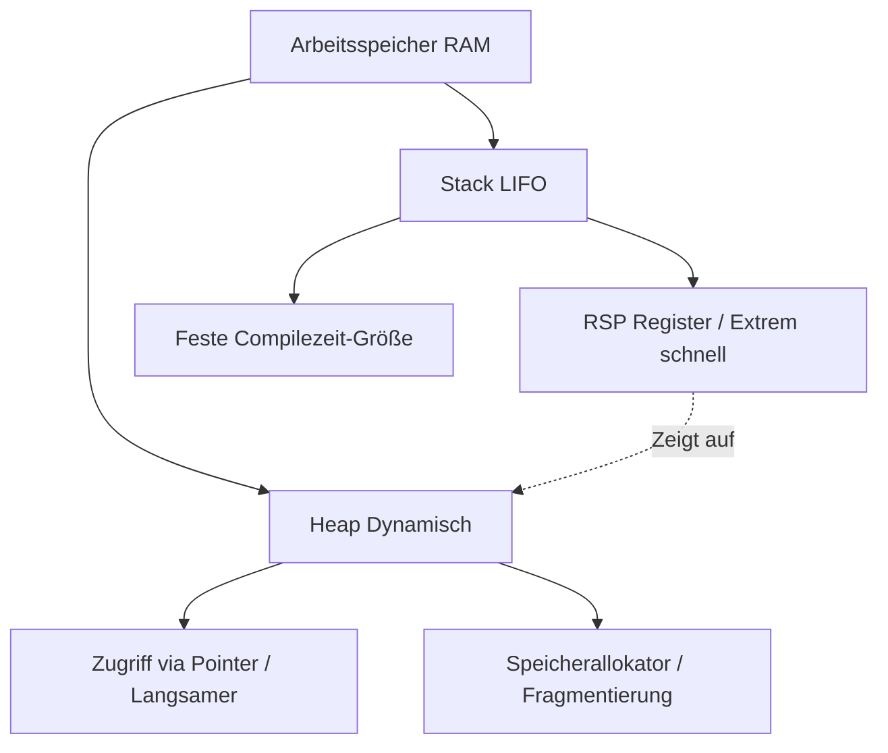

# Kapitel 17: Speicherverwaltung und das Ownership-System

Jedes lauffähige Computerprogramm muss Daten im Arbeitsspeicher (RAM) ablegen, verarbeiten und wieder löschen. Wie eine Programmiersprache diese fundamentale Interaktion mit der Hardware orchestriert, entscheidet maßgeblich über ihre Ausführungsgeschwindigkeit, ihren Speicherbedarf und ihre Robustheit gegenüber Sicherheitslücken. Rust geht hierbei einen revolutionären Weg: das **Ownership-System**. Um dieses System und seine Funktionsweise in den folgenden Kapiteln wirklich zu durchdringen, müssen wir zuerst verstehen, wie die zugrundeliegende Computerhardware den Speicher strukturiert und welche Konzepte zur Speicherverwaltung existieren.

---

## 1. Lernziele & Lernplan

### Lernziele
* **Sie können** das physikalische Layout des Arbeitsspeichers (Stack und Heap) skizzieren sowie den Unterschied bezüglich Allokationsgeschwindigkeit, CPU-Cache-Lokalität und Fragmentierung detailliert erklären.
* **Sie können** die Ursachen und Sicherheitsrisiken manueller Speicherverwaltung (Use-After-Free, Double Free, Memory Leaks) anhand von C/C++-Codebeispielen identifizieren und erklären, warum Rusts Compiler diese Fehler zur Compilezeit unmöglich macht.
* **Sie können** die Funktionsweise eines Garbage Collectors (Tracing, Mark-and-Sweep) mit dem RAII-Muster (Resource Acquisition Is Initialization) vergleichen und die Trade-offs in Bezug auf Performance, Latenz und Speicher-Overhead bewerten.
* **Sie können** Compiler-Fehlermeldungen bezüglich hängender Referenzen (Dangling References) auf den Stack analysieren und diese Fehler systematisch durch Besitzübergabe oder Heap-Allokation (`Box<T>`) beheben.

### Lernplan
* [ ] **2. Die Definition**: Formale Begriffserklärung und die Schreibtisch-Mietlager-Analogie.
* [ ] **3. Das Problem & Die Motivation**: Von-Neumann-Architektur, CPU-Caches und die Notwendigkeit von Speichersicherheit.
* [ ] **4. Der naive Versuch**: Ein fehlerhafter Rust-Code, der versucht, eine Referenz auf eine lokale Stack-Variable zurückzugeben.
* [ ] **5. Die Anatomie des Fehlers**: Analyse der Fehlermeldung und Visualisierung des abgeräumten Stack Frames (RSP-Register).
* [ ] **6. Die Lösung**: Implementierung mittels Move-Semantik und Heap-Boxen sowie das EVA-Prinzip.
* [ ] **7. Kleines Tutorial**: Praktische Visualisierung von echten Hardware-Speicheradressen auf Stack und Heap.
* [ ] **8. 17.1 Hardware-Speicherstruktur**: Tiefer Einblick in Stack-Speicher, Heap-Speicher und die Verknüpfung über Pointer.
* [ ] **9. 17.2 Speicherverwaltungskonzepte im Vergleich**: Analyse von C/C++ (Manuell), Java/Go (Garbage Collector) und C++/Rust (RAII).
* [ ] **10. API-Referenz der Speicherverwaltung**: Dokumentation von `std::mem` und `Box<T>`.
* [ ] **11. Drei praktische Übungen**: Leicht, Mittel und Schwer mit Blueprints und Lösungshinweisen.
* [ ] **12. Lernstrategie, Selbsteinschätzung & Merkzettel**: Aktives Lernen und Fehlerprovokation.
* [ ] **13. Zusammenfassung**: Die wichtigsten Erkenntnisse im Überblick.

---

## 2. Die Definition

Um die technische Diskussion auf eine solide Basis zu stellen, definieren wir die Kernbegriffe der Speicherverwaltung präzise:

* **Arbeitsspeicher (RAM)**: Ein flüchtiger Hardware-Speicher, der als lineare Reihe von einzeln adressierbaren Bytes organisiert ist. Jedes Byte besitzt eine eindeutige hexadezimale Adresse.
* **Stack (Stapel)**: Ein hochgradig strukturierter, linearer Speicherbereich, der nach dem LIFO-Prinzip (Last-In, First-Out) arbeitet. Seine Größe wird zur Compilezeit bestimmt. Er dient der Verwaltung von Funktionsaufrufen und lokalen Variablen.
* **Heap (Haufen)**: Ein unstrukturierter, dynamischer Speicherbereich für Daten, deren Größe sich zur Laufzeit ändern kann oder erst dann bekannt ist. Der Zugriff erfolgt über Speicheradressen (Pointer).
* **Pointer (Zeiger)**: Eine Variable auf dem Stack, die als Wert eine Speicheradresse enthält, welche auf einen anderen Ort im RAM (meist auf den Heap) verweist.
* **Deallokation (Freigabe)**: Der Prozess, bei dem ein zuvor angeforderter Speicherbereich im RAM wieder als "frei" markiert wird, damit er für andere Daten wiederverwendet werden kann.
* **Garbage Collector (GC)**: Ein Laufzeitprogramm, das während der Programmausführung den Heap periodisch nach nicht mehr erreichbaren Objekten durchsucht und deren Speicher automatisch freigibt.
* **RAII (Resource Acquisition Is Initialization)**: Ein Programmierparadigma, bei dem die Bindung einer Ressource (z. B. Speicher, Dateihandles) fest an die Lebensdauer eines Objekts auf dem Stack gekoppelt ist. Beim Verlassen des Scopes gibt der Destruktor die Ressource automatisch frei.
* **Ownership (Besitzrecht)**: Rusts proprietäres Speichersicherheitsmodell, bei dem jeder Wert im Speicher zu jedem Zeitpunkt exakt eine Besitzer-Variable auf dem Stack besitzt. Verlässt diese Variable ihren Scope, wird der Speicher automatisch freigegeben.

### Die Alltagsanalogie: Der Schreibtisch und das Mietlager

> [!NOTE]
> **Das Schreibtisch-Mietlager-Modell**:
> Stellen Sie sich Ihre tägliche Arbeit an einem physischen Büroarbeitsplatz vor:
> * **Der Stack ist Ihr Schreibtisch**: Er ist direkt vor Ihnen, extrem schnell zugänglich, hat aber eine sehr begrenzte Fläche. Alles, was Sie dort ablegen (Notizzettel, Stifte), hat eine feste Größe und ist sofort griffbereit. Wenn Sie mit einer Aufgabe fertig sind, räumen Sie die darauf bezogenen Notizzettel einfach auf einen Stapel und werfen den gesamten Stapel weg (LIFO-Prinzip).
> * **Der Heap ist ein externes Mietlager (Self-Storage)**: Wenn Sie an einem riesigen Archiv oder großen Ordnern arbeiten, die nicht auf Ihren Schreibtisch passen, mieten Sie eine Box im Lagerhaus an. Das Einlagern und Holen dauert deutlich länger, da Sie erst zum Lagerhaus fahren müssen.
> * **Der Pointer ist der Mietbeleg**: Auf Ihrem Schreibtisch (Stack) liegt lediglich ein kleiner Zettel mit der Lagernummer (z. B. "Box 402, Regal B"). Der Zettel hat eine feste Größe (z. B. 10x5 cm) und passt problemlos auf den Schreibtisch. Wenn Sie den Zettel verlieren oder wegwerfen, aber die Box im Lagerhaus nicht kündigen, blockieren Sie das Lagerhaus dauerhaft mit Müll (Memory Leak). Wenn Sie die Box kündigen, aber später versuchen, mit einer Kopie des Belegs dorthin zu fahren, greifen Sie auf fremdes Eigentum zu (Dangling Pointer).

---

## 3. Das Problem & Die Motivation

Computer basieren auf der Von-Neumann-Architektur, bei der Programmcodes und Daten gemeinsam im selben physikalischen Arbeitsspeicher liegen. Die CPU greift über den Systembus auf den RAM zu. Da der RAM physikalisch weit von den Rechenkernen entfernt ist, dauert ein direkter RAM-Zugriff im Vergleich zu Taktzyklen der CPU extrem lange (ca. 200 bis 300 CPU-Taktzyklen). 

Um diese Latenz zu überbrücken, besitzen moderne CPUs hierarchische Caches (L1, L2 und L3). L1-Caches sind extrem klein (oft nur 32 KB bis 64 KB pro Kern), laufen aber mit voller CPU-Geschwindigkeit. Daten auf dem Stack liegen im Speicher direkt hintereinander. Wenn die CPU auf eine Stack-Variable zugreift, lädt sie automatisch den gesamten umgebenden Speicherblock in den L1-Cache (räumliche Lokalität). Ein Zugriff auf den Heap hingegen erfordert das Verfolgen eines Pointers. Das führt dazu, dass die CPU an eine völlig andere Adresse im RAM springen muss. Dies verursacht fast immer einen sogenannten **Cache Miss** (Cache-Fehlzugriff), wodurch die CPU warten muss, bis die Daten aus dem langsamen Hauptspeicher geholt wurden.

Neben dem Performance-Aspekt ist die Speichersicherheit das größte Problem der Informatik. Über 70 % aller kritischen Sicherheitslücken in Betriebssystemen und Webbrowsern (wie Google Chrome oder Windows Kernel) lassen sich direkt auf Fehler in der Speicherverwaltung zurückführen. Wenn ein Programm unkontrolliert auf ungültige Speicherbereiche zugreift, kann ein Angreifer diesen Zustand ausnutzen, um Schadcode einzuschleusen (Buffer Overflow) oder sensible Daten auszulesen (Heartbleed-Bug).

Rust wurde entwickelt, um dieses fundamentale Dilemma der Softwareentwicklung zu lösen:
1. **Keine Performance-Einbußen**: Rust soll die maximale Ausführungsgeschwindigkeit von C und C++ bieten (Zero-Cost Abstractions).
2. **Absolute Sicherheit**: Der Compiler muss mathematisch garantieren, dass zur Laufzeit keine Speicherfehler auftreten können.

---

## 4. Der naive Versuch

Ein klassisches Problem der Speicherverwaltung ist die Entstehung von hängenden Zeigern (Dangling Pointers). Dies passiert, wenn ein Zeiger auf eine Speicheradresse verweist, die bereits freigegeben wurde. 

Der folgende naive Versuch zeigt, wie ein Entwickler instinktiv versuchen könnte, in einer Rust-Funktion eine lokale Variable auf dem Stack zu erstellen und eine Referenz auf diese Variable an die aufrufende Funktion zurückzugeben.

### Didaktischer Pseudocode
```text
FUNKTION erstelle_zahl_auf_stack() -> GIB_REFERENZ_ZURÜCK
    VARIABLE lokale_zahl = 42
    GIB DIE SPEICHERADRESSE VON lokale_zahl ZURÜCK

FUNKTION main()
    VARIABLE zeiger = erstelle_zahl_auf_stack()
    DRUCKE DEN WERT AN DER ADRESSE zeiger
```

### Der fehlerhafte Rust-Code
```rust
// Dieser Code lässt sich NICHT kompilieren!
fn get_dangling_reference() -> &i32 {
    let local_value = 42; // Variable wird auf dem Stack dieser Funktion angelegt
    &local_value          // Versuch, eine Referenz auf die Stack-Variable zurückzugeben
}

fn main() {
    let reference = get_dangling_reference();
    println!("Der Wert an der Adresse ist: {}", reference);
}
```

---

## 5. Die Anatomie des Fehlers

### Das Compiler-Feedback
Versuchen wir, diesen Code mit `cargo check` zu prüfen, blockiert uns der Rust-Compiler sofort mit einer unmissverständlichen Fehlermeldung:

```text
error[E0515]: cannot return reference to local variable `local_value`
 --> src/main.rs:3:5
  |
3 |     &local_value
  |     ^^^^^^^^^^^^ returns a reference to data owned by the current function
```

Der Compiler erkennt, dass `local_value` der Funktion `get_dangling_reference` gehört und mit dem Ende der Funktion zerstört wird. Eine Rückgabe der Referenz würde im aufrufenden Kontext (`main`) zu einem Dangling Pointer führen.

### Zeile-für-Zeile-Erklärung des Speicherverhaltens

Um genau zu verstehen, warum der Compiler hier eingreifen muss, betrachten wir das physikalische Verhalten der Hardware-Register und des Stack-Speichers:

```
Schritt 1: Aufruf von get_dangling_reference()
Stack wächst nach unten (niedrigere Adressen)

   Adressen      Stack-Layout
┌──────────────┬──────────────────────────────────┐
│ 0x7fffffff50 │ Main Stack Frame (Rücksprung)    │
├──────────────┼──────────────────────────────────┤
│ 0x7fffffff48 │ RSP -> get_dangling_reference()  │
│              │ local_value = 42                 │
└──────────────┴──────────────────────────────────┘

Schritt 2: Funktion get_dangling_reference() beendet sich
Der Stack Pointer (RSP) wird zurückgesetzt. Der Speicherbereich wird freigegeben!

   Adressen      Stack-Layout
┌──────────────┬──────────────────────────────────┐
│ 0x7fffffff50 │ RSP -> Main Stack Frame          │
├──────────────┼──────────────────────────────────┤
│ 0x7fffffff48 │ [Ungültiger Speicherbereich!]    │
│              │ (Enthält physikalisch noch 42)    │
└──────────────┴──────────────────────────────────┘
```

1. **Funktionsaufruf**: Wenn `main` die Funktion `get_dangling_reference` aufruft, wird ein neuer Stack Frame (Aktivierungsblock) für diese Funktion auf dem Stack erstellt. Der Stack Pointer (RSP-Register der CPU) verschiebt sich nach unten, um Platz für lokale Variablen zu schaffen.
2. **Variablenbindung**: Die Variable `local_value` wird auf der Adresse `0x7fffffff48` abgelegt und mit dem Wert `42` initialisiert.
3. **Funktionsende (Return)**: Die Funktion versucht, die Speicheradresse `0x7fffffff48` an `main` zurückzugeben. Genau jetzt räumt die CPU die Funktion auf. Der Stack Pointer (RSP) wird einfach wieder nach oben geschoben (auf `0x7fffffff50`). 
4. **Das Sicherheitsrisiko**: Der Stack Frame von `get_dangling_reference` ist nun physikalisch "ungültig" und für das Betriebssystem zur Überschreibung freigegeben. Würde `main` nun versuchen, über den Zeiger `0x7fffffff48` auf den Wert zuzugreifen (Dereferenzierung), könnte dort noch die `42` stehen. Sobald jedoch eine andere Funktion aufgerufen wird, überschreibt deren Stack Frame diesen Bereich. Unser Programm würde plötzlich völlig unvorhersehbare Werte lesen oder abstürzen. Das ist **Undefined Behavior**.

---

## 6. Die Lösung

Um dieses Problem zu lösen, müssen wir dafür sorgen, dass die Daten entweder kopiert werden (so dass `main` eine eigene, lokale Kopie auf ihrem Stack erhält) oder dass die Daten auf dem Heap alloziiert werden, wo sie unabhängig von Funktions-Scopes überleben können.

### Option 1: Rückgabe des Werts selbst (Move/Copy)
Wenn wir die Referenz (`&`) weglassen, geben wir das Eigentum (Ownership) am Wert selbst zurück. Da `i32` ein einfacher Typ mit fester Größe ist, wird der Wert bei der Rückgabe im Speicher kopiert.

```rust
fn get_safe_value() -> i32 {
    let local_value = 42; 
    local_value // Wert wird kopiert und das Eigentum an main übergeben
}

fn main() {
    let value = get_safe_value();
    println!("Der sichere Wert ist: {}", value); // ✅ Funktioniert!
}
```

### Option 2: Allokation auf dem Heap mit `Box<T>`
Wenn es sich um größere Datenstrukturen handelt, die wir nicht kopieren wollen, allozieren wir sie mit dem Smart Pointer `Box<T>` auf dem Heap. Der Zeiger auf dem Stack besitzt die Heap-Daten und wird an `main` übergeben.

```rust
fn get_heap_value() -> Box<i32> {
    let local_value = Box::new(42); // 42 wird auf dem Heap gespeichert
    local_value // Box (Pointer) wird per Move an den Aufrufer übergeben
}

fn main() {
    let heap_box = get_heap_value();
    println!("Der Wert in der Box auf dem Heap ist: {}", heap_box); // ✅ Funktioniert!
} // Am Ende von main wird der Heap-Speicher automatisch deallokiert.
```

### Aufschlüsselung nach dem EVA-Prinzip (für Option 2)

1. **Eingabe (Input)**: Die Funktion `get_heap_value` benötigt keine Eingabeparameter.
2. **Verarbeitung (Processing)**: `Box::new(42)` fordert über den Heap-Allokator Speicher für ein `i32` (4 Bytes) auf dem Heap an. Die Zahl `42` wird in diesen Heap-Speicher geschrieben. Auf dem Stack der Funktion wird eine `Box`-Struktur angelegt, die die Heap-Speicheradresse enthält.
3. **Ausgabe (Output)**: Die Funktion gibt den Typ `Box<i32>` zurück. Das Ownership (Besitzrecht) für diesen Zeiger und die damit verbundenen Heap-Daten wird an die Variable `heap_box` in `main` übergeben.

---

## 7. Kleines Tutorial: Hardware-Speicheradressen visualisieren

In diesem Tutorial schreiben wir ein lauffähiges Rust-Programm, das die echten physikalischen Speicheradressen unserer Variablen zur Laufzeit ausgibt. Dadurch machen wir den Unterschied zwischen Stack und Heap für Sie direkt sichtbar.

### Schritt 1: Neues Cargo-Projekt anlegen
Öffnen Sie Ihr Terminal und initialisieren Sie ein neues Binärprojekt:
```bash
cargo new memory_explorer --bin
cd memory_explorer
```

### Schritt 2: Quellcode schreiben
Ersetzen Sie den Inhalt von `src/main.rs` durch den folgenden vollständigen Programmcode:

```rust
fn main() {
    // 1. Zwei Variablen direkt auf dem Stack deklarieren
    let stack_var_a: i32 = 100;
    let stack_var_b: i32 = 200;

    // 2. Zwei Boxen deklarieren, die Daten auf den Heap auslagern
    let heap_box_a: Box<i32> = Box::new(300);
    let heap_box_b: Box<i32> = Box::new(400);

    println!("=== STACK-VARIABLEN ===");
    // {:p} ist der Format-Spezifizierer für Pointer (Speicheradressen)
    println!("Adresse von stack_var_a (Stack): {:p}", &stack_var_a);
    println!("Adresse von stack_var_b (Stack): {:p}", &stack_var_b);

    println!("\n=== HEAP-VARIABLEN (ZEIGER-ZIELE) ===");
    // Hier geben wir die Adresse aus, auf die der Box-Zeiger zeigt:
    println!("Ziel-Adresse von heap_box_a (Heap): {:p}", heap_box_a);
    println!("Ziel-Adresse von heap_box_b (Heap): {:p}", heap_box_b);

    println!("\n=== BOX-ZEIGER SELBST ===");
    // Die Box-Variable selbst liegt als Zeiger auf dem Stack:
    println!("Adresse des Zeigers heap_box_a selbst (Stack): {:p}", &heap_box_a);
    println!("Adresse des Zeigers heap_box_b selbst (Stack): {:p}", &heap_box_b);
}
```

### Schritt 3: Ausführen und Ausgabe analysieren
Starten Sie das Programm mit `cargo run`. Sie werden eine Ausgabe erhalten, die ähnlich wie die folgende aussieht (die konkreten Hexadezimalwerte hängen von Ihrem Betriebssystem und der aktuellen Speichersituation ab):

```text
=== STACK-VARIABLEN ===
Adresse von stack_var_a (Stack): 0x7ffcd36f874c
Adresse von stack_var_b (Stack): 0x7ffcd36f8748

=== HEAP-VARIABLEN (ZEIGER-ZIELE) ===
Ziel-Adresse von heap_box_a (Heap): 0x55b1dfa52b80
Ziel-Adresse von heap_box_b (Heap): 0x55b1dfa52ba0

=== BOX-ZEIGER SELBST ===
Adresse des Zeigers heap_box_a selbst (Stack): 0x7ffcd36f8750
Adresse des Zeigers heap_box_b selbst (Stack): 0x7ffcd36f8758
```

### Analyse der Adressbereiche:
1. **Stack-Variablen**: `stack_var_a` und `stack_var_b` liegen im Adressbereich `0x7ffcd36f8...`. Dies ist ein typischer Hochadressbereich des Systems. Beachten Sie, dass sich die Adressen um exakt 4 Bytes unterscheiden (`0x7ffcd36f874c` zu `0x7ffcd36f8748`). Dies entspricht exakt der physischen Größe eines `i32` (4 Bytes). Der Stack wächst hier nach unten.
2. **Heap-Ziele**: Die tatsächlichen Werte (300 und 400) liegen an den Adressen `0x55b1dfa52b80` und `0x55b1dfa52ba0`. Dies ist ein völlig anderer, deutlich niedrigerer Adressbereich. Die Differenz beträgt hier 32 Bytes (`0x20` in Hexadezimal), was auf das interne Padding und Metadaten-Management des Standard-Heap-Allokators (`jemalloc` bzw. System-Allokator) zurückzuführen ist.
3. **Box-Zeiger selbst**: Die Zeiger, die auf die Heap-Adressen verweisen, liegen selbst wieder auf dem Stack im Hochadressbereich (`0x7ffcd36f8750` und `0x7ffcd36f8758`). Der Abstand beträgt exakt 8 Bytes, was der Größe eines Pointers auf einem 64-Bit-System entspricht.

---

## 17.1 Hardware-Speicherstruktur

Um zu verstehen, warum Rust den Speicher so verwaltet, wie es das tut, müssen wir uns die Funktionsweise der Hardware genauer ansehen.



### 17.1.1 Stack-Speicher
Der Stack ist ein kontinuierlicher Speicherbereich im Arbeitsspeicher, der direkt von der CPU verwaltet wird. Er arbeitet nach dem **LIFO-Prinzip** (Last-In, First-Out). Ein neuer Wert wird oben auf den Stapel gelegt (push), und der oberste Wert wird als erstes wieder entfernt (pop).

* **Der Stack Pointer**: Die CPU besitzt ein dediziertes Hardware-Register, das den Stack Pointer enthält (auf x86_64-Architekturen ist dies das Register `RSP`). Wenn eine Funktion aufgerufen wird, subtrahiert die CPU einfach die benötigte Anzahl von Bytes vom `RSP`-Register (da der Stack im virtuellen Adressraum nach unten wächst). Das Allozieren von Speicher auf dem Stack ist daher eine der schnellsten Operationen in der Informatik – es ist buchstäblich nur ein einziger CPU-Befehl (Subtraktion). Das Freigeben ist ebenso schnell (Addition).
* **Stack Frames**: Jede aufgerufene Funktion erhält ihren eigenen Stack Frame. Dieser enthält die Rücksprungadresse der Funktion, die übergebenen Parameter und alle lokalen Variablen. Sobald die Funktion fertig ist, wird der gesamte Stack Frame abgeräumt, indem der Stack Pointer wieder auf den Anfangswert zurückgesetzt wird.
* **Voraussetzung**: Alle Daten, die auf dem Stack liegen, müssen eine dem Compiler bekannte, feste Größe haben. Ein einfaches Array der Größe 10 (`[i32; 10]`) kann auf dem Stack liegen, da seine Größe immer exakt 40 Bytes beträgt. Ein Vektor, der dynamisch wächst, kann dort nicht liegen.
* **CPU-Caches**: Da Stack-Daten lückenlos hintereinander liegen, sind sie extrem cache-freundlich. Wenn die CPU auf Stack-Daten zugreift, kommt es fast nie zu Latenzverzögerungen, da die benachbarten Werte bereits im schnellen L1- oder L2-Cache der CPU liegen.

### 17.1.2 Heap-Speicher
Der Heap ist ein riesiger, unstrukturierter Speicherbereich, der für Daten zur Verfügung steht, deren Größe sich zur Laufzeit ändert oder vorab nicht bekannt ist (z. B. dynamische Textdateien, Netzwerksockets, wachsende Listen).

* **Der Allokationsprozess**: Wenn ein Programm Speicher auf dem Heap anfordert, ruft es den System-Allokator (z. B. `malloc` in C oder Rusts Standard-Allokator) auf. Dieser muss eine freie Speicherstelle auf dem Heap finden, die groß genug ist, um die Daten aufzunehmen. Dazu durchsucht der Allokator Tabellen oder verkettete Listen freier Speicherblöcke (Freilisten). Dies erfordert Suchzeit und ist daher um ein Vielfaches langsamer als die Stack-Allokation.
* **Systemaufrufe**: Hat der Allokator keinen passenden freien Block mehr in seinem reservierten Bereich, muss er das Betriebssystem über teure Systemaufrufe (wie `brk`/`sbrk` oder `mmap` unter Linux) anweisen, den Heap-Bereich des Prozesses zu vergrößern. Dies erfordert einen Kontextwechsel in den Kernel-Modus, was extrem viel Rechenzeit kostet.
* **Speicherfragmentierung**: Da Speicherblöcke auf dem Heap in beliebiger Reihenfolge alloziiert und freigegeben werden, entstehen Lücken (Fragmentierung). Es kann passieren, dass insgesamt zwar noch 100 MB Heap-Speicher frei sind, diese aber in Form von Millionen winziger Lücken verstreut sind. Versucht das Programm dann, einen zusammenhängenden Block von 10 MB anzufordern, scheitert die Allokation, obwohl theoretisch genug Speicher da wäre.
* **Latenz & Cache-Misses**: Um auf Heap-Daten zuzugreifen, muss die CPU zuerst die Adresse auf dem Stack lesen und anschließend im RAM an diese Adresse springen. Dieses "Pointer Chasing" führt fast immer dazu, dass die CPU-Pipeline ins Stocken gerät, weil die Daten nicht im L1-Cache vorliegen (Cache Miss).

### 17.1.3 Pointer-Verbindung
Der Stack und der Heap sind in der Praxis eng miteinander verwoben. Datenstrukturen, die dynamisch wachsen (wie `String` oder `Vec`), speichern ihre eigentlichen Daten auf dem Heap, halten aber einen fest strukturierten Deskriptor (den Zeiger) auf dem Stack.

```
STACK (Feste Größe, sehr schnell)             HEAP (Dynamisch, flexibel)
┌─────────────────────────────────┐
│ Variable: my_vector             │
│ ┌──────────┬──────────────────┐ │           ┌──────────────────────────┐
│ │ Pointer  │ 0x55b1dfa52b80 ──┼─┼──────────►│ [10, 20, 30, 40]         │
│ ├──────────┼──────────────────┤ │           │                          │
│ │ Len      │ 4                │ │           └──────────────────────────┘
│ ├──────────┼──────────────────┤ │
│ │ Capacity │ 4                │ │
│ └──────────┴──────────────────┘ │
└─────────────────────────────────┘
```

Ein `Vec<i32>` belegt auf dem Stack immer exakt 24 Bytes (auf einem 64-Bit-System):
1. **Pointer (8 Bytes)**: Enthält die 64-Bit-Speicheradresse des ersten Elements auf dem Heap (z. B. `0x55b1dfa52b80`).
2. **Länge (8 Bytes)**: Gibt an, wie viele Elemente aktuell im Vektor gespeichert sind.
3. **Kapazität (8 Bytes)**: Gibt an, für wie viele Elemente der Allokator Speicher auf dem Heap reserviert hat.

**Fat Pointer (Fette Zeiger)**:
Neben normalen Pointern nutzt Rust sogenannte Fat Pointer. Diese sind nicht 8, sondern 16 Bytes groß. Sie bestehen aus:
* Einer Speicheradresse (8 Bytes)
* Zusätzlichen Metadaten (8 Bytes): Bei Slices (z. B. `&str` oder `&[T]`) ist dies die Länge des Slices. Bei Trait-Objekten (z. B. `&dyn MyTrait`) ist dies ein Zeiger auf eine virtuelle Methodentabelle (vtable), die die Funktionszeiger der konkreten Implementierung enthält.

---

## 17.2 Speicherverwaltungskonzepte im Vergleich

Im Laufe der Informatikgeschichte haben sich verschiedene Ansätze etabliert, um den Heap-Speicher zu verwalten. Jedes Konzept besitzt fundamentale Trade-offs.

| Kriterium | Manuell (C / C++) | Garbage Collector (Java / Go) | RAII / Ownership (Rust) |
| :--- | :--- | :--- | :--- |
| **Allokation** | Explizit (`malloc` / `new`) | Explizit (`new` / Garbage Collector) | Explizit (`Box::new` / implizit) |
| **Deallokation** | Manuell (`free` / `delete`) | Automatisch durch Hintergrund-Thread | Automatisch an Scope-Enden (Drop) |
| **Laufzeit-Overhead** | Keiner (maximal effizient) | Hoch (GC-Pausen, CPU-Last) | Keiner (Zero-Cost) |
| **Speicher-Overhead** | Keiner | Hoch (oft 2x bis 3x des Netto-Bedarfs) | Keiner |
| **Sicherheit** | Sehr unsicher (manuelle Fehler) | Sicher vor Speicherfehlern | Sicher vor Speicherfehlern |
| **Determinismus** | Deterministisch | Nicht-deterministisch (GC-Lauf unklar) | Deterministisch |

### 17.2.1 Manuelle Freigabe (C/C++)
In Systemprogrammiersprachen wie C fordert der Entwickler Speicher explizit über `malloc` (Memory Allocation) auf dem Heap an und muss diesen Speicher über `free` wieder freigeben.

#### Beispiel für fehlerhaften C-Code:
```c
#include <stdlib.h>
#include <stdio.h>

void memory_leak_example() {
    int *ptr = (int*) malloc(sizeof(int)); // Speicher alloziiert
    *ptr = 42;
    // Vergessen, free(ptr) aufzurufen!
    // Wenn die Funktion endet, geht ptr auf dem Stack verloren.
    // Die 4 Bytes auf dem Heap sind für immer blockiert (Memory Leak).
}

void use_after_free_example() {
    int *ptr = (int*) malloc(sizeof(int));
    *ptr = 99;
    free(ptr); // Speicher wird freigegeben.

    // Fataler Fehler: ptr zeigt immer noch auf die Adresse (Dangling Pointer)
    printf("Wert: %d\n", *ptr); // Use-After-Free! Kann abstürzen oder Schadcode ausführen.
}

void double_free_example() {
    int *ptr = (int*) malloc(sizeof(int));
    free(ptr); // Erste Freigabe.
    free(ptr); // Double Free! Führt zu schwerer Heap-Beschädigung.
}
```

Das Problem: Der Compiler hat in C/C++ keine Möglichkeit zu prüfen, ob der Entwickler diese Befehle korrekt anwendet. Ein einziger Fehler kann zum Absturz des Gesamtsystems oder zu massiven Sicherheitslücken führen.

### 17.2.2 Garbage Collector (Java/Go)
Um Entwickler von der fehleranfälligen manuellen Freigabe zu entlasten, nutzen Sprachen wie Java, Python, C# und Go einen Garbage Collector.

* **Funktionsweise (Tracing GC)**: Das Programm läuft in einer virtuellen Maschine oder mit einer Laufzeitumgebung (Runtime). Ein separater Thread (der Garbage Collector) wacht in regelmäßigen Abständen auf, stoppt unter Umständen das eigentliche Programm (**Stop-the-World Pauses**) und durchläuft alle aktiven Variablen auf dem Stack (die Roots). Er markiert alle vom Stack aus erreichbaren Heap-Objekte. Alle nicht markierten Objekte gelten als "Müll" und werden gelöscht (Mark-and-Sweep).
* **Nachteile**:
  1. **GC-Pausen**: Für extrem zeitkritische Anwendungen (z. B. Robotik, Fahrzeugsteuerung, Audiosignalverarbeitung oder High-Frequency-Trading) sind GC-Pausen inakzeptabel. Ein kurzes Stocken von 50 Millisekunden kann fatale Folgen haben.
  2. **Hoher Speicherbedarf**: Garbage Collector arbeiten erst dann effizient, wenn der verfügbare Heap deutlich größer ist als der tatsächlich genutzte Speicher. Ein Java-Programm benötigt oft das Doppelte bis Dreifache des Speichers eines äquivalenten Rust-Programms.
  3. **Nicht-Determinismus**: Es ist unvorhersehbar, wann genau der GC anspringt und wie viel CPU-Leistung er verbraucht.

### 17.2.3 RAII-Entwurfsmuster
Das Konzept **Resource Acquisition Is Initialization (RAII)** wurde ursprünglich von Bjarne Stroustrup für C++ entwickelt. Es koppelt die Lebensdauer von Systemressourcen an die Lebensdauer von Stack-Objekten.

* **Das Prinzip**:
  1. Beim Erzeugen eines Objekts auf dem Stack (Konstruktor) wird die Ressource (z. B. Heap-Speicher, geöffnete Datei, Socket) reserviert.
  2. Das Objekt wird normal im Programm verwendet.
  3. Verlässt das Objekt seinen Scope (z. B. am Ende einer Funktion), ruft die Laufzeitumgebung automatisch den **Destruktor** des Objekts auf. Der Destruktor gibt die Ressource sicher frei.

Da Stack-Scopes deterministisch feststehen, ist die Freigabe der Ressource absolut deterministisch und geschieht ohne jeglichen Laufzeit-Overhead zur Compilezeit. 

**Rusts Weiterentwicklung**:
Rust perfektioniert das RAII-Konzept, indem es dieses über sein Ownership-System strikt erzwingt. In C++ ist RAII optional – Entwickler können immer noch rohe Pointer verwenden und Speicherfehler verursachen. In Rust ist RAII über das **Drop-Trait** fest in das Typsystem integriert. Der Compiler erlaubt es schlichtweg nicht, das RAII-Muster zu umgehen.

---

## 10. API-Referenz der Speicherverwaltung

Die Rust-Standardbibliothek bietet im Modul `std::mem` sowie über den Typen `Box<T>` Werkzeuge zur expliziten Kontrolle und Abfrage des Speicherlayouts.

### 1. `std::mem::size_of`
* **Signatur**: `pub const fn size_of<T>() -> usize`
* **Beschreibung**: Liefert die physikalische Größe des Typs `T` in Bytes auf dem Zielsystem. Die Funktion wird komplett zur Compilezeit ausgewertet.
* **Parameter**: Keine. Der Typ wird als Generics-Parameter übergeben.
* **Rückgabetyp**: `usize` (Größe in Bytes).
* **Panics**: Keine.
* **Kurzbeispiel**:
  ```rust
  let size = std::mem::size_of::<i32>();
  assert_eq!(size, 4); // i32 belegt immer 4 Bytes
  ```

### 2. `std::mem::align_of`
* **Signatur**: `pub const fn align_of<T>() -> usize`
* **Beschreibung**: Gibt das minimale Speicher-Alignment (Ausrichtung) des Typs `T` in Bytes zurück. CPUs greifen effizienter auf Speicher zu, wenn die Adressen Vielfache einer bestimmten Zweierpotenz sind.
* **Parameter**: Keine.
* **Rückgabetyp**: `usize`.
* **Panics**: Keine.
* **Kurzbeispiel**:
  ```rust
  let alignment = std::mem::align_of::<u64>();
  assert_eq!(alignment, 8); // u64 muss auf Adressen liegen, die durch 8 teilbar sind
  ```

### 3. `std::mem::drop`
* **Signatur**: `pub fn drop<T>(_x: T)`
* **Beschreibung**: Gibt den übergebenen Wert manuell und vorzeitig frei. Die Funktion übernimmt das Eigentum an dem Wert. Da die Funktion selbst keinen Code enthält, verlässt die Variable am Ende der Funktion ihren Scope und die `Drop`-Implementierung des Typs gibt den Heap-Speicher frei.
* **Parameter**: `_x: T` (der zu zerstörende Wert).
* **Rückgabetyp**: `()` (Unit-Typ).
* **Panics**: Keine.
* **Kurzbeispiel**:
  ```rust
  let my_string = String::from("Temporär");
  std::mem::drop(my_string);
  // my_string ist ab hier ungültig und nicht mehr verwendbar!
  ```

### 4. `std::mem::forget`
* **Signatur**: `pub fn forget<T>(t: T)`
* **Beschreibung**: Verhindert, dass Rust den Destruktor des übergebenen Werts aufruft, wenn dieser seinen Scope verlässt. Dies führt absichtlich zu einem kontrollierten Speicherleck. Nützlich bei der Interaktion mit C-Code (FFI).
* **Parameter**: `t: T` (der Wert, dessen Destruktor übersprungen werden soll).
* **Rückgabetyp**: `()`.
* **Panics**: Keine.
* **Kurzbeispiel**:
  ```rust
  let my_box = Box::new(42);
  std::mem::forget(my_box); // Der Heap-Speicher der Box wird NIE wieder freigegeben.
  ```

### 5. `Box<T>::new`
* **Signatur**: `pub fn new(x: T) -> Box<T>`
* **Beschreibung**: Alloziiert Speicher auf dem Heap und legt den Wert `x` darin ab.
* **Parameter**: `x: T` (Wert, der auf den Heap verschoben werden soll).
* **Rückgabetyp**: `Box<T>` (Besitzerzeiger auf den Heap).
* **Panics**: Kann zum Programmabbruch (Abort) führen, falls der Heap-Speicher des Betriebssystems erschöpft ist (OOM - Out Of Memory).
* **Kurzbeispiel**:
  ```rust
  let heap_num = Box::new(100);
  assert_eq!(*heap_num, 100);
  ```

### 6. `Box<T>::into_raw`
* **Signatur**: `pub fn into_raw(b: Box<T>) -> *mut T`
* **Beschreibung**: Konsumiert die Box und gibt einen rohen, veränderlichen Zeiger (`*mut T`) auf den Heap-Speicher zurück. Der Speicher wird ab diesem Moment von Rusts automatischem RAII ausgenommen und muss manuell freigegeben werden, um Leaks zu verhindern.
* **Parameter**: `b: Box<T>` (die zu konsumierende Box).
* **Rückgabetyp**: `*mut T` (roher Zeiger).
* **Panics**: Keine.
* **Kurzbeispiel**:
  ```rust
  let my_box = Box::new(10);
  let raw_ptr: *mut i32 = Box::into_raw(my_box);
  // raw_ptr muss manuell über Box::from_raw wieder in Empfang genommen werden!
  ```

### 7. `Box<T>::from_raw`
* **Signatur**: `pub unsafe fn from_raw(raw: *mut T) -> Box<T>`
* **Beschreibung**: Rekonstruiert eine `Box<T>` aus einem zuvor über `Box::into_raw` erzeugten rohen Zeiger. Der Heap-Speicher unterliegt danach wieder dem normalen RAII-Prozess.
* **Sicherheitsaspekte**: Diese Funktion ist extrem unsicher (`unsafe`). Der Zeiger `raw` muss zwingend auf gültigen Heap-Speicher zeigen, der zuvor mit `Box` alloziiert wurde. Doppeltes Aufrufen von `from_raw` auf demselben Zeiger führt zu einem fatalen Double Free.
* **Parameter**: `raw: *mut T` (der rohe Zeiger).
* **Rückgabetyp**: `Box<T>`.
* **Panics**: Keine.
* **Kurzbeispiel**:
  ```rust
  let my_box = Box::new(50);
  let raw_ptr = Box::into_raw(my_box);
  // Das Zurückholen muss in einem unsafe-Block geschehen:
  let original_box = unsafe { Box::from_raw(raw_ptr) };
  assert_eq!(*original_box, 50);
  ```

---

## 11. Drei praktische Übungen

### Übung 1 (Leicht): Physikalische Typgrößen untersuchen
* **Ziel**: Ermitteln Sie die genaue Byte-Belegung verschiedener Datentypen auf Ihrem System, um den Unterschied zwischen Stack-Größe und Heap-Metadaten zu begreifen.
* **Anforderungen**:
  1. Verwenden Sie `std::mem::size_of` für die Typen `i32`, `f64`, `bool`, `char`, `&str` und `String`.
  2. Geben Sie die Ergebnisse sauber in einer Tabelle über die Konsole aus.
  3. Vergleichen Sie den Unterschied zwischen einem leeren Vektor (`Vec<i32>`) und einem alloziierten Vektor.
* **Blueprint**:
  ```rust
  fn main() {
      // Ihre Implementierung hier...
  }
  ```
* **Lösungshinweis**: Denken Sie daran, dass `std::mem::size_of::<T>()` den Typ als generische Variable erwartet. Ein `String` hat immer eine feste Größe von 24 Bytes auf dem Stack, unabhängig von der Länge des Textes, der auf dem Heap liegt!

### Übung 2 (Mittel): Eine eigene RAII-Ressource implementieren
* **Ziel**: Verstehen Sie den deterministischen Ablauf des `Drop`-Traits, indem Sie eine Struktur schreiben, die eine Ressource simuliert, die explizit beim Verlassen des Scopes geschlossen werden muss.
* **Anforderungen**:
  1. Definieren Sie ein Struct `DatabaseConnection` mit den Feldern `connection_id: u32` und `is_active: bool`.
  2. Implementieren Sie das `Drop`-Trait für dieses Struct. Sobald die Verbindung gedroppt wird, soll auf der Konsole ausgegeben werden: `"Verbindung {connection_id} wurde erfolgreich geschlossen und Speicher freigegeben."`.
  3. Erstellen Sie in der `main`-Funktion einen inneren Block `{ }`, um einen separaten Scope zu erzeugen. Testen Sie das Verhalten, indem Sie dort eine Verbindung erzeugen und sehen, wann genau die Konsolenausgabe erfolgt.
* **Blueprint**:
  ```rust
  struct DatabaseConnection {
      connection_id: u32,
      is_active: bool,
  }

  // Implementieren Sie das Drop-Trait für DatabaseConnection
  ```
* **Lösungshinweis**: Das `Drop`-Trait verlangt die Implementierung von `fn drop(&mut self)`. Beachten Sie, dass Sie `drop` niemals manuell aufrufen dürfen; der Aufruf geschieht vollautomatisch durch den Compiler am Ende des Scopes.

### Übung 3 (Schwer): Einen rudimentären Arena-Allokator simulieren
* **Ziel**: Um zu verstehen, wie Heap-Speicherplatz reserviert wird, simulieren Sie einen einfachen Arena-Allokator. Dieser vergibt fortlaufend Teilstücke aus einem festen Speicherbereich.
* **Anforderungen**:
  1. Erstellen Sie eine Struktur `Arena` mit einem Puffer von 1024 Bytes (`buffer: [u8; 1024]`) und einem Positionszähler (`position: usize`).
  2. Schreiben Sie eine Methode `alloc(&mut self, size: usize) -> Result<*mut u8, &'static str>`. Diese soll prüfen, ob noch genug Platz im Puffer ist. Wenn ja, erhöht sie die `position` und gibt einen rohen Zeiger auf den reservierten Bereich zurück. Wenn kein Platz mehr da ist, gibt sie einen Fehler zurück.
  3. Schreiben Sie ein Testprogramm, das nacheinander verschiedene Blöcke anfordert und die Adressdifferenzen ausgibt.
* **Blueprint**:
  ```rust
  struct Arena {
      buffer: [u8; 1024],
      position: usize,
  }

  impl Arena {
      fn new() -> Self {
          Arena {
              buffer: [0; 1024],
              position: 0,
          }
      }

      fn alloc(&mut self, size: usize) -> Result<*mut u8, &'static str> {
          // Ihre Implementierung hier...
      }
  }
  ```
* **Lösungshinweis**: Sie müssen den rohen Zeiger des Puffers an der aktuellen Position ermitteln. Nutzen Sie dafür `.as_mut_ptr()` auf dem Puffer-Array und verschieben Sie den Zeiger mit der Methode `add()`. Vorsicht: Die Verwendung von rohen Zeigern und `add` erfordert das Schlüsselwort `unsafe`!

---

## 12. Lernstrategie, Selbsteinschätzung & Merkzettel

### Spickzettel / Merkzettel (Cheat Sheet)

| Eigenschaft / Typ | Stack (Stapel) | Heap (Haufen) |
| :--- | :--- | :--- |
| **Allokation** | Extrem schnell (Subtraktion RSP) | Langsamer (Suchvorgang in Freilisten) |
| **Größenbeschränkung** | Fest / Bekannt zur Compilezeit | Dynamisch wachsende Daten zur Laufzeit |
| **Lebensdauer** | Streng an Scopes `{ }` gekoppelt | Unabhängig von Scopes (RAII gesteuert) |
| **CPU-Cache** | Sehr hohe Cache-Lokalität | Häufige Cache Misses (Pointer-Sprünge) |
| **Typische Typen** | `i32`, `f64`, `bool`, `char`, `[i32; 10]` | `String`, `Vec<T>`, `Box<T>`, `HashMap` |

### Active Recall (Verständnisfragen)
1. **Frage**: Warum führt die Rückgabe einer Referenz auf eine lokale Variable in einer Rust-Funktion zu einem Compilerfehler, während dies in C klaglos übersetzt wird?
   * *Antwort*: Rusts Compiler (Borrow Checker) garantiert die Gültigkeit von Speicheradressen. In C wird der Stack Frame einfach abgeräumt und die zurückgegebene Adresse ungültig, was zu undefiniertem Verhalten (Dangling Pointer) führt. Rust blockiert das bereits beim Kompilieren.
2. **Frage**: Was ist der Unterschied zwischen der Größe einer `String`-Variable auf dem Stack und der Größe des tatsächlichen Textinhalts auf dem Heap?
   * *Antwort*: Die `String`-Variable auf dem Stack belegt immer exakt 24 Bytes (Pointer, Länge, Kapazität auf 64-Bit-Systemen). Der Textinhalt auf dem Heap verbraucht so viele Bytes, wie der Text lang ist.
3. **Frage**: Welche Nachteile hat ein Garbage Collector im Vergleich zu Rusts RAII-Muster?
   * *Antwort*: Ein Garbage Collector benötigt CPU-Ressourcen während der Laufzeit, erzeugt unvorhersehbare Latenzen (Stop-the-World Pauses) und verbraucht deutlich mehr Speicher, um effizient zu arbeiten. Rusts RAII-Modell hat kein Laufzeit-Overhead und ist absolut deterministisch.
4. **Frage**: Was passiert auf Hardware-Ebene, wenn eine Heap-Allokation durchgeführt wird?
   * *Antwort*: Der System-Allokator durchsucht Freilisten nach einem passenden Loch im Speicher. Eventuell muss über Systemaufrufe (`mmap`) neuer physischer Speicher vom Kernel angefordert werden.

### Feynman-Methode
Erklären Sie den Unterschied zwischen Stack und Heap einem absoluten Programmieranfänger in maximal drei Sätzen. Nutzen Sie dabei eine Analogie aus dem echten Leben (z. B. Küche oder Werkstatt).

### Gezielte Fehlerprovokation (Compiler-Guided Learning)
Schreiben Sie ein kurzes Rust-Programm, deklarieren Sie eine `Box<i32>` und rufen Sie `std::mem::drop(box_variable)` auf. Versuchen Sie im nächsten Schritt, den Wert über `println!("{}", box_variable)` auszugeben. Studieren Sie die Fehlermeldung des Compilers.

### Metakognitiver Selbsttest
Fahren Sie erst mit Kapitel 18 fort, wenn Sie:
* [ ] Die physikalischen Unterschiede von Stack und Heap fehlerfrei erklären können.
* [ ] Verstanden haben, warum Pointer-Verbindungen Latenz erzeugen (Cache Misses).
* [ ] Den genauen Unterschied zwischen manueller Freigabe (C), GC (Java) und RAII (Rust) verinnerlicht haben.

---

## 13. Zusammenfassung

* **Speicherstruktur**: Stack speichert strukturierte LIFO-Daten extrem schnell und cache-freundlich. Heap speichert flexible, dynamisch große Daten über Zeiger.
* **Manuelle Freigabe**: Führt in C und C++ ohne Compiler-Schutz zu kritischen Fehlern wie Use-After-Free oder Memory Leaks.
* **Garbage Collector**: Bietet Sicherheit vor Speicherfehlern, erzeugt aber unvorhersehbare Pausen und signifikanten Speicher-Overhead.
* **RAII & Drop**: Rust nutzt das RAII-Paradigma. Ressourcen werden exakt an Scopes gekoppelt. Beim Verlassen wird Speicher deterministisch freigegeben – sicher wie Java und schnell wie C.

---
**Lizenz- und Attributionshinweis**:
Teile dieses Kapitels basieren auf Übersetzungen und didaktischen Anpassungen des offiziellen Buches [The Rust Programming Language](https://doc.rust-lang.org/book/) von Steve Klabnik und Carol Nichols (sowie Beiträgen der Rust-Community), lizenziert unter [MIT](https://opensource.org/licenses/MIT) und [Apache 2.0](https://www.apache.org/licenses/LICENSE-2.0).
