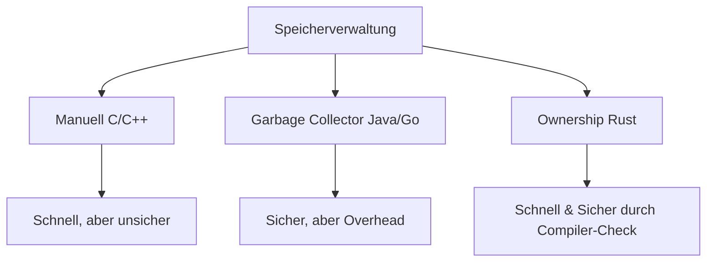

# Kapitel 17: Speicherverwaltung und das Ownership-System in Rust

Jedes laufende Programm benötigt Arbeitsspeicher (RAM), um temporäre Daten zu speichern. Da dieser Speicher begrenzt ist, muss er nach der Nutzung wieder freigegeben werden (Deallokation). Wie eine Programmiersprache diese Aufgabe bewältigt, unterscheidet sich fundamental. Rust nutzt hierfür ein einzigartiges Konzept namens **Ownership** (Eigentum).

---

## 1. Die drei Wege der Speicherverwaltung

Um zu verstehen, warum Rusts Ansatz so revolutionär ist, vergleichen wir ihn mit anderen bekannten Ansätzen:

| Ansatz / Sprache | Wie funktioniert es? | Vorteil | Nachteil |
| :--- | :--- | :--- | :--- |
| **Manuell**<br>(C, C++) | Der Entwickler muss Speicher von Hand anfordern (`malloc`) und explizit wieder freigeben (`free`). | Extrem schnell und effizient, da kein Overhead im Hintergrund läuft. | Sehr fehleranfällig. Vergisst man die Freigabe, läuft der Speicher voll (Memory Leak). Gibt man ihn doppelt frei, stürzt das Programm ab (Double Free). |
| **Garbage Collector**<br>(Java, Python, Go) | Ein im Hintergrund laufendes Programm sucht automatisch nach ungenutzten Daten und räumt sie auf. | Sehr sicher und komfortabel für Entwickler, da man sich nicht um den Speicher kümmern muss. | Kostet Performance. Der Garbage Collector verbraucht CPU-Leistung und kann das Programm für kurze Momente unvorhersehbar stoppen ("GC Pauses"). |
| **Ownership**<br>(Rust) | Der Compiler prüft den Code anhand strenger Regeln beim Übersetzen. Passt alles, fügt er die Speicherfreigabe exakt dort ein, wo die Daten nicht mehr benötigt werden. | Das Beste aus beiden Welten: So schnell und ressourceneffizient wie C, aber so sicher wie Python. | Steile Lernkurve. Der Compiler ist sehr streng und zwingt den Entwickler, Speicherwege genau zu planen. |

### Die drei goldenen Regeln des Ownerships
Das Ownership-System von Rust basiert auf drei einfachen, aber strikten Regeln:
1. **Jeder Wert in Rust hat einen Besitzer** (meistens eine Variable).
2. **Es kann immer nur einen Besitzer gleichzeitig geben.**
3. **Wenn der Besitzer den Gültigkeitsbereich (Scope) verlässt, wird der Wert automatisch gelöscht.**

> [!TIP]
> **Die Haus-Analogie:**
> Stell dir vor, du besitzt ein Haus. Du trägst die Verantwortung dafür. Du kannst das Haus an jemand anderen verkaufen (Besitzerwechsel/Move). Das Haus gehört jedoch niemals zwei Personen gleichzeitig auf dieselbe Weise. Wenn niemand mehr das Haus besitzt oder bewohnt, wird es sofort abgerissen (freigegeben), um Platz zu sparen.

Auch zusammengesetzte Datentypen wie Arrays oder Tupel funktionieren hierarchisch: Eine Variable besitzt das Array, und das Array wiederum besitzt die darin liegenden Werte.



---

## 2. Stack vs. Heap: Wo liegen deine Daten?

Wenn ein Rust-Programm läuft, nutzt es zwei verschiedene Bereiche im Arbeitsspeicher. Wo Daten abgelegt werden, entscheidet über die Geschwindigkeit und Flexibilität deines Programms.

### 1. Der Stack (Der Stapel)
*   **Wie er funktioniert:** Wie ein Stapel von Essenstabletts. Das neueste Element kommt oben drauf (**Push**), und das oberste Element wird als erstes heruntergenommen (**Pop**). Das Prinzip heißt **LIFO** (Last In, First Out).
*   **Die Bedingung:** Daten auf dem Stack müssen eine feste, dem Compiler im Voraus bekannte Größe haben (z. B. einfache Zahlen wie `i32`, Booleans oder fixierte Arrays).
*   **Vorteil:** Extrem schnell. Der Prozessor muss nicht nach freiem Speicher suchen, sondern greift einfach immer auf das oberste Element zu.

### 2. Der Heap (Der Haufen)
*   **Wie er funktioniert:** Wie ein riesiges Lagerhaus oder ein bewachter Parkplatz.
*   **Die Bedingung:** Für dynamische Daten, deren Größe sich zur Laufzeit verändern kann oder vorab unbekannt ist (z. B. Usereingaben, wachsende Listen).
*   **Der Ablauf:** Der Speicher-Manager (Allocator) sucht einen freien Platz auf dem Heap, legt die Daten dort ab und gibt eine Speicheradresse (Referenz/Zeiger) zurück.
*   **Der Trick:** Die eigentlichen Daten liegen auf dem Heap. Die kleine, feste Speicheradresse (der Zeiger) wird auf dem Stack abgelegt (wie ein Parkticket mit der Parkplatznummer).
*   **Nachteil:** Langsamer. Das Suchen nach freiem Speicherplatz beim Schreiben (Allokation) und das Verfolgen des Zeigers beim Lesen (Dereferenzierung) kosten Zeit.

### Stack und Heap im direkten Vergleich

| Eigenschaft | Stack (Stapel) | Heap (Haufen) |
| :--- | :--- | :--- |
| **Datengröße** | Fest / Bekannt beim Kompilieren | Dynamisch / Flexibel zur Laufzeit |
| **Geschwindigkeit** | Extrem schnell | Langsamer (Such- und Zugriffszeiten) |
| **Metapher** | Tellerstapel | Parkplatz mit Parkticket |
| **Zugriff** | LIFO (Last In, First Out) | Über Speicheradressen (Pointer) |
| **Rust-Beispiele** | `i32`, `f64`, `bool`, `char`, Tupel (mit Stack-Typen) | `String`, `Vec` (Vektoren), Dateien |

> [!IMPORTANT]
> **Warum ist das für Rust wichtig?**
> Das Ownership-System existiert hauptsächlich, um Heap-Daten sicher zu verwalten. Da Heap-Daten dynamisch groß sind, müssen sie exakt in dem Moment gelöscht werden, in dem ihre Stack-Variable (das "Parkticket") ungültig wird. So wird verhindert, dass der Heap mit Datenmüll vollgestellt wird.

---

## 3. Scopes, Blöcke und das automatische Löschen

In Rust steuern geschweifte Klammern `{ }` die Lebensdauer von Variablen. Dieser Gültigkeitsbereich wird als **Scope** bezeichnet.

### Verschachtelte Scopes
Sobald der Programmcode die schließende Klammer `}` erreicht, verlässt die Variable ihren Scope. In exakt diesem Moment wird ihr Wert automatisch aus dem Speicher gelöscht.

```rust
fn main() { // <-- Scope A startet
    let age = 33; // 'age' wird auf dem Stack angelegt

    { // <-- Scope B startet (innerer Block)
        let is_handsome = true; // 'is_handsome' wird auf dem Stack angelegt
        println!("Innerhalb: {}", is_handsome);
    } // <-- Scope B endet! 'is_handsome' wird SOFORT gelöscht!

    // println!("{}", is_handsome); // ❌ FEHLER! Variable existiert nicht mehr.
    println!("Außerhalb: {}", age); // ✅ Funktioniert, 'age' lebt noch.
} // <-- Scope A endet! 'age' wird gelöscht!
```

### Die Lösch-Reihenfolge (LIFO)
Werden mehrere Variablen im selben Scope erstellt, räumt Rust sie am Ende in umgekehrter Reihenfolge ihrer Erstellung auf:
1. Zuletzt erstellte Variable $\rightarrow$ wird als Erstes gelöscht.
2. Zuerst erstellte Variable $\rightarrow$ wird als Letztes gelöscht.

---

## 4. Der Copy-Trait: Automatisches Duplizieren auf dem Stack

In Rust ist ein **Trait** wie eine Schnittstelle oder ein Vertrag: Er garantiert, dass ein Datentyp ein bestimmtes Verhalten beherrscht. Der **Copy-Trait** garantiert, dass ein Typ blitzschnell und automatisch im Speicher kopiert werden kann.

*   **Wer hat ihn?** Alle einfachen Datentypen mit fester Größe, die komplett auf dem Stack liegen (z. B. Zahlen wie `i32`, `f64`, sowie `bool` und `char`).
*   **Was passiert bei einer Zuweisung?** Wenn du den Wert einer Stack-Variablen einer neuen Variablen zuweist, wird der Wert im Speicher dupliziert. Beide Variablen sind danach unabhängig voneinander gültig.

```rust
fn main() {
    let time = 2026; // i32 liegt auf dem Stack
    let year = time; // Rust erstellt automatisch eine vollständige Kopie!

    // Beide Variablen sind unabhängig und voll funktionsfähig:
    println!("Time: {}, Year: {}", time, year); 
} // Am Ende werden beide Variablen unabhängig voneinander gelöscht.
```

Weil Stack-Daten winzig sind und eine feste Größe haben, kostet das Kopieren den Prozessor fast keinen Aufwand. Daher bleibt die ursprüngliche Variable `time` problemlos weiter nutzbar.

---

## 5. Die zwei String-Typen in Rust

Rust unterscheidet strikt zwischen Text, der fest im Programmcode eingebrannt ist, und Text, der zur Laufzeit dynamisch wachsen oder schrumpfen kann.

### 1. Das String-Literal: `&str`
*   **Was es ist:** Text direkt in doppelten Anführungszeichen: `let pasta = "pasta";`.
*   **Wo er liegt:** Weder auf dem Stack noch auf dem Heap. Er ist fest in die fertige ausführbare Programmdatei (Binärdatei) eingebettet.
*   **Eigenschaft:** Unveränderlich und starr. Du kannst nachträglich keine Zeichen anhängen oder ändern.

### 2. Der dynamische String: `String`
*   **Was es ist:** Ein flexibler, veränderbarer Text-Typ.
*   **Wo er liegt:** Die eigentlichen Textdaten liegen auf dem Heap, da ihre Größe flexibel ist.
*   **Ownership:** Die Variable auf dem Stack besitzt die Daten auf dem Heap. Verlässt die Variable ihren Scope, wird der Heap-Speicher automatisch freigegeben.

### Wie erstellt man einen `String` auf dem Heap?
Es gibt zwei gängige Wege, um einen solchen String über den Namensraum `String` zu erstellen:

```rust
fn main() {
    // Weg 1: Erstellt einen komplett leeren String
    let mut text = String::new(); 
    
    // Weg 2: Wandelt ein starreres Literal (&str) in einen Heap-String um
    let candy = String::from("KitKat"); 
} // <-- Hier werden 'candy' und 'text' ungültig und ihr Heap-Speicher freigegeben!
```

> [!NOTE]
> Die zwei Doppelpunkte `::` bedeuten: "Suche im Namensraum von `String` nach der zugehörigen Funktion (`new` bzw. `from`)".

### &str vs. String im Überblick

| Merkmal | `&str` (String-Literal) | `String` (Heap-String) |
| :--- | :--- | :--- |
| **Größe** | Fest / Unveränderlich | Dynamisch / Veränderbar |
| **Speicherort** | Fest in der Binärdatei | Auf dem Heap |
| **Erstellung** | `"Text in Anführungszeichen"` | `String::new()` oder `String::from(...)` |
| **Anwendung** | Feste Texte, Fehlermeldungen | Benutzereingaben, Laden von Dateien |

---

## 6. Strings verändern: Was passiert auf dem Heap?

Um einen `String` auf dem Heap zu manipulieren, muss die Variable mit `mut` als veränderbar deklariert werden. Mit der Methode `push_str` kannst du Text anhängen.

### Das Innenleben eines Strings auf dem Stack
Auf dem Stack liegen für jeden Heap-String immer exakt drei Werte:
1.  **Pointer (Verweis):** Die Speicheradresse, an der der Text auf dem Heap beginnt.
2.  **Len (Länge):** Wie viele Bytes der Text aktuell verbraucht.
3.  **Capacity (Kapazität):** Wie viel Platz der Speicher-Manager auf dem Heap für diesen String insgesamt reserviert hat.

```
Stack (Variable: text)                Heap
┌──────────┬──────────────┐          ┌───────────────────────┐
│ Pointer  │ 0x01a3f5f8 ──┼─────────►│ H │ a │ l │ l │ o │   │
├──────────┼──────────────┤          └───────────────────────┘
│ Len      │ 5            │
├──────────┼──────────────┤
│ Capacity │ 5            │
└──────────┴──────────────┘
```

### Was passiert beim Anhängen (`push_str`)?
```rust
fn main() {
    let mut name = String::from("Boris"); // Len: 5, Capacity: 5
    name.push_str(" Pasker");             // Text anhängen
}
```

Dabei entscheidet Rust im Hintergrund zwischen zwei Szenarien:
*   **Szenario A (Genug Platz):** Die neuen Zeichen passen in die vorhandene `Capacity`. Rust schreibt den Text einfach hinten an. `Len` erhöht sich, `Pointer` und `Capacity` bleiben gleich. (Sehr schnell).
*   **Szenario B (Zu wenig Platz - Reallokation):** Der Text überschreitet die `Capacity`. Rust sucht einen neuen, größeren Platz auf dem Heap, kopiert den alten Text dorthin, hängt den neuen Text an und gibt den alten Heap-Platz frei. `Pointer`, `Len` und `Capacity` auf dem Stack werden entsprechend aktualisiert.

---

## 7. Move-Semantik: Eigentumswechsel bei Heap-Daten

Wenn Daten einer neuen Variablen zugewiesen werden, unterscheidet Rust streng zwischen Stack und Heap:

1.  **Stack-Daten** (z. B. `i32`): Werden kopiert (`Copy`-Trait). Die Originalvariable bleibt gültig.
2.  **Heap-Daten** (z. B. `String`): Da das Kopieren von Heap-Daten teuer ist, kopiert Rust bei einer Zuweisung nur die drei Werte auf dem Stack (Pointer, Len, Capacity). Um zu verhindern, dass am Ende beide Variablen versuchen, denselben Heap-Speicher freizugeben (was zum fatalen **Double-Free-Fehler** führen würde), erklärt Rust die ursprüngliche Variable sofort für ungültig. Das Eigentum zieht um (**Move**).

```rust
fn main() {
    let person = String::from("Boris");
    let genius = person; // Eigentum zieht um (Move) von 'person' nach 'genius'

    // println!("{}", person); // ❌ COMPILER-FEHLER: 'person' ist nicht mehr gültig!
    println!("{}", genius);    // ✅ Erlaubt: 'genius' ist der neue Besitzer.
}
```

### Visualisierung des Moves

```
VOR DEM MOVE:
person (Stack) ─────────► [ "Boris" ] (Heap)

NACH DEM MOVE:
person (Ungültig!)
genius (Stack) ─────────► [ "Boris" ] (Heap)
```

Durch diese Move-Semantik stellt Rust sicher, dass es immer genau **einen** aktiven Besitzer für jeden Speicherblock auf dem Heap gibt.

---

## 8. Die Drop-Funktion: Automatisches und manuelles Löschen

### 1. Das automatische `drop` (Der Standard)
Sobald eine Variable ihren Scope verlässt (`}`), ruft Rust im Hintergrund automatisch die Funktion `drop` auf. Diese gibt den Heap-Speicher der Variable frei.

```rust
{
    let person = String::from("Boris"); // Heap-Speicher allokiert
} // <-- Scope-Ende! Rust ruft automatisch drop(person) auf. Der Heap-Speicher ist frei.
```

### 2. Das manuelle `drop` (Vorzeitiges Löschen)
Manchmal möchtest du Speicher oder Ressourcen (wie geöffnete Dateien) vor dem Ende eines Scopes freigeben. Hierzu kannst du die `drop`-Funktion manuell aufrufen:

```rust
fn main() {
    let person = String::from("Boris");

    drop(person); // Heap-Speicher wird SOFORT freigegeben.

    // Jede weitere Nutzung der Variable führt zu einem Compiler-Fehler:
    // println!("{}", person); // ❌ FEHLER!
}
```

---

## 9. Der `.clone()`-Befehl: Tiefe Kopien erzwingen

Wenn du Heap-Daten explizit duplizieren möchtest, anstatt sie zu verschieben (moven), musst du das mit der Methode `.clone()` tun. Dabei wird der gesamte Inhalt auf dem Heap dupliziert.

```rust
fn main() {
    let person = String::from("Boris");
    let genius = person.clone(); // Kopiert die tatsächlichen Daten auf dem Heap!

    println!("{}", person); // ✅ Erlaubt! 'person' behält ihr Eigentum.
    println!("{}", genius); // ✅ Erlaubt! 'genius' besitzt die neue Kopie.
}
```

### Zuweisungen und ihre Kosten im Vergleich

| Typ | Zuweisung (`let b = a;`) | Kosten |
| :--- | :--- | :--- |
| **Stack-Typen** (z. B. `i32`) | Automatische Kopie (`Copy`) | Extrem schnell und günstig |
| **Heap-Typen** (z. B. `String`) | **Move** (Besitz zieht um, Altwert ungültig) | Keine CPU-Kosten (nur Stack-Kopie) |
| **Heap mit `.clone()`** | **Deep Copy** (Tiefe Kopie auf dem Heap) | Teuer (verdoppelt den Heap-Speicher) |

> [!TIP]
> **Goldene Regel für Anfänger:**
> Keine Angst vor `.clone()`! Es ist am Anfang völlig in Ordnung, `.clone()` zu nutzen, um den Compiler glücklich zu machen. Später lernst du mit Referenzen, wie du diese Kopien vermeidest. Hauptsache, dein Code läuft erst einmal!

---

## 10. Exkurs: Referenzen, der Dereferenzierungsoperator `*` und das Ausleihen

Um Daten nicht ständig klonen oder verschieben zu müssen, nutzt man **Referenzen** (`&`). Eine Referenz speichert lediglich die Speicheradresse eines Wertes (ein Verweis).

### Der Dereferenzierungsoperator `*`
Der Dereferenzierungsoperator `*` ist das Gegenstück zur Referenz `&`. Er folgt der Adresse und holt den eigentlichen Wert hervor.

> [!NOTE]
> **Die Zettel-Analogie:**
> Eine Referenz `&` ist wie ein Zettel, auf dem eine Hausadresse steht. Der Dereferenzierungsoperator `*` ist der Postbote, der physisch zu diesem Haus geht, um nachzusehen, wer dort wohnt.

```rust
fn main() {
    let wert = 2;
    let mein_verweis = &wert; // Referenz auf den Wert 2

    println!("{}", *mein_verweis); // ✅ Gibt 2 aus (folgt dem Zeiger)
}
```

### Automatische Dereferenzierung
In der Praxis musst du das `*` selten schreiben. Rust dereferenziert Referenzen bei Operationen wie `println!` oder Methodenaufrufen oft automatisch im Hintergrund, da es weiß, dass du den eigentlichen Inhalt und nicht die Speicheradresse sehen möchtest.

### Referenzen kopieren sich selbst
Da eine Referenz (`&`) nur eine kleine Adresse auf dem Stack ist, implementiert sie das `Copy`-Trait. Weist du eine Referenz einer neuen Variable zu, wird nur die Adresse kopiert, und das Eigentum der Daten bleibt unberührt.

```rust
fn main() {
    let ice_cream = "Cookies and Cream"; // Typ &str (eine Referenz)
    let dessert = ice_cream;             // Die Adresse wird kopiert

    // Beide Variablen zeigen auf denselben schreibgeschützten Text:
    println!("{}", ice_cream); 
    println!("{}", dessert);   
}
```

---

## 11. Die vier Text-Varianten im Vergleich (Deep Dive)

Für Anfänger ist die Unterscheidung der String-Typen oft verwirrend. Hier ist eine Übersicht der vier Varianten:

1.  **`String` (Heap-String):** Dynamischer, veränderbarer Text auf dem Heap. Besitzt die Daten.
2.  **`&String` (Referenz auf Heap-String):** Ein Zeiger auf einen `String`. Verhindert das Kopieren und den Move.
3.  **`str` (Binär-Daten):** Der rohe, unsortierte Text im Speicher. Da seine Größe vorab unbekannt ist, arbeitet man in Rust nie direkt damit.
4.  **`&str` (String-Slice):** Ein Zeiger auf einen schreibgeschützten Textbereich (z. B. auf Literale in der Binärdatei oder Ausschnitte eines `String`).

> [!IMPORTANT]
> **Entscheidungshilfe für die Praxis:**
> *   Sollen sich die Daten ändern? $\rightarrow$ Nutze **`String`**.
> *   Sind es feste Texte im Code? $\rightarrow$ Nutze **`&str`**.
> *   Als Funktionsparameter? $\rightarrow$ Nutze fast immer **`&str`**. Das macht deine Funktion maximal flexibel, da sie sowohl `&str` als auch Referenzen auf `String` (`&String`) akzeptieren kann.

---

## 12. Ownership bei Funktionen (Parameterübergabe)

Für Funktionen gelten dieselben Regeln wie bei Zuweisungen. Die Übergabe an eine Funktion verhält sich wie ein Eigentumsübergang.

### Fall 1: Stack-Daten (i32, f64, bool) $\rightarrow$ Copy
Stack-Daten werden beim Funktionsaufruf automatisch kopiert. Die Originalvariable in `main` bleibt gültig.

```rust
fn print_integer(value: i32) {
    println!("Wert in Funktion: {}", value);
} // <-- 'value' verlässt den Scope und wird gelöscht.

fn main() {
    let apples = 6;
    print_integer(apples); // Übergibt eine Kopie von 'apples'
    println!("Äpfel in main: {}", apples); // ✅ Erlaubt!
}
```

### Fall 2: Heap-Daten (String) $\rightarrow$ Move
Da Heap-Kopien teuer sind, wird das Eigentum an die Funktion übergeben. Die Originalvariable in `main` wird ungültig. Die Funktion "frisst" die Variable auf und löscht sie am Ende ihres Scopes.

```rust
fn print_string(value: String) {
    println!("Wert in Funktion: {}", value);
} // <-- 'value' verlässt den Scope. Heap-Speicher wird per 'drop' gelöscht!

fn main() {
    let oranges = String::from("Orangen");
    print_string(oranges); // Move! 'value' übernimmt das Eigentum.
    
    // println!("{}", oranges); // ❌ COMPILER-FEHLER: Daten wurden gelöscht!
}
```

---

## 13. Veränderbare Parameter in Funktionen (`mut`)

Parameter in Funktionen sind standardmäßig unveränderlich. Soll eine Funktion den übergebenen Wert verändern können, muss der Parameter mit `mut` markiert werden.

Dabei ist es egal, ob die Variable beim Aufrufer veränderlich war oder nicht. Durch den Move übernimmt die Funktion das alleinige Eigentum und bestimmt die Veränderbarkeit neu.

```rust
fn add_fries(mut meal: String) { // 'mut' erlaubt der Funktion, 'meal' zu verändern
    meal.push_str(" und Pommes");
    println!("Menü: {}", meal); // Ausgabe: "Burger und Pommes"
}

fn main() {
    let burger = String::from("Burger"); // Unveränderlich in main!
    add_fries(burger); // Move! 'meal' wird in der Funktion veränderbar.
}
```

---

## 14. Eigentum zurückgeben (Return)

Möchte die aufrufende Funktion den Wert nach dem Funktionsaufruf weiterverwenden, kann die aufgerufene Funktion das Eigentum per `return` (bzw. als Rückgabewert) wieder zurückgeben.

```rust
fn add_fries(mut meal: String) -> String {
    meal.push_str(" und Pommes");
    meal // Gibt das Eigentum am String zurück (kein Semikolon!)
}

fn main() {
    let burger = String::from("Burger");
    
    // burger zieht in die Funktion um; das Ergebnis wird in 'mein_menue' gespeichert:
    let mein_menue = add_fries(burger); 
    
    println!("{}", mein_menue); // ✅ Erlaubt: "Burger und Pommes"
    // println!("{}", burger);    // ❌ Verboten: 'burger' ist ungültig.
}
```

> [!TIP]
> **Variable überschreiben (Shadowing):**
> Du kannst den zurückgegebenen Wert auch direkt wieder in der ursprünglichen Variable speichern, um den Namen wiederzuverwenden:
> `let burger = add_fries(burger);`

---

## 15. Das Problem mit dem "Eigentums-Ping-Pong"

Wenn du Daten ständig hin- und hergeben musst, um den Besitz nicht zu verlieren, führt das schnell zu unübersichtlichem Code.

```rust
fn add_flour(mut meal: String) -> String {
    meal.push_str("Mehl, ");
    meal
}

fn add_sugar(mut meal: String) -> String {
    meal.push_str("Zucker");
    meal
}

fn main() {
    let mut current_meal = String::new();
    
    // Umständliches Ping-Pong, um das Eigentum zu behalten:
    current_meal = add_flour(current_meal); 
    current_meal = add_sugar(current_meal); 
    
    println!("Rezept: {}", current_meal); // Ausgabe: "Mehl, Zucker"
}
```

### Warum dieses Vorgehen nicht gut skalierbar ist:
1.  **Blockade bei Lese-Funktionen:** Selbst Funktionen, die Daten nur ausgeben (`println!`) und nicht verändern wollen, müssten die Daten zurückgeben, um sie nicht zu löschen.
2.  **Mühsame Rückgaben:** Müsste eine Funktion mehrere Strings verarbeiten, müsste sie am Ende alle Werte umständlich als Tupel (z. B. `return (str1, str2, str3)`) zurückgeben.

Im echten Leben gibst du dein Rezeptbuch auch nicht dauerhaft ab, wenn jemand ein Rezept lesen will – du leihst es ihm lediglich aus. 

Genau dieses Problem löst Rust im nächsten Kapitel mit dem Konzept des **Borrowings** (Ausleihen) über Referenzen (`&`).

---

## 💡 Zusammenfassung

*   **Ownership** sorgt für speichersicheren Code zur Compile-Zeit, ohne Laufzeit-Overhead.
*   **Stack** speichert Daten mit fester Größe extrem schnell. **Heap** speichert dynamisch wachsende Daten über Zeiger (Pointer).
*   **Move** verschiebt das Eigentum an Heap-Daten bei Zuweisungen oder Funktionsaufrufen, um Double-Free-Fehler zu vermeiden.
*   **Copy** dupliziert Stack-Daten automatisch bei der Zuweisung.
*   **`.clone()`** erzwingt eine tiefe, manuelle Kopie von Heap-Daten.
*   **Scopes `{ }`** begrenzen die Lebensdauer von Variablen. Beim Verlassen wird automatisch `drop` aufgerufen.
