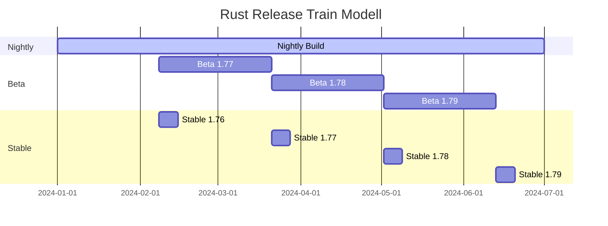
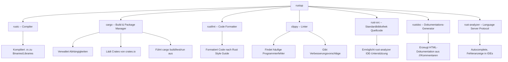

# Kapitel 2: Installation & Systemkonfiguration

> [!NOTE]
> In diesem Kapitel installieren Sie Rust vollständig auf Ihrem System. Sie lernen `rustup` als zentrales Verwaltungswerkzeug kennen, verstehen die verschiedenen Release-Kanäle und konfigurieren alle notwendigen Umgebungsvariablen. Nach Abschluss dieses Kapitels haben Sie eine voll funktionsfähige Rust-Entwicklungsumgebung.

---

## Schritt 1: Lernziele & Lernplan

### Lernziele nach der Bloom-Taxonomie

Nach dem Durcharbeiten dieses Kapitels werden Sie in der Lage sein:

1. **Verstehen (Bloom-Stufe 2):** Sie können erklären, was `rustup` ist, warum es gegenüber direkten Betriebssystem-Paketen bevorzugt werden sollte, und wie die drei Release-Kanäle Stable, Beta und Nightly sich unterscheiden.
2. **Anwenden (Bloom-Stufe 3):** Sie können Rust auf Linux, macOS und Windows installieren, zwischen Toolchain-Versionen wechseln, Komponenten hinzufügen und entfernen sowie Cross-Compilation-Targets einrichten.
3. **Analysieren & Bewerten (Bloom-Stufen 4–5):** Sie können Probleme mit der PATH-Konfiguration diagnostizieren, zwischen `CARGO_HOME` und `RUSTUP_HOME` unterscheiden und beurteilen, welcher Release-Kanal für verschiedene Projekttypen geeignet ist.

### Lernplan

| Phase | Tätigkeit | Zeit |
|---|---|---|
| Lesen | Kapitel vollständig lesen | 50 Min. |
| Praxis | Rust auf eigenem System installieren und konfigurieren | 30 Min. |
| Vertiefung | Alle Tutorial-Schritte am eigenen System nachvollziehen | 20 Min. |
| Übungen | Drei Übungsaufgaben bearbeiten | 20 Min. |
| Rückblick | Cheat Sheet ansehen, Active Recall durchführen | 10 Min. |

---

## Schritt 2: Die Definition

### Was ist rustup?

`rustup` ist das **offizielle Installations- und Versions-Verwaltungswerkzeug** für die Rust-Programmiersprache. Es ist das Pendant zu `nvm` (Node Version Manager) für Node.js oder `pyenv` für Python.

`rustup` verwaltet:

- **Rust-Toolchains:** Verschiedene Versionen des Rust-Compilers (`rustc`), des Paketmanagers (`cargo`) und der Standardbibliothek
- **Komponenten:** Optionale Werkzeuge wie `rustfmt` (Formatter), `clippy` (Linter), `rust-docs` (Offline-Dokumentation)
- **Targets:** Cross-Compilation-Ziele (z. B. für ARM-Mikrocontroller oder WebAssembly)
- **Release-Kanäle:** Stable, Beta und Nightly

> [!IMPORTANT]
> Installieren Sie Rust **immer** über `rustup`, nicht über den Paketmanager Ihres Betriebssystems (apt, brew, choco). Betriebssystem-Pakete sind oft veraltet und bieten keine Toolchain-Verwaltung.

### Was ist eine Toolchain?

Eine "Toolchain" in Rust ist die Kombination aus:

- `rustc` – der Rust-Compiler
- `cargo` – der Build-Manager und Paketmanager
- `rustup` – der Toolchain-Manager selbst
- `rustdoc` – der Dokumentations-Generator
- `rust-std` – die Rust-Standardbibliothek

Eine Toolchain ist versioniert (z. B. `1.78.0`) und kann für verschiedene Zielplattformen kompilieren.

---

## Schritt 3: Das Problem & Die Motivation

### Warum braucht Rust einen speziellen Versions-Manager?

Rust hat einen **sehr schnellen Release-Zyklus**: Alle **sechs Wochen** erscheint eine neue stabile Version. Das ist deutlich häufiger als bei anderen Sprachen (Python: unregelmäßig, Java: alle sechs Monate für LTS).

Ohne `rustup` würden sich folgende Probleme ergeben:

#### Problem 1: Veraltete Betriebssystem-Pakete

```bash
# Ubuntu/Debian: rustc in apt ist oft Monate veraltet
$ apt show rustc
Package: rustc
Version: 1.75.0ubuntu1  # Aktuell: 1.79.0

# Das fehlende: cargo, rust-std, rustfmt, clippy
```

Viele moderne Rust-Crates (Bibliotheken) erfordern eine aktuelle Compiler-Version. Mit dem apt-Paket würden Sie ständig auf Kompatibilitätsprobleme stoßen.

#### Problem 2: Mehrere Projekte, verschiedene Toolchains

In einer professionellen Umgebung kann es vorkommen, dass:
- Projekt A eine minimale Rust-Version von `1.70` verwendet (MSRV)
- Projekt B experimentelle Nightly-Features benötigt
- Sie auf mehrere Zielplattformen kompilieren (Linux x86_64, Windows, ARM)

`rustup` löst all das elegant mit einer zentralen Verwaltungsoberfläche.

#### Problem 3: Cross-Compilation ohne Komplexität

Embedded-Entwicklung, WebAssembly und mobile Entwicklung erfordern Cross-Compilation. Ohne `rustup` müssten Sie manuell verschiedene Standardbibliotheken installieren und Linker konfigurieren. `rustup` macht das mit einem einzigen Befehl möglich.

### Die drei Release-Kanäle

Rust folgt einem **Train Release Model**, das ursprünglich von Firefox übernommen wurde:

```
Nightly ──────────────────────────────────────────→ (täglich, neueste Features)
   │ (alle 6 Wochen)
   ↓
 Beta  ──────────────────────────────────────────→ (6 Wochen Stabilisierung)
   │ (nach weiteren 6 Wochen)
   ↓
Stable ──────────────────────────────────────────→ (produktionsreif)
```

| Kanal | Erscheinungsrhythmus | Stabilität | Typische Nutzung |
|---|---|---|---|
| **Stable** | Alle 6 Wochen | Vollständig stabil, keine Breaking Changes | Produktion, alle normalen Projekte |
| **Beta** | Alle 6 Wochen (nach Nightly) | Nahezu stabil, Kandidat für Stable | Frühtester, CI-Kompatibilitätstest |
| **Nightly** | Täglich | Experimentell, kann sich täglich ändern | Feature-Entwicklung, Benchmarking, Proc-Macros |

---

## Schritt 4: Der naive Versuch – Häufige Installationsfehler

### Fehler 1: Installation über apt/brew ohne rustup

Ein häufiger Anfängerfehler ist die Installation über den Betriebssystem-Paketmanager:

```bash
# FALSCH: Nicht empfohlen!
$ sudo apt install rustc cargo

# Problem: cargo und rustc haben möglicherweise unterschiedliche Versionen
$ rustc --version
rustc 1.75.0
$ cargo --version
cargo 1.74.0  # Versionsmismatch!
```

Mismatch zwischen `rustc` und `cargo` kann zu seltsamen Build-Fehlern führen.

### Fehler 2: PATH nicht korrekt konfiguriert

Nach der Installation mit `rustup` erscheint beim Aufruf von `cargo` oder `rustc`:

```bash
$ rustc --version
bash: rustc: command not found

$ cargo --version
zsh: command not found: cargo
```

**Ursache:** `rustup` installiert Binaries nach `~/.cargo/bin`, aber dieses Verzeichnis ist nicht im `PATH`.

### Fehler 3: Nightly ohne Bedarf verwenden

```bash
# Viele Tutorials empfehlen fälschlicherweise Nightly für Anfänger
$ rustup default nightly

# Dann bricht der Build nach einem Update, weil sich Nightly-APIs ändern
$ cargo build
error[E0658]: use of unstable library feature 'try_reserve'
```

Nightly-Features können von einem Tag auf den nächsten umbenannt oder entfernt werden.

### Fehler 4: Fehlende Systemabhängigkeiten unter Linux

```bash
$ curl --proto '=https' --tlsv1.2 -sSf https://sh.rustup.rs | sh

# Späterer Fehler beim ersten Build:
error: linker `cc` not found
  |
  = note: No such file or directory (os error 2)
```

**Ursache:** Der C-Linker (`cc`, `gcc`) ist nicht installiert. Rust benötigt ihn für das Linken der fertigen Binaries.

---

## Schritt 5: Die Anatomie der Fehler – Diagnose und Speicherstruktur

### 5.1 PATH-Problem – Diagnose

```
Installation durch rustup:

~/ (Home-Verzeichnis)
├── .cargo/
│   ├── bin/           ← Hier landen rustc, cargo, rustup, etc.
│   │   ├── rustc
│   │   ├── cargo
│   │   ├── rustfmt
│   │   ├── clippy-driver
│   │   └── ...
│   └── registry/      ← Heruntergeladene Crate-Metadaten
└── .rustup/
    ├── toolchains/    ← Installierte Toolchain-Versionen
    │   ├── stable-x86_64-unknown-linux-gnu/
    │   └── nightly-x86_64-unknown-linux-gnu/
    └── update-hashes/

PROBLEM: ~/.cargo/bin ist nicht in $PATH!

PATH = /usr/local/bin:/usr/bin:/bin   ← ~/.cargo/bin fehlt!
```

Wenn das Terminal `rustc not found` meldet, fehlt `~/.cargo/bin` im PATH.

### 5.2 Rustup-Shims – Wie rustup Toolchains verwaltet

`rustup` verwendet ein cleveres Shim-System:

```
Aufruf: cargo build

$PATH sucht cargo in ~/.cargo/bin/cargo
           ↓
  Das ist ein rustup-Shim (nicht das echte cargo)
           ↓
  Shim liest rust-toolchain.toml im Projektverzeichnis
           ↓
  Findet: channel = "1.78.0"
           ↓
  Ruft auf: ~/.rustup/toolchains/1.78.0-x86_64-unknown-linux-gnu/bin/cargo
           ↓
  Korrektes cargo für dieses Projekt wird ausgeführt
```

Dieses System ermöglicht projektspezifische Toolchain-Versionen ohne globale Konflikte.

### 5.3 Umgebungsvariablen – Vollständige Übersicht

```
RUSTUP_HOME (Standard: ~/.rustup)
│
├── Speichert: Toolchain-Dateien, Metadaten
├── Enthält: ~/.rustup/toolchains/, ~/.rustup/tmp/
└── Überschreiben: export RUSTUP_HOME=/opt/rust/rustup

CARGO_HOME (Standard: ~/.cargo)
│
├── Speichert: Installierte Crates (cargo install), Registry-Cache
├── Enthält: ~/.cargo/bin/, ~/.cargo/registry/
└── Überschreiben: export CARGO_HOME=/opt/rust/cargo

PATH (muss ~/.cargo/bin enthalten)
│
└── Füge hinzu: export PATH="$HOME/.cargo/bin:$PATH"
```

---

## Schritt 6: Die Lösung – Korrekte Installation

### 6.1 Installation unter Linux und macOS

```bash
# Schritt 1: System-Abhängigkeiten installieren (Linux)
# Ubuntu/Debian:
sudo apt update
sudo apt install -y build-essential curl git

# Fedora/RHEL:
sudo dnf install -y gcc curl git

# macOS (falls Xcode Command Line Tools fehlen):
xcode-select --install

# Schritt 2: rustup installieren
curl --proto '=https' --tlsv1.2 -sSf https://sh.rustup.rs | sh

# Schritt 3: Anleitung während der Installation lesen und Standardoptionen wählen
# "1) Proceed with installation (default)"

# Schritt 4: Umgebungsvariablen in aktuelle Shell laden
source "$HOME/.cargo/env"

# Schritt 5: Installation verifizieren
rustc --version    # z. B.: rustc 1.79.0 (129f3b996 2024-06-10)
cargo --version    # z. B.: cargo 1.79.0 (ffa9cf99a 2024-06-03)
rustup --version   # z. B.: rustup 1.27.1 (54dd3d00f 2024-04-24)
```

> [!TIP]
> Das Installer-Skript fügt automatisch `source "$HOME/.cargo/env"` zu Ihrer Shell-Konfiguration (`.bashrc`, `.zshrc`, etc.) hinzu. Neue Terminals werden automatisch korrekt konfiguriert.

### 6.2 Installation unter Windows

Unter Windows gibt es zwei Optionen:

**Option 1: rustup-init.exe (empfohlen)**

1. Laden Sie [rustup-init.exe](https://rustup.rs/) herunter
2. Führen Sie es aus und folgen Sie den Anweisungen
3. Starten Sie eine neue PowerShell oder Command Prompt
4. Verifizieren Sie: `rustc --version`

**Voraussetzung:** Microsoft C++ Build Tools oder Visual Studio mit "Desktop development with C++" Workload.

**Option 2: WSL2 (für Entwickler empfohlen)**

```powershell
# WSL2 aktivieren (in PowerShell als Administrator)
wsl --install
wsl --set-default-version 2

# Dann in WSL2-Terminal:
curl --proto '=https' --tlsv1.2 -sSf https://sh.rustup.rs | sh
```

WSL2 bietet eine vollständige Linux-Umgebung und ist besonders für Rust-Entwicklung empfehlenswert.

### 6.3 PATH korrekt konfigurieren (manuell, falls nötig)

Wenn `rustc` nach der Installation nicht gefunden wird:

```bash
# Bash (~/.bashrc oder ~/.bash_profile):
echo 'export PATH="$HOME/.cargo/bin:$PATH"' >> ~/.bashrc
source ~/.bashrc

# Zsh (~/.zshrc):
echo 'export PATH="$HOME/.cargo/bin:$PATH"' >> ~/.zshrc
source ~/.zshrc

# Fish (~/.config/fish/config.fish):
fish_add_path $HOME/.cargo/bin

# Verifizieren:
echo $PATH | tr ':' '\n' | grep cargo
# Ausgabe: /home/IhrName/.cargo/bin
```

### 6.4 Umgebungsvariablen in andere Verzeichnisse umleiten

In Unternehmensumgebungen oder auf geteilten Servern möchten Sie möglicherweise die Standard-Verzeichnisse ändern:

```bash
# In ~/.bashrc oder ~/.zshrc einfügen:

# Rustup in ein zentrales Verzeichnis legen
export RUSTUP_HOME="/opt/rust/rustup"

# Cargo-Dateien trennen
export CARGO_HOME="/opt/rust/cargo"

# Binaries zum PATH hinzufügen
export PATH="$CARGO_HOME/bin:$PATH"

# Hinweis: Diese Variablen müssen VOR der rustup-Installation gesetzt werden,
# oder rustup muss mit den Variablen gesetzt neu installiert werden.
```

---

## Schritt 7: Kleines Tutorial – rustup meistern

### Schritt 7.1: Toolchains verwalten

```bash
# Installierte Toolchains anzeigen
rustup toolchain list
# Ausgabe:
# stable-x86_64-unknown-linux-gnu (default)
# nightly-x86_64-unknown-linux-gnu

# Eine bestimmte Version installieren
rustup toolchain install 1.78.0

# Nightly installieren
rustup toolchain install nightly

# Standard-Toolchain ändern
rustup default stable    # Für normale Entwicklung
rustup default nightly   # Nur wenn Nightly-Features benötigt

# Eine Toolchain deinstallieren
rustup toolchain uninstall 1.78.0

# Überprüfen welche Toolchain gerade aktiv ist
rustup show
```

### Schritt 7.2: Projektspezifische Toolchains mit rust-toolchain.toml

In jedem Rust-Projekt können Sie eine Datei `rust-toolchain.toml` erstellen, die die benötigte Toolchain-Version festlegt:

```toml
# rust-toolchain.toml im Projektverzeichnis
[toolchain]
channel = "1.78.0"
components = ["rustfmt", "clippy"]
targets = ["wasm32-unknown-unknown"]
```

Wenn Sie nun in diesem Verzeichnis `cargo build` aufrufen, verwendet `rustup` automatisch die Version `1.78.0`. Das macht Projekte **reproduzierbar**: Alle Team-Mitglieder, CI-Server und Deployment-Umgebungen verwenden exakt dieselbe Toolchain.

```bash
# Test: Ins Projektverzeichnis wechseln und Version prüfen
cd /pfad/zum/projekt
rustc --version
# rustup wechselt automatisch zur Version in rust-toolchain.toml
```

### Schritt 7.3: Komponenten verwalten

`rustup` kann optionale Komponenten installieren, die nicht Teil der Standard-Toolchain sind:

```bash
# Installierte Komponenten anzeigen
rustup component list --installed

# Häufig benötigte Komponenten installieren:

# rustfmt – Code-Formatter
rustup component add rustfmt
cargo fmt  # Code formatieren

# clippy – Linter (gibt Hinweise zur Code-Qualität)
rustup component add clippy
cargo clippy  # Linting-Analyse starten

# rust-src – Quellcode der Standardbibliothek
# (Wird von rust-analyzer für bessere IDE-Integration benötigt)
rustup component add rust-src

# llvm-tools-preview – Für Coverage-Reports und Profiling
rustup component add llvm-tools-preview

# rust-docs – Offline-Dokumentation
rustup component add rust-docs

# Alle Komponenten für eine bestimmte Toolchain installieren
rustup component add rustfmt --toolchain nightly
```

### Schritt 7.4: Cross-Compilation einrichten

Cross-Compilation bedeutet: Code für eine andere Plattform oder Architektur übersetzen als die, auf der Sie entwickeln.

```bash
# Verfügbare Targets anzeigen
rustup target list

# Installierte Targets anzeigen
rustup target list --installed

# Ein Target für WebAssembly installieren
rustup target add wasm32-unknown-unknown

# Ein Target für 32-Bit ARM Embedded (kein OS)
rustup target add thumbv7em-none-eabihf

# Ein Target für Windows (von Linux aus)
rustup target add x86_64-pc-windows-gnu

# Cross-kompilieren:
cargo build --target wasm32-unknown-unknown
cargo build --target thumbv7em-none-eabihf
cargo build --target x86_64-pc-windows-gnu

# Nützliche Targets:
# wasm32-unknown-unknown      – WebAssembly im Browser
# wasm32-wasi                 – WebAssembly mit WASI (Systemschnittstellen)
# aarch64-unknown-linux-gnu   – ARM64 Linux (z. B. Raspberry Pi 4)
# thumbv6m-none-eabi          – Cortex-M0 Mikrocontroller
# thumbv7em-none-eabihf       – Cortex-M4/M7 mit FPU
# x86_64-pc-windows-gnu       – Windows (MinGW-Toolchain)
# x86_64-apple-darwin         – macOS (von Linux)
```

> [!NOTE]
> Für Cross-Compilation zu manchen Targets benötigen Sie zusätzlich einen plattformspezifischen Linker. Zum Beispiel brauchen Sie für ARM-Targets `arm-linux-gnueabihf-gcc` oder für Embedded-Targets `arm-none-eabi-gcc`.

### Schritt 7.5: Offline-Dokumentation mit rustup doc

Eine der nützlichsten, aber oft übersehenen Funktionen von `rustup` ist der Zugriff auf die gesamte Rust-Dokumentation offline:

```bash
# Die gesamte rustup-Hilfe anzeigen
rustup doc

# Das Rust-Buch (The Rust Programming Language) offline öffnen
rustup doc --book

# Die Standardbibliotheks-Referenz offline öffnen
rustup doc --std

# Spezifische Module durchsuchen
rustup doc --std std::collections::HashMap

# Die Cargo-Dokumentation öffnen
rustup doc --cargo

# Alle verfügbaren Dokumentations-Optionen anzeigen
rustup doc --help
```

> [!TIP]
> `rustup doc --book` öffnet das offizielle Rust-Buch in Ihrem Browser, vollständig offline verfügbar. Das ist besonders nützlich auf Reisen, in Flugzeugen oder in Netzwerken ohne Internet-Zugang.

---

## Schritt 8: Mentale Modelle & Deep Dive

### 8.1 Die rustup-Architektur (ASCII-Art)

```
RUSTUP-ARCHITEKTUR

Benutzer
  │
  ▼
rustup (Verwaltungsebene)
  │
  ├── Toolchain-Manager
  │     ├── stable-x86_64-unknown-linux-gnu
  │     │     ├── rustc 1.79.0
  │     │     ├── cargo 1.79.0
  │     │     ├── rustdoc
  │     │     └── rust-std (Targets: x86_64, arm, wasm, ...)
  │     │
  │     ├── nightly-x86_64-unknown-linux-gnu
  │     │     ├── rustc nightly-2024-06-15
  │     │     ├── cargo nightly
  │     │     └── rust-std
  │     │
  │     └── 1.78.0-x86_64-unknown-linux-gnu
  │           └── ...
  │
  ├── Komponenten-Manager
  │     ├── rustfmt
  │     ├── clippy
  │     ├── rust-src
  │     └── llvm-tools-preview
  │
  └── Shims in ~/.cargo/bin/
        ├── rustc    ──→ shim ──→ richtige Version
        ├── cargo    ──→ shim ──→ richtige Version
        └── rustup   ──→ echter rustup
```

### 8.2 Release-Train-Modell (Mermaid)



Jedes Feature, das in Nightly experimentell eingeführt wird, durchläuft sechs Wochen Beta-Testing, bevor es in Stable landet. So wird sichergestellt, dass die API stabil ist, bevor sie offiziell veröffentlicht wird.

### 8.3 Der Rust-Compilation-Pipeline

```
Rust-Quellcode (.rs)
        │
        ▼
   rustc (Lexer)
        │ Tokens
        ▼
   rustc (Parser)
        │ AST (Abstract Syntax Tree)
        ▼
   rustc (HIR – High-level Intermediate Representation)
        │ Type Checking, Borrow Checking
        ▼
   rustc (MIR – Mid-level Intermediate Representation)
        │ Optimierungen, Lifetime-Analyse
        ▼
   rustc (LLVM IR)
        │
        ▼
   LLVM Backend
        │ Target-spezifische Optimierungen
        ▼
   Maschinencode (.o Dateien)
        │
        ▼
   Linker (cc, lld, etc.)
        │
        ▼
   Fertige Binary oder Library
```

`cargo` orchestriert diesen Prozess für alle Dateien eines Projekts und verwaltet Abhängigkeiten.

### 8.4 Komponenten und ihre Aufgaben im Detail



### 8.5 Cross-Compilation im Detail

Cross-Compilation in Rust bedeutet:
- **Host:** Die Maschine, auf der Sie kompilieren (z. B. x86_64 Linux)
- **Target:** Die Maschine, für die Sie kompilieren (z. B. ARM Cortex-M)

```
HOST (x86_64 Linux):

rustc (x86_64 native)
  │
  ├── liest: src/main.rs
  │
  ├── verwendet: rust-std für target thumbv7em-none-eabihf
  │              (installiert via: rustup target add thumbv7em-none-eabihf)
  │
  └── ruft auf: arm-none-eabi-gcc (Cross-Linker, separat zu installieren)
        │
        └── erzeugt: firmware.elf (ARM-Binary)

TARGET (STM32 Mikrocontroller):
  └── firmware.elf wird hier ausgeführt
```

### 8.6 Nightly-Features und Feature-Flags

Nightly-Rust enthält experimentelle Features, die hinter Feature-Flags versteckt sind:

```rust
// Nur in Nightly verfügbar!
// Am Anfang der main.rs oder lib.rs:
#![feature(let_chains)]        // Experimentelles Feature
#![feature(generic_const_exprs)]  // Weiteres experimentelles Feature

fn main() {
    // let_chains: Mehrere let-Bindings in einem if
    let x: Option<i32> = Some(5);
    let y: Option<i32> = Some(10);
    
    if let Some(a) = x && let Some(b) = y {
        println!("Beide vorhanden: {} und {}", a, b);
    }
}
```

> [!WARNING]
> Nightly-Features können sich jederzeit ändern, umbenannt oder entfernt werden. Verwenden Sie sie nur in persönlichen Projekten oder wenn Sie bereit sind, Ihren Code bei jedem Nightly-Update anzupassen.

---

## Schritt 9: Drei Übungen

### Übung 1 (Leicht): Installationscheckliste

Führen Sie folgende Befehle aus und notieren Sie die Ausgaben:

```bash
# 1. rustup-Version prüfen
rustup --version

# 2. Installierte Toolchains anzeigen
rustup toolchain list

# 3. Aktive Toolchain und installierte Targets anzeigen
rustup show

# 4. Installierte Komponenten auflisten
rustup component list --installed

# 5. Aktuelle Rust-Version prüfen
rustc --version
cargo --version
```

> [!TIP]
> **Hint:** Wenn ein Befehl mit "command not found" antwortet, führen Sie `source "$HOME/.cargo/env"` aus und versuchen Sie es erneut. Falls das Problem fortbesteht, prüfen Sie Ihre PATH-Konfiguration mit `echo $PATH`.

**Selbsttest-Fragen:**
- Welche Version von rustc ist installiert?
- Welche Toolchain ist als Standard gesetzt?
- Welche Targets sind installiert?
- Welche Komponenten sind installiert?

---

### Übung 2 (Mittel): Projektspezifische Toolchain-Konfiguration

Erstellen Sie ein neues Projektverzeichnis und konfigurieren Sie eine projektspezifische Toolchain-Version:

```bash
# 1. Projektverzeichnis erstellen
mkdir ~/rust-toolchain-test
cd ~/rust-toolchain-test

# 2. Cargo-Projekt erstellen
cargo init

# 3. rust-toolchain.toml erstellen
cat > rust-toolchain.toml << 'EOF'
[toolchain]
channel = "stable"
components = ["rustfmt", "clippy"]
EOF

# 4. Prüfen welche Version aktiv ist
rustc --version

# 5. rustfmt ausführen
cargo fmt --check

# 6. clippy ausführen
cargo clippy

# 7. Offline-Dokumentation öffnen
rustup doc --std
```

**Erweiterungsaufgabe:** Ändern Sie `rust-toolchain.toml` auf `channel = "nightly"` und prüfen Sie, ob rustup automatisch die nighly-Toolchain aktiviert. Falls nicht installiert, installiert rustup sie automatisch.

> [!TIP]
> **Hint:** Wenn nightly nicht installiert ist, fragt rustup beim ersten `cargo build` oder `rustc --version` im Verzeichnis, ob Sie sie installieren möchten. Antworten Sie mit "y".

---

### Übung 3 (Schwer): Cross-Compilation-Umgebung einrichten

Richten Sie eine Cross-Compilation-Umgebung für WebAssembly ein und kompilieren Sie ein erstes WASM-Binary:

```bash
# Schritt 1: wasm32-Target installieren
rustup target add wasm32-unknown-unknown

# Schritt 2: Ein neues Projekt erstellen
cargo new --lib wasm-hello
cd wasm-hello

# Schritt 3: Cargo.toml für WASM konfigurieren
cat >> Cargo.toml << 'EOF'

[lib]
crate-type = ["cdylib"]
EOF

# Schritt 4: src/lib.rs mit einer exportierten Funktion schreiben
cat > src/lib.rs << 'EOF'
/// Addiert zwei Zahlen – diese Funktion wird aus WASM aufgerufen
#[no_mangle]
pub fn addiere(a: i32, b: i32) -> i32 {
    a + b
}
EOF

# Schritt 5: Für WASM kompilieren
cargo build --target wasm32-unknown-unknown --release

# Schritt 6: Ergebnis prüfen
ls -la target/wasm32-unknown-unknown/release/*.wasm
file target/wasm32-unknown-unknown/release/wasm_hello.wasm
```

> [!TIP]
> **Hints:**
> - `#[no_mangle]` verhindert, dass der Compiler den Funktionsnamen "mangelt" (verschlüsselt) – notwendig damit JavaScript die Funktion beim Namen aufrufen kann
> - `cdylib` bedeutet C-kompatible dynamische Library – das ist das richtige Format für WASM-Module
> - `wasm32-unknown-unknown` bedeutet: 32-Bit WebAssembly, kein bekanntes OS, kein System-ABI
> - Das fertige `.wasm`-File kann in einem Browser mit der WebAssembly JavaScript API geladen werden

**Bonus:** Installieren Sie `wasm-pack` (`cargo install wasm-pack`) und generieren Sie mit `wasm-pack build` ein npm-paketierfähiges WASM-Modul mit TypeScript-Bindings.

---

## Schritt 10: Lernstrategie & Merkzettel

### 10.1 Cheat Sheet – rustup auf einen Blick

```
┌─────────────────────────────────────────────────────────────────┐
│                 RUSTUP CHEAT SHEET – Kapitel 2                  │
├─────────────────────────────────────────────────────────────────┤
│ INSTALLATION                                                     │
│  Linux/macOS: curl --proto '=https' --tlsv1.2 -sSf \           │
│               https://sh.rustup.rs | sh                         │
│  Windows:     rustup-init.exe von https://rustup.rs             │
│  Verifizieren: rustc --version && cargo --version               │
├─────────────────────────────────────────────────────────────────┤
│ TOOLCHAIN-VERWALTUNG                                            │
│  rustup toolchain list           # Installierte anzeigen        │
│  rustup toolchain install nightly # Nightly installieren        │
│  rustup default stable           # Stable als Standard          │
│  rustup update                   # Alle Toolchains updaten      │
│  rustup show                     # Aktive Toolchain + Targets   │
├─────────────────────────────────────────────────────────────────┤
│ KOMPONENTEN                                                      │
│  rustup component add rustfmt    # Code-Formatter               │
│  rustup component add clippy     # Linter                       │
│  rustup component add rust-src   # Standardbibliothek-Quellcode │
│  rustup component list --installed # Installierte anzeigen      │
├─────────────────────────────────────────────────────────────────┤
│ CROSS-COMPILATION                                               │
│  rustup target list              # Verfügbare Targets           │
│  rustup target add wasm32-unknown-unknown  # WASM hinzufügen    │
│  cargo build --target wasm32-unknown-unknown # Für WASM bauen  │
├─────────────────────────────────────────────────────────────────┤
│ DOKUMENTATION                                                   │
│  rustup doc                      # Alle Docs öffnen             │
│  rustup doc --book               # The Rust Book                │
│  rustup doc --std                # Standardbibliothek-Ref.      │
│  rustup doc --cargo              # Cargo-Dokumentation          │
├─────────────────────────────────────────────────────────────────┤
│ UMGEBUNGSVARIABLEN                                              │
│  RUSTUP_HOME=~/.rustup           # Toolchain-Dateien            │
│  CARGO_HOME=~/.cargo             # Cargo-Dateien + Binaries     │
│  PATH: muss ~/.cargo/bin enthalten!                             │
├─────────────────────────────────────────────────────────────────┤
│ PROJEKTSPEZIFISCH                                               │
│  rust-toolchain.toml im Projektverzeichnis:                     │
│  [toolchain]                                                     │
│  channel = "1.78.0"                                             │
│  components = ["rustfmt", "clippy"]                             │
└─────────────────────────────────────────────────────────────────┘
```

### 10.2 Active Recall – Fragen für die Spaced Repetition

| Vorderseite (Frage) | Rückseite (Antwort) |
|---|---|
| Was ist rustup? | Offizielles Installations- und Verwaltungswerkzeug für Rust-Toolchains |
| Warum nicht apt install rustc verwenden? | Paket oft veraltet, kein Toolchain-Management, Versions-Mismatch möglich |
| Welche drei Release-Kanäle gibt es? | Stable (alle 6 Wochen), Beta (Kandidat), Nightly (täglich) |
| Wo speichert rustup Toolchain-Dateien? | ~/.rustup (RUSTUP_HOME) |
| Wo speichert cargo seine Dateien? | ~/.cargo (CARGO_HOME) |
| Welcher Ordner muss im PATH sein? | ~/.cargo/bin |
| Wie richtet man projektspezifische Toolchains ein? | rust-toolchain.toml im Projektverzeichnis erstellen |
| Befehl zum WASM-Target hinzufügen? | rustup target add wasm32-unknown-unknown |
| Wie öffnet man Rust-Docs offline? | rustup doc --book oder rustup doc --std |
| Befehl zum Clippy installieren? | rustup component add clippy |

### 10.3 Feynman-Technik: rustup einfach erklären

Erklären Sie `rustup` einer Person, die noch nie programmiert hat:

> *"Stellen Sie sich vor, Rust ist wie eine Werkzeugkiste. `rustup` ist der Werkzeugkisten-Manager: Er holt die Werkzeuge, sortiert sie, hält sie aktuell und stellt sicher, dass Sie immer das richtige Werkzeug für das richtige Projekt zur Hand haben – ohne dass verschiedene Versionen sich gegenseitig stören."*

Schreiben Sie nun Ihre eigene Analogie und erklären Sie außerdem den Unterschied zwischen Stable und Nightly in zwei Sätzen.

### 10.4 Häufige Probleme und Lösungen

```
Problem                      │ Lösung
─────────────────────────────┼──────────────────────────────────────
rustc: command not found     │ source "$HOME/.cargo/env" ausführen
                             │ oder PATH prüfen
─────────────────────────────┼──────────────────────────────────────
linker `cc` not found        │ build-essential (Linux) oder
                             │ Xcode Command Line Tools (macOS)
                             │ installieren
─────────────────────────────┼──────────────────────────────────────
rustup: SSL certificate      │ ca-certificates Paket aktualisieren
error                        │ sudo apt update && sudo apt install
                             │ ca-certificates
─────────────────────────────┼──────────────────────────────────────
Falsches Toolchain für       │ rust-toolchain.toml im Projektordner
Projekt                      │ erstellen
─────────────────────────────┼──────────────────────────────────────
cargo install sehr langsam   │ Normal – erster Build ohne Cache.
                             │ sccache installieren für Build-Cache
─────────────────────────────┼──────────────────────────────────────
Kein Internet, Docs nötig    │ rustup doc --book (offline verfügbar)
```

---

## Schritt 11: Zusammenfassung

In diesem Kapitel haben Sie die vollständige Rust-Installationsinfrastruktur kennen gelernt.

**`rustup`** ist das zentrale Verwaltungswerkzeug für Rust und sollte stets gegenüber Betriebssystem-Paketmanagern bevorzugt werden. Es verwaltet Toolchain-Versionen, Komponenten und Cross-Compilation-Targets.

**Die drei Release-Kanäle** erfüllen verschiedene Zwecke:
- **Stable:** Für alle produktiven Projekte – stabil, vorwärtskompatibel, alle 6 Wochen aktualisiert
- **Beta:** Für das frühe Testen neuer Features und CI-Kompatibilitätsprüfungen
- **Nightly:** Für experimentelle Features, proc-macro-Entwicklung und Beiträge zum Rust-Projekt selbst

**Wichtige Umgebungsvariablen:**
- `RUSTUP_HOME` (~/.rustup): Toolchain-Dateien
- `CARGO_HOME` (~/.cargo): Cargo-Metadaten und installierte Binaries
- `PATH` muss `~/.cargo/bin` enthalten

**Cross-Compilation** ist mit `rustup target add <target>` und `cargo build --target <target>` einfach möglich. Targets für WebAssembly, ARM, Windows, macOS und viele andere Plattformen sind verfügbar.

**Offline-Dokumentation** ist jederzeit über `rustup doc` verfügbar – ideal für die Arbeit ohne Internet-Zugang.

**Projektspezifische Toolchains** werden über `rust-toolchain.toml` konfiguriert und sorgen für reproduzierbare Build-Umgebungen im Team.

> [!NOTE]
> Im nächsten Kapitel richten Sie Ihre Entwicklungsumgebung mit VS Code und `rust-analyzer` ein und lernen, wie KI-Assistenten Ihre Rust-Entwicklung unterstützen können.

---

**Lizenz- und Attributionshinweis**: Teile dieses Kapitels basieren auf Übersetzungen des offiziellen Buches [The Rust Programming Language](https://doc.rust-lang.org/book/) von Steve Klabnik und Carol Nichols, lizenziert unter [MIT](https://opensource.org/licenses/MIT) und [Apache 2.0](https://www.apache.org/licenses/LICENSE-2.0).