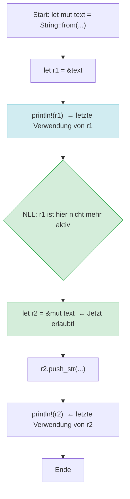
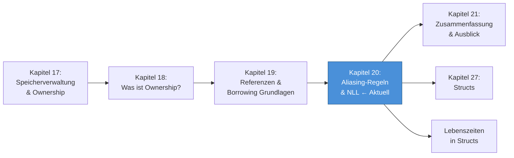

# Kapitel 20: Referenzen & Borrowing – Aliasing-Regeln und Non-Lexical Lifetimes

---

> [!IMPORTANT]
> Dieses Kapitel setzt voraus, dass Sie Kapitel 19 (Referenzen & Borrowing – Grundkonzepte) vollständig gelesen und verstanden haben. Die hier behandelten Konzepte – insbesondere die Aliasing-Regel und Non-Lexical Lifetimes – bauen direkt auf dem dort erarbeiteten Fundament auf.

---

## 20.1 Lernziele & Lernplan

### Was Sie in diesem Kapitel lernen werden

Dieses Kapitel befasst sich mit den tieferliegenden Mechanismen des Borrow Checkers – des zentralen Sicherheitssystems von Rust, das zur Compilezeit garantiert, dass kein undefiniertes Verhalten durch fehlerhafte Speicherzugriffe entstehen kann. Sie werden nach diesem Kapitel die exakten Regeln kennen, nach denen der Borrow Checker arbeitet, und verstehen, warum diese Regeln so und nicht anders formuliert sind.

Nach dem Durcharbeiten dieses Kapitels werden Sie in der Lage sein:

1. **Die Aliasing-Regel des Borrow Checkers** präzise zu formulieren und in eigenen Worten zu erklären: "Entweder beliebig viele unveränderliche Referenzen (`&T`) oder exakt eine veränderliche Referenz (`&mut T`), aber niemals beides gleichzeitig."
2. **Alle drei Szenarien** des Ausleihens (nur `&T`, nur `&mut T`, `&T` und `&mut T` gleichzeitig) anhand von Codebeispielen zu demonstrieren und die Compiler-Fehlermeldungen zu interpretieren.
3. **Das Konzept des Data Race** zu definieren und zu erläutern, wie Rusts Aliasing-Regeln Data Races zur Compilezeit vollständig ausschließen.
4. **Non-Lexical Lifetimes (NLL)** zu erklären: was sie sind, warum sie eingeführt wurden, und welche Art von Code sie ermöglichen, der vor der Rust-2018-Edition nicht kompilierte.
5. **Lifetime-Annotationen** in ihrer Grundform zu lesen, zu schreiben und zu verstehen, wann der Compiler sie verlangt.
6. **Fortgeschrittene Borrowing-Muster** wie Reborrowing, sequentielles Ausleihen und Split-Borrowing bei Structs anzuwenden.

### Empfohlener Lernplan

| Phase | Inhalt | Empfohlene Zeit |
|-------|--------|-----------------|
| Theorieteil | Abschnitte 20.2 bis 20.5 | 45–60 Minuten |
| Vertiefung | Abschnitte 20.6 und 20.7 | 30–45 Minuten |
| Mentale Modelle | Abschnitt 20.8 | 20–30 Minuten |
| Übungen | Abschnitt 20.9 | 30–45 Minuten |
| Merkzettel | Abschnitt 20.10 | 10 Minuten |
| Wiederholung | Abschnitt 20.11 | 10 Minuten |

> [!TIP]
> Arbeiten Sie die Codebeispiele aktiv nach. Erstellen Sie für jedes Beispiel ein eigenes kleines Rust-Projekt mit `cargo new kapitel20_beispielN`, tippen Sie den Code ab (nicht kopieren!), und beobachten Sie die Fehlermeldungen des Compilers. Das aktive Nachvollziehen ist um ein Vielfaches effektiver als passives Lesen.

---

## 20.2 Die Definition

### Die Aliasing-Regel des Borrow Checkers – präzise und vollständig

Das Herz von Rusts Speichersicherheitsgarantien ist eine einzige, deceptively einfache Regel, die der Borrow Checker durchsetzt:

> **Die Aliasing-Regel:** Zu jedem Zeitpunkt und in jedem Gültigkeitsbereich darf ein Wert entweder durch **beliebig viele unveränderliche Referenzen** (`&T`) oder durch **exakt eine veränderliche Referenz** (`&mut T`) ausgeliehen sein – niemals beides gleichzeitig.

Diese Regel lässt sich auch als Ausschlussbeziehung formulieren:

- Wenn eine oder mehr `&T`-Referenzen auf einen Wert existieren, kann keine `&mut T`-Referenz auf denselben Wert erstellt werden.
- Wenn eine `&mut T`-Referenz auf einen Wert existiert, kann weder eine weitere `&mut T`- noch eine `&T`-Referenz auf denselben Wert erstellt werden.
- Wenn keine Referenz auf einen Wert existiert, kann jederzeit eine neue `&T`- oder `&mut T`-Referenz erstellt werden.

### Was ist "Aliasing"?

Der Begriff "Aliasing" stammt aus der Informatik und bezeichnet die Situation, in der zwei oder mehr verschiedene Variablen (Zeiger, Referenzen) auf denselben Speicherbereich zeigen. Wenn Variable `a` und Variable `b` beide auf dieselbe Speicheradresse zeigen, sind sie Aliase voneinander.

Aliasing an sich ist nicht gefährlich – es ist ein gängiges und nützliches Konzept. Gefährlich wird Aliasing erst dann, wenn eines der Aliase schreibend (mutierend) zugreift, während andere aliasierte Referenzen noch aktiv sind. In diesem Fall können Lesende beobachten, wie sich der Wert "unter ihren Händen" ändert, was zu unerwartetem Verhalten führt.

### Warum diese Regel existiert – die theoretische Begründung

Die Aliasing-Regel existiert, weil das gleichzeitige Vorhandensein einer schreibenden und einer lesenden Referenz auf denselben Wert in jedem Computersystem zu einer Reihe von gravierenden Problemen führen kann:

**1. Verletzung von Invarianten:** Wenn Code eine unveränderliche Referenz `&T` hält, geht er von der Annahme aus, dass sich der referenzierte Wert nicht verändert. Könnte ein anderer Teil des Codes diesen Wert über eine `&mut T`-Referenz ändern, wäre diese Annahme falsch. Dies kann zu Logikfehlern, falsch berechneten Ergebnissen oder Abstürzen führen.

**2. Iterator-Invalidierung:** Ein klassisches Beispiel ist das Iterieren über eine Sammlung und gleichzeitige Modifikation derselben Sammlung. In C++ ist dies undefiniertes Verhalten. In Rust ist es zur Compilezeit ausgeschlossen.

**3. Data Races in nebenläufigen Programmen:** In Multi-Thread-Programmen führt das gleichzeitige Schreiben und Lesen ohne Synchronisation direkt zu einem Data Race – einem der schwerwiegendsten und am schwierigsten zu debuggenden Fehler in der Softwareentwicklung.

**4. Optimierungsbehinderung:** Compiler können Code viel besser optimieren, wenn sie wissen, dass ein Zeiger kein Alias für einen anderen ist. Die C99-Spezifikation kennt das `restrict`-Schlüsselwort aus diesem Grund. Rust erzwingt diese Eigenschaft systemweit.

### Die formale Sicht: Stacked Borrows

Für Leserinnen und Leser mit Interesse an formaler Semantik: Der Forschungsrahmen "Stacked Borrows" von Ralf Jung beschreibt das Leihmodell von Rust formal. Er modelliert aktive Referenzen als einen Stack (Stapel), wobei jede neue Ausleihe oben auf dem Stack platziert wird und der Stack sicherstellt, dass veränderliche Referenzen niemals von anderen Referenzen "überdeckt" werden, die noch aktiv sind.

> [!NOTE]
> "Stacked Borrows" ist ein aktives Forschungsgebiet und kein fester Bestandteil der offiziellen Rust-Spezifikation. Es dient jedoch als das präziseste formale Modell für das Verhalten, das der Borrow Checker durchsetzt, und bildet die Grundlage für das Miri-Werkzeug, das Referenzverletzungen zur Laufzeit erkennt.

---

## 20.3 Das Problem & Die Motivation

### Warum Aliasing-Regeln nötig sind: Konkrete Probleme ohne sie

Um den Wert der Aliasing-Regel zu verstehen, betrachten wir zunächst, welche Probleme in Sprachen ohne solche Regeln entstehen.

### Problem 1: Lese-Schreib-Konflikt und Verletzung von Invarianten

Stellen Sie sich folgendes Szenario in einer fiktiven Sprache ohne Aliasing-Regeln vor:

```
// Pseudocode – keine gültige Sprache
funktion verdoppele_erstes_element(liste: &mut Vec<i32>, erstes: &i32) {
    liste.push(*erstes);  // Kann die Liste reallocieren!
    // 'erstes' zeigt jetzt auf ungültigen Speicher!
}
```

In diesem Pseudocode übergibt der Aufrufer sowohl eine veränderliche Referenz auf die Liste als auch eine unveränderliche Referenz auf das erste Element der Liste. Wenn `push` eine Reallokation des Speichers auslöst (weil die Liste voll ist), wird der Speicher des ersten Elements ungültig gemacht. Die Referenz `erstes` zeigt nun auf freigegebenen Speicher – ein klassischer Use-After-Free-Fehler.

### Problem 2: Data Race in der Nebenläufigkeit

```cpp
// C++: Undefiniertes Verhalten durch Data Race
#include <thread>
#include <vector>

int main() {
    std::vector<int> zahlen = {1, 2, 3, 4, 5};
    
    // Thread 1 liest alle Elemente
    std::thread leser([&zahlen]() {
        for (int zahl : zahlen) {
            // Lesen...
        }
    });
    
    // Thread 2 schreibt gleichzeitig
    std::thread schreiber([&zahlen]() {
        zahlen.push_back(42); // Kann Reallokation auslösen!
    });
    
    leser.join();
    schreiber.join();
    return 0;
}
```

Dieser C++-Code enthält einen Data Race: Thread 1 liest `zahlen`, während Thread 2 gleichzeitig in `zahlen` schreibt. Das Ergebnis ist undefiniertes Verhalten – der Compiler darf alles tun, einschließlich Absturz, falscher Ausgabe oder scheinbar korrekter Ausgabe, die unter anderen Umständen versagt.

### Problem 3: Iterator-Invalidierung in C++

```cpp
// C++: Klassische Iterator-Invalidierung
#include <vector>

int main() {
    std::vector<int> zahlen = {1, 2, 3};
    
    // Iterator, der auf das erste Element zeigt
    auto it = zahlen.begin();
    
    // Modifikation der Liste während Iteration
    zahlen.push_back(4); // Reallokation möglich!
    
    // Undefiniertes Verhalten: 'it' könnte ungültig sein
    int wert = *it; // ???
    return 0;
}
```

### Die Motivation für Rusts Ansatz

Diese Probleme zeigen, dass das gleichzeitige Vorhandensein von Schreib- und Lesezugriff auf denselben Speicher eine fundamentale Quelle von Fehlern ist. Rust löst dieses Problem nicht durch Laufzeit-Checks (wie Java mit seiner Garbage Collection oder C++'s `std::shared_ptr` mit Referenzzählung), sondern durch **statische Analyse zur Compilezeit**.

Der Borrow Checker analysiert den Kontrollfluss des Programms und stellt sicher, dass zu keinem Zeitpunkt ein Aliasing-Konflikt entstehen kann. Wenn er einen potenziellen Konflikt findet, verweigert er die Kompilierung und gibt eine detaillierte Fehlermeldung aus.

Diese Entscheidung hat eine wichtige Konsequenz: **Rust-Programme haben keinen Overhead für Speichersicherheit zur Laufzeit**. Es gibt keine Garbage Collection, keine Referenzzählung (außer bei explizit genutzten `Rc<T>`/`Arc<T>`), und keine Laufzeit-Checks für Speicherzugriffe. Die Sicherheit ist vollständig kostenlos in dem Sinne, dass sie keinen Laufzeit-Overhead verursacht.

> [!IMPORTANT]
> Die Aliasing-Regel ist der Kern von Rusts "Fearless Concurrency" (furchtlose Nebenläufigkeit). Weil das Typsystem sicherstellt, dass schreibender Zugriff exklusiv ist, können viele Klassen von Nebenläufigkeitsfehlern zur Compilezeit ausgeschlossen werden, nicht erst zur Laufzeit.

---

## 20.4 Der naive Versuch (fehlerhafter Code)

In diesem Abschnitt betrachten wir verschiedene fehlerhafte Code-Muster, die gegen die Aliasing-Regel verstoßen, und analysieren die resultierenden Compiler-Fehlermeldungen.

### Fehler 1: Unveränderliche und veränderliche Referenz gleichzeitig (error[E0502])

```rust
fn main() {
    let mut text = String::from("Hallo, Welt");

    // Unveränderliche Referenz erstellen
    let unveraenderlich = &text;

    // Versuch: Veränderliche Referenz gleichzeitig erstellen
    let veraenderlich = &mut text; // FEHLER: error[E0502]

    // Verwendung beider Referenzen
    println!("Unveränderlich: {}", unveraenderlich);
    println!("Veränderlich: {}", veraenderlich);
}
```

**Compiler-Fehlermeldung:**

```
error[E0502]: cannot borrow `text` as mutable because it is also borrowed as immutable
 --> src/main.rs:7:24
  |
5 |     let unveraenderlich = &text;
  |                           ----- immutable borrow occurs here
7 |     let veraenderlich = &mut text; // FEHLER: error[E0502]
  |                         ^^^^^^^^^ mutable borrow occurs here
...
11|     println!("Unveränderlich: {}", unveraenderlich);
  |                                    --------------- immutable borrow later used here
```

**Analyse der Fehlermeldung:**

Der Compiler zeigt präzise drei Stellen:
1. **Zeile 5:** Hier wird die unveränderliche Referenz `unveraenderlich` erstellt. Sie beginnt hier zu "leben".
2. **Zeile 7:** Hier wird versucht, eine veränderliche Referenz zu erstellen. Dies ist der Fehler.
3. **Zeile 11:** Hier wird die unveränderliche Referenz `unveraenderlich` noch verwendet. Deshalb lebt sie bis mindestens Zeile 11 und kann bis dahin nicht durch eine veränderliche Referenz ergänzt werden.

### Fehler 2: Zwei veränderliche Referenzen gleichzeitig (error[E0499])

```rust
fn main() {
    let mut zahl = 42i32;

    // Erste veränderliche Referenz
    let erste = &mut zahl;

    // Versuch: Zweite veränderliche Referenz gleichzeitig erstellen
    let zweite = &mut zahl; // FEHLER: error[E0499]

    *erste += 1;
    *zweite += 1;

    println!("Zahl: {}", zahl);
}
```

**Compiler-Fehlermeldung:**

```
error[E0499]: cannot borrow `zahl` as mutable more than once at a time
 --> src/main.rs:8:18
  |
5 |     let erste = &mut zahl;
  |                 --------- first mutable borrow occurs here
8 |     let zweite = &mut zahl; // FEHLER: error[E0499]
  |                  ^^^^^^^^^ second mutable borrow occurs here
10|     *erste += 1;
  |     ----------- first borrow later used here
```

**Analyse:** Der Compiler unterscheidet zwischen `E0502` (mutable + immutable gleichzeitig) und `E0499` (zweimal mutable gleichzeitig). Beide verstoßen gegen die Aliasing-Regel, aber aus unterschiedlichen Gründen.

### Fehler 3: Referenz auf einen Wert nach Übergabe (move)

```rust
fn main() {
    let text = String::from("Hallo");

    // text wird an die Funktion übergeben (move)
    let laenge = berechne_laenge(text);

    // Versuch: text nach dem Move zu verwenden
    println!("Text: {}", text); // FEHLER: text wurde gemovt
    println!("Länge: {}", laenge);
}

fn berechne_laenge(s: String) -> usize {
    s.len()
}
```

**Compiler-Fehlermeldung:**

```
error[E0382]: borrow of moved value: `text`
 --> src/main.rs:7:24
  |
3 |     let text = String::from("Hallo");
  |         ---- move occurs because `text` has type `String`,
  |              which does not implement the `Copy` trait
4 |
5 |     let laenge = berechne_laenge(text);
  |                                  ---- value moved here
6 |
7 |     println!("Text: {}", text); // FEHLER: text wurde gemovt
  |                          ^^^^ value borrowed here after move
```

**Analyse:** Dieser Fehler zeigt, dass das Ownership-System und das Borrow-System zusammenarbeiten. Ein Wert, dessen Ownership übertragen wurde, kann nicht mehr referenziert werden.

### Fehler 4: Referenz auf einen temporären Wert (dangling reference)

```rust
fn erzeugeReferenz() -> &String {
    let text = String::from("Lokaler Text");
    &text // FEHLER: text wird am Ende der Funktion gelöscht
} // text wird hier gedroppt
```

**Compiler-Fehlermeldung:**

```
error[E0106]: missing lifetime specifier
 --> src/main.rs:1:25
  |
1 | fn erzeugeReferenz() -> &String {
  |                         ^ expected named lifetime parameter
  |
  = help: this function's return type contains a borrowed value,
    but there is no value for it to be borrowed from
help: consider using the `'static` lifetime, but this is uncommon
    unless you're returning a borrowed value from a `const` or a `static`
```

**Analyse:** Der Compiler verlangt eine Lifetime-Annotation, weil er sonst nicht wissen kann, an wen die zurückgegebene Referenz geknüpft ist. Die korrekte Antwort hier ist: Es gibt keinen Wert, an den die Referenz geknüpft werden kann, weil `text` am Ende der Funktion dropped wird. Die Lösung ist, den `String` zu returnen, nicht eine Referenz darauf.

---

## 20.5 Die Anatomie des Fehlers

### Was der Compiler wirklich prüft

Um die Fehlermeldungen vollständig zu verstehen, müssen wir verstehen, wie der Borrow Checker intern arbeitet. Der Borrow Checker analysiert nicht einfach, ob zwei Variablen im selben lexikalischen Scope deklariert sind – er analysiert, ob ihre **Lebensdauern** (Lifetimes) sich überlappen.

### Das Konzept der Lifetime

Eine **Lifetime** ist der Zeitraum, während dessen eine Referenz gültig ist. Lifetimes sind ein rein kompilierzeitliches Konzept – zur Laufzeit existieren sie nicht. Sie sind Regionen im Kontrollfluss-Graphen des Programms, nicht Regionen in der Zeit.

Vor der Einführung von Non-Lexical Lifetimes (NLL) in Rust 2018 wurde eine Lifetime als der lexikalische Block (der `{...}`-Block) definiert, in dem eine Variable deklariert wurde. Das war einfach zu implementieren, aber manchmal zu restriktiv.

Mit NLL werden Lifetimes als die tatsächliche Verwendungsdauer einer Referenz im Kontrollfluss-Graphen definiert. Eine Referenz "lebt" von ihrer Erstellung bis zu ihrer letzten Verwendung, nicht bis zum Ende des umschließenden Blocks.

### Fehler E0502 – Detailanalyse

Betrachten wir nochmals den E0502-Fehler und analysieren ihn Schritt für Schritt:

```rust
fn main() {
    let mut text = String::from("Hallo, Welt"); // (1) text wird erstellt

    let unveraenderlich = &text;                 // (2) Lifetime der unver. Ref. beginnt

    let veraenderlich = &mut text;               // (3) FEHLER: veränd. Ref. würde beginnen
                                                 //     aber unveraenderlich lebt noch

    println!("{}", unveraenderlich);             // (4) Letzte Verwendung von unveraenderlich
    println!("{}", veraenderlich);               // (5) Letzte Verwendung von veraenderlich
}
```

Der Borrow Checker sieht:
- Die unveränderliche Referenz `unveraenderlich` wird bei (2) erstellt und bei (4) zuletzt verwendet.
- Die veränderliche Referenz `veraenderlich` würde bei (3) erstellt werden.
- Der Zeitraum von (2) bis (4) überlappt mit dem Zeitraum von (3) bis (5).
- Da beide Referenzen dieselbe Variable `text` betreffen und eine von ihnen veränderlich wäre, ist dies ein Verstoß gegen die Aliasing-Regel.

### Die vier Regeln des Borrow Checkers zusammengefasst

Der Borrow Checker prüft vier Invarianten:

1. **Gültigkeitsregel:** Eine Referenz darf niemals länger leben als der Wert, auf den sie zeigt.
2. **Aliasing-Regel (lesen):** Beliebig viele unveränderliche Referenzen (`&T`) dürfen gleichzeitig existieren.
3. **Aliasing-Regel (schreiben):** Maximal eine veränderliche Referenz (`&mut T`) darf zu jedem Zeitpunkt existieren.
4. **Exklusivitätsregel:** Wenn eine veränderliche Referenz existiert, dürfen keine anderen Referenzen (weder `&T` noch weitere `&mut T`) auf denselben Wert zeigen.

> [!WARNING]
> Die Aliasing-Regel gilt pro Wert, nicht pro Variable. Wenn Sie zwei verschiedene Variablen haben, die unterschiedliche Werte enthalten, können Sie problemlos veränderliche Referenzen auf beide gleichzeitig halten.

```rust
fn main() {
    let mut a = 1i32;
    let mut b = 2i32;

    // Dies ist erlaubt: a und b sind verschiedene Werte
    let ref_a = &mut a;
    let ref_b = &mut b;

    *ref_a += 10;
    *ref_b += 20;

    println!("a: {}, b: {}", a, b); // a: 11, b: 22
}
```

---

## 20.6 Die Lösung

### Drei korrekte Szenarien

Nachdem wir die Fehler analysiert haben, betrachten wir nun die korrekten Verwendungsmuster.

### Szenario A: Nur unveränderliche Referenzen – beliebig viele, gleichzeitig erlaubt

```rust
fn main() {
    let text = String::from("Hallo, Rust!");

    // Beliebig viele unveränderliche Referenzen sind erlaubt
    let ref1 = &text;
    let ref2 = &text;
    let ref3 = &text;
    let ref4 = &text;
    let ref5 = &text;

    // Alle können gleichzeitig verwendet werden
    println!("ref1: {}", ref1); // Hallo, Rust!
    println!("ref2: {}", ref2); // Hallo, Rust!
    println!("ref3: {}", ref3); // Hallo, Rust!
    println!("ref4: {}", ref4); // Hallo, Rust!
    println!("ref5: {}", ref5); // Hallo, Rust!

    // Der ursprüngliche Wert ist unverändert
    println!("text: {}", text); // Hallo, Rust!
}
```

**Zeile-für-Zeile-Erklärung:**

- `let text = String::from("Hallo, Rust!");` – Ein `String`-Wert wird auf dem Heap alloziert. `text` ist der Owner.
- `let ref1 = &text;` – Eine unveränderliche Referenz auf `text` wird erstellt. `text` wird "immutably borrowed".
- `let ref2 = &text;` – Eine zweite unveränderliche Referenz. Dies ist erlaubt, da unveränderliche Referenzen geteilt werden können.
- `let ref3 = &text;`, `let ref4 = &text;`, `let ref5 = &text;` – Weitere unveränderliche Referenzen. Jede ist eine neue Referenz, aber alle zeigen auf denselben Speicherbereich.
- Die `println!`-Aufrufe verwenden alle Referenzen. Da keine von ihnen schreibt, ist dies vollkommen sicher.
- `println!("text: {}", text);` – `text` kann auch direkt nach der Erstellung der Referenzen verwendet werden, da unveränderliches Ausleihen den Owner nicht sperrt.

### Szenario B: Genau eine veränderliche Referenz – exklusiv, aber erlaubt

```rust
fn main() {
    let mut zahlen = vec![1, 2, 3, 4, 5];

    // Genau eine veränderliche Referenz: erlaubt
    let ref_mut = &mut zahlen;

    // Modifikation über die veränderliche Referenz
    ref_mut.push(6);
    ref_mut.push(7);
    ref_mut[0] = 100;

    // ref_mut wird hier implizit beendet (letzte Verwendung)
    println!("Letztes Element: {}", ref_mut[ref_mut.len() - 1]);

    // Jetzt kann zahlen wieder direkt verwendet werden
    println!("Zahlen: {:?}", zahlen); // [100, 2, 3, 4, 5, 6, 7]
}
```

**Zeile-für-Zeile-Erklärung:**

- `let mut zahlen = vec![1, 2, 3, 4, 5];` – Ein `Vec<i32>` wird erstellt. Das `mut`-Schlüsselwort erlaubt die spätere Mutation von `zahlen`.
- `let ref_mut = &mut zahlen;` – Eine veränderliche Referenz auf `zahlen` wird erstellt. `zahlen` ist jetzt "mutably borrowed". Während `ref_mut` aktiv ist, kann `zahlen` nicht anderweitig referenziert werden.
- `ref_mut.push(6);` – Über `ref_mut` wird `6` an die Liste angefügt. Dies ist nur möglich, weil `ref_mut` eine `&mut Vec<i32>` ist.
- `ref_mut.push(7);` – Weiteres Element wird angefügt.
- `ref_mut[0] = 100;` – Das erste Element wird überschrieben. Indexzugriff mit Zuweisung ist nur über eine `&mut`-Referenz möglich.
- `println!("Letztes Element: {}", ref_mut[ref_mut.len() - 1]);` – Die letzte Verwendung von `ref_mut`. Nach dieser Zeile endet die Lifetime von `ref_mut` (NLL).
- `println!("Zahlen: {:?}", zahlen);` – Da `ref_mut` nicht mehr aktiv ist, kann `zahlen` wieder direkt verwendet werden.

### Szenario C: Sequentielles Ausleihen – nicht gleichzeitig, also erlaubt

```rust
fn main() {
    let mut wert = 0i32;

    // Phase 1: Unveränderliches Ausleihen
    {
        let r1 = &wert;
        let r2 = &wert;
        println!("r1: {}, r2: {}", r1, r2); // r1: 0, r2: 0
        // r1 und r2 enden hier (letzte Verwendung war in println!)
    }

    // Phase 2: Veränderliches Ausleihen (sicher, weil Phase 1 beendet ist)
    {
        let r3 = &mut wert;
        *r3 += 42;
        println!("r3: {}", r3); // r3: 42
        // r3 endet hier
    }

    // Phase 3: Wieder unveränderliches Ausleihen
    let r4 = &wert;
    println!("r4: {}", r4); // r4: 42

    println!("Endwert: {}", wert); // Endwert: 42
}
```

**Zeile-für-Zeile-Erklärung:**

- `let mut wert = 0i32;` – Ein `i32`-Wert wird erstellt und mit `0` initialisiert. `mut` macht ihn später veränderlich.
- Der erste Block `{ let r1 = &wert; let r2 = &wert; ... }` erstellt zwei unveränderliche Referenzen, verwendet sie und endet dann. Mit NLL enden `r1` und `r2` bei ihrer letzten Verwendung im `println!`.
- `let r3 = &mut wert;` – Da `r1` und `r2` nicht mehr aktiv sind, kann eine veränderliche Referenz erstellt werden.
- `*r3 += 42;` – Der Wert wird über die Dereferenzierung modifiziert.
- Nach dem zweiten Block ist auch `r3` nicht mehr aktiv.
- `let r4 = &wert;` – Eine neue unveränderliche Referenz kann erstellt werden.

> [!NOTE]
> Das Muster "sequentielles Ausleihen" (erst lesen, dann schreiben, dann wieder lesen) ist das grundlegende Muster für den sicheren Umgang mit Werten in Rust. Die expliziten Blöcke `{...}` sind mit NLL oft nicht mehr nötig, da der Compiler Lifetimes auf die tatsächliche Verwendung beschränkt, helfen aber, die Intention des Codes zu verdeutlichen.

---

## 20.7 Kleines Tutorial

### Schritt-für-Schritt-Tutorial: Eine Bibliotheksverwaltung mit korrektem Borrowing

In diesem Tutorial bauen wir eine einfache Bibliotheksverwaltung, die verschiedene Borrowing-Muster demonstriert.

#### Schritt 1: Datenstruktur definieren

```rust
// src/main.rs

#[derive(Debug, Clone)]
struct Buch {
    titel: String,
    autor: String,
    isbn: String,
    verfuegbar: bool,
    ausleihdatum: Option<String>,
}

impl Buch {
    // Konstruktor: nimmt Ownership der Strings
    fn neu(titel: String, autor: String, isbn: String) -> Self {
        Buch {
            titel,
            autor,
            isbn,
            verfuegbar: true,
            ausleihdatum: None,
        }
    }
}

#[derive(Debug)]
struct Bibliothek {
    buecher: Vec<Buch>,
}

impl Bibliothek {
    fn neu() -> Self {
        Bibliothek {
            buecher: Vec::new(),
        }
    }
}
```

**Zeile-für-Zeile-Erklärung:**

- `#[derive(Debug, Clone)]` – Automatische Implementierungen von `Debug` (für `{:?}`-Ausgabe) und `Clone` (für Kopien mit `.clone()`).
- `struct Buch { ... }` – Eine Datenstruktur mit fünf Feldern. `titel`, `autor` und `isbn` sind `String`-Werte (heap-alloziert). `verfuegbar` ist ein `bool`. `ausleihdatum` ist ein `Option<String>`, das entweder `None` (kein Datum) oder `Some(String)` enthält.
- `impl Buch { fn neu(...) -> Self { ... } }` – Ein zugeordneter Konstruktor. Er nimmt `String`-Werte (Ownership) und erstellt ein neues `Buch`.
- `struct Bibliothek { buecher: Vec<Buch> }` – Die Bibliothek enthält einen Vektor von `Buch`-Objekten.
- `impl Bibliothek { fn neu() -> Self { ... } }` – Konstruktor für eine leere Bibliothek.

#### Schritt 2: Unveränderliche Lesemethoden (nur `&self`)

```rust
impl Bibliothek {
    // Buch suchen: unveränderliche Referenz auf self
    fn suche_nach_isbn<'a>(&'a self, isbn: &str) -> Option<&'a Buch> {
        self.buecher.iter().find(|buch| buch.isbn == isbn)
    }

    // Alle verfügbaren Bücher anzeigen: nur lesen
    fn zeige_verfuegbare(&self) {
        println!("=== Verfügbare Bücher ===");
        let mut anzahl = 0;
        for buch in &self.buecher {
            if buch.verfuegbar {
                println!(
                    "  - '{}' von {} (ISBN: {})",
                    buch.titel, buch.autor, buch.isbn
                );
                anzahl += 1;
            }
        }
        if anzahl == 0 {
            println!("  (Keine Bücher verfügbar)");
        }
        println!("Gesamt: {} Buch/Bücher verfügbar.", anzahl);
    }

    // Statistik berechnen: nur lesen
    fn statistik(&self) -> (usize, usize) {
        let gesamt = self.buecher.len();
        let verfuegbar = self.buecher.iter().filter(|b| b.verfuegbar).count();
        (gesamt, verfuegbar)
    }
}
```

**Zeile-für-Zeile-Erklärung:**

- `fn suche_nach_isbn<'a>(&'a self, isbn: &str) -> Option<&'a Buch>` – Diese Funktion nimmt eine unveränderliche Referenz auf `self` (`&'a self`) und gibt optional eine Referenz auf ein `Buch` zurück. Die Lifetime-Annotation `'a` stellt sicher, dass die zurückgegebene Referenz nicht länger lebt als `self`. Ohne `'a` könnte der Compiler nicht wissen, dass die Buch-Referenz an die Bibliothek gebunden ist.
- `self.buecher.iter()` – Erzeugt einen Iterator über unveränderliche Referenzen auf die Bücher.
- `.find(|buch| buch.isbn == isbn)` – Findet das erste Buch, dessen ISBN mit der gesuchten übereinstimmt. Gibt `Option<&Buch>` zurück.
- `fn zeige_verfuegbare(&self)` – `&self` bedeutet: Diese Methode leiht `self` unveränderlich aus. Sie kann `self` lesen, aber nicht verändern.
- `for buch in &self.buecher` – Iteriert über unveränderliche Referenzen (`&Buch`) auf die Elemente des Vektors.
- `fn statistik(&self) -> (usize, usize)` – Gibt ein Tupel aus zwei `usize`-Werten zurück (Gesamtanzahl, verfügbare Anzahl).
- `.iter().filter(|b| b.verfuegbar).count()` – Filtert den Iterator auf verfügbare Bücher und zählt sie.

#### Schritt 3: Veränderliche Schreibmethoden (`&mut self`)

```rust
impl Bibliothek {
    // Buch hinzufügen: benötigt veränderliche Referenz
    fn buch_hinzufuegen(&mut self, buch: Buch) {
        println!("Buch hinzugefügt: '{}'", buch.titel);
        self.buecher.push(buch);
    }

    // Buch ausleihen: benötigt veränderliche Referenz auf das gefundene Buch
    fn buch_ausleihen(&mut self, isbn: &str, datum: &str) -> Result<(), String> {
        // Wir suchen den Index (nicht eine Referenz), um Borrowing-Konflikte zu vermeiden
        let index = self.buecher.iter().position(|buch| buch.isbn == isbn);

        match index {
            None => Err(format!("Buch mit ISBN '{}' nicht gefunden.", isbn)),
            Some(i) => {
                let buch = &mut self.buecher[i];
                if !buch.verfuegbar {
                    Err(format!(
                        "Buch '{}' ist bereits ausgeliehen (seit {}).",
                        buch.titel,
                        buch.ausleihdatum.as_deref().unwrap_or("unbekannt")
                    ))
                } else {
                    buch.verfuegbar = false;
                    buch.ausleihdatum = Some(datum.to_string());
                    println!("Buch '{}' wurde am {} ausgeliehen.", buch.titel, datum);
                    Ok(())
                }
            }
        }
    }

    // Buch zurückgeben: benötigt veränderliche Referenz
    fn buch_zurueckgeben(&mut self, isbn: &str) -> Result<(), String> {
        let index = self.buecher.iter().position(|buch| buch.isbn == isbn);

        match index {
            None => Err(format!("Buch mit ISBN '{}' nicht gefunden.", isbn)),
            Some(i) => {
                let buch = &mut self.buecher[i];
                if buch.verfuegbar {
                    Err(format!("Buch '{}' ist nicht ausgeliehen.", buch.titel))
                } else {
                    buch.verfuegbar = true;
                    buch.ausleihdatum = None;
                    println!("Buch '{}' wurde zurückgegeben.", buch.titel);
                    Ok(())
                }
            }
        }
    }
}
```

**Zeile-für-Zeile-Erklärung:**

- `fn buch_hinzufuegen(&mut self, buch: Buch)` – `&mut self` bedeutet: Diese Methode leiht `self` veränderlich aus. Sie darf `self` modifizieren. `buch: Buch` nimmt Ownership des Buches (kein `&`).
- `self.buecher.push(buch)` – Hängt das Buch an den Vektor an. `push` nimmt Ownership des Buches.
- `fn buch_ausleihen(&mut self, isbn: &str, datum: &str) -> Result<(), String>` – Gibt `Ok(())` bei Erfolg oder `Err(String)` mit einer Fehlermeldung zurück. `isbn: &str` und `datum: &str` sind unveränderliche String-Slices (kein `String`-Ownership nötig).
- `let index = self.buecher.iter().position(...)` – Kritisch: Wir suchen den **Index** (eine `usize`-Zahl), nicht eine Referenz auf das Buch. Würden wir eine Referenz zurückgeben, könnten wir danach keine `&mut`-Referenz auf `self.buecher` erstellen (Aliasing-Konflikt).
- `let buch = &mut self.buecher[i];` – Jetzt erstellen wir eine veränderliche Referenz auf das spezifische Element. Da `index` nur ein `usize` ist (keine Referenz), gibt es keinen Aliasing-Konflikt.
- `buch.verfuegbar = false;` – Direkte Mutation über die `&mut`-Referenz.
- `buch.ausleihdatum = Some(datum.to_string());` – `datum.to_string()` konvertiert den `&str` in einen neuen `String`.

#### Schritt 4: Hauptprogramm

```rust
fn main() {
    // Bibliothek erstellen: mut, weil wir sie modifizieren werden
    let mut bibliothek = Bibliothek::neu();

    // Bücher hinzufügen: benötigt &mut bibliothek
    bibliothek.buch_hinzufuegen(Buch::neu(
        String::from("Die Rust-Programmiersprache"),
        String::from("Steve Klabnik & Carol Nichols"),
        String::from("978-1-7185-0044-0"),
    ));

    bibliothek.buch_hinzufuegen(Buch::neu(
        String::from("Programming Rust"),
        String::from("Jim Blandy & Jason Orendorff"),
        String::from("978-1-4920-5259-4"),
    ));

    bibliothek.buch_hinzufuegen(Buch::neu(
        String::from("Rust in Action"),
        String::from("Tim McNamara"),
        String::from("978-1-6172-9413-7"),
    ));

    // Bücher anzeigen: benötigt nur &bibliothek
    bibliothek.zeige_verfuegbare();
    println!();

    // Statistik: unveränderliche Referenz
    let (gesamt, verfuegbar) = bibliothek.statistik();
    println!("Statistik: {} Bücher gesamt, {} verfügbar.", gesamt, verfuegbar);
    println!();

    // Buch ausleihen: benötigt &mut bibliothek
    match bibliothek.buch_ausleihen("978-1-7185-0044-0", "16.06.2026") {
        Ok(()) => println!("Ausleihe erfolgreich."),
        Err(e) => println!("Fehler: {}", e),
    }
    println!();

    // Erneut anzeigen: die Bibliothek hat sich verändert
    bibliothek.zeige_verfuegbare();
    println!();

    // Suche nach einem Buch: unveränderliche Referenz
    if let Some(buch) = bibliothek.suche_nach_isbn("978-1-7185-0044-0") {
        println!(
            "Gefunden: '{}' – verfügbar: {}",
            buch.titel, buch.verfuegbar
        );
    }
    println!();

    // Buch zurückgeben
    match bibliothek.buch_zurueckgeben("978-1-7185-0044-0") {
        Ok(()) => println!("Rückgabe erfolgreich."),
        Err(e) => println!("Fehler: {}", e),
    }
    println!();

    // Endstatistik
    let (gesamt, verfuegbar) = bibliothek.statistik();
    println!("Endstatistik: {} Bücher gesamt, {} verfügbar.", gesamt, verfuegbar);
}
```

**Zeile-für-Zeile-Erklärung (Hauptprogramm):**

- `let mut bibliothek = Bibliothek::neu();` – `mut` ist nötig, weil wir Methoden mit `&mut self` aufrufen werden.
- `bibliothek.buch_hinzufuegen(Buch::neu(...))` – Rust ruft automatisch `&mut bibliothek` auf, wenn `buch_hinzufuegen` ein `&mut self` erwartet. Dies nennt sich "auto-ref".
- `bibliothek.zeige_verfuegbare()` – Hier wird automatisch `&bibliothek` übergeben, da `zeige_verfuegbare` nur `&self` benötigt.
- `let (gesamt, verfuegbar) = bibliothek.statistik();` – Destrukturierung des zurückgegebenen Tupels.
- `match bibliothek.buch_ausleihen(...)` – `buch_ausleihen` gibt `Result<(), String>` zurück. `match` behandelt beide Fälle.
- `if let Some(buch) = bibliothek.suche_nach_isbn(...)` – `if let` ist Syntax-Zucker für ein `match` mit nur einem interessanten Zweig.

#### Schritt 5: Ausführen und Ausgabe

```bash
$ cargo run
```

Erwartete Ausgabe:

```
Buch hinzugefügt: 'Die Rust-Programmiersprache'
Buch hinzugefügt: 'Programming Rust'
Buch hinzugefügt: 'Rust in Action'
=== Verfügbare Bücher ===
  - 'Die Rust-Programmiersprache' von Steve Klabnik & Carol Nichols (ISBN: 978-1-7185-0044-0)
  - 'Programming Rust' von Jim Blandy & Jason Orendorff (ISBN: 978-1-4920-5259-4)
  - 'Rust in Action' von Tim McNamara (ISBN: 978-1-6172-9413-7)
Gesamt: 3 Buch/Bücher verfügbar.

Statistik: 3 Bücher gesamt, 3 verfügbar.

Buch 'Die Rust-Programmiersprache' wurde am 16.06.2026 ausgeliehen.
Ausleihe erfolgreich.

=== Verfügbare Bücher ===
  - 'Programming Rust' von Jim Blandy & Jason Orendorff (ISBN: 978-1-4920-5259-4)
  - 'Rust in Action' von Tim McNamara (ISBN: 978-1-6172-9413-7)
Gesamt: 2 Buch/Bücher verfügbar.

Gefunden: 'Die Rust-Programmiersprache' – verfügbar: false

Buch 'Die Rust-Programmiersprache' wurde zurückgegeben.
Rückgabe erfolgreich.

Endstatistik: 3 Bücher gesamt, 3 verfügbar.
```

---

## 20.8 Mentale Modelle & Deep Dive

### 20.8.1 Das "Lese-Schreib-Schloss"-Modell

Das intuitivste mentale Modell für die Aliasing-Regel ist das Konzept eines **Lese-Schreib-Schlosses** (Read-Write Lock, RwLock). Dieses Konzept kennen Sie vielleicht aus der Datenbanktheorie oder der Systemsoftware.

Ein RwLock hat zwei Modi:
- **Lesemodus:** Beliebig viele Leser können gleichzeitig zugreifen. Kein Schreiber darf zugreifen.
- **Schreibmodus:** Genau ein Schreiber hat exklusiven Zugriff. Kein Leser und kein weiterer Schreiber darf zugreifen.

Dies ist exakt Rusts Aliasing-Regel – mit dem entscheidenden Unterschied, dass Rust dieses "Schloss" **zur Compilezeit** und **ohne Laufzeit-Overhead** durchsetzt, während `RwLock` ein Laufzeit-Konstrukt ist.

```rust
use std::sync::RwLock;

fn main() {
    // RwLock: Laufzeit-Äquivalent zu Rusts Compile-Zeit-Borrow-Checker
    let daten = RwLock::new(vec![1, 2, 3]);

    // Lesesperre (mehrere gleichzeitig möglich)
    {
        let leser1 = daten.read().unwrap();
        let leser2 = daten.read().unwrap(); // Funktioniert: zwei Leser gleichzeitig
        println!("leser1: {:?}, leser2: {:?}", *leser1, *leser2);
    } // Lesesperren werden hier freigegeben

    // Schreibsperre (exklusiv)
    {
        let mut schreiber = daten.write().unwrap();
        schreiber.push(4); // Exklusiver Zugriff
    } // Schreibsperre wird hier freigegeben

    // Ergebnis
    let leser = daten.read().unwrap();
    println!("Ergebnis: {:?}", *leser);
}
```

**Zeile-für-Zeile-Erklärung:**

- `use std::sync::RwLock;` – Import von `RwLock` aus der Standardbibliothek.
- `let daten = RwLock::new(vec![1, 2, 3]);` – Ein `Vec<i32>` wird in einem `RwLock` eingeschlossen. `RwLock` ist nicht `mut` – die Veränderlichkeit wird durch den Lock geregelt.
- `daten.read().unwrap()` – Erwirbt eine Lesesperre. Gibt einen `RwLockReadGuard` zurück, der den Lesezugriff kapselt.
- Zwei `read()`-Guards können gleichzeitig existieren – analog zu mehreren `&T`-Referenzen.
- `daten.write().unwrap()` – Erwirbt eine Schreibsperre (exklusiv). Analog zu einer `&mut T`-Referenz.
- Die `{ }` Blöcke stellen sicher, dass die Guards am Ende des Blocks gedroppt (freigegeben) werden.

### 20.8.2 Data-Race-Prävention zur Compilezeit – technische Tiefe

#### Was ist ein Data Race?

Ein **Data Race** (Datenwettlauf) ist definiert als eine Situation, in der:
1. Zwei oder mehr Ausführungseinheiten (Threads) gleichzeitig auf denselben Speicherbereich zugreifen,
2. mindestens eine dieser Ausführungseinheiten schreibend zugreift, und
3. kein Synchronisationsmechanismus (Mutex, Semaphore, atomare Operationen) verwendet wird.

Data Races sind laut C-Standard und C++-Standard **undefiniertes Verhalten**. Das bedeutet: Der Compiler darf das Programm auf jede beliebige Art und Weise übersetzen, einschließlich solcher Übersetzungen, die das Programm zum Absturz bringen, falsche Ergebnisse produzieren, oder sogar scheinbar korrekt funktionieren.

#### Warum sind Data Races so gefährlich?

Data Races sind besonders tückisch, weil:
- Sie nicht-deterministisch sind: Das Programm verhält sich je nach Timing unterschiedlich.
- Sie selten reproduzierbar sind: In Tests funktioniert alles, in Produktion kommt es sporadisch zum Absturz.
- Sie schwer zu debuggen sind: Debugger und sanitizer können helfen, aber nicht immer.
- Ihre Auswirkungen weit von der Ursache entfernt sein können: Der Absturz passiert an Stelle B, die Ursache liegt an Stelle A.

#### Wie Rusts Aliasing-Regeln Data Races verhindern

Rusts Typsystem erzwingt, dass `&mut T` exklusiv ist. Das bedeutet: Wenn ein Thread eine `&mut T`-Referenz hält, kann kein anderer Thread (oder Programmteil) eine weitere `&T`- oder `&mut T`-Referenz auf denselben Wert halten.

Dies schließt Data Races aus, weil:
- Schreibzugriff impliziert exklusiven Zugriff.
- Lesezugriff kann geteilt werden, aber niemals gleichzeitig mit Schreibzugriff.
- Das Typsystem macht es strukturell unmöglich, einen Wert aus zwei Threads ohne explizite Synchronisation (z.B. `Mutex<T>` oder `RwLock<T>`) zu teilen, wenn einer der Zugriffe schreibend ist.

> [!IMPORTANT]
> Rust verhindert nicht alle Arten von Nebenläufigkeitsfehlern – nur Data Races. **Deadlocks**, **Starvation** und **logische Fehler** in der Nebenläufigkeit sind weiterhin möglich. Rust's Garantie ist: "Kein Data Race in safe Rust." Diese Garantie ist stark genug, um die häufigste und schwerwiegendste Klasse von Nebenläufigkeitsfehlern vollständig auszuschließen.

#### Codebeispiel: Data Race in C++ (Illustration)

```cpp
// C++: Dieser Code enthält einen Data Race
// Kompilierung: g++ -std=c++17 -pthread -o data_race data_race.cpp
#include <iostream>
#include <thread>
#include <vector>

int zaehler = 0; // Globale Variable: geteilt zwischen Threads

void erhoehe() {
    for (int i = 0; i < 100000; ++i) {
        zaehler++; // NICHT ATOMAR: Lese-Modifiziere-Schreibe-Operation
                   // Diese Operation besteht aus mehreren Maschinenbefehlkn:
                   // 1. Lese zaehler aus dem Speicher
                   // 2. Erhöhe um 1
                   // 3. Schreibe zurück in den Speicher
                   // Zwischen Schritt 1 und 3 kann ein anderer Thread
                   // denselben Wert lesen und denselben alten Wert zurückschreiben.
    }
}

int main() {
    std::thread t1(erhoehe);
    std::thread t2(erhoehe);

    t1.join();
    t2.join();

    // Erwartet: 200000
    // Tatsächlich: irgendwo zwischen 100001 und 200000 (nicht-deterministisch)
    std::cout << "Zaehler: " << zaehler << std::endl;
    return 0;
}
```

#### Codebeispiel: Rust verhindert denselben Fehler zur Compilezeit

```rust
// Rust: Dieser Code kompiliert NICHT
// Der Borrow Checker verhindert den Data Race zur Compilezeit
use std::thread;

fn main() {
    let mut zaehler: i32 = 0;

    // Versuch 1: Direkte Referenz aus einem Thread heraus
    let t1 = thread::spawn(|| {
        for _ in 0..100_000 {
            zaehler += 1; // FEHLER: zaehler kann nicht in Thread bewegt werden
                          // error[E0373]: closure may outlive the current function,
                          // but it borrows `zaehler`
        }
    });

    t1.join().unwrap();
    println!("Zaehler: {}", zaehler);
}
```

**Compiler-Fehlermeldung:**

```
error[E0373]: closure may outlive the current function, but it borrows `zaehler`, 
              which is owned by the current function
  --> src/main.rs:10:24
   |
10 |     let t1 = thread::spawn(|| {
   |                            ^^ may outlive borrowed value `zaehler`
11 |         for _ in 0..100_000 {
12 |             zaehler += 1;
   |             ------- `zaehler` is borrowed here
   |
help: to force the closure to take ownership of `zaehler` (and any other referenced 
      variables), use the `move` keyword
```

Der Compiler erkennt, dass der Thread möglicherweise länger lebt als die Funktion, die ihn erstellt. Das würde bedeuten, dass `zaehler` möglicherweise nicht mehr existiert, wenn der Thread noch läuft – ein Use-After-Free-Fehler.

#### Korrekte Lösung mit `Mutex`

```rust
// Rust: Korrekte nebenläufige Summation mit Mutex
use std::sync::{Arc, Mutex};
use std::thread;

fn main() {
    // Arc: atomarer Referenzzähler (für thread-sicheres Teilen)
    // Mutex: gegenseitiger Ausschluss (garantiert exklusiven Zugriff)
    let zaehler = Arc::new(Mutex::new(0i32));

    let mut handles = Vec::new();

    for _ in 0..2 {
        // Klonen des Arc-Zählers: erhöht den Referenzzähler atomisch
        let zaehler_klon = Arc::clone(&zaehler);

        let handle = thread::spawn(move || {
            for _ in 0..100_000 {
                // lock() erwirbt die Mutex-Sperre (blockiert wenn nötig)
                let mut wert = zaehler_klon.lock().unwrap();
                *wert += 1;
                // Sperre wird automatisch freigegeben wenn 'wert' gedroppt wird
            }
        });
        handles.push(handle);
    }

    // Auf alle Threads warten
    for handle in handles {
        handle.join().unwrap();
    }

    // Ergebnis lesen
    let ergebnis = zaehler.lock().unwrap();
    println!("Zaehler: {}", *ergebnis); // Immer: 200000
}
```

**Zeile-für-Zeile-Erklärung:**

- `Arc::new(Mutex::new(0i32))` – Verschachtelung: `Mutex` schützt den `i32`-Wert, `Arc` ermöglicht thread-sicheres Teilen des `Mutex`. `Arc` steht für "Atomically Reference Counted".
- `Arc::clone(&zaehler)` – Erstellt einen neuen `Arc`-Zeiger auf dieselben Daten. Der interne Referenzzähler wird atomisch erhöht. Kein tatsächliches Kopieren der Daten.
- `thread::spawn(move || { ... })` – `move` bewegt den `zaehler_klon` in den Thread-Closure. Damit gehört der `Arc` dem Thread.
- `zaehler_klon.lock().unwrap()` – Erwirbt die Mutex-Sperre. Gibt `MutexGuard<i32>` zurück.
- `*wert += 1` – Dereferenzierung des Guards zum Zugriff auf den `i32`-Wert.
- Der `MutexGuard` wird automatisch am Ende des inneren Blocks gedroppt (RAII), was die Sperre freigibt.

### 20.8.3 Non-Lexical Lifetimes (NLL) – tiefe technische Analyse

#### Geschichte und Motivation

Als Rust 2015 stabil wurde, verwendete der Borrow Checker **lexikalische Lifetimes**. Das bedeutete: Die Lifetime einer Referenz erstreckte sich vom Punkt ihrer Deklaration bis zum Ende des umschließenden lexikalischen Blocks (`{...}`).

Dieses Modell war einfach zu implementieren und zu verstehen, hatte aber einen gravierenden Nachteil: Es war oft zu restriktiv. Viele Programme, die konzeptuell korrekt waren (keine tatsächlichen Aliasing-Konflikte enthielten), wurden vom Compiler abgelehnt.

#### Das Problem mit lexikalischen Lifetimes

```rust
// Vor NLL: Dieser Code schlug fehl, obwohl er konzeptuell korrekt ist
fn main() {
    let mut map = std::collections::HashMap::new();
    map.insert("schluessel", 1);

    // Mit lexikalischen Lifetimes: FEHLER
    // 'eintrag' würde bis zum Ende des if-Blocks leben
    // und damit 'map' für die gesamte Dauer des if-Blocks ausleihen
    if let Some(eintrag) = map.get("schluessel") {
        // Hier wollen wir 'eintrag' verwenden
        println!("Eintrag: {}", eintrag);
        // Und danach 'map' modifizieren
        // Mit lexikalischen Lifetimes: FEHLER, weil 'eintrag' noch "im Scope" ist
        // map.insert("neuer_schluessel", 2); // Würde mit altem Checker scheitern
    }
    map.insert("neuer_schluessel", 2); // Das ging immer

    // Komplexeres Beispiel: Der Eintrag-API-Pattern
    // Vor NLL waren kompliziertere Workarounds nötig
}
```

Hier ist ein konkretes Beispiel, das vor NLL scheiterte und mit NLL funktioniert:

```rust
// Dieses Beispiel funktioniert mit NLL (Rust 2018+)
// aber schlug mit dem alten Borrow Checker fehl
fn erster_oder_einfuegen(
    map: &mut std::collections::HashMap<String, Vec<i32>>,
    schluessel: &str,
) -> &mut Vec<i32> {
    // Mit NLL analysiert der Compiler, dass 'map.get_mut' und 'map.entry'
    // nicht gleichzeitig aktiv sind:
    if map.contains_key(schluessel) {
        // Zweig 1: map.get_mut wird hier aufgerufen
        return map.get_mut(schluessel).unwrap();
    }
    // Zweig 2: map.entry wird hier aufgerufen
    // Weil NLL versteht, dass nur einer der Zweige ausgeführt wird,
    // erkennt es, dass keine Aliasing-Verletzung vorliegt
    map.entry(schluessel.to_string()).or_insert_with(Vec::new)
}

fn main() {
    let mut map = std::collections::HashMap::new();
    map.insert(String::from("a"), vec![1, 2, 3]);

    let werte_a = erster_oder_einfuegen(&mut map, "a");
    werte_a.push(4);

    let werte_b = erster_oder_einfuegen(&mut map, "b");
    werte_b.push(100);

    println!("a: {:?}", map["a"]); // [1, 2, 3, 4]
    println!("b: {:?}", map["b"]); // [100]
}
```

**Zeile-für-Zeile-Erklärung:**

- `fn erster_oder_einfuegen(map: &mut HashMap<...>, schluessel: &str) -> &mut Vec<i32>` – Die Funktion nimmt eine veränderliche Referenz auf die Map und gibt eine veränderliche Referenz auf einen Vektor zurück.
- `if map.contains_key(schluessel)` – Prüft, ob der Schlüssel existiert. Dies ist ein unveränderlicher Zugriff.
- `return map.get_mut(schluessel).unwrap();` – Gibt eine veränderliche Referenz auf den Wert zurück.
- `map.entry(schluessel.to_string()).or_insert_with(Vec::new)` – Verwendet das Entry-API, um einen neuen leeren Vektor einzufügen und eine Referenz darauf zurückzugeben.
- NLL versteht, dass `contains_key` (Zeile 1) und `get_mut` (Zeile 2) bzw. `entry` (Zeile 3) sich nicht zeitlich überlappen, weil sie in verschiedenen Zweigen des `if`-Statements sind.

#### Wie NLL funktioniert: Kontrollfluss-Graph-Analyse

NLL basiert auf der Analyse des **Kontrollfluss-Graphen** (Control Flow Graph, CFG) des Programms. Ein CFG ist eine Darstellung des Programms als gerichteter Graph, in dem:
- Knoten einzelne Anweisungen oder Blöcke von Anweisungen sind.
- Kanten den möglichen Kontrollfluss zwischen diesen Blöcken darstellen.

Statt zu fragen "In welchem lexikalischen Block wurde diese Referenz deklariert?", fragt NLL: "Welche Programmpunkte im CFG werden tatsächlich erreicht, während diese Referenz aktiv ist?"



#### Das NLL-Beispiel aus der Praxis

```rust
// Dieses Muster funktioniert mit NLL perfekt
fn main() {
    let mut text = String::from("Hallo");

    // r1 wird erstellt und verwendet
    let r1 = &text;
    println!("r1: {}", r1); // r1: Hallo
    // Letzte Verwendung von r1: Zeile oben
    // NLL erkennt: r1 ist nach println! nicht mehr aktiv

    // r2 kann jetzt erstellt werden, weil r1 nicht mehr aktiv ist
    let r2 = &mut text;
    r2.push_str(", Rust!");
    println!("r2: {}", r2); // r2: Hallo, Rust!

    println!("text: {}", text); // text: Hallo, Rust!
}
```

**Zeile-für-Zeile-Erklärung:**

- `let r1 = &text;` – Unveränderliche Referenz. Mit NLL lebt `r1` nur bis zu seiner letzten Verwendung.
- `println!("r1: {}", r1);` – Letzte Verwendung von `r1`. NLL beendet die Lifetime von `r1` nach dieser Zeile.
- `let r2 = &mut text;` – Dies funktioniert mit NLL, weil `r1` nicht mehr aktiv ist. Mit dem alten Borrow Checker schlug dies fehl, weil `r1` bis zum Ende des Blocks "lebte".
- `r2.push_str(", Rust!");` – Veränderliche Operation über `r2`.
- `println!("text: {}", text);` – Nach der letzten Verwendung von `r2` kann `text` direkt verwendet werden.

> [!NOTE]
> NLL wurde als Teil der **Rust 2018 Edition** eingeführt und ist seitdem der Standard. Wenn Sie mit einer älteren Codebase arbeiten oder die `edition = "2015"` in `Cargo.toml` verwenden, kann das alte Verhalten auftreten. Für neue Projekte ist `edition = "2021"` empfohlen.

#### Polonius: Die nächste Generation

**Polonius** ist das Nachfolgeprojekt zu NLL. Es ist nach der Mathematikerin Emmy Noether benannt (in Anlehnung an "Polonium", das nach einem Land benannt wurde – eine kreative Hommage an die Mathematik-Informatik-Verbindung).

Polonius verwendet eine ausdrucksstärkere Analyse auf Basis von **Datalog**-Anfragen. Es kann eine weitere Klasse von korrekten Programmen akzeptieren, die NLL noch ablehnt.

Das bekannteste Beispiel ist das "Conditional Return"-Muster:

```rust
// Dieses Muster scheitert auch mit NLL (Stand 2024)
// Polonius würde es akzeptieren
fn suche_oder_einfuegen<'a>(
    map: &'a mut std::collections::HashMap<String, i32>,
    schluessel: &str,
) -> &'a mut i32 {
    // NLL kann hier nicht beweisen, dass die 'if'-Zweige sich gegenseitig ausschließen
    // für die Rückgabe-Lifetime
    if let Some(wert) = map.get_mut(schluessel) {
        return wert; // Zeigt auf Daten in 'map'
    }
    map.insert(schluessel.to_string(), 0);
    map.get_mut(schluessel).unwrap()
}
```

Polonius ist in Rust aktivierbar über `-Zpolonius` (nightly only) und wird voraussichtlich in einer zukünftigen stable Rust-Edition standardmäßig aktiviert.

---

### 20.8.4 Lifetime-Annotationen: Grundlagen

#### Was ist eine Lifetime-Annotation?

Wenn eine Funktion Referenzen als Parameter nimmt und eine Referenz zurückgibt, muss der Compiler wissen, welche Eingangs-Referenz die zurückgegebene Referenz "trägt" – also an welchen Wert die Lifetime der Rückgabe gebunden ist.

Lifetime-Annotationen sind die Art, wie wir dem Compiler diese Information geben. Sie sind kein Laufzeit-Konzept – sie existieren nur zur Kompilierzeit.

#### Grundlegende Syntax

```rust
// Eine Lifetime wird mit einem Apostroph ('a, 'b, 'c...) annotiert
fn laengste<'a>(x: &'a str, y: &'a str) -> &'a str {
    if x.len() > y.len() {
        x
    } else {
        y
    }
}
```

**Zeile-für-Zeile-Erklärung:**

- `fn laengste<'a>(...)` – Die Funktion wird über eine Lifetime-Parameter `'a` generisch. Analog zu generischen Typ-Parametern `<T>`.
- `x: &'a str` – Parameter `x` ist ein String-Slice, dessen Lifetime mindestens `'a` ist.
- `y: &'a str` – Parameter `y` ist ebenfalls ein String-Slice mit Lifetime mindestens `'a`.
- `-> &'a str` – Der Rückgabewert ist ein String-Slice, dessen Lifetime durch `'a` begrenzt ist. Das bedeutet: Der zurückgegebene Slice lebt höchstens so lange wie das kürzere von `x` und `y` (weil `'a` das Minimum ist).

#### Wann muss man Lifetimes explizit annotieren?

Rust hat **Lifetime Elision** (Lifetime-Weglassung) – eine Reihe von Regeln, nach denen der Compiler Lifetimes in bestimmten häufigen Mustern automatisch ableitet:

**Regel 1 – Input-Lifetimes:** Jeder Referenz-Parameter erhält automatisch eine eigene Lifetime.

```rust
// Explizit:
fn erste<'a>(liste: &'a [i32]) -> &'a i32 { &liste[0] }

// Mit Elision (equivalent):
fn erste(liste: &[i32]) -> &i32 { &liste[0] }
```

**Regel 2 – Methoden:** Wenn einer der Parameter `&self` oder `&mut self` ist, wird die Lifetime von `self` auf alle Output-Referenzen übertragen.

```rust
struct Wichtig {
    teil: String,
}

impl Wichtig {
    // Explizit:
    fn zeige<'a>(&'a self) -> &'a str {
        &self.teil
    }
    
    // Mit Elision (equivalent):
    fn zeige_kurz(&self) -> &str {
        &self.teil
    }
}
```

**Regel 3 – Einzelner Input:** Wenn es nur einen Referenz-Parameter gibt, wird seine Lifetime auf den Output übertragen.

```rust
// Explizit:
fn erster_buchstabe<'a>(s: &'a str) -> &'a str { &s[..1] }

// Mit Elision (equivalent):
fn erster_buchstabe_kurz(s: &str) -> &str { &s[..1] }
```

Wenn keine dieser Regeln anwendbar ist – insbesondere wenn mehrere Input-Referenzen existieren und der Compiler nicht entscheiden kann, an welche der Rückgabe gebunden ist – dann **muss** der Programmierer explizit annotieren.

#### Vollständiges Lifetime-Beispiel

```rust
use std::fmt;

// Eine Struktur, die eine Referenz enthält
// Die Lifetime-Annotation besagt: die Struktur lebt höchstens so lange
// wie die Referenz, die sie enthält
struct Hervorhebung<'a> {
    teil: &'a str,
}

impl<'a> fmt::Display for Hervorhebung<'a> {
    fn fmt(&self, f: &mut fmt::Formatter) -> fmt::Result {
        write!(f, ">>> {} <<<", self.teil)
    }
}

impl<'a> Hervorhebung<'a> {
    // Gibt eine Referenz zurück, die an self gebunden ist (Elision angewendet)
    fn inhalt(&self) -> &str {
        self.teil
    }
}

// Funktion mit expliziter Lifetime: Rückgabe ist an den längeren der beiden Strings gebunden
fn laengster_anfang<'a>(s1: &'a str, s2: &'a str) -> &'a str {
    // Finde den gemeinsamen Anfang beider Strings
    let min_laenge = s1.len().min(s2.len());
    let gemeinsam = s1.chars()
        .zip(s2.chars())
        .take_while(|(c1, c2)| c1 == c2)
        .count();
    
    if gemeinsam == 0 {
        &s1[..0] // Leerer Slice
    } else {
        &s1[..gemeinsam.min(min_laenge)]
    }
}

fn main() {
    let string1 = String::from("langer String ist lang");

    {
        let string2 = String::from("langer String ist kurz");
        
        // Ergebnis ist an die kürzere Lifetime gebunden
        // (in diesem Fall: beide leben gleich lang)
        let ergebnis = laengster_anfang(&string1, &string2);
        println!("Gemeinsamer Anfang: '{}'", ergebnis);
    }
    // string2 ist hier nicht mehr gültig
    // ergebnis ist auch nicht mehr gültig

    // Hervorhebung mit Lifetime
    let satz = String::from("Rust ist fantastisch sicher.");
    let wort;
    {
        // 'teilstring' ist ein &str, der auf 'satz' zeigt
        let teilstring = &satz[..4]; // "Rust"
        // Hervorhebung lebt höchstens so lange wie teilstring (= satz)
        let hervorgehoben = Hervorhebung { teil: teilstring };
        wort = hervorgehoben.inhalt().to_string(); // Konvertierung zu owned String
        println!("Hervorgehoben: {}", hervorgehoben);
    }
    println!("Wort: {}", wort); // Funktioniert, weil wort ein eigener String ist
}
```

**Zeile-für-Zeile-Erklärung:**

- `struct Hervorhebung<'a> { teil: &'a str }` – Die Struktur hat eine Lifetime-Parameter `'a`. Das Feld `teil` ist ein String-Slice mit Lifetime `'a`. Der Compiler stellt sicher, dass eine `Hervorhebung`-Instanz niemals länger lebt als der String, auf den `teil` zeigt.
- `impl<'a> fmt::Display for Hervorhebung<'a>` – Die Implementierung ist ebenfalls über `'a` generisch.
- `fn laengster_anfang<'a>(s1: &'a str, s2: &'a str) -> &'a str` – Der Rückgabewert ist an `'a` gebunden, was das Minimum der Lifetimes von `s1` und `s2` ist.
- `wort = hervorgehoben.inhalt().to_string()` – `inhalt()` gibt `&str` zurück (gebunden an `hervorgehoben`), aber `.to_string()` erstellt einen neuen, besessenen `String`. Dadurch wird `wort` unabhängig von der Lifetime von `hervorgehoben`.

---

### 20.8.5 Fortgeschrittene Borrowing-Muster

#### Pattern 1: Reborrowing – `&mut T` als `&T` verwenden

Wenn eine Funktion `&T` erwartet, Sie aber nur `&mut T` haben, können Sie einfach eine unveränderliche Referenz daraus ableiten:

```rust
fn drucke_wert(x: &i32) {
    println!("Wert: {}", x);
}

fn main() {
    let mut zahl = 42i32;
    let r_mut = &mut zahl;

    // Reborrowing: &mut T kann als &T verwendet werden
    // Rust erstellt automatisch eine temporäre &T aus &mut T
    drucke_wert(r_mut); // Funktioniert! Reborrowing von &mut zu &

    // Wir können r_mut danach immer noch veränderlich nutzen
    *r_mut += 1;
    println!("Nach Änderung: {}", r_mut); // 43
}
```

**Zeile-für-Zeile-Erklärung:**

- `fn drucke_wert(x: &i32)` – Erwartet eine unveränderliche Referenz.
- `drucke_wert(r_mut)` – `r_mut` ist `&mut i32`. Rust führt automatisch ein "Reborrow" durch: Es erstellt eine temporäre `&i32` aus `r_mut` für die Dauer des Funktionsaufrufs. Nach dem Aufruf ist `r_mut` wieder verfügbar.
- `*r_mut += 1` – `r_mut` ist nach dem Aufruf immer noch eine gültige `&mut i32`.

#### Pattern 2: Split-Borrowing bei Structs

Rust erlaubt, verschiedene Felder einer Struktur gleichzeitig veränderlich auszuleihen, solange es sich um unterschiedliche Felder handelt:

```rust
struct Koordinate {
    x: f64,
    y: f64,
    z: f64,
}

fn normalisiere(koord: &mut Koordinate) {
    // Simultanes Ausleihen verschiedener Felder: erlaubt
    let x = &mut koord.x;
    let y = &mut koord.y;
    let z = &mut koord.z;

    let laenge = (*x * *x + *y * *y + *z * *z).sqrt();

    // Alle drei Referenzen werden gleichzeitig verwendet
    if laenge > 0.0 {
        *x /= laenge;
        *y /= laenge;
        *z /= laenge;
    }
}

fn main() {
    let mut punkt = Koordinate { x: 3.0, y: 4.0, z: 0.0 };
    normalisiere(&mut punkt);
    println!("Normalisiert: ({:.2}, {:.2}, {:.2})", punkt.x, punkt.y, punkt.z);
    // Normalisiert: (0.60, 0.80, 0.00)
}
```

**Zeile-für-Zeile-Erklärung:**

- `let x = &mut koord.x;` – Veränderliche Referenz auf das Feld `x`. Der Compiler sieht, dass dies ein Zugriff auf ein spezifisches Feld ist.
- `let y = &mut koord.y;` – Veränderliche Referenz auf das Feld `y`. Da `x`, `y` und `z` verschiedene Felder sind, ist dies kein Aliasing-Konflikt.
- `let z = &mut koord.z;` – Analog.
- `let laenge = (*x * *x + *y * *y + *z * *z).sqrt();` – Dereferenzierung aller drei Felder zur Berechnung der euklidischen Länge.
- `*x /= laenge; *y /= laenge; *z /= laenge;` – Division-Zuweisung: teilt den Wert durch `laenge` und schreibt zurück.

> [!NOTE]
> Split-Borrowing funktioniert nur für Struct-Felder, nicht für Vektoren oder andere dynamische Datenstrukturen. Für Vektoren müssten Sie `split_at_mut()` oder ähnliche Methoden verwenden.

#### Pattern 3: Ausleihen aus Funktionsrückgaben

```rust
fn finde_grossten(zahlen: &[i32]) -> &i32 {
    // Gibt eine Referenz zurück, die an den Eingabe-Slice gebunden ist
    let mut groesste = &zahlen[0];
    for zahl in zahlen {
        if zahl > groesste {
            groesste = zahl;
        }
    }
    groesste // Lifetime durch Elision: gebunden an 'zahlen'
}

fn main() {
    let zahlen = vec![34, 50, 25, 100, 65];

    // Das Ergebnis der Funktion ist eine Referenz in 'zahlen'
    let groesste = finde_grossten(&zahlen);
    println!("Die größte Zahl ist: {}", groesste); // 100

    // 'zahlen' kann immer noch verwendet werden (nur unveränderliches Ausleihen)
    println!("Liste: {:?}", zahlen);

    // 'zahlen' kann nicht verändert werden, solange 'groesste' aktiv ist
    // zahlen.push(200); // FEHLER: zahlen ist noch ausgeliehen durch groesste

    // Nach der letzten Verwendung von 'groesste' ist das Ausleihen beendet
    drop(groesste); // Explizites Beenden (normalerweise automatisch)

    // Jetzt kann 'zahlen' verändert werden
    let mut zahlen_modifiziert = zahlen;
    zahlen_modifiziert.push(200);
    println!("Modifiziert: {:?}", zahlen_modifiziert);
}
```

**Zeile-für-Zeile-Erklärung:**

- `fn finde_grossten(zahlen: &[i32]) -> &i32` – Nimmt einen Slice (Referenz auf einen Teilbereich) und gibt eine Referenz zurück. Lifetime Elision: Rückgabe ist an `zahlen` gebunden.
- `let mut groesste = &zahlen[0];` – Unveränderliche Referenz auf das erste Element. `groesste` ist vom Typ `&i32`.
- `for zahl in zahlen` – Iteriert über den Slice. `zahl` ist vom Typ `&i32`.
- `if zahl > groesste { groesste = zahl; }` – Vergleich von Referenzen. Der `>`-Operator ist für `&i32` implementiert (auto-deref).
- `drop(groesste)` – Explizites Dropping. Normalerweise passiert dies automatisch am Ende des Scopes, aber hier verwenden wir es, um zu demonstrieren, dass das Ausleihen beendet wird.

#### Pattern 4: Interior Mutability – ein Ausblick auf `RefCell<T>`

Manchmal braucht man Mutabilität "innen", auch wenn man nur eine unveränderliche Referenz "außen" hat. Dies ist das Konzept der **Interior Mutability**. `RefCell<T>` ist das Werkzeug dafür:

```rust
use std::cell::RefCell;

// Eine Struktur, die sich selbst verändert, aber als &self-Methode angeboten wird
struct ZaehlerMitLog {
    wert: i32,
    zugriffe: RefCell<Vec<String>>, // Interior Mutability
}

impl ZaehlerMitLog {
    fn neu() -> Self {
        ZaehlerMitLog {
            wert: 0,
            zugriffe: RefCell::new(Vec::new()),
        }
    }

    // Beachte: &self, nicht &mut self – aber wir modifizieren 'zugriffe'!
    fn lese(&self) -> i32 {
        // RefCell verschiebt die Borrow-Prüfung auf die Laufzeit
        self.zugriffe.borrow_mut().push(String::from("Lesezugriff"));
        self.wert
    }

    fn zeige_log(&self) {
        println!("Zugriffsprotokoll:");
        for eintrag in self.zugriffe.borrow().iter() {
            println!("  - {}", eintrag);
        }
    }
}

fn main() {
    // Nicht 'mut', trotzdem wird 'zugriffe' verändert
    let zaehler = ZaehlerMitLog::neu();

    let wert1 = zaehler.lese();
    let wert2 = zaehler.lese();
    let wert3 = zaehler.lese();

    println!("Werte: {}, {}, {}", wert1, wert2, wert3);
    zaehler.zeige_log();
}
```

**Zeile-für-Zeile-Erklärung:**

- `zugriffe: RefCell<Vec<String>>` – `RefCell` umhüllt den Vektor. Es ermöglicht Innen-Mutabilität: Obwohl `ZaehlerMitLog` nur unveränderlich referenziert wird, kann `zugriffe` verändert werden.
- `fn lese(&self) -> i32` – Methode mit `&self` (unveränderliche Ausleihe). Normalerweise dürfte keine Mutation stattfinden.
- `self.zugriffe.borrow_mut()` – Erwirbt eine veränderliche "Leihe" von `RefCell`. **Achtung:** Dies ist eine Laufzeit-Prüfung. Wenn bereits eine `borrow()` aktiv ist, panikt das Programm.
- `.push(String::from("Lesezugriff"))` – Mutation über den `RefMut`-Guard.
- `self.zugriffe.borrow()` – Unveränderliche Leihe von `RefCell`.

> [!WARNING]
> `RefCell<T>` verschiebt die Aliasing-Prüfung von der Compilezeit auf die Laufzeit. Wenn Sie die Borrow-Regeln zur Laufzeit verletzen (z.B. zwei `borrow_mut()` gleichzeitig), panikt das Programm. Verwenden Sie `RefCell<T>` nur, wenn Sie die Compilezeit-Prüfung aus gestalterischen Gründen nicht nutzen können, und bevorzugen Sie immer die Compilezeit-Alternative.

---

## 20.9 Drei Übungen

### Übung 1: Den Borrow Checker überlisten (oder nicht)

**Aufgabenstellung:**

Betrachten Sie den folgenden Code. Identifizieren Sie alle Stellen, die einen Borrow-Checker-Fehler verursachen, erklären Sie warum, und korrigieren Sie den Code so, dass er kompiliert und die ursprüngliche Intention beibehält.

```rust
// Fehlerhafter Code – zum Korrigieren
fn main() {
    let mut werte = vec![10, 20, 30, 40, 50];

    // Aufgabe: Verdopple jedes Element und zeige gleichzeitig die Originale
    let original_summe: i32 = werte.iter().sum();

    for element in &mut werte {
        *element *= 2;
    }

    // Dies soll die Originale zeigen (als Referenz auf werte)
    // PROBLEM: werte wurde bereits veränderlich ausgeliehen
    let referenz = &werte;
    println!("Original-Summe: {}", original_summe); // OK
    println!("Verdoppelt: {:?}", referenz);
    
    // Zweiter Fehler: Hier versuchen wir, referenz und den Vektor gleichzeitig zu nutzen
    werte.push(200); // Fehler: werte ist noch ausgeliehen durch referenz
    println!("Mit Anhang: {:?}", referenz);
}
```

**Hinweise zur Lösung:**

Denken Sie daran:
1. `werte.iter().sum()` nimmt eine unveränderliche Referenz auf `werte`. Diese endet nach der Zuweisung.
2. `for element in &mut werte` nimmt eine veränderliche Referenz. Diese endet nach der Schleife.
3. `let referenz = &werte` und `werte.push(200)` können nicht gleichzeitig aktiv sein.

**Musterlösung:**

```rust
fn main() {
    let mut werte = vec![10, 20, 30, 40, 50];

    // Schritt 1: Summe berechnen (unveränderliche Referenz endet nach dieser Zeile)
    let original_summe: i32 = werte.iter().sum();
    println!("Original-Summe: {}", original_summe); // 150

    // Schritt 2: Verdoppeln (veränderliche Referenz, endet nach der Schleife)
    for element in &mut werte {
        *element *= 2;
    }
    // werte ist hier wieder frei (keine aktive Ausleihe)

    // Schritt 3: Anzeigen (unveränderliche Referenz)
    println!("Verdoppelt: {:?}", werte); // [20, 40, 60, 80, 100]

    // Schritt 4: Anhängen (mut-Zugriff, kein Konflikt da keine andere Referenz aktiv)
    werte.push(200);

    // Schritt 5: Endausgabe
    println!("Mit Anhang: {:?}", werte); // [20, 40, 60, 80, 100, 200]
}
```

**Erläuterung der Korrekturen:**

Die Korrekturen folgen dem Muster des "sequentiellen Borrowings": Jede Operationsphase (Lesen, Schreiben, Lesen, Schreiben, Lesen) wird vollständig abgeschlossen, bevor die nächste beginnt. NLL stellt sicher, dass die Lifetimes korrekt erkannt werden, ohne dass explizite Blöcke nötig sind.

---

### Übung 2: Lifetime-Annotationen schreiben

**Aufgabenstellung:**

Implementieren Sie die Funktion `waehle_text`, die zwei String-Referenzen und eine Bedingung entgegennimmt. Wenn die Bedingung wahr ist, gibt sie die erste Referenz zurück; andernfalls die zweite. Der Compiler wird ohne Lifetime-Annotationen einen Fehler ausgeben. Fügen Sie die korrekten Annotationen hinzu.

**Ausgangscode (funktioniert nicht):**

```rust
// Dieser Code kompiliert nicht – warum?
fn waehle_text(text1: &str, text2: &str, nimm_ersten: bool) -> &str {
    if nimm_ersten {
        text1
    } else {
        text2
    }
}

fn main() {
    let ergebnis;
    let text_a = String::from("Text A");
    {
        let text_b = String::from("Text B");
        ergebnis = waehle_text(&text_a, &text_b, true);
        println!("Ergebnis: {}", ergebnis);
    }
}
```

**Musterlösung:**

```rust
// Korrekte Version mit Lifetime-Annotation
fn waehle_text<'a>(text1: &'a str, text2: &'a str, nimm_ersten: bool) -> &'a str {
    // Die Rückgabe ist an 'a gebunden: die kürzere Lifetime von text1 und text2
    if nimm_ersten {
        text1
    } else {
        text2
    }
}

fn main() {
    let text_a = String::from("Text A");
    
    // Szenario 1: Beide Strings leben gleich lang
    {
        let text_b = String::from("Text B");
        // Ergebnis ist an die Lifetime des kürzeren Strings gebunden
        let ergebnis = waehle_text(&text_a, &text_b, true);
        println!("Ergebnis (true): {}", ergebnis);   // Text A
        let ergebnis2 = waehle_text(&text_a, &text_b, false);
        println!("Ergebnis (false): {}", ergebnis2); // Text B
    } // text_b endet hier, ergebnis und ergebnis2 auch (korrekt!)

    // Szenario 2: text_a lebt länger
    let ergebnis3;
    {
        let text_c = String::from("Text C – kurzer Scope");
        ergebnis3 = waehle_text(&text_a, &text_c, true);
        println!("Ergebnis3: {}", ergebnis3); // Text A
        // Hier ist Sicherheit gewährleistet: wir verwenden ergebnis3 noch im Scope von text_c
    }
    // ergebnis3 könnte hier nicht verwendet werden, wenn text_c gewählt wurde
    // Da wir 'true' übergaben (und somit text_a gewählt wird), ist es in Wirklichkeit sicher,
    // aber der Compiler weiß das zur Compilezeit nicht (Konservativismus)
}
```

**Detaillierte Erklärung:**

- `fn waehle_text<'a>(...)` – Die Lifetime `'a` verbindet alle drei Referenzen. `'a` ist das **Minimum** der Lifetimes von `text1` und `text2`. Der Rückgabewert lebt höchstens so lange wie `'a`.
- Warum ist die ursprüngliche Version falsch? Der Compiler sieht, dass die Funktion entweder `text1` oder `text2` zurückgibt. Ohne Annotation weiß er nicht, an welche Lifetime die Rückgabe gebunden ist. Er könnte nicht prüfen, ob der Aufrufer die Referenz länger verwendet als die Quell-Strings leben.
- Die Annotation `'a` sagt: "Die zurückgegebene Referenz lebt mindestens so lange wie die kürzere von `text1` und `text2`." Dies ist konservativ aber sicher.

---

### Übung 3: NLL verstehen

**Aufgabenstellung:**

Analysieren Sie den folgenden Code und bestimmen Sie, welche Zeilen (wenn überhaupt) mit dem alten lexikalischen Borrow Checker scheitern würden, aber mit NLL funktionieren. Schreiben Sie eine Version, die explizit Blöcke verwendet, um das alte Verhalten zu emulieren, und vergleichen Sie beide Versionen.

```rust
fn main() {
    let mut daten: Vec<i32> = vec![1, 2, 3, 4, 5];

    // Sequenz 1: Lesen
    let summe: i32 = daten.iter().sum();
    println!("Summe: {}", summe);

    // Sequenz 2: Veränderliches Ausleihen (würde mit lexikalischen Lifetimes
    // mit Sequenz 1 kollidieren, wenn 'summe' im selben Block wäre)
    let groesstes = daten.iter().max().copied().unwrap_or(0);
    daten.retain(|&x| x > groesstes / 2);

    println!("Gefiltert: {:?}", daten);

    // Sequenz 3: Wieder lesen
    let erstes = daten.first();
    if let Some(&wert) = erstes {
        println!("Erstes Element: {}", wert);
    }

    // Sequenz 4: Nochmals verändern
    daten.push(999);
    println!("Nach Push: {:?}", daten);
}
```

**Musterlösung mit Erklärung:**

```rust
// Version 1: Modern (NLL) – natürlich und lesbar
fn version_mit_nll() {
    let mut daten: Vec<i32> = vec![1, 2, 3, 4, 5];

    // NLL: 'summe' ist ein i32 (owned), kein Borrow-Problem
    let summe: i32 = daten.iter().sum();
    // daten.iter().sum() erzeugt eine temporäre &Vec-Referenz, die direkt endet
    println!("Summe: {}", summe);

    // Kein Borrow-Konflikt: Die iter()-Referenz aus der Summenberechnung ist schon weg
    let groesstes = daten.iter().max().copied().unwrap_or(0);
    // daten.iter().max() ist ebenfalls eine temporäre Referenz, die nach copied() endet
    
    daten.retain(|&x| x > groesstes / 2);
    // retain nimmt &mut daten. groesstes ist ein i32 (owned), kein Konflikt.
    println!("Gefiltert: {:?}", daten);

    // 'erstes' ist Option<&i32> – eine Referenz in daten
    let erstes = daten.first();
    if let Some(&wert) = erstes {
        // 'wert' ist i32 (durch das '&'-Pattern kopiert)
        println!("Erstes Element: {}", wert);
        // Letzte Verwendung von 'erstes' ist implizit hier (in der Bedingung)
    }
    // Nach dem if-let: 'erstes' ist nicht mehr aktiv (NLL)

    // Deshalb: daten.push(999) ist möglich
    daten.push(999);
    println!("Nach Push: {:?}", daten);
}

// Version 2: Explizite Blöcke (emuliert altes Verhalten)
fn version_mit_expliziten_bloecken() {
    let mut daten: Vec<i32> = vec![1, 2, 3, 4, 5];

    let summe: i32;
    {
        // Expliziter Block: Stellt sicher, dass die Referenz aus iter() endet
        summe = daten.iter().sum();
    }
    println!("Summe: {}", summe);

    let groesstes: i32;
    {
        groesstes = daten.iter().max().copied().unwrap_or(0);
    }
    
    {
        daten.retain(|&x| x > groesstes / 2);
    }
    println!("Gefiltert: {:?}", daten);

    {
        let erstes = daten.first();
        if let Some(&wert) = erstes {
            println!("Erstes Element: {}", wert);
        }
        // erstes endet am Ende dieses Blocks
    }

    daten.push(999);
    println!("Nach Push: {:?}", daten);
}

fn main() {
    println!("=== Version mit NLL ===");
    version_mit_nll();

    println!("\n=== Version mit expliziten Blöcken ===");
    version_mit_expliziten_bloecken();
}
```

**Zeile-für-Zeile-Analyse der NLL-Version:**

- `let summe: i32 = daten.iter().sum()` – `iter()` erzeugt eine temporäre `&Vec`-Referenz. Diese wird zur Berechnung von `sum()` verwendet und endet direkt danach. `summe` ist ein `i32` (owned, kein Borrow).
- `let groesstes = daten.iter().max().copied().unwrap_or(0)` – Analog: temporäre Referenz, die direkt endet. `.copied()` kopiert den `i32`-Wert, `.unwrap_or(0)` gibt den Wert oder 0 zurück. `groesstes` ist `i32` (owned).
- `daten.retain(|&x| x > groesstes / 2)` – `retain` braucht `&mut daten`. `groesstes` ist `i32`, kein Borrow-Konflikt.
- `let erstes = daten.first()` – `first()` gibt `Option<&i32>` zurück. `erstes` ist eine Referenz in `daten`.
- `if let Some(&wert) = erstes` – Das `&`-Pattern in `Some(&wert)` dereferenziert die `&i32` und kopiert den `i32`-Wert in `wert`. Das ist der Schlüssel: `wert` ist `i32`, nicht `&i32`.
- NLL erkennt, dass `erstes` nach dem `if let`-Block nicht mehr verwendet wird, und beendet die Borrow-Lifetime.
- `daten.push(999)` – Da `erstes` nicht mehr aktiv ist, kann `daten` wieder veränderlich genutzt werden.

---

## 20.10 Lernstrategie & Merkzettel

### Lernstrategie: Wie Sie Borrowing-Konzepte nachhaltig verstehen

**Phase 1: Vertrautheit durch Fehler**

Der effektivste Weg, die Aliasing-Regel zu internalisieren, ist das absichtliche Provozieren von Fehlern. Erstellen Sie ein neues Projekt und schreiben Sie Code, der gegen die Regeln verstößt:

```bash
cargo new borrow_experimente
cd borrow_experimente
```

Experimentieren Sie systematisch:
1. Erstellen Sie `&T` und `&mut T` gleichzeitig → beobachten Sie E0502.
2. Erstellen Sie zwei `&mut T` gleichzeitig → beobachten Sie E0499.
3. Geben Sie eine Referenz auf eine lokale Variable zurück → beobachten Sie E0106.
4. Korrigieren Sie jeden Fehler und verstehen Sie, warum die Korrektur funktioniert.

**Phase 2: Das Muster "Lesen-Schreiben-Lesen"**

Merken Sie sich das grundlegende Muster:
1. Lesen (beliebig viele `&T`)
2. Schreiben (genau eine `&mut T`, alle Leser müssen weg sein)
3. Lesen (wieder möglich)

Dieses Muster deckt 90 % der Borrowing-Situationen ab, denen Sie begegnen werden.

**Phase 3: Lifetime-Annotationen durch Schreiben lernen**

Schreiben Sie zehn kleine Funktionen mit expliziten Lifetime-Annotationen, auch dort, wo Elision möglich wäre. Vergleichen Sie dann die annotierte Version mit der elidiert kompilierenden Version. Dies schärft das Verständnis dafür, was der Compiler automatisch tut.

**Phase 4: Mentale Simulation des Borrow Checkers**

Bevor Sie Code kompilieren, lesen Sie ihn und simulieren Sie den Borrow Checker:
- Welche Referenzen existieren zu welchem Zeitpunkt?
- Gibt es überlappende Lifetimes von `&T` und `&mut T`?
- Welche Referenzen live bei Funktionsaufruf X?

Mit der Zeit wird diese Simulation automatisch und unbewusst ablaufen.

### Merkzettel: Die wichtigsten Regeln auf einen Blick

| Situation | Erlaubt? | Fehlernummer |
|-----------|----------|--------------|
| Mehrere `&T` gleichzeitig | ✅ Ja | – |
| Eine `&mut T` allein | ✅ Ja | – |
| `&T` + `&mut T` gleichzeitig | ❌ Nein | E0502 |
| Zwei `&mut T` gleichzeitig | ❌ Nein | E0499 |
| Referenz auf gemovte Variable | ❌ Nein | E0382 |
| Referenz auf lokale Variable zurückgeben | ❌ Nein | E0106 |
| `&mut T` als `&T` (Reborrowing) | ✅ Ja | – |
| Split-Borrowing (verschiedene Felder) | ✅ Ja | – |
| Sequentielles Ausleihen (nicht gleichzeitig) | ✅ Ja | – |

### Häufige Denkfehler und wie man sie vermeidet

**Denkfehler 1: "Die Lifetime endet am Ende des Blocks"**

Mit NLL endet die Lifetime bei der letzten Verwendung, nicht am Ende des Blocks. Das erlaubt viele natürliche Muster.

```rust
// Häufiger Irrtum: "Dies müsste einen Fehler geben, weil r1 noch im Scope ist"
fn main() {
    let mut x = 5;
    let r1 = &x;
    println!("{}", r1); // Letzte Verwendung von r1
    // r1 lebt NICHT bis zum Ende des main-Blocks
    // r1's Lifetime endet hier (nach der letzten Verwendung)
    
    let r2 = &mut x; // Funktioniert! r1 ist schon "tot"
    *r2 += 1;
    println!("{}", r2);
}
```

**Denkfehler 2: "Ich brauche überall Lifetime-Annotationen"**

Lifetime Elision deckt die meisten Fälle ab. Annotationen brauchen Sie hauptsächlich bei Funktionen, die mehrere Input-Referenzen haben und eine Output-Referenz zurückgeben.

**Denkfehler 3: "Der Borrow Checker versteht den semantischen Kontext"**

Der Borrow Checker versteht keinen semantischen Kontext – er analysiert nur den Kontrollfluss und die Typen. Wenn Sie wissen, dass ein bestimmter Code sicher ist, der Compiler aber nicht, müssen Sie die Struktur des Codes ändern (z.B. Index statt Referenz speichern).

**Denkfehler 4: "Alle Speichersicherheitsprobleme werden von Rust verhindert"**

Rust verhindert:
- Use-after-free
- Double-free
- Null-Pointer-Dereferenzierung (durch `Option<T>`)
- Buffer Overflows (durch sichere Indexierung mit Bounds-Checks)
- Data Races in safe Rust

Rust verhindert **nicht** automatisch:
- Logische Fehler in der Programmlogik
- Integer-Overflow in release-Mode (nur debug-Mode)
- Deadlocks
- Starvation
- Undefiniertes Verhalten in `unsafe`-Blöcken

### Vokabular-Glossar

| Begriff | Definition |
|---------|-----------|
| **Borrow** | Temporäres Ausleihen eines Wertes (unveränderlich oder veränderlich) |
| **Borrow Checker** | Der Compilerteil, der Borrowing-Regeln zur Compilezeit prüft |
| **Lifetime** | Der Zeitraum (im Kontrollfluss), während dessen eine Referenz gültig ist |
| **Lifetime Elision** | Automatisches Ableiten von Lifetimes durch den Compiler nach festgelegten Regeln |
| **NLL** | Non-Lexical Lifetimes – Lifetimes basierend auf tatsächlicher Verwendung, nicht auf lexikalischen Scopes |
| **Aliasing** | Mehrere Variablen/Referenzen zeigen auf denselben Speicherbereich |
| **Data Race** | Gleichzeitiger ungeschützter Zugriff aus mehreren Threads, mind. einer schreibt |
| **Reborrowing** | Ableiten einer `&T` aus einer `&mut T` |
| **Interior Mutability** | Musterung zur Mutation durch unveränderliche Referenzen (z.B. `RefCell<T>`) |
| **Split-Borrowing** | Gleichzeitiges Ausleihen verschiedener Felder einer Struktur |
| **Polonius** | Nächste Generation des Borrow Checkers, basierend auf Datalog |
| **Stacked Borrows** | Formales Modell für Rusts Referenzsemantik (Forschung) |

---

## 20.11 Zusammenfassung

### Was wir in diesem Kapitel erarbeitet haben

Kapitel 20 hat die theoretischen Fundamente von Rusts Speichersicherheits-Garantien vertieft. Sie haben gelernt:

**Die Aliasing-Regel (Abschnitte 20.2–20.5):**
Die zentrale Regel des Borrow Checkers lautet: *Entweder beliebig viele unveränderliche Referenzen (`&T`) oder exakt eine veränderliche Referenz (`&mut T`), niemals beides gleichzeitig*. Diese Regel existiert, weil das gleichzeitige Vorhandensein von Schreib- und Lesezugriff auf denselben Speicher Invarianten verletzt, Iteratoren invalidieren und Data Races ermöglichen kann.

**Die drei legalen Szenarien:**
1. Beliebig viele `&T`-Referenzen gleichzeitig: vollständig erlaubt und sicher.
2. Genau eine `&mut T`-Referenz (allein): erlaubt und exklusiv.
3. `&T` und `&mut T` gleichzeitig auf denselben Wert: verboten (E0502 oder E0499).

**Data-Race-Prävention (Abschnitt 20.8.2):**
Rust schließt Data Races zur Compilezeit aus, indem es exklusiven Schreibzugriff erzwingt. Da `&mut T` exklusiv ist, kann kein anderer Thread (ohne explizite Synchronisation über `Mutex` oder `RwLock`) gleichzeitig auf denselben Wert zugreifen. Dies ist die Grundlage von Rusts "Fearless Concurrency".

**Non-Lexical Lifetimes – NLL (Abschnitt 20.8.3):**
NLL, eingeführt mit der Rust 2018 Edition, ermöglicht es dem Borrow Checker, Lifetimes basierend auf der tatsächlichen Verwendung im Kontrollfluss-Graphen zu berechnen, statt auf lexikalischen Blocks. Dies ermöglicht natürlicheren Code und akzeptiert viele korrekte Programme, die der alte Checker ablehnte.

**Lifetime-Annotationen (Abschnitt 20.8.4):**
Lifetimes sind ein rein kompilierzeitliches Konzept. Lifetime Elision deckt die meisten Fälle automatisch ab. Explizite Annotationen (`'a`) sind erforderlich, wenn Funktionen mehrere Input-Referenzen und eine Output-Referenz haben, und der Compiler nicht automatisch ableiten kann, welcher Input die Lifetime des Outputs bestimmt.

**Fortgeschrittene Muster (Abschnitt 20.8.5):**
- **Reborrowing:** `&mut T` kann als `&T` verwendet werden.
- **Split-Borrowing:** Verschiedene Felder einer Struktur können gleichzeitig veränderlich ausgeliehen werden.
- **Interior Mutability:** `RefCell<T>` verschiebt Borrow-Prüfungen auf die Laufzeit (mit Panic-Risiko bei Verletzung).

### Verbindung zu anderen Kapiteln



### Ausblick auf kommende Kapitel

Im nächsten Kapitel (21) werden Sie eine Zusammenfassung aller Ownership- und Borrowing-Konzepte erhalten und einen Ausblick auf fortgeschrittene Themen wie Lifetime-Annotationen in Structs, Trait-Objekte mit Lifetimes und die `'static`-Lifetime.

In späteren Kapiteln werden die hier erlernten Konzepte die Grundlage für:
- **Smart Pointer** (`Box<T>`, `Rc<T>`, `Arc<T>`, `RefCell<T>`)
- **Closures** und ihre Capture-Semantik
- **Iteratoren** und ihre Lifetime-Garantien
- **Async/Await** und Borrows über `await`-Punkte hinweg

> [!IMPORTANT]
> Das Verständnis der Aliasing-Regel und der NLL ist nicht optional – es ist das Fundament, auf dem alle fortgeschrittenen Rust-Konzepte aufgebaut sind. Wenn Sie an einem Punkt angelangt sind, wo der Borrow Checker "klick macht" und Sie intuitiv verstehen, warum er in einer Situation richtig oder falsch liegt, haben Sie einen wichtigen Meilenstein auf dem Weg zum versierten Rust-Entwickler erreicht.

> [!TIP]
> Wenn Sie sich beim Kampf mit dem Borrow Checker ertappen, fragen Sie sich: "Was versuche ich wirklich zu tun?" Oft gibt es ein Muster, das dasselbe ausdrückt, ohne die Aliasing-Regel zu verletzen – zum Beispiel: einen Index statt einer Referenz speichern, einen Wert klonen statt ihn auszuleihen, oder das `entry()`-API einer `HashMap` verwenden.

---

**Lizenz- und Attributionshinweis:** Teile dieses Kapitels basieren auf Übersetzungen des offiziellen Buches [The Rust Programming Language](https://doc.rust-lang.org/book/) von Steve Klabnik und Carol Nichols, lizenziert unter [MIT](https://opensource.org/licenses/MIT) und [Apache 2.0](https://www.apache.org/licenses/LICENSE-2.0).