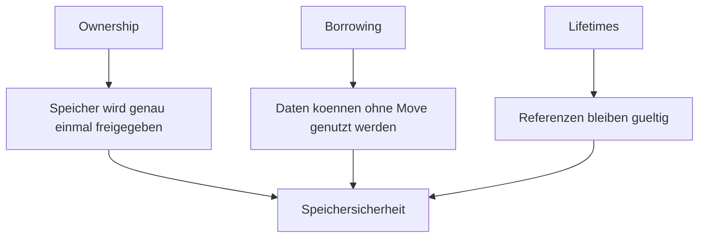

# Kapitel 21: Zusammenfassung & Ausblick Speicherverwaltung

> [!IMPORTANT]
> Dieses Kapitel ist eine Wiederholungs- und Brückeneinheit. Es führt keine große neue Syntax ein, sondern ordnet Ownership, Borrowing, Referenzen und Lifetimes zu einem belastbaren Gesamtmodell.

## 21.1 Lernziele & Lernplan

Nach diesem Kapitel können Sie:

- Ownership, Borrowing und Lifetimes als zusammenhängendes Speichermodell erklären;
- entscheiden, ob eine Funktion Besitz, eine unveränderliche Referenz oder eine veränderliche Referenz annehmen sollte;
- typische Speicherfehler anderer Sprachen benennen und Rusts Gegenmaßnahmen zuordnen;
- einfachen Rust-Code anhand von Stack, Heap, Drop und Move analysieren;
- sich auf die nächsten Themen Slices, Structs, Enums und Collections vorbereiten.

Lernplan:

| Phase | Inhalt | Ziel |
|---|---|---|
| Rückblick | Ownership, Borrowing, Lifetimes | Begriffe stabilisieren |
| Problem | Warum Speicherverwaltung schwierig ist | Motivation erneuern |
| Fehler | Zu viel Besitz in Funktionssignaturen | API-Design verbessern |
| Lösung | Entscheidungsbaum für Parameter | Praktisch anwenden |
| Ausblick | Slices und eigene Datentypen | Nächste Kapitel vorbereiten |

## 21.2 Die Definition

Rusts **Speicherverwaltungsmodell** ist ein statisches Regelsystem, das zur Compilezeit festlegt, welcher Wert welchen Speicher besitzt, wer diesen Speicher vorübergehend nutzen darf und wann der Speicher automatisch freigegeben wird.

Die drei Kernbegriffe:

| Begriff | Kurzdefinition |
|---|---|
| Ownership | Genau ein Owner ist für die Freigabe eines Wertes verantwortlich. |
| Borrowing | Referenzen erlauben Zugriff ohne Besitzübertragung. |
| Lifetime | Eine Referenz darf nie länger gültig sein als der referenzierte Wert. |

> [!NOTE]
> Rust ersetzt nicht Denken durch Magie. Rust zwingt Sie, Besitzverhältnisse präzise auszudrücken. Genau dadurch werden viele Fehler früh sichtbar.

## 21.3 Das Problem & die Motivation

Speicherverwaltung ist schwierig, weil Programme gleichzeitig effizient, korrekt und wartbar sein sollen. In der Praxis scheitern viele Fehler an drei Stellen:

- Ein Wert wird zu früh freigegeben und später weiterverwendet.
- Ein Wert wird mehrfach freigegeben.
- Ein Wert wird gleichzeitig gelesen und verändert, ohne klare Koordination.

Garbage-Collector-Sprachen reduzieren viele dieser Risiken, verschieben Kosten aber in die Laufzeit. Manuelle Speicherverwaltung ist sehr effizient, aber fehleranfällig. Rusts Modell ist eine produktive Mitte: klare Regeln, statische Prüfung, automatische Freigabe am Scope-Ende.

## 21.4 Der naive Versuch

Ein Anfänger schreibt Funktionen oft so, dass sie Besitz übernehmen, obwohl sie nur lesen:

```rust
fn drucke_bericht(titel: String, punkte: Vec<i32>) {
    println!("Bericht: {titel}");
    println!("Anzahl Messpunkte: {}", punkte.len());
}

fn main() {
    let titel = String::from("Messung A");
    let punkte = vec![10, 20, 30];

    drucke_bericht(titel, punkte);

    println!("Titel erneut: {titel}");
    println!("Punkte erneut: {}", punkte.len());
}
```

Zeile-für-Zeile:

| Zeile | Erklärung |
|---|---|
| `titel: String` | Die Funktion verlangt Ownership am Titel. |
| `punkte: Vec<i32>` | Die Funktion verlangt Ownership am Vektor. |
| `drucke_bericht(titel, punkte)` | Beide Heap-Werte werden in die Funktion verschoben. |
| spätere `println!` | Beide ursprünglichen Variablen sind ungültig. |

EVA-Analyse:

| Phase | Beschreibung |
|---|---|
| Eingabe | Zwei besitzende Heap-Typen werden übergeben. |
| Verarbeitung | Die Funktion liest nur Daten und druckt sie. |
| Ausgabe | Keine Rückgabe; am Ende werden Titel und Vektor gedroppt. |

## 21.5 Die Anatomie des Fehlers

Der Compiler meldet sinngemäß:

```text
error[E0382]: borrow of moved value: `titel`
error[E0382]: borrow of moved value: `punkte`
```

Speicherbild:

```text
Vor dem Aufruf:

Stack                         Heap
titel: ptr,len,cap -------->  "Messung A"
punkte: ptr,len,cap ------->  [10, 20, 30]

Nach drucke_bericht(titel, punkte):

drucke_bericht besitzt beide Werte.
Am Funktionsende werden beide Heap-Puffer freigegeben.
main darf die alten Bindings nicht mehr verwenden.
```

Der Entwurfsfehler liegt in der Signatur. Die Funktion liest nur, verlangt aber Besitz. Die Signatur verspricht also mehr Zugriff, als fachlich nötig ist.

> [!WARNING]
> Wenn eine Funktion einen Wert nicht speichern, nicht zurückgeben und nicht verbrauchen muss, sollte sie meist keinen Besitz übernehmen.

## 21.6 Die Lösung

Die Funktion nimmt Referenzen:

```rust
fn drucke_bericht(titel: &str, punkte: &[i32]) {
    println!("Bericht: {titel}");
    println!("Anzahl Messpunkte: {}", punkte.len());
}

fn main() {
    let titel = String::from("Messung A");
    let punkte = vec![10, 20, 30];

    drucke_bericht(&titel, &punkte);

    println!("Titel erneut: {titel}");
    println!("Punkte erneut: {}", punkte.len());
}
```

Warum der Compiler dies akzeptiert:

- `&str` liest Text, ohne den `String` zu besitzen.
- `&[i32]` liest eine Sequenz, ohne den `Vec<i32>` zu besitzen.
- Die Funktion speichert keine Referenzen dauerhaft.
- Nach dem Funktionsaufruf bleiben `titel` und `punkte` Owner ihrer Heap-Daten.

Entscheidungsbaum für Funktionsparameter:

| Frage | Parameterform |
|---|---|
| Muss die Funktion den Wert verbrauchen, speichern oder zurückgeben? | `T` |
| Muss die Funktion nur lesen? | `&T`, bei Text meist `&str`, bei Listen meist `&[T]` |
| Muss die Funktion den vorhandenen Wert ändern? | `&mut T` |
| Soll eine eigene unabhängige Kopie entstehen? | `T: Clone` bewusst klonen |

## 21.7 Kleines Tutorial: Speicherbewusstes API-Design

Sie bauen eine kleine Analysefunktion für Messwerte.

### Schritt 1: Pseudocode

```text
FUNKTION durchschnitt(werte):
    wenn werte leer ist: gib None zurueck
    summiere alle Werte
    teile Summe durch Anzahl
    gib Some(Durchschnitt) zurueck
```

### Schritt 2: Rust-Code

```rust
fn durchschnitt(werte: &[i32]) -> Option<f64> {
    if werte.is_empty() {
        return None;
    }

    let summe: i32 = werte.iter().sum();
    Some(summe as f64 / werte.len() as f64)
}

fn fuege_messwert_hinzu(werte: &mut Vec<i32>, wert: i32) {
    werte.push(wert);
}

fn main() {
    let mut messwerte = vec![10, 20, 30];

    let vorher = durchschnitt(&messwerte);
    fuege_messwert_hinzu(&mut messwerte, 40);
    let nachher = durchschnitt(&messwerte);

    println!("Vorher: {vorher:?}");
    println!("Nachher: {nachher:?}");
    println!("Daten: {messwerte:?}");
}
```

### Schritt 3: Analyse

| Code | Speicherverhalten |
|---|---|
| `durchschnitt(&messwerte)` | Erstellt eine lesende Slice-Referenz auf die Vektor-Daten. |
| `werte.iter().sum()` | Iteriert ohne Ownership der Elemente zu übernehmen. |
| `fuege_messwert_hinzu(&mut messwerte, 40)` | Leiht den Vektor exklusiv aus und kann den Heap-Puffer verändern. |
| `println!("{messwerte:?}")` | Der Owner ist weiterhin in `main`. |

EVA:

| Phase | `durchschnitt` |
|---|---|
| Eingabe | `&[i32]`, eine nicht besitzende Sicht auf Messwerte. |
| Verarbeitung | Leerprüfung, Summe, Division. |
| Ausgabe | `Option<f64>`, weil ein leerer Durchschnitt nicht definiert ist. |

## 21.8 Mentale Modelle & Deep Dive

### Das Dreigestirn



### Stack, Heap und Drop

```text
Stack speichert:
- lokale Zahlen
- Boolesche Werte
- Pointer/Len/Capacity von String und Vec

Heap speichert:
- dynamisch lange Texte
- dynamisch lange Listen
- Daten, deren Groesse zur Laufzeit waechst

Drop passiert:
- automatisch am Ende des Scopes
- genau fuer den aktuellen Owner
- in umgekehrter Reihenfolge der Erstellung
```

### Copy vs. Move

| Typ | Verhalten bei Zuweisung | Grund |
|---|---|---|
| `i32` | Copy | Feste kleine Stack-Daten. |
| `bool` | Copy | Feste kleine Stack-Daten. |
| `String` | Move | Besitzt Heap-Speicher. |
| `Vec<T>` | Move | Besitzt Heap-Speicher. |
| `&T` | Copy | Referenzen selbst sind kleine Zeigerwerte. |

## 21.9 Drei praktische Übungen

### Übung 1: Leicht - Signatur korrigieren

Ändern Sie diese Funktion so, dass `name` nach dem Aufruf weiterverwendet werden kann:

```rust
fn begruesse(name: String) {
    println!("Hallo, {name}");
}
```

Lösungshinweis: Die Funktion muss nur lesen.

### Übung 2: Mittel - Statistik ohne Move

Schreiben Sie:

```rust
fn minimum(werte: &[i32]) -> Option<i32>
```

Anforderungen:

- Leere Eingabe ergibt `None`.
- `[3, 1, 9]` ergibt `Some(1)`.
- Der ursprüngliche Vektor bleibt verwendbar.

Lösungshinweis: Nutzen Sie `iter().min()` und kopieren Sie den gefundenen `i32`.

### Übung 3: Schwer - API-Entscheidung begründen

Entwerfen Sie drei Funktionen:

```rust
fn lese(text: &str)
fn erweitere(text: &mut String)
fn verbrauche(text: String)
```

Aufgabe:

- Schreiben Sie je einen sinnvollen Funktionskörper.
- Erklären Sie, warum jede Funktion genau diese Parameterform nutzt.
- Zeigen Sie in `main`, wann welche Funktion aufgerufen werden darf.

Lösungshinweis: Formulieren Sie zuerst fachlich, ob gelesen, verändert oder verbraucht wird.

## 21.10 Lernstrategie, Selbsteinschätzung & Merkzettel

### Cheat Sheet

| Absicht | Rust-Form |
|---|---|
| Wert besitzen | `T` |
| Wert lesen | `&T` |
| Text lesen | `&str` |
| Sequenz lesen | `&[T]` |
| Wert verändern | `&mut T` |
| Wert kopieren | `clone()` bewusst verwenden |
| Automatisch freigeben | Scope-Ende und `Drop` |

### Active Recall

1. Warum ist ein Move bei `String` anders als eine Kopie bei `i32`?
2. Welche drei Fragen stellen Sie vor jeder Funktionssignatur?
3. Warum sind Slices ein natürlicher nächster Schritt nach Borrowing?
4. Was garantiert `Drop`?
5. Warum ist `clone()` kein Fehler, aber eine bewusste Entscheidung?

### Feynman-Methode

Schreiben Sie in drei Sätzen: Wer besitzt Daten, wer darf sie lesen, wer darf sie verändern?

### Gezielte Fehlerprovokation

Ändern Sie `durchschnitt(werte: &[i32])` zu `durchschnitt(werte: Vec<i32>)`. Beobachten Sie, welche Aufrufe danach Moves erzeugen und welche Variablen nicht mehr verwendbar sind.

### Selbsttest

Sie sind bereit für Kapitel 22 bis 25, wenn Sie:

- `T`, `&T` und `&mut T` bewusst wählen;
- Stack- und Heap-Anteile eines `String` beschreiben;
- einen Move-Fehler aus einer Funktionssignatur ableiten;
- erklären, warum Slices sicherer sind als lose Indexwerte.

## 21.11 Zusammenfassung

- Ownership beantwortet die Frage: Wer gibt Speicher frei?
- Borrowing beantwortet die Frage: Wer darf vorübergehend zugreifen?
- Lifetimes beantworten die Frage: Wie lange ist eine Referenz gültig?
- Gute Rust-APIs drücken ihre tatsächliche Absicht in der Signatur aus.
- `&str` und `&[T]` sind flexible Lesesichten auf Daten.
- Die nächsten Kapitel übertragen dieses Modell auf Arbeitsabläufe, Lernstrategien, Projektqualität und Slices.

---

**Lizenz- und Attributionshinweis**:
Teile dieses Kapitels basieren auf Übersetzungen und didaktischen Anpassungen des offiziellen Buches [The Rust Programming Language](https://doc.rust-lang.org/book/) von Steve Klabnik und Carol Nichols (sowie Beiträgen der Rust-Community), lizenziert unter [MIT](https://opensource.org/licenses/MIT) und [Apache 2.0](https://www.apache.org/licenses/LICENSE-2.0).
