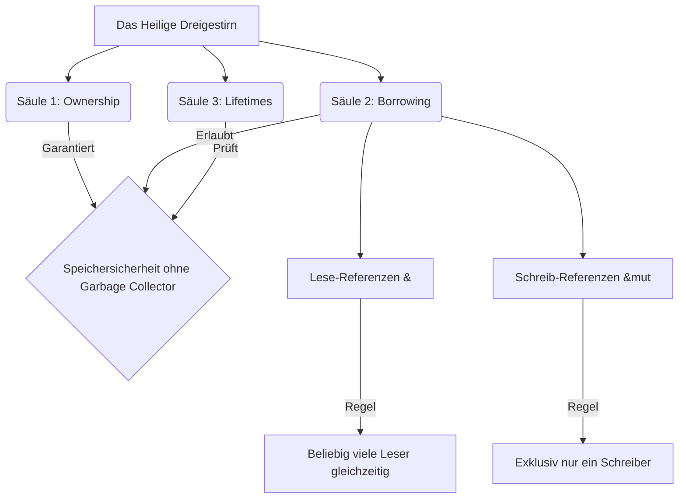

# Kapitel 21: Zusammenfassung der Grundlagen & Das "Heilige Dreigestirn"

Herzlichen Glückwunsch! Wenn du an diesem Punkt angelangt bist, hast du das Fundament der Programmiersprache Rust erfolgreich erlernt. Du hast die grundlegenden Programmierkonzepte verinnerlicht und die berühmt-berüchtigte Speicherverwaltung von Rust verstanden.

*Hinweis: Komplexe Datenstrukturen wie **Strukturen (Structs)** und dynamische Listen (**Vektoren**) haben wir in diesem Kurs bis jetzt noch nicht gelernt. Das ist Absicht! Diese fortgeschrittenen Themen folgen in den nächsten Kapiteln. In diesem Kapitel fassen wir nur das zusammen, was wir bisher gelernt haben, und nutzen für die Projekte ausschließlich Variablen, Arrays, Tupel, Strings und Referenzen.*

Dieses Kapitel zieht ein Fazit über die bisher gelernten Inhalte, präzisiert das Zusammenspiel der wichtigsten Säulen und liefert dir konkrete Projektvorschläge, um dein Wissen in der Praxis zu festigen.

---

## 1. Rückblick: Die Basics (Deine Werkzeuge)

In den ersten Kapiteln haben wir die grundlegenden Bausteine von Rust kennengelernt. Diese Werkzeuge bilden das Fundament für jedes Rust-Programm:

* **Variablen & Scopes (Gültigkeitsbereiche):** Rust-Variablen sind standardmäßig unveränderlich. Mit `let mut` erlaubst du Änderungen. Variablen leben immer nur in dem Block `{}`, in dem sie deklariert wurden.
* **Skalare & zusammengesetzte Datentypen:** Wir unterscheiden einfache Typen wie Ganzzahlen (`i32`, `u64`), Fließkommazahlen (`f64`), Booleans (`bool`) und Zeichen (`char`) von zusammengesetzten Typen wie Arrays (feste Länge, gleicher Typ) und Tupeln (feste Länge, unterschiedliche Typen).
* **Kontrollstrukturen:** Mit `if` und `else` treffen wir Entscheidungen. Das mächtige `match` erlaubt uns den sicheren Musterabgleich (Pattern Matching). Schleifen (`loop`, `while`, `for`) wiederholen Codeblöcke effizient.
* **Funktionen & Operatoren:** Funktionen gliedern unseren Code in wiederverwendbare Blöcke, definieren Parameter und geben Werte zurück. Operatoren ermöglichen mathematische und logische Verknüpfungen.

---

## 2. Das "Heilige Dreigestirn" von Rust (Die wichtigste Hürde)

Rust unterscheidet sich von fast allen anderen Programmiersprachen durch seine Speicherverwaltung. Diese ruht auf drei untrennbaren Säulen – dem sogenannten **"Heiligen Dreigestirn"**. Nimm dir für diese Hürde extra viel Zeit, da sie das Herzstück von Rust bildet:



### Säule 1: Ownership (Besitz)
* **Die Kernfrage:** Wer besitzt die Daten im Speicher?
* **Die 3 Regeln:**
  1. Jeder Wert hat eine Variable, die sein Besitzer (Owner) ist.
  2. Es kann immer nur einen Besitzer zur gleichen Zeit geben.
  3. Verlässt der Besitzer seinen Gültigkeitsbereich (Scope), wird der Wert automatisch und sicher gelöscht (`drop`).
* **Der Move-Effekt:** Übergibst du eine Heap-Variable (wie einen `String`) an eine Funktion oder eine andere Variable, wird das Eigentum verschoben. Die alte Variable ist ab diesem Moment ungültig.

### Säule 2: Borrowing (Ausleihen)
* **Die Kernfrage:** Wie können wir Daten sicher teilen, ohne das Eigentum zu verschieben?
* **Die Lösung:** Wir nutzen **Referenzen** (gekennzeichnet durch das kaufmännische Und `&`). Die Funktion erhält nur die Speicheradresse.
* **Die Regeln des Ausleihens:**
  * **Viele Leser (`&T`):** Du darfst beliebig viele unveränderliche Referenzen gleichzeitig aktiv haben.
  * **Ein Schreiber (`&mut T`):** Du darfst nur eine einzige veränderliche Referenz zur selben Zeit haben. Währenddessen sind keine anderen Referenzen (weder Leser noch Schreiber) erlaubt.
  * **Exklusivität:** Entweder viele Leser ODER ein Schreiber. Niemals beides gleichzeitig!

### Säule 3: Lifetimes (Lebensdauern)
* **Die Kernfrage:** Wie lange bleiben Referenzen im Speicher gültig?
* **Das Ziel:** Rust garantiert, dass eine Referenz niemals auf gelöschten Speicher zeigt (Vermeidung von *Dangling References* / Totzeigern).
* **Die Funktionsweise:** Der Compiler prüft zeilenbasiert (Non-Lexical Lifetimes), ob der Besitzer der Daten mindestens so lange lebt wie die Referenz darauf. Ist das nicht der Fall, bricht der Compiler mit einem Fehler ab.

---

## 3. Ausführliche Merkzettel & Schnellübersichten der Kernkonzepte

Nutze diese ausführlichen Spickzettel, um die wichtigsten Konzepte noch einmal auf einen Blick zu verstehen und als Referenz für deine Programmieraufgaben parat zu haben.

### 📌 Merkzettel A: Variablen & Scopes (Gültigkeitsbereiche)

1. **Warum dieses Konzept? (Motivation):**
   In vielen Sprachen sind Variablen unkontrolliert veränderbar und leben global, was zu schwer auffindbaren Bugs führt. Rust erzwingt standardmäßig Unveränderlichkeit und klare Gültigkeitsgrenzen (Scopes), um Datenflüsse nachvollziehbar zu machen und Speicherlecks zu verhindern.

2. **Schlüsselbegriffe (Definitions):**
   - **Immutability (Unveränderlichkeit):** Ein einmal zugewiesener Wert kann standardmäßig nicht mehr geändert werden.
   - **Mutability (Veränderlichkeit):** Mit `let mut` deklarierte Variablen dürfen ihren Wert ändern (aber nicht ihren Typ!).
   - **Scope (Gültigkeitsbereich):** Der durch geschweifte Klammern `{}` begrenzte Code-Block. Variablen existieren nur innerhalb dieses Blocks.
   - **Shadowing (Beschatten):** Das erneute Deklarieren einer Variablen mit `let` unter demselben Namen im gleichen oder einem inneren Scope. Dies erlaubt es auch, den Typ zu ändern.

3. **Praktische Visualisierung & Code-Beispiel:**
   ```rust
   let x = 5; // Unveränderlich
   // x = 6; // FEHLER!
   
   let mut y = 10; // Veränderlich
   y = 15; // OK!
   
   // Shadowing
   let text = "42"; // Typ: &str
   let text: i32 = text.parse().unwrap(); // Typ: i32 (erfolgreiches Shadowing)
   
   // Scope-Visualisierung:
   { // <-- Scope beginnt
       let im_scope = 100;
       println!("{}", im_scope);
   } // <-- Scope endet. im_scope wird hier gelöscht (drop)
   // println!("{}", im_scope); // FEHLER! im_scope existiert nicht mehr
   ```
   *Visualisierung des Scopes:*
   ```text
   Main-Scope ----------------------------------------------
     | let x = 5;
     | Innerer Scope { ------------------ }
     |   | let im_scope = 100;
     |   | (im_scope lebt)
     | } <-- im_scope stirbt hier!
     | (x lebt weiter)
   ```

4. **Häufiger Anfängerfehler:**
   *Fehlerhafter Code:*
   ```rust
   let x = 5;
   x = x + 1; // Rust verbietet das Ändern von unveränderlichen Variablen
   ```
   *Compiler-Fehler:*
   ```text
   error[E0384]: cannot assign twice to immutable variable `x`
   ```
   *Korrektur:*
   ```rust
   // Entweder: let mut x = 5; x = x + 1;
   // Oder per Shadowing:
   let x = 5;
   let x = x + 1;
   ```

5. **Die goldene Merkregel / Eselsbrücke (Mnemonic):**
   *„Variablen in Rust sind wie in Stein gemeißelt. Willst du sie kneten, musst du `mut` beitreten. Am Ende des Blocks `{}` fällt der Vorhang – die Variablen sterben ohne Erbarmen.“*

---

### 📌 Merkzettel B: Die gelernten Datentypen im Vergleich

1. **Warum dieses Konzept? (Motivation):**
   Computer speichern unterschiedliche Informationen verschieden ab (Zahlen auf dem Stack, Texte variabler Länge auf dem Heap). Zu verstehen, welcher Typ wie viel Speicher belegt und wo er liegt, ist essenziell für die Performance und Speichersicherheit deines Programms.

2. **Schlüsselbegriffe (Definitions):**
   - **Skalare Typen:** Einzelwerte wie Ganzzahlen (`i32`, `u64`), Fließkommazahlen (`f64`), Booleans (`bool`, 1 Byte) und Zeichen (`char`, 4 Byte Unicode).
   - **Zusammengesetzte (Compound) Typen:** Gruppierungen mehrerer Werte.
     - **Array (`[T; N]`):** Feste Länge `N`, alle Elemente vom selben Typ `T`. Liegt auf dem Stack.
     - **Tupel (`(T, U, ...)`):** Feste Länge, Elemente können unterschiedliche Typen haben. Zugriff mit `tupel.0`, `tupel.1`.
   - **Strings (Zeichenketten):**
     - **`String`:** Dynamisch wachsende Zeichenkette auf dem Heap mit Eigentumsanspruch (besitzt den Text).
     - **`&str` (String-Slice):** Ein reiner Verweis (Referenz) auf ein Stück Text (z. B. auf ein Literal im Programmcode oder einen Teil eines `String`). Besitzt keine Daten selbst.

3. **Praktische Visualisierung & Code-Beispiel:**
   ```rust
   let alter: u8 = 25; // Skalar (Ganzzahl, 1 Byte)
   let note: f64 = 1.3; // Skalar (Fließkommazahl)
   let aktiv: bool = true; // Skalar (Boolean)
   let buchstabe: char = 'R'; // Skalar (Unicode, 4 Byte)

   let koordinaten: (i32, i32, &str) = (10, 20, "Start"); // Tupel
   let x = koordinaten.0; // Zugriff auf erstes Element (10)

   let monate: [&str; 3] = ["Januar", "Februar", "März"]; // Array

   // String vs &str
   let dynamischer_text: String = String::from("Rust Kurs"); // Liegt auf dem Heap
   let ausschnitt: &str = &dynamischer_text[0..4]; // "Rust" - Verweis auf einen Teil des String
   ```
   *Speicher-Visualisierung von String vs &str:*
   ```text
   STACK:
   [ dynamischer_text ] ---> Zeiger auf Heap: Adresse 0x100, Länge: 9, Kapazität: 9
   [ ausschnitt       ] ---> Zeiger auf Heap: Adresse 0x100, Länge: 4 (nur "Rust")

   HEAP:
   Adresse 0x100: [ 'R', 'u', 's', 't', ' ', 'K', 'u', 'r', 's' ]
   ```

4. **Häufiger Anfängerfehler:**
   *Fehlerhafter Code:*
   ```rust
   let mut text: &str = "Hallo";
   text.push_str(" Welt"); // Fehler! &str hat keine feste Heap-Kapazität zum Wachsen.
   ```
   *Compiler-Fehler:*
   ```text
   error[E0599]: no method named `push_str` found for reference `&str` in the current scope
   ```
   *Korrektur:*
   ```rust
   let mut text: String = String::from("Hallo");
   text.push_str(" Welt"); // Erlaubt, da String dynamisch auf dem Heap wachsen kann.
   ```

5. **Die goldene Merkregel / Eselsbrücke (Mnemonic):**
   *„Arrays und Tupel haben feste Ketten, sie liegen brav auf Stack-Betten. Ein `String` gehört dir ganz allein und darf auf dem Heap dynamisch sein; ein `&str` schaut nur kurz hinein und muss als Gast bescheiden sein.“*

---

### 📌 Merkzettel C: Kontrollstrukturen als Ausdrücke (Expressions)

1. **Warum dieses Konzept? (Motivation):**
   In traditionellen Sprachen sind `if-else` und `match` reine Anweisungen (Statements), die nur Code ausführen, aber keinen Wert zurückliefern. In Rust ist fast alles ein Ausdruck (Expression). Das macht Code kürzer, sicherer und verhindert uninitialisierte Variablen.

2. **Schlüsselbegriffe (Definitions):**
   - **Statement (Anweisung):** Führt eine Aktion aus und gibt *keinen* Wert zurück (endet fast immer mit einem Semikolon `;`).
   - **Expression (Ausdruck):** Berechnet einen Wert und gibt diesen zurück (darf am Ende eines Blocks kein Semikolon `;` haben, um den Wert zurückzuliefern).
   - **Pattern Matching (`match`):** Ein mächtiger Kontrollfluss, der einen Wert mit Mustern vergleicht. Muss zwingend vollständig (*exhaustive*) sein.

3. **Praktische Visualisierung & Code-Beispiel:**
   ```rust
   // if-else als Ausdruck
   let alter = 18;
   let status = if alter >= 18 {
       "Volljährig" // Kein Semikolon! Wert wird zurückgegeben
   } else {
       "Minderjährig" // Kein Semikolon! Typen in beiden Zweigen müssen identisch sein
   };

   // match als Ausdruck
   let note = 2;
   let bewertung = match note {
       1 => "Sehr gut",
       2 => "Gut",
       3 => "Befriedigend",
       4 => "Ausreichend",
       _ => "Nicht bestanden", // Fallback (Unterstrich) fängt alle anderen Fälle ab
   }; // Semikolon schließt die Zuweisung ab
   ```

4. **Häufiger Anfängerfehler:**
   *Fehlerhafter Code:*
   ```rust
   let note = 3;
   let ergebnis = match note {
       1 => "Bestanden",
       2 => "Bestanden",
       3 => "Bestanden"
       // Fehler: Was passiert bei 4, 5, 6 oder anderen Zahlen? Nicht vollständig!
   };
   ```
   *Compiler-Fehler:*
   ```text
   error[E0004]: non-exhaustive patterns: `_` not covered
   ```
   *Korrektur:*
   ```rust
   let ergebnis = match note {
       1..=3 => "Bestanden",
       _ => "Nicht bestanden", // Der Fallback deckt alles andere ab
   };
   ```

5. **Die goldene Merkregel / Eselsbrücke (Mnemonic):**
   *„Ist das Semikolon fort, fließt der Wert zum Zuweisungsort. Und beim `match` gilt: Vergiss nie den Unterstrich `_`, sonst lässt der Compiler dich im Stich!“*

---

### 📌 Merkzettel D: Die Ownership-Gesetze (Besitz)

1. **Warum dieses Konzept? (Motivation):**
   In anderen Sprachen muss man Speicher entweder manuell verwalten (Risiko von Abstürzen und Speicherlecks in C/C++) oder eine automatische Müllabfuhr (Garbage Collector in Java/Python) bremst das Programm aus. Rusts Ownership-System garantiert Speichersicherheit zur Kompilierzeit ohne jeglichen Performance-Verlust.

2. **Schlüsselbegriffe (Definitions):**
   - **Owner (Besitzer):** Die Variable, die für das Freigeben eines Werts zuständig ist.
   - **Move (Verschieben):** Bei Typen auf dem Heap (z. B. `String`) wird bei Zuweisung oder Übergabe das Eigentum übertragen. Die alte Variable ist danach tot.
   - **Copy (Kopieren):** Typen, die komplett auf dem Stack liegen (z. B. `i32`, `bool`, Arrays aus Stack-Typen), werden automatisch kopiert. Beide Variablen bleiben voll funktionsfähig.
   - **Drop:** Die automatische Speicherfreigabe, sobald die Besitzer-Variable ihren Scope verlässt.

3. **Praktische Visualisierung & Code-Beispiel:**
   ```rust
   // MOVE BEISPIEL (Heap-Daten)
   let s1 = String::from("Hallo");
   let s2 = s1; // Eigentum verschoben (Move) von s1 nach s2
   // println!("{}", s1); // FEHLER! s1 hat keinen Inhalt mehr

   // COPY BEISPIEL (Stack-Daten)
   let x = 42;
   let y = x; // Wert wird kopiert (Copy)
   println!("x: {}, y: {}", x, y); // OK! Beide sind gültig.
   ```
   *Visualisierung eines Moves:*
   ```text
   Vor dem Move:
   s1 (Besitzer) ---> [ "Hallo" (auf dem Heap) ]

   Nach dem Move (let s2 = s1;):
   s1 (ungültig!)
   s2 (Besitzer) ---> [ "Hallo" (auf dem Heap) ]
   ```

4. **Häufiger Anfängerfehler:**
   *Fehlerhafter Code:*
   ```rust
   fn gruesse(name: String) {
       println!("Hallo {}", name);
   }

   fn main() {
       let mein_name = String::from("Thorsten");
       gruesse(mein_name); // Move! Eigentum an gruesse() übergeben
       println!("Erneut: {}", mein_name); // FEHLER! mein_name ist ungültig
   }
   ```
   *Compiler-Fehler:*
   ```text
   error[E0382]: borrow of moved value: `mein_name`
   ```
   *Korrektur:*
   Verwende Referenzen (Borrowing), anstatt das Eigentum zu übergeben (siehe Merkzettel E):
   ```rust
   fn gruesse(name: &String) {
       println!("Hallo {}", name);
   }

   fn main() {
       let mein_name = String::from("Thorsten");
       gruesse(&mein_name); // Ausleihen statt schenken!
       println!("Erneut: {}", mein_name); // OK!
   }
   ```

5. **Die goldene Merkregel / Eselsbrücke (Mnemonic):**
   *„Eigentum ist exklusiv: Es kann nur einen geben! Schenkst du Heap-Daten weg (Move), verliert deine alte Variable ihr Leben. Stack-Daten hingegen klonen sich im Nu (Copy) – da guckt keine Variable traurig zu.“*

---

### 📌 Merkzettel E: Die Borrowing-Regeln (Ausleihen)

1. **Warum dieses Konzept? (Motivation):**
   Wenn wir Daten nicht ständig kopieren oder das Eigentum verschieben wollen, müssen wir sie ausleihen. Um jedoch unkontrolliertes gleichzeitiges Schreiben und Lesen (was zu undefiniertem Verhalten und Speicherfehlern führt) zu verhindern, erzwingt Rust strikte Spielregeln für Referenzen.

2. **Schlüsselbegriffe (Definitions):**
   - **Referenz (`&`):** Ein Zeiger auf einen Wert, der dem Aufrufer gehört.
   - **Unveränderliche Referenz (`&T`):** Erlaubt nur das Lesen der Daten (Read-Only). Mehrere Leser sind gleichzeitig erlaubt.
   - **Veränderliche Referenz (`&mut T`):** Erlaubt das Lesen und Schreiben (Read-Write). Es darf nur einen einzigen Schreiber geben, und keine Leser parallel dazu.
   - **Aliasing-Konflikt:** Gleichzeitiger Zugriff auf dieselbe Speicheradresse über verschiedene Namen (Aliase), wenn mindestens einer davon schreibt.

3. **Praktische Visualisierung & Code-Beispiel:**
   ```rust
   let mut daten = 10;

   // Szenario 1: Mehrere unveränderliche Referenzen (Leser)
   let r1 = &daten;
   let r2 = &daten;
   println!("r1: {}, r2: {}", r1, r2); // OK! (Beliebig viele Leser)

   // Szenario 2: Eine veränderliche Referenz (Schreiber)
   let r_mut = &mut daten;
   *r_mut += 5; // Zugriff über Dereferenzierung (`*`)
   println!("Neu: {}", r_mut); // OK! (Genau ein Schreiber)
   ```
   *Zusammenfassende Regel:*
   ```text
   Erlaubt:  [ &T ] + [ &T ] + [ &T ]  (Unbegrenzt viele Leser)
   Erlaubt:  [ &mut T ]                (Exklusiv ein Schreiber)
   Verboten: [ &T ] + [ &mut T ]       (Mischung aus Leser und Schreiber)
   ```

4. **Häufiger Anfängerfehler:**
   *Fehlerhafter Code:*
   ```rust
   let mut zahl = 10;
   let leser = &zahl;
   let schreiber = &mut zahl; // FEHLER! Ein Schreiber darf nicht existieren, während ein Leser aktiv ist.
   println!("Leser sieht: {}", leser);
   ```
   *Compiler-Fehler:*
   ```text
   error[E0502]: cannot borrow `zahl` as mutable because it is also borrowed as immutable
   ```
   *Korrektur:*
   Begrenze die Lebensdauer der Lese-Ausleihe, sodass sie abgeschlossen ist, bevor die veränderliche Ausleihe beginnt:
   ```rust
   let mut zahl = 10;
   let leser = &zahl;
   println!("Leser sieht: {}", leser); // Letzte Nutzung von `leser`

   let schreiber = &mut zahl; // OK! Leser ist nicht mehr aktiv (NLL-Regel)
   *schreiber += 5;
   ```

5. **Die goldene Merkregel / Eselsbrücke (Mnemonic):**
   *„Viele Leser dürfen rein, doch Schreiber müssen einsam sein! Wer liest, will keine Störung spüren. Wer schreibt, darf keine Zeugen führen.“*

---

### 📌 Merkzettel F: Lifetimes (Lebensdauern)

1. **Warum dieses Konzept? (Motivation):**
   Eine der schlimmsten Fehlerquellen in Sprachen wie C++ sind sogenannte *Dangling References* (Totzeiger) – Referenzen auf Daten, die bereits gelöscht wurden. Rusts Compiler analysiert die Lebensdauer (Lifetime) jeder Variablen und stellt sicher, dass kein Verweis jemals ins Leere greift.

2. **Schlüsselbegriffe (Definitions):**
   - **Lifetime (Lebensdauer):** Der genaue Zeitraum (im Code-Ausführungspfad gemessen), in dem eine Variable im Speicher existiert.
   - **Dangling Reference:** Eine Referenz, die auf eine Speicheradresse zeigt, deren Wert bereits freigegeben (dropped) wurde.
   - **Borrow Checker:** Der Teil des Rust-Compilers, der die Gültigkeit von Ausleihen und deren Lebensdauer überwacht.
   - **Non-Lexical Lifetimes (NLL):** Die Fähigkeit des Compilers zu erkennen, dass eine Referenz bereits vor dem Ende ihres umgebenden Blocks nicht mehr genutzt wird. Sie gilt ab diesem Zeitpunkt als inaktiv.

3. **Praktische Visualisierung & Code-Beispiel:**
   ```rust
   let daten_owner = 100;
   let referenz;

   {
       let lokaler_owner = 50;
       // referenz = &lokaler_owner; // FEHLER! lokaler_owner lebt nicht lange genug
   } // lokaler_owner stirbt hier!

   referenz = &daten_owner; // OK! daten_owner lebt mindestens so lange wie referenz
   println!("{}", referenz);
   ```
   *Visualisierung der Lebensdauern (Lebenslinie):*
   ```text
   Zeile 1: let daten_owner = 100;    |=============================| (Lebensdauer A)
   Zeile 2: let referenz;             |
   Zeile 3: {                         |
   Zeile 4:   let lokaler_owner = 50; |             |=========| (Lebensdauer B)
   Zeile 5:   // referenz = ...       |             |
   Zeile 6: } <-- lokaler_owner stirbt!             X
   Zeile 7: referenz = &daten_owner;  |             | (Ausleihe von A)
   Zeile 8: println!("{}", referenz); |             |
   ```
   *Da Lebensdauer B kürzer ist als die Lebensdauer der Referenz auf sie, blockiert Rust den Zugriff.*

4. **Häufiger Anfängerfehler:**
   *Fehlerhafter Code:*
   ```rust
   fn erstelle_referenz() -> &i32 {
       let wert = 42;
       &wert // FEHLER! `wert` wird am Ende der Funktion gelöscht, die Referenz würde ins Leere zeigen.
   }
   ```
   *Compiler-Fehler:*
   ```text
   error[E0515]: cannot return reference to local variable `wert`
   ```
   *Korrektur:*
   Gib den Wert selbst (das Eigentum) zurück, anstatt eine Referenz auf lokale Daten:
   ```rust
   fn erstelle_wert() -> i32 {
       let wert = 42;
       wert // OK! Wert wird per Move/Copy aus der Funktion herausgegeben.
   }
   ```

5. **Die goldene Merkregel / Eselsbrücke (Mnemonic):**
   *„Die Referenz darf niemals länger leben als das Original, andernfalls wird der Zugriff zur Qual. Schenkst du den Wert nach draußen her, freut sich der Compiler gar sehr.“*

---

## 4. 40 Projektvorschläge zur Festigung der Grundlagen

Um deine Programmierfähigkeiten praktisch zu festigen, findest du hier **40 verschiedene Projektvorschläge**. Alle Projekte kommen komplett **ohne** Structs und Vektoren aus. Sie nutzen ausschließlich Arrays, Tupel, Strings, Schleifen, Mustermatching und Referenzen.

---

### 💡 Leitfaden für Projektbasiertes Lernen (Wie du diese Projekte meisterst)

Das bloße Lesen von Code oder theoretischen Beispielen reicht nicht aus, um Rust zu erlernen. **Projektbasiertes Lernen** ist der effektivste Weg, da du durch das Schreiben von eigenem Code gezwungen bist, dich intensiv mit dem Compiler und dem Speicherverhalten von Rust auseinanderzusetzen.

Nutze diesen 4-Schritte-Prozess für jedes der folgenden Projekte:

#### 1. Schritt: Planung & Pseudocode (Zuerst denken, dann tippen)
* Beginne **nicht** direkt mit dem Schreiben von Rust-Code.
* Schreibe dir stichpunktartig auf Deutsch oder als Pseudocode auf, wie das Programm ablaufen soll:
  - Welche Daten müssen gespeichert werden? (z. B. ein Array von Zahlen, ein String für Text).
  - Welche Entscheidungen müssen getroffen werden? (`if-else` oder `match`).
  - Welche Schleifen werden benötigt?

#### 2. Schritt: Das MVP bauen (Minimal Viable Product)
* Schreibe zuerst die einfachste funktionierende Version deines Programms direkt in die `main`-Funktion.
* Verzichte in diesem ersten Schritt auf komplexe Strukturierung (keine Hilfsfunktionen, keine komplizierten Referenzen). Das Ziel ist es, die Programmlogik zum Laufen zu bringen.

#### 3. Schritt: Refactoring & modularer Code (Auslagern in Funktionen)
* Sobald dein MVP läuft, strukturiere den Code um:
  - Lagere logische Blöcke (z. B. Berechnungen, Menüanzeigen, Eingabeüberprüfungen) in eigene Hilfsfunktionen aus.
  - **Jetzt kommt Rust ins Spiel:** Übergib deine Daten an diese Funktionen. Überlege dir genau: Muss die Funktion den Wert besitzen (Move) oder reicht eine Lese-Referenz (`&T`) oder veränderliche Schreib-Referenz (`&mut T`)?
  - Halte dich an das Prinzip: **So restriktiv wie möglich ausleihen.** Wenn eine Funktion den Wert nur ausgeben muss, reicht eine unveränderliche Ausleihe (`&`).

#### 4. Schritt: Den Compiler als Partner nutzen (Der Debugging-Zyklus)
* Wenn der Compiler (besonders der Borrow Checker) Fehlermeldungen ausgibt:
  - Lies die Fehlermeldung aufmerksam durch. Rust-Fehlermeldungen sind extrem detailliert, zeigen exakt auf die Stelle im Code, an der die Ausleihe scheitert, und bieten oft bereits Korrekturvorschläge an.
  - Verwende dein Wissen aus den Spickzetteln (Merkzettel E & F), um Aliasing-Konflikte (gleichzeitiges Lesen und Schreiben) oder Lifetime-Probleme zu lösen.
  - Nutze KI-Tools wie Copilot oder `agy` nur als Mentoren, indem du Fragen stellst wie: *"Warum meckert der Compiler an dieser Stelle und wie kann ich meine Referenzen umstrukturieren?"* statt den kompletten Code neu generieren zu lassen.


---

### 🛠️ Coding-Challenge-Plattformen & Software für Rust

Neben unseren 40 Projektvorschlägen gibt es hervorragende Software-Tools und interaktive Plattformen, die speziell darauf ausgelegt sind, dir durch kleine Coding-Challenges die Rust-Syntax und das Ownership-System spielerisch beizubringen.

Diese drei Plattformen sind besonders empfehlenswert für deinen aktuellen Lernstand:

#### 1. Rustlings (Die offizielle Übungs-Software)
* **Was es ist:** Das offizielle interaktive Kommandozeilen-Tool (CLI) des Rust-Teams. Es führt dich durch Hunderte von kleinen, absichtlich fehlerhaften Code-Dateien, die du reparieren musst.
* **Warum es genial ist:** Du installierst es lokal und arbeitest direkt in deinem eigenen Code-Editor. Es reagiert in Echtzeit auf jede Code-Änderung und gibt dir direkt Compiler-Feedback.
* **So startest du:**
  1. Öffne dein Terminal und führe den Installationsbefehl aus:
     ```bash
     curl -L https://raw.githubusercontent.com/rust-lang/rustlings/main/install.sh | bash
     # Oder über Cargo:
     cargo install rustlings
     ```
  2. Initialisiere Rustlings und starte die Software:
     ```bash
     rustlings watch
     ```
  3. Löse die Übungen Schritt für Schritt in deinem Editor.

#### 2. Exercism (Rust-Lernpfad mit echtem Feedback)
* **Was es ist:** Eine kostenlose Open-Source-Plattform mit einem eigenen, strukturierten Rust-Pfad (Rust Track) mit über 140 Übungen.
* **Warum es genial ist:** Jede Aufgabe wird lokal auf deinem PC gelöst und mit `cargo test` geprüft. Das Besondere: Nach dem Einreichen deiner Lösung kannst du kostenloses Feedback von erfahrenen, echten Rust-Mentoren anfordern, die deinen Code auf "Rust-Idiome" (Best Practices) prüfen.
* **So startest du:**
  1. Erstelle einen Account auf [exercism.org](https://exercism.org).
  2. Installiere das Exercism-CLI auf deinem PC (oder nutze den Online-Editor).
  3. Lade eine Aufgabe herunter, löse sie in VS Code und lade sie hoch:
     ```bash
     exercism submit src/lib.rs
     ```

#### 3. Codewars (Spielerische Algorithmen-Herausforderungen)
* **Was es ist:** Eine spielerische Online-Plattform, auf der du Programmierrätsel (genannt *Katas*) in verschiedenen Schwierigkeitsstufen (von 8 kyu bis 1 kyu) löst.
* **Warum es genial ist:** Perfekt, um deine Syntaxkenntnisse, Schleifen, Kontrollstrukturen und String-Verarbeitung in Rust im Browser zu trainieren. Nach dem Lösen eines Rätsels kannst du die Lösungen anderer Entwickler sehen, was extrem lehrreich ist, um elegante Rust-Einzeiler zu verstehen.
* **So startest du:**
  - Registriere dich auf [codewars.com](https://www.codewars.com), wähle Rust als deine Hauptsprache aus und löse die Einstiegs-Herausforderungen.

---

### Kategorie I: Mathematische & Logische Helfer

#### 1. Notenrechner (Grades Calculator)
* **Ziel:** Berechne den Durchschnitt, die beste und die schlechteste Note aus einer festen Liste.
* **Lerneffekt:** Umgang mit Arrays (`[u32; 10]`), Schleifen (`for`) zur Werteermittlung und Fließkommakonvertierungen.

#### 2. Einmaleins-Tabelle (Multiplication Table)
* **Ziel:** Gib ein formatiertes 10x10-Einmaleins-Gitter in der Konsole aus.
* **Lerneffekt:** Verschachtelte Schleifen (`for` in `for`) und die Formatierung von Ausgaben mittels `print!`.

#### 3. Zahlen-Konverter (Dezimal zu Binär)
* **Ziel:** Konvertiere eine Dezimalzahl in ihre binäre Darstellung als String.
* **Lerneffekt:** Mathematische Operationen (Modulo, Division) und String-Manipulationen (`push_str`).

#### 4. Primzahl-Tester
* **Ziel:** Prüfe, ob eine Zahl eine Primzahl ist, und finde alle Primzahlen in einem bestimmten Bereich.
* **Lerneffekt:** Schleifensteuerung mit `break` und logische Bedingungen.

#### 5. BMI-Rechner (Body Mass Index)
* **Ziel:** Berechne den BMI aus Gewicht und Größe und stufe das Ergebnis per Mustermatch ein.
* **Lerneffekt:** Mathematische Berechnungen und die Auswertung von Bereichen mittels `match`.

#### 6. Fibonacci-Generator
* **Ziel:** Berechne die ersten 20 Fibonacci-Zahlen und speichere sie in einem Array.
* **Lerneffekt:** Array-Indizierung, mutable Variablen und die Zuweisung von Werten in Schleifen.

#### 7. Zinseszins-Rechner
* **Ziel:** Berechne das Kapitalwachstum über 10 Jahre hinweg bei einem festen Zinssatz.
* **Lerneffekt:** Umgang mit Fließkommazahlen (`f64`), Exponenten und formatierten Tabellenausgaben.

#### 8. Temperatur-Konverter
* **Ziel:** Konvertiere Temperaturen per Konsolen-Eingabemenü zwischen Celsius, Fahrenheit und Kelvin.
* **Lerneffekt:** Textmenüs, Benutzereingaben (`std::io::stdin`) und Kontrollflüsse.

#### 9. Kredit-Tilgungsrechner
* **Ziel:** Berechne die monatliche Rate und die Restschuld eines Kredits über eine feste Laufzeit.
* **Lerneffekt:** Finanzmathematik in Rust und Schleifenauswertungen.

#### 10. Statistik-Rechner (Median & Modus)
* **Ziel:** Berechne den Median und den am häufigsten vorkommenden Wert (Modus) eines sortierten Arrays.
* **Lerneffekt:** Array-Zugriffe und Algorithmen zur Häufigkeitszählung ohne Vektoren.

---

### Kategorie II: Spiele & Unterhaltung

#### 11. Zahlenraten (Guessing Game)
* **Ziel:** Der Spieler muss eine vom Programm vorgegebene Zahl erraten. Das Programm gibt Tipps ("Zu hoch", "Zu niedrig").
* **Lerneffekt:** Endlosschleifen (`loop`), Benutzereingabe und Mustervergleich mit `match`.

#### 12. Text-Adventure (Zimmer-Wechsel)
* **Ziel:** Der Spieler navigiert über Richtungsbefehle ("Norden", "Süden") durch 3 Zimmer (gespeichert im Array).
* **Lerneffekt:** Positionsverwaltung mit Indizes, String-Vergleiche und Zustandssteuerung.

#### 13. Schere, Stein, Papier (Rock, Paper, Scissors)
* **Ziel:** Spiele Schere, Stein, Papier gegen den Computer. Das Ergebnis (Spielstand) wird in einem Tupel gespeichert.
* **Lerneffekt:** Tupel zur Datenbündelung (`(u32, u32)` für Siege/Niederlagen) und Zufalls-Simulation per Modulo-Zeitwert.

#### 14. Münzwurf-Simulator
* **Ziel:** Simuliere 100 Münzwürfe und gib die statistische Verteilung von "Kopf" oder "Zahl" aus.
* **Lerneffekt:** Generierung von Pseudo-Zufallswerten, Zähler-Variablen und Prozentrechnung.

#### 15. Tic-Tac-Toe Spielfeld-Visualisierer
* **Ziel:** Verwalte ein 3x3 Tic-Tac-Toe-Spielfeld in einem zweidimensionalen Array (`[[char; 3]; 3]`) und zeichne es in der Konsole.
* **Lerneffekt:** Mehrdimensionale Arrays und geschachtelte Schleifen.

#### 16. Galgenmännchen (Hangman - vereinfacht)
* **Ziel:** Der Spieler muss ein Wort erraten, indem er einzelne Buchstaben eingibt.
* **Lerneffekt:** String-Slices, Arbeiten mit `char`-Arrays und Schleifen-Vergleiche.

#### 17. Würfelspiel "Kniffel" (Würfelwurf-Bewerter)
* **Ziel:** Würfle 5 Würfel (Array) und bewerte, ob ein "Dreierpasch", "Full House" oder "Große Straße" vorliegt.
* **Lerneffekt:** Komplexe `if-else`-Bedingungen auf Arrays und Sortierlogik.

#### 18. RPG Charakter-Generator
* **Ziel:** Generiere die Attribute (Stärke, Geschick, Intelligenz) eines Rollenspielcharakters als Tupel.
* **Lerneffekt:** Tupel-Erstellung und Zugriff auf Tupel-Elemente per Punkt-Syntax (`stats.0`).

#### 19. Simon Says (Farbreihenfolge merken)
* **Ziel:** Das Programm zeigt eine Folge von Farben (Array). Der Spieler muss sie fehlerfrei wiederholen.
* **Lerneffekt:** Vergleich von zwei Arrays und vorzeitiger Schleifenabbruch mit `break`.

#### 20. Labyrinth-Schritt-Simulator (1D)
* **Ziel:** Bewege eine Spielfigur (`'P'`) auf einer Linie (`[char; 10]`) von links nach rechts, ohne in Minen (`'*'`) zu treten.
* **Lerneffekt:** Arrays manipulieren und Positionsgrenzen prüfen.

---

### Kategorie III: Text- & String-Verarbeitung

#### 21. Vokal-Zähler
* **Ziel:** Zähle, wie oft die Vokale (a, e, i, o, u) in einem vom Benutzer eingegebenen Satz vorkommen.
* **Lerneffekt:** Iteration über die Zeichen eines Strings (`.chars()`) und `match`-Abfragen.

#### 22. Text-Zensor (Bad Words Filter)
* **Ziel:** Ersetze verbotene Wörter in einer Nachricht durch `***`. Die verbotenen Wörter liegen in einem Array.
* **Lerneffekt:** String-Methoden (`.replace()`), Slices und veränderliche Referenzen (`&mut String`).

#### 23. Palindrom-Tester
* **Ziel:** Prüfe, ob ein eingegebenes Wort vorwärts und rückwärts dasselbe ergibt (z. B. "Lagerregal").
* **Lerneffekt:** String-Umkehrung, Groß-/Kleinschreibung ignorieren und Zeichenvergleiche.

#### 24. Wort-Umdreher (String Reverser)
* **Ziel:** Kehre die Reihenfolge der Buchstaben in einer Zeichenkette um.
* **Lerneffekt:** String-Manipulationen und Index-Zugriffe von hinten nach vorne.

#### 25. Passwort-Stärke-Prüfer
* **Ziel:** Überprüfe ein Passwort auf Kriterien wie Länge, Zahlen und Sonderzeichen.
* **Lerneffekt:** Analyse von Strings mit Schleifen und Wahrheitswerten (Booleans).

#### 26. Morse-Code-Übersetzer
* **Ziel:** Übersetze einfache Textbuchstaben in Morsezeichen (z. B. `A` $\rightarrow$ `.-`).
* **Lerneffekt:** Zeichenweiser Abgleich mittels `match` und String-Zusammensetzung.

#### 27. URL-Parser (vereinfacht)
* **Ziel:** Zerlege eine URL in ihre Bestandteile (Protokoll, Domain, Pfad) und gib sie als Tupel zurück.
* **Lerneffekt:** String-Slices (`&str`) und String-Suchmethoden (`.find()`).

#### 28. CSV-Zeilen-Formatierer
* **Ziel:** Nimm eine kommagetrennte Zeile (z. B. `"Hans,Meier,30"`) und gib sie lesbar aus.
* **Lerneffekt:** Nutzung der Methode `.split(',')` und Schleifen-Ausgaben.

#### 29. Text-Verschlüsseler (Cäsar-Chiffre)
* **Ziel:** Verschlüssele einen Text, indem du jeden Buchstaben im Alphabet um 3 Stellen verschiebst.
* **Lerneffekt:** Manipulation von ASCII-Zeichencodes (`u8`-Konvertierung) und Typumwandlungen (`as char`).

#### 30. Akronym-Generator
* **Ziel:** Erzeuge die Abkürzung eines Mehrwort-Namens (z. B. "United Nations" $\rightarrow$ "UN").
* **Lerneffekt:** Erkennen von Leerzeichen in Strings und Extrahieren von Anfangsbuchstaben.

---

### Kategorie IV: Simulationen & CLI-Werkzeuge

#### 31. Einkaufszettel mit fester Größe
* **Ziel:** Verwalte eine Einkaufsliste mit maximal 5 Elementen in einem Array von Strings.
* **Lerneffekt:** Arrays mit Heap-Daten (`String`), Einfügen von Elementen per veränderlicher Referenz.

#### 32. Digitaluhr-Simulator
* **Ziel:** Simuliere eine tickende Uhr (Sekunden, Minuten, Stunden) im Sekundentakt auf der Konsole.
* **Lerneffekt:** Endlosschleifen, Textbereinigung der Konsole und Thread-Sleep (`std::thread::sleep`).

#### 33. Wetterstation-Datenlog
* **Ziel:** Speichere 24 Temperaturwerte (ein Tag) und berechne Durchschnitt sowie Temperaturschwankung.
* **Lerneffekt:** Arrays mit Fließkommazahlen und mathematische Min-Max-Algorithmen.

#### 34. Konsolen-Menü-System
* **Ziel:** Erzeuge ein verschachteltes Menüsystem (z. B. 1. Einstellungen, 2. Beenden), durch das der Benutzer navigiert.
* **Lerneffekt:** Zustandsautomaten mit Schleifen und Musterabgleichen.

#### 35. Parkplatz-Manager
* **Ziel:** Verwalte 10 Parkplätze über ein Boolean-Array. Erlaube das Belegen und Freigeben von Parkplätzen per Index.
* **Lerneffekt:** Arrays aus Wahrheitswerten und Zuweisungen über veränderliche Referenzen.

#### 36. Kassenbon-Rechner
* **Ziel:** Lies Preise ein, addiere sie und gib am Ende die Gesamtsumme inklusive 19% Mehrwertsteuer aus.
* **Lerneffekt:** Akkumulatoren-Variablen und Prozentrechnungen.

#### 37. Haushaltsbuch (Budget Tracker)
* **Ziel:** Protokolliere Einnahmen und Ausgaben in einem festen Array und berechne die aktuelle Bilanz.
* **Lerneffekt:** Array-Manipulationen und das Buchen von Beträgen mit Vorzeichenprüfung.

#### 38. Ampel-Steuerung
* **Ziel:** Simuliere den Farbwechsel einer Ampel (Rot $\rightarrow$ Rot-Gelb $\rightarrow$ Grün $\rightarrow$ Gelb) im Terminal.
* **Lerneffekt:** Match-Abfragen über Zustände und Zeitverzögerungen in einer Schleife.

#### 39. Zufallspasswort-Generator
* **Ziel:** Erzeuge ein zufälliges Passwort aus einer vorgegebenen Auswahl von Zeichen.
* **Lerneffekt:** Index-Auswahl über Zeitstempel-Modulo-Operationen auf einem Zeichen-Array.

#### 40. Bankautomat-Simulation (ATM)
* **Ziel:** Simuliere Kontostand-Abfragen, Einzahlungen und Auszahlungen.
* **Lerneffekt:** Veränderliche Kontostand-Referenzen (`&mut f64`), die in Funktionen modifiziert werden.

---

## 5. Strukturierter Lernplan & Lernziele (Dein Fahrplan)

Dieser Lernplan zeigt dir Schritt für Schritt, wie du die Kapitel 1 bis 19 am besten durcharbeitest, welche Syntax du beherrschen musst, welche Lernziele du verfolgst und welche praktischen Übungen du **zwischendurch** einschieben solltest.

### 🗺️ Übersicht der Lernphasen

| Phase | Kapitel | Fokus & Syntax | Lernziel | Praktische Übung (Zwischendurch) |
| :--- | :--- | :--- | :--- | :--- |
| **Phase 1: Der Einstieg** | Ch 1 - Ch 4 | Installation, CLI, Cargo, VS Code | Arbeitsumgebung aufsetzen, erstes Projekt erstellen | Einfaches Hello-World-Projekt kompilieren und ausführen |
| **Phase 2: Die Bausteine** | Ch 5 - Ch 9 | `let`, `let mut`, Datentypen (`i32`, `bool`, `char`), Arrays (`[T; N]`), Tupel | Variablen deklarieren, Scopes verstehen, Stack-Speicher verstehen | **Projekt 1** (Notenrechner) oder **Projekt 18** (RPG Charakter-Generator) |
| **Phase 3: Der Kontrollfluss** | Ch 10 - Ch 16 | `fn`, Parameter, Rückgabewerte, `if/else`, `match`, Schleifen (`loop`, `while`, `for`) | Funktionen strukturieren, Musterabgleiche schreiben, logische Steuerung | **Projekt 8** (Temperatur-Konverter) oder **Projekt 11** (Zahlenraten) |
| **Phase 4: Die Königsdisziplin** | Ch 17 - Ch 19 | Speicherverwaltung, Stack & Heap, Ownership, `Move`/`Copy`, Referenzen (`&`, `&mut`), Lifetimes | Speichersicherheit verstehen, Aliasing-Regeln anwenden, Borrow-Fehler beheben | **Projekt 31** (Einkaufszettel) oder **Projekt 40** (Bankautomat-Simulation) |

---

### 🔍 Details zu den Phasen (Syntax, Lernziele & Übungen)

#### 🎯 Phase 1: Der Einstieg (Kapitel 1 bis 4)
* **Wichtige Syntax & Werkzeuge:**
  - `cargo new projekt_name` (Neues Projekt erstellen)
  - `cargo run` (Kompilieren und direkt ausführen)
  - `cargo check` (Syntax- und Typprüfung ohne langsames Kompilieren)
  - Dateistruktur: `Cargo.toml` (Konfiguration) und `src/main.rs` (Hauptprogramm)
* **Lernziele:**
  - Einrichten der Entwicklungsumgebung unter Linux/Windows.
  - Verstehen, was Rusts Compiler auszeichnet (Speichersicherheit zur Kompilierzeit).
  - Einrichten von KI-Assistenten wie GitHub Copilot und dem Antigravity CLI (`agy`) zur Codeunterstützung.
* **Zwischendurch-Übung:**
  - Erstelle dein erstes Projekt manuell über das Terminal und bearbeite die `main.rs` in VS Code. Lass dir von `agy` oder Copilot erklären, was die Zeilen in `Cargo.toml` bedeuten.

#### 🎯 Phase 2: Variablen & Datentypen (Kapitel 5 bis 9)
* **Wichtige Syntax:**
  - `let x = 5;` (Unveränderliche Ganzzahl)
  - `let mut y = 10;` (Veränderliche Ganzzahl)
  - Datentypen: `i32`, `f64`, `bool`, `char` (Einzelwerte)
  - Zusammengesetzt: `let arr: [i32; 3] = [1, 2, 3];` (Array) und `let tup: (i32, &str) = (10, "Hi");` (Tupel)
* **Lernziele:**
  - Den Unterschied zwischen unveränderlich (immutable) und veränderlich (mutable) verstehen.
  - Das Konzept des Shadowing (Beschatten) anwenden, um Variablen neu zu definieren.
  - Verstehen, wie Daten im Stack-Speicher abgelegt werden und wie Scopes `{}` Variablen löschen.
* **Zwischendurch-Übung:**
  - **Übung:** Schreibe ein kurzes Programm, das ein Tupel mit deinem Namen und Alter deklariert, und gib die Werte über Indizes (`tupel.0`, `tupel.1`) aus. Verwende Shadowing, um das Alter danach als Text-String zu speichern.

#### 🎯 Phase 3: Logik & Funktionen (Kapitel 10 bis 16)
* **Wichtige Syntax:**
  - `fn name(param: Typ) -> Rueckgabetyp { ... }` (Funktionen)
  - `if bedingung { ... } else { ... }` (Bedingungen als Ausdrücke)
  - `match wert { muster => ..., _ => ... }` (Musterabgleich mit Fallback)
  - Schleifen: `loop` (Endlosschleife), `while bedingung { ... }`, `for element in sammlung { ... }`
* **Lernziele:**
  - Funktionen mit Eingabeparametern und Rückgabewerten schreiben.
  - Kontrollstrukturen als Ausdrücke nutzen (Zuweisung des Ergebnisses direkt an Variablen).
  - Sicheren Musterabgleich mit `match` beherrschen, ohne Fälle auszulassen.
* **Zwischendurch-Übung:**
  - **Übung:** Implementiere den **Temperatur-Konverter (Projekt 8)**. Nutze eine Schleife, um das Eingabemenü anzuzeigen, und ein `match`-Statement, um die entsprechende Umrechnungsfunktion aufzurufen.

#### 🎯 Phase 4: Ownership & Borrowing (Kapitel 17 bis 19)
* **Wichtige Syntax:**
  - `let s1 = String::from("Text"); let s2 = s1;` (Move: `s1` ist danach ungültig!)
  - `&s1` (Unveränderliche Referenz / Lese-Ausleihe)
  - `&mut s1` (Veränderliche Referenz / Schreib-Ausleihe)
  - `*referenz` (Dereferenzierung: Zugriff auf den Wert hinter der Adresse)
* **Lernziele:**
  - Verstehen, warum Rust keinen Garbage Collector benötigt (automatische Speicherfreigabe mit `drop`).
  - Die Regeln des Besitzes (Ownership) anwenden und Speicher-Moves verstehen.
  - Lese- und Schreib-Referenzen sicher teilen (Aliasing-Regel beachten: Entweder viele Leser ODER ein Schreiber).
  - Lifetimes (Lebensdauern) verstehen, um Dangling References (Totzeiger) zu verhindern.
* **Zwischendurch-Übung:**
  - **Übung:** Implementiere die **Einkaufsliste mit fester Größe (Projekt 31)**. Schreibe eine Funktion, die eine veränderliche Referenz auf ein Array von Strings (`&mut [String; 5]`) entgegennimmt und neue Elemente hinzufügt. Behebe alle vom Borrow Checker gemeldeten Konflikte.

---

## 6. Micro-Learning: Rust in 5 Minuten am Tag (Effektive Lerngewohnheiten)

Rust hat eine steile Lernkurve. Statt dich stundenlang am Wochenende durch komplexe Konzepte zu quälen (was oft zu Frustration führt), ist **Micro-Learning** – das tägliche Lernen in sehr kleinen, mundgerechten Portionen – der Schlüssel zum Erfolg.

Das Gehirn baut das komplexe Speicher- und Sicherheitsmodell von Rust (Ownership & Borrowing) am besten durch regelmäßige, kurze Impulse auf. Hier sind vier einfache Gewohnheiten für dein tägliches 5-Minuten-Micro-Learning:

#### ⏱️ Gewohnheit 1: Eine Mini-Herausforderung lösen (Dauer: 5 Min.)
* Nimm dir täglich vor, genau **eine** kleine Datei im `rustlings watch`-Modus zu lösen. 
* Wenn du an einem Tag keine Zeit hast, öffne einfach die nächste fehlerhafte Übung und lies nur den Compiler-Fehler. Das sensibilisiert dein Gehirn für Fehlermeldungen, auch wenn du die Zeile erst am nächsten Tag korrigierst.

#### ⏱️ Gewohnheit 2: Fehler-Mustererkennung (Dauer: 3 Min.)
* Nimm eine Fehlermeldung des Borrow Checkers (z. B. aus deinen vorherigen Projekten oder online) und vollziehe die Argumentation des Compilers nach. 
* Frage dich: *Wer besitzt den Speicher? Wer leiht ihn aus? Wo kollidieren Lese- und Schreibrechte?* Das Lesen der Fehlermeldung ist oft lehrreicher als das Schreiben von fehlerfreiem Code.

#### ⏱️ Gewohnheit 3: Code-Reading (Dauer: 5 Min.)
* Wenn du eine Aufgabe auf Exercism oder Codewars gelöst hast, schließe das Browserfenster nicht sofort.
* Schau dir die am besten bewerteten Lösungen anderer Entwickler an. Analysiere 5 Minuten lang einen einzigen, eleganten Einzeiler. Versuche herauszufinden, welche Standard-Bibliotheksfunktion genutzt wurde, um Schleifen einzusparen.

#### ⏱️ Gewohnheit 4: Die 1-Merkzettel-Methode (Dauer: 2 Min.)
* Lies jeden Tag genau einen der Merkzettel (A bis F) aus diesem Kapitel.
* Sage die dazugehörige goldene Merkregel laut auf. Wenn du zum Beispiel Merkzettel E liest, wiederhole die Regel: *„Viele Leser dürfen rein, doch Schreiber müssen einsam sein!“*

---

## 7. Wie du KI-Assistenten (GitHub Copilot & Antigravity CLI) für deine Projekte nutzt

KI-Assistenten wie **GitHub Copilot** oder das **Antigravity CLI** (`agy`) sind hervorragende Mentoren beim Erlernen von Rust. Sie können dir helfen, wenn du bei den Projektvorschlägen feststeckst, Compiler-Fehlermeldungen nicht verstehst oder deinen Code mit Kommentaren strukturieren möchtest.

### Wie funktioniert GitHub Copilot beim Schreiben? (Hinter den Kulissen)

Damit du Copilot optimal nutzen kannst, hilft es zu verstehen, was im Hintergrund passiert, während du tippst:

1. **Kontext-Analyse (Was Copilot sieht):** Copilot schaut sich nicht nur die Zeile an, in der dein Cursor steht. Es analysiert den Dateinamen (z. B. `main.rs`), die Programmiersprache (Rust), deine importierten Bibliotheken sowie deine anderen geöffneten Tabs im Code-Editor. So versteht die KI deinen Programmierstil.
2. **Geistertext (Vorschläge in Echtzeit):** Während du tippst, schlägt dir Copilot grau hinterlegten Text vor (sogenannten *Ghost Text*). 
   - Drückst du die **Tab-Taste**, nimmst du den Vorschlag an.
   - Drückst du **Esc** oder tippst einfach weiter, ignorierst du ihn.
3. **Kommentare als Anweisungen:** Wenn du einen deutschen Kommentar schreibst (z. B. `// Berechne die Summe des Arrays`), liest Copilot diesen Kommentar als Arbeitsauftrag (Prompt). Es schlägt dir in der nächsten Zeile automatisch den dazu passenden Programmcode vor.
4. **Statistische Mustererkennung:** Copilot "denkt" nicht wie ein Mensch. Es wurde mit Milliarden Zeilen Open-Source-Code trainiert und ermittelt statistisch, welche Code-Zeilen am besten zu deinem aktuellen Kontext passen. Da dies fehleranfällig sein kann, solltest du jeden Vorschlag **immer kritisch prüfen**, bevor du ihn mit Tab übernimmst!

---

### Wie funktioniert das Antigravity CLI (agy)? (Hinter den Kulissen)

Während GitHub Copilot primär ein Text-Vervollständiger ist, ist das **Antigravity CLI** (`agy`) ein eigenständiger **KI-Agent**. So arbeitet das CLI im Hintergrund:

1. **Planung & Agentic Loop:** Wenn du `agy` eine komplexe Aufgabe gibst (z. B. *"Erstelle ein Notenrechner-Projekt ohne Vektoren"*), tippt die KI nicht einfach blind los. Sie überlegt sich einen Schritt-für-Schritt-Plan. Sie liest zuerst bestehende Dateien, analysiert die Struktur und führt dann gezielt Aktionen aus.
2. **Werkzeugnutzung (Tools):** Der Agent im CLI hat Zugriff auf spezielle Programmier-Werkzeuge. Er kann eigenständig Dateien öffnen (`view_file`), neue Dateien erstellen (`write_to_file`) und Befehle in deiner Konsole ausführen (`run_command`), um deinen Code automatisch zu testen (z. B. mit `cargo check`).
3. **Die Sandbox (Sicherheit):** Alle Konsolenbefehle, die der Agent ausführt, laufen in einer geschützten Sandbox (Testumgebung). Der Agent kann also keine schädlichen Aktionen auf deinem eigentlichen Betriebssystem ausführen.
4. **Berechtigungen & Kontrolle:** Bevor der Agent eine Datei verändert oder einen Befehl ausführt, fragt er dich um Erlaubnis. Du siehst genau, was er tun möchte, und kannst den Schritt bestätigen oder ablehnen. Du behältst immer die volle Kontrolle.
5. **Kontext über das gesamte Projekt:** Der CLI-Agent sieht dein komplettes Projektverzeichnis. Er weiß, welche Kapiteldateien existieren und wie sie miteinander zusammenhängen, um dir passende Lösungen anzubieten.

---

Hier sind praktische Tipps, wie du die KI optimal in deinen Programmieralltag integrierst:


### Tipp A: Fragen stellen und Erklärungen anfordern (Chat & Prompts)
Wenn du eine Frage zur Syntax hast oder nicht weißt, wie ein Konzept funktioniert, kannst du der KI konkrete Fragen stellen.
* **Beispiel-Prompts:**
  - *"Wie deklariere ich ein veränderliches Array von Strings mit der festen Größe 5 in Rust?"*
  - *"Was ist der Unterschied zwischen `&String` und `&str` in Rust? Erkläre es einfach für Anfänger."*
  - *"Wie lese ich in Rust eine Benutzereingabe über die Konsole ein, ohne Vektoren zu nutzen?"*

### Tipp B: Lösungsvorschläge und Code-Snippets generieren
Du kannst die KI bitten, dir strukturierte Entwürfe oder Hilfestellungen für Funktionen zu schreiben. Versuche jedoch, nicht das gesamte Projekt generieren zu lassen, um den Lerneffekt nicht zu schmälern.
* **Beispiel-Prompts:**
  - *"Schreibe eine Rust-Funktion, die eine veränderliche Referenz auf ein `[u32; 5]`-Array nimmt und das erste Element auf 10 setzt."*
  - *"Gib mir einen Code-Entwurf für eine einfache Schleife, die so lange Benutzereingaben liest, bis das Wort 'stop' eingegeben wird."*

### Tipp C: Code kommentieren und dokumentieren lassen
Ein gut kommentierter Code hilft dir, deine eigene Logik auch Wochen später noch zu verstehen. Du kannst Copilot bitten, Kommentare in deinem Code zu ergänzen.
* **Beispiel-Prompts:**
  - *"Schreibe deutsche Kommentare für folgenden Code, die erklären, was jede Zeile macht: [Füge deinen Code hier ein]"*
  - *"Ergänze Dokumentationskommentare für diese Rust-Funktion."*
* **In-Editor-Tipp (Copilot):** Schreibe einfach einen Kommentar wie `// Funktion, die den Durchschnitt eines u32-Arrays berechnet` und drücke Enter. Copilot wird dir die Funktionssignatur und den passenden Code automatisch vorschlagen.

### Tipp D: Compiler-Fehler erklären und beheben lassen
Der Borrow Checker kann anfangs frustrierend sein. Wenn dein Code nicht kompiliert, nutze die KI als Fehler-Übersetzer. Kopiere dazu einfach die Fehlermeldung aus deinem Terminal.
* **Beispiel-Prompt:**
  - *"Mein Rust-Code kompiliert nicht. Der Compiler gibt folgenden Fehler aus: [Fehlermeldung kopieren]. Mein Code lautet: [Code kopieren]. Warum meckert Rust hier und wie löse ich das Problem?"*
* Die KI wird dir genau erklären, welche Borrowing-Regel verletzt wurde (z. B. Überschneidung von Lese- und Schreibreferenzen) und dir den korrigierten Code vorschlagen.

---

## 8. Wie geht es weiter?

Mit diesem Fundament bist du bereit für den nächsten großen Schritt. In den kommenden Kapiteln verlassen wir die reinen Prozeduren und widmen uns den **fortgeschrittenen Strukturierungswerkzeugen** von Rust, die wir bisher ausgelassen haben:

1. **Strukturen (Structs) & Methoden:** Zum Erstellen eigener, komplexer Datentypen (z. B. zur Bündelung von zusammengehörigen Werten).
2. **Vektoren (Vec):** Dynamische Listen, die im Gegensatz zu Arrays ihre Größe zur Laufzeit verändern können.
3. **Aufzählungen (Enums) & Pattern Matching:** Zur Modellierung komplexer Zustände.
4. **Traits & Generics:** Zur Erstellung von flexiblem, wiederverwendbarem Code.

Bleib dran, experimentiere mit den Projektvorschlägen und mach dir keine Sorgen, wenn der Compiler anfangs meckert – er ist dein bester Verbündeter auf dem Weg zu robustem und sicherem Code!

---

## 9. Deine persönlichen Notizen & Mitschriften (Deine Lern-Ecke)

Nutze diesen Bereich, um deine eigenen Erkenntnisse, Notizen und persönlichen Gedanken zu den Grundlagen von Rust festzuhalten. Das aktive Dokumentieren ist der beste Weg, um die Konzepte des Ownership-Systems und des Borrow Checkers dauerhaft zu verinnerlichen.

### 📝 Vorlage für deine Notizen (Kopiere diese in deine Notiz-App oder editiere sie hier):

> #### 💡 Variablen, Datentypen & Scopes
> * *Hier habe ich verstanden, dass...*
> * *Wichtige CLI-Befehle, die ich oft nutze (`cargo check`, `cargo run`...):*
> * *Mein Aha-Moment bei Arrays und Tupeln:*

> #### 🦀 Das "Heilige Dreigestirn" (Ownership, Borrowing & Lifetimes)
> * *Eigene Erklärung von Ownership für andere Einsteiger:*
> * *Wie ich mir das Ausleihen (Borrowing) bildlich vorstelle:*
> * *Häufigster Compiler-Fehler, den ich hatte und wie ich ihn gelöst habe:*

> #### 🚀 Meine Fortschritte bei den 40 Übungsprojekten
> * *Diese Projekte habe ich bereits gelöst:*
> * *Das war die größte Herausforderung bei meinem Lieblingsprojekt:*

### 🔍 Checkliste zum Selbsttest (Bin ich bereit für Kapitel 22?):
- [ ] Ich kann erklären, warum Variablen in Rust standardmäßig unveränderlich sind.
- [ ] Ich kenne den Unterschied zwischen einem `String` (Heap) und einem `&str` (Slice).
- [ ] Ich kann die 3 Gesetze von Ownership fehlerfrei aufsagen.
- [ ] Ich weiß genau, wann ein `Move` stattfindet und wann ein `Copy`.
- [ ] Ich kann die Aliasing-Regel ("Viele Leser ODER ein Schreiber") im Schlaf anwenden.
- [ ] Ich verstehe, warum eine Referenz niemals länger leben darf als ihr Besitzer.