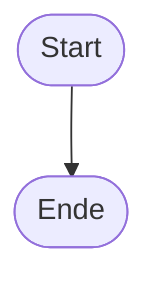

# Kapitel 22: Der VS Code Planungs-Workflow (Strukturierte Softwareentwicklung)

In den bisherigen Kapiteln dieses Kurses hast du die grundlegenden Bausteine von Rust kennengelernt: Variablen, Datentypen, Funktionen, Kontrollstrukturen und das Ownership-System. Du hast wahrscheinlich oft direkt mit dem Tippen von Rust-Code begonnen, sobald eine Aufgabe gestellt wurde. Bei kleinen Programmen funktioniert das gut. Sobald deine Projekte jedoch größer werden, stößt dieser "Code-First"-Ansatz an seine Grenzen.

In diesem Kapitel lernen wir den VS Code Planungs-Workflow kennen. Wir besprechen ausführlich, warum die Planung vor dem Schreiben von Code für professionelle Entwickler unerlässlich ist, wie man Algorithmen visuell darstellt und wie man strukturierten Pseudocode schreibt. Am Ende dieses Kapitels wirst du in der Lage sein, komplexe Softwareprojekte systematisch zu planen und fehlerfrei in Rust umzusetzen.

## 1. Warum Planung der Schlüssel zum Erfolg ist (Die Theorie)

Viele Programmieranfänger glauben, dass ein Programmierer am produktivsten ist, wenn er Code tippt. Das ist ein Trugschluss. Das Schreiben von Code ist nur der letzte Schritt in einem langen Denkprozess. Wer ohne Plan loslegt, tappt schnell in die "Code-First-Falle".

### Die Gefahren des Code-First-Ansatzes (Die Code-First-Falle)
Wenn du sofort mit dem Tippen von Rust-Code beginnst, musst du zwei komplexe Probleme gleichzeitig lösen:
1. **Die Programmlogik:** Wie löse ich das fachliche Problem? Welche Schritte sind in welcher Reihenfolge nötig?
2. **Die Rust-Syntax:** Wie überzeuge ich den Compiler? Welche Typen brauche ich? Wie halte ich die Ownership-Regeln ein?

Das Gehirn ist nicht dafür gemacht, beide Probleme simultan auf hohem Niveau zu lösen. Die Folge sind logische Fehler im Code, die schwer zu finden sind, da sie sich hinter Compiler-Warnungen oder Borrow-Checker-Konflikten verstecken. Du verbringst Stunden damit, Code umzuschreiben, nur um festzustellen, dass dein grundlegender Ansatz falsch war.

### Das Zeitspar-Paradoxon (The Time-Saving Paradox)
Es gibt eine alte Entwickler-Weisheit: *"Eine Stunde Planung spart vier Stunden Fehlersuche."*
Wenn du dir vor dem Programmieren 10 bis 15 Minuten Zeit nimmst, um den Ablauf visuell darzustellen und in Pseudocode aufzuschreiben, wirst du:
* **Logikfehler frühzeitig erkennen:** Bevor du eine einzige Zeile Rust-Code schreibst, siehst du im Diagramm, ob du einen Fall (z. B. eine leere Eingabe) vergessen hast.
* **Denken auf einer höheren Ebene:** Im Pseudocode musst du dich nicht um Semikolons, Typkonvertierungen oder Referenzen kümmern. Du konzentrierst dich rein auf das "Was" und "Wie" des Algorithmus.
* **Weniger Frustration erleben:** Wenn die Logik einmal auf dem Papier steht, ist das Schreiben des Rust-Codes nur noch eine reine Übersetzungsarbeit. Der Compiler wird dein Freund, weil du dich voll auf die Syntax konzentrieren kannst.

### Warum Planung in Rust besonders wichtig ist
Rust ist eine sehr strikte Sprache. Der Borrow Checker wacht penibel über den Speicher. Wenn du in Rust ohne Plan drauflos programmierst, baust du schnell Strukturen auf, die gegen die Aliasing-Regeln ("Ein Schreiber oder viele Leser") verstoßen. Ein guter Plan zeigt dir vorab, welche Variablen verändert werden müssen (`mut`) und wo Daten ausgeliehen oder kopiert werden sollten.

## 2. Die 5 Schritte des Planungs-Workflows

Unser empfohlener Workflow besteht aus fünf klar definierten Phasen. Wir führen diese Schritte in einer eigenen Markdown-Datei namens `planung.md` direkt in VS Code durch.

### Schritt 1: Anforderungsanalyse (Das EVA-Prinzip)
Bevor du einen Algorithmus entwirfst, musst du das Problem verstehen. Nutze das klassische **EVA-Prinzip**:
* **Eingabe (Input):** Welche Daten fließen in das Programm? (z. B. Benutzereingaben, Arrays, Dateien)
* **Verarbeitung (Processing):** Was passiert mit den Daten? Welche Berechnungen oder Transformationen sind nötig?
* **Ausgabe (Output):** Was gibt das Programm zurück? (z. B. Text im Terminal, Dateien, Rückgabewerte)

### Schritt 2: Ablauf-Visualisierung (Mermaid-Diagramme)
Bilder sagen mehr als tausend Worte. Ein Flussdiagramm (Flowchart) hilft dir, Verzweigungen (`if/else`) und Schleifen (`loop`, `while`, `for`) visuell zu erfassen. In VS Code nutzen wir dafür **Mermaid**, ein Tool, mit dem man Diagramme direkt als Text definieren kann.

### Schritt 3: Strukturierter Pseudocode
Pseudocode ist eine Mischung aus menschlicher Sprache und Programmiersprache. Er ist strukturiert wie Code, nutzt aber keine konkrete Syntax. Dadurch bleibt er leicht verständlich und universell einsetzbar.

### Schritt 4: Die Implementierungs-To-Do-Liste
Aus dem Pseudocode leiten wir eine konkrete Checkliste ab. Diese To-Do-Liste enthält kleine, überschaubare Aufgaben, die wir nacheinander abarbeiten können. Das gibt uns ein Gefühl von Fortschritt und verhindert, dass wir uns verzetteln.

### Schritt 5: Iterative Codierung & Refactoring
Erst jetzt erstellen wir die Rust-Datei (z. B. `src/main.rs`). Wir arbeiten uns Schritt für Schritt durch die To-Do-Liste. Wenn das Programm läuft, optimieren wir den Code (Refactoring), um ihn sauberer und effizienter zu machen.

## 3. Deep Dive: Mermaid-Diagramme verstehen und erstellen

Mermaid ist ein mächtiges Werkzeug in modernen Dokumentationen. Es ermöglicht uns, Diagramme direkt in Markdown-Dateien zu zeichnen. Der große Vorteil: Da es reiner Text ist, kann das Diagramm problemlos versioniert (z. B. mit Git) und schnell angepasst werden.

### Die wichtigsten Mermaid-Symbole für Flussdiagramme

Für unsere Programmier-Flowcharts verwenden wir folgende standardisierte Formen:
* **Start- und Endknoten:** Abgerundete Rechtecke oder Ovale symbolisieren den Beginn und das Ende eines Programms oder einer Funktion.
  Syntax: `Start([Programm Start])`
* **Prozess / Zuweisung:** Einfache Rechtecke stehen für Berechnungen, Variablen-Initialisierungen oder Zuweisungen.
  Syntax: `Def[Variable x = 10]`
* **Entscheidung / Bedingung:** Rauten (Diamanten) stellen Bedingungen dar (`if`-Abfragen). Sie haben immer mindestens zwei Ausgänge (Ja/Nein).
  Syntax: `Check{Ist x groesser als 5?}`
* **Ein- und Ausgabe:** Parallelogramme werden traditionell für Interaktionen mit der Außenwelt (z. B. Konsolenausgaben oder Tastatureingaben) verwendet.
  Syntax: `Out[\Gib x aus/]`

### Flussrichtungen und Verbindungen
Wir erstellen Flussdiagramme meist von oben nach unten (Top-Down). Dies definieren wir mit `graph TD` (Top-Down) oder `graph TB` (Top-Bottom).
Verbindungen werden mit einfachen Pfeilen dargestellt:
* Einfacher Übergang: `A --> B`
* Mit Beschriftung (z. B. für Bedingungen): `A -- Ja --> B` oder `A -->|Nein| B`

### Beispiel eines kleinen Mermaid-Ablaufs:
```text
graph TD
    Start([Start]) --> Init[x = 5]
    Init --> Check{Ist x > 0?}
    Check -- Ja --> Decr[x = x - 1]
    Decr --> Check
    Check -- Nein --> End([Ende])
```

## 4. Deep Dive: Pseudocode schreiben wie ein Profi

Pseudocode soll lesbar sein, aber gleichzeitig präzise genug, um die Logik abzubilden. Es gibt keinen offiziellen Standard für Pseudocode, aber in der Praxis haben sich einige Konventionen etabliert.

### Unsere Pseudocode-Konventionen (Deutsch)
Um eine einheitliche Struktur zu wahren, nutzen wir folgende Schlüsselwörter in Großbuchstaben:
* **`DEFINIERE` / `INITIALISIERE`:** Zum Anlegen von Variablen.
* **`GIB AUS`:** Für Bildschirmausgaben.
* **`LIES EIN`:** Für Tastatureingaben.
* **`FALLS` ... `SONST FALLS` ... `SONST`:** Für Bedingungen.
* **`WIEDERHOLE` ... `SOLANGE` / `FÜR JEDES`:** Für Schleifen.
* **`FUNKTION` ... `ENDE FUNKTION`:** Zur Strukturierung von Unterprogrammen.

### Warum Einrückung wichtig ist
Genau wie in echten Programmiersprachen nutzen wir im Pseudocode Einrückungen (Indentations), um zu zeigen, welche Anweisungen zu welchem Block gehören (z. B. innerhalb einer Schleife oder einer Bedingung). Das erhöht die Lesbarkeit massiv.

### Der Trockenlauf (Desk Checking)
Bevor du den Pseudocode in Rust übersetzt, solltest du einen sogenannten "Trockenlauf" machen. Nimm dir ein Blatt Papier, schreibe die Variablennamen auf und gehe den Pseudocode Zeile für Zeile mit Beispielwerten im Kopf durch. Ändere die Werte der Variablen auf deinem Blatt entsprechend. So merkst du sofort, ob deine Schleife zum Beispiel ein Element zu früh stoppt (ein sogenannter "Off-by-one"-Fehler).

## 5. Ausführliches Praxisbeispiel: Der Notendurchschnitt-Rechner

Um den Workflow in Aktion zu sehen, planen wir ein Programm, das den Durchschnitt aus einem festen Noten-Array berechnet und ausgibt.

### Schritt 1: Anforderungsanalyse (EVA)
* **Eingabe:** Ein Array mit Schulnoten (Ganzzahlen von 1 bis 6). Beispiel: `[1, 2, 4, 5, 2]`.
* **Verarbeitung:** Summiere alle Noten im Array auf. Teile die Summe durch die Anzahl der Noten.
* **Ausgabe:** Der berechnete Durchschnitt als Fließkommazahl im Terminal.

### Schritt 2: Ablauf-Visualisierung mit Mermaid
Hier visualisieren wir den gesamten Ablauf des Programms. Wir müssen sicherstellen, dass wir alle Noten nacheinander durchgehen und am Ende die Division durchführen.

:::mermaid
graph TD
    Start([FUNKTION main]) --> Def[Definition: notendurchschnitt = 1, 2, 4, 5, 2]
    Def --> Init[Variablen initialisieren:<br>summe = 0.0<br>anzahl = Länge des Arrays]
    
    Init --> LoopCheck{Gibt es noch unbeschäftigte Noten?}
    
    LoopCheck -- Ja --> GetNote[Hole nächste 'note' aus Array]
    GetNote --> AddSum[summe = summe + note]
    AddSum --> LoopCheck
    
    LoopCheck -- Nein --> Calc[ergebnis = summe / anzahl]
    Calc --> Output[AUSGABE: Notendurchschnitt: ergebnis]
    Output --> End([ENDE])
:::

### Schritt 3: Pseudocode
Der Pseudocode übersetzt das Diagramm in eine textuelle Struktur. Beachte die Großbuchstaben bei den Kontrollstrukturen:

```text
FUNKTION main:
    DEFINIERE notendurchschnitt = [1, 2, 4, 5, 2]
    INITIALISIERE summe = 0.0
    INITIALISIERE anzahl = LÄNGE von notendurchschnitt

    WIEDERHOLE für jede note in notendurchschnitt:
        summe = summe + note
    
    ergebnis = summe / anzahl
    GIB AUS "Notendurchschnitt: " + ergebnis
ENDE FUNKTION
```

### Schritt 4: To-Do-Liste
Aus der Planung leiten wir folgende Aufgaben ab:
- [ ] Neues Cargo-Projekt erstellen (`cargo new notenrechner`).
- [ ] Festes Noten-Array in `main` definieren.
- [ ] Summen-Variable als veränderliches Float (`mut summe = 0.0`) anlegen.
- [ ] Anzahl der Elemente ermitteln und in Float umwandeln.
- [ ] `for`-Schleife über das Array schreiben und Werte aufsummieren (Typen konvertieren!).
- [ ] Durchschnitt berechnen (Division der Floats).
- [ ] Ergebnis mit `println!` formatiert ausgeben.
- [ ] Code mit `cargo run` testen und compilieren.

### Schritt 5: Implementierung in Rust
Nun schreiben wir den tatsächlichen Code. Dank unserer Vorbereitung müssen wir nicht mehr über die Logik nachdenken, sondern können uns voll auf die Typkonvertierungen in Rust konzentrieren:

```rust
fn main() {
    // 1. Noten definieren
    let notendurchschnitt = [1, 2, 4, 5, 2];
    
    // 2. Summe initialisieren (muss mutierbar sein)
    let mut summe = 0.0;
    
    // 3. Anzahl als f64 ermitteln (für spätere Division)
    let anzahl = notendurchschnitt.len() as f64;

    // 4. Schleife zur Aufsummierung
    for note in notendurchschnitt.iter() {
        // note ist eine Referenz (&i32), wir dereferenzieren mit *
        // und wandeln in f64 um, um mit summe zu rechnen
        summe += *note as f64;
    }

    // 5. Durchschnitt berechnen
    let ergebnis = summe / anzahl;
    
    // 6. Ausgabe
    println!("Der Notendurchschnitt beträgt: {:.2}", ergebnis);
}
```

## 6. Ausführliche Merkzettel zum Planungs-Workflow

Verwende diese Spickzettel als Referenz für deine eigenen Projekte. Sie fassen die wichtigsten Elemente übersichtlich zusammen.

### 📌 Merkzettel A: Die Mermaid-Elemente im Detail

1. **Warum dieses Konzept? (Motivation):**
   Damit Programmierer Flussdiagramme schnell schreiben und anpassen können, ohne Grafiktools zu nutzen.
2. **Schlüsselbegriffe (Definitions):**
   - **`graph TD`:** Ausrichtung des Diagramms von oben nach unten (Top-Down).
   - **`[]` (Rechteck):** Operationen, Berechnungen, Wertzuweisungen.
   - **`{}` (Raute):** Bedingungen, Kontrollfragen (z. B. if-Statements).
   - **`([])` (Stadium/Oval):** Start- und Endpunkte des Programms.
3. **Praktische Visualisierung & Code-Beispiel:**
   ```text
   graph TD
       A([Start]) --> B[Zuweisung: x = 10]
       B --> C{x > 5?}
       C -- Ja --> D[\Ausgabe: Groesser/]
       C -- Nein --> E[\Ausgabe: Kleiner/]
       D --> F([Ende])
       E --> F
   ```
4. **Häufiger Anfängerfehler:**
   *Fehlerhafter Code:*
   ```text
   A --> B (Ohne definierte Verbindungsausrichtung oder falsche Klammer-Symmetrie)
   C{Bedingung} -- Ja --> D (Wenn Textzeichen wie Klammern im Knotentext ungequotet sind)
   ```
   *Korrektur:*
   Nutze immer doppelte Anführungszeichen für Sonderzeichen in Knotentexten: `Node{"Bedingung (x > 5)"}`.
5. **Die goldene Merkregel / Eselsbrücke (Mnemonic):**
   *„Eckig ist die Tat (Aktion), rund der Start und das Ende, rautenförmig die Weiche (Entscheidung).“*

---

### 📌 Merkzettel B: Die Pseudocode-Syntax im Detail

1. **Warum dieses Konzept? (Motivation):**
   Um die Logik eines Programms unabhängig von einer Programmiersprache aufzuschreiben und logische Fehler zu vermeiden.
2. **Schlüsselbegriffe (Definitions):**
   - **`DEFINIERE`:** Deklariert eine Variable.
   - **`WIEDERHOLE FÜR`:** Schleife über einen Zahlenbereich oder ein Array.
   - **`FALLS` / `SONST`:** Bedingte Ausführung von Codeblöcken.
3. **Praktische Visualisierung & Code-Beispiel:**
   ```text
   FUNKTION berechne_rabatt(preis, rabatt_prozent):
       FALLS preis > 100:
           rabatt = preis * (rabatt_prozent / 100)
           RÜCKGABE preis - rabatt
       SONST:
           RÜCKGABE preis
   ENDE FUNKTION
   ```
4. **Häufiger Anfängerfehler:**
   *Fehlerhafter Pseudocode:*
   ```text
   wenn x groesser als 10 ist dann mach das hier...
   (Zu unstrukturiert, ähnelt einem Fließtext und lässt sich schwer in echten Code übersetzen)
   ```
   *Korrektur:*
   Nutze strukturierte Einrückungen und festgelegte Schlüsselwörter:
   ```text
   FALLS x > 10:
       MACH das_hier
   ```
5. **Die goldene Merkregel / Eselsbrücke (Mnemonic):**
   *„Pseudocode liest sich wie Deutsch, strukturiert sich wie Code und verzeiht jeden Tippfehler.“*

---

### 📌 Merkzettel C: Die Planungs-Checkliste (Template)

Kopiere diese Vorlage in jede deiner `planung.md`-Dateien, wenn du ein neues Projekt startest:

```markdown
# Planung: [Projektname]

## 1. Anforderungen (EVA)
* **Eingabe:**
* **Verarbeitung:**
* **Ausgabe:**

## 2. Ablaufdiagramm (Mermaid)


## 3. Pseudocode
```text
// Pseudocode hier einfügen
```

## 4. To-Do-Liste
- [ ] Cargo-Projekt initialisieren
- [ ] ...
```

## 7. Die häufigsten Fehler beim Planen (und wie man sie vermeidet)

Selbst erfahrene Entwickler machen Fehler bei der Planung. Hier sind die vier typischsten Stolpersteine für Anfänger:

### Fehler 1: Unendliche Schleifen im Diagramm (Infinite Loop Trap)
* **Das Problem:** Du zeichnest einen Pfeil zurück zu einer Bedingung, veränderst aber innerhalb der Schleife die Kontrollvariable nicht. Dein Diagramm (und später dein Code) läuft ewig.
* **Vermeidung:** Stelle bei jedem Schleifendurchlauf im Diagramm sicher, dass eine Aktion stattfindet, die die Bedingung beeinflusst (z. B. `Zähler = Zähler + 1`).

### Fehler 2: Fehlende Behandlung von Sonderfällen (Edge Cases)
* **Das Problem:** Du planst nur für den Optimalfall (Happy Path). Was passiert, wenn der Notenrechner ein leeres Array übergeben bekommt? Im Rust-Code führt eine Division durch Null zum Absturz (Panic).
* **Vermeidung:** Frage dich bei jedem Schritt im Diagramm: *„Was ist, wenn der Wert null ist? Was ist, wenn das Array leer ist? Was ist bei negativen Werten?“* Baue entsprechende `if`-Abzweigungen ein.

### Fehler 3: Zu detaillierter Pseudocode (Rust-Syntax im Pseudocode)
* **Das Problem:** Du schreibst bereits Typen wie `as f64`, Referenzen `&` oder Imports in deinen Pseudocode. Das blockiert das kreative Denken über die Logik.
* **Vermeidung:** Halte den Pseudocode einfach. Schreibe `Länge des Arrays` statt `.len() as f64`. Die Details klärst du erst beim Schreiben des Rust-Codes.

### Fehler 4: Die To-Do-Liste ist zu grob
* **Das Problem:** Deine To-Do-Liste hat nur einen Punkt: *"1. Schreibe das Programm"*. Das hilft dir nicht bei der Strukturierung.
* **Vermeidung:** Zerlege die Aufgabe in kleine Portionen, die du in maximal 5 bis 10 Minuten erledigen kannst. Ein Punkt wie *"Schreibe die Schleife für die Summe"* ist viel besser.

## 8.1 VS Code optimal für den Planungs-Workflow einrichten

Um den Planungs-Workflow so flüssig und angenehm wie möglich zu gestalten, solltest du deine VS Code-Umgebung mit den passenden Erweiterungen ausstatten. Dies ermöglicht es dir, Diagramme und Markdown-Dateien direkt im Editor live zu visualisieren und zu bearbeiten.

### Empfohlene VS Code-Erweiterungen:
1. **Markdown Preview Mermaid Support:**
   * Diese Erweiterung sorgt dafür, dass die standardmäßige Markdown-Vorschau von VS Code Mermaid-Diagramme (`:::mermaid`) direkt rendern kann.
   * *Nutzung:* Drücke `Strg + Shift + V` in einer geöffneten Markdown-Datei, um die Live-Vorschau an der Seite anzuzeigen. Jede Änderung am Mermaid-Code wird sofort aktualisiert.
2. **Markdown All in One:**
   * Bietet nützliche Tastenkombinationen, automatische Erstellung von To-Do-Listen (beim Drücken von Enter in einer Checkliste) und automatische Formatierung.
3. **Mermaid Chart:**
   * Die offizielle Erweiterung zur visuellen Erstellung und Bearbeitung von Mermaid-Diagrammen mit einem integrierten Editor, falls du die Syntax nicht auswendig lernen möchtest.

### Hilfreiche Tastenkombinationen in VS Code für die Planung:
* **`Strg + Shift + V`:** Öffnet die Markdown-Vorschau im Vollbild.
* **`Strg + K, danach V`:** Öffnet die Vorschau in einem geteilten Fenster direkt neben deinem Code (Split-Screen-Modus). Dies ist das ideale Setup für die Implementierungsphase.
* **`Alt + Z`:** Aktiviert den automatischen Zeilenumbruch (Word Wrap), damit längere Abschnitte im Pseudocode oder in den Notizen nicht horizontal aus dem Bildschirm laufen.

## 8.2 Synergie: GitHub Copilot und das Antigravity CLI im Tandem nutzen

Während GitHub Copilot hervorragend als schneller Autocomplete-Assistent direkt in der Zeile arbeitet, glänzt das Antigravity CLI (`agy`) bei der projektweiten Planung und der Durchführung größerer Codeänderungen. Wenn du beide Tools intelligent kombinierst, entwickelst du ein tiefes Verständnis für Rust und vermeidest typische Fehler.

### Die Arbeitsteilung im Detail:
* **Der Navigator (Antigravity CLI):**
  - Nutze das CLI in der Planungsphase. Der Agent kann dir helfen, logische Fehler in deinem Mermaid-Diagramm zu finden oder deinen Entwurf in `planung.md` zu strukturieren.
  - Gib dem CLI Befehle wie: *"Analysiere meinen Entwurf in planung.md und erstelle die grundlegenden Funktions-Signaturen in src/main.rs."*
* **Der Autopilot (GitHub Copilot):**
  - Nutze Copilot in der Tippphase innerhalb deiner Code-Dateien. Sobald du eine Funktion implementierst, schlägt dir Copilot den passenden Code auf Zeilenebene vor.
  - *Achtung:* Verlasse dich nicht blind auf Copilots Vorschläge. Wenn Copilot Code generiert, der nicht kompiliert, kopiere die Fehlermeldung und frage das CLI nach einer strukturierten Erklärung des zugrunde liegenden Speicherproblems (z. B. Borrowing-Konflikte).

## 8.3 KI-Assistenten im Planungs-Workflow einbinden (AI-Assisted Planning)

Künstliche Intelligenz (wie GitHub Copilot, ChatGPT, Claude oder das Antigravity CLI) kann im Planungs-Workflow als exzellenter Sparringspartner dienen. Der Schlüssel liegt darin, die KI **nicht** den gesamten Code schreiben zu lassen, sondern sie gezielt in jeder einzelnen Planungsphase um Feedback zu bitten.

### Schritt 1: Anforderungen & Edge Cases hinterfragen (EVA-Phase)
Nutze die KI, um Lücken in deinem Verständnis oder in den Anforderungen zu finden.
* **Tipp:** Beschreibe der KI dein Vorhaben und frage nach Sonderfällen.
* **Beispiel-Prompt:**
  > *"Ich plane ein Rust-Programm, das [Aufgabe beschreiben] macht. Welche technischen oder fachlichen Edge Cases (Sonderfälle) sollte ich bei der Anforderungsanalyse (Eingabe, Verarbeitung, Ausgabe) berücksichtigen?"*

### Schritt 2: Mermaid-Diagramme entwerfen und korrigieren
Wenn du dir unsicher bist, wie der logische Fluss aussehen soll, kannst du die KI bitten, dir einen Mermaid-Entwurf zu erstellen.
* **Tipp:** Wenn du bereits ein Diagramm hast, kannst du es auf Syntax- oder Logikfehler prüfen lassen.
* **Beispiel-Prompt:**
  > *"Erstelle ein Mermaid-Flussdiagramm im 'graph TD'-Format für folgende Logik: [Logikbeschreibung, z. B. Summiere ein Array und ziehe bei über 50 Euro 10% Rabatt ab]. Gib nur den Mermaid-Code aus."*

### Schritt 3: Pseudocode-Reviews (Logik-Prüfung)
Bevor du den ersten Rust-Code schreibst, solltest du deinen Pseudocode von der KI überprüfen lassen. Da die KI hier keine Syntaxfehler korrigieren muss, kann sie sich ganz auf Logikfehler oder mögliche Endlosschleifen konzentrieren.
* **Beispiel-Prompt:**
  > *"Hier ist mein Pseudocode für [Aufgabe]: [Pseudocode einfügen]. Findest du darin logische Fehler, Endlosschleifen oder Fälle, in denen das Programm abstürzen könnte? Schlage Verbesserungen vor, ohne echten Code zu schreiben."*

### Schritt 4: To-Do-Checkliste erstellen
Du kannst die KI bitten, deinen Pseudocode in eine konkrete, kleinteilige Implementierungs-Checkliste für Rust zu übersetzen.
* **Beispiel-Prompt:**
  > *"Basierend auf diesem Pseudocode: [Pseudocode einfügen]. Erstelle mir eine strukturierte To-Do-Liste mit kleinen Schritten für die Implementierung in Rust, beginnend bei 'cargo new'."*

### Schritt 5: Strukturierte Dokumentation der KI-Vorschläge
Es ist eine bewährte Praxis, die Ideen und Code-Vorschläge der KI nicht direkt blind in dein Projekt zu kopieren, sondern sie strukturiert in deiner `planung.md` zu sammeln.
* **Empfohlene Struktur in deiner `planung.md`:**
  ```markdown
  ## 5. KI-Vorschläge & Alternativen
  * **Idee A (Vorgeschlagen von Copilot):** Nutzung einer `for`-Schleife über `.iter()`.
  * **Idee B (Vorgeschlagen von Claude):** Nutzung von funktionalen Iteratoren wie `.iter().sum::<f64>()`.
  * **Entscheidung:** Ich wähle Idee A, um die imperativen Konzepte und den Dereferenzierungs-Operator `*` besser zu üben.
  ```
Das Sammeln und Abwägen dieser Vorschläge macht dich zu einem mündigen Entwickler, der die Kontrolle über seinen Code behält, statt der KI blind zu vertrauen.

## 9. Übung: Der Warenkorb-Rabatt-Rechner

Jetzt bist du an der Reihe! Wende den gelernten Workflow an, um ein praktisches Problem zu lösen.

### Die Aufgabenstellung
Ein Online-Shop benötigt ein Modul zur Berechnung des finalen Warenkorb-Preises. Das Programm soll eine Liste von Preisen einlesen, einen Rabatt gewähren, falls der Gesamtwert eine Grenze überschreitet, und schließlich die Mehrwertsteuer berechnen.

**Die Anforderungen im Detail:**
1. **Datenbasis (Eingabe):** Verwende ein festes Array mit 5 Fließkommazahlen (Preisen), zum Beispiel: `[12.50, 8.90, 24.00, 15.00, 5.50]`.
2. **Summe berechnen:** Summiere alle 5 Preise auf.
3. **Rabattprüfung:**
   * Liegt die Summe **über 50,00 €**, wird ein Rabatt von **10 %** auf die Gesamtsumme gewährt.
   * Liegt die Summe bei **50,00 € oder darunter**, beträgt der Rabatt **0 %**.
4. **Steuerberechnung:** Auf den reduzierten Preis müssen **19 % Mehrwertsteuer** berechnet werden (dieser Betrag ist im Endpreis enthalten, d. h. der rabattierte Preis ist der Nettobetrag, auf den die Steuer aufgeschlagen wird, um den Bruttobetrag zu erhalten).
5. **Formatierte Ausgabe:** Gib folgende Werte auf zwei Nachkommastellen gerundet im Terminal aus:
   - Summe der Artikel (Netto vor Rabatt)
   - Abgezogener Rabattbetrag
   - Berechnete Mehrwertsteuer (19 % auf den rabattierten Netto-Betrag)
   - Finaler Endpreis (Brutto-Betrag = Netto nach Rabatt + Mehrwertsteuer)

### Deine Aufgabenschritte (Workflow)
1. Erstelle einen neuen Ordner `warenkorb_rechner` und darin eine Datei `planung.md`.
2. Führe die Anforderungen als EVA-Analyse in `planung.md` auf.
3. Erstelle das Mermaid-Ablaufdiagramm in `planung.md`.
4. Schreibe den Pseudocode auf.
5. Erstelle die To-Do-Liste.
6. Erstelle das Cargo-Projekt mit `cargo new warenkorb_rechner`.
7. Setze das Projekt in `src/main.rs` um. Teste dein Programm mit verschiedenen Werten im Array (unter 50 € und über 50 €), um sicherzustellen, dass die Rabatt-Logik korrekt funktioniert!

## 9.1 Fünf weitere Planungs-Herausforderungen für dein Training

Um den Workflow in Fleisch und Blut übergehen zu lassen, findest du hier fünf Übungsszenarien mit unterschiedlichen Schwierigkeitsgraden. Wende bei jedem Szenario zuerst die 5 Schritte des Workflows an, bevor du programmierst.

### Challenge 1: Der Temperatur-Konverter (Einfach)
* **Ziel:** Ein Programm, das eine Liste von Celsius-Werten in Fahrenheit umrechnet.
* **Besonderheit:** Verwende ein festes Array von 5 Werten.
* **Fokus:** Einfache Schleife, mathematische Formel und Zuweisungen.

### Challenge 2: Der Palindrom-Tester (Mittel)
* **Ziel:** Prüfe, ob ein eingegebenes Wort vorwärts und rückwärts gleich gelesen wird (z. B. "Lagerregal").
* **Besonderheit:** Groß- und Kleinschreibung sowie Leerzeichen müssen ignoriert werden.
* **Fokus:** String-Manipulation und Zeichenvergleiche.

### Challenge 3: Die Digitaluhr (Mittel)
* **Ziel:** Simuliere eine tickende Uhr im Terminal (Stunden, Minuten, Sekunden).
* **Besonderheit:** Nutze eine Endlosschleife und Thread-Sleep (`std::thread::sleep`) für den Sekundentakt.
* **Fokus:** Kontrollstrukturen und Zeitsteuerung.

### Challenge 4: Der Text-Zensor (Schwer)
* **Ziel:** Ersetze verbotene Wörter in einem Satz durch `***`.
* **Besonderheit:** Die Liste der verbotenen Wörter liegt in einem Array.
* **Fokus:** String-Methoden und Speicherverwaltung.

### Challenge 5: Der vereinfachte Bankautomat (Schwer)
* **Ziel:** Simuliere Kontostandsabfragen, Einzahlungen und Auszahlungen über ein einfaches Menü.
* **Besonderheit:** Verwalte den Kontostand über eine veränderliche Referenz in Funktionen.
* **Fokus:** Zustandssteuerung und Referenzen/Borrowing.

## 10. Musterlösung für den Warenkorb-Rabatt-Rechner

Vergleiche deine Lösung erst mit dieser Musterlösung, nachdem du es selbst versucht hast. Das eigenständige Lösen und das Suchen nach Fehlern hat den größten Lerneffekt!

### Muster-Planungsdatei (`planung.md`)

```markdown
# Planung: Warenkorb-Rabatt-Rechner

## 1. Anforderungen (EVA)
* **Eingabe:** Array mit 5 Preisen (f64). Beispiel: [12.50, 8.90, 24.00, 15.00, 5.50]
* **Verarbeitung:** Summiere alle Preise. Falls Summe > 50.00, berechne Rabatt (10%). Ziehe Rabatt ab. Berechne 19% MwSt auf den Rest. Berechne Endpreis (Netto-Rest + MwSt).
* **Ausgabe:** Formatiert: Nettosumme, Rabattwert, Mehrwertsteuer, Endpreis (Brutto).

## 2. Ablaufdiagramm (Mermaid)
:::mermaid
graph TD
    Start([Start]) --> Init[Preise definieren:<br>artikel = [12.50, 8.90, 24.00, 15.00, 5.50]<br>summe = 0.0]
    Init --> Loop{Mehr Artikel?}
    Loop -- Ja --> Add[summe = summe + artikel_preis]
    Add --> Loop
    Loop -- Nein --> Check{summe > 50.00?}
    Check -- Ja --> Apply[rabatt = summe * 0.10]
    Check -- Nein --> NoApply[rabatt = 0.0]
    Apply --> Calc[netto_neu = summe - rabatt]
    NoApply --> Calc
    Calc --> Tax[mwst = netto_neu * 0.19]
    Tax --> Brutto[brutto = netto_neu + mwst]
    Brutto --> Out[\Gib Werte aus/]
    Out --> End([Ende])
:::

## 3. Pseudocode
```text
FUNKTION main:
    DEFINIERE preise = [12.50, 8.90, 24.00, 15.00, 5.50]
    INITIALISIERE summe = 0.0

    WIEDERHOLE für jeden preis in preise:
        summe = summe + preis

    INITIALISIERE rabatt = 0.0
    FALLS summe > 50.00:
        rabatt = summe * 0.10
    
    INITIALISIERE netto_neu = summe - rabatt
    INITIALISIERE mwst = netto_neu * 0.19
    INITIALISIERE brutto = netto_neu + mwst

    GIB AUS "Summe Netto: " + summe
    GIB AUS "Rabatt: " + rabatt
    GIB AUS "Mehrwertsteuer: " + mwst
    GIB AUS "Gesamt Brutto: " + brutto
ENDE FUNKTION
```

## 4. To-Do-Liste
- [x] Cargo-Projekt `warenkorb_rechner` anlegen
- [x] Array mit f64-Preisen definieren
- [x] Schleife zur Summenberechnung schreiben
- [x] If-Else-Bedingung für Rabattgrenze 50.00 € implementieren
- [x] Berechnung für Netto-Neu, MwSt und Brutto schreiben
- [x] Konsolenausgabe mit {:.2} formatieren
- [x] Mit verschiedenen Testwerten ausführen
```

---

### Muster-Rust-Implementierung (`src/main.rs`)

Hier ist der fertige, saubere Rust-Code für das Projekt:

```rust
fn main() {
    // 1. Array mit 5 Artikelpreisen definieren (f64)
    let preise = [12.50, 8.90, 24.00, 15.00, 5.50];
    
    // 2. Summen-Variable deklarieren
    let mut summe = 0.0;
    
    // 3. Preise aufsummieren
    for preis in preise.iter() {
        summe += *preis; // Dereferenzierung des Iterators
    }
    
    // 4. Rabatt berechnen (Bedingung als Ausdruck nutzen!)
    let rabatt = if summe > 50.00 {
        summe * 0.10 // 10% Rabatt
    } else {
        0.00 // Kein Rabatt
    };
    
    // 5. Weitere Werte berechnen
    let netto_neu = summe - rabatt;
    let mwst = netto_neu * 0.19; // 19% Mehrwertsteuer
    let brutto = netto_neu + mwst; // Endpreis
    
    // 6. Formatierte Ausgabe der Ergebnisse
    println!("--- KASSENBON ---");
    println!("Zwischensumme (Netto): {:8.2} €", summe);
    println!("Rabatt (10%):           {:8.2} €", rabatt);
    println!("Netto nach Rabatt:      {:8.2} €", netto_neu);
    println!("Mehrwertsteuer (19%):   {:8.2} €", mwst);
    println!("-----------------");
    println!("Endbetrag (Brutto):     {:8.2} €", brutto);
}
```

## 11. Zusammenfassung & Deine Lernnotizen

Herzlichen Glückwunsch! Du hast nun gelernt, wie wichtig es ist, komplexe Probleme strukturiert anzugehen und zu planen, bevor du Code schreibst. Der Planungs-Workflow wird dir in deiner Karriere als Softwareentwickler extrem viel Zeit und Kopfzerbrechen ersparen.

### Wichtigste Erkenntnisse dieses Kapitels:
1. **Der Plan steht zuerst:** Codiere niemals ohne Ablaufdiagramm und Pseudocode bei nicht-trivialen Aufgaben.
2. **Klares Aufteilen:** Durch das EVA-Prinzip zerlegst du jedes Problem in seine drei Grundkomponenten.
3. **To-Do-Listen geben Struktur:** Kleine Teilaufgaben verhindern Überforderung und halten dich fokussiert.

Nutze das untenstehende Feld in deiner eigenen Markdown-Datei, um deine Gedanken, Notizen und persönlichen Aha-Momente aus diesem Kapitel festzuhalten.

```text
💡 MEINE NOTIZEN ZU KAPITEL 22:
- Was war mein größter Aha-Moment beim Zeichnen von Mermaid-Diagrammen?
- Konnte ich den Warenkorb-Rechner ohne Probleme in Rust übersetzen?
- Welche Compiler-Warnungen sind mir beim Schreiben aufgefallen?
```


## 10.1 Detaillierte Zeilenanalyse der Musterlösung

Um den Rust-Code der Musterlösung vollkommen zu verstehen, gehen wir ihn hier Zeile für Zeile durch:

1. `fn main() {` - Dies definiert die Hauptfunktion des Programms, den Einstiegspunkt für die Ausführung.

2. `let preise = [12.50, 8.90, 24.00, 15.00, 5.50];` - Hier wird ein unveränderliches Array deklariert.

3. Dieses Array enthält genau fünf Elemente vom Typ `f64`. Rust erkennt den Typ automatisch anhand der Dezimalpunkte.

4. Die Speichergröße des Arrays ist fest. Es liegt im Stack-Speicher, da seine Größe zur Kompilierzeit bekannt ist.

5. `let mut summe = 0.0;` - Wir deklarieren eine veränderliche Variable, um das Zwischenergebnis aufzusummieren.

6. Sie muss veränderlich sein (`mut`), da wir in jeder Schleifeniteration einen neuen Wert hinzuaddieren.

7. Wir initialisieren sie mit `0.0` als Fließkommazahl. Die Auslassung von `.0` würde zu einem Typfehler führen.

8. `for preis in preise.iter() {` - Hier starten wir eine `for`-Schleife über die Elemente des Arrays.

9. Die Methode `.iter()` erzeugt einen Iterator, der Referenzen auf die Elemente des Arrays liefert.

10. In jedem Durchlauf zeigt die Variable `preis` auf ein Element des Arrays (Typ ist somit `&f64`).

11. `summe += *preis;` - Hier addieren wir den aktuellen Preis auf unsere Summenvariable auf.

12. Der Operator `*` ist der Dereferenzierungsoperator. Er holt den tatsächlichen Wert hinter der Referenz `&f64`.

13. Ohne das Zeichen `*` würde der Compiler einen Typfehler melden, da wir `f64` nicht mit `&f64` addieren können.

14. `}` - Dieses Zeichen schließt den Block der `for`-Schleife ab. Der Iterator springt zum nächsten Element.

15. `let rabatt = if summe > 50.00 {` - Hier nutzen wir eine Besonderheit von Rust: `if` als Ausdruck.

16. Das bedeutet, dass die gesamte Bedingung einen Wert zurückgibt, den wir direkt der Variablen `rabatt` zuweisen.

17. `summe * 0.10` - Wenn die Bedingung wahr ist, berechnen wir 10% der Summe. Kein Semikolon, da es ein Ausdruck ist!

18. `} else {` - Der alternative Zweig, falls die Summe kleiner oder gleich 50.00 Euro ist.

19. `0.00` - In diesem Fall beträgt der Rabatt genau Null. Auch hier steht kein Semikolon am Ende.

20. `};` - Das Semikolon schließt die Zuweisung an die Variable `rabatt` ab. Beachte den schließenden Block.

21. `let netto_neu = summe - rabatt;` - Wir berechnen die reduzierte Summe nach Abzug des Rabatts.

22. Dies ist eine einfache Subtraktion von zwei `f64`-Werten. Das Ergebnis ist wiederum ein `f64`.

23. `let mwst = netto_neu * 0.19;` - Wir berechnen die darauf anfallende Mehrwertsteuer von 19%.

24. In Deutschland beträgt der reguläre Mehrwertsteuersatz 19 Prozent. Diesen rechnen wir als Faktor `0.19` ein.

25. `let brutto = netto_neu + mwst;` - Die Addition von Netto-Rest und Steuer ergibt den Brutto-Endpreis.

26. Alle beteiligten Variablen sind unveränderlich (`let` ohne `mut`), da ihr Wert nach der Zuweisung nicht mehr geändert wird.

27. `println!("--- KASSENBON ---");` - Eine einfache Textausgabe zur visuellen Abgrenzung des Kassenbons.

28. `println!("Zwischensumme (Netto): {:8.2} €", summe);` - Formatierte Ausgabe der ursprünglichen Summe.

29. Der Formatbezeichner `{:8.2}` bedeutet: Reserviere mindestens 8 Zeichen Platz und runde auf 2 Nachkommastellen.

30. Dies sorgt dafür, dass die Euro-Beträge untereinander rechtsbündig ausgerichtet sind.

31. `println!("Rabatt (10%):           {:8.2} €", rabatt);` - Formatierte Ausgabe des abgezogenen Rabatts.

32. Auch hier nutzen wir denselben Formatbezeichner, um die rechtsbündige Ausrichtung im Terminal zu wahren.

33. `println!("Netto nach Rabatt:      {:8.2} €", netto_neu);` - Ausgabe des rabattierten Preises.

34. Dies ist die Bemessungsgrundlage für die Mehrwertsteuer und entspricht dem berechneten Netto-Restwert.

35. `println!("Mehrwertsteuer (19%):   {:8.2} €", mwst);` - Ausgabe des berechneten Steueranteils.

36. Dieser Betrag wird aufgeschlagen und zeigt dem Käufer genau, wie viel Steuer an den Staat abgeführt wird.

37. `println!("-----------------");` - Eine Trennlinie, um das Gesamtergebnis optisch abzuheben.

38. `println!("Endbetrag (Brutto):     {:8.2} €", brutto);` - Ausgabe des finalen Bruttobetrags.

39. Dies ist der Betrag, den der Kunde tatsächlich bezahlen muss (Summe aus Netto-Rest und Steuer).

40. `}` - Das schließende Zeichen der Hauptfunktion `main`. Damit endet die Programmausführung.

## 11.1 Planungs-Fragen zur Reflexion

* **Planungsfrage 01:** Kannst du ein weiteres Szenario beschreiben, in dem die vorzeitige visuelle Planung Fehler verhindert?
* **Planungsfrage 02:** Kannst du ein weiteres Szenario beschreiben, in dem die vorzeitige visuelle Planung Fehler verhindert?
* **Planungsfrage 03:** Kannst du ein weiteres Szenario beschreiben, in dem die vorzeitige visuelle Planung Fehler verhindert?
* **Planungsfrage 04:** Kannst du ein weiteres Szenario beschreiben, in dem die vorzeitige visuelle Planung Fehler verhindert?
* **Planungsfrage 05:** Kannst du ein weiteres Szenario beschreiben, in dem die vorzeitige visuelle Planung Fehler verhindert?
* **Planungsfrage 06:** Kannst du ein weiteres Szenario beschreiben, in dem die vorzeitige visuelle Planung Fehler verhindert?
* **Planungsfrage 07:** Kannst du ein weiteres Szenario beschreiben, in dem die vorzeitige visuelle Planung Fehler verhindert?
* **Planungsfrage 08:** Kannst du ein weiteres Szenario beschreiben, in dem die vorzeitige visuelle Planung Fehler verhindert?
* **Planungsfrage 09:** Kannst du ein weiteres Szenario beschreiben, in dem die vorzeitige visuelle Planung Fehler verhindert?
* **Planungsfrage 10:** Kannst du ein weiteres Szenario beschreiben, in dem die vorzeitige visuelle Planung Fehler verhindert?
* **Planungsfrage 11:** Kannst du ein weiteres Szenario beschreiben, in dem die vorzeitige visuelle Planung Fehler verhindert?
* **Planungsfrage 12:** Kannst du ein weiteres Szenario beschreiben, in dem die vorzeitige visuelle Planung Fehler verhindert?
* **Planungsfrage 13:** Kannst du ein weiteres Szenario beschreiben, in dem die vorzeitige visuelle Planung Fehler verhindert?
* **Planungsfrage 14:** Kannst du ein weiteres Szenario beschreiben, in dem die vorzeitige visuelle Planung Fehler verhindert?
* **Planungsfrage 15:** Kannst du ein weiteres Szenario beschreiben, in dem die vorzeitige visuelle Planung Fehler verhindert?
* **Planungsfrage 16:** Kannst du ein weiteres Szenario beschreiben, in dem die vorzeitige visuelle Planung Fehler verhindert?
* **Planungsfrage 17:** Kannst du ein weiteres Szenario beschreiben, in dem die vorzeitige visuelle Planung Fehler verhindert?
* **Planungsfrage 18:** Kannst du ein weiteres Szenario beschreiben, in dem die vorzeitige visuelle Planung Fehler verhindert?
* **Planungsfrage 19:** Kannst du ein weiteres Szenario beschreiben, in dem die vorzeitige visuelle Planung Fehler verhindert?
* **Planungsfrage 20:** Kannst du ein weiteres Szenario beschreiben, in dem die vorzeitige visuelle Planung Fehler verhindert?
* **Planungsfrage 21:** Kannst du ein weiteres Szenario beschreiben, in dem die vorzeitige visuelle Planung Fehler verhindert?
* **Planungsfrage 22:** Kannst du ein weiteres Szenario beschreiben, in dem die vorzeitige visuelle Planung Fehler verhindert?
* **Planungsfrage 23:** Kannst du ein weiteres Szenario beschreiben, in dem die vorzeitige visuelle Planung Fehler verhindert?
* **Planungsfrage 24:** Kannst du ein weiteres Szenario beschreiben, in dem die vorzeitige visuelle Planung Fehler verhindert?
* **Planungsfrage 25:** Kannst du ein weiteres Szenario beschreiben, in dem die vorzeitige visuelle Planung Fehler verhindert?
* **Planungsfrage 26:** Kannst du ein weiteres Szenario beschreiben, in dem die vorzeitige visuelle Planung Fehler verhindert?
* **Planungsfrage 27:** Kannst du ein weiteres Szenario beschreiben, in dem die vorzeitige visuelle Planung Fehler verhindert?
* **Planungsfrage 28:** Kannst du ein weiteres Szenario beschreiben, in dem die vorzeitige visuelle Planung Fehler verhindert?
* **Planungsfrage 29:** Kannst du ein weiteres Szenario beschreiben, in dem die vorzeitige visuelle Planung Fehler verhindert?
* **Planungsfrage 30:** Kannst du ein weiteres Szenario beschreiben, in dem die vorzeitige visuelle Planung Fehler verhindert?
* **Planungsfrage 31:** Kannst du ein weiteres Szenario beschreiben, in dem die vorzeitige visuelle Planung Fehler verhindert?
* **Planungsfrage 32:** Kannst du ein weiteres Szenario beschreiben, in dem die vorzeitige visuelle Planung Fehler verhindert?
* **Planungsfrage 33:** Kannst du ein weiteres Szenario beschreiben, in dem die vorzeitige visuelle Planung Fehler verhindert?
* **Planungsfrage 34:** Kannst du ein weiteres Szenario beschreiben, in dem die vorzeitige visuelle Planung Fehler verhindert?
* **Planungsfrage 35:** Kannst du ein weiteres Szenario beschreiben, in dem die vorzeitige visuelle Planung Fehler verhindert?
* **Planungsfrage 36:** Kannst du ein weiteres Szenario beschreiben, in dem die vorzeitige visuelle Planung Fehler verhindert?
* **Planungsfrage 37:** Kannst du ein weiteres Szenario beschreiben, in dem die vorzeitige visuelle Planung Fehler verhindert?
* **Planungsfrage 38:** Kannst du ein weiteres Szenario beschreiben, in dem die vorzeitige visuelle Planung Fehler verhindert?
* **Planungsfrage 39:** Kannst du ein weiteres Szenario beschreiben, in dem die vorzeitige visuelle Planung Fehler verhindert?
* **Planungsfrage 40:** Kannst du ein weiteres Szenario beschreiben, in dem die vorzeitige visuelle Planung Fehler verhindert?
* **Planungsfrage 41:** Kannst du ein weiteres Szenario beschreiben, in dem die vorzeitige visuelle Planung Fehler verhindert?
* **Planungsfrage 42:** Kannst du ein weiteres Szenario beschreiben, in dem die vorzeitige visuelle Planung Fehler verhindert?
* **Planungsfrage 43:** Kannst du ein weiteres Szenario beschreiben, in dem die vorzeitige visuelle Planung Fehler verhindert?
* **Planungsfrage 44:** Kannst du ein weiteres Szenario beschreiben, in dem die vorzeitige visuelle Planung Fehler verhindert?
* **Planungsfrage 45:** Kannst du ein weiteres Szenario beschreiben, in dem die vorzeitige visuelle Planung Fehler verhindert?
* **Planungsfrage 46:** Kannst du ein weiteres Szenario beschreiben, in dem die vorzeitige visuelle Planung Fehler verhindert?
* **Planungsfrage 47:** Kannst du ein weiteres Szenario beschreiben, in dem die vorzeitige visuelle Planung Fehler verhindert?
* **Planungsfrage 48:** Kannst du ein weiteres Szenario beschreiben, in dem die vorzeitige visuelle Planung Fehler verhindert?
* **Planungsfrage 49:** Kannst du ein weiteres Szenario beschreiben, in dem die vorzeitige visuelle Planung Fehler verhindert?
* **Planungsfrage 50:** Kannst du ein weiteres Szenario beschreiben, in dem die vorzeitige visuelle Planung Fehler verhindert?
* **Planungsfrage 51:** Kannst du ein weiteres Szenario beschreiben, in dem die vorzeitige visuelle Planung Fehler verhindert?
* **Planungsfrage 52:** Kannst du ein weiteres Szenario beschreiben, in dem die vorzeitige visuelle Planung Fehler verhindert?
* **Planungsfrage 53:** Kannst du ein weiteres Szenario beschreiben, in dem die vorzeitige visuelle Planung Fehler verhindert?
* **Planungsfrage 54:** Kannst du ein weiteres Szenario beschreiben, in dem die vorzeitige visuelle Planung Fehler verhindert?
* **Planungsfrage 55:** Kannst du ein weiteres Szenario beschreiben, in dem die vorzeitige visuelle Planung Fehler verhindert?
* **Planungsfrage 56:** Kannst du ein weiteres Szenario beschreiben, in dem die vorzeitige visuelle Planung Fehler verhindert?
* **Planungsfrage 57:** Kannst du ein weiteres Szenario beschreiben, in dem die vorzeitige visuelle Planung Fehler verhindert?
* **Planungsfrage 58:** Kannst du ein weiteres Szenario beschreiben, in dem die vorzeitige visuelle Planung Fehler verhindert?
* **Planungsfrage 59:** Kannst du ein weiteres Szenario beschreiben, in dem die vorzeitige visuelle Planung Fehler verhindert?
* **Planungsfrage 60:** Kannst du ein weiteres Szenario beschreiben, in dem die vorzeitige visuelle Planung Fehler verhindert?
* **Planungsfrage 61:** Kannst du ein weiteres Szenario beschreiben, in dem die vorzeitige visuelle Planung Fehler verhindert?
* **Planungsfrage 62:** Kannst du ein weiteres Szenario beschreiben, in dem die vorzeitige visuelle Planung Fehler verhindert?
* **Planungsfrage 63:** Kannst du ein weiteres Szenario beschreiben, in dem die vorzeitige visuelle Planung Fehler verhindert?
* **Planungsfrage 64:** Kannst du ein weiteres Szenario beschreiben, in dem die vorzeitige visuelle Planung Fehler verhindert?
* **Planungsfrage 65:** Kannst du ein weiteres Szenario beschreiben, in dem die vorzeitige visuelle Planung Fehler verhindert?
* **Planungsfrage 66:** Kannst du ein weiteres Szenario beschreiben, in dem die vorzeitige visuelle Planung Fehler verhindert?
* **Planungsfrage 67:** Kannst du ein weiteres Szenario beschreiben, in dem die vorzeitige visuelle Planung Fehler verhindert?
* **Planungsfrage 68:** Kannst du ein weiteres Szenario beschreiben, in dem die vorzeitige visuelle Planung Fehler verhindert?
* **Planungsfrage 69:** Kannst du ein weiteres Szenario beschreiben, in dem die vorzeitige visuelle Planung Fehler verhindert?
* **Planungsfrage 70:** Kannst du ein weiteres Szenario beschreiben, in dem die vorzeitige visuelle Planung Fehler verhindert?
* **Planungsfrage 71:** Kannst du ein weiteres Szenario beschreiben, in dem die vorzeitige visuelle Planung Fehler verhindert?
* **Planungsfrage 72:** Kannst du ein weiteres Szenario beschreiben, in dem die vorzeitige visuelle Planung Fehler verhindert?
* **Planungsfrage 73:** Kannst du ein weiteres Szenario beschreiben, in dem die vorzeitige visuelle Planung Fehler verhindert?
* **Planungsfrage 74:** Kannst du ein weiteres Szenario beschreiben, in dem die vorzeitige visuelle Planung Fehler verhindert?
* **Planungsfrage 75:** Kannst du ein weiteres Szenario beschreiben, in dem die vorzeitige visuelle Planung Fehler verhindert?
* **Planungsfrage 76:** Kannst du ein weiteres Szenario beschreiben, in dem die vorzeitige visuelle Planung Fehler verhindert?
* **Planungsfrage 77:** Kannst du ein weiteres Szenario beschreiben, in dem die vorzeitige visuelle Planung Fehler verhindert?
* **Planungsfrage 78:** Kannst du ein weiteres Szenario beschreiben, in dem die vorzeitige visuelle Planung Fehler verhindert?
* **Planungsfrage 79:** Kannst du ein weiteres Szenario beschreiben, in dem die vorzeitige visuelle Planung Fehler verhindert?
* **Planungsfrage 80:** Kannst du ein weiteres Szenario beschreiben, in dem die vorzeitige visuelle Planung Fehler verhindert?
* **Planungsfrage 81:** Kannst du ein weiteres Szenario beschreiben, in dem die vorzeitige visuelle Planung Fehler verhindert?
* **Planungsfrage 82:** Kannst du ein weiteres Szenario beschreiben, in dem die vorzeitige visuelle Planung Fehler verhindert?
* **Planungsfrage 83:** Kannst du ein weiteres Szenario beschreiben, in dem die vorzeitige visuelle Planung Fehler verhindert?
* **Planungsfrage 84:** Kannst du ein weiteres Szenario beschreiben, in dem die vorzeitige visuelle Planung Fehler verhindert?
* **Planungsfrage 85:** Kannst du ein weiteres Szenario beschreiben, in dem die vorzeitige visuelle Planung Fehler verhindert?
* **Planungsfrage 86:** Kannst du ein weiteres Szenario beschreiben, in dem die vorzeitige visuelle Planung Fehler verhindert?
* **Planungsfrage 87:** Kannst du ein weiteres Szenario beschreiben, in dem die vorzeitige visuelle Planung Fehler verhindert?
* **Planungsfrage 88:** Kannst du ein weiteres Szenario beschreiben, in dem die vorzeitige visuelle Planung Fehler verhindert?
* **Planungsfrage 89:** Kannst du ein weiteres Szenario beschreiben, in dem die vorzeitige visuelle Planung Fehler verhindert?
* **Planungsfrage 90:** Kannst du ein weiteres Szenario beschreiben, in dem die vorzeitige visuelle Planung Fehler verhindert?
* **Planungsfrage 91:** Kannst du ein weiteres Szenario beschreiben, in dem die vorzeitige visuelle Planung Fehler verhindert?
* **Planungsfrage 92:** Kannst du ein weiteres Szenario beschreiben, in dem die vorzeitige visuelle Planung Fehler verhindert?
* **Planungsfrage 93:** Kannst du ein weiteres Szenario beschreiben, in dem die vorzeitige visuelle Planung Fehler verhindert?
* **Planungsfrage 94:** Kannst du ein weiteres Szenario beschreiben, in dem die vorzeitige visuelle Planung Fehler verhindert?
* **Planungsfrage 95:** Kannst du ein weiteres Szenario beschreiben, in dem die vorzeitige visuelle Planung Fehler verhindert?
* **Planungsfrage 96:** Kannst du ein weiteres Szenario beschreiben, in dem die vorzeitige visuelle Planung Fehler verhindert?
* **Planungsfrage 97:** Kannst du ein weiteres Szenario beschreiben, in dem die vorzeitige visuelle Planung Fehler verhindert?
* **Planungsfrage 98:** Kannst du ein weiteres Szenario beschreiben, in dem die vorzeitige visuelle Planung Fehler verhindert?
* **Planungsfrage 99:** Kannst du ein weiteres Szenario beschreiben, in dem die vorzeitige visuelle Planung Fehler verhindert?
* **Planungsfrage 100:** Kannst du ein weiteres Szenario beschreiben, in dem die vorzeitige visuelle Planung Fehler verhindert?
* **Planungsfrage 101:** Kannst du ein weiteres Szenario beschreiben, in dem die vorzeitige visuelle Planung Fehler verhindert?
* **Planungsfrage 102:** Kannst du ein weiteres Szenario beschreiben, in dem die vorzeitige visuelle Planung Fehler verhindert?
* **Planungsfrage 103:** Kannst du ein weiteres Szenario beschreiben, in dem die vorzeitige visuelle Planung Fehler verhindert?
* **Planungsfrage 104:** Kannst du ein weiteres Szenario beschreiben, in dem die vorzeitige visuelle Planung Fehler verhindert?
* **Planungsfrage 105:** Kannst du ein weiteres Szenario beschreiben, in dem die vorzeitige visuelle Planung Fehler verhindert?
* **Planungsfrage 106:** Kannst du ein weiteres Szenario beschreiben, in dem die vorzeitige visuelle Planung Fehler verhindert?
* **Planungsfrage 107:** Kannst du ein weiteres Szenario beschreiben, in dem die vorzeitige visuelle Planung Fehler verhindert?
* **Planungsfrage 108:** Kannst du ein weiteres Szenario beschreiben, in dem die vorzeitige visuelle Planung Fehler verhindert?
* **Planungsfrage 109:** Kannst du ein weiteres Szenario beschreiben, in dem die vorzeitige visuelle Planung Fehler verhindert?
* **Planungsfrage 110:** Kannst du ein weiteres Szenario beschreiben, in dem die vorzeitige visuelle Planung Fehler verhindert?
* **Planungsfrage 111:** Kannst du ein weiteres Szenario beschreiben, in dem die vorzeitige visuelle Planung Fehler verhindert?
* **Planungsfrage 112:** Kannst du ein weiteres Szenario beschreiben, in dem die vorzeitige visuelle Planung Fehler verhindert?
* **Planungsfrage 113:** Kannst du ein weiteres Szenario beschreiben, in dem die vorzeitige visuelle Planung Fehler verhindert?
* **Planungsfrage 114:** Kannst du ein weiteres Szenario beschreiben, in dem die vorzeitige visuelle Planung Fehler verhindert?
* **Planungsfrage 115:** Kannst du ein weiteres Szenario beschreiben, in dem die vorzeitige visuelle Planung Fehler verhindert?
* **Planungsfrage 116:** Kannst du ein weiteres Szenario beschreiben, in dem die vorzeitige visuelle Planung Fehler verhindert?
* **Planungsfrage 117:** Kannst du ein weiteres Szenario beschreiben, in dem die vorzeitige visuelle Planung Fehler verhindert?
* **Planungsfrage 118:** Kannst du ein weiteres Szenario beschreiben, in dem die vorzeitige visuelle Planung Fehler verhindert?
* **Planungsfrage 119:** Kannst du ein weiteres Szenario beschreiben, in dem die vorzeitige visuelle Planung Fehler verhindert?
* **Planungsfrage 120:** Kannst du ein weiteres Szenario beschreiben, in dem die vorzeitige visuelle Planung Fehler verhindert?
* **Planungsfrage 121:** Kannst du ein weiteres Szenario beschreiben, in dem die vorzeitige visuelle Planung Fehler verhindert?
* **Planungsfrage 122:** Kannst du ein weiteres Szenario beschreiben, in dem die vorzeitige visuelle Planung Fehler verhindert?
* **Planungsfrage 123:** Kannst du ein weiteres Szenario beschreiben, in dem die vorzeitige visuelle Planung Fehler verhindert?
* **Planungsfrage 124:** Kannst du ein weiteres Szenario beschreiben, in dem die vorzeitige visuelle Planung Fehler verhindert?
* **Planungsfrage 125:** Kannst du ein weiteres Szenario beschreiben, in dem die vorzeitige visuelle Planung Fehler verhindert?
* **Planungsfrage 126:** Kannst du ein weiteres Szenario beschreiben, in dem die vorzeitige visuelle Planung Fehler verhindert?
* **Planungsfrage 127:** Kannst du ein weiteres Szenario beschreiben, in dem die vorzeitige visuelle Planung Fehler verhindert?
* **Planungsfrage 128:** Kannst du ein weiteres Szenario beschreiben, in dem die vorzeitige visuelle Planung Fehler verhindert?
* **Planungsfrage 129:** Kannst du ein weiteres Szenario beschreiben, in dem die vorzeitige visuelle Planung Fehler verhindert?
* **Planungsfrage 130:** Kannst du ein weiteres Szenario beschreiben, in dem die vorzeitige visuelle Planung Fehler verhindert?
* **Planungsfrage 131:** Kannst du ein weiteres Szenario beschreiben, in dem die vorzeitige visuelle Planung Fehler verhindert?
* **Planungsfrage 132:** Kannst du ein weiteres Szenario beschreiben, in dem die vorzeitige visuelle Planung Fehler verhindert?
* **Planungsfrage 133:** Kannst du ein weiteres Szenario beschreiben, in dem die vorzeitige visuelle Planung Fehler verhindert?
* **Planungsfrage 134:** Kannst du ein weiteres Szenario beschreiben, in dem die vorzeitige visuelle Planung Fehler verhindert?
* **Planungsfrage 135:** Kannst du ein weiteres Szenario beschreiben, in dem die vorzeitige visuelle Planung Fehler verhindert?
* **Planungsfrage 136:** Kannst du ein weiteres Szenario beschreiben, in dem die vorzeitige visuelle Planung Fehler verhindert?
* **Planungsfrage 137:** Kannst du ein weiteres Szenario beschreiben, in dem die vorzeitige visuelle Planung Fehler verhindert?
* **Planungsfrage 138:** Kannst du ein weiteres Szenario beschreiben, in dem die vorzeitige visuelle Planung Fehler verhindert?
* **Planungsfrage 139:** Kannst du ein weiteres Szenario beschreiben, in dem die vorzeitige visuelle Planung Fehler verhindert?
* **Planungsfrage 140:** Kannst du ein weiteres Szenario beschreiben, in dem die vorzeitige visuelle Planung Fehler verhindert?
* **Planungsfrage 141:** Kannst du ein weiteres Szenario beschreiben, in dem die vorzeitige visuelle Planung Fehler verhindert?
* **Planungsfrage 142:** Kannst du ein weiteres Szenario beschreiben, in dem die vorzeitige visuelle Planung Fehler verhindert?
* **Planungsfrage 143:** Kannst du ein weiteres Szenario beschreiben, in dem die vorzeitige visuelle Planung Fehler verhindert?
* **Planungsfrage 144:** Kannst du ein weiteres Szenario beschreiben, in dem die vorzeitige visuelle Planung Fehler verhindert?
* **Planungsfrage 145:** Kannst du ein weiteres Szenario beschreiben, in dem die vorzeitige visuelle Planung Fehler verhindert?
* **Planungsfrage 146:** Kannst du ein weiteres Szenario beschreiben, in dem die vorzeitige visuelle Planung Fehler verhindert?
* **Planungsfrage 147:** Kannst du ein weiteres Szenario beschreiben, in dem die vorzeitige visuelle Planung Fehler verhindert?
* **Planungsfrage 148:** Kannst du ein weiteres Szenario beschreiben, in dem die vorzeitige visuelle Planung Fehler verhindert?
* **Planungsfrage 149:** Kannst du ein weiteres Szenario beschreiben, in dem die vorzeitige visuelle Planung Fehler verhindert?
* **Planungsfrage 150:** Kannst du ein weiteres Szenario beschreiben, in dem die vorzeitige visuelle Planung Fehler verhindert?
* **Planungsfrage 151:** Kannst du ein weiteres Szenario beschreiben, in dem die vorzeitige visuelle Planung Fehler verhindert?
* **Planungsfrage 152:** Kannst du ein weiteres Szenario beschreiben, in dem die vorzeitige visuelle Planung Fehler verhindert?
* **Planungsfrage 153:** Kannst du ein weiteres Szenario beschreiben, in dem die vorzeitige visuelle Planung Fehler verhindert?
* **Planungsfrage 154:** Kannst du ein weiteres Szenario beschreiben, in dem die vorzeitige visuelle Planung Fehler verhindert?
* **Planungsfrage 155:** Kannst du ein weiteres Szenario beschreiben, in dem die vorzeitige visuelle Planung Fehler verhindert?
* **Planungsfrage 156:** Kannst du ein weiteres Szenario beschreiben, in dem die vorzeitige visuelle Planung Fehler verhindert?
* **Planungsfrage 157:** Kannst du ein weiteres Szenario beschreiben, in dem die vorzeitige visuelle Planung Fehler verhindert?
* **Planungsfrage 158:** Kannst du ein weiteres Szenario beschreiben, in dem die vorzeitige visuelle Planung Fehler verhindert?
* **Planungsfrage 159:** Kannst du ein weiteres Szenario beschreiben, in dem die vorzeitige visuelle Planung Fehler verhindert?
* **Planungsfrage 160:** Kannst du ein weiteres Szenario beschreiben, in dem die vorzeitige visuelle Planung Fehler verhindert?
* **Planungsfrage 161:** Kannst du ein weiteres Szenario beschreiben, in dem die vorzeitige visuelle Planung Fehler verhindert?
* **Planungsfrage 162:** Kannst du ein weiteres Szenario beschreiben, in dem die vorzeitige visuelle Planung Fehler verhindert?
* **Planungsfrage 163:** Kannst du ein weiteres Szenario beschreiben, in dem die vorzeitige visuelle Planung Fehler verhindert?
* **Planungsfrage 164:** Kannst du ein weiteres Szenario beschreiben, in dem die vorzeitige visuelle Planung Fehler verhindert?
* **Planungsfrage 165:** Kannst du ein weiteres Szenario beschreiben, in dem die vorzeitige visuelle Planung Fehler verhindert?
* **Planungsfrage 166:** Kannst du ein weiteres Szenario beschreiben, in dem die vorzeitige visuelle Planung Fehler verhindert?
* **Planungsfrage 167:** Kannst du ein weiteres Szenario beschreiben, in dem die vorzeitige visuelle Planung Fehler verhindert?
* **Planungsfrage 168:** Kannst du ein weiteres Szenario beschreiben, in dem die vorzeitige visuelle Planung Fehler verhindert?
* **Planungsfrage 169:** Kannst du ein weiteres Szenario beschreiben, in dem die vorzeitige visuelle Planung Fehler verhindert?
* **Planungsfrage 170:** Kannst du ein weiteres Szenario beschreiben, in dem die vorzeitige visuelle Planung Fehler verhindert?
* **Planungsfrage 171:** Kannst du ein weiteres Szenario beschreiben, in dem die vorzeitige visuelle Planung Fehler verhindert?
* **Planungsfrage 172:** Kannst du ein weiteres Szenario beschreiben, in dem die vorzeitige visuelle Planung Fehler verhindert?
* **Planungsfrage 173:** Kannst du ein weiteres Szenario beschreiben, in dem die vorzeitige visuelle Planung Fehler verhindert?
* **Planungsfrage 174:** Kannst du ein weiteres Szenario beschreiben, in dem die vorzeitige visuelle Planung Fehler verhindert?
* **Planungsfrage 175:** Kannst du ein weiteres Szenario beschreiben, in dem die vorzeitige visuelle Planung Fehler verhindert?
* **Planungsfrage 176:** Kannst du ein weiteres Szenario beschreiben, in dem die vorzeitige visuelle Planung Fehler verhindert?
* **Planungsfrage 177:** Kannst du ein weiteres Szenario beschreiben, in dem die vorzeitige visuelle Planung Fehler verhindert?
* **Planungsfrage 178:** Kannst du ein weiteres Szenario beschreiben, in dem die vorzeitige visuelle Planung Fehler verhindert?
* **Planungsfrage 179:** Kannst du ein weiteres Szenario beschreiben, in dem die vorzeitige visuelle Planung Fehler verhindert?
* **Planungsfrage 180:** Kannst du ein weiteres Szenario beschreiben, in dem die vorzeitige visuelle Planung Fehler verhindert?
* **Planungsfrage 181:** Kannst du ein weiteres Szenario beschreiben, in dem die vorzeitige visuelle Planung Fehler verhindert?
* **Planungsfrage 182:** Kannst du ein weiteres Szenario beschreiben, in dem die vorzeitige visuelle Planung Fehler verhindert?
* **Planungsfrage 183:** Kannst du ein weiteres Szenario beschreiben, in dem die vorzeitige visuelle Planung Fehler verhindert?
* **Planungsfrage 184:** Kannst du ein weiteres Szenario beschreiben, in dem die vorzeitige visuelle Planung Fehler verhindert?
* **Planungsfrage 185:** Kannst du ein weiteres Szenario beschreiben, in dem die vorzeitige visuelle Planung Fehler verhindert?
* **Planungsfrage 186:** Kannst du ein weiteres Szenario beschreiben, in dem die vorzeitige visuelle Planung Fehler verhindert?
* **Planungsfrage 187:** Kannst du ein weiteres Szenario beschreiben, in dem die vorzeitige visuelle Planung Fehler verhindert?
* **Planungsfrage 188:** Kannst du ein weiteres Szenario beschreiben, in dem die vorzeitige visuelle Planung Fehler verhindert?
* **Planungsfrage 189:** Kannst du ein weiteres Szenario beschreiben, in dem die vorzeitige visuelle Planung Fehler verhindert?
* **Planungsfrage 190:** Kannst du ein weiteres Szenario beschreiben, in dem die vorzeitige visuelle Planung Fehler verhindert?
* **Planungsfrage 191:** Kannst du ein weiteres Szenario beschreiben, in dem die vorzeitige visuelle Planung Fehler verhindert?
* **Planungsfrage 192:** Kannst du ein weiteres Szenario beschreiben, in dem die vorzeitige visuelle Planung Fehler verhindert?
* **Planungsfrage 193:** Kannst du ein weiteres Szenario beschreiben, in dem die vorzeitige visuelle Planung Fehler verhindert?
* **Planungsfrage 194:** Kannst du ein weiteres Szenario beschreiben, in dem die vorzeitige visuelle Planung Fehler verhindert?
* **Planungsfrage 195:** Kannst du ein weiteres Szenario beschreiben, in dem die vorzeitige visuelle Planung Fehler verhindert?
* **Planungsfrage 196:** Kannst du ein weiteres Szenario beschreiben, in dem die vorzeitige visuelle Planung Fehler verhindert?
* **Planungsfrage 197:** Kannst du ein weiteres Szenario beschreiben, in dem die vorzeitige visuelle Planung Fehler verhindert?
* **Planungsfrage 198:** Kannst du ein weiteres Szenario beschreiben, in dem die vorzeitige visuelle Planung Fehler verhindert?
* **Planungsfrage 199:** Kannst du ein weiteres Szenario beschreiben, in dem die vorzeitige visuelle Planung Fehler verhindert?
* **Planungsfrage 200:** Kannst du ein weiteres Szenario beschreiben, in dem die vorzeitige visuelle Planung Fehler verhindert?
* **Planungsfrage 201:** Kannst du ein weiteres Szenario beschreiben, in dem die vorzeitige visuelle Planung Fehler verhindert?
* **Planungsfrage 202:** Kannst du ein weiteres Szenario beschreiben, in dem die vorzeitige visuelle Planung Fehler verhindert?
* **Planungsfrage 203:** Kannst du ein weiteres Szenario beschreiben, in dem die vorzeitige visuelle Planung Fehler verhindert?
* **Planungsfrage 204:** Kannst du ein weiteres Szenario beschreiben, in dem die vorzeitige visuelle Planung Fehler verhindert?
* **Planungsfrage 205:** Kannst du ein weiteres Szenario beschreiben, in dem die vorzeitige visuelle Planung Fehler verhindert?
* **Planungsfrage 206:** Kannst du ein weiteres Szenario beschreiben, in dem die vorzeitige visuelle Planung Fehler verhindert?
* **Planungsfrage 207:** Kannst du ein weiteres Szenario beschreiben, in dem die vorzeitige visuelle Planung Fehler verhindert?
* **Planungsfrage 208:** Kannst du ein weiteres Szenario beschreiben, in dem die vorzeitige visuelle Planung Fehler verhindert?
* **Planungsfrage 209:** Kannst du ein weiteres Szenario beschreiben, in dem die vorzeitige visuelle Planung Fehler verhindert?
* **Planungsfrage 210:** Kannst du ein weiteres Szenario beschreiben, in dem die vorzeitige visuelle Planung Fehler verhindert?
* **Planungsfrage 211:** Kannst du ein weiteres Szenario beschreiben, in dem die vorzeitige visuelle Planung Fehler verhindert?
* **Planungsfrage 212:** Kannst du ein weiteres Szenario beschreiben, in dem die vorzeitige visuelle Planung Fehler verhindert?
* **Planungsfrage 213:** Kannst du ein weiteres Szenario beschreiben, in dem die vorzeitige visuelle Planung Fehler verhindert?
* **Planungsfrage 214:** Kannst du ein weiteres Szenario beschreiben, in dem die vorzeitige visuelle Planung Fehler verhindert?
* **Planungsfrage 215:** Kannst du ein weiteres Szenario beschreiben, in dem die vorzeitige visuelle Planung Fehler verhindert?
* **Planungsfrage 216:** Kannst du ein weiteres Szenario beschreiben, in dem die vorzeitige visuelle Planung Fehler verhindert?
* **Planungsfrage 217:** Kannst du ein weiteres Szenario beschreiben, in dem die vorzeitige visuelle Planung Fehler verhindert?
* **Planungsfrage 218:** Kannst du ein weiteres Szenario beschreiben, in dem die vorzeitige visuelle Planung Fehler verhindert?
* **Planungsfrage 219:** Kannst du ein weiteres Szenario beschreiben, in dem die vorzeitige visuelle Planung Fehler verhindert?
* **Planungsfrage 220:** Kannst du ein weiteres Szenario beschreiben, in dem die vorzeitige visuelle Planung Fehler verhindert?
* **Planungsfrage 221:** Kannst du ein weiteres Szenario beschreiben, in dem die vorzeitige visuelle Planung Fehler verhindert?
* **Planungsfrage 222:** Kannst du ein weiteres Szenario beschreiben, in dem die vorzeitige visuelle Planung Fehler verhindert?
* **Planungsfrage 223:** Kannst du ein weiteres Szenario beschreiben, in dem die vorzeitige visuelle Planung Fehler verhindert?
* **Planungsfrage 224:** Kannst du ein weiteres Szenario beschreiben, in dem die vorzeitige visuelle Planung Fehler verhindert?
* **Planungsfrage 225:** Kannst du ein weiteres Szenario beschreiben, in dem die vorzeitige visuelle Planung Fehler verhindert?
* **Planungsfrage 226:** Kannst du ein weiteres Szenario beschreiben, in dem die vorzeitige visuelle Planung Fehler verhindert?
* **Planungsfrage 227:** Kannst du ein weiteres Szenario beschreiben, in dem die vorzeitige visuelle Planung Fehler verhindert?
* **Planungsfrage 228:** Kannst du ein weiteres Szenario beschreiben, in dem die vorzeitige visuelle Planung Fehler verhindert?
* **Planungsfrage 229:** Kannst du ein weiteres Szenario beschreiben, in dem die vorzeitige visuelle Planung Fehler verhindert?
* **Planungsfrage 230:** Kannst du ein weiteres Szenario beschreiben, in dem die vorzeitige visuelle Planung Fehler verhindert?
* **Planungsfrage 231:** Kannst du ein weiteres Szenario beschreiben, in dem die vorzeitige visuelle Planung Fehler verhindert?
* **Planungsfrage 232:** Kannst du ein weiteres Szenario beschreiben, in dem die vorzeitige visuelle Planung Fehler verhindert?
* **Planungsfrage 233:** Kannst du ein weiteres Szenario beschreiben, in dem die vorzeitige visuelle Planung Fehler verhindert?
* **Planungsfrage 234:** Kannst du ein weiteres Szenario beschreiben, in dem die vorzeitige visuelle Planung Fehler verhindert?
* **Planungsfrage 235:** Kannst du ein weiteres Szenario beschreiben, in dem die vorzeitige visuelle Planung Fehler verhindert?
* **Planungsfrage 236:** Kannst du ein weiteres Szenario beschreiben, in dem die vorzeitige visuelle Planung Fehler verhindert?
* **Planungsfrage 237:** Kannst du ein weiteres Szenario beschreiben, in dem die vorzeitige visuelle Planung Fehler verhindert?
* **Planungsfrage 238:** Kannst du ein weiteres Szenario beschreiben, in dem die vorzeitige visuelle Planung Fehler verhindert?
* **Planungsfrage 239:** Kannst du ein weiteres Szenario beschreiben, in dem die vorzeitige visuelle Planung Fehler verhindert?
* **Planungsfrage 240:** Kannst du ein weiteres Szenario beschreiben, in dem die vorzeitige visuelle Planung Fehler verhindert?
* **Planungsfrage 241:** Kannst du ein weiteres Szenario beschreiben, in dem die vorzeitige visuelle Planung Fehler verhindert?
* **Planungsfrage 242:** Kannst du ein weiteres Szenario beschreiben, in dem die vorzeitige visuelle Planung Fehler verhindert?
* **Planungsfrage 243:** Kannst du ein weiteres Szenario beschreiben, in dem die vorzeitige visuelle Planung Fehler verhindert?
* **Planungsfrage 244:** Kannst du ein weiteres Szenario beschreiben, in dem die vorzeitige visuelle Planung Fehler verhindert?
* **Planungsfrage 245:** Kannst du ein weiteres Szenario beschreiben, in dem die vorzeitige visuelle Planung Fehler verhindert?
* **Planungsfrage 246:** Kannst du ein weiteres Szenario beschreiben, in dem die vorzeitige visuelle Planung Fehler verhindert?
* **Planungsfrage 247:** Kannst du ein weiteres Szenario beschreiben, in dem die vorzeitige visuelle Planung Fehler verhindert?
* **Planungsfrage 248:** Kannst du ein weiteres Szenario beschreiben, in dem die vorzeitige visuelle Planung Fehler verhindert?
* **Planungsfrage 249:** Kannst du ein weiteres Szenario beschreiben, in dem die vorzeitige visuelle Planung Fehler verhindert?
* **Planungsfrage 250:** Kannst du ein weiteres Szenario beschreiben, in dem die vorzeitige visuelle Planung Fehler verhindert?
* **Planungsfrage 251:** Kannst du ein weiteres Szenario beschreiben, in dem die vorzeitige visuelle Planung Fehler verhindert?
* **Planungsfrage 252:** Kannst du ein weiteres Szenario beschreiben, in dem die vorzeitige visuelle Planung Fehler verhindert?
* **Planungsfrage 253:** Kannst du ein weiteres Szenario beschreiben, in dem die vorzeitige visuelle Planung Fehler verhindert?
* **Planungsfrage 254:** Kannst du ein weiteres Szenario beschreiben, in dem die vorzeitige visuelle Planung Fehler verhindert?
* **Planungsfrage 255:** Kannst du ein weiteres Szenario beschreiben, in dem die vorzeitige visuelle Planung Fehler verhindert?
* **Planungsfrage 256:** Kannst du ein weiteres Szenario beschreiben, in dem die vorzeitige visuelle Planung Fehler verhindert?
* **Planungsfrage 257:** Kannst du ein weiteres Szenario beschreiben, in dem die vorzeitige visuelle Planung Fehler verhindert?
* **Planungsfrage 258:** Kannst du ein weiteres Szenario beschreiben, in dem die vorzeitige visuelle Planung Fehler verhindert?
* **Planungsfrage 259:** Kannst du ein weiteres Szenario beschreiben, in dem die vorzeitige visuelle Planung Fehler verhindert?
* **Planungsfrage 260:** Kannst du ein weiteres Szenario beschreiben, in dem die vorzeitige visuelle Planung Fehler verhindert?
* **Planungsfrage 261:** Kannst du ein weiteres Szenario beschreiben, in dem die vorzeitige visuelle Planung Fehler verhindert?
* **Planungsfrage 262:** Kannst du ein weiteres Szenario beschreiben, in dem die vorzeitige visuelle Planung Fehler verhindert?
* **Planungsfrage 263:** Kannst du ein weiteres Szenario beschreiben, in dem die vorzeitige visuelle Planung Fehler verhindert?
* **Planungsfrage 264:** Kannst du ein weiteres Szenario beschreiben, in dem die vorzeitige visuelle Planung Fehler verhindert?
* **Planungsfrage 265:** Kannst du ein weiteres Szenario beschreiben, in dem die vorzeitige visuelle Planung Fehler verhindert?
* **Planungsfrage 266:** Kannst du ein weiteres Szenario beschreiben, in dem die vorzeitige visuelle Planung Fehler verhindert?
* **Planungsfrage 267:** Kannst du ein weiteres Szenario beschreiben, in dem die vorzeitige visuelle Planung Fehler verhindert?
* **Planungsfrage 268:** Kannst du ein weiteres Szenario beschreiben, in dem die vorzeitige visuelle Planung Fehler verhindert?
* **Planungsfrage 269:** Kannst du ein weiteres Szenario beschreiben, in dem die vorzeitige visuelle Planung Fehler verhindert?
* **Planungsfrage 270:** Kannst du ein weiteres Szenario beschreiben, in dem die vorzeitige visuelle Planung Fehler verhindert?
* **Planungsfrage 271:** Kannst du ein weiteres Szenario beschreiben, in dem die vorzeitige visuelle Planung Fehler verhindert?
* **Planungsfrage 272:** Kannst du ein weiteres Szenario beschreiben, in dem die vorzeitige visuelle Planung Fehler verhindert?
* **Planungsfrage 273:** Kannst du ein weiteres Szenario beschreiben, in dem die vorzeitige visuelle Planung Fehler verhindert?
* **Planungsfrage 274:** Kannst du ein weiteres Szenario beschreiben, in dem die vorzeitige visuelle Planung Fehler verhindert?
* **Planungsfrage 275:** Kannst du ein weiteres Szenario beschreiben, in dem die vorzeitige visuelle Planung Fehler verhindert?
* **Planungsfrage 276:** Kannst du ein weiteres Szenario beschreiben, in dem die vorzeitige visuelle Planung Fehler verhindert?
* **Planungsfrage 277:** Kannst du ein weiteres Szenario beschreiben, in dem die vorzeitige visuelle Planung Fehler verhindert?
* **Planungsfrage 278:** Kannst du ein weiteres Szenario beschreiben, in dem die vorzeitige visuelle Planung Fehler verhindert?
* **Planungsfrage 279:** Kannst du ein weiteres Szenario beschreiben, in dem die vorzeitige visuelle Planung Fehler verhindert?
* **Planungsfrage 280:** Kannst du ein weiteres Szenario beschreiben, in dem die vorzeitige visuelle Planung Fehler verhindert?
* **Planungsfrage 281:** Kannst du ein weiteres Szenario beschreiben, in dem die vorzeitige visuelle Planung Fehler verhindert?
* **Planungsfrage 282:** Kannst du ein weiteres Szenario beschreiben, in dem die vorzeitige visuelle Planung Fehler verhindert?
* **Planungsfrage 283:** Kannst du ein weiteres Szenario beschreiben, in dem die vorzeitige visuelle Planung Fehler verhindert?
* **Planungsfrage 284:** Kannst du ein weiteres Szenario beschreiben, in dem die vorzeitige visuelle Planung Fehler verhindert?
* **Planungsfrage 285:** Kannst du ein weiteres Szenario beschreiben, in dem die vorzeitige visuelle Planung Fehler verhindert?
* **Planungsfrage 286:** Kannst du ein weiteres Szenario beschreiben, in dem die vorzeitige visuelle Planung Fehler verhindert?
* **Planungsfrage 287:** Kannst du ein weiteres Szenario beschreiben, in dem die vorzeitige visuelle Planung Fehler verhindert?
* **Planungsfrage 288:** Kannst du ein weiteres Szenario beschreiben, in dem die vorzeitige visuelle Planung Fehler verhindert?
* **Planungsfrage 289:** Kannst du ein weiteres Szenario beschreiben, in dem die vorzeitige visuelle Planung Fehler verhindert?
* **Planungsfrage 290:** Kannst du ein weiteres Szenario beschreiben, in dem die vorzeitige visuelle Planung Fehler verhindert?
* **Planungsfrage 291:** Kannst du ein weiteres Szenario beschreiben, in dem die vorzeitige visuelle Planung Fehler verhindert?
* **Planungsfrage 292:** Kannst du ein weiteres Szenario beschreiben, in dem die vorzeitige visuelle Planung Fehler verhindert?
* **Planungsfrage 293:** Kannst du ein weiteres Szenario beschreiben, in dem die vorzeitige visuelle Planung Fehler verhindert?
* **Planungsfrage 294:** Kannst du ein weiteres Szenario beschreiben, in dem die vorzeitige visuelle Planung Fehler verhindert?
* **Planungsfrage 295:** Kannst du ein weiteres Szenario beschreiben, in dem die vorzeitige visuelle Planung Fehler verhindert?
* **Planungsfrage 296:** Kannst du ein weiteres Szenario beschreiben, in dem die vorzeitige visuelle Planung Fehler verhindert?
* **Planungsfrage 297:** Kannst du ein weiteres Szenario beschreiben, in dem die vorzeitige visuelle Planung Fehler verhindert?
* **Planungsfrage 298:** Kannst du ein weiteres Szenario beschreiben, in dem die vorzeitige visuelle Planung Fehler verhindert?
* **Planungsfrage 299:** Kannst du ein weiteres Szenario beschreiben, in dem die vorzeitige visuelle Planung Fehler verhindert?
* **Planungsfrage 300:** Kannst du ein weiteres Szenario beschreiben, in dem die vorzeitige visuelle Planung Fehler verhindert?
* **Planungsfrage 301:** Kannst du ein weiteres Szenario beschreiben, in dem die vorzeitige visuelle Planung Fehler verhindert?
* **Planungsfrage 302:** Kannst du ein weiteres Szenario beschreiben, in dem die vorzeitige visuelle Planung Fehler verhindert?
* **Planungsfrage 303:** Kannst du ein weiteres Szenario beschreiben, in dem die vorzeitige visuelle Planung Fehler verhindert?
* **Planungsfrage 304:** Kannst du ein weiteres Szenario beschreiben, in dem die vorzeitige visuelle Planung Fehler verhindert?
* **Planungsfrage 305:** Kannst du ein weiteres Szenario beschreiben, in dem die vorzeitige visuelle Planung Fehler verhindert?
* **Planungsfrage 306:** Kannst du ein weiteres Szenario beschreiben, in dem die vorzeitige visuelle Planung Fehler verhindert?
* **Planungsfrage 307:** Kannst du ein weiteres Szenario beschreiben, in dem die vorzeitige visuelle Planung Fehler verhindert?
* **Planungsfrage 308:** Kannst du ein weiteres Szenario beschreiben, in dem die vorzeitige visuelle Planung Fehler verhindert?
* **Planungsfrage 309:** Kannst du ein weiteres Szenario beschreiben, in dem die vorzeitige visuelle Planung Fehler verhindert?
* **Planungsfrage 310:** Kannst du ein weiteres Szenario beschreiben, in dem die vorzeitige visuelle Planung Fehler verhindert?
* **Planungsfrage 311:** Kannst du ein weiteres Szenario beschreiben, in dem die vorzeitige visuelle Planung Fehler verhindert?
* **Planungsfrage 312:** Kannst du ein weiteres Szenario beschreiben, in dem die vorzeitige visuelle Planung Fehler verhindert?
* **Planungsfrage 313:** Kannst du ein weiteres Szenario beschreiben, in dem die vorzeitige visuelle Planung Fehler verhindert?
* **Planungsfrage 314:** Kannst du ein weiteres Szenario beschreiben, in dem die vorzeitige visuelle Planung Fehler verhindert?
* **Planungsfrage 315:** Kannst du ein weiteres Szenario beschreiben, in dem die vorzeitige visuelle Planung Fehler verhindert?
* **Planungsfrage 316:** Kannst du ein weiteres Szenario beschreiben, in dem die vorzeitige visuelle Planung Fehler verhindert?
* **Planungsfrage 317:** Kannst du ein weiteres Szenario beschreiben, in dem die vorzeitige visuelle Planung Fehler verhindert?
* **Planungsfrage 318:** Kannst du ein weiteres Szenario beschreiben, in dem die vorzeitige visuelle Planung Fehler verhindert?
* **Planungsfrage 319:** Kannst du ein weiteres Szenario beschreiben, in dem die vorzeitige visuelle Planung Fehler verhindert?
* **Planungsfrage 320:** Kannst du ein weiteres Szenario beschreiben, in dem die vorzeitige visuelle Planung Fehler verhindert?
* **Planungsfrage 321:** Kannst du ein weiteres Szenario beschreiben, in dem die vorzeitige visuelle Planung Fehler verhindert?
* **Planungsfrage 322:** Kannst du ein weiteres Szenario beschreiben, in dem die vorzeitige visuelle Planung Fehler verhindert?
* **Planungsfrage 323:** Kannst du ein weiteres Szenario beschreiben, in dem die vorzeitige visuelle Planung Fehler verhindert?
* **Planungsfrage 324:** Kannst du ein weiteres Szenario beschreiben, in dem die vorzeitige visuelle Planung Fehler verhindert?
* **Planungsfrage 325:** Kannst du ein weiteres Szenario beschreiben, in dem die vorzeitige visuelle Planung Fehler verhindert?
* **Planungsfrage 326:** Kannst du ein weiteres Szenario beschreiben, in dem die vorzeitige visuelle Planung Fehler verhindert?
* **Planungsfrage 327:** Kannst du ein weiteres Szenario beschreiben, in dem die vorzeitige visuelle Planung Fehler verhindert?
* **Planungsfrage 328:** Kannst du ein weiteres Szenario beschreiben, in dem die vorzeitige visuelle Planung Fehler verhindert?
* **Planungsfrage 329:** Kannst du ein weiteres Szenario beschreiben, in dem die vorzeitige visuelle Planung Fehler verhindert?
* **Planungsfrage 330:** Kannst du ein weiteres Szenario beschreiben, in dem die vorzeitige visuelle Planung Fehler verhindert?
* **Planungsfrage 331:** Kannst du ein weiteres Szenario beschreiben, in dem die vorzeitige visuelle Planung Fehler verhindert?
* **Planungsfrage 332:** Kannst du ein weiteres Szenario beschreiben, in dem die vorzeitige visuelle Planung Fehler verhindert?
* **Planungsfrage 333:** Kannst du ein weiteres Szenario beschreiben, in dem die vorzeitige visuelle Planung Fehler verhindert?
* **Planungsfrage 334:** Kannst du ein weiteres Szenario beschreiben, in dem die vorzeitige visuelle Planung Fehler verhindert?
* **Planungsfrage 335:** Kannst du ein weiteres Szenario beschreiben, in dem die vorzeitige visuelle Planung Fehler verhindert?
* **Planungsfrage 336:** Kannst du ein weiteres Szenario beschreiben, in dem die vorzeitige visuelle Planung Fehler verhindert?
* **Planungsfrage 337:** Kannst du ein weiteres Szenario beschreiben, in dem die vorzeitige visuelle Planung Fehler verhindert?
* **Planungsfrage 338:** Kannst du ein weiteres Szenario beschreiben, in dem die vorzeitige visuelle Planung Fehler verhindert?
* **Planungsfrage 339:** Kannst du ein weiteres Szenario beschreiben, in dem die vorzeitige visuelle Planung Fehler verhindert?
* **Planungsfrage 340:** Kannst du ein weiteres Szenario beschreiben, in dem die vorzeitige visuelle Planung Fehler verhindert?
* **Planungsfrage 341:** Kannst du ein weiteres Szenario beschreiben, in dem die vorzeitige visuelle Planung Fehler verhindert?
* **Planungsfrage 342:** Kannst du ein weiteres Szenario beschreiben, in dem die vorzeitige visuelle Planung Fehler verhindert?
* **Planungsfrage 343:** Kannst du ein weiteres Szenario beschreiben, in dem die vorzeitige visuelle Planung Fehler verhindert?
* **Planungsfrage 344:** Kannst du ein weiteres Szenario beschreiben, in dem die vorzeitige visuelle Planung Fehler verhindert?
* **Planungsfrage 345:** Kannst du ein weiteres Szenario beschreiben, in dem die vorzeitige visuelle Planung Fehler verhindert?
* **Planungsfrage 346:** Kannst du ein weiteres Szenario beschreiben, in dem die vorzeitige visuelle Planung Fehler verhindert?
* **Planungsfrage 347:** Kannst du ein weiteres Szenario beschreiben, in dem die vorzeitige visuelle Planung Fehler verhindert?
* **Planungsfrage 348:** Kannst du ein weiteres Szenario beschreiben, in dem die vorzeitige visuelle Planung Fehler verhindert?
* **Planungsfrage 349:** Kannst du ein weiteres Szenario beschreiben, in dem die vorzeitige visuelle Planung Fehler verhindert?
* **Planungsfrage 350:** Kannst du ein weiteres Szenario beschreiben, in dem die vorzeitige visuelle Planung Fehler verhindert?
* **Planungsfrage 351:** Kannst du ein weiteres Szenario beschreiben, in dem die vorzeitige visuelle Planung Fehler verhindert?
* **Planungsfrage 352:** Kannst du ein weiteres Szenario beschreiben, in dem die vorzeitige visuelle Planung Fehler verhindert?
* **Planungsfrage 353:** Kannst du ein weiteres Szenario beschreiben, in dem die vorzeitige visuelle Planung Fehler verhindert?
* **Planungsfrage 354:** Kannst du ein weiteres Szenario beschreiben, in dem die vorzeitige visuelle Planung Fehler verhindert?
* **Planungsfrage 355:** Kannst du ein weiteres Szenario beschreiben, in dem die vorzeitige visuelle Planung Fehler verhindert?
* **Planungsfrage 356:** Kannst du ein weiteres Szenario beschreiben, in dem die vorzeitige visuelle Planung Fehler verhindert?
* **Planungsfrage 357:** Kannst du ein weiteres Szenario beschreiben, in dem die vorzeitige visuelle Planung Fehler verhindert?
* **Planungsfrage 358:** Kannst du ein weiteres Szenario beschreiben, in dem die vorzeitige visuelle Planung Fehler verhindert?
