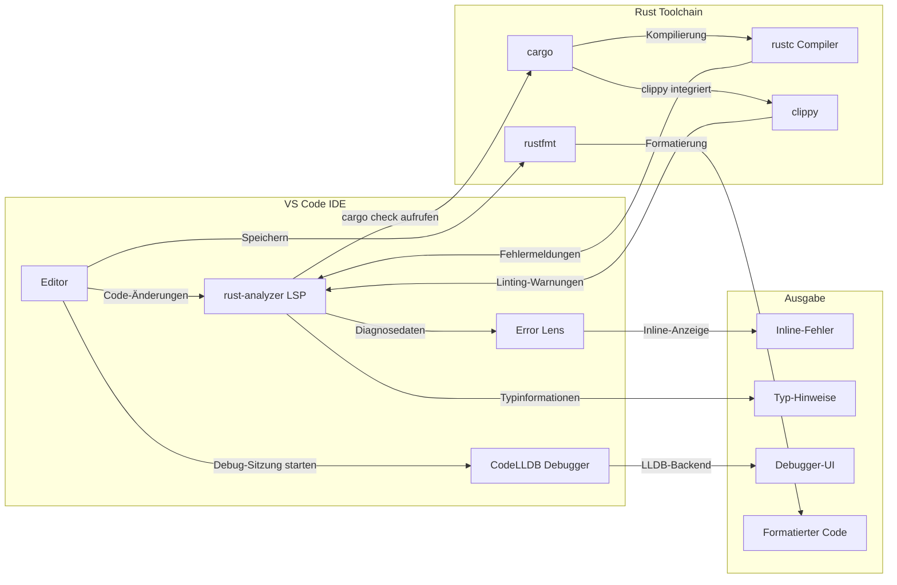

# Kapitel 22 – Der VS Code Planungs-Workflow

> Wie professionelle Rust-Entwickler Software planen, strukturieren und schrittweise implementieren – mit `todo!()`, inkrementellem Kompilieren und dem Besten aus VS Code.

---

## 1. Lernziele & Lernplan

### Überblick

Dieses Kapitel führt Sie in einen strukturierten, professionellen Entwicklungs-Workflow ein, der in der Rust-Community weit verbreitet ist. Sie lernen, wie Sie große Aufgaben in kleine, kompilierbare Schritte zerlegen, wie Sie Platzhalter-Makros sinnvoll einsetzen und wie Ihre Entwicklungsumgebung VS Code Sie dabei optimal unterstützt.

### Bloom-Lernziele

Nach dem Abschluss dieses Kapitels werden Sie in der Lage sein:

**1. Lernziel – Wissen & Verstehen (Bloom-Stufe 1–2)**
Sie können die Makros `todo!()`, `unimplemented!()` und `unreachable!()` in ihrer Syntax und ihrer Semantik beschreiben. Sie verstehen, wann und warum der Rust-Compiler diese Makros akzeptiert, obwohl Rückgabewerte eigentlich fehlen würden. Sie kennen den Unterschied zwischen `cargo check` und `cargo build` und können erklären, in welcher Situation welcher Befehl sinnvoller ist.

**2. Lernziel – Anwenden (Bloom-Stufe 3)**
Sie können einen vollständigen Planungs-Workflow in VS Code selbstständig durchführen: von der Struktur über Platzhalter bis zur fertigen Implementierung. Sie richten die VS Code-Erweiterungen `rust-analyzer`, `Error Lens` und `CodeLLDB` ein und nutzen diese aktiv. Sie bauen ein Taschenrechner-CLI-Projekt Schritt für Schritt auf, indem Sie den `Plan → Struktur → todo!() → Implementieren → Testen`-Zyklus anwenden.

**3. Lernziel – Analysieren & Evaluieren (Bloom-Stufe 4–5)**
Sie können Compiler-Fehlermeldungen als Implementierungsleitfaden interpretieren und priorisieren. Sie analysieren, welche Teile eines Programms zuerst implementiert werden sollten, und beurteilen die Qualität eines Entwicklungsplans. Sie sind in der Lage, fremden Rust-Code zu lesen und fehlende Implementierungen anhand der Typensignatur zu identifizieren.

### Empfohlener Lernplan

| Phase | Inhalt | Empfohlene Zeit |
|-------|--------|-----------------|
| Phase 1 | Abschnitte 1–3 lesen (Ziele, Definition, Motivation) | 15 Minuten |
| Phase 2 | Abschnitte 4–6 studieren (naiver Versuch, Fehler, Lösung) | 30 Minuten |
| Phase 3 | Tutorial (Abschnitt 7) selbst durchführen | 45 Minuten |
| Phase 4 | Deep Dive und Mentale Modelle (Abschnitt 8) | 20 Minuten |
| Phase 5 | Übungen (Abschnitt 9) lösen | 60 Minuten |
| Phase 6 | Merkzettel erstellen und Feynman-Technik anwenden | 20 Minuten |
| **Gesamt** | | **~3 Stunden** |

> [!TIP]
> Öffnen Sie VS Code parallel zu diesem Kapitel und führen Sie jeden Codeabschnitt selbst aus. Lernen durch Tun ist bei Rust besonders effektiv, weil der Compiler Ihnen sofort präzises Feedback gibt.

---

## 2. Die Definition

### Was ist der VS Code Planungs-Workflow?

Der **VS Code Planungs-Workflow** ist eine strukturierte Methode, um Rust-Programme inkrementell zu entwickeln. Er kombiniert mehrere Rust-spezifische Werkzeuge und Techniken zu einem durchgängigen Prozess:

```
Plan  →  Struktur  →  todo!()  →  Implementieren  →  Testen
  ↑                                                      |
  └──────────────── (iterativ wiederholen) ──────────────┘
```

Im Zentrum stehen drei Konzepte:

**1. Platzhalter-Makros**
Rust bietet eingebaute Makros, die als Platzhalter für noch nicht implementierten Code dienen. Der wichtigste ist `todo!()`. Diese Makros haben den Typ `!` (den sogenannten *Never-Typ*), was bedeutet, dass der Compiler sie an jeder Stelle im Code akzeptiert, unabhängig vom erwarteten Rückgabetyp.

**2. Inkrementelles Kompilieren**
Rust bietet zwei Befehle für die Überprüfung des Codes:
- `cargo check`: Überprüft den Code auf Typen- und Borrow-Fehler, ohne eine ausführbare Datei zu erstellen. Sehr schnell.
- `cargo build`: Kompiliert den Code vollständig zu einer ausführbaren Datei. Deutlich langsamer.

Im Planungs-Workflow wird `cargo check` häufig verwendet, um die Codestruktur iterativ zu verfeinern, ohne Zeit mit dem vollständigen Bauen zu verschwenden.

**3. VS Code als intelligente Entwicklungsumgebung**
Mit den richtigen Erweiterungen zeigt VS Code Ihnen Compiler-Fehler in Echtzeit, direkt im Editor, ohne dass Sie einen Befehl ausführen müssen.

### Die Platzhalter-Makros im Überblick

| Makro | Zweck | Verwendung |
|-------|-------|------------|
| `todo!()` | Markiert Code, der noch implementiert werden muss | Während der Planung und Entwicklung |
| `unimplemented!()` | Signalisiert, dass eine Funktion bewusst nicht implementiert ist | In Prototypen oder Teil-Implementierungen |
| `unreachable!()` | Markiert Code-Pfade, die laut Logik nie erreicht werden können | In `match`-Ausdrücken, nach `panic!()`-Aufrufen |

> [!NOTE]
> Alle drei Makros lösen zur Laufzeit einen Panic aus, wenn sie ausgeführt werden. Sie sind **keine** Null-Werte oder Standardimplementierungen – sie sind bewusste Signale an den Entwickler und den Leser des Codes.

---

## 3. Das Problem & Die Motivation

### Warum brauchen wir diesen Workflow?

Stellen Sie sich vor, Sie sollen ein neues Rust-Programm schreiben – zum Beispiel einen einfachen Taschenrechner als Kommandozeilenanwendung. Die Aufgabe ist überschaubar, aber nicht trivial. Wie fangen Sie an?

**Die typische Anfänger-Strategie:**

Viele Anfänger beginnen sofort mit der ersten Funktion und schreiben sie vollständig durch. Dann die zweite. Dann die dritte. Dieses Vorgehen führt häufig zu Problemen:

1. **Architekturfehler spät entdeckt**: Erst wenn viel Code geschrieben ist, merkt man, dass die grundlegende Struktur falsch war.
2. **Compilerfehler-Flut**: Wenn man versucht, alles auf einmal zu kompilieren, erscheinen Dutzende Fehlermeldungen gleichzeitig.
3. **Fehlender Überblick**: Man verliert sich in Details, ohne den Gesamtplan im Blick zu behalten.
4. **Motivationsverlust**: Eine Wand aus roten Compiler-Fehlern kann demotivierend wirken.

**Das konkrete Problem ohne Platzhalter:**

Angenommen, Sie möchten folgende Struktur aufbauen:

```rust
fn main() {
    let ergebnis = berechne(10, 5, '+');
    println!("Ergebnis: {}", ergebnis);
}

fn berechne(a: f64, b: f64, op: char) -> f64 {
    // Was soll hier stehen? Ich weiß noch nicht genau...
    // Der Compiler beschwert sich!
}
```

Wenn Sie den Funktionsrumpf leer lassen, gibt der Compiler einen Fehler aus:

```
error[E0308]: mismatched types
 --> src/main.rs:8:1
  |
7 | fn berechne(a: f64, b: f64, op: char) -> f64 {
  |                                           --- expected `f64` because of return type
8 | }
  |   ^ expected `f64`, found `()`
```

Der Compiler erwartet einen `f64`-Wert, aber der leere Rumpf gibt implizit `()` (den Unit-Typ) zurück. **Das Programm kompiliert nicht**, auch wenn Sie noch gar nicht mit der Implementierung beginnen wollten.

### Die Motivation: Compiler als Assistent, nicht als Hinderniss

Der entscheidende Geistesblitz für viele Rust-Entwickler ist diese Erkenntnis:

> **Der Rust-Compiler ist kein Feind, der Ihren Code ablehnt. Er ist ein Assistent, der Ihnen zeigt, was als nächstes getan werden muss.**

Mit dem richtigen Workflow nutzen Sie die Compiler-Fehlermeldungen aktiv als **Implementierungsfahrplan**. Jede Fehlermeldung ist eine Aufgabe auf Ihrer To-do-Liste. Wenn alle Fehler behoben sind, ist die Implementierung abgeschlossen.

> [!IMPORTANT]
> Der Planungs-Workflow dreht die Perspektive um: Statt Compiler-Fehler als Scheitern zu betrachten, werden sie als **Fortschrittsanzeige** interpretiert. Weniger Fehler = mehr Fortschritt.

### Warum ist das in Rust besonders wichtig?

In anderen Sprachen wie Python oder JavaScript können Sie Code ausführen, auch wenn Typen falsch sind oder Funktionen fehlen. Der Fehler tritt erst zur Laufzeit auf. In Rust gibt es keine Laufzeitüberraschungen dieser Art: **Entweder der Code kompiliert, oder er tut es nicht.** Das macht die Planung wichtiger – aber auch die Werkzeuge für das inkrementelle Entwickeln wertvoller.

---

## 4. Der Naive Versuch (Fehlerhafter Code)

### Szenario: Taschenrechner ohne Planungs-Workflow

Um die Probleme ohne den richtigen Workflow zu verstehen, betrachten wir einen typischen Anfänger-Ansatz: Man versucht, alle Teile des Programms gleichzeitig zu schreiben, ohne Platzhalter zu nutzen.

```rust
// FEHLERHAFTE VERSION – so sollte man es NICHT machen!
// Datei: src/main.rs

use std::io;

fn main() {
    println!("Einfacher Taschenrechner");
    
    let a = lese_zahl("Erste Zahl: ");
    let b = lese_zahl("Zweite Zahl: ");
    let op = lese_operator();
    
    let ergebnis = berechne(a, b, op);
    gib_ergebnis_aus(ergebnis);
}

// Fehler 1: Funktion existiert noch nicht vollständig
fn lese_zahl(prompt: &str) -> f64 {
    println!("{}", prompt);
    let mut eingabe = String::new();
    io::stdin().read_line(&mut eingabe).expect("Fehler beim Lesen");
    // FEHLER: trim() und parse() fehlen noch, aber ich schreibe schon den Rest
    eingabe  // FEHLER: gibt String zurück, nicht f64!
}

// Fehler 2: Operator-Lesung fehlt komplett
fn lese_operator() -> char {
    // Ich weiß noch nicht, wie das funktioniert
    // Leerer Rumpf → Compiler-Fehler!
}

// Fehler 3: Unvollständige match-Ausdrücke
fn berechne(a: f64, b: f64, op: char) -> f64 {
    match op {
        '+' => a + b,
        '-' => a - b,
        // Multiplikation und Division vergessen!
        // Compiler warnt: match ist nicht erschöpfend
    }
}

// Fehler 4: Falscher Rückgabetyp
fn gib_ergebnis_aus(ergebnis: f64) {
    // Ich wollte eigentlich einen formatierten String zurückgeben
    // aber habe vergessen, den Rückgabetyp anzupassen
    println!("Ergebnis: {:.2}", ergebnis);
    format!("= {:.2}", ergebnis)  // FEHLER: gibt String zurück, aber Signatur sagt ()
}
```

### Die Compiler-Fehlerlawine

Wenn Sie diesen Code mit `cargo build` übersetzen, erhalten Sie eine Flut von Fehlermeldungen:

```
error[E0308]: mismatched types
  --> src/main.rs:17:5
   |
12 | fn lese_zahl(prompt: &str) -> f64 {
   |                               --- expected `f64` because of return type
...
17 |     eingabe
   |     ^^^^^^^ expected `f64`, found `String`

error[E0308]: mismatched types
  --> src/main.rs:23:1
   |
22 | fn lese_operator() -> char {
   |                        ---- expected `char` because of return type
23 | }
   |  ^ expected `char`, found `()`

error[E0004]: non-exhaustive patterns: `'*' | '/' | _` not covered
  --> src/main.rs:27:11
   |
27 |     match op {
   |           ^^ patterns `'*' | '/' | _` not covered
   |
   = note: the matched value is of type `char`
   = note: match arms have incompatible types
help: ensure that all possible cases are being handled by adding a match arm with a wildcard pattern or an explicit pattern

error[E0308]: mismatched types
  --> src/main.rs:35:5
   |
34 | fn gib_ergebnis_aus(ergebnis: f64) {
   |                               ---- this function doesn't return a value
35 |     format!("= {:.2}", ergebnis)
   |     ^^^^^^^^^^^^^^^^^^^^^^^^^^^^ expected `()`, found `String`

error: aborting due to 4 previous errors

For more information about this error, try `rustc --explain E0308`.
```

### Das psychologische Problem

Vier Fehler auf einmal! Für einen Anfänger ist das überwältigend:

- **Wo soll ich anfangen?** Fehler 1, 2, 3 oder 4?
- **Sind die Fehler voneinander abhängig?** Wenn ich Fehler 1 behebe, verschwinden dann andere?
- **Habe ich die Architektur grundlegend falsch geplant?**

Dieser Zustand – viele Fehler, keine klare Priorität, mögliche gegenseitige Abhängigkeiten – ist einer der häufigsten Gründe, warum Anfänger an Rust scheitern oder frustriert aufgeben.

> [!WARNING]
> Versuchen Sie niemals, ein neues Programm vollständig zu schreiben und dann erst zu kompilieren. In Rust führt das fast immer zu einer Fehlerlawine, die schwer zu priorisieren ist.

---

## 5. Die Anatomie des Fehlers (Compiler-Output & Speicherdiagramme)

### Fehler 1: Typfehler beim Rückgabewert

```
error[E0308]: mismatched types
  --> src/main.rs:17:5
   |
12 | fn lese_zahl(prompt: &str) -> f64 {
   |                               --- expected `f64` because of return type
...
17 |     eingabe
   |     ^^^^^^^ expected `f64`, found `String`
```

**Anatomie dieses Fehlers:**

```
┌─────────────────────────────────────────────────────────────────┐
│  Fehlercode: E0308 – "mismatched types"                         │
│                                                                  │
│  Ursache:                                                        │
│  ┌──────────────┐                 ┌──────────────┐              │
│  │ Signatur     │  verspricht     │ Rückgabe     │              │
│  │ -> f64       │ ─────────────►  │ eingabe      │ (String!)    │
│  └──────────────┘                 └──────────────┘              │
│                                                                  │
│  Was der Compiler erwartet:    f64  (64-bit Gleitkommazahl)     │
│  Was er tatsächlich bekommt:   String (Heap-allozierter Text)   │
│                                                                  │
│  Stack-Layout zur Laufzeit (wenn es denn kompilieren würde):    │
│                                                                  │
│  Stack:   [eingabe_ptr → Heap]                                  │
│  Heap:    [ '4' | '2' | '.' | '5' ]                            │
│                                                                  │
│  Erwartet:                                                      │
│  Stack:   [42.5 als IEEE 754 float64]                           │
└─────────────────────────────────────────────────────────────────┘
```

### Fehler 2: Leerer Funktionsrumpf

```
error[E0308]: mismatched types
  --> src/main.rs:23:1
   |
22 | fn lese_operator() -> char {
   |                        ---- expected `char` because of return type
23 | }
   |  ^ expected `char`, found `()`
```

**Anatomie dieses Fehlers:**

In Rust ist der Wert eines leeren Blocks `()` (Unit-Typ). Wenn eine Funktion mit `-> char` deklariert ist, aber einen leeren Rumpf hat, gibt sie implizit `()` zurück. Das ist ein Typfehler.

```
┌─────────────────────────────────────────────────────────────────┐
│  fn lese_operator() -> char {                                   │
│                          ^^^^  Der Compiler erwartet:           │
│                                Ein char-Wert (4 Bytes, Unicode) │
│  }                                                              │
│  ^  Das schließende } gibt () zurück (Unit, 0 Bytes)            │
│                                                                  │
│  Typ-Ungleichgewicht:                                           │
│  char: 4 Bytes, enthält einen einzelnen Unicode-Codepunkt       │
│  ():   0 Bytes, enthält keine Information                        │
│                                                                  │
│  Der Compiler kann () nicht in char umwandeln.                  │
└─────────────────────────────────────────────────────────────────┘
```

### Fehler 3: Nicht erschöpfendes Match

```
error[E0004]: non-exhaustive patterns: `'*' | '/' | _` not covered
  --> src/main.rs:27:11
   |
27 |     match op {
   |           ^^ patterns `'*' | '/' | _` not covered
```

**Anatomie dieses Fehlers:**

Rust-`match`-Ausdrücke müssen **exhaustive** (erschöpfend) sein: Alle möglichen Werte des Typs müssen behandelt werden. `char` hat über eine Million mögliche Unicode-Werte – aber nur `'+'` und `'-'` werden abgedeckt.

```
┌─────────────────────────────────────────────────────────────────┐
│  Alle möglichen char-Werte:                                     │
│                                                                  │
│  ┌────────────────────────────────────────────────────────┐    │
│  │  Gesamter Unicode-Raum: U+0000 bis U+10FFFF            │    │
│  │  (über 1,1 Millionen Codepunkte)                       │    │
│  │                                                        │    │
│  │  ┌───────┐ ┌───────┐ ┌─────────────────────────────┐ │    │
│  │  │  '+'  │ │  '-'  │ │   Alles andere (unbehandelt) │ │    │
│  │  │ ✓ OK  │ │ ✓ OK  │ │   '*', '/', 'A', '€', ...   │ │    │
│  │  └───────┘ └───────┘ └─────────────────────────────┘ │    │
│  └────────────────────────────────────────────────────────┘    │
│                                                                  │
│  Rust verbietet diesen Code, weil zur Laufzeit ein unbehandel-  │
│  ter Wert auftreten könnte – und das wäre undefiniertes          │
│  Verhalten (in anderen Sprachen) oder ein Absturz (in Rust).    │
└─────────────────────────────────────────────────────────────────┘
```

### Fehler 4: Nicht verwendeter Rückgabewert

```
error[E0308]: mismatched types
  --> src/main.rs:35:5
   |
34 | fn gib_ergebnis_aus(ergebnis: f64) {
   |                               ---- this function doesn't return a value
35 |     format!("= {:.2}", ergebnis)
   |     ^^^^^^^^^^^^^^^^^^^^^^^^^^^^ expected `()`, found `String`
```

**Anatomie dieses Fehlers:**

`format!()` gibt einen `String` zurück. Wenn dieser der letzte Ausdruck in einer Funktion ist, die `()` zurückgeben soll (weil kein `->` Typ deklariert ist), gibt es einen Typfehler.

```
┌─────────────────────────────────────────────────────────────────┐
│  fn gib_ergebnis_aus(ergebnis: f64) {     ← kein Rückgabetyp   │
│                                           ← implizit: -> ()     │
│      println!("Ergebnis: {:.2}", ergebnis);  ← gibt () zurück  │
│      format!("= {:.2}", ergebnis)            ← gibt String zurück │
│  }                                                               │
│                                                                  │
│  Der letzte Ausdruck bestimmt den Rückgabewert.                 │
│  format!(...) → String                                          │
│  Aber die Funktion verspricht () → Widerspruch!                 │
│                                                                  │
│  Lösung A: Semikolon hinzufügen:  format!(...);  → ()          │
│  Lösung B: Rückgabetyp ändern: -> String                        │
└─────────────────────────────────────────────────────────────────┘
```

### Zusammenfassung: Was uns die Fehler sagen

| Fehler | Ursache | Lehre |
|--------|---------|-------|
| E0308 (lese_zahl) | `String` statt `f64` | Konvertierung mit `.parse()` nötig |
| E0308 (lese_operator) | Leerer Rumpf | Platzhalter `todo!()` verwenden |
| E0004 (berechne) | Match nicht erschöpfend | Wildcard `_` oder alle Fälle behandeln |
| E0308 (gib_ergebnis_aus) | Falscher letzter Ausdruck | Semikolon oder Rückgabetyp anpassen |

---

## 6. Die Lösung (Korrekter Code mit Planungs-Workflow)

### Schritt 1: Zuerst die Struktur, dann die Implementierung

Der korrekte Ansatz ist, zuerst die Struktur des Programms mit `todo!()` aufzubauen:

```rust
// KORREKTE STRUKTURIERUNG – Phase 1: Platzhalter
// Datei: src/main.rs

use std::io;

fn main() {
    println!("=== Einfacher Taschenrechner ===");
    
    let a = lese_zahl("Erste Zahl eingeben: ");
    let b = lese_zahl("Zweite Zahl eingeben: ");
    let op = lese_operator();
    
    match berechne(a, b, op) {
        Ok(ergebnis) => println!("Ergebnis: {:.4}", ergebnis),
        Err(fehler) => eprintln!("Fehler: {}", fehler),
    }
}

fn lese_zahl(prompt: &str) -> f64 {
    todo!("Zahl von der Standardeingabe lesen: {}", prompt)
}

fn lese_operator() -> char {
    todo!("Operator von der Standardeingabe lesen")
}

fn berechne(a: f64, b: f64, op: char) -> Result<f64, String> {
    todo!("Berechnung durchführen: {} {} {}", a, op, b)
}
```

Dieser Code **kompiliert** (mit einer Warnung über `io` – da wir es noch nicht nutzen). `cargo check` gibt keine Fehler aus!

> [!NOTE]
> Beachten Sie, dass `todo!()` einen Formatierungs-String wie `println!()` akzeptiert. Das ist sehr praktisch, um im Panic-Fehler zu dokumentieren, was genau noch implementiert werden muss.

### Schritt 2: Die todo!()-Makros verstehen

Das `todo!()`-Makro expandiert zu einem `panic!()` mit einer spezifischen Nachricht:

```rust
// todo!() ist äquivalent zu:
macro_rules! todo {
    () => {
        panic!("not yet implemented")
    };
    ($($arg:tt)+) => {
        panic!("not yet implemented: {}", format_args!($($arg)+))
    };
}
```

Das Entscheidende: Der **Rückgabetyp** von `todo!()` ist `!` (der Never-Typ). In Rust bedeutet `!`, dass ein Ausdruck **nie** einen Wert zurückgibt – er divergiert immer (durch Panic, endlose Schleife, etc.). Der Never-Typ ist kompatibel mit **jedem** anderen Typ, weshalb der Compiler kein Typfehler meldet.

```
┌─────────────────────────────────────────────────────────────────┐
│  Der Never-Typ (!) erklärt:                                     │
│                                                                  │
│  fn berechne(...) -> Result<f64, String> {                      │
│      todo!()   ← Typ: !                                         │
│  }                                                               │
│                                                                  │
│  Rust's Typsystem:                                              │
│                                                                  │
│  ! ist ein Subtyp von jedem Typ T.                              │
│  Das heißt: ! kann überall eingesetzt werden, wo T erwartet     │
│  wird – egal ob f64, String, Result<f64, String>, char, etc.    │
│                                                                  │
│  Warum? Weil ein Ausdruck vom Typ ! nie einen Wert produziert.  │
│  Es gibt keinen Wert, der vom Typ ! wäre – der Code divergiert. │
│  Der Compiler muss also keinen Typfehler melden.                │
└─────────────────────────────────────────────────────────────────┘
```

### Schritt 3: unimplemented!() und unreachable!()

**`unimplemented!()`:**

```rust
// unimplemented!() vs todo!():
// Semantisch fast identisch, aber die Botschaft ist verschieden.

fn geplante_funktion() -> i32 {
    todo!()  // "Diese Funktion soll noch implementiert werden"
}

fn bewusst_fehlende_funktion() -> i32 {
    unimplemented!()  // "Diese Funktion wird für diesen Use-Case nicht benötigt"
}
```

`unimplemented!()` signalisiert: "Diese Funktion existiert in der Schnittstelle, aber ich habe sie für diesen speziellen Kontext nicht implementiert." Das ist nützlich, wenn Sie zum Beispiel ein Trait implementieren, aber nicht alle Methoden benötigen.

```rust
use std::fmt;

struct MeinTyp(i32);

impl fmt::Display for MeinTyp {
    fn fmt(&self, f: &mut fmt::Formatter) -> fmt::Result {
        write!(f, "MeinTyp({})", self.0)
    }
}

impl fmt::Debug for MeinTyp {
    fn fmt(&self, f: &mut fmt::Formatter) -> fmt::Result {
        // Debug-Formatierung ist für diesen Prototyp nicht wichtig
        unimplemented!("Debug-Formatierung wurde bewusst nicht implementiert")
    }
}
```

**`unreachable!()`:**

```rust
fn klassifiziere_ampel(farbe: &str) -> &str {
    match farbe {
        "rot" => "Stopp",
        "gelb" => "Achtung",
        "grün" => "Fahren",
        // Nach dieser Validierung sind nur die drei Farben möglich.
        // Alles andere kann laut Logik nicht auftreten.
        _ => unreachable!("Ungültige Ampelfarbe sollte bereits abgefangen worden sein: {}", farbe),
    }
}

fn validiere_und_klassifiziere(farbe: &str) -> Option<&str> {
    if farbe != "rot" && farbe != "gelb" && farbe != "grün" {
        return None;
    }
    // An dieser Stelle WISSEN wir, dass farbe gültig ist.
    Some(klassifiziere_ampel(farbe))
}
```

> [!CAUTION]
> Verwenden Sie `unreachable!()` nur dann, wenn Sie **absolut sicher** sind, dass der Code-Pfad logisch unmöglich ist. Ein falsches `unreachable!()` verursacht einen Panic zur Laufzeit, der schwer zu debuggen ist.

### Schritt 4: Die vollständige Implementierung

Nachdem die Struktur mit `todo!()` steht und `cargo check` keine Fehler mehr zeigt, implementieren wir die Funktionen eine nach der anderen:

```rust
// VOLLSTÄNDIGE IMPLEMENTIERUNG
// Datei: src/main.rs

use std::io;
use std::io::Write;

fn main() {
    println!("╔══════════════════════════════╗");
    println!("║   Rust Taschenrechner v1.0   ║");
    println!("╚══════════════════════════════╝");
    println!();
    
    loop {
        let a = match lese_zahl("Erste Zahl (oder 'q' zum Beenden): ") {
            Some(zahl) => zahl,
            None => {
                println!("Auf Wiedersehen!");
                break;
            }
        };
        
        let op = lese_operator();
        
        let b = match lese_zahl("Zweite Zahl: ") {
            Some(zahl) => zahl,
            None => {
                println!("Auf Wiedersehen!");
                break;
            }
        };
        
        match berechne(a, b, op) {
            Ok(ergebnis) => println!("  {} {} {} = {:.4}\n", a, op, b, ergebnis),
            Err(fehler) => eprintln!("  Fehler: {}\n", fehler),
        }
    }
}

fn lese_zahl(prompt: &str) -> Option<f64> {
    loop {
        print!("{}", prompt);
        // Puffer leeren, damit der Prompt vor der Eingabe erscheint
        io::stdout().flush().expect("Fehler beim Leeren des Puffers");
        
        let mut eingabe = String::new();
        io::stdin()
            .read_line(&mut eingabe)
            .expect("Fehler beim Lesen der Eingabe");
        
        let eingabe = eingabe.trim();
        
        if eingabe.eq_ignore_ascii_case("q") {
            return None;
        }
        
        match eingabe.parse::<f64>() {
            Ok(zahl) => return Some(zahl),
            Err(_) => eprintln!("  Ungültige Zahl: '{}'. Bitte versuchen Sie es erneut.", eingabe),
        }
    }
}

fn lese_operator() -> char {
    loop {
        print!("Operator (+, -, *, /): ");
        io::stdout().flush().expect("Fehler beim Leeren des Puffers");
        
        let mut eingabe = String::new();
        io::stdin()
            .read_line(&mut eingabe)
            .expect("Fehler beim Lesen der Eingabe");
        
        let eingabe = eingabe.trim();
        
        if let Some(c) = eingabe.chars().next() {
            match c {
                '+' | '-' | '*' | '/' => return c,
                _ => eprintln!("  Ungültiger Operator: '{}'. Bitte +, -, * oder / eingeben.", c),
            }
        } else {
            eprintln!("  Keine Eingabe. Bitte einen Operator eingeben.");
        }
    }
}

fn berechne(a: f64, b: f64, op: char) -> Result<f64, String> {
    match op {
        '+' => Ok(a + b),
        '-' => Ok(a - b),
        '*' => Ok(a * b),
        '/' => {
            if b == 0.0 {
                Err(format!("Division durch Null ist nicht erlaubt"))
            } else {
                Ok(a / b)
            }
        }
        _ => unreachable!("Ungültiger Operator '{}' – sollte durch lese_operator() abgefangen werden", op),
    }
}
```

---

## 7. Kleines Tutorial: VS Code Planungs-Workflow in 5 Schritten

### Schritt 1: VS Code-Erweiterungen einrichten

Bevor Sie mit dem eigentlichen Workflow beginnen, müssen Sie VS Code korrekt einrichten. Öffnen Sie VS Code und installieren Sie die folgenden Erweiterungen:

**Erweiterung 1: rust-analyzer**

`rust-analyzer` ist das offizielle Language Server Protocol (LSP)-Backend für Rust. Es bietet:
- Echtzeit-Typinformationen beim Überfahren von Variablen
- Automatische Code-Vervollständigung
- Sofortige Fehlermeldungen (ohne manuelles Ausführen von `cargo check`)
- Code-Navigation (zur Definition springen, Referenzen finden)
- Refactoring-Unterstützung

Installation via Kommandozeile:
```bash
# VS Code CLI (falls installiert):
code --install-extension rust-lang.rust-analyzer

# Oder in VS Code: Strg+Shift+X → "rust-analyzer" suchen → Installieren
```

**Erweiterung 2: Error Lens**

`Error Lens` zeigt Compiler-Fehlermeldungen direkt im Editor, in der Zeile des Fehlers. Das ist extrem hilfreich, weil Sie nicht zum "Probleme"-Bereich scrollen müssen.

```bash
code --install-extension usernamehw.errorlens
```

**Erweiterung 3: CodeLLDB**

`CodeLLDB` ist ein Debugger-Adapter, der das Debuggen von Rust-Programmen direkt in VS Code ermöglicht:
- Haltepunkte setzen
- Variablen zur Laufzeit inspizieren
- Stack-Traces durchgehen
- Conditional Breakpoints

```bash
code --install-extension vadimcn.vscode-lldb
```

> [!TIP]
> Nach der Installation von `rust-analyzer` öffnen Sie ein Rust-Projekt und warten Sie, bis `rust-analyzer` in der Statusleiste unten links "Rust Analyzer: Loading" und dann "Rust Analyzer: Ready" anzeigt. Das kann beim ersten Mal einige Minuten dauern, da Indexierungsarbeit durchgeführt wird.

**VS Code Einstellungen für optimale Rust-Entwicklung:**

Öffnen Sie Ihre VS Code `settings.json` (Strg+Shift+P → "Open User Settings JSON") und fügen Sie folgendes hinzu:

```json
{
  "editor.formatOnSave": true,
  "[rust]": {
    "editor.defaultFormatter": "rust-lang.rust-analyzer",
    "editor.formatOnSave": true
  },
  "rust-analyzer.checkOnSave.command": "clippy",
  "rust-analyzer.cargo.features": "all",
  "errorLens.enabledDiagnosticLevels": ["error", "warning", "info"],
  "errorLens.fontSize": "12px",
  "lldb.showDisassembly": "never"
}
```

Diese Einstellungen bewirken:
- Automatische Formatierung mit `rustfmt` beim Speichern
- `clippy` (der Rust-Linter) wird bei jedem Speichern ausgeführt statt nur `cargo check`
- Error Lens zeigt Fehler, Warnungen und Informationen an

### Schritt 2: Neues Projekt anlegen und planen

```bash
# Neues Projekt erstellen
cargo new taschenrechner_cli
cd taschenrechner_cli

# In VS Code öffnen
code .
```

**Den Plan aufschreiben – zuerst als Kommentare:**

```rust
// PLAN: Taschenrechner-CLI
//
// Funktionen die ich brauche:
// 1. main()                    → Hauptschleife, Koordination
// 2. lese_zahl(prompt)         → Eingabe einer Zahl von stdin
// 3. lese_operator()           → Eingabe eines Operators von stdin  
// 4. berechne(a, b, op)        → Mathematische Berechnung
// 5. formatiere_ergebnis(r)    → Ausgabe formatieren
//
// Datenfluss:
// stdin → lese_zahl → f64
// stdin → lese_operator → char
// (f64, f64, char) → berechne → Result<f64, String>
// Result<f64, String> → formatiere_ergebnis → String
// String → stdout
//
// Fehlerbehandlung:
// - Ungültige Zahl: Erneut fragen (loop)
// - Ungültiger Operator: Erneut fragen (loop)
// - Division durch Null: Err(...) zurückgeben
// - EOF: Programm beenden

fn main() {
    todo!()
}
```

> [!IMPORTANT]
> Dieser erste Schritt – den Plan als Kommentare zu schreiben – ist der wichtigste. Er zwingt Sie, über die Architektur nachzudenken, bevor Sie Code schreiben. In professionellen Teams nennt man das "Design Before Code".

### Schritt 3: Signaturen mit todo!() aufbauen

Jetzt übersetzen wir den Plan in kompilierbaren Code:

```rust
use std::io;

fn main() {
    todo!("Hauptschleife implementieren")
}

/// Liest eine Zahl von der Standardeingabe.
/// Gibt None zurück, wenn der Benutzer 'q' eingibt.
fn lese_zahl(prompt: &str) -> Option<f64> {
    todo!("Zahl lesen von: {}", prompt)
}

/// Liest einen Operator (+, -, *, /) von der Standardeingabe.
fn lese_operator() -> char {
    todo!("Operator lesen")
}

/// Führt die Berechnung durch.
/// Gibt Err zurück bei Division durch Null oder ungültigem Operator.
fn berechne(a: f64, b: f64, op: char) -> Result<f64, String> {
    todo!("Berechnung: {} {} {}", a, op, b)
}

/// Formatiert das Ergebnis für die Ausgabe.
fn formatiere_ergebnis(a: f64, b: f64, op: char, ergebnis: f64) -> String {
    todo!("Ergebnis formatieren")
}
```

**`cargo check` ausführen:**

```bash
$ cargo check
   Compiling taschenrechner_cli v0.1.0
warning: unused import: `std::io`
 --> src/main.rs:1:5
  |
1 | use std::io;
  |     ^^^^^^^
  |
  = note: `#[warn(unused_imports)]` on by default

warning: `taschenrechner_cli` (bin "taschenrechner_cli") generated 1 warning
    Finished `dev` profile [unoptimized + debuginfo] target(s) in 0.42s
```

Hervorragend! Nur eine Warnung (ungenutzer Import, da wir `io` noch nicht wirklich nutzen), aber **keine Fehler**. Die Struktur ist korrekt.

### Schritt 4: Funktion für Funktion implementieren

Jetzt implementieren wir eine Funktion nach der anderen, beginnend mit der einfachsten:

**Iteration 1: `formatiere_ergebnis` implementieren**

```rust
fn formatiere_ergebnis(a: f64, b: f64, op: char, ergebnis: f64) -> String {
    format!("{} {} {} = {:.4}", a, op, b, ergebnis)
}
```

`cargo check` → Keine Fehler. Weiter.

**Iteration 2: `berechne` implementieren**

```rust
fn berechne(a: f64, b: f64, op: char) -> Result<f64, String> {
    match op {
        '+' => Ok(a + b),
        '-' => Ok(a - b),
        '*' => Ok(a * b),
        '/' => {
            if b == 0.0 {
                Err(String::from("Division durch Null"))
            } else {
                Ok(a / b)
            }
        }
        _ => unreachable!("Operator '{}' ist ungültig", op),
    }
}
```

`cargo check` → Keine Fehler. Weiter.

**Iteration 3: `lese_operator` implementieren**

```rust
fn lese_operator() -> char {
    use std::io::Write;
    
    loop {
        print!("Operator (+, -, *, /): ");
        io::stdout().flush().unwrap();
        
        let mut eingabe = String::new();
        io::stdin().read_line(&mut eingabe).unwrap();
        
        match eingabe.trim().chars().next() {
            Some('+') | Some('-') | Some('*') | Some('/') => {
                return eingabe.trim().chars().next().unwrap();
            }
            Some(c) => eprintln!("Ungültiger Operator: '{}'", c),
            None => eprintln!("Keine Eingabe"),
        }
    }
}
```

`cargo check` → Keine Fehler. Weiter.

**Iteration 4: `lese_zahl` implementieren**

```rust
fn lese_zahl(prompt: &str) -> Option<f64> {
    use std::io::Write;
    
    loop {
        print!("{}", prompt);
        io::stdout().flush().unwrap();
        
        let mut eingabe = String::new();
        io::stdin().read_line(&mut eingabe).unwrap();
        
        let eingabe = eingabe.trim();
        
        if eingabe.eq_ignore_ascii_case("q") {
            return None;
        }
        
        match eingabe.parse::<f64>() {
            Ok(zahl) => return Some(zahl),
            Err(_) => eprintln!("Ungültige Zahl: '{}'. Versuchen Sie es erneut.", eingabe),
        }
    }
}
```

`cargo check` → Keine Fehler. Weiter.

**Iteration 5: `main` implementieren**

```rust
fn main() {
    println!("=== Rust Taschenrechner ===");
    
    loop {
        let a = match lese_zahl("Erste Zahl (q = Beenden): ") {
            Some(z) => z,
            None => break,
        };
        
        let op = lese_operator();
        
        let b = match lese_zahl("Zweite Zahl: ") {
            Some(z) => z,
            None => break,
        };
        
        match berechne(a, b, op) {
            Ok(ergebnis) => println!("{}", formatiere_ergebnis(a, b, op, ergebnis)),
            Err(e) => eprintln!("Fehler: {}", e),
        }
        
        println!();
    }
    
    println!("Auf Wiedersehen!");
}
```

`cargo check` → Keine Fehler. `cargo run` → Das Programm läuft!

### Schritt 5: Testen und Verfeinern

```bash
$ cargo run
=== Rust Taschenrechner ===
Erste Zahl (q = Beenden): 42
Operator (+, -, *, /): *
Zweite Zahl: 3.14
42 * 3.14 = 131.8800

Erste Zahl (q = Beenden): 10
Operator (+, -, *, /): /
Zweite Zahl: 0
Fehler: Division durch Null

Erste Zahl (q = Beenden): q
Auf Wiedersehen!
```

Das Programm funktioniert korrekt. Zusätzlich können Sie `cargo clippy` ausführen, um weitere Verbesserungsvorschläge zu erhalten:

```bash
$ cargo clippy
    Checking taschenrechner_cli v0.1.0
    Finished `dev` profile [unoptimized + debuginfo] target(s) in 0.38s
```

Keine Clippy-Warnungen – der Code ist sauber!

> [!TIP]
> Nutzen Sie `cargo test` für Unit-Tests Ihrer Funktionen. Für dieses Projekt können Sie zum Beispiel `berechne()` direkt testen, ohne Benutzereingaben zu benötigen:
> ```rust
> #[cfg(test)]
> mod tests {
>     use super::*;
>     
>     #[test]
>     fn test_addition() {
>         assert_eq!(berechne(3.0, 4.0, '+'), Ok(7.0));
>     }
>     
>     #[test]
>     fn test_division_durch_null() {
>         assert!(berechne(5.0, 0.0, '/').is_err());
>     }
> }
> ```

---

## 8. Mentale Modelle & Deep Dive

### Das mentale Modell: Compilierung als Kommunikation

Der wichtigste Denkwechsel, den Sie vollziehen müssen, ist folgender:

```
┌─────────────────────────────────────────────────────────────────┐
│                  FALSCHES mentales Modell                       │
│                                                                  │
│   Entwickler                    Compiler                        │
│   ──────────                    ────────                        │
│   "Ich schreibe Code"    →      "Ich lehne Code ab"            │
│   "Ich kämpfe gegen      ←      "Ich bin streng und           │
│    den Compiler"                 ungnädig"                      │
│                                                                  │
│   Ergebnis: Frustration, Resignation, Fehlerfluten             │
└─────────────────────────────────────────────────────────────────┘

┌─────────────────────────────────────────────────────────────────┐
│                  KORREKTES mentales Modell                      │
│                                                                  │
│   Entwickler                    Compiler                        │
│   ──────────                    ────────                        │
│   "Ich plane die         →      "Ich prüfe die Struktur        │
│    Struktur"                     und gebe Feedback"             │
│   "Ich verstehe           ←      "Ich zeige dir, was           │
│    das Feedback"                  fehlt oder falsch ist"        │
│   "Ich implementiere     →      "Ich bestätige jeden           │
│    Schritt für Schritt"          Fortschritt"                   │
│                                                                  │
│   Ergebnis: Klarheit, Struktur, schrittweiser Erfolg           │
└─────────────────────────────────────────────────────────────────┘
```

### cargo check vs cargo build: Ein Vergleich

```
┌─────────────────────────────────────────────────────────────────┐
│                                                                  │
│  cargo check                    cargo build                     │
│  ───────────                    ────────────                    │
│                                                                  │
│  ┌─────────┐                    ┌─────────┐                    │
│  │  Parse  │ Quellcode lesen    │  Parse  │ Quellcode lesen    │
│  └────┬────┘                    └────┬────┘                    │
│       ↓                              ↓                          │
│  ┌─────────┐                    ┌─────────┐                    │
│  │  Type-  │ Typüberprüfung     │  Type-  │ Typüberprüfung     │
│  │  Check  │                    │  Check  │                    │
│  └────┬────┘                    └────┬────┘                    │
│       ↓                              ↓                          │
│  ┌─────────┐                    ┌─────────┐                    │
│  │ Borrow- │ Borrow-Prüfung     │ Borrow- │ Borrow-Prüfung     │
│  │  Check  │                    │  Check  │                    │
│  └────┬────┘                    └────┬────┘                    │
│       │                              ↓                          │
│       │ STOP                    ┌─────────┐                    │
│       ↓                         │  LLVM-  │ Code-Generierung   │
│  ✓ Fertig!                      │  IR Gen │ (langsam!)         │
│  (sehr schnell: ~0.3s)          └────┬────┘                    │
│                                      ↓                          │
│                                 ┌─────────┐                    │
│                                 │  LLVM   │ Optimierungen      │
│                                 │ Optimize│ (sehr langsam!)    │
│                                 └────┬────┘                    │
│                                      ↓                          │
│                                 ┌─────────┐                    │
│                                 │  Link   │ Verlinkung         │
│                                 └────┬────┘                    │
│                                      ↓                          │
│                                 ✓ Binary fertig!               │
│                                 (langsam: 5–60s bei großen     │
│                                  Projekten)                    │
└─────────────────────────────────────────────────────────────────┘

Empfehlung während der Entwicklung:
  → cargo check     (nach jeder kleinen Änderung)
  → cargo build     (wenn Sie das Programm ausführen wollen)
  → cargo test      (um Tests zu überprüfen)
  → cargo clippy    (vor dem Commit)
```

### Mermaid-Flowchart: Der vollständige Planungs-Workflow

```mermaid
flowchart TD
    A([🚀 Projektstart]) --> B[Anforderungen verstehen]
    B --> C[Plan als Kommentare schreiben]
    C --> D[Funktionssignaturen definieren]
    D --> E["todo!() als Rümpfe verwenden"]
    E --> F{cargo check}
    F -- Fehler --> G[Signaturen korrigieren]
    G --> F
    F -- Kein Fehler --> H[Einfachste Funktion wählen]
    H --> I[Funktion implementieren]
    I --> J{cargo check}
    J -- Fehler --> K[Fehler analysieren & beheben]
    K --> J
    J -- Kein Fehler --> L{Noch todo!() vorhanden?}
    L -- Ja --> H
    L -- Nein --> M[cargo build]
    M --> N{Kompiliert?}
    N -- Nein --> O[Unerwarteter Fehler analysieren]
    O --> K
    N -- Ja --> P[Manuell testen]
    P --> Q{Funktioniert alles?}
    Q -- Nein --> R[Debugger / eprintln! verwenden]
    R --> I
    Q -- Ja --> S[cargo clippy ausführen]
    S --> T{Clippy-Warnungen?}
    T -- Ja --> U[Warnungen beheben]
    U --> S
    T -- Nein --> V[cargo test ausführen]
    V --> W{Tests bestehen?}
    W -- Nein --> X[Tests analysieren & Code korrigieren]
    X --> I
    W -- Ja --> Y([✅ Feature abgeschlossen])

    style A fill:#2d5a27,color:#fff
    style Y fill:#2d5a27,color:#fff
    style F fill:#1a3a6b,color:#fff
    style J fill:#1a3a6b,color:#fff
    style N fill:#1a3a6b,color:#fff
    style Q fill:#1a3a6b,color:#fff
    style T fill:#1a3a6b,color:#fff
    style W fill:#1a3a6b,color:#fff
```

### ASCII-Diagramm: Die todo!()-Hierarchie

```
┌─────────────────────────────────────────────────────────────────┐
│                    Platzhalter-Makros in Rust                   │
│                                                                  │
│  ┌─────────────────────────────────────────────────────────┐   │
│  │                       todo!()                           │   │
│  │                                                         │   │
│  │  Bedeutung: "Hier fehlt noch Implementierung"           │   │
│  │  Botschaft: "Ich plane diesen Code zu schreiben"        │   │
│  │  Laufzeit:  panic!("not yet implemented: ...")          │   │
│  │  Verwendung: Während aktiver Entwicklung                │   │
│  │                                                         │   │
│  │  Beispiel:                                              │   │
│  │  fn addiere(a: i32, b: i32) -> i32 {                   │   │
│  │      todo!("Addition implementieren")                   │   │
│  │  }                                                      │   │
│  └─────────────────────────────────────────────────────────┘   │
│                                                                  │
│  ┌─────────────────────────────────────────────────────────┐   │
│  │                   unimplemented!()                      │   │
│  │                                                         │   │
│  │  Bedeutung: "Diese Funktion ist bewusst nicht           │   │
│  │              implementiert"                             │   │
│  │  Botschaft: "Dieser Pfad wird nicht benötigt"           │   │
│  │  Laufzeit:  panic!("not implemented: ...")              │   │
│  │  Verwendung: Partielle Trait-Implementierungen,         │   │
│  │              Stubs in Bibliotheken                      │   │
│  │                                                         │   │
│  │  Beispiel:                                              │   │
│  │  impl Iterator for MeinIterator {                       │   │
│  │      fn next(&mut self) -> Option<i32> {                │   │
│  │          unimplemented!()  // zu komplex für jetzt      │   │
│  │      }                                                  │   │
│  │  }                                                      │   │
│  └─────────────────────────────────────────────────────────┘   │
│                                                                  │
│  ┌─────────────────────────────────────────────────────────┐   │
│  │                    unreachable!()                       │   │
│  │                                                         │   │
│  │  Bedeutung: "Dieser Code sollte logisch nie             │   │
│  │              ausgeführt werden"                         │   │
│  │  Botschaft: "Wenn wir hier landen, ist das ein Bug"     │   │
│  │  Laufzeit:  panic!("entered unreachable code: ...")     │   │
│  │  Verwendung: Nach erschöpfenden Validierungen,          │   │
│  │              in theoretisch unmöglichen match-Armen     │   │
│  │                                                         │   │
│  │  Beispiel:                                              │   │
│  │  fn verarbeite_status(s: Status) {                      │   │
│  │      match s {                                          │   │
│  │          Status::Ok => {},                              │   │
│  │          Status::Fehler => {},                          │   │
│  │          // Status hat nur 2 Varianten:                 │   │
│  │          _ => unreachable!(),                           │   │
│  │      }                                                  │   │
│  │  }                                                      │   │
│  └─────────────────────────────────────────────────────────┘   │
└─────────────────────────────────────────────────────────────────┘
```

### Deep Dive: Der Never-Typ (`!`)

Das ist einer der faszinierendsten Teile von Rusts Typsystem. Verstehen Sie dieses Konzept, und der Grund, warum `todo!()` an jeder Stelle im Code funktioniert, wird kristallklar.

```rust
// Der Never-Typ in der Praxis:

// 1. panic! hat den Typ !
let x: i32 = panic!("Fehler");  // Kompiliert! panic! gibt nie einen Wert zurück.

// 2. todo! hat den Typ !
let y: String = todo!();  // Kompiliert! todo! gibt nie einen Wert zurück.

// 3. loop ohne break hat den Typ !
let z: f64 = loop {
    // Eine unendliche Schleife "gibt nie zurück"
    // Daher hat sie den Typ !
};  // Typ-theoretisch korrekt (aber das Programm läuft ewig)

// 4. continue hat den Typ !
let w: i32 = if true {
    42
} else {
    continue  // continue "gibt nie zurück" → Typ !
};

// 5. return hat den Typ !
fn beispiel() -> i32 {
    let x = if true {
        42
    } else {
        return 0  // return "gibt nie zurück" → Typ !
    };
    x
}
```

**Warum ist `!` ein Subtyp von jedem Typ?**

```
┌─────────────────────────────────────────────────────────────────┐
│  Formale Typentheorie:                                          │
│                                                                  │
│  In Rusts Typsystem gilt:                                       │
│  ! <: T  für jeden Typ T                                        │
│  (! ist ein Subtyp von T)                                       │
│                                                                  │
│  Warum? Weil die Menge der Werte vom Typ ! LEER ist.            │
│  Es gibt keinen Wert vom Typ !.                                 │
│  Eine leere Menge ist eine Teilmenge jeder Menge.               │
│                                                                  │
│  Mathematisch:                                                   │
│  {} ⊆ {0, 1, 2, ...}   (leere Menge ⊆ natürliche Zahlen)      │
│  {} ⊆ {true, false}    (leere Menge ⊆ bool)                    │
│  {} ⊆ {alle Strings}   (leere Menge ⊆ String)                  │
│                                                                  │
│  Das bedeutet:                                                   │
│  Wenn eine Funktion den Typ ! hat, kann sie überall eingesetzt   │
│  werden, wo ein Wert erwartet wird – weil es keinen Wert gibt,   │
│  der gegen den erwarteten Typ verstoßen könnte.                 │
│  Die Funktion gibt sowieso nie zurück!                           │
└─────────────────────────────────────────────────────────────────┘
```

### Der rust-analyzer als Entwicklungsassistent

`rust-analyzer` bietet weit mehr als nur Fehlermeldungen. Hier sind die wichtigsten Funktionen im Kontext des Planungs-Workflows:

**1. Inlay Hints (Typ-Hinweise):**

```rust
fn main() {
    let x = 42;        // rust-analyzer zeigt an: i32
    let y = "Hallo";   // rust-analyzer zeigt an: &str
    let z = vec![1, 2, 3];  // rust-analyzer zeigt an: Vec<i32>
}
```

Diese Typ-Hinweise werden direkt im Editor als grauer Text nach der Variable angezeigt, auch wenn Sie keinen expliziten Typ angegeben haben.

**2. Hover-Dokumentation:**

Wenn Sie mit der Maus über eine Funktion fahren, zeigt `rust-analyzer` die vollständige Dokumentation der Funktion an, einschließlich Signatur, Beschreibung und Beispiele. Das ist besonders nützlich für Funktionen aus der Standardbibliothek.

**3. Code Actions (Strg+.):**

`rust-analyzer` bietet automatische Refactoring-Aktionen:
- "Fehlende match-Arme einfügen" → Alle Varianten eines Enums werden automatisch als leere Arme eingefügt
- "Import hinzufügen" → Fehlt ein `use`-Statement, schlägt `rust-analyzer` es vor
- "Funktion extrahieren" → Markierten Code in eine neue Funktion auslagern

**4. Semantic Highlighting:**

`rust-analyzer` färbt verschiedene Konstrukte unterschiedlich ein:
- Lokale Variablen: blau
- Funktionen: gelb
- Typen: grün
- Makros: orange
- Mutierbare Variablen: unterstrichen

Das macht den Code auf einen Blick verständlicher.

### Mermaid: VS Code Erweiterungen und ihre Interaktionen



---

## 9. Drei Übungen

### Übung 1 (Leicht): Temperaturkonverter mit todo!()

**Aufgabe:**

Erstellen Sie ein neues Cargo-Projekt namens `temperatur_konverter`. Legen Sie die Struktur des Programms mit `todo!()` an, und implementieren Sie dann die Funktionen Schritt für Schritt.

Das Programm soll:
1. Den Benutzer fragen, ob er Celsius in Fahrenheit oder Fahrenheit in Celsius umrechnen möchte
2. Die Temperatur einlesen
3. Die Konvertierung durchführen
4. Das Ergebnis ausgeben

**Geforderte Funktionssignaturen (mit todo!):**

```rust
fn main() {
    todo!()
}

fn celsius_zu_fahrenheit(celsius: f64) -> f64 {
    todo!()
}

fn fahrenheit_zu_celsius(fahrenheit: f64) -> f64 {
    todo!()
}

fn lese_zahl(prompt: &str) -> f64 {
    todo!()
}

fn lese_richtung() -> char {
    // 'c' = Celsius→Fahrenheit, 'f' = Fahrenheit→Celsius
    todo!()
}
```

**Formeln:**
- Celsius → Fahrenheit: `F = C × 9/5 + 32`
- Fahrenheit → Celsius: `C = (F - 32) × 5/9`

**Schritte:**
1. Projekt anlegen, Struktur mit todo!() erstellen
2. `cargo check` ausführen → Keine Fehler erwarten
3. Einfachste Funktion zuerst implementieren (`celsius_zu_fahrenheit`)
4. `cargo check` nach jeder Funktion
5. Am Ende `cargo run` testen

**Erwartete Ausgabe:**
```
Temperaturkonverter
Richtung (c = C→F, f = F→C): c
Temperatur: 100
100°C = 212°F
```

---

**Hints für Übung 1:**

> [!TIP]
> **Hint 1:** Die Formel Celsius→Fahrenheit: `celsius * 9.0 / 5.0 + 32.0`. Beachten Sie die `.0`, damit Rust es als Gleitkomma-Arithmetik behandelt.
>
> **Hint 2:** Für `lese_richtung()` können Sie `eingabe.trim().chars().next()` verwenden, um das erste Zeichen der Eingabe zu bekommen.
>
> **Hint 3:** Verwenden Sie `match` mit `'c' | 'C'` und `'f' | 'F'` um Groß- und Kleinschreibung zu unterstützen.

---

### Übung 2 (Mittel): Einkaufslisten-Verwaltung

**Aufgabe:**

Erstellen Sie ein Programm, das eine Einkaufsliste verwaltet. Der Benutzer kann Artikel hinzufügen, die Liste anzeigen und Artikel als gekauft markieren.

**Geforderte Struktur:**

```rust
#[derive(Debug)]
struct Artikel {
    name: String,
    menge: u32,
    gekauft: bool,
}

fn main() {
    todo!()
}

fn artikel_hinzufügen(liste: &mut Vec<Artikel>, name: String, menge: u32) {
    todo!()
}

fn liste_anzeigen(liste: &[Artikel]) {
    todo!()
}

fn artikel_kaufen(liste: &mut Vec<Artikel>, index: usize) -> Result<(), String> {
    todo!()
}

fn lese_befehl() -> String {
    todo!()
}

fn befehl_verarbeiten(liste: &mut Vec<Artikel>, befehl: &str) -> bool {
    // Gibt false zurück, wenn das Programm beendet werden soll
    todo!()
}
```

**Befehle:**
- `hinzufuegen <Name> <Menge>` → Artikel hinzufügen
- `anzeigen` → Liste anzeigen
- `kaufen <Index>` → Artikel als gekauft markieren
- `beenden` → Programm beenden

**Erwartete Ausgabe:**
```
=== Einkaufsliste ===
> hinzufuegen Äpfel 6
✓ 'Äpfel' (6 Stück) hinzugefügt.

> anzeigen
[1] [ ] Äpfel (6x)

> kaufen 1
✓ 'Äpfel' als gekauft markiert.

> anzeigen
[1] [x] Äpfel (6x)

> beenden
Auf Wiedersehen!
```

---

**Hints für Übung 2:**

> [!TIP]
> **Hint 1:** Um einen Befehl mit Parametern zu parsen, verwenden Sie `befehl.splitn(3, ' ').collect::<Vec<_>>()`. Das gibt Ihnen bis zu 3 Teile: `["hinzufuegen", "Äpfel", "6"]`.
>
> **Hint 2:** `artikel_kaufen` muss überprüfen, ob der Index gültig ist. Wenn `index >= liste.len()`, geben Sie `Err(...)` zurück.
>
> **Hint 3:** In `befehl_verarbeiten` können Sie `befehl.trim().split_once(' ')` verwenden, um den ersten Teil (Befehlsname) vom Rest zu trennen.
>
> **Hint 4:** Verwenden Sie `unimplemented!()` für Befehle, die Sie noch nicht implementiert haben, damit `cargo check` trotzdem durchläuft.

---

### Übung 3 (Schwer): Taschenrechner mit Verlauf und Auswertung

**Aufgabe:**

Erweitern Sie den Taschenrechner aus dem Tutorial um:

1. **Verlauf**: Alle bisherigen Berechnungen werden gespeichert und können mit `verlauf` angezeigt werden
2. **Variablen**: Das Ergebnis der letzten Berechnung kann mit `ans` wiederverwendet werden
3. **Mehrere Operationen**: Auswertung eines einfachen Ausdrucks wie `3 + 4 * 2` (ohne Operator-Vorrang, von links nach rechts)
4. **Statistik**: Mit dem Befehl `statistik` werden Minimum, Maximum und Durchschnitt aller bisherigen Ergebnisse angezeigt

**Geforderte Struktur:**

```rust
struct Verlaufseintrag {
    ausdruck: String,
    ergebnis: f64,
}

struct Rechner {
    verlauf: Vec<Verlaufseintrag>,
    letztes_ergebnis: Option<f64>,
}

impl Rechner {
    fn neu() -> Self {
        todo!()
    }
    
    fn berechne(&mut self, ausdruck: &str) -> Result<f64, String> {
        todo!("Ausdruck auswerten: {}", ausdruck)
    }
    
    fn zeige_verlauf(&self) {
        todo!()
    }
    
    fn zeige_statistik(&self) {
        todo!()
    }
}

fn parse_ausdruck(eingabe: &str, letztes: Option<f64>) -> Result<(f64, char, f64), String> {
    // Parst "3 + 4" oder "ans * 2" in (3.0, '+', 4.0)
    todo!()
}

fn main() {
    todo!()
}
```

**Erwartete Ausgabe:**
```
=== Erweiterter Rust-Taschenrechner ===

> 3 + 4
= 7.0000

> ans * 2
= 14.0000

> 10 / 3
= 3.3333

> verlauf
[1] 3 + 4 = 7.0000
[2] ans * 2 → 14.0000 * 2 = 14.0000
[3] 10 / 3 = 3.3333

> statistik
Anzahl Berechnungen: 3
Minimum:  3.3333
Maximum: 14.0000
Durchschnitt:  8.1111

> beenden
Auf Wiedersehen!
```

---

**Hints für Übung 3:**

> [!TIP]
> **Hint 1 (parse_ausdruck):** Teilen Sie den Ausdruck zuerst in Tokens auf: `eingabe.split_whitespace().collect::<Vec<_>>()`. Ein gültiger Ausdruck hat genau 3 Tokens: `[zahl_oder_ans, operator, zahl_oder_ans]`.
>
> **Hint 2 (ans):** In `parse_ausdruck` prüfen Sie, ob ein Token `"ans"` ist. Wenn ja, ersetzen Sie es durch `letztes_ergebnis.ok_or("Kein vorheriges Ergebnis".to_string())?`.
>
> **Hint 3 (Statistik):** Verwenden Sie `Iterator`-Methoden:
> ```rust
> let min = self.verlauf.iter().map(|e| e.ergebnis).fold(f64::INFINITY, f64::min);
> let max = self.verlauf.iter().map(|e| e.ergebnis).fold(f64::NEG_INFINITY, f64::max);
> let sum: f64 = self.verlauf.iter().map(|e| e.ergebnis).sum();
> let avg = sum / self.verlauf.len() as f64;
> ```
>
> **Hint 4 (Struktur zuerst):** Bauen Sie die gesamte Struktur mit `todo!()` auf und führen Sie `cargo check` aus, bevor Sie mit der Implementierung beginnen. Implementieren Sie dann zuerst `parse_ausdruck` (einfachste testbare Funktion), dann `Rechner::berechne`, dann `zeige_verlauf`, dann `zeige_statistik`, und zuletzt `main`.

> [!WARNING]
> Bei der Implementierung von `parse_ausdruck` müssen Sie `"ans"` *vor* dem Versuch, eine Zahl zu parsen, prüfen. `"ans".parse::<f64>()` schlägt fehl, und das ist gewollt – aber Sie müssen diesen Fehlerfall von einem echten Parsing-Fehler unterscheiden.

---

## 10. Lernstrategie & Merkzettel

### Cheat Sheet: Platzhalter-Makros & Workflow-Befehle

```
╔═══════════════════════════════════════════════════════════════╗
║           RUST PLANUNGS-WORKFLOW – CHEAT SHEET                ║
╠═══════════════════════════════════════════════════════════════╣
║                                                               ║
║  PLATZHALTER-MAKROS                                           ║
║  ──────────────────                                           ║
║  todo!()              → "Noch zu implementieren"              ║
║  todo!("Nachricht")   → Mit Kontext                           ║
║  todo!("{}", var)     → Mit formatiertem Kontext              ║
║                                                               ║
║  unimplemented!()     → "Bewusst nicht implementiert"         ║
║  unreachable!()       → "Hier kann der Code nie landen"       ║
║  unreachable!("msg")  → Mit Erklärung                         ║
║                                                               ║
║  CARGO-BEFEHLE                                                ║
║  ─────────────                                                ║
║  cargo check          → Schnelle Typüberprüfung (~0.3s)       ║
║  cargo build          → Vollständige Kompilierung             ║
║  cargo run            → Kompilieren + ausführen               ║
║  cargo test           → Tests ausführen                       ║
║  cargo clippy         → Linting (erweiterte Warnungen)        ║
║  cargo fmt            → Code formatieren                      ║
║  cargo doc --open     → Dokumentation im Browser öffnen       ║
║                                                               ║
║  VS CODE ERWEITERUNGEN                                        ║
║  ─────────────────────                                        ║
║  rust-analyzer        → LSP, Typen, Autovervollständigung      ║
║  Error Lens           → Inline-Fehlermeldungen                ║
║  CodeLLDB             → Debugger                              ║
║                                                               ║
║  WORKFLOW-SCHRITTE                                            ║
║  ─────────────────                                            ║
║  1. Plan als Kommentare schreiben                             ║
║  2. Signaturen definieren                                     ║
║  3. todo!() als Rümpfe                                        ║
║  4. cargo check → Keine Fehler                                ║
║  5. Einfachste Funktion zuerst implementieren                 ║
║  6. cargo check nach jeder Änderung                           ║
║  7. Wiederholen bis alle todo!() weg sind                     ║
║  8. cargo run + manuell testen                                ║
║  9. cargo clippy → Warnungen beheben                          ║
║  10. cargo test → Alle Tests grün                             ║
║                                                               ║
║  NEVER-TYP (!)                                                ║
║  ─────────────                                                ║
║  ! ist Rückgabetyp von: todo!(), unimplemented!(),            ║
║  unreachable!(), panic!(), loop {}, continue, return          ║
║  ! ist ein Subtyp von jedem Typ T → überall verwendbar        ║
╚═══════════════════════════════════════════════════════════════╝
```

### Active Recall: Fragen zum Selbsttest

Beantworten Sie diese Fragen, ohne in das Kapitel zu schauen. Überprüfen Sie danach Ihre Antworten.

**Grundwissen:**

1. Was passiert, wenn `todo!()` zur Laufzeit ausgeführt wird?
   <details><summary>Antwort</summary>
   Es wird ein `panic!()` ausgelöst mit der Meldung "not yet implemented". Das Programm bricht ab.
   </details>

2. Warum akzeptiert der Rust-Compiler `todo!()` in Funktionen mit beliebigem Rückgabetyp?
   <details><summary>Antwort</summary>
   Weil `todo!()` den Never-Typ (`!`) zurückgibt. Der Never-Typ ist ein Subtyp von jedem anderen Typ, weil er keine Werte hat. Der Compiler muss keinen Typkonflikt melden.
   </details>

3. Was ist der Unterschied zwischen `todo!()` und `unimplemented!()`?
   <details><summary>Antwort</summary>
   Semantisch: `todo!()` bedeutet "ich plane, das noch zu implementieren". `unimplemented!()` bedeutet "dieser Code ist bewusst nicht implementiert". Technisch sind sie fast identisch – beide lösen einen Panic aus.
   </details>

4. Wann sollten Sie `cargo check` verwenden, und wann `cargo build`?
   <details><summary>Antwort</summary>
   `cargo check` während der Entwicklung nach jeder kleinen Änderung – es ist viel schneller. `cargo build` (oder `cargo run`), wenn Sie das Programm tatsächlich ausführen möchten.
   </details>

**Anwendung:**

5. Sie haben eine Funktion `fn verarbeite(daten: &[u8]) -> Vec<String>`. Wie sieht der korrekte Platzhalter aus?
   <details><summary>Antwort</summary>
   ```rust
   fn verarbeite(daten: &[u8]) -> Vec<String> {
       todo!("Daten verarbeiten, Länge: {}", daten.len())
   }
   ```
   </details>

6. Sie implementieren das Trait `Iterator` für Ihren Typ. Die Methode `size_hint()` benötigen Sie nicht. Was verwenden Sie als Platzhalter?
   <details><summary>Antwort</summary>
   ```rust
   fn size_hint(&self) -> (usize, Option<usize>) {
       unimplemented!("size_hint wird nicht benötigt")
   }
   ```
   Alternativ: Die Standard-Implementierung von `Iterator::size_hint()` verwenden (sie gibt `(0, None)` zurück).
   </details>

7. In einem `match`-Ausdruck haben Sie alle Varianten Ihres `enum Status { Ok, Warnung, Fehler }` behandelt. Eine Wildcard `_` bleibt trotzdem. Was schreiben Sie?
   <details><summary>Antwort</summary>
   ```rust
   _ => unreachable!("Status hat nur 3 Varianten"),
   ```
   </details>

**Analyse:**

8. Ein Kollege schreibt alle Funktionen eines Programms vollständig durch, bevor er `cargo check` aufruft. Welche Probleme können entstehen?
   <details><summary>Antwort</summary>
   Viele Fehlermeldungen auf einmal, die schwer zu priorisieren sind. Mögliche Architektur-Fehler, die spät entdeckt werden. Gegenseitig abhängige Fehler, die verwirrend zu beheben sind. Motivationsverlust durch die Fehlerlawine.
   </details>

9. Warum ist `unreachable!()` manchmal notwendig, auch wenn man ein `enum` mit allen Varianten abdeckt?
   <details><summary>Antwort</summary>
   In manchen Fällen kann der Compiler nicht wissen, dass ein bestimmter `match`-Arm durch vorherige Validierung logisch unmöglich ist. Zum Beispiel wenn ein `char` zuvor auf eine bestimmte Menge eingeschränkt wurde. Mit `unreachable!()` dokumentiert man diese Invariante explizit.
   </details>

### Feynman-Technik: Erklären Sie es einem Kind

**Stellen Sie sich vor, Sie erklären den Planungs-Workflow einem 10-jährigen:**

> "Wenn du ein Bild zeichnen möchtest, fängst du nicht an, sofort alle Details zu malen. Zuerst malst du die Grundformen mit einem Bleistift: ein Kreis für den Kopf, ein Rechteck für den Körper. Dann überprüfst du, ob die Proportionen stimmen. Erst wenn der Grundriss passt, fängst du an, die Details hinzuzufügen.
>
> In Rust machen wir das genauso. Zuerst zeichnen wir den 'Grundriss' des Programms – wir schreiben auf, welche Funktionen es geben soll, aber füllen sie noch nicht aus. Stattdessen schreiben wir `todo!()` hinein, was bedeutet 'Das muss ich noch machen.'
>
> Dann lassen wir den Computer überprüfen, ob der Grundriss Sinn macht. Wenn er sagt 'OK', können wir anfangen, die Details einzufüllen – eine Funktion nach der anderen, immer wieder überprüfend, ob alles noch stimmt."

**Überprüfen Sie Ihr Verständnis:**

Wenn Sie diese Erklärung einem Freund nicht geben können, ohne das Kapitel aufzuschlagen, haben Sie den Stoff noch nicht vollständig verinnerlicht. Wiederholen Sie dann die Abschnitte 6 und 7.

### Häufige Fehler und wie man sie vermeidet

| Fehler | Problem | Lösung |
|--------|---------|--------|
| `todo!()` in produktivem Code vergessen | Panic zur Laufzeit | `grep -r "todo!()" src/` im CI-System |
| `unreachable!()` falsch eingesetzt | Panic bei gültigem Input | Genau prüfen, ob der Pfad wirklich unmöglich ist |
| `cargo build` statt `cargo check` | Langsame Iterationen | Gewohnheit entwickeln: erst `check`, dann `build` |
| Alle Funktionen gleichzeitig implementieren | Fehlerlawine | Eine Funktion nach der anderen, `check` nach jeder |
| Keine Dokumentation zu `todo!()` | Unklar, was implementiert werden soll | `todo!("Beschreibung: {}", context)` |

### Visualisierung: Der Workflow als Ampel

```
┌─────────────────────────────────────────────────────────────────┐
│                    WORKFLOW-AMPEL                               │
│                                                                  │
│  🔴 ROT: Kompiliert nicht                                       │
│     → Signaturen falsch, Typen passen nicht,                    │
│       Borrowing-Fehler                                          │
│     → SOFORT beheben, nicht weiter implementieren               │
│                                                                  │
│  🟡 GELB: Kompiliert mit Warnungen                              │
│     → Ungenutzte Variablen, ungenutzte Imports,                 │
│       fehlende Dokumentation                                    │
│     → Notieren, nach der Implementierung beheben                │
│                                                                  │
│  🟢 GRÜN: Kompiliert ohne Warnungen                             │
│     → Struktur ist korrekt                                      │
│     → Jetzt die nächste todo!()-Funktion implementieren         │
└─────────────────────────────────────────────────────────────────┘
```

---

## 11. Zusammenfassung

### Was Sie in diesem Kapitel gelernt haben

In diesem Kapitel haben Sie einen fundamentalen Wechsel in der Art und Weise vollzogen, wie Sie Rust-Programme entwickeln. Statt Code linear und vollständig zu schreiben, nutzen Sie jetzt einen strukturierten, iterativen Ansatz.

**Die Platzhalter-Makros:**

- **`todo!()`** ist das wichtigste Werkzeug für die Planungsphase. Es markiert Code, der noch implementiert werden muss, und wird durch den Never-Typ `!` vom Compiler an jeder Stelle akzeptiert. Es erzeugt zur Laufzeit einen panic.
- **`unimplemented!()`** signalisiert bewusst fehlende Implementierung – für Prototypen, partielle Trait-Implementierungen oder bewusste Auslassungen.
- **`unreachable!()`** dokumentiert Code-Pfade, die laut Programmlogik nie erreicht werden sollten.

**Der Never-Typ `!`:**

Das Herzstück, das alles zusammenhält: `!` ist ein Subtyp von jedem Typ in Rusts Typsystem. Ausdrücke vom Typ `!` (wie `todo!()`, `panic!()`, `loop {}`, `return`, `continue`) divergieren immer – sie geben nie einen Wert zurück. Deshalb kann der Compiler sie überall einsetzen, ohne Typfehler zu melden.

**Inkrementelles Kompilieren:**

- `cargo check` ist Ihr bester Freund während der Entwicklung: schnell (~0,3 Sekunden), gibt sofort Feedback über Typen und Borrow-Fehler, ohne eine ausführbare Datei zu erzeugen.
- `cargo build` verwenden Sie, wenn Sie das Programm tatsächlich ausführen möchten.
- `cargo clippy` führen Sie vor jedem Commit aus, um zusätzliche Qualitätsprobleme zu entdecken.

**VS Code-Erweiterungen:**

| Erweiterung | Nutzen im Workflow |
|-------------|-------------------|
| `rust-analyzer` | Echtzeit-Typen, Autovervollständigung, sofortige Fehleranzeige |
| `Error Lens` | Inline-Fehler direkt im Code, keine manuelle Suche nötig |
| `CodeLLDB` | Debugging, Haltepunkte, Variableninspektion |

**Der Workflow in der Praxis:**

```
1. Plan als Kommentare            → Nachdenken vor dem Coden
2. Signaturen + todo!()           → Struktur ohne Implementierung
3. cargo check → Kein Fehler      → Architektur ist korrekt
4. Einfachste Funktion zuerst     → Kleine, erfolgreiche Schritte
5. cargo check nach jeder Änderung → Sofortiges Feedback
6. todo!() schrittweise ersetzen  → Iterative Implementierung
7. cargo run + testen             → Verhalten überprüfen
8. cargo clippy + cargo test      → Qualitätssicherung
```

**Das Taschenrechner-Beispiel:**

Am Beispiel eines Taschenrechner-CLIs haben Sie gesehen, wie der Workflow in der Praxis funktioniert:
- Zuerst die Struktur mit `todo!()` aufbauen (kompiliert ohne Fehler)
- Dann Funktion für Funktion implementieren, beginnend mit der einfachsten
- Nach jedem Schritt `cargo check` ausführen
- Am Ende ein vollständiges, funktionierendes Programm

### Der wichtigste Denkwechsel

Compiler-Fehler sind keine Zeichen des Scheiterns – sie sind ein Werkzeug. In Rust ist ein Compiler-Fehler eine präzise, maschinell überprüfbare Beschreibung dessen, was noch getan werden muss. Der erfahrene Rust-Entwickler liest Compiler-Fehler wie eine To-do-Liste und arbeitet sie systematisch ab.

Mit dem Planungs-Workflow, `todo!()` als Platzhalter, `cargo check` als schnellem Feedback-Zyklus und VS Code als intelligentem Editor haben Sie jetzt alle Werkzeuge, um auch komplexe Rust-Programme strukturiert und effizient zu entwickeln.

### Ausblick auf Kapitel 23

Im nächsten Kapitel werden Sie Lernstrategien, Lernportale und KI-Prompts für Rust kennenlernen. Sie werden erfahren, wie Sie effektiv mit der Rust-Dokumentation arbeiten, welche Online-Ressourcen besonders wertvoll sind und wie Sie KI-Assistenten gezielt für Rust-Fragen einsetzen – ein idealer nächster Schritt, um den in diesem Kapitel gelernten Workflow weiter zu festigen.

```
┌─────────────────────────────────────────────────────────────────┐
│                  KERNAUSSAGEN KAPITEL 22                        │
│                                                                  │
│  "Plane zuerst, implementiere dann"                             │
│                                                                  │
│  "todo!() ist kein Fehler – es ist ein Plan"                    │
│                                                                  │
│  "Compiler-Fehler sind Aufgaben, keine Misserfolge"             │
│                                                                  │
│  "cargo check nach jeder Änderung – nicht erst am Ende"         │
│                                                                  │
│  "Der Never-Typ (!) macht alles möglich"                        │
└─────────────────────────────────────────────────────────────────┘
```

---

**Lizenz- und Attributionshinweis**: Teile dieses Kapitels basieren auf Übersetzungen des offiziellen Buches [The Rust Programming Language](https://doc.rust-lang.org/book/) von Steve Klabnik und Carol Nichols, lizenziert unter [MIT](https://opensource.org/licenses/MIT) und [Apache 2.0](https://www.apache.org/licenses/LICENSE-2.0).
