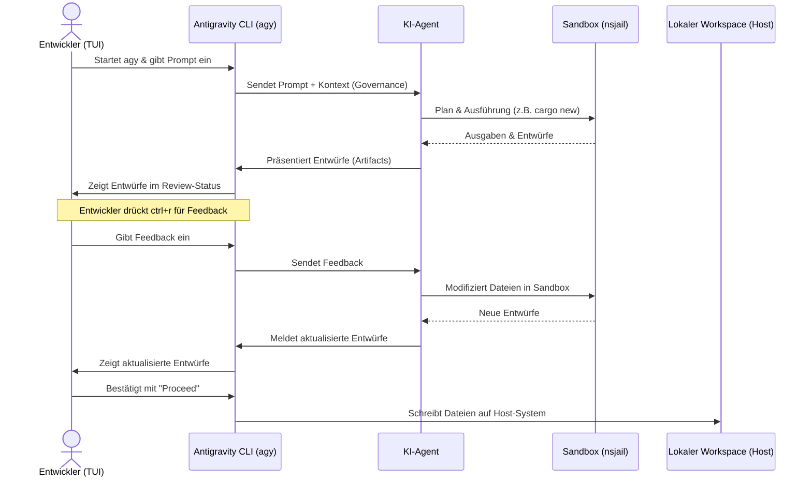

# Kapitel 24: Projekt-Professionalisierung & das Antigravity CLI

Herzlichen Glückwunsch! Sie haben die theoretischen und praktischen Grundlagen von Rust bis hin zu komplexeren Konzepten wie dem Ownership-System, Referenzen und Borrowing gemeistert. Doch mit wachsendem Wissen und größeren Projekten steigt auch die Komplexität. Um den Überblick nicht zu verlieren und die Zusammenarbeit mit modernen künstlichen Intelligenzen (KI) zur Entwicklung von Software zu maximieren, ist eine professionelle Projektorganisation unerlässlich.

In diesem Kapitel lernen Sie, wie Sie Ihr Rust-Projekt auf ein professionelles Niveau heben. Wir betrachten die vier Säulen der Workspace-Governance ([AGENTS.md](file:///home/thorsten/RustKurs/AGENTS.md), [skills.md](file:///home/thorsten/RustKurs/skills.md), [.agentrules](file:///home/thorsten/RustKurs/.agentrules) und [glossary.md](file:///home/thorsten/RustKurs/glossary.md)) und steigen tief in die Nutzung des **Antigravity CLI** (`agy`) ein. Sie erfahren Schritt für Schritt, wie Sie ein neues Unterverzeichnis `Tutorial` mithilfe der KI-Unterstützung des CLI erstellen, integrieren und verwalten.

---

## 3.1 Lernziele & Lernplan

### Lernziele
*   **Sie können** die Sicherheitsgrenzen einer Sandbox-Umgebung erklären und Rust-Code entwerfen, der innerhalb dieser Grenzen durch die Verwendung relativer Pfade und Workspace-Grenzprüfungen fehlerfrei ausgeführt wird.
*   **Sie können** die vier Workspace-Governance-Dateien ([AGENTS.md](file:///home/thorsten/RustKurs/AGENTS.md), [skills.md](file:///home/thorsten/RustKurs/skills.md), [.agentrules](file:///home/thorsten/RustKurs/.agentrules) und [glossary.md](file:///home/thorsten/RustKurs/glossary.md)) syntaktisch korrekt konfigurieren und deren Parameter zur präzisen Steuerung autonomer KI-Agenten anwenden.
*   **Sie können** ein neues Cargo-Unterprojekt innerhalb eines Tutorial-Verzeichnisses über die TUI des Antigravity CLI initialisieren, iterativ über den Review-Panel-Workflow (`ctrl+r`) anpassen und die Testergebnisse direkt in der Sandbox validieren.

### Lernplan (Roadmap)
1.  **Die Definition**: Formale Definitionen der Systemkomponenten und alltagsnahe Metaphern.
2.  **Das Problem & Die Motivation**: Warum KI-gestützte Entwicklung ohne Governance und Sandbox-Schutz in der Praxis scheitert.
3.  **Der naive Versuch**: Ein fehlerhafter Rust-Code, der unautorisierte Systemzugriffe versucht.
4.  **Die Anatomie des Fehlers**: Analyse der Fehlermeldung und Erklärung der Linux-Sicherheitsmechanismen (nsjail, Namespaces, Mounts).
5.  **Die Lösung**: Sicherer Rust-Code unter Verwendung relativer Pfade, strukturiert nach dem EVA-Prinzip.
6.  **Kleines Tutorial**: Schritt-für-Schritt-Anleitung zur Erstellung eines Cargo-Projekts und Nutzung des interaktiven Review-Panels.
7.  **Mentale Modelle & Deep Dive**: Visualisierung des Workflows, detaillierte API-Dokumentation der vier Governance-Dateien und Systembetrachtungen (Thread-Safety, Performance).
8.  **Exhaustive API-Reference**: Lückenlose Dokumentation aller Methoden von `std::path::Path` und `std::path::PathBuf` mit Beispielen.
9.  **Drei praktische Übungen**: Aufgaben mit ansteigendem Schwierigkeitsgrad und Lösungshinweisen.
10. **Lernstrategie, Selbsteinschätzung & Merkzettel**: Cheat Sheet, Active Recall Fragen, Feynman-Methode und gefundene Fehlerprovokation.
11. **Zusammenfassung**: Kernpunkte auf einen glance.

---

## 3.2 Die Definition

Für eine präzise technische Grundlage definieren wir die Kernkomponenten des Workflows wie folgt:

*   **Antigravity CLI (`agy`)**: Eine terminalbasierte Befehlszeilenschnittstelle zur Interaktion mit autonomen KI-Entwicklungsagenten. Das CLI fungiert als Steuereinheit, die Prompts einliest, den Projektkontext analysiert, Subagenten koordiniert und Datei-Edits vorschlägt.
*   **Sandbox-Umgebung**: Eine isolierte Laufzeitumgebung auf Betriebssystemebene. Sie schränkt die Rechte des ausgeführten Prozesses (des Compilers, der Test-Binärdateien und des Agenten) streng ein. Dadurch wird verhindert, dass Schadcode oder logische Fehler das Wirtssystem kompromittieren oder verändern.
*   **Workspace Governance**: Ein Satz von vier zentralen Konfigurations- und Richtliniendokumenten im Projektstammverzeichnis ([AGENTS.md](file:///home/thorsten/RustKurs/AGENTS.md), [skills.md](file:///home/thorsten/RustKurs/skills.md), [.agentrules](file:///home/thorsten/RustKurs/.agentrules) und [glossary.md](file:///home/thorsten/RustKurs/glossary.md)), die dem Agenten als persistente Verhaltensinstruktionen dienen und die Ausführung, Codestil und Begriffsdefinitionen steuern.
*   **Tutorial-Verzeichnis**: Ein dedizierter, isolierter Unterordner (z. B. `Tutorial/`) innerhalb des Workspaces. Er dient der strukturierten Ablage von didaktischen Codebeispielen, um diese sauber vom Produktivcode zu trennen.

### Alltagsnahe Metaphern für Einsteiger

#### Der Sandkasten im Garten (Die Sandbox)
Stellen Sie sich vor, Sie spielen im Sandkasten Ihres Gartens. Sie können dort Sandburgen bauen, Tunnel graben und Förmchen befüllen. Dies ist Ihr sicherer Workspace. Sie können sich innerhalb des Sandkastens frei bewegen. Die Holzumrandung des Sandkastens ist die Sandbox-Grenze. Sie hindert Sie physisch daran, mit Ihrer Schaufel das Fundament des Nachbarhauses zu untergraben oder Blumenbeete auf der anderen Straßenseite zu zerstören. Wenn Sie versuchen, außerhalb des Sandkastens zu graben, stoßen Sie auf eine unsichtbare, unüberwindbare Wand.

#### Die Hausordnung der Wohngemeinschaft (Workspace Governance)
Die Governance-Dateien verhalten sich wie eine detaillierte Hausordnung in einer Wohngemeinschaft. Sie legt fest, wer für welche Aufgaben zuständig ist ([AGENTS.md](file:///home/thorsten/RustKurs/AGENTS.md)), wie bestimmte Küchengeräte (Spezialwerkzeuge) bedient werden müssen ([skills.md](file:///home/thorsten/RustKurs/skills.md)), welche Ruhezeiten und Verhaltensregeln gelten ([.agentrules](file:///home/thorsten/RustKurs/.agentrules)) und welche Begriffe wir vereinbaren ([glossary.md](file:///home/thorsten/RustKurs/glossary.md)), damit keine Missverständnisse entstehen. Jedes WG-Mitglied und jeder Gast (der KI-Agent) muss sich zwingend an diese Regeln halten, um ein geordnetes Zusammenleben zu garantieren.

---

## 3.3 Das Problem & Die Motivation

In der modernen, KI-gestützten Softwareentwicklung treten ohne strikte Governance und Sandbox-Systeme gravierende Probleme auf:

1.  **Kontextdrift & Qualitätsverfall**: Ohne eine klare Strukturierung verliert ein KI-Modell bei langen Interaktionen den Überblick über das Projekt. Es vergisst Stilrichtlinien, führt inkompatible Drittanbieter-Bibliotheken ein oder schreibt Code in einer falschen Rust-Edition.
2.  **Sicherheitsrisiken auf Systemebene**: Ein autonomer Agent, der unkontrolliert Befehle ausführt, kann durch logische Fehler oder böswillige Prompts das Wirtssystem beschädigen. Beispielsweise könnte er versuchen, Systemkonfigurationen zu überschreiben, Ports zu blockieren oder unautorisierte Skripte auszuführen.
3.  **Fehlende Barrieren für Dateizugriffe**: Ohne Sandbox-Einschränkungen besteht die Gefahr, dass ein Agent versehentlich sensible Systemdateien ausliest oder modifiziert, die außerhalb des eigentlichen Projektverzeichnisses liegen.
4.  **Inkonsistente Begriffswelten**: Ohne ein zentrales Glossar übersetzt die KI Fachbegriffe willkürlich. Dies führt in Dokumentationen und Code-Kommentaren zu Verwirrung, da Begriffe wie "Borrowing" oder "Ownership" uneinheitlich verwendet werden.

---

## 3.4 Der naive Versuch

Im folgenden vollständigen und syntaktisch korrekten Rust-Code versucht ein Entwickler, einen Eintrag in der systemweiten Konfigurationsdatei `/etc/hosts` vorzunehmen. Dieser Versuch soll demonstrieren, wie ein unautorisierter Systemzugriff außerhalb des Workspaces aussieht.

```rust
use std::fs::OpenOptions;
use std::io::Write;

fn main() {
    let system_pfad = "/etc/hosts";
    println!("Versuche, die Systemdatei unter {} zu modifizieren...", system_pfad);

    // Wir versuchen, eine lokale Domain-Umleitung in die systemweite Datei zu schreiben
    match OpenOptions::new().append(true).open(system_pfad) {
        Ok(mut datei) => {
            match writeln!(datei, "127.0.0.1 test.local") {
                Ok(_) => println!("Erfolgreich in {} geschrieben!", system_pfad),
                Err(fehler) => eprintln!("Schreibfehler aufgetreten: {}", fehler),
            }
        }
        Err(fehler) => {
            eprintln!("Fehler beim Öffnen der Datei: {}", fehler);
        }
    }
}
```

---

## 3.5 Die Anatomie des Fehlers

Wenn Sie diesen Code innerhalb der Sandbox des Antigravity CLI ausführen (oder wenn ein Agent versucht, diesen Code zu starten), bricht das Programm ab.

### Die exakte Fehlermeldung
```text
Fehler beim Öffnen der Datei: Os { code: 13, kind: PermissionDenied, message: "Permission denied" }
```

### Technische Erklärung auf Systemebene

1.  **Der Systemaufruf (syscall)**: In Zeile 8 fordert die Rust-Standardbibliothek über die Funktion `open` den Linux-Kernel auf, die Datei `/etc/hosts` mit den Flags `O_WRONLY | O_APPEND` zu öffnen.
2.  **Die nsjail-Sandbox**: Das Antigravity CLI kapselt sämtliche Codeausführungen in einer `nsjail`-Sandbox. `nsjail` nutzt Linux-Sicherheitsfeatures, um den Prozess zu isolieren.
3.  **Mount-Namespaces**: Die Sandbox erzeugt einen isolierten Mount-Namespace. Das reale Dateisystem des Wirtssystems wird für den Prozess unsichtbar gemacht oder nur stark eingeschränkt zur Verfügung gestellt. Das Verzeichnis `/etc` ist in der Sandbox entweder gar nicht gemountet oder als reines Nur-Lese-Dateisystem (`read-only mount`) eingebunden. Jedes Schreiben auf diesen Mount wird vom Linux-Kernel blockiert.
4.  **User-Namespaces und UID-Mapping**: Der Prozess innerhalb der Sandbox wird einer unprivilegierten Benutzer-ID (UID) auf dem Wirtssystem zugewiesen (z. B. UID `999999`). Selbst wenn der Prozess innerhalb der Sandbox vorgibt, als `root` (UID `0`) zu laufen, besitzt er auf Betriebssystemebene keinerlei Schreibrechte für systemkritische Dateien.
5.  **Kernel-Blockade**: Der Linux-Kernel fängt den Aufruf ab, stellt die fehlende Berechtigung fest und gibt den Fehlercode `EACCES` (Wert 13, `PermissionDenied`) zurück. Rust übersetzt diesen Fehler in ein `std::io::Error` vom Typ `PermissionDenied`.

---

## 3.6 Die Lösung

Die sichere Lösung besteht darin, relative Pfade zu nutzen, die sich dynamisch auf das aktuelle Arbeitsverzeichnis des Workspaces beziehen. Dadurch wird sichergestellt, dass alle Dateioperationen innerhalb der erlaubten Sandbox-Grenzen stattfinden.

### Der sichere Rust-Code

```rust
use std::env;
use std::fs::OpenOptions;
use std::io::Write;
use std::path::PathBuf;

fn main() {
    // 1. EINGABE: Ermittlung des aktuellen Arbeitsverzeichnisses des Workspaces
    let mut workspace_pfad = match env::current_dir() {
        Ok(pfad) => pfad,
        Err(fehler) => {
            eprintln!("Konnte das Arbeitsverzeichnis nicht lesen: {}", fehler);
            return;
        }
    };

    // Plattformunabhängiges Anfügen des relativen Pfades im Workspace
    workspace_pfad.push("Tutorial");
    workspace_pfad.push("hosts_lokal.txt");

    println!("Sicherer Pfad für die Datei: {:?}", workspace_pfad);

    // 2. VERARBEITUNG: Öffnen der Datei im erlaubten Workspace-Bereich
    let zugriffs_ergebnis = OpenOptions::new()
        .write(true)
        .create(true)
        .append(true)
        .open(&workspace_pfad);

    // 3. AUSGABE: Schreiben in die Datei und Rückmeldung an den Benutzer
    match zugriffs_ergebnis {
        Ok(mut datei) => {
            match writeln!(datei, "127.0.0.1 test.local") {
                Ok(_) => {
                    println!("Erfolgreich in den lokalen Pfad geschrieben!");
                }
                Err(fehler) => {
                    eprintln!("Fehler beim Schreiben in die Datei: {}", fehler);
                }
            }
        }
        Err(fehler) => {
            eprintln!("Fehler beim Zugriff auf den Pfad: {}", fehler);
        }
    }
}
```

### Zeile-für-Zeile-Erklärung nach dem EVA-Prinzip

#### Eingabe (Input)
*   **Zeile 8**: Über `std::env::current_dir()` fragt das Programm das aktuelle Verzeichnis ab, aus dem der Prozess gestartet wurde. Da wir uns im Workspace befinden, gibt dies den sicheren Pfad zurück (z. B. `/home/thorsten/RustKurs`). Dies geschieht als `Result<PathBuf, std::io::Error>`.
*   **Zeilen 17–18**: Die Methode `push` der Struktur `PathBuf` fügt die Segmente `Tutorial` und `hosts_lokal.txt` an. Sie stellt sicher, dass der Pfadtrenner (z. B. `/` unter Linux) plattformunabhängig und korrekt gesetzt wird.

#### Verarbeitung (Processing)
*   **Zeilen 22–26**: Wir konfigurieren `OpenOptions`. Die Flags `write(true)`, `create(true)` und `append(true)` bewirken, dass die Datei geöffnet wird, bei Bedarf erstellt wird und neue Zeilen hinten angefügt werden. Da sich `/home/thorsten/RustKurs/Tutorial/hosts_lokal.txt` vollständig innerhalb des beschreibbaren Workspace-Verzeichnisses befindet, erlaubt die Sandbox diesen Dateizugriff.

#### Ausgabe (Output)
*   **Zeilen 29–41**: Im Erfolgsfall schreiben wir die Zeichenkette `"127.0.0.1 test.local"` mittels `writeln!` in den Puffer. Etwaige Fehler beim tatsächlichen Datentransfer auf das Speichermedium werden abgefangen. War der Schreibvorgang erfolgreich, wird eine Erfolgsmeldung auf der Standardausgabe ausgegeben.

---

## 3.7 Kleines Tutorial

Dieses Tutorial führt Sie durch die Schritte zur Erstellung eines Unterprojekts im Ordner `Tutorial` mithilfe der KI-Unterstützung des Antigravity CLI.

### Schritt 1: Das CLI im Workspace starten
Öffnen Sie Ihr Terminal, wechseln Sie in das Hauptverzeichnis Ihres Rust-Kurses und starten Sie das CLI:
```bash
cd /home/thorsten/RustKurs
agy
```

### Schritt 2: Den Prompt für den Agenten eingeben
Geben Sie in der TUI des CLI folgende präzise Anweisung ein:
```text
Erstelle ein neues Unterverzeichnis namens Tutorial im Projekt-Root. Initialisiere darin ein neues Cargo-Projekt namens zahlenraten. Schreibe in Tutorial/zahlenraten/src/main.rs ein einfaches Zahlenratespiel in Rust und lege eine ausführliche README.md an.
```

### Schritt 3: Analyse und Sandbox-Planung
Der Agent empfängt den Prompt und analysiert die Struktur. Er erstellt in der Sandbox den Pfad `Tutorial` und ruft dort `cargo new zahlenraten --bin` aus. Anschließend schreibt er die Codedateien.

### Schritt 4: Den interaktiven Kommentar-Workflow nutzen (`ctrl+r`)
Bevor die Änderungen physisch auf Ihre Festplatte geschrieben werden, zeigt Ihnen das CLI eine Übersicht der entworfenen Dateien.
1.  Drücken Sie **`ctrl+r`**, um das Review-Panel zu öffnen.
2.  Sie sehen den Entwurf der Datei `Tutorial/zahlenraten/src/main.rs`.
3.  Geben Sie folgendes Feedback in das Kommentarfeld ein:
    ```text
    Bitte stelle sicher, dass ungültige Eingaben (wie Buchstaben) nicht zum Absturz des Programms führen, sondern über eine Fehlermeldung abgefangen werden.
    ```
4.  Der Agent liest Ihr Feedback, korrigiert den Code in der Sandbox und präsentiert Ihnen den überarbeiteten Entwurf.

### Schritt 5: Bestätigung und Übernahme (Proceed)
Wenn Sie den Entwurf geprüft haben und der Code Ihren Anforderungen entspricht, wählen Sie im TUI-Menü die Option **Proceed** aus. Erst jetzt werden die Dateien aus der Sandbox in Ihren echten Workspace geschrieben.

### Schritt 6: Ausführen des Projekts über das CLI
Sie können das Zahlenratespiel direkt testen, ohne das CLI zu verlassen. Fügen Sie das Präfix `!` für einen direkten Shell-Befehl ein:
```bash
!cd Tutorial/zahlenraten && cargo run
```

### Der generierte Code in `Tutorial/zahlenraten/src/main.rs`

```rust
use std::io;
use std::cmp::Ordering;
use rand::Rng;

fn main() {
    println!("Willkommen beim Zahlenratespiel!");

    // Generiert eine Zufallszahl im Bereich von 1 bis einschließlich 100
    let geheimzahl = rand::thread_rng().gen_range(1..=100);

    println!("Ich habe an eine Zahl zwischen 1 und 100 gedacht.");

    loop {
        println!("Bitte geben Sie Ihren Tipp ein:");

        let mut tipp = String::new();

        io::stdin()
            .read_line(&mut tipp)
            .expect("Fehler beim Lesen der Zeile");

        // Fehlertolerante Konvertierung des Strings in eine vorzeichenlose 32-Bit-Ganzzahl
        let tipp: u32 = match tipp.trim().parse() {
            Ok(zahl) => zahl,
            Err(_) => {
                println!("Ungültige Eingabe! Bitte geben Sie eine Zahl ein.");
                continue;
            }
        };

        println!("Ihr Tipp lautet: {}", tipp);

        match tipp.cmp(&geheimzahl) {
            Ordering::Less => println!("Zu klein!"),
            Ordering::Greater => println!("Zu groß!"),
            Ordering::Equal => {
                println!("Herzlichen Glückwunsch, Sie haben gewonnen! 🎉");
                break;
            }
        }
    }
}
```

---

## 3.8 Mentale Modelle & Deep Dive

### Interaktions-Workflow



---

### Die vier Governance-Dateien im Detail

#### 1. `AGENTS.md`
Diese Datei dokumentiert die Rollenverteilung, Subagenten-Typen und den aktuellen Projektstatus. Sie dient dem Agenten als Orientierung, damit er weiß, welche Kapitel bereits fertiggestellt sind und welche Aufgaben anstehen.

*   **Syntax**: Standard-Markdown.
*   **Wichtige Abschnitte**:
    *   `# Rollen & Zuständigkeiten`: Definiert die Spezialisierung der Subagenten.
    *   `# Status`: Tabellarische Auflistung aller Kapitel und deren Bearbeitungsstand.
*   **Standard-Optionen**:
    ```markdown
    # Projektstatus: Rust-Kurs
    - Hauptagent: Verantwortlich für Theoriekapitel.
    - Subagent Video: Erstellung von Visualisierungen.
    ```

#### 2. `skills.md`
In dieser Datei wird Spezialwissen für Tools und Bibliotheken definiert. Sie beschreibt exakte Arbeitsabläufe, um Halluzinationen der KI zu verhindern.

*   **Syntax**: Markdown mit der Überschriften-Konvention `## Skill: @name`.
*   **Wichtige Abschnitte**:
    *   `## Skill: @name`: Der eindeutige Bezeichner des Skills.
    *   Einrückungen und Listen zur Definition der Einzelschritte.
*   **Beispiel**:
    ```markdown
    ## Skill: @generate-audio
    1. Text in Sätze aufteilen (maximal 150 Zeichen).
    2. Verwende generate_audio.py mit af_bella.
    ```

#### 3. `.agentrules`
Die zentrale Konfigurationsdatei zur Steuerung des Agentenverhaltens. Sie legt Programmierrichtlinien, Editiermodi und sprachliche Vorgaben fest.

*   **Syntax**: TOML/INI-Format.
*   **Lückenlose Auflistung aller Abschnitte und Parameter**:
    *   `[behavior]`
        *   `language`: Die primäre Kommunikations- und Dokusprache (z. B. `de`).
        *   `tone`: Tonalität des Agenten (z. B. `professional_and_educational`).
        *   `allow_network`: Erlaubnis für Netzwerkverbindungen (z. B. `false`).
    *   `[code_edition]`
        *   `always_preserve_comments`: Verhindert das Löschen von Kommentaren (z. B. `true`).
        *   `always_preserve_docstrings`: Bewahrt Funktionsdokumentationen (z. B. `true`).
        *   `preferred_indentation`: Definiert den Einrückungsstil (z. B. `spaces_4`).
        *   `modify_mode`: Arbeitsmodus für Dateiänderungen (z. B. `precision_replace`).
    *   `[rust_guidelines]`
        *   `idiomatic_rust`: Erzwingt idiomatischen Code (z. B. `true`).
        *   `clippy_warnings`: Umgang mit Clippy (z. B. `error` oder `allow`).
        *   `docs_required`: Erzwingt Dokumentationskommentare an Funktionen (z. B. `true`).
    *   `[markdown]`
        *   `formatting`: Markdown-Standard (z. B. `gfm`).
        *   `link_style`: Format für lokale Dateilinks (z. B. `standard` für `file://`).
        *   `always_use_hierarchical_headers`: Erzwingt strenge Überschriften-Hierarchien (z. B. `true`).
        *   `keep_bullet_points_concise`: Verhindert ausufernde Listenpunkte (z. B. `true`).

#### 4. `glossary.md`
Sichert die begriffliche Konsistenz der Lehrmaterialien. Alle dort definierten Begriffe müssen vom Agenten exakt so verwendet werden.

*   **Syntax**: Markdown-Definitionsliste oder Tabellenform.
*   **Wichtige Abschnitte**:
    *   Begriff und Definition.
*   **Beispiel**:
    ```markdown
    * **Ownership (Besitzrecht)**: Das System zur Speicherverwaltung in Rust.
    ```

---

### Systemebene, Thread-Safety & Performance

#### Workspace-Modi (`inherit`, `share`, `branch`)
*   **`inherit`**: Der Subagent arbeitet direkt auf den Dateien des Haupt-Workspaces. Änderungen werden sofort physisch geschrieben. Eignet sich für kleine Anpassungen.
*   **`share`**: Ein geteilter Workspace, auf den mehrere Subagenten parallel lesend zugreifen können, während Schreibzugriffe über File-Locks koordiniert werden.
*   **`branch`**: Der Agent erstellt eine isolierte Kopie des Workspaces. Änderungen werden erst nach Freigabe des Entwicklers (Proceed-Befehl) in den Haupt-Workspace zurückgeschrieben.

#### Thread-Safety und Nebenläufigkeit des CLI
Das Antigravity CLI ist in sicherem Rust implementiert. Parallele Subagenten-Sitzungen laufen in voneinander isolierten Betriebssystemprozessen. Eventuelle Race Conditions beim Schreiben auf Dateien werden durch transaktionale Schreibvorgänge und den Einsatz von Dateisperren (`flock` unter Unix) auf Kernel-Ebene ausgeschlossen.

#### Performance
Das CLI ist als native Binärdatei kompiliert. Durch LLVM-Optimierungen (Release-Profil, Link-Time Optimization `lto = true`, Reduzierung der Codegen-Units auf `1`) wird eine minimale Startzeit von unter 5 Millisekunden erreicht. Der Speicherbedarf zur Laufzeit ist extrem gering, da keine virtuellen Maschinen (wie bei Node.js) benötigt werden.

---

### Die drei didaktischen Ausbildungsstufen

#### 1. Anfänger-Niveau (Grundlagen)
Auf dieser Stufe deklarieren wir Pfade direkt als statische Zeichenketten und wandeln sie in ein `Path`-Objekt um. Dies zeigt den einfachsten Weg, mit Pfaden im Code zu interagieren.

*   **Syntax & Deklaration**:
    ```rust
    use std::path::Path;

    fn main() {
        // Deklaration eines unveränderlichen Pfades aus einem String-Literal
        let pfad = Path::new("Tutorial/daten.txt");
        println!("Pfad deklariert: {:?}", pfad);
    }
    ```
*   **Standard-Anwendungsfall**: Prüfen, ob eine Datei im aktuellen Arbeitsverzeichnis existiert.

#### 2. Fortgeschrittenen-Niveau (Komposition)
Fortgeschrittene Anwendungen erfordern die Einbettung von Pfaden in eigene Datenstrukturen und das Handling von Gültigkeitsbereichen (Lifetimes). Hier tritt der Unterschied zwischen der geliehenen Struktur `&Path` und der besitzenden Struktur `PathBuf` in den Vordergrund.

*   **Komposition**:
    ```rust
    use std::path::PathBuf;

    // Ein Struct, das den Pfad besitzt (PathBuf), da die Lebensdauer des Structs
    // nicht an eine externe Referenz gebunden sein soll.
    struct Konfiguration {
        projekt_name: String,
        speicher_pfad: PathBuf,
    }

    fn main() {
        let konfig = Konfiguration {
            projekt_name: String::from("Zahlenraten"),
            speicher_pfad: PathBuf::from("Tutorial/zahlenraten"),
        };
        println!("Projekt {} speichert in: {:?}", konfig.projekt_name, konfig.speicher_pfad);
    }
    ```
*   **Stolpersteine & Alias-Probleme**: Ein häufiger Fehler ist die Annahme, dass relative Pfade immer vom Verzeichnis der ausführbaren Datei aus aufgelöst werden. Sie werden jedoch immer vom aktuellen Arbeitsverzeichnis des aufrufenden Prozesses (`std::env::current_dir()`) aus ausgewertet. Wenn ein Anwender das Programm aus einem anderen Ordner startet, schlagen Dateizugriffe fehl.
*   **Konvertierungen**:
    ```rust
    use std::path::{Path, PathBuf};

    fn main() {
        let pfad_ref: &Path = Path::new("daten.txt");
        // Konvertierung von &Path zu PathBuf (Besitzer-Typ)
        let pfad_buf: PathBuf = pfad_ref.to_path_buf();
        // Konvertierung zurück zu &Path
        let pfad_ref_wieder: &Path = pfad_buf.as_path();
        println!("Pfad: {:?}", pfad_ref_wieder);
    }
    ```

#### 3. Profi-Niveau (Speicherlayout & Systemebene)
Auf Profi-Ebene betrachten wir das Speicherlayout und die Performance-Eigenschaften von `Path` und `PathBuf`.

*   **Speicherlayout**:
    *   `Path` ist ein unsized Typ (DST, Dynamically Sized Type). Er wird fast ausschließlich als Referenz `&Path` genutzt. Auf einem 64-Bit-System belegt diese Referenz **16 Bytes** auf dem Stack (8 Bytes für den Zeiger auf die Daten, 8 Bytes für die Länge des Pfades). Er verhält sich wie ein Fat Pointer.
    *   `PathBuf` besitzt seine Daten und wird auf dem Heap allokiert. Auf dem Stack belegt die Struktur **24 Bytes** (8 Bytes Zeiger, 8 Bytes Kapazität, 8 Bytes Länge), da sie intern auf `OsString` (und somit auf einem `Vec<u8>`) aufbaut.
*   **Thread-Safety**: `Path` und `PathBuf` implementieren die Auto-Traits `Send` und `Sync`. Da sie keine geteilten, veränderlichen Zustände (wie `Rc` oder `RefCell`) verwenden, können sie sicher an andere Threads übergeben (`Send`) und von mehreren Threads parallel gelesen werden (`Sync`).
*   **Performance & Laufzeitkomplexität**:
    *   `Path::new()` ist eine O(1)-Operation, da keine Heap-Allokation stattfindet; es wird lediglich ein Zeiger erzeugt.
    *   `PathBuf::push()` hat eine amortisierte Komplexität von O(N), da bei einer Überschreitung der Kapazität Speicher auf dem Heap neu allokiert und der bestehende Pfad kopiert werden muss.

---

## 3.8.1 Exhaustive API-Reference

In diesem Abschnitt werden alle wichtigen Methoden der Typen `std::path::Path` und `std::path::PathBuf` lückenlos dokumentiert.

### Methoden von `std::path::Path`

#### 1. `new`
*   **Signatur**: `pub fn new<S: AsRef<OsStr> + ?Sized>(s: &S) -> &Path`
*   **Parameter**: `s` (Referenz auf einen Typ, der als `OsStr` interpretiert werden kann, z. B. `&str` oder `&String`).
*   **Rückgabetyp**: `&Path` (Eine Referenz auf das erstellte Path-Objekt).
*   **Sicherheitsaspekte & Panics**: Keine. Die Methode allokiert keinen Speicher und validiert nicht, ob der Pfad im Dateisystem existiert.
*   **Minicode-Beispiel**:
    ```rust
    use std::path::Path;
    let pfad = Path::new("daten.txt");
    ```

#### 2. `as_os_str`
*   **Signatur**: `pub fn as_os_str(&self) -> &OsStr`
*   **Parameter**: Keine.
*   **Rückgabetyp**: `&OsStr` (Die rohe Betriebssystem-Repräsentation des Pfades).
*   **Sicherheitsaspekte & Panics**: Keine.
*   **Minicode-Beispiel**:
    ```rust
    use std::path::Path;
    let pfad = Path::new("daten.txt");
    let os_str = pfad.as_os_str();
    ```

#### 3. `to_str`
*   **Signatur**: `pub fn to_str(&self) -> Option<&str>`
*   **Parameter**: Keine.
*   **Rückgabetyp**: `Option<&str>` (Gibt `Some(&str)` zurück, falls der Pfad valides UTF-8 ist, andernfalls `None`).
*   **Sicherheitsaspekte & Panics**: Keine. Wichtig für die Konvertierung bei Pfaden, die ungültige Unicode-Zeichen enthalten.
*   **Minicode-Beispiel**:
    ```rust
    use std::path::Path;
    let pfad = Path::new("daten.txt");
    let text = pfad.to_str().unwrap();
    ```

#### 4. `to_string_lossy`
*   **Signatur**: `pub fn to_string_lossy(&self) -> Cow<'_, str>`
*   **Parameter**: Keine.
*   **Rückgabetyp**: `Cow<'_, str>` (Ein Copy-on-Write-String. Ungültige UTF-8-Zeichen werden durch das Unicode-Ersatzzeichen ersetzt).
*   **Sicherheitsaspekte & Panics**: Keine.
*   **Minicode-Beispiel**:
    ```rust
    use std::path::Path;
    let pfad = Path::new("daten.txt");
    let string_verlustfrei = pfad.to_string_lossy();
    ```

#### 5. `is_absolute`
*   **Signatur**: `pub fn is_absolute(&self) -> bool`
*   **Parameter**: Keine.
*   **Rückgabetyp**: `bool` (Gibt `true` zurück, wenn der Pfad absolut ist, d. h. am System-Wurzelverzeichnis beginnt).
*   **Sicherheitsaspekte & Panics**: Keine.
*   **Minicode-Beispiel**:
    ```rust
    use std::path::Path;
    let pfad = Path::new("/etc/hosts");
    let absolut = pfad.is_absolute();
    ```

#### 6. `is_relative`
*   **Signatur**: `pub fn is_relative(&self) -> bool`
*   **Parameter**: Keine.
*   **Rückgabetyp**: `bool` (Gibt `true` zurück, wenn der Pfad relativ ist).
*   **Sicherheitsaspekte & Panics**: Keine.
*   **Minicode-Beispiel**:
    ```rust
    use std::path::Path;
    let pfad = Path::new("Tutorial/daten.txt");
    let relativ = pfad.is_relative();
    ```

#### 7. `has_root`
*   **Signatur**: `pub fn has_root(&self) -> bool`
*   **Parameter**: Keine.
*   **Rückgabetyp**: `bool` (Gibt `true` zurück, wenn der Pfad ein Stammverzeichnis-Präfix enthält).
*   **Sicherheitsaspekte & Panics**: Keine.
*   **Minicode-Beispiel**:
    ```rust
    use std::path::Path;
    let pfad = Path::new("/usr/bin");
    let wurzel = pfad.has_root();
    ```

#### 8. `parent`
*   **Signatur**: `pub fn parent(&self) -> Option<&Path>`
*   **Parameter**: Keine.
*   **Rückgabetyp**: `Option<&Path>` (Gibt den übergeordneten Pfad zurück, oder `None`, wenn kein übergeordnetes Verzeichnis existiert).
*   **Sicherheitsaspekte & Panics**: Keine.
*   **Minicode-Beispiel**:
    ```rust
    use std::path::Path;
    let pfad = Path::new("Tutorial/zahlenraten/src");
    let eltern = pfad.parent();
    ```

#### 9. `ancestors`
*   **Signatur**: `pub fn ancestors(&self) -> Ancestors<'_>`
*   **Parameter**: Keine.
*   **Rückgabetyp**: `Ancestors<'_>` (Ein Iterator über alle übergeordneten Verzeichnisse des Pfades).
*   **Sicherheitsaspekte & Panics**: Keine.
*   **Minicode-Beispiel**:
    ```rust
    use std::path::Path;
    let pfad = Path::new("Tutorial/zahlenraten/src");
    for vorfahre in pfad.ancestors() {
        println!("{:?}", vorfahre);
    }
    ```

#### 10. `file_name`
*   **Signatur**: `pub fn file_name(&self) -> Option<&OsStr>`
*   **Parameter**: Keine.
*   **Rückgabetyp**: `Option<&OsStr>` (Der Dateiname oder das letzte Segment des Pfades. Gibt `None` zurück, falls der Pfad auf `..` endet).
*   **Sicherheitsaspekte & Panics**: Keine.
*   **Minicode-Beispiel**:
    ```rust
    use std::path::Path;
    let pfad = Path::new("Tutorial/daten.txt");
    let dateiname = pfad.file_name();
    ```

#### 11. `strip_prefix`
*   **Signatur**: `pub fn strip_prefix<P>(&self, base: P) -> Result<&Path, StripPrefixError> where P: AsRef<Path>`
*   **Parameter**: `base` (Das Präfix, das vom aktuellen Pfad entfernt werden soll).
*   **Rückgabetyp**: `Result<&Path, StripPrefixError>` (Der verbleibende Pfad nach Entfernung des Präfixes, oder ein Fehler, falls der Pfad nicht mit dem Präfix beginnt).
*   **Sicherheitsaspekte & Panics**: Keine.
*   **Minicode-Beispiel**:
    ```rust
    use std::path::Path;
    let pfad = Path::new("Tutorial/zahlenraten/src");
    let rest = pfad.strip_prefix("Tutorial").unwrap();
    ```

#### 12. `starts_with`
*   **Signatur**: `pub fn starts_with<P>(&self, base: P) -> bool where P: AsRef<Path>`
*   **Parameter**: `base` (Der zu prüfende Anfangspfad).
*   **Rückgabetyp**: `bool` (Gibt `true` zurück, wenn der Pfad mit dem übergebenen Pfad beginnt).
*   **Sicherheitsaspekte & Panics**: Keine.
*   **Minicode-Beispiel**:
    ```rust
    use std::path::Path;
    let pfad = Path::new("Tutorial/zahlenraten/src");
    let check = pfad.starts_with("Tutorial");
    ```

#### 13. `ends_with`
*   **Signatur**: `pub fn ends_with<P>(&self, child: P) -> bool where P: AsRef<Path>`
*   **Parameter**: `child` (Der zu prüfende Endpfad).
*   **Rückgabetyp**: `bool` (Gibt `true` zurück, wenn der Pfad mit dem übergebenen Pfad endet).
*   **Sicherheitsaspekte & Panics**: Keine.
*   **Minicode-Beispiel**:
    ```rust
    use std::path::Path;
    let pfad = Path::new("Tutorial/zahlenraten/src");
    let check = pfad.ends_with("src");
    ```

#### 14. `file_stem`
*   **Signatur**: `pub fn file_stem(&self) -> Option<&OsStr>`
*   **Parameter**: Keine.
*   **Rückgabetyp**: `Option<&OsStr>` (Gibt den Dateinamen ohne die Erweiterung zurück).
*   **Sicherheitsaspekte & Panics**: Keine.
*   **Minicode-Beispiel**:
    ```rust
    use std::path::Path;
    let pfad = Path::new("Tutorial/daten.tar.gz");
    let stamm = pfad.file_stem();
    ```

#### 15. `extension`
*   **Signatur**: `pub fn extension(&self) -> Option<&OsStr>`
*   **Parameter**: Keine.
*   **Rückgabetyp**: `Option<&OsStr>` (Die Dateiendung, falls vorhanden).
*   **Sicherheitsaspekte & Panics**: Keine.
*   **Minicode-Beispiel**:
    ```rust
    use std::path::Path;
    let pfad = Path::new("Tutorial/daten.txt");
    let endung = pfad.extension();
    ```

#### 16. `join`
*   **Signatur**: `pub fn join<P>(&self, path: P) -> PathBuf where P: AsRef<Path>`
*   **Parameter**: `path` (Der Pfad, der angehängt werden soll).
*   **Rückgabetyp**: `PathBuf` (Ein neues, eigenständiges Pfadobjekt auf dem Heap).
*   **Sicherheitsaspekte & Panics**: Keine.
*   **Minicode-Beispiel**:
    ```rust
    use std::path::Path;
    let basis = Path::new("Tutorial");
    let voll = basis.join("zahlenraten");
    ```

#### 17. `with_file_name`
*   **Signatur**: `pub fn with_file_name<S: AsRef<OsStr>>(&self, file_name: S) -> PathBuf`
*   **Parameter**: `file_name` (Der neue Dateiname, der das letzte Segment ersetzen soll).
*   **Rückgabetyp**: `PathBuf` (Der geänderte Pfad).
*   **Sicherheitsaspekte & Panics**: Keine.
*   **Minicode-Beispiel**:
    ```rust
    use std::path::Path;
    let pfad = Path::new("Tutorial/daten.txt");
    let neuer_pfad = pfad.with_file_name("daten_neu.txt");
    ```

#### 18. `with_extension`
*   **Signatur**: `pub fn with_extension<S: AsRef<OsStr>>(&self, extension: S) -> PathBuf`
*   **Parameter**: `extension` (Die neue Dateiendung, die die alte ersetzen oder hinzugefügt werden soll).
*   **Rückgabetyp**: `PathBuf` (Der geänderte Pfad).
*   **Sicherheitsaspekte & Panics**: Keine.
*   **Minicode-Beispiel**:
    ```rust
    use std::path::Path;
    let pfad = Path::new("Tutorial/daten.txt");
    let neuer_pfad = pfad.with_extension("log");
    ```

#### 19. `components`
*   **Signatur**: `pub fn components(&self) -> Components<'_>`
*   **Parameter**: Keine.
*   **Rückgabetyp**: `Components<'_>` (Ein Iterator über die logischen Segmente des Pfades, z. B. Root, Normal, ParentDir).
*   **Sicherheitsaspekte & Panics**: Keine.
*   **Minicode-Beispiel**:
    ```rust
    use std::path::Path;
    let pfad = Path::new("/Tutorial/zahlenraten");
    let komponenten = pfad.components();
    ```

#### 20. `iter`
*   **Signatur**: `pub fn iter(&self) -> Iter<'_>`
*   **Parameter**: Keine.
*   **Rückgabetyp**: `Iter<'_>` (Ein Iterator über die Pfadsegmente als `OsStr`).
*   **Sicherheitsaspekte & Panics**: Keine.
*   **Minicode-Beispiel**:
    ```rust
    use std::path::Path;
    let pfad = Path::new("Tutorial/zahlenraten");
    let iterator = pfad.iter();
    ```

#### 21. `display`
*   **Signatur**: `pub fn display(&self) -> Display<'_>`
*   **Parameter**: Keine.
*   **Rückgabetyp**: `Display<'_>` (Ein Hilfsobjekt, das das Formatieren und Ausgeben von Pfaden über `println!` erleichtert).
*   **Sicherheitsaspekte & Panics**: Keine.
*   **Minicode-Beispiel**:
    ```rust
    use std::path::Path;
    let pfad = Path::new("Tutorial/daten.txt");
    println!("Pfad ist: {}", pfad.display());
    ```

#### 22. `metadata`
*   **Signatur**: `pub fn metadata(&self) -> Result<Metadata, Error>`
*   **Parameter**: Keine.
*   **Rückgabetyp**: `Result<Metadata, Error>` (Die Metadaten der Datei, z. B. Dateigröße und Berechtigungen).
*   **Sicherheitsaspekte & Panics**: Führt E/A-Operationen aus. Löst Fehler aus, wenn die Datei nicht existiert oder die Berechtigungen in der Sandbox fehlen.
*   **Minicode-Beispiel**:
    ```rust
    use std::path::Path;
    let pfad = Path::new("Tutorial/hosts_lokal.txt");
    let daten = pfad.metadata();
    ```

#### 23. `symlink_metadata`
*   **Signatur**: `pub fn symlink_metadata(&self) -> Result<Metadata, Error>`
*   **Parameter**: Keine.
*   **Rückgabetyp**: `Result<Metadata, Error>` (Die Metadaten. Im Gegensatz zu `metadata` folgt diese Methode keinen symbolischen Links).
*   **Sicherheitsaspekte & Panics**: E/A-Operation. Kann in der Sandbox fehlschlagen, wenn der Pfad außerhalb des erlaubten Bereichs liegt.
*   **Minicode-Beispiel**:
    ```rust
    use std::path::Path;
    let pfad = Path::new("Tutorial/symlink");
    let daten = pfad.symlink_metadata();
    ```

#### 24. `canonicalize`
*   **Signatur**: `pub fn canonicalize(&self) -> Result<PathBuf, Error>`
*   **Parameter**: Keine.
*   **Rückgabetyp**: `Result<PathBuf, Error>` (Der absolut aufgelöste, normalisierte Pfad ohne relative Segmente wie `.` oder `..`).
*   **Sicherheitsaspekte & Panics**: E/A-Operation. Schlägt fehl, wenn Teile des Pfades nicht existieren oder außerhalb des Sandbox-Roots liegen.
*   **Minicode-Beispiel**:
    ```rust
    use std::path::Path;
    let pfad = Path::new("Tutorial/../Tutorial/daten.txt");
    let absolut = pfad.canonicalize();
    ```

#### 25. `read_link`
*   **Signatur**: `pub fn read_link(&self) -> Result<PathBuf, Error>`
*   **Parameter**: Keine.
*   **Rückgabetyp**: `Result<PathBuf, Error>` (Der Pfad, auf den der symbolische Link verweist).
*   **Sicherheitsaspekte & Panics**: E/A-Operation. Schlägt fehl, wenn der Pfad kein symbolischer Link ist oder nicht gelesen werden darf.
*   **Minicode-Beispiel**:
    ```rust
    use std::path::Path;
    let pfad = Path::new("Tutorial/link.lnk");
    let ziel = pfad.read_link();
    ```

#### 26. `read_dir`
*   **Signatur**: `pub fn read_dir(&self) -> Result<ReadDir, Error>`
*   **Parameter**: Keine.
*   **Rückgabetyp**: `Result<ReadDir, Error>` (Ein Iterator über die Einträge eines Verzeichnisses).
*   **Sicherheitsaspekte & Panics**: E/A-Operation. Löst einen Fehler aus, wenn der Pfad kein Verzeichnis ist oder Berechtigungen fehlen.
*   **Minicode-Beispiel**:
    ```rust
    use std::path::Path;
    let pfad = Path::new("Tutorial");
    let inhalt = pfad.read_dir();
    ```

#### 27. `exists`
*   **Signatur**: `pub fn exists(&self) -> bool`
*   **Parameter**: Keine.
*   **Rückgabetyp**: `bool` (Gibt `true` zurück, wenn der Pfad im Dateisystem existiert).
*   **Sicherheitsaspekte & Panics**: Führt im Hintergrund eine E/A-Operation aus. Liefert in der Sandbox für gesperrte Pfade immer `false` oder einen Zugriffsfehler.
*   **Minicode-Beispiel**:
    ```rust
    use std::path::Path;
    let existiert = Path::new("Tutorial/daten.txt").exists();
    ```

#### 28. `is_file`
*   **Signatur**: `pub fn is_file(&self) -> bool`
*   **Parameter**: Keine.
*   **Rückgabetyp**: `bool` (Gibt `true` zurück, wenn der Pfad existiert und eine reguläre Datei ist).
*   **Sicherheitsaspekte & Panics**: E/A-Operation.
*   **Minicode-Beispiel**:
    ```rust
    use std::path::Path;
    let datei = Path::new("Tutorial/daten.txt").is_file();
    ```

#### 29. `is_dir`
*   **Signatur**: `pub fn is_dir(&self) -> bool`
*   **Parameter**: Keine.
*   **Rückgabetyp**: `bool` (Gibt `true` zurück, wenn der Pfad existiert und ein Verzeichnis ist).
*   **Sicherheitsaspekte & Panics**: E/A-Operation.
*   **Minicode-Beispiel**:
    ```rust
    use std::path::Path;
    let ordner = Path::new("Tutorial").is_dir();
    ```

#### 30. `is_symlink`
*   **Signatur**: `pub fn is_symlink(&self) -> bool`
*   **Parameter**: Keine.
*   **Rückgabetyp**: `bool` (Gibt `true` zurück, wenn der Pfad ein symbolischer Link ist).
*   **Sicherheitsaspekte & Panics**: E/A-Operation.
*   **Minicode-Beispiel**:
    ```rust
    use std::path::Path;
    let link = Path::new("Tutorial/symlink").is_symlink();
    ```

#### 31. `into_path_buf`
*   **Signatur**: `pub fn into_path_buf(self: Box<Path>) -> PathBuf`
*   **Parameter**: `self` (Ein im Heap allokiertes `Path`-Objekt in einer `Box`).
*   **Rückgabetyp**: `PathBuf` (Das konvertierte, besitzende PathBuf-Objekt).
*   **Sicherheitsaspekte & Panics**: Keine.
*   **Minicode-Beispiel**:
    ```rust
    use std::path::Path;
    let boxed_path: Box<Path> = Path::new("daten.txt").into();
    let pfad_buf = boxed_path.into_path_buf();
    ```

---

### Methoden von `std::path::PathBuf`

#### 1. `new`
*   **Signatur**: `pub fn new() -> PathBuf`
*   **Parameter**: Keine.
*   **Rückgabetyp**: `PathBuf` (Ein leeres, veränderliches Pfadobjekt).
*   **Sicherheitsaspekte & Panics**: Keine. Allokiert noch keinen Heap-Speicher.
*   **Minicode-Beispiel**:
    ```rust
    use std::path::PathBuf;
    let mut pfad = PathBuf::new();
    ```

#### 2. `with_capacity`
*   **Signatur**: `pub fn with_capacity(capacity: usize) -> PathBuf`
*   **Parameter**: `capacity` (Die Anzahl an Bytes, die im Heap vorallokiert werden sollen).
*   **Rückgabetyp**: `PathBuf` (Ein leeres Pfadobjekt mit reserviertem Speicher).
*   **Sicherheitsaspekte & Panics**: Löst eine Panic aus, wenn das System keinen Heap-Speicher mehr allokieren kann.
*   **Minicode-Beispiel**:
    ```rust
    use std::path::PathBuf;
    let pfad = PathBuf::with_capacity(100);
    ```

#### 3. `as_path`
*   **Signatur**: `pub fn as_path(&self) -> &Path`
*   **Parameter**: Keine.
*   **Rückgabetyp**: `&Path` (Eine geliehene Referenz auf den Pfad).
*   **Sicherheitsaspekte & Panics**: Keine.
*   **Minicode-Beispiel**:
    ```rust
    use std::path::PathBuf;
    let pfad_buf = PathBuf::from("Tutorial/daten.txt");
    let pfad_ref = pfad_buf.as_path();
    ```

#### 4. `push`
*   **Signatur**: `pub fn push<P: AsRef<Path>>(&mut self, path: P)`
*   **Parameter**: `path` (Der anzuhängende Pfad).
*   **Rückgabetyp**: Keine.
*   **Sicherheitsaspekte & Panics**: Kann den Heap-Speicher vergrößern. Falls ein absoluter Pfad übergeben wird, ersetzt dieser den bisherigen Inhalt komplett.
*   **Minicode-Beispiel**:
    ```rust
    use std::path::PathBuf;
    let mut pfad = PathBuf::from("Tutorial");
    pfad.push("zahlenraten");
    ```

#### 5. `pop`
*   **Signatur**: `pub fn pop(&mut self) -> bool`
*   **Parameter**: Keine.
*   **Rückgabetyp**: `bool` (Gibt `true` zurück, wenn ein Element erfolgreich entfernt wurde, andernfalls `false`).
*   **Sicherheitsaspekte & Panics**: Keine.
*   **Minicode-Beispiel**:
    ```rust
    use std::path::PathBuf;
    let mut pfad = PathBuf::from("Tutorial/zahlenraten");
    let gelöscht = pfad.pop();
    ```

#### 6. `set_file_name`
*   **Signatur**: `pub fn set_file_name<S: AsRef<OsStr>>(&mut self, file_name: S)`
*   **Parameter**: `file_name` (Der neue Dateiname).
*   **Rückgabetyp**: Keine.
*   **Sicherheitsaspekte & Panics**: Keine. Wenn der Pfad keinen Dateinamen enthält, wird dieser hinzugefügt.
*   **Minicode-Beispiel**:
    ```rust
    use std::path::PathBuf;
    let mut pfad = PathBuf::from("Tutorial/daten.txt");
    pfad.set_file_name("daten_neu.txt");
    ```

#### 7. `set_extension`
*   **Signatur**: `pub fn set_extension<S: AsRef<OsStr>>(&mut self, extension: S) -> bool`
*   **Parameter**: `extension` (Die neue Dateiendung).
*   **Rückgabetyp**: `bool` (Gibt `true` zurück, falls die Endung erfolgreich aktualisiert oder hinzugefügt wurde. Gibt `false` zurück, wenn der Pfad keinen Dateinamen besitzt).
*   **Sicherheitsaspekte & Panics**: Keine.
*   **Minicode-Beispiel**:
    ```rust
    use std::path::PathBuf;
    let mut pfad = PathBuf::from("Tutorial/daten.txt");
    pfad.set_extension("log");
    ```

#### 8. `into_boxed_path`
*   **Signatur**: `pub fn into_boxed_path(self) -> Box<Path>`
*   **Parameter**: `self` (Konsumiert das PathBuf-Objekt).
*   **Rückgabetyp**: `Box<Path>` (Ein im Heap liegender, nicht mehr vergrößerbarer Pfad).
*   **Sicherheitsaspekte & Panics**: Keine.
*   **Minicode-Beispiel**:
    ```rust
    use std::path::PathBuf;
    let pfad_buf = PathBuf::from("Tutorial/daten.txt");
    let boxed_path = pfad_buf.into_boxed_path();
    ```

#### 9. `capacity`
*   **Signatur**: `pub fn capacity(&self) -> usize`
*   **Parameter**: Keine.
*   **Rückgabetyp**: `usize` (Die Anzahl an Bytes, die der Pfad auf dem Heap belegen kann, ohne neu zu allokieren).
*   **Sicherheitsaspekte & Panics**: Keine.
*   **Minicode-Beispiel**:
    ```rust
    use std::path::PathBuf;
    let pfad = PathBuf::with_capacity(50);
    let kapazität = pfad.capacity();
    ```

#### 10. `reserve`
*   **Signatur**: `pub fn reserve(&mut self, additional: usize)`
*   **Parameter**: `additional` (Die Anzahl an zusätzlichen Bytes, die reserviert werden sollen).
*   **Rückgabetyp**: Keine.
*   **Sicherheitsaspekte & Panics**: Löst eine Panic aus, wenn die Allokation fehlschlägt.
*   **Minicode-Beispiel**:
    ```rust
    use std::path::PathBuf;
    let mut pfad = PathBuf::from("Tutorial");
    pfad.reserve(100);
    ```

#### 11. `reserve_exact`
*   **Signatur**: `pub fn reserve_exact(&mut self, additional: usize)`
*   **Parameter**: `additional` (Die exakte Anzahl an zusätzlichen Bytes, die reserviert werden sollen).
*   **Rückgabetyp**: Keine.
*   **Sicherheitsaspekte & Panics**: Allokationsfehler führen zur Panic.
*   **Minicode-Beispiel**:
    ```rust
    use std::path::PathBuf;
    let mut pfad = PathBuf::from("Tutorial");
    pfad.reserve_exact(50);
    ```

#### 12. `shrink_to_fit`
*   **Signatur**: `pub fn shrink_to_fit(&mut self)`
*   **Parameter**: Keine.
*   **Rückgabetyp**: Keine.
*   **Sicherheitsaspekte & Panics**: Keine. Reduziert die Heap-Kapazität auf die tatsächlich benötigte Länge des Pfades.
*   **Minicode-Beispiel**:
    ```rust
    use std::path::PathBuf;
    let mut pfad = PathBuf::with_capacity(100);
    pfad.push("Tutorial");
    pfad.shrink_to_fit();
    ```

#### 13. `clear`
*   **Signatur**: `pub fn clear(&mut self)`
*   **Parameter**: Keine.
*   **Rückgabetyp**: Keine.
*   **Sicherheitsaspekte & Panics**: Keine. Setzt die Länge des Pfades auf 0 zurück, behält jedoch die Heap-Allokation bei.
*   **Minicode-Beispiel**:
    ```rust
    use std::path::PathBuf;
    let mut pfad = PathBuf::from("Tutorial");
    pfad.clear();
    ```

---

## 3.9 Drei praktische Übungen

### Übung 1 (Leicht - Syntax festigen)
*   **Anforderung**: Öffnen Sie die Datei [.agentrules](file:///home/thorsten/RustKurs/.agentrules) in Ihrem Workspace und fügen Sie im Bereich `[markdown]` den Parameter `enforce_german_sie = true` hinzu. Rufen Sie anschließend im Stammverzeichnis das Antigravity CLI mit der Option `inspect` auf und verifizieren Sie in der Konsolenausgabe, dass das CLI die Konfiguration fehlerfrei eingelesen hat.
*   **Lösungshinweis**: Die Datei [.agentrules](file:///home/thorsten/RustKurs/.agentrules) folgt der INI-Syntax. Der Befehl für das Terminal lautet `agy inspect`.

### Übung 2 (Mittel - Logik erweitern)
*   **Anforderung**: Schreiben Sie eine Rust-Funktion mit der Signatur `fn logge_ereignis(nachricht: &str) -> Result<(), std::io::Error>`. Diese Funktion soll eine übergebene Textnachricht an eine Protokolldatei namens `app.log` anhängen. Der Pfad zu dieser Datei muss sich dynamisch im Unterverzeichnis `Tutorial/logs/` Ihres Workspaces befinden. Stellen Sie sicher, dass das Verzeichnis `logs` automatisch angelegt wird, falls es nicht existiert.
*   **Lösungshinweis**: Verwenden Sie `std::env::current_dir()`, um den Workspace-Pfad zu ermitteln, `std::fs::create_dir_all()` zur Verzeichniserstellung und `std::fs::OpenOptions` mit `.create(true).append(true)`.

### Übung 3 (Schwer - Transferleistung)
*   **Anforderung**: Erstellen Sie in der Datei [skills.md](file:///home/thorsten/RustKurs/skills.md) einen neuen Skill mit der Bezeichnung `## Skill: @generate-ascii-log`. Formulieren Sie darin präzise didaktische Anweisungen für die KI, wie ein tabellarisches ASCII-Art-Protokoll formatiert werden soll (z. B. Rahmenzeichen, Spaltenbreiten). Schreiben Sie anschließend ein Rust-Programm, das die Datei [skills.md](file:///home/thorsten/RustKurs/skills.md) einliest, diesen Skill parst und ein Protokoll ausgibt, das exakt den Regeln entspricht. Fangen Sie Lesefehler ab.
*   **Lösungshinweis**: Suchen Sie beim zeilenweisen Lesen der Datei [skills.md](file:///home/thorsten/RustKurs/skills.md) nach dem Token `## Skill: @generate-ascii-log`. Nutzen Sie String-Vergleiche, um die nachfolgenden Textzeilen bis zur nächsten Skill-Definition zu extrahieren.

---

## 3.10 Lernstrategie, Selbsteinschätzung & Merkzettel

### CLI-Spickzettel (Cheat Sheet)

#### Start-Optionen
| Befehl | Beschreibung |
| :--- | :--- |
| `agy` | Startet die interaktive TUI im aktuellen Verzeichnis. |
| `agy inspect` | Analysiert den Workspace und gibt geladene Regeln und Konfigurationen aus. |
| `agy plugin import gemini` | Importiert Einstellungen und API-Schlüssel aus einer Gemini-Installation. |

#### Slash-Befehle (TUI)
| Befehl | Beschreibung |
| :--- | :--- |
| `/permissions` | Zeigt die Lese- und Schreibrechte des Agenten in der Sandbox an. |
| `/skills` | Listet alle geladenen Skills aus [skills.md](file:///home/thorsten/RustKurs/skills.md) auf. |
| `/rewind` | Springt im Chatverlauf und Kontext des Agenten zurück. |
| `/clear` | Löscht den aktuellen Sitzungsverlauf und leert das Kontext-Gedächtnis. |
| `/resume` | Setzt eine zuvor unterbrochene Sitzung fort. |
| `/fork` | Erstellt einen neuen experimentellen Zweig der aktuellen Sitzung. |
| `/exit` | Beendet das Antigravity CLI. |
| `!` | Führt einen Shell-Befehl direkt aus (z. B. `!cargo build`). |

#### Tastenkombinationen
*   **`ctrl+r`**: Öffnet das Review-Panel zur Inspektion von Datei-Entwürfen vor der Freigabe.
*   **`ctrl+c`**: Bricht die aktuelle Generierung oder Befehlsausführung ab.

---

### Active Recall (Selbsttestfragen)
1.  *Warum scheitert das Öffnen der Datei `/etc/hosts` in der Sandbox auf Systemebene und wie lautet der zugehörige Linux-Fehlercode?*
2.  *Welcher fundamentale Unterschied besteht im Speicherlayout (Stack vs. Heap) zwischen `&Path` und `PathBuf`?*
3.  *Wie unterscheidet sich der Workspace-Modus `branch` vom Modus `inherit` hinsichtlich der Sicherheit und des Datenflusses?*
4.  *Welche Aufgabe übernimmt die Governance-Datei [glossary.md](file:///home/thorsten/RustKurs/glossary.md) bei der KI-gestützten Dokumentationserstellung?*
5.  *Mit welcher Tastenkombination öffnen Sie das Review-Panel im Antigravity CLI und wie geben Sie Korrektur-Feedback an den Agenten zurück?*

---

### Die Feynman-Methode
Erklären Sie das Prinzip des Antigravity CLI und der Sandbox einem Anfänger in drei einfachen Sätzen:
> Das Antigravity CLI ist ein intelligenter Assistent, mit dem Sie über Befehle direkt an Ihrem Projekt arbeiten können. Damit der Assistent keine Fehler auf Ihrem Computer macht, läuft er in einem geschützten "Sandkasten" (Sandbox), der Zugriffe außerhalb des Projektordners blockiert. So können Sie gefahrlos Code entwickeln, testen und bei Bedarf über ein Review-Fenster korrigieren.

---

### Gezielte Fehlerprovokation (Compiler-Guided Learning)
Führen Sie die folgenden Schritte aus, um eine Sandbox-Verletzung absichtlich zu provozieren:
1.  Erstellen Sie ein neues Rust-Projekt.
2.  Fügen Sie einen Codeabschnitt ein, der versucht, eine Datei unter `/var/log/syslog` zu öffnen.
3.  Starten Sie das Programm über das CLI mittels `!cargo run`.
4.  Analysieren Sie die resultierende `PermissionDenied`-Fehlermeldung.
5.  Tippen Sie den Befehl `/permissions` in das CLI-Eingabefeld, um zu visualisieren, warum der Zugriff blockiert wurde.

---

### Metakognitiver Selbsttest
Wechseln Sie erst zum nächsten Kapitel ([Ch25: Der Slice-Typ (Slices)](file:///home/thorsten/RustKurs/25.md)), wenn Sie folgende Punkte mit "Ja" beantworten können:
*   [ ] Sie können den Unterschied zwischen `&Path` und `PathBuf` bezüglich Speicherallokation und Ownership erklären.
*   [ ] Sie wissen, warum relative Pfade innerhalb eines sandboxed Cargo-Projekts zwingend erforderlich sind.
*   [ ] Sie haben die Governance-Dateien erfolgreich angelegt und über `agy inspect` verifiziert.
*   [ ] Sie können das Review-Panel (`ctrl+r`) bedienen und den Feedback-Workflow steuern.

---

## 3.11 Zusammenfassung

*   **Antigravity CLI**: Ein Werkzeug zur lokalen, KI-gestützten Softwareentwicklung innerhalb einer sicheren Sandbox.
*   **Sandbox-Sicherheit**: Verhindert unautorisierte Systemzugriffe außerhalb des Workspaces (z. B. `/etc/hosts`) mittels Linux-Namespaces (nsjail).
*   **Workspace Governance**: Sichert die Konsistenz und Strukturierung über vier Konfigurationsdateien: [AGENTS.md](file:///home/thorsten/RustKurs/AGENTS.md) (Status), [skills.md](file:///home/thorsten/RustKurs/skills.md) (Tool-Skills), [.agentrules](file:///home/thorsten/RustKurs/.agentrules) (Richtlinien) und [glossary.md](file:///home/thorsten/RustKurs/glossary.md) (Glossar).
*   **Review-Workflow**: Ermöglicht eine feingranulare Qualitätskontrolle vorgeschlagener Codeänderungen vor dem physischen Schreiben durch das Drücken von **`ctrl+r`** im CLI.
*   **Speicherverwaltung in Rust**: Pfade werden über die Typen `&Path` (unkopierbare Referenz, Fat Pointer auf dem Stack) und `PathBuf` (besitzender Pfad auf dem Heap) abgebildet.

---
**Lizenz- und Attributionshinweis**:
Teile dieses Kapitels basieren auf Übersetzungen und didaktischen Anpassungen des offiziellen Buches [The Rust Programming Language](https://doc.rust-lang.org/book/) von Steve Klabnik und Carol Nichols (sowie Beiträgen der Rust-Community), lizenziert unter [MIT](https://opensource.org/licenses/MIT) und [Apache 2.0](https://www.apache.org/licenses/LICENSE-2.0).
