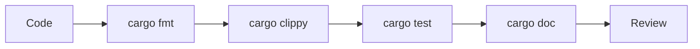

# Kapitel 24: Projekt-Professionalisierung & das Antigravity CLI

> [!IMPORTANT]
> Professionalisierung bedeutet nicht mehr Werkzeuge um ihrer selbst willen. Sie bedeutet, dass Formatierung, Tests, Lints, Dokumentation und Automatisierung Fehler früh sichtbar machen.

## 24.1 Lernziele & Lernplan

Nach diesem Kapitel können Sie:

- ein Rust-Projekt mit Formatierung, Linting, Tests und klarer README-Struktur professionalisieren;
- `cargo fmt`, `cargo clippy`, `cargo test` und `cargo doc` fachlich einordnen;
- einfache CLI-Logik in parsebare Funktionen zerlegen;
- ein agentisches CLI-Werkzeug wie das Antigravity CLI als Projektassistent sinnvoll einsetzen;
- zwischen lokaler Automatisierung und ungeprüfter KI-Änderung unterscheiden.

Lernplan:

| Schritt | Thema | Ergebnis |
|---|---|---|
| 1 | Definition | Sie kennen die Bausteine professioneller Rust-Projekte. |
| 2 | Motivation | Sie erkennen typische Wartungsprobleme. |
| 3 | Fehler | Sie analysieren chaotischen CLI-Code. |
| 4 | Lösung | Sie strukturieren Code und Qualitätschecks. |
| 5 | Tutorial | Sie professionalisieren ein Mini-CLI. |
| 6 | Deep Dive | Sie ordnen Automatisierung und Agenten ein. |
| 7 | Übungen | Sie üben Projektqualität praktisch. |

## 24.2 Die Definition

Ein **professionelles Rust-Projekt** ist ein Projekt, dessen Code nicht nur funktioniert, sondern wiederholbar geprüft, verständlich strukturiert und sicher weiterentwickelt werden kann.

Kernelemente:

| Element | Zweck |
|---|---|
| `cargo fmt` | Einheitliche Formatierung. |
| `cargo clippy` | Statische Analyse und idiomatische Hinweise. |
| `cargo test` | Automatisierte Verhaltensprüfung. |
| `cargo doc` | Dokumentation aus Code-Kommentaren erzeugen. |
| README | Einstieg für Menschen: Zweck, Installation, Nutzung. |
| CI | Wiederholbare Prüfung bei jeder Änderung. |
| Agenten-CLI | Unterstützt Planung, Änderung und Verifikation im Projektkontext. |

> [!NOTE]
> Das Antigravity CLI steht in diesem Kapitel als Beispiel für ein agentisches Kommandozeilenwerkzeug: Es liest Projektkontext, plant Änderungen, editiert Dateien und kann Prüfkommandos ausführen.

## 24.3 Das Problem & die Motivation

Kleine Projekte werden oft schnell geschrieben und langsam unwartbar. Typische Symptome:

- Funktionen tun zu viele Dinge gleichzeitig.
- Fehler werden mit `unwrap()` versteckt.
- Formatierung hängt vom Autor ab.
- Es gibt keine Tests.
- README und tatsächliches Verhalten widersprechen sich.
- Änderungen werden nicht automatisiert geprüft.

In Rust verstärkt sich das Problem, wenn Typen und Ownership-Regeln nicht als Architekturwerkzeuge genutzt werden. Ein professioneller Workflow macht die Qualitätsgrenzen sichtbar.

## 24.4 Der naive Versuch

Ein ungeordnetes CLI:

```rust
use std::env;

fn main() {
    let args: Vec<String> = env::args().collect();
    let zahl1 = args[1].parse::<i32>().unwrap();
    let op = &args[2];
    let zahl2 = args[3].parse::<i32>().unwrap();

    if op == "+" {
        println!("{}", zahl1 + zahl2);
    }
    if op == "-" {
        println!("{}", zahl1 - zahl2);
    }
}
```

Zeile-für-Zeile:

| Zeile | Problem |
|---|---|
| `args[1]` | Panik, wenn Argumente fehlen. |
| `unwrap()` | Panik bei ungültigen Zahlen. |
| zwei `if` | Kein Verhalten bei unbekanntem Operator. |
| alles in `main` | Nicht gut testbar. |

EVA:

| Phase | Beschreibung |
|---|---|
| Eingabe | CLI-Argumente aus der Umgebung. |
| Verarbeitung | Indexzugriff, Parsing und Berechnung direkt in `main`. |
| Ausgabe | Direkte Konsolenausgabe, keine testbare Rückgabe. |

## 24.5 Die Anatomie des Fehlers

Der Compiler akzeptiert den Code, aber professionelle Prüfungen würden ihn kritisieren:

```text
warning: used `unwrap()` on a `Result` value
warning: indexing may panic
warning: this function mixes parsing, logic, and output
```

Das Problem ist nicht primär syntaktisch. Es ist architektonisch:

- `main` ist schwer testbar, weil sie direkt Umgebung und Ausgabe nutzt.
- Fehlerfälle sind Laufzeit-Panics statt kontrollierter Rückgaben.
- Die Signatur keiner Funktion dokumentiert, was scheitern kann.

> [!WARNING]
> Kompilierender Code ist nicht automatisch professioneller Code. Rusts Compiler garantiert Speichersicherheit, aber nicht gute Produktstruktur.

## 24.6 Die Lösung

Eine testbare Struktur:

```rust
#[derive(Debug, PartialEq)]
enum CliError {
    FalscheArgumentzahl,
    UngueltigeZahl,
    UnbekannterOperator,
}

fn berechne(links: i32, op: &str, rechts: i32) -> Result<i32, CliError> {
    match op {
        "+" => Ok(links + rechts),
        "-" => Ok(links - rechts),
        _ => Err(CliError::UnbekannterOperator),
    }
}

fn auswerten(args: &[String]) -> Result<i32, CliError> {
    if args.len() != 4 {
        return Err(CliError::FalscheArgumentzahl);
    }

    let links = args[1].parse::<i32>().map_err(|_| CliError::UngueltigeZahl)?;
    let rechts = args[3].parse::<i32>().map_err(|_| CliError::UngueltigeZahl)?;

    berechne(links, &args[2], rechts)
}

fn main() {
    let args: Vec<String> = std::env::args().collect();

    match auswerten(&args) {
        Ok(ergebnis) => println!("{ergebnis}"),
        Err(fehler) => eprintln!("Fehler: {fehler:?}"),
    }
}

#[cfg(test)]
mod tests {
    use super::*;

    #[test]
    fn addition_funktioniert() {
        assert_eq!(berechne(2, "+", 3), Ok(5));
    }

    #[test]
    fn unbekannter_operator_wird_abgelehnt() {
        assert_eq!(berechne(2, "*", 3), Err(CliError::UnbekannterOperator));
    }
}
```

Warum dies professioneller ist:

- `berechne` ist rein und direkt testbar.
- `auswerten` trennt CLI-Argumente von Berechnungslogik.
- `Result` macht Fehler explizit.
- `main` ist nur noch Adapter zwischen Umgebung und Fachlogik.

EVA:

| Phase | Beschreibung |
|---|---|
| Eingabe | `&[String]`, eine geliehene Sicht auf CLI-Argumente. |
| Verarbeitung | Länge prüfen, Zahlen parsen, Operator auswerten. |
| Ausgabe | `Result<i32, CliError>` statt Panic. |

## 24.7 Kleines Tutorial: Mini-CLI professionalisieren

### Schritt 1: Qualitätsbefehle festlegen

```text
cargo fmt
cargo clippy
cargo test
cargo doc --no-deps
```

### Schritt 2: README-Struktur planen

```markdown
# Rechner CLI

## Zweck
Kleines CLI fuer Addition und Subtraktion.

## Nutzung
cargo run -- 2 + 3

## Qualitaetschecks
cargo fmt
cargo clippy
cargo test
```

### Schritt 3: Antigravity-CLI sinnvoll einsetzen

Guter Agentenauftrag:

```text
Analysieren Sie dieses Rust-CLI-Projekt.
Ziel: main soll nur Adapter sein, Parsing und Berechnung sollen testbar werden.
Aendern Sie nur Rust- und Markdown-Dateien.
Fuehren Sie danach cargo fmt, cargo clippy und cargo test aus und berichten Sie die Ergebnisse.
```

### Schritt 4: Menschliche Prüfung

Prüfen Sie nach Agentenänderungen:

- Wurden nur erwartete Dateien geändert?
- Sind Fehlertypen verständlich?
- Decken Tests Erfolg und Fehlerfälle ab?
- Beschreibt die README die echte Nutzung?

## 24.8 Mentale Modelle & Deep Dive

### Qualitäts-Pipeline



### Agenten als Verstärker

Ein CLI-Agent kann sehr nützlich sein, wenn Aufgabe, Grenzen und Prüfbefehle klar sind. Er ist riskant, wenn Sie ihm unklare Ziele, unbegrenzte Dateirechte oder keine Verifikationspflicht geben.

| Einsatz | Gut geeignet? | Grund |
|---|---:|---|
| Tests ergänzen | Ja | Ziel und Erfolg sind messbar. |
| Clippy-Warnungen beheben | Ja | Werkzeugfeedback ist klar. |
| Architektur komplett neu erfinden | Vorsicht | Hohe Gefahr unnötiger Umbauten. |
| Dokumentation aktualisieren | Ja | Änderungen sind gut prüfbar. |
| Sicherheitskritische Änderung ohne Review | Nein | Menschliche Kontrolle bleibt nötig. |

### Lokale Projektstandards

Professionelle Teams dokumentieren Standards:

- Formatierung wird automatisch angewandt.
- Lints sind bewusst gewählt.
- Tests müssen lokal und in CI laufen.
- Agenten dürfen keine geheimen Schlüssel lesen oder veröffentlichen.
- Große Änderungen werden in kleine Pull Requests zerlegt.

## 24.9 Drei praktische Übungen

### Übung 1: Leicht - `main` verkleinern

Nehmen Sie ein kleines Programm und verschieben Sie Fachlogik aus `main` in eine Funktion.

Anforderung:

- `main` liest nur Eingaben und gibt Ergebnisse aus.
- Die neue Funktion hat mindestens einen Test.

Lösungshinweis: Beginnen Sie mit einer reinen Funktion ohne `println!`.

### Übung 2: Mittel - Fehler explizit machen

Ersetzen Sie `unwrap()` in einer Parserfunktion durch `Result`.

Signatur:

```rust
fn parse_zahl(text: &str) -> Result<i32, String>
```

Lösungshinweis: Nutzen Sie `map_err`.

### Übung 3: Schwer - Agentenauftrag formulieren

Schreiben Sie einen präzisen Auftrag für ein CLI-Agentenwerkzeug:

- Ziel;
- erlaubte Dateien;
- verbotene Aktionen;
- Prüfbefehle;
- erwarteter Abschlussbericht.

Lösungshinweis: Je klarer die Grenzen, desto leichter ist die Änderung überprüfbar.

## 24.10 Lernstrategie, Selbsteinschätzung & Merkzettel

### Cheat Sheet

| Ziel | Werkzeug |
|---|---|
| Formatieren | `cargo fmt` |
| Lints prüfen | `cargo clippy` |
| Tests ausführen | `cargo test` |
| Dokumentation bauen | `cargo doc --no-deps` |
| Schnelle Typprüfung | `cargo check` |
| CLI-Argumente lesen | `std::env::args()` |
| Fehler modellieren | `Result<T, E>` |

### Active Recall

1. Warum ist eine kleine `main`-Funktion leichter testbar?
2. Was prüft `clippy`, was der Compiler nicht zwingend ablehnt?
3. Warum sollte ein Agentenauftrag Dateigrenzen enthalten?
4. Was ist der Unterschied zwischen Panic und `Result`?

### Feynman-Methode

Erklären Sie Projekt-Professionalisierung in drei Sätzen: Formatierung, Prüfung, Wiederholbarkeit.

### Gezielte Fehlerprovokation

Fügen Sie absichtlich ein `unwrap()` auf eine Benutzereingabe ein. Formulieren Sie danach, welcher Fehlerfall dadurch unsichtbar wird.

### Selbsttest

Sie beherrschen das Kapitel, wenn Sie:

- ein CLI in Parser, Logik und Ausgabe trennen;
- mindestens zwei Tests für Fehlerfälle schreiben;
- Qualitätsbefehle in sinnvoller Reihenfolge ausführen;
- Agentenaufträge mit klaren Grenzen formulieren.

## 24.11 Zusammenfassung

- Professioneller Code ist überprüfbar, testbar und dokumentiert.
- `cargo fmt`, `cargo clippy`, `cargo test` und `cargo doc` bilden eine Basis-Pipeline.
- `main` sollte Adapter bleiben, nicht Fachlogik enthalten.
- `Result` macht Fehlerfälle sichtbar.
- Das Antigravity CLI und ähnliche Agenten sind nützlich, wenn Ziele, Grenzen und Verifikation klar sind.
