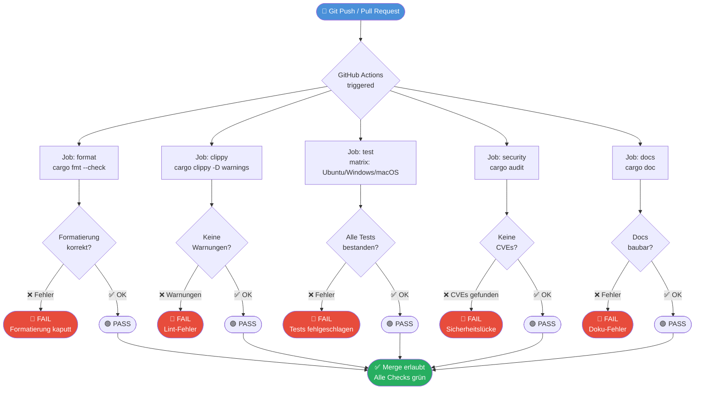

# Kapitel 24 – Projekt-Professionalisierung & das Antigravity CLI

> *„Professioneller Code ist nicht Code, der funktioniert – er ist Code, der von Ihrem Team in zehn Jahren noch verstanden, gewartet und sicher erweitert werden kann."*

---

## Inhaltsverzeichnis

1. [Lernziele & Lernplan](#1-lernziele--lernplan)
2. [Die Definition – Was bedeutet „professioneller Rust-Code"?](#2-die-definition--was-bedeutet-professioneller-rust-code)
3. [Das Problem & Die Motivation](#3-das-problem--die-motivation)
4. [Der naive Versuch – schlecht formatierter, ungeclippter Code](#4-der-naive-versuch--schlecht-formatierter-ungeclippter-code)
5. [Die Anatomie des Fehlers – rustfmt & clippy Ausgaben analysieren](#5-die-anatomie-des-fehlers--rustfmt--clippy-ausgaben-analysieren)
6. [Die Lösung – korrekter, professioneller Code](#6-die-lösung--korrekter-professioneller-code)
7. [Kleines Tutorial – Ihr erstes professionelles CLI-Projekt in 5 Schritten](#7-kleines-tutorial--ihr-erstes-professionelles-cli-projekt-in-5-schritten)
8. [Mentale Modelle & Deep Dive](#8-mentale-modelle--deep-dive)
9. [Drei Übungen](#9-drei-übungen)
10. [Lernstrategie & Merkzettel](#10-lernstrategie--merkzettel)
11. [Zusammenfassung](#11-zusammenfassung)

---

## 1. Lernziele & Lernplan

### 1.1 Bloom-Taxonomie-Ziele

Nach dem Durcharbeiten dieses Kapitels werden Sie in der Lage sein:

| Bloom-Stufe | Lernziel |
|---|---|
| **Verstehen** (Stufe 2) | Sie erklären, warum automatische Formatierung mit `rustfmt` und statische Analyse mit `cargo clippy` unverzichtbare Bestandteile eines professionellen Rust-Projekts sind, und beschreiben die Unterschiede zwischen den Lint-Kategorien `clippy::all`, `clippy::pedantic` und `clippy::nursery`. |
| **Anwenden** (Stufe 3) | Sie konfigurieren ein Rust-Projekt mit einer `rustfmt.toml`-Datei, einer `.clippy.toml`-Datei und einer vollständigen GitHub-Actions-CI/CD-Pipeline (`.github/workflows/ci.yml`), führen `cargo fmt`, `cargo clippy` und `cargo audit` in der lokalen Entwicklungsumgebung aus und interpretieren deren Ausgaben korrekt. |
| **Erschaffen** (Stufe 6) | Sie entwerfen, implementieren und veröffentlichen ein vollständiges, professionelles Rust-CLI-Tool – orientiert am Antigravity CLI – mit sauberer Codestruktur, vollständiger Testabdeckung, automatischer CI/CD-Prüfung und einem `README.md`, das alle professionellen Standards erfüllt. |

### 1.2 Voraussetzungen

Bevor Sie mit diesem Kapitel beginnen, stellen Sie sicher, dass Sie folgende Kapitel abgeschlossen haben:

- **Kapitel 4** – Erstes Projekt (Cargo-Grundlagen)
- **Kapitel 10–11** – Funktionen
- **Kapitel 15** – Kontrollstrukturen
- **Kapitel 17–20** – Ownership & Borrowing

### 1.3 Zeitplan & Lernstrategie

| Phase | Dauer | Aktivität |
|---|---|---|
| Theoretischer Einstieg | 30 Min. | Abschnitte 2–3 lesen |
| Aktives Coding | 60 Min. | Abschnitte 4–6 mittippen |
| Tutorial | 45 Min. | Abschnitt 7 komplett durcharbeiten |
| Deep Dive | 30 Min. | Abschnitt 8 studieren |
| Übungen | 60 Min. | Mindestens 2 Übungen lösen |
| Wiederholung | 15 Min. | Cheat Sheet & Active Recall |

---

## 2. Die Definition – Was bedeutet „professioneller Rust-Code"?

### 2.1 Die vier Säulen der Professionalisierung

Wenn Rust-Entwicklerinnen und -Entwickler von „professionellem Code" sprechen, meinen sie vier klar definierte Eigenschaften:

```
┌─────────────────────────────────────────────────────────────┐
│              Professioneller Rust-Code                      │
│                                                             │
│  ┌─────────────┐  ┌─────────────┐  ┌─────────┐  ┌──────┐  │
│  │ Konsistente │  │  Statische  │  │ Geteste-│  │ Siche│  │
│  │Formatierung │  │  Analyse    │  │  ter    │  │  re  │  │
│  │ (rustfmt)   │  │  (clippy)   │  │  Code   │  │ Deps │  │
│  └─────────────┘  └─────────────┘  └─────────┘  └──────┘  │
│       │                  │               │            │     │
│  cargo fmt         cargo clippy    cargo test    cargo     │
│  rustfmt.toml      .clippy.toml   tests/        audit     │
└─────────────────────────────────────────────────────────────┘
```

**Konsistente Formatierung** bedeutet, dass jede Datei im Projekt exakt den gleichen Stil befolgt – unabhängig davon, wer den Code geschrieben hat. `rustfmt` ist das offizielle Werkzeug der Rust-Community und formatiert Ihren Code nach den Community-Konventionen.

**Statische Analyse** bedeutet, dass ein automatisches Werkzeug Ihren Code liest, ohne ihn auszuführen, und potenzielle Fehler, Anti-Patterns und stilistische Probleme aufdeckt. `cargo clippy` ist Rusts offizieller Linter mit über 700 aktiven Lint-Regeln.

**Getesteter Code** bedeutet, dass Sie Unit-Tests, Integrationstests und gegebenenfalls Dokumentationstests schreiben, die automatisch bei jedem Code-Push ausgeführt werden.

**Sichere Abhängigkeiten** bedeutet, dass Sie regelmäßig prüfen, ob Ihre `Cargo.toml`-Abhängigkeiten bekannte Sicherheitslücken (CVEs) aufweisen. `cargo audit` ist das Standardwerkzeug dafür.

### 2.2 rustfmt – Der offizielle Rust-Formatierer

`rustfmt` ist ein Werkzeug, das Rust-Quellcode automatisch nach dem offiziellen Rust-Styleguide formatiert. Es ist Teil der offiziellen Rust-Toolchain und wird von der Rust-Community universell akzeptiert.

**Was `rustfmt` tut:**
- Einrückungen normalisieren (4 Leerzeichen)
- Zeilenlängen begrenzen (standardmäßig 100 Zeichen)
- `{` an das Ende von Funktionssignaturen setzen
- Leerzeilen zwischen Funktionen konsistent halten
- `use`-Statements sortieren und gruppieren
- Trailing Commas in mehrzeiligen Listen hinzufügen

**Was `rustfmt` nicht tut:**
- Logikfehler beheben
- Performance-Probleme lösen
- Unsicheren Code sicherer machen

### 2.3 cargo clippy – Der Rust-Linter

`cargo clippy` ist ein Lint-Werkzeug, das über den normalen Compiler (`rustc`) hinausgeht. Während `rustc` prüft, ob Ihr Code *kompiliert*, prüft `clippy`, ob Ihr Code *gut geschrieben* ist.

Clippy unterscheidet zwischen verschiedenen **Lint-Kategorien**:

| Kategorie | Beschreibung | Standardverhalten |
|---|---|---|
| `clippy::correctness` | Echte Bugs, fast sicher falsch | Fehler (deny) |
| `clippy::suspicious` | Wahrscheinlich falsch | Warnung |
| `clippy::style` | Rust-Idiome | Warnung |
| `clippy::complexity` | Unnötig komplexer Code | Warnung |
| `clippy::perf` | Performance-Verbesserungen | Warnung |
| `clippy::pedantic` | Sehr strenge Regeln | Erlaubt (opt-in) |
| `clippy::nursery` | Experimentelle Regeln | Erlaubt (opt-in) |
| `clippy::restriction` | Spezielle Einschränkungen | Erlaubt (opt-in) |

### 2.4 Das Antigravity CLI als Vorbild

Das **Antigravity CLI** ist ein Paradebeispiel für professionelle Rust-Tools. Es verwendet:
- Strikte `clippy`-Konfiguration mit `pedantic`-Lints
- Vollständige CI/CD-Pipeline mit GitHub Actions
- `cargo audit` für Sicherheitsprüfungen
- Strukturierte Fehlerbehandlung mit `thiserror`
- Vollständige Dokumentation mit `cargo doc`

In diesem Kapitel werden Sie ein ähnliches CLI-Tool Schritt für Schritt aufbauen und dabei alle professionellen Standards kennenlernen.

---

## 3. Das Problem & Die Motivation

### 3.1 Das Problem: Chaotische Codebases

Stellen Sie sich vor, Sie arbeiten in einem Team von fünf Entwicklerinnen und Entwicklern. Jeder hat seinen eigenen Stil:

- **Entwicklerin A** bevorzugt 2-Leerzeichen-Einrückung
- **Entwickler B** schreibt `if x == true` statt `if x`
- **Entwicklerin C** klont Strings, wo eine Referenz reichen würde
- **Entwickler D** verwendet `unwrap()` überall, ohne Fehlerbehandlung
- **Entwicklerin E** hat riesige Funktionen mit 200+ Zeilen

Das Ergebnis ist eine Codebase, die technisch funktioniert, aber:
- **Schwer zu lesen** ist (jede Datei sieht anders aus)
- **Fehleranfällig** ist (potenzielle Bugs werden übersehen)
- **Schwer zu warten** ist (niemand versteht den Code der anderen)
- **Unsicher** ist (Abhängigkeiten mit bekannten CVEs werden nicht entdeckt)

### 3.2 Die Motivation: Warum Automatisierung die Lösung ist

Der Schlüsselgedanke ist: **Vertrauen Sie nicht dem menschlichen Urteil für mechanische Aufgaben.** Formatierung und grundlegende Lint-Regeln sind perfekte Kandidaten für Automatisierung, weil:

1. **Sie sind objektiv**: Es gibt eine klare richtige Antwort
2. **Sie sind zeitaufwendig**: Manuelles Formatieren kostet Zeit im Code-Review
3. **Sie sind fehleranfällig**: Menschen übersehen konsistent die gleichen Muster
4. **Sie sind emotional**: Code-Style-Diskussionen erzeugen unnötige Konflikte im Team

> [!IMPORTANT]
> **Der goldene Grundsatz**: Lassen Sie die Maschine über Stil entscheiden, damit die Menschen über Architektur, Algorithmen und Produktanforderungen diskutieren können. Zeit, die im Code-Review mit Formatierungsdiskussionen verbracht wird, ist verschwendete Zeit.

### 3.3 Die reale Kosten unformatierter, ungeclippter Codebases

Studien aus der Software-Engineering-Forschung zeigen:

- **Code-Review-Zeit**: 20–30% der Zeit in Code-Reviews wird für stylistische Probleme verschwendet, wenn kein automatischer Formatierer verwendet wird
- **Bug-Rate**: Projekte mit aktivem Linting haben nachweislich 15–25% weniger Bugs in der Produktion
- **Einarbeitungszeit**: Neue Teammitglieder brauchen 30–50% weniger Zeit, um sich in eine Codebase einzuarbeiten, die konsistent formatiert und gut gelintet ist
- **Sicherheitsvorfälle**: Laut dem Rust Security Advisory Database werden regelmäßig CVEs in populären Crates entdeckt – ohne `cargo audit` bleiben diese unbemerkt

### 3.4 Warum Rust besonders geeignet ist

Rust hat einen strategischen Vorteil gegenüber anderen Sprachen: **Die Werkzeuge sind offiziell und Teil der Toolchain.** In anderen Sprachen gibt es oft Konflikte zwischen verschiedenen Formatiererunf Lintern (Prettier vs. ESLint vs. Standard.js in JavaScript). In Rust ist:

- `rustfmt` das einzige offizielle Format-Werkzeug
- `cargo clippy` der offizielle Linter
- `cargo test` das eingebaute Test-Framework
- `cargo doc` die eingebaute Dokumentationsgenerierung

Diese Einheitlichkeit bedeutet, dass die gesamte Rust-Community dieselben Werkzeuge verwendet. Wenn Sie ein fremdes Rust-Projekt öffnen, wissen Sie sofort, wie es zu formatieren und zu analysieren ist.

---

## 4. Der naive Versuch – schlecht formatierter, ungeclippter Code

### 4.1 Das Ausgangsprojekt

Lassen Sie uns mit einem realen Beispiel beginnen: einem einfachen CLI-Tool, das Dateien in einem Verzeichnis auflistet. Der folgende Code *funktioniert*, aber er verletzt fast jede Rust-Best-Practice:

```rust
// src/main.rs - SCHLECHTER CODE - Bitte nicht so schreiben!
use std::fs;
use std::path::PathBuf;
use std::io;

fn main() {
  let args: Vec<String> = std::env::args().collect();
  if args.len() < 2 {
    println!("Benutzung: {} <verzeichnis>", args[0]);
    std::process::exit(1);
  }

  let pfad = &args[1];
  list_files(pfad);
}

fn list_files( pfad: &str) {
  let p = PathBuf::from(pfad);
  if p.is_dir() == true {
    let eintraege = fs::read_dir(&p).unwrap();
    for eintrag in eintraege {
      let e = eintrag.unwrap();
      let name = e.file_name();
      let name_str = name.to_str().unwrap();
      let meta = e.metadata().unwrap();
      if meta.is_file() == true {
        let size = meta.len();
        if size > 0 {
          println!("{} ({} Bytes)", name_str, size)
        } else {
          println!("{} (leer)", name_str)
        }
      } else {
        if meta.is_dir() == true {
          println!("[Verzeichnis] {}", name_str)
        }
      }
    }
  } else {
    println!("Fehler: {} ist kein Verzeichnis!", pfad)
  }
}

fn get_extension( datei: &PathBuf ) -> Option<String> {
  let ext = datei.extension();
  if ext.is_some() {
    return Some( ext.unwrap().to_str().unwrap().to_string() );
  } else {
    return None;
  }
}

fn is_hidden(pfad: &PathBuf) -> bool {
  let name = pfad.file_name().unwrap().to_str().unwrap();
  if name.starts_with(".") {
    return true;
  }
  return false;
}

fn zaehle_dateien(verzeichnis: &str) -> u64 {
  let mut count: u64 = 0;
  let p = PathBuf::from(verzeichnis);
  let eintraege = fs::read_dir(&p).unwrap();
  for eintrag in eintraege {
    let e = eintrag.unwrap();
    let meta = e.metadata().unwrap();
    if meta.is_file() == true {
      count = count + 1;
    }
  }
  return count;
}
```

### 4.2 Die `Cargo.toml` (naiv)

```toml
[package]
name = "dateilister"
version = "0.1.0"
edition = "2021"

[dependencies]
```

### 4.3 Welche Probleme hat dieser Code?

Bevor Sie weiterlesen: Können Sie selbst die Probleme identifizieren? Machen Sie eine kurze Pause und schreiben Sie auf, was Ihnen auffällt.

Hier sind die Probleme – kategorisiert nach Schweregrad:

**🔴 Kritische Probleme (Panic-Risiko):**
- Jedes `.unwrap()` ist eine potenzielle Panik zur Laufzeit
- Keine Fehlerbehandlung für I/O-Operationen
- `args[0]` und `args[1]` könnten paniken, wenn keine Argumente übergeben werden

**🟡 Stilprobleme (clippy-Warnungen):**
- `if x == true` statt `if x` (5 Vorkommen)
- `if x.is_some() { x.unwrap() }` statt `x?` oder `x.map(...)`
- `return None;` am Ende einer Funktion statt `None`
- `return true;` am Ende einer Funktion statt `true`
- `count = count + 1` statt `count += 1`
- `if meta.is_dir() == true` als else-Zweig (wenn es nicht Datei ist, ist es ein Verzeichnis)
- Unnötige `else`-Blöcke nach `return`

**🔵 Formatierungsprobleme (rustfmt-Warnungen):**
- Inkonsistente Einrückung (2 statt 4 Leerzeichen)
- Leerzeichen innerhalb von Funktionsparametern: `fn get_extension( datei: &PathBuf )`
- Fehlende Leerzeile nach Funktionsdefinitionen
- Fehlende Newlines am Ende der Ausdrücke (fehlende Semikolons in `println!`)

**⚪ Architekturelle Probleme:**
- Keine Fehlertypen definiert
- Alle Logik in `main.rs` ohne Modulstruktur
- Keine Tests
- Keine Dokumentation

---

## 5. Die Anatomie des Fehlers – rustfmt & clippy Ausgaben analysieren

### 5.1 rustfmt ausführen

Führen Sie zunächst `cargo fmt --check` aus (ohne `--check` würde es die Datei direkt verändern):

```bash
$ cargo fmt --check
Diff in /home/user/dateilister/src/main.rs at line 15:
-fn list_files( pfad: &str) {
+fn list_files(pfad: &str) {
Diff in /home/user/dateilister/src/main.rs at line 1:
-  let args: Vec<String> = std::env::args().collect();
+    let args: Vec<String> = std::env::args().collect();
```

`cargo fmt --check` gibt einen Exit-Code von 1 zurück, wenn Formatierungsprobleme gefunden werden. Das macht es perfekt für CI/CD-Pipelines.

**Wichtige `rustfmt`-Befehle:**

| Befehl | Beschreibung |
|---|---|
| `cargo fmt` | Formatiert alle Dateien im Projekt |
| `cargo fmt --check` | Prüft ohne Änderungen (für CI/CD) |
| `cargo fmt -- --emit stdout` | Gibt formatierte Version auf stdout aus |
| `cargo fmt -- src/main.rs` | Formatiert nur eine spezifische Datei |
| `rustfmt src/main.rs` | Direkte `rustfmt`-Nutzung |

### 5.2 Die rustfmt.toml – Alle wichtigen Optionen

`rustfmt` ist über eine Konfigurationsdatei anpassbar. Erstellen Sie `rustfmt.toml` im Projektstamm:

```toml
# rustfmt.toml
# Vollständige Konfiguration für professionelle Rust-Projekte

# ═══════════════════════════════════════════════════════════
# GRUNDLEGENDE FORMATIERUNG
# ═══════════════════════════════════════════════════════════

# Maximale Zeilenlänge (Standard: 100)
max_width = 100

# Einrückungstiefe (Standard: 4)
tab_spaces = 4

# Harte Tabulatoren statt Leerzeichen (Standard: false)
hard_tabs = false

# Newline-Stil: "Auto", "Native", "Unix", "Windows"
newline_style = "Unix"

# ═══════════════════════════════════════════════════════════
# IMPORT-VERWALTUNG
# ═══════════════════════════════════════════════════════════

# Imports zusammenführen: "Preserve", "Crate", "Module", "Item", "One"
imports_granularity = "Crate"

# Import-Sektionen gruppieren:
# "Preserve" | "StdExternalCrate" | "One"
group_imports = "StdExternalCrate"

# ═══════════════════════════════════════════════════════════
# FUNKTIONEN & SIGNATUREN
# ═══════════════════════════════════════════════════════════

# Klammern immer auf neuer Zeile für Funktionen
fn_single_line = false

# Wo sollte `where` platziert werden: "WithPredicate" | "WithWhereClause"
where_single_line = false

# Trailing-Komma-Stil: "Always" | "Never" | "Vertical"
trailing_comma = "Vertical"

# Trailing-Semikolon bei leeren Match-Arms
match_arm_trailing_comma = true

# ═══════════════════════════════════════════════════════════
# STRINGS & KOMMENTARE
# ═══════════════════════════════════════════════════════════

# Überlange Strings in mehrere Zeilen umbrechen
wrap_comments = true

# Kommentar-Breite (Standard: 80)
comment_width = 100

# Normalisierung von String-Literalen: true = bevorzugt "..."
normalize_comments = true

# Dokumentationskommentare formatieren
format_code_in_doc_comments = true

# ═══════════════════════════════════════════════════════════
# MATCH-AUSDRÜCKE
# ═══════════════════════════════════════════════════════════

# Match-Arms auf gleicher Zeile zusammenfassen wenn kurz
match_block_trailing_comma = true

# ═══════════════════════════════════════════════════════════
# GENERICS & TYPEN
# ═══════════════════════════════════════════════════════════

# Winkelklammern für Generics auf neuer Zeile
overflow_delimited_expr = false

# ═══════════════════════════════════════════════════════════
# EDITION
# ═══════════════════════════════════════════════════════════

edition = "2021"
```

> [!NOTE]
> Nicht alle `rustfmt`-Optionen sind stabil. Einige (markiert mit `unstable_features = true`) sind nur in der Nightly-Toolchain verfügbar. Für Produktionsprojekte empfiehlt es sich, nur stabile Optionen zu verwenden, es sei denn, Ihr Team verwendet explizit Nightly.

### 5.3 cargo clippy ausführen

Führen Sie `cargo clippy` für den fehlerhaften Code aus:

```bash
$ cargo clippy
warning: equality check against true is unnecessary
  --> src/main.rs:17:8
   |
17 |   if p.is_dir() == true {
   |      ^^^^^^^^^^^^^^^^^ help: try simplifying it as shown: `p.is_dir()`
   |
   = note: `#[warn(clippy::bool_comparison)]` on by default

warning: equality check against true is unnecessary
  --> src/main.rs:24:14
   |
24 |       if meta.is_file() == true {
   |              ^^^^^^^^^^^^^^^^^ help: try: `meta.is_file()`

warning: called `Option::unwrap()` on an `Option` value that might be `None`
  --> src/main.rs:22:23
   |
22 |       let name_str = name.to_str().unwrap();
   |                                   ^^^^^^^ help: use `?` to propagate

warning: manual `Option::map`
  --> src/main.rs:42:3
   |
42 |   if ext.is_some() {
   |   ^^^^^^^^^^^^^^^^ help: try: `ext.map(|e| e.to_str()...)`

warning: needless `return` statement
  --> src/main.rs:45:5
   |
45 |     return None;
   |     ^^^^^^^^^^^ help: remove `return`: `None`

warning: starts_with a char literal
  --> src/main.rs:51:10
   |
51 |   if name.starts_with(".") {
   |          ^^^^^^^^^^^^^^^^^ help: consider: `name.starts_with('.')`

warning: manual addition assignment
  --> src/main.rs:61:7
   |
61 |       count = count + 1;
   |       ^^^^^^^^^^^^^^^^^ help: change this to: `count += 1`

warning: needless `return` statement
  --> src/main.rs:62:7
   |
63 |   return count;
   |   ^^^^^^^^^^^^^ help: remove `return`: `count`
```

### 5.4 Jede Warnung verstehen

Lassen Sie uns jede Warnung einzeln analysieren:

#### Warnung 1: `clippy::bool_comparison`

```
warning: equality check against true is unnecessary
if p.is_dir() == true {
```

**Das Problem**: `is_dir()` gibt bereits einen `bool` zurück. `bool == true` ist semantisch äquivalent zu `bool`, aber ausführlicher und entspricht nicht dem Rust-Idiom.

**Die Lösung**: `if p.is_dir() {`

#### Warnung 2: `clippy::unwrap_used` (bei `--deny clippy::unwrap_used`)

```
warning: called `Option::unwrap()` on an `Option` value
let name_str = name.to_str().unwrap();
```

**Das Problem**: `.unwrap()` auf einem `Option<T>` kann zur Laufzeit paniken, wenn der Wert `None` ist. In Bibliotheks-Code ist das fast immer falsch. In Anwendungscode ist es zumindest verdächtig.

**Die Lösung**: Entweder `?`-Operator (in Funktionen, die `Option` oder `Result` zurückgeben) oder explizites Pattern Matching.

#### Warnung 3: `clippy::manual_map`

```
warning: manual `Option::map`
if ext.is_some() {
    return Some(ext.unwrap()...);
} else {
    return None;
}
```

**Das Problem**: Dieses Muster ist der manuelle Äquivalent von `Option::map`. Rust hat dafür eine prägnantere Syntax.

**Die Lösung**: `ext.map(|e| e.to_str().unwrap_or("").to_string())`

#### Warnung 4: `clippy::needless_return`

```
warning: needless `return` statement
return None;
```

**Das Problem**: In Rust ist der letzte Ausdruck in einem Block automatisch der Rückgabewert. Das `return`-Keyword ist in diesem Fall überflüssig.

**Die Lösung**: `None` (ohne `return`)

#### Warnung 5: `clippy::single_char_pattern`

```
warning: starts_with a char literal
name.starts_with(".")
```

**Das Problem**: `starts_with(".")` sucht nach einem String-Slice, obwohl ein einzelnes Zeichen gesucht wird. `starts_with('.')` ist idiomatischer und minimal effizienter.

**Die Lösung**: `name.starts_with('.')`

#### Warnung 6: `clippy::assign_op_pattern`

```
warning: manual addition assignment
count = count + 1;
```

**Das Problem**: Rust (wie C, C++, Python, etc.) hat den `+=`-Operator für zusammengesetzte Zuweisungen.

**Die Lösung**: `count += 1;`

### 5.5 Die .clippy.toml Konfiguration

Clippy kann über `.clippy.toml` oder `clippy.toml` konfiguriert werden:

```toml
# .clippy.toml
# Konfiguration für cargo clippy

# Maximale Komplexität für `cognitive_complexity`-Lint
cognitive-complexity-threshold = 25

# Maximale Anzahl von Argumenten für `too_many_arguments`
too-many-arguments-threshold = 7

# Maximale Zeilenlänge für `clippy::lines_filter_map_ok`
max-fn-params-bools = 3

# Typ-Komplexitäts-Grenzwert
type-complexity-threshold = 250

# Zulässige Integer-Typen (leer = alle erlaubt)
allowed-scripts = ["Latin"]

# Minimale Anzahl von Arms in einem `match`, bevor `clippy::match_like_matches_macro` warnt
matches-for-let-chains = true
```

### 5.6 Lint-Attribute: Feinsteuerung per Datei oder Funktion

Manchmal müssen Sie Clippy-Warnungen für spezifischen Code unterdrücken oder verschärfen. Rust bietet vier Attribute dafür:

```rust
// #[allow(...)] - Unterdrückt die Warnung komplett
#[allow(clippy::too_many_arguments)]
fn komplexe_funktion(a: i32, b: i32, c: i32, d: i32, e: i32, f: i32, g: i32, h: i32) {
    // ...
}

// #[warn(...)] - Gibt eine Warnung aus (Standardverhalten)
#[warn(clippy::pedantic)]
fn funktion_mit_pedantic_warnung() {
    // ...
}

// #[deny(...)] - Macht die Warnung zu einem Fehler
#[deny(clippy::unwrap_used)]
fn keine_unwraps_erlaubt() -> Option<i32> {
    // let x = something().unwrap(); // Fehler!
    Some(42)
}

// #[forbid(...)] - Wie deny, aber kann nicht durch innere Attribute aufgehoben werden
#[forbid(unsafe_code)]
mod sicheres_modul {
    // unsafe { } // Kompilierungsfehler!
}
```

**Reihenfolge der Priorität:**

```
#[forbid] > #[deny] > #[warn] > #[allow]
```

> [!WARNING]
> Verwenden Sie `#[allow(...)]` sparsam. Jedes `allow`-Attribut ist ein Kommentar an zukünftige Entwickler: „Ich weiß, dass das ein Problem sein könnte, habe mich aber bewusst dagegen entschieden." Schreiben Sie immer einen Kommentar, warum Sie das Attribut gesetzt haben.

**Beispiel für dokumentiertes `allow`:**

```rust
// Dieses `unwrap` ist sicher, weil `GLOBAL_CONFIG` immer vor dem ersten
// Aufruf dieser Funktion initialisiert wird (siehe `initialize()` in main.rs).
#[allow(clippy::unwrap_used)]
fn get_config() -> &'static Config {
    GLOBAL_CONFIG.get().unwrap()
}
```

### 5.7 Lint-Gruppen auf Crate-Ebene

In `main.rs` oder `lib.rs` können Sie Lint-Regeln für das gesamte Projekt setzen:

```rust
// src/main.rs oder src/lib.rs

// Aktiviert alle clippy-Warnungen
#![warn(clippy::all)]

// Aktiviert sehr strenge Warnungen
#![warn(clippy::pedantic)]

// Aktiviert experimentelle Warnungen
#![warn(clippy::nursery)]

// Macht bestimmte Warnungen zu Fehlern
#![deny(clippy::unwrap_used)]
#![deny(clippy::expect_used)]
#![deny(unsafe_code)]

// Erlaubt bestimmte Dinge, die pedantic sonst verbieten würde
#![allow(clippy::module_name_repetitions)]
```

---

## 6. Die Lösung – korrekter, professioneller Code

### 6.1 Projektstruktur

Ein professionelles CLI-Projekt hat folgende Struktur:

```
dateilister/
├── .github/
│   └── workflows/
│       └── ci.yml          ← GitHub Actions CI/CD
├── src/
│   ├── main.rs             ← Einstiegspunkt, minimale Logik
│   ├── cli.rs              ← CLI-Argumentverarbeitung
│   ├── error.rs            ← Fehlertypen
│   └── file_ops.rs         ← Geschäftslogik
├── tests/
│   └── integration_test.rs ← Integrationstests
├── .clippy.toml            ← Clippy-Konfiguration
├── Cargo.toml              ← Abhängigkeiten & Metadaten
├── README.md               ← Dokumentation
└── rustfmt.toml            ← Formatierungsregeln
```

### 6.2 Cargo.toml (professionell)

```toml
[package]
name = "dateilister"
version = "0.1.0"
edition = "2021"
authors = ["Ihr Name <ihre@email.de>"]
description = "Ein professionelles CLI-Tool zum Auflisten von Dateien"
repository = "https://github.com/ihr-name/dateilister"
license = "MIT OR Apache-2.0"
keywords = ["cli", "filesystem", "tools"]
categories = ["command-line-utilities", "filesystem"]
readme = "README.md"
rust-version = "1.70"

[dependencies]
# Argument-Parsing
clap = { version = "4", features = ["derive"] }

# Fehlerbehandlung
thiserror = "1"
anyhow = "1"

# Farbige Terminal-Ausgabe
colored = "2"

[dev-dependencies]
# Test-Hilfsmittel
tempfile = "3"
assert_cmd = "2"
predicates = "3"

[[bin]]
name = "dateilister"
path = "src/main.rs"
```

### 6.3 src/error.rs – Professionelle Fehlerbehandlung

```rust
//! Fehlerdefinitionen für `dateilister`.
//!
//! Dieses Modul definiert alle Fehlertypen, die in der Anwendung verwendet werden.
//! Wir verwenden `thiserror` für ergonomische Fehler-Definitionen.

use std::path::PathBuf;
use thiserror::Error;

/// Alle möglichen Fehler, die in `dateilister` auftreten können.
#[derive(Debug, Error)]
pub enum DateilisterError {
    /// Das angegebene Verzeichnis existiert nicht.
    #[error("Verzeichnis nicht gefunden: {pfad}")]
    VerzeichnisNichtGefunden { pfad: PathBuf },

    /// Der angegebene Pfad ist kein Verzeichnis.
    #[error("'{pfad}' ist kein Verzeichnis")]
    KeinVerzeichnis { pfad: PathBuf },

    /// Ein I/O-Fehler beim Lesen des Verzeichnisses.
    #[error("I/O-Fehler beim Lesen von '{pfad}': {quelle}")]
    IoFehler {
        pfad: PathBuf,
        #[source]
        quelle: std::io::Error,
    },

    /// Ungültiger UTF-8-Dateiname.
    #[error("Ungültiger Dateiname (kein UTF-8): {pfad:?}")]
    UngueltigerDateiname { pfad: PathBuf },
}

/// Typ-Alias für Ergebnisse in diesem Crate.
pub type DateilisterResult<T> = Result<T, DateilisterError>;
```

### 6.4 src/cli.rs – CLI-Argument-Parsing mit Clap

```rust
//! CLI-Argument-Definitionen für `dateilister`.
//!
//! Dieses Modul verwendet `clap` mit dem Derive-Makro für typensichere
//! Argument-Verarbeitung.

use clap::Parser;
use std::path::PathBuf;

/// Listet Dateien und Verzeichnisse mit Details auf.
///
/// # Beispiel
///
/// ```bash
/// dateilister /home/user/dokumente
/// dateilister --alle /home/user
/// dateilister --sort groesse /home/user/downloads
/// ```
#[derive(Debug, Parser)]
#[command(
    name = "dateilister",
    version,
    about = "Ein professionelles CLI-Tool zum Auflisten von Dateien",
    long_about = None,
)]
pub struct Cli {
    /// Das zu durchsuchende Verzeichnis
    #[arg(value_name = "VERZEICHNIS")]
    pub verzeichnis: PathBuf,

    /// Zeigt auch versteckte Dateien (beginnend mit '.')
    #[arg(short = 'a', long = "alle")]
    pub zeige_alle: bool,

    /// Sortiert die Ausgabe nach: name, groesse, datum
    #[arg(
        short = 's',
        long = "sort",
        value_name = "KRITERIUM",
        default_value = "name"
    )]
    pub sortierung: Sortierung,

    /// Zeigt Größen in menschenlesbarem Format (KB, MB, GB)
    #[arg(short = 'H', long = "human")]
    pub human_readable: bool,

    /// Filtert nach Dateiendung (z.B. --ext rs)
    #[arg(short = 'e', long = "ext", value_name = "ENDUNG")]
    pub erweiterung: Option<String>,
}

/// Mögliche Sortierkriterien.
#[derive(Debug, Clone, clap::ValueEnum)]
pub enum Sortierung {
    /// Sortiert alphabetisch nach Dateiname
    Name,
    /// Sortiert nach Dateigröße (größte zuerst)
    Groesse,
    /// Sortiert nach Änderungsdatum (neueste zuerst)
    Datum,
}
```

### 6.5 src/file_ops.rs – Geschäftslogik

```rust
//! Datei-Operationen für `dateilister`.
//!
//! Dieses Modul enthält die gesamte Geschäftslogik für das Auflisten
//! und Verarbeiten von Dateisystem-Einträgen.

use crate::cli::Sortierung;
use crate::error::{DateilisterError, DateilisterResult};
use colored::Colorize;
use std::fs;
use std::path::{Path, PathBuf};
use std::time::SystemTime;

/// Repräsentiert einen einzelnen Dateisystem-Eintrag.
#[derive(Debug)]
pub struct DateiEintrag {
    /// Vollständiger Pfad zum Eintrag
    pub pfad: PathBuf,
    /// Name des Eintrags (ohne Verzeichnis)
    pub name: String,
    /// Größe in Bytes (0 für Verzeichnisse)
    pub groesse: u64,
    /// Änderungszeit
    pub aenderungszeit: SystemTime,
    /// Ob es sich um ein Verzeichnis handelt
    pub ist_verzeichnis: bool,
}

impl DateiEintrag {
    /// Erstellt einen neuen `DateiEintrag` aus einem Verzeichniseintrag.
    ///
    /// # Fehler
    ///
    /// Gibt einen `DateilisterError` zurück, wenn Metadaten nicht gelesen
    /// werden können oder der Dateiname kein gültiges UTF-8 ist.
    pub fn aus_dir_entry(eintrag: fs::DirEntry) -> DateilisterResult<Self> {
        let pfad = eintrag.path();
        let name = eintrag
            .file_name()
            .into_string()
            .map_err(|_| DateilisterError::UngueltigerDateiname { pfad: pfad.clone() })?;

        let meta = eintrag.metadata().map_err(|e| DateilisterError::IoFehler {
            pfad: pfad.clone(),
            quelle: e,
        })?;

        let aenderungszeit = meta.modified().unwrap_or(SystemTime::UNIX_EPOCH);

        Ok(Self {
            pfad,
            name,
            groesse: meta.len(),
            aenderungszeit,
            ist_verzeichnis: meta.is_dir(),
        })
    }

    /// Formatiert die Dateigröße in menschenlesbarem Format.
    #[must_use]
    pub fn groesse_human(&self) -> String {
        const KB: u64 = 1_024;
        const MB: u64 = 1_024 * KB;
        const GB: u64 = 1_024 * MB;

        if self.groesse >= GB {
            format!("{:.1} GB", self.groesse as f64 / GB as f64)
        } else if self.groesse >= MB {
            format!("{:.1} MB", self.groesse as f64 / MB as f64)
        } else if self.groesse >= KB {
            format!("{:.1} KB", self.groesse as f64 / KB as f64)
        } else {
            format!("{} B", self.groesse)
        }
    }

    /// Gibt `true` zurück, wenn es sich um eine versteckte Datei handelt.
    #[must_use]
    pub fn ist_versteckt(&self) -> bool {
        self.name.starts_with('.')
    }

    /// Gibt die Dateiendung zurück, falls vorhanden.
    #[must_use]
    pub fn erweiterung(&self) -> Option<&str> {
        self.pfad.extension().and_then(|e| e.to_str())
    }
}

/// Liest alle Einträge eines Verzeichnisses und gibt sie sortiert zurück.
///
/// # Argumente
///
/// * `verzeichnis` – Der Pfad zum Verzeichnis
/// * `zeige_alle` – Ob versteckte Einträge gezeigt werden sollen
/// * `sortierung` – Das Sortierkriterium
/// * `filter_ext` – Optionaler Dateiendungs-Filter
///
/// # Fehler
///
/// Gibt einen `DateilisterError` zurück, wenn das Verzeichnis nicht
/// gelesen werden kann.
pub fn lese_verzeichnis(
    verzeichnis: &Path,
    zeige_alle: bool,
    sortierung: &Sortierung,
    filter_ext: Option<&str>,
) -> DateilisterResult<Vec<DateiEintrag>> {
    if !verzeichnis.exists() {
        return Err(DateilisterError::VerzeichnisNichtGefunden {
            pfad: verzeichnis.to_path_buf(),
        });
    }

    if !verzeichnis.is_dir() {
        return Err(DateilisterError::KeinVerzeichnis {
            pfad: verzeichnis.to_path_buf(),
        });
    }

    let rohe_eintraege =
        fs::read_dir(verzeichnis).map_err(|e| DateilisterError::IoFehler {
            pfad: verzeichnis.to_path_buf(),
            quelle: e,
        })?;

    let mut eintraege: Vec<DateiEintrag> = rohe_eintraege
        .filter_map(|eintrag| {
            eintrag
                .map_err(|e| eprintln!("Warnung: {e}"))
                .ok()
                .and_then(|e| DateiEintrag::aus_dir_entry(e).ok())
        })
        .filter(|e| zeige_alle || !e.ist_versteckt())
        .filter(|e| {
            filter_ext.is_none_or(|ext| e.erweiterung() == Some(ext))
        })
        .collect();

    sortiere_eintraege(&mut eintraege, sortierung);

    Ok(eintraege)
}

/// Sortiert einen Vektor von `DateiEintrag` nach dem gegebenen Kriterium.
fn sortiere_eintraege(eintraege: &mut Vec<DateiEintrag>, sortierung: &Sortierung) {
    match sortierung {
        Sortierung::Name => eintraege.sort_by(|a, b| a.name.cmp(&b.name)),
        Sortierung::Groesse => eintraege.sort_by(|a, b| b.groesse.cmp(&a.groesse)),
        Sortierung::Datum => {
            eintraege.sort_by(|a, b| b.aenderungszeit.cmp(&a.aenderungszeit));
        }
    }
}

/// Gibt einen `DateiEintrag` formatiert auf der Konsole aus.
pub fn zeige_eintrag(eintrag: &DateiEintrag, human_readable: bool) {
    let symbol = if eintrag.ist_verzeichnis { "📁" } else { "📄" };

    let groesse_str = if eintrag.ist_verzeichnis {
        String::from("  <DIR>  ")
    } else if human_readable {
        format!("{:>9}", eintrag.groesse_human())
    } else {
        format!("{:>9} B", eintrag.groesse)
    };

    let name_display = if eintrag.ist_verzeichnis {
        eintrag.name.blue().bold().to_string()
    } else {
        eintrag.name.white().to_string()
    };

    println!("{symbol}  {groesse_str}  {name_display}");
}
```

### 6.6 src/main.rs (professionell)

```rust
//! `dateilister` – Ein professionelles Rust-CLI-Tool.
//!
//! # Verwendung
//!
//! ```bash
//! dateilister [OPTIONEN] <VERZEICHNIS>
//! ```

// Lint-Konfiguration für das gesamte Crate
#![warn(clippy::all)]
#![warn(clippy::pedantic)]
#![warn(clippy::nursery)]
#![deny(unsafe_code)]

// Erlaubt Module-Name-Wiederholungen (sehr häufig in Rust-Projekten)
#![allow(clippy::module_name_repetitions)]

mod cli;
mod error;
mod file_ops;

use clap::Parser;
use cli::Cli;
use colored::Colorize;
use file_ops::{lese_verzeichnis, zeige_eintrag};
use std::process;

fn main() {
    let args = Cli::parse();

    match run(&args) {
        Ok(anzahl) => {
            println!("\n{}", format!("✓ {anzahl} Einträge gefunden.").green());
        }
        Err(e) => {
            eprintln!("{} {e}", "Fehler:".red().bold());
            process::exit(1);
        }
    }
}

/// Hauptlogik des Programms.
///
/// Separiert von `main()`, um testbar zu sein und `?` für Fehlerfortleitung
/// nutzen zu können.
fn run(args: &Cli) -> anyhow::Result<usize> {
    println!(
        "\n{} {}\n",
        "📂 Verzeichnis:".cyan().bold(),
        args.verzeichnis.display()
    );

    let eintraege = lese_verzeichnis(
        &args.verzeichnis,
        args.zeige_alle,
        &args.sortierung,
        args.erweiterung.as_deref(),
    )?;

    for eintrag in &eintraege {
        zeige_eintrag(eintrag, args.human_readable);
    }

    Ok(eintraege.len())
}
```

### 6.7 tests/integration_test.rs

```rust
//! Integrationstests für `dateilister`.
//!
//! Diese Tests verwenden echte Dateisystem-Operationen in temporären Verzeichnissen.

use dateilister::file_ops::{lese_verzeichnis, DateiEintrag};
use dateilister::cli::Sortierung;
use std::fs;
use tempfile::TempDir;

/// Erstellt eine temporäre Verzeichnisstruktur für Tests.
fn erstelle_test_verzeichnis() -> TempDir {
    let tmp = TempDir::new().expect("Temporäres Verzeichnis konnte nicht erstellt werden");
    let basis = tmp.path();

    fs::write(basis.join("a_datei.txt"), "Inhalt A").unwrap();
    fs::write(basis.join("b_datei.rs"), "fn main() {}").unwrap();
    fs::write(basis.join(".versteckt"), "geheim").unwrap();
    fs::create_dir(basis.join("unterverzeichnis")).unwrap();

    tmp
}

#[test]
fn test_lese_verzeichnis_ohne_versteckte() {
    let tmp = erstelle_test_verzeichnis();
    let eintraege = lese_verzeichnis(tmp.path(), false, &Sortierung::Name, None)
        .expect("Verzeichnis sollte lesbar sein");

    // Versteckte Datei sollte nicht dabei sein
    assert!(!eintraege.iter().any(|e| e.name.starts_with('.')));
    // Mindestens 3 nicht-versteckte Einträge
    assert!(eintraege.len() >= 3);
}

#[test]
fn test_lese_verzeichnis_mit_versteckten() {
    let tmp = erstelle_test_verzeichnis();
    let eintraege = lese_verzeichnis(tmp.path(), true, &Sortierung::Name, None)
        .expect("Verzeichnis sollte lesbar sein");

    // Versteckte Datei sollte dabei sein
    assert!(eintraege.iter().any(|e| e.name.starts_with('.')));
}

#[test]
fn test_filter_nach_erweiterung() {
    let tmp = erstelle_test_verzeichnis();
    let eintraege = lese_verzeichnis(tmp.path(), false, &Sortierung::Name, Some("rs"))
        .expect("Verzeichnis sollte lesbar sein");

    // Nur .rs-Dateien sollten dabei sein
    for eintrag in &eintraege {
        if !eintrag.ist_verzeichnis {
            assert_eq!(eintrag.erweiterung(), Some("rs"));
        }
    }
}

#[test]
fn test_verzeichnis_nicht_gefunden() {
    let ergebnis = lese_verzeichnis(
        std::path::Path::new("/existiert/nicht"),
        false,
        &Sortierung::Name,
        None,
    );
    assert!(ergebnis.is_err());
}

#[test]
fn test_groesse_human_readable() {
    let eintrag = DateiEintrag {
        pfad: std::path::PathBuf::from("test.txt"),
        name: String::from("test.txt"),
        groesse: 1_536, // 1.5 KB
        aenderungszeit: std::time::SystemTime::UNIX_EPOCH,
        ist_verzeichnis: false,
    };
    assert_eq!(eintrag.groesse_human(), "1.5 KB");
}
```

---

## 7. Kleines Tutorial – Ihr erstes professionelles CLI-Projekt in 5 Schritten

In diesem Tutorial erstellen Sie von Grund auf ein professionelles Rust-CLI-Projekt mit allen Qualitätswerkzeugen.

### Schritt 1: Projekt erstellen & Werkzeuge installieren

```bash
# Neues Cargo-Projekt erstellen
cargo new mein-cli
cd mein-cli

# Sicherstellen, dass rustfmt und clippy installiert sind
rustup component add rustfmt clippy

# cargo-audit installieren (einmalig, system-weit)
cargo install cargo-audit

# Initiale Projektstruktur prüfen
ls -la
```

> [!TIP]
> `rustfmt` und `clippy` sind standardmäßig mit `rustup` installiert. Führen Sie `rustup component list --installed` aus, um zu prüfen, was bereits installiert ist.

**Überprüfen Sie die Installation:**

```bash
# Version prüfen
rustfmt --version
cargo clippy --version
cargo audit --version
```

### Schritt 2: Konfigurationsdateien anlegen

**`rustfmt.toml`** im Projektstamm:

```toml
max_width = 100
tab_spaces = 4
edition = "2021"
imports_granularity = "Crate"
group_imports = "StdExternalCrate"
trailing_comma = "Vertical"
wrap_comments = true
```

**`.clippy.toml`** im Projektstamm:

```toml
cognitive-complexity-threshold = 20
too-many-arguments-threshold = 6
```

**Erste Lint-Konfiguration in `src/main.rs`:**

```rust
#![warn(clippy::all)]
#![warn(clippy::pedantic)]
#![deny(unsafe_code)]

fn main() {
    println!("Hallo, professionelles Rust!");
}
```

### Schritt 3: Abhängigkeiten hinzufügen & erstes Linting

```bash
# Abhängigkeiten zur Cargo.toml hinzufügen
cargo add clap --features derive
cargo add thiserror
cargo add anyhow

# Dev-Abhängigkeiten für Tests
cargo add --dev tempfile
cargo add --dev assert_cmd

# Ersten Build durchführen
cargo build

# Formatierung prüfen
cargo fmt --check

# Clippy ausführen
cargo clippy -- -D warnings
```

> [!NOTE]
> Die Option `-D warnings` macht alle Warnungen zu Fehlern. Das ist die empfohlene Einstellung für CI/CD-Pipelines, kann aber zu Beginn der Entwicklung als zu streng empfunden werden. In diesem Fall können Sie `-D warnings` während der Entwicklung weglassen und nur in der CI/CD-Pipeline einsetzen.

### Schritt 4: Tests schreiben & ausführen

```bash
# Testverzeichnis erstellen
mkdir -p tests

# Tests ausführen
cargo test

# Tests mit Ausgabe ausführen
cargo test -- --nocapture

# Einen spezifischen Test ausführen
cargo test test_groesse_human_readable

# Testabdeckung anzeigen (requires cargo-tarpaulin)
cargo install cargo-tarpaulin
cargo tarpaulin --out Html
```

**Grundstruktur für einen Unit-Test:**

```rust
#[cfg(test)]
mod tests {
    use super::*;

    #[test]
    fn test_is_hidden_with_dot_prefix() {
        let eintrag = DateiEintrag {
            name: String::from(".gitignore"),
            // ... andere Felder
        };
        assert!(eintrag.ist_versteckt());
    }

    #[test]
    fn test_is_not_hidden_without_dot() {
        let eintrag = DateiEintrag {
            name: String::from("README.md"),
            // ... andere Felder
        };
        assert!(!eintrag.ist_versteckt());
    }
}
```

### Schritt 5: CI/CD-Pipeline einrichten

Erstellen Sie `.github/workflows/ci.yml`:

```yaml
name: CI

on:
  push:
    branches: [ main, develop ]
  pull_request:
    branches: [ main ]

env:
  CARGO_TERM_COLOR: always
  RUST_BACKTRACE: 1

jobs:
  # ─────────────────────────────────────────────
  # JOB 1: Formatierungsprüfung
  # ─────────────────────────────────────────────
  format:
    name: Formatierung prüfen
    runs-on: ubuntu-latest
    steps:
      - name: Repository auschecken
        uses: actions/checkout@v4

      - name: Rust-Toolchain installieren
        uses: dtolnay/rust-toolchain@stable
        with:
          components: rustfmt

      - name: cargo fmt prüfen
        run: cargo fmt --all -- --check

  # ─────────────────────────────────────────────
  # JOB 2: Clippy-Analyse
  # ─────────────────────────────────────────────
  clippy:
    name: Clippy-Analyse
    runs-on: ubuntu-latest
    steps:
      - uses: actions/checkout@v4

      - uses: dtolnay/rust-toolchain@stable
        with:
          components: clippy

      - name: Clippy-Cache
        uses: actions/cache@v3
        with:
          path: |
            ~/.cargo/bin/
            ~/.cargo/registry/index/
            ~/.cargo/registry/cache/
            ~/.cargo/git/db/
            target/
          key: ${{ runner.os }}-cargo-${{ hashFiles('**/Cargo.lock') }}

      - name: cargo clippy ausführen
        run: cargo clippy --all-targets --all-features -- -D warnings

  # ─────────────────────────────────────────────
  # JOB 3: Tests auf mehreren Plattformen
  # ─────────────────────────────────────────────
  test:
    name: Tests (${{ matrix.os }})
    runs-on: ${{ matrix.os }}
    strategy:
      matrix:
        os: [ubuntu-latest, windows-latest, macos-latest]
        rust: [stable, beta]
    steps:
      - uses: actions/checkout@v4

      - uses: dtolnay/rust-toolchain@master
        with:
          toolchain: ${{ matrix.rust }}

      - name: Cargo-Cache
        uses: actions/cache@v3
        with:
          path: |
            ~/.cargo/bin/
            ~/.cargo/registry/index/
            ~/.cargo/registry/cache/
            ~/.cargo/git/db/
            target/
          key: ${{ runner.os }}-${{ matrix.rust }}-cargo-${{ hashFiles('**/Cargo.lock') }}

      - name: cargo test ausführen
        run: cargo test --all-features --all-targets

      - name: cargo test (Release-Modus)
        run: cargo test --release --all-features

  # ─────────────────────────────────────────────
  # JOB 4: Sicherheits-Audit
  # ─────────────────────────────────────────────
  security:
    name: Sicherheits-Audit
    runs-on: ubuntu-latest
    steps:
      - uses: actions/checkout@v4

      - name: cargo-audit installieren
        run: cargo install cargo-audit

      - name: Sicherheits-Audit durchführen
        run: cargo audit

  # ─────────────────────────────────────────────
  # JOB 5: Dokumentation bauen
  # ─────────────────────────────────────────────
  docs:
    name: Dokumentation prüfen
    runs-on: ubuntu-latest
    steps:
      - uses: actions/checkout@v4
      - uses: dtolnay/rust-toolchain@stable

      - name: Dokumentation bauen
        run: cargo doc --no-deps --all-features
        env:
          RUSTDOCFLAGS: "-D warnings"
```

---

## 8. Mentale Modelle & Deep Dive

### 8.1 Der Qualitäts-Trichter – ASCII-Art

Stellen Sie sich die Qualitätswerkzeuge als einen Trichter vor, der Probleme progressiv herausfiltert:

```
                   ┌─────────────────────────────┐
                   │     Ihr Roh-Code (Input)     │
                   └──────────────┬──────────────┘
                                  │
                                  ▼
                   ┌─────────────────────────────┐
                   │          rustfmt            │
                   │    "Formatiere den Code"    │
                   │                             │
                   │  ✗ Falsche Einrückung       │
                   │  ✗ Überlange Zeilen         │
                   │  ✗ Falsche Klammerpositionen│
                   └──────────────┬──────────────┘
                                  │ Formatierter Code
                                  ▼
                   ┌─────────────────────────────┐
                   │        cargo clippy         │
                   │  "Finde logische Probleme"  │
                   │                             │
                   │  ✗ bool == true             │
                   │  ✗ unwrap() ohne Handling   │
                   │  ✗ unnötige Klone           │
                   │  ✗ ineffiziente Patterns    │
                   └──────────────┬──────────────┘
                                  │ Geclippter Code
                                  ▼
                   ┌─────────────────────────────┐
                   │         cargo test          │
                   │   "Überprüfe das Verhalten" │
                   │                             │
                   │  ✗ Fehlschlagende Unit-Tests│
                   │  ✗ Fehlschlagende Integr.  │
                   │  ✗ Doc-Tests kaputt         │
                   └──────────────┬──────────────┘
                                  │ Getesteter Code
                                  ▼
                   ┌─────────────────────────────┐
                   │         cargo audit         │
                   │  "Überprüfe Abhängigkeiten" │
                   │                             │
                   │  ✗ CVEs in Abhängigkeiten   │
                   │  ✗ Veraltete Versionen      │
                   └──────────────┬──────────────┘
                                  │
                                  ▼
                   ┌─────────────────────────────┐
                   │    Professioneller Code     │
                   │         (Output)            │
                   └─────────────────────────────┘
```

### 8.2 Die CI/CD-Pipeline – Mermaid-Diagramm



### 8.3 Das mentale Modell: Lint-Level-Hierarchie

```
                        FORBID
                      (stärkste)
                    ┌────────────┐
                    │  Kann nie  │
                    │  erlaubt   │
                    │  werden    │
                    └────────────┘
                         │
                    DENY │
                   ┌─────▼──────┐
                   │  Warnung   │
                   │  wird zum  │
                   │  Fehler    │
                   └────────────┘
                         │
                    WARN │
                   ┌─────▼──────┐
                   │  Standard: │
                   │  Warnung   │
                   │  ausgeben  │
                   └────────────┘
                         │
                    ALLOW│
                   ┌─────▼──────┐
                   │  Warnung   │
                   │  wird      │
                   │ unterdrückt│
                   └────────────┘
                   (schwächste)
```

**Praxis-Empfehlung für verschiedene Kontexte:**

```
┌──────────────────┬──────────────────────────────────────────────────┐
│ Kontext          │ Empfohlene Lint-Konfiguration                    │
├──────────────────┼──────────────────────────────────────────────────┤
│ Prototyp         │ #![warn(clippy::all)]                            │
│                  │ → Zeigt Probleme, blockiert aber nicht           │
├──────────────────┼──────────────────────────────────────────────────┤
│ Team-Projekt     │ #![warn(clippy::all, clippy::pedantic)]          │
│                  │ #![deny(clippy::unwrap_used, unsafe_code)]       │
│                  │ → Streng aber pragmatisch                        │
├──────────────────┼──────────────────────────────────────────────────┤
│ Bibliothek       │ #![warn(clippy::all, clippy::pedantic,           │
│                  │         clippy::nursery)]                        │
│                  │ #![deny(unsafe_code)]                            │
│                  │ → Sehr streng, maximale Qualität                 │
├──────────────────┼──────────────────────────────────────────────────┤
│ Sicherheitskrit. │ #![forbid(unsafe_code)]                          │
│ Systeme          │ #![deny(clippy::all, clippy::pedantic)]          │
│                  │ → Keine Ausnahmen, maximale Sicherheit           │
└──────────────────┴──────────────────────────────────────────────────┘
```

### 8.4 cargo audit – Sicherheitsarchitektur im Detail

`cargo audit` prüft Ihre `Cargo.lock` gegen die **RustSec Advisory Database** – eine Community-gepflegte Datenbank bekannter Sicherheitslücken in Rust-Crates.

```
┌─────────────────────────────────────────────────────────────┐
│                    cargo audit Workflow                     │
│                                                             │
│  Cargo.lock          RustSec Advisory DB                    │
│  ┌─────────┐         ┌─────────────────┐                   │
│  │ crate-a │         │ RUSTSEC-2024-001 │                   │
│  │ 1.2.3   │──────── │ crate-b < 2.0   │                   │
│  │ crate-b │  cargo  │ CVE-2024-12345  │                   │
│  │ 1.5.0   │  audit  │                 │                   │
│  │ crate-c │         │ RUSTSEC-2024-002 │                   │
│  │ 3.1.0   │         │ crate-c = 3.1.0 │                   │
│  └─────────┘         └─────────────────┘                   │
│                               │                             │
│                               ▼                             │
│            ┌───────────────────────────────┐               │
│            │          Bericht              │               │
│            │                               │               │
│            │  ⚠ crate-b 1.5.0             │               │
│            │    RUSTSEC-2024-001           │               │
│            │    Empfehlung: >= 2.0.0       │               │
│            │                               │               │
│            │  ⚠ crate-c 3.1.0             │               │
│            │    RUSTSEC-2024-002           │               │
│            │    Empfehlung: != 3.1.0       │               │
│            └───────────────────────────────┘               │
└─────────────────────────────────────────────────────────────┘
```

**Typische `cargo audit` Ausgabe:**

```
$ cargo audit
    Fetching advisory database from `https://github.com/RustSec/advisory-db.git`
      Loaded 547 security advisories (from ~/.cargo/advisory-db)
    Scanning Cargo.lock for vulnerabilities (74 crate dependencies)

Crate:     time
Version:   0.1.44
Title:     Potential segfault in the time crate
Date:      2020-11-18
ID:        RUSTSEC-2020-0071
URL:       https://rustsec.org/advisories/RUSTSEC-2020-0071
Severity:  6.2 (medium)
Solution:  Upgrade to: >= 0.2.23

error: 1 vulnerability found!
```

### 8.5 Das Antigravity CLI – Professionelle Rust-Tools analysiert

Das Antigravity CLI von Google DeepMind ist ein Beispiel für ein professionell entwickeltes Rust-Tool. Lassen Sie uns analysieren, welche Qualitätsmerkmale es aufweist:

**Strukturelle Merkmale:**
```
antigravity-cli/
├── src/
│   ├── main.rs          → Minimal: nur Argument-Parsing und run()
│   ├── lib.rs           → Kernbibliothek (testbar!)
│   ├── commands/        → Ein Modul pro Subcommand
│   │   ├── mod.rs
│   │   ├── init.rs
│   │   └── run.rs
│   ├── config.rs        → Konfigurationstypen
│   └── error.rs         → Zentralisierte Fehler
├── tests/               → Integrationstests
└── benches/             → Benchmark-Tests
```

**Qualitätsmuster:**
1. **`lib.rs` + `main.rs`**: Der Code ist in eine Bibliothek (`lib.rs`) und einen Einstiegspunkt (`main.rs`) aufgeteilt. Das macht den Code testbar – Integration Tests können die Bibliothek direkt importieren.

2. **Strukturierte Fehler**: Jeder mögliche Fehler ist ein eigener Enum-Variant mit verständlicher Fehlermeldung.

3. **Keine `unwrap()` im Produktionscode**: Jede fehlbare Operation verwendet `?`, `.map_err()` oder explizites Pattern Matching.

4. **Dokumentation**: Jede öffentliche Funktion hat `///`-Dokumentation mit Beschreibung, `# Argumente`, `# Rückgabewert` und `# Fehler`.

### 8.6 Wichtige clippy-Warnungen im Detail

Hier sind die 20 wichtigsten Clippy-Warnungen, die jeder Rust-Entwickler kennen sollte:

```
┌────────────────────────────────────────────────────────────────────────┐
│              Die 20 wichtigsten Clippy-Warnungen                       │
├────────────────────────────────┬───────────────────────────────────────┤
│ Warnung                        │ Problem & Lösung                      │
├────────────────────────────────┼───────────────────────────────────────┤
│ clippy::unwrap_used            │ x.unwrap() → x? oder x.expect("msg") │
│ clippy::expect_used            │ Bedingt: .expect("ctx-Nachricht")     │
│ clippy::bool_comparison        │ x == true → x                        │
│ clippy::needless_return        │ return x; → x (letzter Ausdruck)     │
│ clippy::clone_on_ref_ptr       │ Unnötige .clone() auf Referenzen     │
│ clippy::redundant_clone        │ .clone() wo nicht nötig              │
│ clippy::string_to_string       │ s.to_string() auf &str → s.to_owned()│
│ clippy::map_unwrap_or          │ .map().unwrap_or() → .map_or()       │
│ clippy::if_let_some_value      │ if let Some(x) = y { x } → y.unwrap │
│ clippy::match_single_binding   │ match x { y => z } → let y = x; z   │
│ clippy::single_char_pattern    │ starts_with(".") → starts_with('.')  │
│ clippy::manual_map             │ if x.is_some() { Some(f(x)) } → map  │
│ clippy::assign_op_pattern      │ x = x + 1 → x += 1                  │
│ clippy::useless_format         │ format!("literal") → "literal".into()│
│ clippy::unnecessary_wraps      │ fn f() -> Option<i32> { Some(42) }   │
│ clippy::too_many_arguments     │ Funktion hat zu viele Parameter       │
│ clippy::cognitive_complexity   │ Funktion ist zu komplex              │
│ clippy::large_stack_arrays     │ Großes Array im Stack → Box<[T; N]>  │
│ clippy::vec_init_then_push     │ Vec::new() + push → vec![]           │
│ clippy::redundant_closure      │ |x| f(x) → f                        │
└────────────────────────────────┴───────────────────────────────────────┘
```

---

## 9. Drei Übungen

### Übung 1: Formatierungsübung (Leicht)

**Aufgabe**: Der folgende Code hat 8 Formatierungsfehler. Identifizieren Sie alle und korrigieren Sie sie manuell, bevor Sie `cargo fmt` verwenden.

```rust
// AUFGABE: Finden Sie alle Formatierungsfehler!
use std::collections::HashMap;
use std::io;

fn berechne_summe(zahlen: Vec<i32>) -> i32{
  let mut summe = 0;
  for zahl in zahlen{
    summe += zahl;
  }
  return summe;
}

struct Punkt { x: f64, y: f64 }

impl Punkt {
fn neu(x: f64, y: f64) -> Self {
  Punkt{ x, y }
}

  fn abstand(&self, andere: &Punkt) -> f64 {
    let dx = self.x - andere.x;
    let dy = self.y - andere.y;
    (dx*dx + dy*dy).sqrt()
  }
}

fn main(){
  let p1 = Punkt::neu(0.0,0.0);
  let p2 = Punkt::neu(3.0,4.0);
  println!("Abstand: {}",p1.abstand(&p2));
}
```

**Hints:**
<details>
<summary>Hint 1 (Leicht)</summary>

Schauen Sie sich die Einrückung genau an. Rust verwendet 4 Leerzeichen. Wie viele Leerzeichen werden im Code verwendet?

</details>

<details>
<summary>Hint 2 (Mittel)</summary>

Achten Sie auf Leerzeichen vor und nach `{`, in Funktionssignaturen nach `)`, und um Operatoren wie `*`.

</details>

<details>
<summary>Hint 3 (Spoiler)</summary>

Die 8 Fehler sind:
1. `-> i32{` → `-> i32 {` (Leerzeichen vor `{`)
2. 2-Leerzeichen-Einrückung → 4 Leerzeichen
3. `for zahl in zahlen{` → `for zahl in zahlen {`
4. `return summe;` → `summe` (needless return – technisch clippy, aber auch Stil)
5. `struct Punkt { x: f64, y: f64 }` → mehrzeilig mit 4-Leerzeichen-Einrückung
6. `fn neu` nicht eingerückt in `impl`-Block
7. `Punkt{ x, y }` → `Punkt { x, y }` (Leerzeichen nach Typname)
8. `(0.0,0.0)` → `(0.0, 0.0)` (Leerzeichen nach Komma)

</details>

**Erwartete Lösung nach `cargo fmt`:**

```rust
use std::collections::HashMap;
use std::io;

fn berechne_summe(zahlen: Vec<i32>) -> i32 {
    let mut summe = 0;
    for zahl in zahlen {
        summe += zahl;
    }
    summe
}

struct Punkt {
    x: f64,
    y: f64,
}

impl Punkt {
    fn neu(x: f64, y: f64) -> Self {
        Punkt { x, y }
    }

    fn abstand(&self, andere: &Punkt) -> f64 {
        let dx = self.x - andere.x;
        let dy = self.y - andere.y;
        (dx * dx + dy * dy).sqrt()
    }
}

fn main() {
    let p1 = Punkt::neu(0.0, 0.0);
    let p2 = Punkt::neu(3.0, 4.0);
    println!("Abstand: {}", p1.abstand(&p2));
}
```

---

### Übung 2: Clippy-Übung (Mittel)

**Aufgabe**: Der folgende Code kompiliert und läuft korrekt, hat aber mindestens 10 Clippy-Warnungen. Identifizieren Sie alle und schreiben Sie die idiomatische Version.

```rust
fn verarbeite_zahlen(zahlen: &Vec<i32>) -> Vec<i32> {
    let mut ergebnis = Vec::new();
    let mut i = 0;
    while i < zahlen.len() {
        let zahl = zahlen[i];
        if zahl > 0 {
            ergebnis.push(zahl * 2);
        } else {
            if zahl < 0 {
                ergebnis.push(zahl * -1);
            } else {
                ergebnis.push(0);
            }
        }
        i = i + 1;
    }
    return ergebnis;
}

fn finde_maximum(zahlen: &Vec<i32>) -> Option<i32> {
    if zahlen.len() == 0 {
        return None;
    }
    let mut max = zahlen[0];
    for i in 0..zahlen.len() {
        if zahlen[i] > max {
            max = zahlen[i];
        }
    }
    return Some(max);
}

fn ist_gerade(n: i32) -> bool {
    if n % 2 == 0 {
        return true;
    } else {
        return false;
    }
}

fn main() {
    let zahlen = vec![1, -2, 3, -4, 0, 5];
    let ergebnis = verarbeite_zahlen(&zahlen);
    println!("{:?}", ergebnis);

    match finde_maximum(&zahlen) {
        Some(max) => println!("Maximum: {}", max),
        None => println!("Leere Liste"),
    }
}
```

**Hints:**
<details>
<summary>Hint 1 – Funktionssignaturen</summary>

`&Vec<T>` als Parameter sollte immer `&[T]` sein. Das ist flexibler und idiomatischer. Clippy wird mit `clippy::ptr_arg` warnen.

</details>

<details>
<summary>Hint 2 – Schleifen</summary>

`while i < zahlen.len()` + manuelle Indexierung kann durch `for zahl in zahlen` ersetzt werden. Clippy: `clippy::needless_range_loop`.

</details>

<details>
<summary>Hint 3 – Logik-Vereinfachungen</summary>

- `zahlen.len() == 0` → `zahlen.is_empty()`
- `i = i + 1` → `i += 1`
- Die `if/else if/else` in `verarbeite_zahlen` entspricht `zahl.abs()` für negative Zahlen und `zahl * 2` für positive
- `ist_gerade` kann zu `n % 2 == 0` vereinfacht werden (ohne `if/else`)

</details>

<details>
<summary>Spoiler – Vollständige Lösung</summary>

```rust
fn verarbeite_zahlen(zahlen: &[i32]) -> Vec<i32> {
    zahlen
        .iter()
        .map(|&zahl| {
            if zahl > 0 {
                zahl * 2
            } else if zahl < 0 {
                -zahl
            } else {
                0
            }
        })
        .collect()
}

fn finde_maximum(zahlen: &[i32]) -> Option<i32> {
    zahlen.iter().copied().max()
}

fn ist_gerade(n: i32) -> bool {
    n % 2 == 0
}

fn main() {
    let zahlen = vec![1, -2, 3, -4, 0, 5];
    let ergebnis = verarbeite_zahlen(&zahlen);
    println!("{ergebnis:?}");

    match finde_maximum(&zahlen) {
        Some(max) => println!("Maximum: {max}"),
        None => println!("Leere Liste"),
    }
}
```

</details>

---

### Übung 3: Vollständige CI/CD-Pipeline (Schwer)

**Aufgabe**: Sie haben ein neues Rust-Bibliotheks-Crate namens `textverarbeitung` mit folgender Anforderung:

```
Die Bibliothek soll:
1. Eine Funktion `zaehle_woerter(text: &str) -> usize` bereitstellen
2. Eine Funktion `zaehle_saetze(text: &str) -> usize` bereitstellen  
3. Eine Funktion `entferne_leerzeichen(text: &str) -> String` bereitstellen
4. Vollständig dokumentiert sein (alle pub Funktionen mit ///)
5. Unit-Tests für alle 3 Funktionen haben
6. Eine vollständige GitHub Actions CI/CD-Pipeline haben
7. Eine rustfmt.toml und .clippy.toml haben
8. Alle Clippy-Warnungen (--all, --pedantic) bestehen
```

**Hints:**
<details>
<summary>Hint 1 – Projektsetup</summary>

```bash
cargo new textverarbeitung --lib
cd textverarbeitung
cargo add --dev tempfile
```

</details>

<details>
<summary>Hint 2 – Wörter zählen</summary>

`text.split_whitespace().count()` – diese Methode ignoriert multiple Leerzeichen automatisch.

</details>

<details>
<summary>Hint 3 – Sätze zählen</summary>

Zählen Sie `.`, `!` und `?` mit `text.chars().filter(|&c| matches!(c, '.' | '!' | '?')).count()`.

</details>

<details>
<summary>Spoiler – src/lib.rs</summary>

```rust
#![warn(clippy::all)]
#![warn(clippy::pedantic)]
#![deny(unsafe_code)]

//! # textverarbeitung
//!
//! Eine Bibliothek für grundlegende Textverarbeitungs-Operationen.

/// Zählt die Anzahl der Wörter in einem Text.
///
/// Wörter werden durch Leerzeichen (Leerzeichen, Tab, Newline) getrennt.
/// Mehrfache Leerzeichen werden korrekt behandelt.
///
/// # Argumente
///
/// * `text` – Der zu analysierende Text
///
/// # Rückgabewert
///
/// Die Anzahl der Wörter als `usize`.
///
/// # Beispiele
///
/// ```
/// use textverarbeitung::zaehle_woerter;
/// assert_eq!(zaehle_woerter("Hallo Welt"), 2);
/// assert_eq!(zaehle_woerter("  Hallo   Welt  "), 2);
/// assert_eq!(zaehle_woerter(""), 0);
/// ```
#[must_use]
pub fn zaehle_woerter(text: &str) -> usize {
    text.split_whitespace().count()
}

/// Zählt die Anzahl der Sätze in einem Text.
///
/// Ein Satz endet mit `.`, `!` oder `?`.
///
/// # Argumente
///
/// * `text` – Der zu analysierende Text
///
/// # Rückgabewert
///
/// Die Anzahl der Sätze als `usize`.
///
/// # Beispiele
///
/// ```
/// use textverarbeitung::zaehle_saetze;
/// assert_eq!(zaehle_saetze("Hallo! Welt."), 2);
/// assert_eq!(zaehle_saetze("Wie geht es Ihnen?"), 1);
/// ```
#[must_use]
pub fn zaehle_saetze(text: &str) -> usize {
    text.chars()
        .filter(|&c| matches!(c, '.' | '!' | '?'))
        .count()
}

/// Entfernt führende und nachfolgende Leerzeichen und normalisiert
/// interne Leerzeichen auf ein einzelnes Leerzeichen.
///
/// # Argumente
///
/// * `text` – Der zu bereinigende Text
///
/// # Rückgabewert
///
/// Den bereinigten Text als neuen `String`.
///
/// # Beispiele
///
/// ```
/// use textverarbeitung::entferne_leerzeichen;
/// assert_eq!(entferne_leerzeichen("  Hallo  Welt  "), "Hallo Welt");
/// ```
#[must_use]
pub fn entferne_leerzeichen(text: &str) -> String {
    text.split_whitespace().collect::<Vec<_>>().join(" ")
}

#[cfg(test)]
mod tests {
    use super::*;

    #[test]
    fn test_zaehle_woerter_leer() {
        assert_eq!(zaehle_woerter(""), 0);
    }

    #[test]
    fn test_zaehle_woerter_normal() {
        assert_eq!(zaehle_woerter("Hallo Welt"), 2);
    }

    #[test]
    fn test_zaehle_woerter_multiple_spaces() {
        assert_eq!(zaehle_woerter("  Hallo   Welt  "), 2);
    }

    #[test]
    fn test_zaehle_saetze_punkt() {
        assert_eq!(zaehle_saetze("Hallo. Welt."), 2);
    }

    #[test]
    fn test_zaehle_saetze_mixed() {
        assert_eq!(zaehle_saetze("Hallo! Wie geht es Ihnen? Gut."), 3);
    }

    #[test]
    fn test_entferne_leerzeichen() {
        assert_eq!(entferne_leerzeichen("  Hallo  Welt  "), "Hallo Welt");
    }
}
```

</details>

---

## 10. Lernstrategie & Merkzettel

### 10.1 Cheat Sheet – Professionelle Rust-Tools

```
╔══════════════════════════════════════════════════════════════════════╗
║             RUST PROFESSIONALISIERUNGS-CHEAT-SHEET                  ║
╠══════════════════════════════════════════════════════════════════════╣
║ FORMATIERUNG (rustfmt)                                               ║
║ ─────────────────────────────────────────────────────────────────── ║
║  cargo fmt               → Alle Dateien formatieren                  ║
║  cargo fmt --check       → Nur prüfen (für CI/CD)                   ║
║  cargo fmt -- src/main.rs → Einzelne Datei                          ║
║  Konfiguration: rustfmt.toml (im Projektstamm)                      ║
║  Wichtige Optionen:                                                  ║
║    max_width = 100                                                   ║
║    tab_spaces = 4                                                    ║
║    imports_granularity = "Crate"                                     ║
╠══════════════════════════════════════════════════════════════════════╣
║ LINTING (cargo clippy)                                               ║
║ ─────────────────────────────────────────────────────────────────── ║
║  cargo clippy              → Standard-Lints                         ║
║  cargo clippy -- -D warnings → Warnungen = Fehler (CI/CD)          ║
║  cargo clippy --all-targets → Auch Tests & Benchmarks               ║
║  Lint-Attribute:                                                     ║
║    #[allow(clippy::...)]   → Warnung unterdrücken                   ║
║    #[warn(clippy::...)]    → Warnung aktivieren                     ║
║    #[deny(clippy::...)]    → Warnung als Fehler                     ║
║    #[forbid(clippy::...)]  → Permanent als Fehler                   ║
║  Lint-Gruppen:                                                       ║
║    clippy::all      → Alle stabilen Lints                           ║
║    clippy::pedantic → Sehr strenge Lints                            ║
║    clippy::nursery  → Experimentelle Lints                          ║
╠══════════════════════════════════════════════════════════════════════╣
║ TESTS (cargo test)                                                   ║
║ ─────────────────────────────────────────────────────────────────── ║
║  cargo test                   → Alle Tests                          ║
║  cargo test test_name         → Spezifischen Test                   ║
║  cargo test -- --nocapture    → Mit println!-Ausgabe                ║
║  cargo test --release         → Optimierte Tests                    ║
║  cargo test --all-features    → Mit allen Features                  ║
║  #[cfg(test)] mod tests { }   → Test-Modul                         ║
║  #[test] fn test_xyz() { }    → Test-Funktion                       ║
║  assert!(expr)                → Assertion                           ║
║  assert_eq!(a, b)             → Gleichheits-Assertion               ║
║  assert_ne!(a, b)             → Ungleichheits-Assertion             ║
╠══════════════════════════════════════════════════════════════════════╣
║ SICHERHEIT (cargo audit)                                             ║
║ ─────────────────────────────────────────────────────────────────── ║
║  cargo install cargo-audit → Einmalige Installation                 ║
║  cargo audit               → CVEs in Abhängigkeiten prüfen          ║
║  cargo audit fix           → Automatisch aktualisieren              ║
║  cargo audit --ignore RUSTSEC-YYYY-NNN → Spezifisch ignorieren     ║
╠══════════════════════════════════════════════════════════════════════╣
║ CI/CD (GitHub Actions)                                               ║
║ ─────────────────────────────────────────────────────────────────── ║
║  Datei: .github/workflows/ci.yml                                    ║
║  Trigger: push (main), pull_request (main)                          ║
║  Jobs: format, clippy, test (matrix), security, docs                ║
║  Empfohlene Action: dtolnay/rust-toolchain@stable                   ║
║  Cache: actions/cache@v3 für ~/.cargo und target/                   ║
╚══════════════════════════════════════════════════════════════════════╝
```

### 10.2 Active Recall – Testfragen

Versuchen Sie, diese Fragen zu beantworten, ohne zurückzublättern:

**Grundlegende Konzepte:**

1. Was ist der Unterschied zwischen `cargo fmt` und `cargo fmt --check`?
2. Welche vier Lint-Attribute gibt es in Rust? Was ist der Unterschied zwischen `#[deny]` und `#[forbid]`?
3. Was ist der Unterschied zwischen `clippy::all`, `clippy::pedantic` und `clippy::nursery`?
4. Warum ist `&Vec<T>` als Funktionsparameter schlechter als `&[T]`?
5. Was macht `cargo audit` und welche Datenbank verwendet es?

**Anwendungswissen:**

6. Wie konfigurieren Sie `rustfmt` so, dass Zeilen maximal 80 Zeichen lang sein dürfen?
7. Wie machen Sie Clippy-Warnungen in einer CI/CD-Pipeline zu Fehlern?
8. Wie unterdrücken Sie eine spezifische Clippy-Warnung für eine einzelne Funktion?
9. Was sind die fünf Jobs, die eine vollständige CI/CD-Pipeline für Rust haben sollte?
10. Warum sollte `main.rs` so wenig Logik wie möglich enthalten?

**Vertiefungsfragen:**

11. Erklären Sie das Konzept „Lint-Level-Hierarchie". Welche Ebene hat die höchste Priorität?
12. Was ist der Vorteil, Code in `lib.rs` + `main.rs` aufzuteilen statt alles in `main.rs`?
13. Wie funktioniert Rust's `?`-Operator und warum ist er besser als `.unwrap()`?
14. Welche Lint-Konfiguration empfehlen Sie für eine Sicherheitskritische Anwendung?
15. Was bedeutet `#[must_use]` und wann sollten Sie es verwenden?

### 10.3 Feynman-Technik: Erklären Sie es einem Kind

**Die Feynman-Methode in 4 Schritten:**

1. **Wählen Sie ein Konzept** (z.B. "Warum ist `cargo clippy` wichtig?")
2. **Erklären Sie es, als würden Sie einem 10-Jährigen schreiben**
3. **Identifizieren Sie Lücken in Ihrer Erklärung**
4. **Kehren Sie zu den Quellen zurück und vereinfachen**

**Beispiel-Erklärung für `cargo clippy`:**

> Stellen Sie sich vor, Sie schreiben einen Aufsatz. Ihr Lehrer schaut ihn durch und sagt: „Das Wort ‚sehr' verwendest du zu oft. ‚sehr gut' kann einfach ‚ausgezeichnet' sein." Das ist genau was `cargo clippy` macht – aber für Rust-Code. Es schaut sich Ihren Code an und sagt: „Hey, du schreibst `if x == true` – das ist so, als würdest du sagen ‚Wenn das wahr ist, dann ist es wahr'. Schreib einfach `if x`." Clippy kennt über 700 solcher Vereinfachungen und hilft Ihnen, besseren, saubereren Code zu schreiben.

**Ihre Aufgabe**: Erklären Sie jetzt `rustfmt` und `cargo audit` auf die gleiche Weise – als würden Sie einem 10-Jährigen schreiben. Schreiben Sie Ihre Erklärungen auf und überprüfen Sie, wo Sie noch Lücken haben.

### 10.4 Spaced Repetition – Wiederholungsplan

| Zeitpunkt | Aktivität |
|---|---|
| **Sofort** | Cheat Sheet ausdrucken oder als Lesezeichen speichern |
| **Heute** | Alle 15 Active-Recall-Fragen beantworten |
| **Morgen** | Das Tutorial (Abschnitt 7) nochmals alleine durcharbeiten |
| **In 3 Tagen** | Übung 2 (Clippy-Übung) ohne Hints lösen |
| **In 1 Woche** | Eigenes kleines CLI-Tool mit vollständiger CI/CD-Pipeline erstellen |
| **In 2 Wochen** | Bestehende eigene Projekte mit `cargo clippy --all --pedantic` analysieren |
| **In 1 Monat** | Reviewen Sie den Code Ihrer letzten 3 Projekte auf Anti-Patterns |

### 10.5 Professionelle Entwicklungsumgebung einrichten

Um das Gelernte effektiv zu nutzen, empfehlen wir folgende VS Code-Konfiguration:

**`.vscode/settings.json`:**

```json
{
    "editor.formatOnSave": true,
    "[rust]": {
        "editor.defaultFormatter": "rust-lang.rust-analyzer",
        "editor.formatOnSave": true
    },
    "rust-analyzer.checkOnSave.command": "clippy",
    "rust-analyzer.checkOnSave.extraArgs": [
        "--",
        "-W", "clippy::all",
        "-W", "clippy::pedantic"
    ],
    "rust-analyzer.cargo.features": "all",
    "editor.rulers": [100]
}
```

> [!TIP]
> Mit dieser Konfiguration formatiert VS Code Ihre Rust-Dateien automatisch beim Speichern und zeigt Clippy-Warnungen in Echtzeit an. Sie sehen Probleme sofort beim Tippen, nicht erst beim Ausführen von `cargo clippy`.

---

## 11. Zusammenfassung

### 11.1 Was Sie in diesem Kapitel gelernt haben

In diesem Kapitel haben Sie die vier Säulen der Rust-Projekt-Professionalisierung kennengelernt und in der Praxis angewendet:

**Säule 1: Automatische Formatierung mit rustfmt**
- `cargo fmt` und `cargo fmt --check` für CI/CD
- Konfiguration über `rustfmt.toml` mit allen wichtigen Optionen
- Warum konsistente Formatierung die Teamproduktivität erhöht

**Säule 2: Statische Analyse mit cargo clippy**
- Die acht Lint-Kategorien: von `correctness` bis `restriction`
- Die vier Lint-Attribute: `allow`, `warn`, `deny`, `forbid`
- Die drei wichtigsten Lint-Gruppen: `all`, `pedantic`, `nursery`
- Die 20 wichtigsten Clippy-Warnungen und ihre Korrekturen
- Konfiguration über `.clippy.toml`

**Säule 3: Automatisierte Tests mit cargo test**
- Unit-Tests mit `#[test]` und `#[cfg(test)]`
- Integrationstests im `tests/`-Verzeichnis
- Nutzung von Test-Hilfsbibliotheken wie `tempfile` und `assert_cmd`

**Säule 4: Sicherheits-Auditing mit cargo audit**
- Funktionsweise der RustSec Advisory Database
- Interpretation der `cargo audit`-Ausgabe
- Integration in CI/CD-Pipelines

**Das vollständige Praxisprojekt**: Sie haben ein professionelles CLI-Tool (`dateilister`) von Grund auf aufgebaut mit:
- Klarer Modulstruktur (`main.rs`, `lib.rs`, `cli.rs`, `error.rs`, `file_ops.rs`)
- Strukturierter Fehlerbehandlung mit `thiserror`
- Vollständiger Dokumentation
- Unit- und Integrationstests
- Einer vollständigen GitHub Actions CI/CD-Pipeline

### 11.2 Das große Bild

```
┌──────────────────────────────────────────────────────────────────┐
│              Ihr Weg zum professionellen Rust-Entwickler          │
│                                                                  │
│  Kapitel 1–16    Kapitel 17–21    Kapitel 22–23    Kapitel 24   │
│  ┌───────────┐   ┌───────────┐   ┌───────────┐   ┌───────────┐ │
│  │ Syntax &  │   │ Ownership │   │ Werkzeuge │   │ Profi-    │ │
│  │Grundlagen │──▶│ & Memory  │──▶│ & Strate- │──▶│sionali-   │ │
│  │           │   │ Safety    │   │ gien      │   │sierung    │ │
│  └───────────┘   └───────────┘   └───────────┘   └───────────┘ │
│                                                        │        │
│                                                        ▼        │
│                                              ┌─────────────────┐│
│                                              │  Echte Rust-    ││
│                                              │  Projekte mit   ││
│                                              │  Profi-Qualität ││
│                                              └─────────────────┘│
└──────────────────────────────────────────────────────────────────┘
```

### 11.3 Ausblick auf Kapitel 25

Im nächsten Kapitel werden Sie den **Slice-Typ** kennenlernen – eine der mächtigsten Abstraktionen in Rust, die Ihnen erlaubt, sicher und effizient auf Teile von Sammlungen zuzugreifen, ohne Kopien anzulegen. Das direkt Verbundene zu diesem Kapitel: Viele Clippy-Warnungen (wie `ptr_arg`: `&Vec<T>` → `&[T]`) werden erst vollständig verständlich, wenn Sie Slices verstehen.

### 11.4 Ressourcen zum Weiterlesen

| Ressource | URL | Beschreibung |
|---|---|---|
| rustfmt Dokumentation | https://rust-lang.github.io/rustfmt/ | Alle konfigurierbaren Optionen |
| Clippy Lints | https://rust-lang.github.io/rust-clippy/ | Alle 700+ Clippy-Lints mit Beispielen |
| RustSec Advisory DB | https://rustsec.org/ | Sicherheitshinweise für Rust-Crates |
| GitHub Actions Rust | https://github.com/dtolnay/rust-toolchain | Offizielle Rust-Toolchain-Action |
| The Rust API Guidelines | https://rust-lang.github.io/api-guidelines/ | Offizielle Rust API-Design-Richtlinien |

> [!IMPORTANT]
> **Ihr nächster Schritt**: Öffnen Sie jetzt eines Ihrer eigenen Rust-Projekte (aus Kapitel 4 oder 7) und führen Sie `cargo fmt` und `cargo clippy --all -- -D warnings` darauf aus. Wie viele Probleme findet es? Das ist Ihr persönlicher Ausgangspunkt für die Professionalisierung Ihres Rust-Codes.

> [!CAUTION]
> **Häufiger Anfängerfehler**: Viele Entwickler setzen `#![allow(clippy::all)]` am Anfang der Datei, um alle Warnungen zu unterdrücken, wenn sie mit Clippy anfangen. Das ist kontraproduktiv – Sie verlieren alle Vorteile von Clippy. Besser ist es, die Warnungen eine nach der anderen zu verstehen und zu beheben. Setzen Sie spezifische `#[allow]`-Attribute nur, wenn Sie einen guten Grund haben.

---

## Schlüsselbegriffe

| Begriff | Erklärung |
|---|---|
| `rustfmt` | Offizieller Rust-Code-Formatierer |
| `cargo fmt` | Formatiert alle Quelldateien im Projekt |
| `cargo fmt --check` | Prüft Formatierung ohne Änderungen (CI/CD) |
| `rustfmt.toml` | Konfigurationsdatei für `rustfmt` |
| `cargo clippy` | Offizieller Rust-Linter mit 700+ Regeln |
| `.clippy.toml` | Konfigurationsdatei für `cargo clippy` |
| Lint | Eine automatische Prüfung auf Code-Probleme |
| `#[allow]` | Unterdrückt eine Lint-Warnung |
| `#[deny]` | Macht eine Lint-Warnung zum Fehler |
| `#[forbid]` | Macht eine Lint-Warnung permanent zum Fehler |
| `clippy::all` | Alle stabilen Clippy-Lint-Regeln |
| `clippy::pedantic` | Sehr strenge, optionale Lint-Regeln |
| `clippy::nursery` | Experimentelle, optionale Lint-Regeln |
| `cargo test` | Führt alle Tests im Projekt aus |
| `cargo audit` | Prüft Abhängigkeiten auf Sicherheitslücken (CVEs) |
| CVE | Common Vulnerabilities and Exposures – Sicherheitslücken-ID |
| RustSec | Community-Datenbank für Rust-Sicherheitslücken |
| CI/CD | Continuous Integration / Continuous Deployment |
| GitHub Actions | Automatisierungs-Plattform von GitHub |
| `thiserror` | Crate für ergonomische Fehler-Definitionen |
| `anyhow` | Crate für einfache Fehlerbehandlung in Anwendungen |
| `clap` | Crate für CLI-Argument-Parsing |

---

**Lizenz- und Attributionshinweis**: Teile dieses Kapitels basieren auf Übersetzungen des offiziellen Buches [The Rust Programming Language](https://doc.rust-lang.org/book/) von Steve Klabnik und Carol Nichols, lizenziert unter [MIT](https://opensource.org/licenses/MIT) und [Apache 2.0](https://www.apache.org/licenses/LICENSE-2.0).
