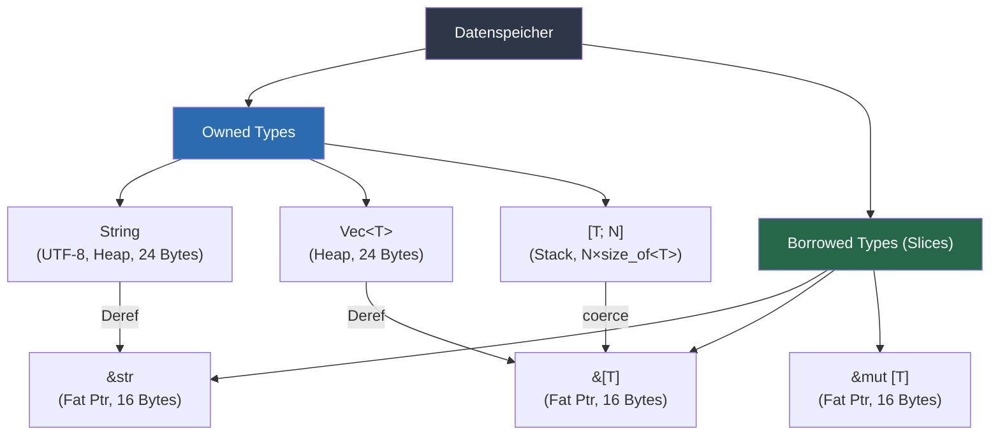
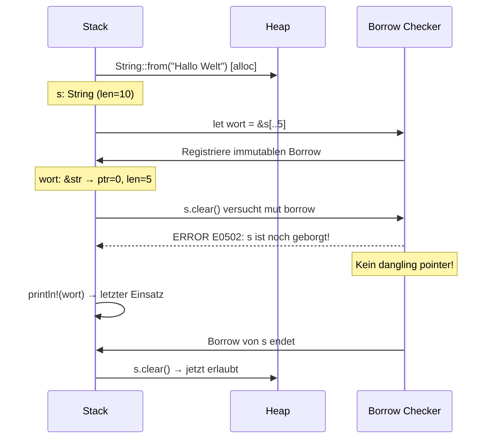

# Kapitel 25 – Der Slice-Typ

> [!IMPORTANT]
> Dieses Kapitel baut auf dem Ownership-Modell (Kapitel 17–20) und dem Borrowing-Konzept (Kapitel 19–20) auf. Stellen Sie sicher, dass Sie diese Grundlagen beherrschen, bevor Sie hier fortfahren.

---

## 1. Lernziele & Lernplan

### Bloom'sche Lernziele

Dieses Kapitel orientiert sich an der überarbeiteten Bloom'schen Taxonomie. Am Ende des Kapitels sollen Sie folgende Kompetenzstufen erreicht haben:

| # | Bloom-Stufe | Lernziel |
|---|-------------|----------|
| 1 | **Verstehen** (Understanding) | Sie können erklären, was ein Slice ist, warum er als *Fat Pointer* implementiert wird und wie er sich von einer gewöhnlichen Referenz unterscheidet. |
| 2 | **Anwenden** (Applying) | Sie können `&str`-, `&[T]`- und `&mut [T]`-Slices korrekt in eigenen Funktionen verwenden, die richtigen Indexierungssyntaxen einsetzen und die wesentlichen Slice-API-Methoden (`len`, `is_empty`, `first`, `last`, `iter`, `contains`, `windows`, `chunks`) aufrufen. |
| 3 | **Analysieren** (Analyzing) | Sie können den Compiler-Fehler E0502 (conflicting borrows) bei ungültigem Slice-Einsatz diagnostizieren, die Ursache in Ownership-Regeln verorten und einen korrekten Lösungsweg ableiten. |
| 4 | **Evaluieren** (Evaluating) | Sie können begründen, wann eine Funktion `&str` statt `&String` und `&[T]` statt `&Vec<T>` als Parameter-Typ annehmen sollte, und diesen Designentscheid mit dem Deref-Koerzionskonzept untermauern. |
| 5 | **Erschaffen** (Creating) | Sie können ein kleines, eigenständiges Rust-Programm schreiben, das Slices nutzt, um Teilbereiche von Daten zu verarbeiten, ohne Eigentumsrechte zu übertragen. |

### Lernplan für dieses Kapitel

```
┌─────────────────────────────────────────────────────────────────┐
│  Empfohlene Bearbeitungszeit: 90–120 Minuten                    │
├─────────────────┬───────────────────────────────────────────────┤
│ 0–15 min        │ Abschnitte 1–3 lesen (Ziele, Definition,     │
│                 │ Motivation)                                   │
├─────────────────┼───────────────────────────────────────────────┤
│ 15–35 min       │ Abschnitte 4–6 aktiv durcharbeiten (naiver   │
│                 │ Versuch, Fehleranalyse, Lösung)               │
├─────────────────┼───────────────────────────────────────────────┤
│ 35–55 min       │ Abschnitt 7 (Tutorial) selbst im Editor      │
│                 │ nachvollziehen                                │
├─────────────────┼───────────────────────────────────────────────┤
│ 55–80 min       │ Abschnitt 8 (Mentale Modelle) studieren,     │
│                 │ ASCII-Diagramme skizzieren                    │
├─────────────────┼───────────────────────────────────────────────┤
│ 80–115 min      │ Abschnitt 9 (Übungen) lösen                  │
├─────────────────┼───────────────────────────────────────────────┤
│ 115–120 min     │ Abschnitt 10 (Merkzettel, Active Recall)     │
└─────────────────┴───────────────────────────────────────────────┘
```

> [!TIP]
> Öffnen Sie während des Lesens ein zweites Terminalfenster mit `cargo new slice_playground` und experimentieren Sie sofort mit den gezeigten Codebeispielen. Lernen durch Ausprobieren verankert den Stoff nachhaltig.

---

## 2. Die Definition – Was ist ein Slice?

### 2.1 Formale Definition

Ein **Slice** ist eine *Referenz auf eine zusammenhängende Teilsequenz* eines Kollektions-Typs. Im Gegensatz zu einer Referenz auf das gesamte Objekt trägt ein Slice zwei Informationsstücke mit sich:

1. **Einen Zeiger** (`ptr`) auf das erste Element der Teilsequenz.
2. **Eine Längenangabe** (`len`), die angibt, wie viele Elemente zur Teilsequenz gehören.

Diese Kombination aus Zeiger und Länge nennt man einen **Fat Pointer** (wörtlich: „dicker Zeiger"), weil er – im Unterschied zu einem einfachen Zeiger, der nur eine Adresse speichert – zwei maschinengroße Felder (je 8 Bytes auf einer 64-Bit-Architektur) belegt und damit insgesamt **16 Bytes** groß ist.

### 2.2 Typsyntax

| Slice-Art | Syntax | Bedeutung |
|-----------|--------|-----------|
| String-Slice (immutabel) | `&str` | Referenz auf einen UTF-8-Bytebreich |
| Array-/Vektor-Slice (immutabel) | `&[T]` | Referenz auf eine Folge von `T`-Werten |
| Mutabler Slice | `&mut [T]` | Mutabler Zugriff auf eine Folge von `T`-Werten |

> [!NOTE]
> `&str` ist im Wesentlichen syntaktischer Zucker für `&[u8]` mit der zusätzlichen Invariante, dass die Bytes valides UTF-8 bilden. Der Typ `str` (ohne `&`) ist ein *unsized type* (DST – Dynamically Sized Type) und kann nicht direkt auf dem Stack gespeichert werden; er wird immer hinter einem Zeiger verwendet.

### 2.3 Slices im Typsystem von Rust

Rust unterscheidet zwischen **Sized**-Typen (Größe zur Kompilierzeit bekannt) und **Dynamically Sized Types** (DST). Slices (`[T]` und `str`) sind DSTs, weil ihre Größe erst zur Laufzeit bekannt ist. Deshalb verwendet man sie stets als Referenzen (`&[T]`, `&str`) oder hinter Smart Pointern (`Box<[T]>`, `Rc<[T]>`).

```rust
// Direkte Verwendung von [T] ist nicht möglich:
// let s: [i32] = [1, 2, 3];  // FEHLER: Größe nicht bekannt

// Slices werden immer als Referenzen verwendet:
let zahlen: &[i32] = &[1, 2, 3];  // OK
```

---

## 3. Das Problem & Die Motivation

### 3.1 Warum brauchen wir Slices überhaupt?

Betrachten wir ein klassisches Problem: Wir haben eine Zeichenkette und wollen das erste Wort darin finden. Ohne Slices müssten wir einen Index zurückgeben – aber dieser Index ist nicht mehr gültig, sobald sich der String ändert.

Stellen Sie sich folgendes Szenario vor:

```rust
fn erstes_wort_index(s: &String) -> usize {
    let bytes = s.as_bytes();
    for (i, &byte) in bytes.iter().enumerate() {
        if byte == b' ' {
            return i;
        }
    }
    s.len()
}
```

Diese Funktion gibt einen `usize`-Index zurück. Auf den ersten Blick scheint das nützlich zu sein. Doch es lauert eine gefährliche Falle:

```rust
fn main() {
    let mut s = String::from("Hallo Welt");
    let wort_ende = erstes_wort_index(&s);  // wort_ende = 5

    s.clear();  // s ist jetzt ""

    // wort_ende = 5, aber s hat keine 5 Zeichen mehr!
    // Der Index ist bedeutungslos geworden.
    println!("Erstes Wort endet bei Index: {}", wort_ende);
}
```

Das Programm kompiliert ohne Fehler und gibt `5` aus – obwohl der String längst leer ist. Der Rückgabewert `5` ist semantisch bedeutungslos geworden. Dies ist ein **logischer Fehler**, der zur Laufzeit zu Panics oder falschen Ergebnissen führen kann.

### 3.2 Das grundlegende Problem

Das Problem ist die **Entkopplung von Daten und Metadaten**:

- Der String `s` und der Index `wort_ende` sind getrennte Variablen.
- Rust kann nicht sicherstellen, dass `wort_ende` ungültig wird, wenn sich `s` verändert.
- Wir haben keinerlei Garantie, dass der Index noch zur aktuellen Version des Strings passt.

Was wir wirklich brauchen, ist eine **an den Lebenszyklus des Strings gebundene Referenz** auf einen Teilbereich. Genau das liefern uns Slices.

### 3.3 Motivation: Slices als Lösung

Ein String-Slice (`&str`) löst dieses Problem elegant:

```rust
fn erstes_wort(s: &str) -> &str {
    let bytes = s.as_bytes();
    for (i, &byte) in bytes.iter().enumerate() {
        if byte == b' ' {
            return &s[..i];
        }
    }
    &s[..]
}
```

Jetzt gibt die Funktion eine **Referenz** auf den Teilbereich des Strings zurück – und diese Referenz ist durch Rusts Borrow-Checker an die Lebensdauer des originalen Strings gebunden. Wenn der String geändert oder freigegeben wird, ist die Referenz automatisch ungültig, und der Compiler meldet einen Fehler.

> [!IMPORTANT]
> Slices lösen das fundamentale Problem der Synchronisation zwischen Positionsinformationen und den zugrundeliegenden Daten. Sie machen es physisch unmöglich, mit einem veralteten „Zeiger in die Daten" zu arbeiten, weil Rusts Borrow-Checker die Gültigkeit erzwingt.

### 3.4 Reale Anwendungsfälle

Slices begegnen Ihnen in der Praxis ständig:

| Anwendungsfall | Slice-Typ | Beispiel |
|----------------|-----------|---------|
| HTTP-Header parsen | `&str` | `"Content-Type: application/json".split(": ")` |
| Bilddaten verarbeiten | `&[u8]` | Pixel-Buffer als Slice übergeben |
| Sortieralgorithmen | `&mut [T]` | `slice.sort()`, `slice.sort_by()` |
| Protokollpuffer | `&[u8]` | Netzwerkdaten deserialisieren |
| Kommandozeilenargumente | `&[String]` | `std::env::args()` |
| Ringpuffer | `windows()` | Gleitender Durchschnitt berechnen |

---

## 4. Der Naive Versuch – Fehlerhafter Code

### 4.1 Versuch 1: Index-Approach mit anschließendem Mutation

Lassen Sie uns den fehlerhaften Ansatz aus Abschnitt 3 noch einmal systematisch untersuchen und schauen, was der Compiler meldet:

```rust
// Datei: src/main.rs (FEHLERHAFT)
fn erstes_wort_index(s: &String) -> usize {
    let bytes = s.as_bytes();
    for (i, &byte) in bytes.iter().enumerate() {
        if byte == b' ' {
            return i;
        }
    }
    s.len()
}

fn main() {
    let mut s = String::from("Hallo Welt");
    let wort_ende = erstes_wort_index(&s);

    s.clear(); // Mutation nach dem Borgen!

    // Wir versuchen, den Index zu nutzen, obwohl s verändert wurde:
    println!("Das erste Wort hat {} Zeichen", wort_ende);
    println!("Der String ist jetzt: '{}'", s);
    println!("s[..wort_ende] wäre: '{}'", &s[..wort_ende]); // Panic!
}
```

Dieser Code **kompiliert**, führt aber zur Laufzeit zu einem Panic (`index out of bounds`), weil `wort_ende` = 5, aber `s.len()` = 0 nach `s.clear()`.

### 4.2 Versuch 2: Slice nach Mutation (Compile-Zeit-Fehler)

Wenn wir nun den Slice-Ansatz nehmen und trotzdem versuchen, danach zu mutieren, greift der Borrow-Checker:

```rust
// Datei: src/main.rs (COMPILE-FEHLER)
fn erstes_wort(s: &str) -> &str {
    let bytes = s.as_bytes();
    for (i, &byte) in bytes.iter().enumerate() {
        if byte == b' ' {
            return &s[..i];
        }
    }
    &s[..]
}

fn main() {
    let mut s = String::from("Hallo Welt");
    let wort = erstes_wort(&s);   // immutabler Borrow von s

    s.clear();                     // FEHLER: s ist noch geborgt!

    println!("Das erste Wort ist: {}", wort);
}
```

### 4.3 Versuch 3: Falsche Slice-Syntax

Ein weiterer häufiger Fehler ist die Verwechslung von Slice-Syntax und Index-Syntax:

```rust
fn main() {
    let v = vec![1, 2, 3, 4, 5];

    // Falsch: Einzelner Index gibt ein Element zurück, kein Slice
    let element = v[2]; // Das ist i32, nicht &[i32]

    // Falsch: Versuch, &usize als Slice zu verwenden
    let start: usize = 1;
    let end: usize = 4;
    // let s = &v[start, end]; // Syntaxfehler!

    // Falsch: Slice ohne & (Compiler-Fehler: unsized type)
    // let s: [i32] = v[1..4]; // FEHLER: [i32] hat unbekannte Größe

    // Richtig:
    let s: &[i32] = &v[1..4]; // Korrekt
    println!("{:?}", s);
}
```

### 4.4 Versuch 4: Mutable Slice gleichzeitig mit immutablem Borrow

```rust
fn main() {
    let mut v = vec![1, 2, 3, 4, 5];

    let erste_haelfte = &v[..3];        // immutabler Borrow

    // FEHLER: Wir können nicht mutabel borgen, wenn bereits
    // ein immutabler Borrow aktiv ist:
    v.push(6);                           // erfordert mutierten Zugriff

    println!("{:?}", erste_haelfte);    // erste_haelfte noch im Scope
}
```

---

## 5. Die Anatomie des Fehlers

### 5.1 Compiler-Output für Versuch 2

Wenn wir den Code aus Abschnitt 4.2 kompilieren (`cargo build`), erhalten wir folgenden Fehler:

```
error[E0502]: cannot borrow `s` as mutable because it is also borrowed as immutable
  --> src/main.rs:15:5
   |
13 |     let wort = erstes_wort(&s);
   |                             -- immutable borrow occurs here
14 |
15 |     s.clear();
   |     ^^^^^^^^^ mutable borrow occurs here
16 |
17 |     println!("Das erste Wort ist: {}", wort);
   |                                        ---- immutable borrow later used here
   |
   = note: `String::clear` requires a mutable reference to `self`

For more information about this error, try `rustc --explain E0502`.
```

#### Interpretation des Fehlers

Der Compiler sagt uns präzise:
1. **Zeile 13**: `&s` – hier beginnt ein *immutabler Borrow* von `s`. Der Rückgabewert `wort` ist eine Referenz, die auf denselben Speicher zeigt wie `s`.
2. **Zeile 15**: `s.clear()` – `clear()` benötigt einen *mutierbaren Borrow* (`&mut self`). Das ist unmöglich, weil ein immutabler Borrow noch aktiv ist.
3. **Zeile 17**: Der immutablere Borrow wird erst hier (beim `println!`) beendet.

### 5.2 Compiler-Output für Versuch 4

```
error[E0502]: cannot borrow `v` as mutable because it is also borrowed as immutable
  --> src/main.rs:6:5
   |
4  |     let erste_haelfte = &v[..3];
   |                          ^ immutable borrow occurs here
5  |
6  |     v.push(6);
   |     ^^^^^^^^^ mutable borrow occurs here
7  |
8  |     println!("{:?}", erste_haelfte);
   |                      ------------- immutable borrow later used here
```

### 5.3 ASCII-Speicherdiagramme

#### Diagramm 1: Fat Pointer – Aufbau eines &str-Slices

```
String "Hallo Welt" auf dem Heap:
                                                          
  Stack                    Heap                          
  ┌──────────────┐         ┌───┬───┬───┬───┬───┬───┬───┬───┬───┬───┐
  │  s (String)  │         │ H │ a │ l │ l │ o │   │ W │ e │ l │ t │
  │  ┌──────────┐│         └───┴───┴───┴───┴───┴───┴───┴───┴───┴───┘
  │  │ ptr ─────┼┼─────────►  0   1   2   3   4   5   6   7   8   9
  │  │ len = 10 ││         
  │  │ cap = 10 ││         
  │  └──────────┘│         
  └──────────────┘         
                           
  &str "Hallo" (wort):     
  ┌──────────────┐         
  │  Fat Pointer │         
  │  ┌──────────┐│         
  │  │ ptr ─────┼┼─────────► Adresse von H (Index 0)
  │  │ len = 5  ││             
  │  └──────────┘│         
  └──────────────┘         
  Größe: 16 Bytes          
  (2 × 8 Bytes auf 64-Bit) 

  Heap-Bytes:              
  ┌───┬───┬───┬───┬───┐    
  │ H │ a │ l │ l │ o │   ← ptr zeigt hier hin, len = 5
  └───┴───┴───┴───┴───┘    
    0   1   2   3   4      
```

#### Diagramm 2: &[i32]-Slice auf einem Vektor

```
Vec<i32>  [10, 20, 30, 40, 50]  auf dem Heap:

  Stack                    Heap
  ┌──────────────┐         ┌────┬────┬────┬────┬────┐
  │  v (Vec)     │         │ 10 │ 20 │ 30 │ 40 │ 50 │
  │  ┌──────────┐│         └────┴────┴────┴────┴────┘
  │  │ ptr ─────┼┼──────────► 0    1    2    3    4
  │  │ len = 5  ││         
  │  │ cap = 5  ││         
  │  └──────────┘│         
  └──────────────┘         
                           
  &[i32] für &v[1..4]:     
  ┌──────────────┐         
  │  Fat Pointer │         
  │  ┌──────────┐│         
  │  │ ptr ─────┼┼──────────► Adresse von 20 (Index 1)
  │  │ len = 3  ││             
  │  └──────────┘│         
  └──────────────┘         
  Größe: 16 Bytes          

  Die referenzierten Heap-Daten:
  ┌────┬────┬────┐
  │ 20 │ 30 │ 40 │  ← ptr zeigt auf 20, len = 3
  └────┴────┴────┘
    1    2    3   (originale Indizes)
```

#### Diagramm 3: Vergleich Owned vs. Borrowed

```
  String (owned):          &str (borrowed):
  ┌─────────────────┐      ┌──────────────┐
  │  ptr  ──────────┼─┐    │  ptr  ───────┼─┐
  │  len  = N       │ │    │  len  = M    │ │
  │  cap  = C       │ │    └──────────────┘ │
  └─────────────────┘ │    16 Bytes         │
  24 Bytes             │                    │
                       ▼                    ▼
                   ┌───────────────────────────────┐
                   │  H  e  l  l  o     W  e  l  t │  Heap
                   └───────────────────────────────┘
                   ▲                    ▲
                   │                    │
                   └── String owns all  └── &str borrows part/all
```

### 5.4 Warum schützt der Borrow-Checker uns hier?

Der Borrow-Checker implementiert folgende Invariante:

> **Borrows dürfen nicht die Daten, auf die sie verweisen, ungültig machen.**

`s.clear()` würde den Heap-Speicher des Strings freigeben oder umschreiben. Würde dieser Aufruf erlaubt sein, während `wort` noch auf denselben Speicher zeigt, hätten wir eine **dangling reference** – einen Zeiger auf ungültigen Speicher. Rust verhindert dies zur Kompilierzeit, bevor das Programm überhaupt läuft.

---

## 6. Die Lösung – Korrekter Code

### 6.1 String-Slices korrekt verwenden

```rust
fn erstes_wort(s: &str) -> &str {
    let bytes = s.as_bytes();

    for (i, &byte) in bytes.iter().enumerate() {
        if byte == b' ' {
            return &s[..i];  // Slice von Anfang bis zum Leerzeichen
        }
    }

    &s[..]  // Ganzer String als Slice
}

fn main() {
    let s = String::from("Hallo Welt");

    // Wir können &String übergeben, Deref-Koercion wandelt &String -> &str
    let wort = erstes_wort(&s);
    println!("Das erste Wort ist: '{}'", wort);

    // Mit String-Literal direkt:
    let literal = "Rust ist toll";
    let wort2 = erstes_wort(literal);
    println!("Das erste Wort ist: '{}'", wort2);
}
```

**Ausgabe:**
```
Das erste Wort ist: 'Hallo'
Das erste Wort ist: 'Rust'
```

### 6.2 Der Borrow-Checker schützt uns automatisch

Wenn wir jetzt versuchen, den String zu mutieren, während der Slice noch aktiv ist, meldet der Compiler einen Fehler:

```rust
fn main() {
    let mut s = String::from("Hallo Welt");
    let wort = erstes_wort(&s);

    // s.clear(); // COMPILE-FEHLER – Compiler schützt uns!

    // Der Slice ist hier noch gültig:
    println!("Das erste Wort ist: '{}'", wort);

    // NACH dem letzten Einsatz von wort darf s mutiert werden:
    s.clear();  // Jetzt ist das OK!
    println!("String ist jetzt leer: '{}'", s);
}
```

### 6.3 Die gesamte Slice-Indexierungssyntax

```rust
fn main() {
    let s = String::from("Hallo, Welt!");

    // [start..end] – von Index start (inklusiv) bis end (exklusiv)
    let hallo = &s[0..5];    // "Hallo"
    let welt  = &s[7..11];   // "Welt"

    // [..end] – von Anfang bis end (exklusiv)
    let von_anfang = &s[..5]; // "Hallo"

    // [start..] – von start bis Ende (inklusiv)
    let bis_ende = &s[7..];   // "Welt!"

    // [..] – der gesamte String als Slice
    let alles = &s[..];       // "Hallo, Welt!"

    println!("hallo:      '{}'", hallo);
    println!("welt:       '{}'", welt);
    println!("von_anfang: '{}'", von_anfang);
    println!("bis_ende:   '{}'", bis_ende);
    println!("alles:      '{}'", alles);
}
```

**Ausgabe:**
```
hallo:      'Hallo'
welt:       'Welt'
von_anfang: 'Hallo'
bis_ende:   'Welt!'
alles:      'Hallo, Welt!'
```

> [!WARNING]
> Bei UTF-8-Strings müssen Slice-Grenzen immer auf gültigen **Zeichen-Grenzen** (character boundaries) liegen! Das Slicen mitten in ein Multibyte-Zeichen (z. B. ein Emoji oder Umlaute wie `ä`, `ö`, `ü`) führt zur Laufzeit zu einem Panic. Verwenden Sie `str::char_indices()` oder die `unicode-segmentation`-Crate für sicheres Slicen in mehrsprachigen Texten.

```rust
fn main() {
    let s = "Hällö";

    // 'H' ist 1 Byte, 'ä' ist 2 Bytes (UTF-8: 0xC3 0xA4)
    // let falsch = &s[1..2]; // PANIC: nicht auf Zeichengrenze!
    let richtig = &s[0..1]; // "H" – korrekt, 'H' ist genau 1 Byte
    println!("{}", richtig);
}
```

### 6.4 Array- und Vektor-Slices

```rust
fn main() {
    // Array-Slice:
    let arr = [10, 20, 30, 40, 50];
    let arr_slice: &[i32] = &arr[1..4];
    println!("Array-Slice: {:?}", arr_slice); // [20, 30, 40]

    // Vektor-Slice:
    let v = vec![1.0f64, 2.0, 3.0, 4.0, 5.0];
    let v_slice: &[f64] = &v[2..];
    println!("Vektor-Slice: {:?}", v_slice); // [3.0, 4.0, 5.0]

    // Ganzer Array als Slice:
    let alles: &[i32] = &arr[..];
    println!("Alles: {:?}", alles); // [10, 20, 30, 40, 50]
}
```

### 6.5 Mutable Slices

```rust
fn verdopple(slice: &mut [i32]) {
    for wert in slice.iter_mut() {
        *wert *= 2;
    }
}

fn main() {
    let mut v = vec![1, 2, 3, 4, 5];
    println!("Vorher: {:?}", v);

    // Mutierbarer Slice auf die ersten 3 Elemente:
    verdopple(&mut v[..3]);
    println!("Nachher (erste 3 verdoppelt): {:?}", v);

    // Ganzer Vektor als mutierbarer Slice:
    verdopple(&mut v[..]);
    println!("Nachher (alle verdoppelt): {:?}", v);
}
```

**Ausgabe:**
```
Vorher: [1, 2, 3, 4, 5]
Nachher (erste 3 verdoppelt): [2, 4, 6, 4, 5]
Nachher (alle verdoppelt): [4, 8, 12, 8, 10]
```

---

## 7. Kleines Tutorial – Schritt für Schritt

### Schritt 1: Neues Projekt erstellen

Öffnen Sie ein Terminal und erstellen Sie ein neues Rust-Projekt:

```bash
cargo new slice_tutorial
cd slice_tutorial
```

Öffnen Sie `src/main.rs` in Ihrem Editor.

### Schritt 2: Grundlegende Slice-Operationen

Ersetzen Sie den Inhalt von `src/main.rs` mit:

```rust
fn main() {
    // ── 2a: String-Slices ─────────────────────────────────────────
    let volltext = String::from("Rust macht Spaß!");

    let erstes_wort = &volltext[..4];    // "Rust"
    let zweites_wort = &volltext[5..10]; // "macht"
    let letztes_wort = &volltext[11..];  // "Spaß!"

    println!("Voltext:       '{}'", volltext);
    println!("Erstes Wort:   '{}'", erstes_wort);
    println!("Zweites Wort:  '{}'", zweites_wort);
    println!("Letztes Wort:  '{}'", letztes_wort);

    // ── 2b: Slice-Länge prüfen ────────────────────────────────────
    println!("\nLänge von '{}': {} Bytes", erstes_wort, erstes_wort.len());
    println!("Ist leer? {}", erstes_wort.is_empty());
    println!("Ist leer? {}", "".is_empty());

    // ── 2c: Array-Slices ──────────────────────────────────────────
    let temperaturen: [f64; 7] = [18.5, 22.1, 19.8, 25.3, 23.0, 17.2, 20.9];
    let wochenmitte: &[f64] = &temperaturen[2..5];

    println!("\nWochenmitte Temperaturen: {:?}", wochenmitte);
    println!("Anzahl Tage: {}", wochenmitte.len());
}
```

Führen Sie das Programm aus:
```bash
cargo run
```

**Erwartete Ausgabe:**
```
Voltext:       'Rust macht Spaß!'
Erstes Wort:   'Rust'
Zweites Wort:  'macht'
Letztes Wort:  'Spaß!'

Länge von 'Rust': 4 Bytes
Ist leer? false
Ist leer? true

Wochenmitte Temperaturen: [19.8, 25.3, 23.0]
Anzahl Tage: 3
```

### Schritt 3: Funktionen mit Slice-Parametern

Ergänzen Sie `src/main.rs`:

```rust
// Berechnet den Durchschnitt eines f64-Slices
fn durchschnitt(werte: &[f64]) -> f64 {
    if werte.is_empty() {
        return 0.0;
    }
    let summe: f64 = werte.iter().sum();
    summe / werte.len() as f64
}

// Findet das Maximum in einem i32-Slice
fn maximum(liste: &[i32]) -> Option<&i32> {
    liste.iter().max()
}

// Gibt das erste und letzte Element zurück
fn eckwerte<T>(slice: &[T]) -> Option<(&T, &T)> {
    match (slice.first(), slice.last()) {
        (Some(erste), Some(letzte)) => Some((erste, letzte)),
        _ => None,
    }
}

fn main() {
    let temperaturen = vec![18.5, 22.1, 19.8, 25.3, 23.0];

    // Funktionen akzeptieren sowohl &Vec<f64> als auch &[f64]
    println!("Durchschnitt: {:.2}°C", durchschnitt(&temperaturen));
    println!("Durchschnitt (Teilbereich): {:.2}°C",
             durchschnitt(&temperaturen[1..4]));

    let zahlen = vec![3, 7, 2, 9, 1, 5];
    match maximum(&zahlen) {
        Some(max) => println!("Maximum: {}", max),
        None => println!("Keine Zahlen vorhanden"),
    }

    match eckwerte(&zahlen) {
        Some((erste, letzte)) => println!("Erste: {}, Letzte: {}", erste, letzte),
        None => println!("Slice ist leer"),
    }
}
```

### Schritt 4: Die wichtigsten Slice-API-Methoden

```rust
fn slice_api_demo() {
    let v = vec![10i32, 20, 30, 40, 50, 60, 70];
    let s: &[i32] = &v;

    // ── len() und is_empty() ───────────────────────────────────────
    println!("len(): {}", s.len());
    println!("is_empty(): {}", s.is_empty());

    // ── first() und last() ────────────────────────────────────────
    println!("first(): {:?}", s.first()); // Some(10)
    println!("last():  {:?}", s.last());  // Some(70)

    // ── contains() ───────────────────────────────────────────────
    println!("contains(30): {}", s.contains(&30));  // true
    println!("contains(99): {}", s.contains(&99));  // false

    // ── iter() – über alle Elemente iterieren ─────────────────────
    print!("Elemente: ");
    for &elem in s.iter() {
        print!("{} ", elem);
    }
    println!();

    // ── windows(n) – gleitendes Fenster der Breite n ─────────────
    println!("\nFenster der Breite 3:");
    for fenster in s.windows(3) {
        println!("  {:?}", fenster);
    }

    // ── chunks(n) – nicht-überlappende Blöcke der Größe n ─────────
    println!("\nBlöcke der Größe 2:");
    for block in s.chunks(2) {
        println!("  {:?}", block);
    }

    // ── split_at() – aufteilen an einem Index ─────────────────────
    let (links, rechts) = s.split_at(3);
    println!("\nLinks:  {:?}", links);  // [10, 20, 30]
    println!("Rechts: {:?}", rechts); // [40, 50, 60, 70]

    // ── get() – sicherer Zugriff ──────────────────────────────────
    println!("\nget(2): {:?}", s.get(2));   // Some(30)
    println!("get(99): {:?}", s.get(99)); // None (kein Panic!)
}

fn main() {
    slice_api_demo();
}
```

### Schritt 5: Mutable Slices in der Praxis

```rust
fn sortiere_und_berichte(daten: &mut [i32]) {
    println!("Vorher: {:?}", daten);
    daten.sort();
    println!("Sortiert: {:?}", daten);

    // Wende Transformation auf ersten Teil an
    if daten.len() >= 3 {
        let erste_drei = &mut daten[..3];
        for x in erste_drei.iter_mut() {
            *x *= 10;
        }
    }

    println!("Nach Transformation: {:?}", daten);
}

fn main() {
    let mut zahlen = vec![42, 7, 19, 3, 88, 15, 27];
    sortiere_und_berichte(&mut zahlen);
}
```

**Ausgabe:**
```
Vorher: [42, 7, 19, 3, 88, 15, 27]
Sortiert: [3, 7, 15, 19, 27, 42, 88]
Nach Transformation: [30, 70, 150, 19, 27, 42, 88]
```

---

## 8. Mentale Modelle & Deep Dive

### 8.1 Das Fenster-Modell

Das intuitivste mentale Modell für Slices ist das eines **transparenten Fensters** auf einen Datenspeicher:

```
┌──────────────────────────────────────────────────────────┐
│          Originaldaten (String / Array / Vec)            │
│                                                          │
│   [H][a][l][l][o][,][ ][W][e][l][t][!]                 │
│    0   1   2   3   4   5   6   7   8   9  10  11        │
└──────────────────────────────────────────────────────────┘
             ↑                         ↑
             │   ┌──────────────────┐  │
             │   │      Fenster     │  │
             │   │  (kein Besitz,   │  │
             └───┤   nur Sicht!)    ├──┘
                 │   &s[0..5]       │
                 │   ptr → Index 0  │
                 │   len = 5        │
                 └──────────────────┘

Das Fenster...
  ✓ zeigt Daten, ohne sie zu kopieren
  ✓ hat eine feste Startposition und Länge
  ✓ kann nicht länger als die Originaldaten existieren
  ✗ besitzt die Daten NICHT (kein drop, kein free)
  ✗ kann die Daten nicht verschieben
```

### 8.2 Slice vs. Referenz vs. Owned – Das Dreieck

```
┌──────────────────────────────────────────────────────────┐
│               Das Ownership-Dreieck                      │
│                                                          │
│         String / Vec<T> / Array                          │
│              (OWNED DATA)                                │
│         ┌────────────────────┐                           │
│         │ • Besitzt Daten    │                           │
│         │ • drop() gibt frei │                           │
│         │ • 24 Bytes (Stack) │                           │
│         │   + Heap-Speicher  │                           │
│         └────────┬───────────┘                           │
│                  │ kann geborgt werden als               │
│         ┌────────▼───────────┐                           │
│         │ &str / &[T] / &T   │                           │
│         │   (SLICE / REF)    │                           │
│         │ • Besitzt nichts   │                           │
│         │ • 16 Bytes (Slice) │                           │
│         │   oder 8 Bytes (T) │                           │
│         │ • Lebensdauer      │                           │
│         │   begrenzt durch   │                           │
│         │   Originaldaten    │                           │
│         └────────────────────┘                           │
└──────────────────────────────────────────────────────────┘
```

### 8.3 Die Deref-Koercion in Aktion

Rusts Typsystem erlaubt automatische Konvertierungen über den `Deref`-Trait:

```
&String  ──Deref──►  &str
&Vec<T>  ──Deref──►  &[T]
&Box<T>  ──Deref──►  &T
```

Diese **Deref-Koercion** bedeutet praktisch:

```rust
fn drucke_laenge(s: &str) {
    println!("Länge: {}", s.len());
}

fn main() {
    let owned = String::from("Hallo");
    let literal = "Welt";
    let boxed = Box::new(String::from("Boxed"));

    // Alle drei funktionieren dank Deref-Koercion:
    drucke_laenge(&owned);    // &String → &str automatisch
    drucke_laenge(literal);   // &str bleibt &str
    drucke_laenge(&boxed);    // &Box<String> → &String → &str
}
```

Der Compiler führt diese Konvertierungen **automatisch** und **ohne Laufzeit-Overhead** durch (zero-cost abstraction).

### 8.4 Mermaid-Diagramm: Slice-Typen-Hierarchie



### 8.5 Mermaid-Diagramm: Borrow-Checker und Slice-Lebensdauern



### 8.6 &str vs. &String – Wann was verwenden?

Dies ist eine der meistgestellten Fragen von Rust-Anfängern. Die Antwort ist fast immer:

> **Verwenden Sie `&str` als Funktionsparameter, nicht `&String`.**

**Warum?**

```rust
// SCHLECHTER Stil – unnötig einschränkend:
fn begrüsse_schlecht(name: &String) {
    println!("Hallo, {}!", name);
}

// GUTER Stil – flexibel und idiomatic:
fn begrüsse_gut(name: &str) {
    println!("Hallo, {}!", name);
}

fn main() {
    let owned = String::from("Anna");
    let literal = "Bob";

    begrüsse_schlecht(&owned);     // Funktioniert
    // begrüsse_schlecht(literal); // FEHLER: &str ≠ &String

    begrüsse_gut(&owned);          // Funktioniert (Deref-Koercion)
    begrüsse_gut(literal);         // Funktioniert direkt
    begrüsse_gut(&owned[..2]);     // Funktioniert – Slice eines Teils
}
```

**Die Regel:**

| Parametertyp | Akzeptiert | Empfehlung |
|-------------|-----------|------------|
| `&String` | nur `&String` | ❌ Meide dies |
| `&str` | `&String` (Deref), `&str`, String-Literale | ✅ Bevorzuge dies |
| `&Vec<T>` | nur `&Vec<T>` | ❌ Meide dies |
| `&[T]` | `&Vec<T>` (Deref), `&[T]`, Array-Refs | ✅ Bevorzuge dies |

### 8.7 Die windows()-Methode – Gleitende Fenster

Die `windows(n)`-Methode ist besonders nützlich für Zeitreihen und Signalverarbeitung:

```rust
fn gleitender_durchschnitt(daten: &[f64], fenstergroesse: usize) -> Vec<f64> {
    daten
        .windows(fenstergroesse)
        .map(|fenster| {
            fenster.iter().sum::<f64>() / fenstergroesse as f64
        })
        .collect()
}

fn main() {
    let aktienkurse = vec![100.0, 105.0, 98.0, 110.0, 107.0, 112.0, 115.0];

    let ma3 = gleitender_durchschnitt(&aktienkurse, 3);
    println!("3-Tages-Durchschnitt: {:?}", ma3);
    // [101.0, 104.33, 105.0, 109.67, 111.33]
}
```

```
Datenpunkte:    100  105   98  110  107  112  115
                 ├────┤
                 Fenster 1: [100, 105,  98] → 101.0
                      ├────┤
                      Fenster 2: [105,  98, 110] → 104.33
                           ├────┤
                           Fenster 3: [ 98, 110, 107] → 105.0
```

### 8.8 Die chunks()-Methode – Batch-Verarbeitung

```rust
fn verarbeite_in_batches(daten: &[u32], batch_groesse: usize) {
    for (i, batch) in daten.chunks(batch_groesse).enumerate() {
        let summe: u32 = batch.iter().sum();
        println!("Batch {}: {:?} → Summe: {}", i + 1, batch, summe);
    }
}

fn main() {
    let daten: Vec<u32> = (1..=10).collect();
    verarbeite_in_batches(&daten, 3);
}
```

**Ausgabe:**
```
Batch 1: [1, 2, 3] → Summe: 6
Batch 2: [4, 5, 6] → Summe: 15
Batch 3: [7, 8, 9] → Summe: 24
Batch 4: [10] → Summe: 10
```

> [!NOTE]
> Der letzte Batch kann kleiner als `batch_groesse` sein, wenn die Datenmenge nicht durch die Batch-Größe teilbar ist. Das ist das beabsichtigte Verhalten von `chunks()`.

### 8.9 Slice-Operationen auf Strings: Die wichtigsten str-Methoden

Da `&str` ein Slice-Typ ist, stehen ihm viele nützliche Methoden zur Verfügung:

```rust
fn string_slice_methoden() {
    let text = "  Rust ist toll!  ";

    // ── Bereinigung ───────────────────────────────────────────────
    let bereinigt = text.trim();
    println!("trim(): '{}'", bereinigt);             // "Rust ist toll!"

    let links = text.trim_start();
    println!("trim_start(): '{}'", links);           // "Rust ist toll!  "

    // ── Prüfmethoden ──────────────────────────────────────────────
    println!("starts_with('  Rust'): {}", text.starts_with("  Rust"));  // true
    println!("ends_with('!!'):       {}", text.ends_with("!!"));        // false
    println!("contains('ist'):       {}", text.contains("ist"));        // true

    // ── Suchen ────────────────────────────────────────────────────
    println!("find('i'):    {:?}", bereinigt.find('i'));         // Some(5)
    println!("rfind('t'):   {:?}", bereinigt.rfind('t'));        // Some(13)

    // ── Aufteilen ─────────────────────────────────────────────────
    let woerter: Vec<&str> = bereinigt.split(' ').collect();
    println!("split(' '): {:?}", woerter); // ["Rust", "ist", "toll!"]

    let teile: Vec<&str> = bereinigt.splitn(2, ' ').collect();
    println!("splitn(2): {:?}", teile);    // ["Rust", "ist toll!"]

    // ── Konvertierung ─────────────────────────────────────────────
    println!("to_uppercase(): '{}'", bereinigt.to_uppercase());
    println!("to_lowercase(): '{}'", bereinigt.to_lowercase());

    // ── Ersetzen ──────────────────────────────────────────────────
    let ersetzt = bereinigt.replace("toll", "fantastisch");
    println!("replace(): '{}'", ersetzt);
}

fn main() {
    string_slice_methoden();
}
```

### 8.10 Tiefenblick: Wie Rust Slice-Grenzen prüft

In der Debug-Build prüft Rust Slice-Zugangsgrenzen zur Laufzeit. In einem Release-Build (`--release`) gibt es Optimierungen, aber der Compiler beweist oft statisch, dass Grenzen nicht überschritten werden:

```rust
fn main() {
    let v = vec![1, 2, 3];

    // Sicherer Zugriff mit get():
    match v.get(10) {
        Some(wert) => println!("Wert: {}", wert),
        None => println!("Index außerhalb der Grenzen – kein Panic!"),
    }

    // Direkter Zugriff – Panic bei ungültigem Index:
    // let x = v[10]; // thread 'main' panicked at 'index out of bounds'

    // Sicherer Slice-Zugriff mit get():
    match v.get(0..2) {
        Some(slice) => println!("Slice: {:?}", slice),
        None => println!("Ungültiger Bereich"),
    }
}
```

> [!TIP]
> Verwenden Sie `slice.get(index)` und `slice.get(start..end)` in Code, der externe (unvertrauenswürdige) Indizes verarbeitet. Diese Methoden geben `Option<&T>` bzw. `Option<&[T]>` zurück, anstatt zu paniken.

---

## 9. Drei Übungen

### Übung 1 (Leicht): Wortanzahl zählen

**Aufgabe:** Schreiben Sie eine Funktion `wort_anzahl(text: &str) -> usize`, die die Anzahl der Wörter in einem Text zählt. Wörter sind durch Leerzeichen getrennt. Führende und abschließende Leerzeichen sollen ignoriert werden.

**Hinweise (Hints):**
- Verwenden Sie `.trim()` um führende/abschließende Leerzeichen zu entfernen.
- `str::split_whitespace()` teilt einen String an beliebigen Whitespace-Zeichen auf.
- `.count()` auf einem Iterator gibt die Anzahl der Elemente zurück.

**Musterlösung:**

```rust
fn wort_anzahl(text: &str) -> usize {
    text.trim().split_whitespace().count()
}

fn wort_anzahl_detail(text: &str) -> Vec<&str> {
    text.trim().split_whitespace().collect()
}

fn main() {
    let test1 = "Rust ist eine tolle Sprache";
    let test2 = "  Hallo   Welt  ";
    let test3 = "";
    let test4 = "   ";

    println!("'{}': {} Wörter", test1, wort_anzahl(test1)); // 5
    println!("'{}': {} Wörter", test2, wort_anzahl(test2)); // 2
    println!("'{}': {} Wörter", test3, wort_anzahl(test3)); // 0
    println!("'{}': {} Wörter", test4, wort_anzahl(test4)); // 0

    println!("\nWörter in '{}': {:?}", test1, wort_anzahl_detail(test1));
}
```

**Erwartete Ausgabe:**
```
'Rust ist eine tolle Sprache': 5 Wörter
'  Hallo   Welt  ': 2 Wörter
'': 0 Wörter
'   ': 0 Wörter

Wörter in 'Rust ist eine tolle Sprache': ["Rust", "ist", "eine", "tolle", "Sprache"]
```

---

### Übung 2 (Mittel): Gleitender Durchschnitt und Anomalie-Detektion

**Aufgabe:** Schreiben Sie zwei Funktionen:
1. `gleitender_avg(daten: &[f64], n: usize) -> Vec<f64>`: Berechnet den gleitenden Durchschnitt mit Fenstergröße `n`.
2. `finde_anomalien(daten: &[f64], schwellwert: f64) -> Vec<usize>`: Gibt die Indizes aller Werte zurück, die mehr als `schwellwert` vom Gesamtdurchschnitt abweichen.

**Hinweise (Hints):**
- Verwenden Sie `windows(n)` für den gleitenden Durchschnitt.
- Für Anomalien: Berechnen Sie zunächst den Gesamtdurchschnitt mit `iter().sum::<f64>() / len`.
- `enumerate()` auf einem Iterator liefert `(index, &wert)`.
- `(wert - avg).abs()` berechnet den absoluten Abstand.

**Musterlösung:**

```rust
fn gleitender_avg(daten: &[f64], n: usize) -> Vec<f64> {
    if n == 0 || n > daten.len() {
        return Vec::new();
    }
    daten
        .windows(n)
        .map(|fenster| fenster.iter().sum::<f64>() / n as f64)
        .collect()
}

fn finde_anomalien(daten: &[f64], schwellwert: f64) -> Vec<usize> {
    if daten.is_empty() {
        return Vec::new();
    }
    let avg = daten.iter().sum::<f64>() / daten.len() as f64;
    daten
        .iter()
        .enumerate()
        .filter(|(_, &wert)| (wert - avg).abs() > schwellwert)
        .map(|(i, _)| i)
        .collect()
}

fn main() {
    let sensordaten = vec![
        23.1, 22.9, 23.5, 22.8, 45.7, // <- Anomalie bei Index 4!
        23.2, 22.7, 23.0, 23.3, 22.6,
        22.8, 23.1, 23.4, 22.9, 65.2, // <- Anomalie bei Index 14!
    ];

    println!("Sensordaten: {:?}", sensordaten);

    let ma3 = gleitender_avg(&sensordaten, 3);
    println!("\nGleitender 3er-Durchschnitt:");
    for (i, avg) in ma3.iter().enumerate() {
        println!("  Position {}: {:.2}", i + 1, avg);
    }

    let anomalien = finde_anomalien(&sensordaten, 5.0);
    println!("\nAnomalien (Abweichung > 5.0°C) an Indizes: {:?}", anomalien);

    for idx in &anomalien {
        println!("  Index {}: {:.1}°C", idx, sensordaten[*idx]);
    }
}
```

**Erwartete Ausgabe (gekürzt):**
```
Anomalien (Abweichung > 5.0°C) an Indizes: [4, 14]
  Index 4: 45.7°C
  Index 14: 65.2°C
```

---

### Übung 3 (Schwer): Text-Parser mit Slice-Iteratoren

**Aufgabe:** Implementieren Sie einen einfachen CSV-ähnlichen Parser, der:
1. Eine Zeile als `&str` entgegennimmt.
2. Die Felder anhand von Kommas aufteilt.
3. Führende/abschließende Leerzeichen aus jedem Feld entfernt.
4. Leere Felder herausfiltert.
5. Eine Funktion `parsen_und_summieren(csv_zeile: &str) -> Option<f64>` implementiert, die versucht, alle numerischen Felder zu summieren. Wenn ein Feld keine Zahl ist, soll es übersprungen werden.

**Bonus:** Implementieren Sie eine Funktion `transponiere_csv(zeilen: &[&str]) -> Vec<Vec<&str>>`, die eine CSV-Tabelle transponiert (Zeilen und Spalten tauschen).

**Hinweise (Hints):**
- `str::split(',')` teilt an Kommas.
- `.map(|f| f.trim())` entfernt Whitespace.
- `.filter(|f| !f.is_empty())` filtert leere Felder.
- `str::parse::<f64>()` versucht, einen `&str` in `f64` zu konvertieren und gibt `Result<f64, _>`.
- `filter_map(|f| f.parse::<f64>().ok())` kombiniert filtern und parsen.
- Für `transponiere_csv`: Bestimmen Sie zuerst die maximale Spaltenanzahl, dann iterieren Sie über Spaltenindizes.

**Musterlösung:**

```rust
fn parse_felder(zeile: &str) -> Vec<&str> {
    zeile
        .split(',')
        .map(|f| f.trim())
        .filter(|f| !f.is_empty())
        .collect()
}

fn parsen_und_summieren(csv_zeile: &str) -> Option<f64> {
    let zahlen: Vec<f64> = csv_zeile
        .split(',')
        .map(|f| f.trim())
        .filter(|f| !f.is_empty())
        .filter_map(|f| f.parse::<f64>().ok())
        .collect();

    if zahlen.is_empty() {
        None
    } else {
        Some(zahlen.iter().sum())
    }
}

fn transponiere_csv<'a>(zeilen: &[&'a str]) -> Vec<Vec<&'a str>> {
    if zeilen.is_empty() {
        return Vec::new();
    }

    // Alle Zeilen in Felder aufteilen
    let aufgeteilt: Vec<Vec<&str>> = zeilen
        .iter()
        .map(|zeile| parse_felder(zeile))
        .collect();

    // Maximale Spaltenanzahl bestimmen
    let max_spalten = aufgeteilt.iter().map(|r| r.len()).max().unwrap_or(0);

    // Transponieren
    (0..max_spalten)
        .map(|spalte_idx| {
            aufgeteilt
                .iter()
                .filter_map(|zeile| zeile.get(spalte_idx).copied())
                .collect()
        })
        .collect()
}

fn main() {
    // ── Grundlegendes Parsen ──────────────────────────────────────
    let csv1 = " Name , Alter , Stadt ";
    let csv2 = " 3.14 , 2.71 , 1.41 , ungültig , 0.57";
    let csv3 = " , , , "; // Nur Leerfelder

    println!("Zeile 1 Felder: {:?}", parse_felder(csv1));
    println!("Zeile 2 Felder: {:?}", parse_felder(csv2));
    println!("Zeile 3 Felder: {:?}", parse_felder(csv3));

    // ── Numerisches Summieren ─────────────────────────────────────
    println!("\nSumme von '{}':", csv2.trim());
    match parsen_und_summieren(csv2) {
        Some(summe) => println!("  = {:.2}", summe),
        None => println!("  Keine numerischen Felder gefunden"),
    }

    match parsen_und_summieren(csv1) {
        Some(summe) => println!("Summe von csv1: {:.2}", summe),
        None => println!("Keine Zahlen in csv1"),
    }

    // ── Transponieren ─────────────────────────────────────────────
    let tabelle = [
        "Alice, 30, Berlin",
        "Bob,   25, Hamburg",
        "Carol, 35, München",
    ];

    println!("\nOriginal-Tabelle:");
    for zeile in &tabelle {
        println!("  {:?}", parse_felder(zeile));
    }

    let transponiert = transponiere_csv(&tabelle);
    println!("\nTransponierte Tabelle (Spalten → Zeilen):");
    let spalten_namen = ["Namen", "Alter", "Städte"];
    for (i, spalte) in transponiert.iter().enumerate() {
        let name = spalten_namen.get(i).unwrap_or(&"Spalte");
        println!("  {}: {:?}", name, spalte);
    }
}
```

**Erwartete Ausgabe:**
```
Zeile 1 Felder: ["Name", "Alter", "Stadt"]
Zeile 2 Felder: ["3.14", "2.71", "1.41", "ungültig", "0.57"]
Zeile 3 Felder: []

Summe von ' 3.14 , 2.71 , 1.41 , ungültig , 0.57':
  = 7.83

Keine Zahlen in csv1

Original-Tabelle:
  ["Alice", "30", "Berlin"]
  ["Bob", "25", "Hamburg"]
  ["Carol", "35", "München"]

Transponierte Tabelle (Spalten → Zeilen):
  Namen: ["Alice", "Bob", "Carol"]
  Alter: ["30", "25", "35"]
  Städte: ["Berlin", "Hamburg", "München"]
```

> [!CAUTION]
> Die `transponiere_csv`-Funktion enthält Lifetime-Annotationen (`'a`). Diese sind notwendig, weil die zurückgegebenen `&str`-Slices aus den Input-Slices stammen – der Compiler muss wissen, dass die Ausgabe nicht länger lebt als die Eingabe. Lifetimes sind das Thema eines eigenen Kapitels; merken Sie sich für jetzt, dass sie Rust helfen, Gültigkeit von Referenzen zu prüfen.

---

## 10. Lernstrategie & Merkzettel

### 10.1 Cheat Sheet – Slices auf einen Blick

```
╔══════════════════════════════════════════════════════════════════╗
║              RUST SLICE CHEAT SHEET                             ║
╠══════════════════════════════════════════════════════════════════╣
║                                                                  ║
║  TYPEN                                                           ║
║  ┌──────────────┬──────────────────────────────────────────┐    ║
║  │ &str         │ String-Slice (UTF-8, immutabel, 16 Bytes) │    ║
║  │ &[T]         │ Array/Vec-Slice (immutabel, 16 Bytes)    │    ║
║  │ &mut [T]     │ Slice (mutierbar, 16 Bytes)              │    ║
║  └──────────────┴──────────────────────────────────────────┘    ║
║                                                                  ║
║  INDEXIERUNGS-SYNTAX                                             ║
║  &s[a..b]   →  Index a (inkl.) bis b (exkl.)                   ║
║  &s[..b]    →  Anfang bis b (exkl.)                            ║
║  &s[a..]    →  Index a (inkl.) bis Ende                        ║
║  &s[..]     →  Gesamter Bereich                                ║
║                                                                  ║
║  WICHTIGE METHODEN                                               ║
║  .len()          →  Anzahl Elemente (usize)                    ║
║  .is_empty()     →  true wenn len() == 0                       ║
║  .first()        →  Option<&T> – erstes Element                ║
║  .last()         →  Option<&T> – letztes Element               ║
║  .get(i)         →  Option<&T> – sicherer Zugriff              ║
║  .get(a..b)      →  Option<&[T]> – sicherer Slice              ║
║  .iter()         →  Iterator über &T                           ║
║  .iter_mut()     →  Iterator über &mut T                       ║
║  .contains(&x)   →  true wenn x im Slice                       ║
║  .windows(n)     →  überlappende Fenster der Größe n           ║
║  .chunks(n)      →  nicht-überlappende Blöcke der Größe n      ║
║  .split_at(i)    →  (&[T], &[T]) aufgeteilt bei Index i        ║
║  .sort()         →  sortiert in-place (nur &mut [T])           ║
║  .reverse()      →  umkehren in-place (nur &mut [T])           ║
║                                                                  ║
║  STR-SPEZIFISCHE METHODEN                                        ║
║  .trim()                  →  Whitespace entfernen              ║
║  .split(pat)              →  Iterator über Teile               ║
║  .split_whitespace()      →  teilt an beliebigem Whitespace    ║
║  .starts_with(pat)        →  bool                              ║
║  .ends_with(pat)          →  bool                              ║
║  .contains(pat)           →  bool                              ║
║  .replace(from, to)       →  String (neue Kopie)               ║
║  .to_uppercase()          →  String                            ║
║  .parse::<T>()            →  Result<T, _>                      ║
║                                                                  ║
║  DEREF-KOERCION (automatisch)                                    ║
║  &String  →  &str                                              ║
║  &Vec<T>  →  &[T]                                              ║
║                                                                  ║
║  GOLDENE REGELN                                                  ║
║  ✓ Verwende &str statt &String als Parameter                   ║
║  ✓ Verwende &[T] statt &Vec<T> als Parameter                   ║
║  ✓ Nutze .get() für sicheren Zugriff                           ║
║  ✗ Slice-Grenzen dürfen UTF-8-Zeichen nicht zerschneiden       ║
║  ✗ Immutabler Borrow + Mutation = Compile-Fehler E0502         ║
╚══════════════════════════════════════════════════════════════════╝
```

### 10.2 Active Recall – Fragen zur Selbstüberprüfung

Beantworten Sie diese Fragen, bevor Sie weiterlesen. Schauen Sie erst nach, wenn Sie nicht weiterkommen:

**Grundlagen:**
1. Was ist ein Fat Pointer und wie groß ist er auf einer 64-Bit-Architektur?
2. Worin unterscheidet sich `&str` von `String`?
3. Warum ist `str` (ohne `&`) kein normaler Typ?

**Syntax:**
4. Wie lautet die Rust-Syntax für einen Slice von Index 3 bis 7 (exklusiv)?
5. Was gibt `&s[..]` zurück?
6. Wie greifen Sie sicher auf Index 100 zu, ohne einen Panic zu riskieren?

**Semantik:**
7. Warum ist `&str` als Funktionsparameter besser als `&String`?
8. Was bedeutet Deref-Koercion und wie hilft sie bei Slices?
9. Wann sollten Sie `windows()` gegenüber `chunks()` bevorzugen?

**Ownership & Borrowing:**
10. Warum führt `s.clear()` zu einem Compile-Fehler, wenn kurz davor `let w = erstes_wort(&s)` aufgerufen wurde?
11. Was bedeutet Fehlercode E0502?
12. Was passiert mit einem `&str`-Slice, wenn der zugrundeliegende `String` seinen Scope verlässt?

**Anwendung:**
13. Schreiben Sie eine Funktion, die den letzten `n` Elemente eines beliebigen Slices zurückgibt.
14. Wie würden Sie eine Funktion schreiben, die sowohl `&String` als auch String-Literale als Argument akzeptiert?

> [!TIP]
> Versuchen Sie, die Antworten zunächst ohne Nachschlagen aufzuschreiben – das ist der Kern des Active Recall. Untersuchungen zeigen, dass aktives Erinnern den Lernerfolg um 50–70 % gegenüber passivem Lesen verbessert.

### 10.3 Feynman-Methode: Slices in eigenen Worten

Die **Feynman-Methode** ist eine der effektivsten Lerntechniken: Erklären Sie das Konzept so, als würden Sie es jemandem ohne Vorkenntnisse beibringen.

**Erklärungs-Vorlage für Slices:**

> „Stellen Sie sich vor, Sie haben ein Buch (das ist der `String` oder `Vec`). Ein Slice ist wie ein Post-it-Zettel, auf dem steht: ‚Schau auf Seite 5 bis 15.' Das Buch selbst wird nicht kopiert – der Zettel enthält nur eine Adresse (welche Seite) und eine Länge (wie viele Seiten). Das nennen wir einen Fat Pointer. Wenn das Buch weggeworfen wird, ist der Zettel nutzlos – deshalb erlaubt Rust es nicht, das Buch wegzuwerfen, solange noch jemand einen solchen Zettel hält."

**Ihre Aufgabe:** Schreiben Sie Ihre eigene Version dieser Erklärung – mit Ihren eigenen Worten und vielleicht einer anderen Analogie. Das ist das stärkste Zeichen dafür, dass Sie das Konzept wirklich verstanden haben.

### 10.4 Spaced Repetition Plan

| Tag | Aktivität |
|-----|-----------|
| **Heute** | Kapitel vollständig lesen, Tutorial nachprogrammieren |
| **Morgen** | Übungen 1 und 2 ohne Musterlösung lösen |
| **Tag 3** | Active-Recall-Fragen beantworten, Cheat Sheet ohne Vorlage aufschreiben |
| **Tag 7** | Übung 3 lösen, eigenes Projekt mit Slices umschreiben |
| **Tag 14** | Feynman-Erklärung jemandem geben (oder aufschreiben) |
| **Tag 30** | Schnelltest: Alle 14 Recall-Fragen in 5 Minuten beantworten |

### 10.5 Häufige Anfänger-Fehler (und wie man sie vermeidet)

| Fehler | Problem | Lösung |
|--------|---------|--------|
| `fn f(s: &String)` | Unnötig restriktiv | Verwende `fn f(s: &str)` |
| `fn f(v: &Vec<T>)` | Unnötig restriktiv | Verwende `fn f(v: &[T])` |
| `&s[1..3]` auf UTF-8 | Möglicher Panic | Prüfe Byte-Grenzen oder nutze `.char_indices()` |
| `s[i]` für direkten Zugriff | Panic bei `i >= len` | Nutze `s.get(i)` → `Option` |
| Slice nach Mutation | Compile-Fehler E0502 | Scope des Slices beenden, bevor mutiert wird |
| Slice außerhalb Besitzer-Scope | Dangling reference | Immer kürzer leben als der Besitzer |

---

## 11. Zusammenfassung

### Was Sie in diesem Kapitel gelernt haben

In Kapitel 25 haben Sie eines der elegantesten Konzepte in Rust kenngelernt: den **Slice-Typ**. Lassen Sie uns die wichtigsten Erkenntnisse zusammenfassen:

#### Das Kernkonzept

Ein **Slice** ist eine **Referenz auf eine zusammenhängende Teilsequenz** eines Kollektions-Typs. Er ermöglicht es, auf Teile von Daten zuzugreifen, ohne diese zu kopieren oder die Eigentumsrechte zu übertragen.

```rust
let v = vec![1, 2, 3, 4, 5];
let mitte: &[i32] = &v[1..4]; // [2, 3, 4] – keine Kopie!
```

#### Der Fat Pointer

Slices werden als **Fat Pointer** implementiert: Eine 16-Byte-Struktur aus einem 8-Byte-Zeiger (`ptr`) und einer 8-Byte-Länge (`len`). Diese schlanke Repräsentation macht Slices zur bevorzugten Methode, Daten an Funktionen zu übergeben.

```
Fat Pointer:  ┌──────────┬──────────┐
              │ ptr (8B) │ len (8B) │  = 16 Bytes
              └──────────┴──────────┘
```

#### Die wichtigsten Slice-Typen

| Typ | Verwendung | Größe |
|-----|-----------|-------|
| `&str` | UTF-8-Zeichenketten-Slices | 16 Bytes |
| `&[T]` | Immutabler Slice über `T`-Elemente | 16 Bytes |
| `&mut [T]` | Mutierbarer Slice über `T`-Elemente | 16 Bytes |

#### Die goldene Regel des Parametertypings

```rust
// ✅ RICHTIG – flexibel und idiomatisch:
fn verarbeite(text: &str, daten: &[f64]) { ... }

// ❌ FALSCH – unnötig einschränkend:
fn verarbeite(text: &String, daten: &Vec<f64>) { ... }
```

Dank der **Deref-Koercion** akzeptiert `&str` automatisch `&String` und String-Literale; `&[T]` akzeptiert `&Vec<T>` und Array-Referenzen.

#### Der Borrow-Checker schützt Sie

Slices sind durch Rusts Borrow-Checker abgesichert. Eine ungültige Mutation nach dem Erstellen eines Slices führt zu einem **Compile-Zeit-Fehler** (E0502), nicht zu einem Laufzeit-Crash:

```rust
let mut s = String::from("Hallo Welt");
let wort = erstes_wort(&s);    // Borrow beginnt
// s.clear(); // Compile-Fehler! Rust schützt Sie.
println!("{}", wort);          // Borrow endet hier
s.clear(); // Jetzt OK!
```

#### Die wichtigsten API-Methoden

- **Zugriff:** `len()`, `is_empty()`, `first()`, `last()`, `get()`
- **Iteration:** `iter()`, `iter_mut()`
- **Suche:** `contains()`, `find()` (für `str`)
- **Fenster:** `windows()`, `chunks()`
- **Modifikation (muterbar):** `sort()`, `reverse()`, `fill()`
- **Aufteilung:** `split_at()`, `split()` (für `str`)

### Ausblick: Was kommt als Nächstes?

Mit dem Verständnis von Slices haben Sie nun das gesamte Fundament von Rusts Ownership-System kennengelernt:

```
Ownership → Borrowing → Slices
    ↓              ↓         ↓
 Kapitel 17-18  Kap. 19-20  Kap. 25
```

In den folgenden Kapiteln werden wir auf diesem Fundament aufbauen:

- **Structs** (Kapitel 27): Eigene Datentypen mit Slices als Felder.
- **Enums & Pattern Matching**: Slices in `match`-Ausdrücken.
- **Generics**: `fn max<T: Ord>(list: &[T]) -> &T` – generische Funktionen über Slices.
- **Traits**: `Iterator`, `Index`, `SliceIndex` – die Traits hinter der Slice-Magie.
- **Lifetimes**: Explizite Lebensdauer-Annotationen für komplexe Slice-Rückgaben.

> [!IMPORTANT]
> Slices sind in Rust allgegenwärtig. Nahezu jede reale Rust-Codebasis verwendet Slices intensiv – in der Standardbibliothek, in Web-Frameworks, in Systemsoftware und in der Spieleentwicklung. Das hier gelernte Wissen ist keine akademische Übung, sondern tägliches Handwerkszeug.

### Selbsttest zum Abschluss

Bevor Sie weitergehen: Können Sie die folgenden Fragen flüssig beantworten?

- [ ] Was ist ein Fat Pointer und warum ist er 16 Bytes groß?
- [ ] Warum ist `&str` als Funktionsparameter besser als `&String`?
- [ ] Wie unterscheidet sich `windows()` von `chunks()`?
- [ ] Was bewirkt Deref-Koercion bei `&String` und `&Vec<T>`?
- [ ] Warum verhindert Rust das Muten eines Strings, während ein Slice darauf existiert?

Wenn Sie alle fünf Fragen mit Sicherheit beantworten können – herzlichen Glückwunsch! Sie haben Kapitel 25 erfolgreich abgeschlossen.

---

## Weiterführende Ressourcen

| Ressource | URL | Thema |
|-----------|-----|-------|
| The Rust Book – Slices | https://doc.rust-lang.org/book/ch04-03-slices.html | Offizielle Einführung |
| Rust by Example – Slices | https://doc.rust-lang.org/rust-by-example/primitives/array.html | Praktische Beispiele |
| Rust Slice API-Dokumentation | https://doc.rust-lang.org/std/primitive.slice.html | Vollständige API-Referenz |
| Rust str-Dokumentation | https://doc.rust-lang.org/std/primitive.str.html | String-Slice-API |
| The Rustonomicon – DSTs | https://doc.rust-lang.org/nomicon/exotic-sizes.html | Tiefere Theorie zu DSTs |
| unicode-segmentation Crate | https://crates.io/crates/unicode-segmentation | Sicheres Unicode-Slicing |

---

**Lizenz- und Attributionshinweis**: Teile dieses Kapitels basieren auf Übersetzungen des offiziellen Buches [The Rust Programming Language](https://doc.rust-lang.org/book/) von Steve Klabnik und Carol Nichols, lizenziert unter [MIT](https://opensource.org/licenses/MIT) und [Apache 2.0](https://www.apache.org/licenses/LICENSE-2.0).