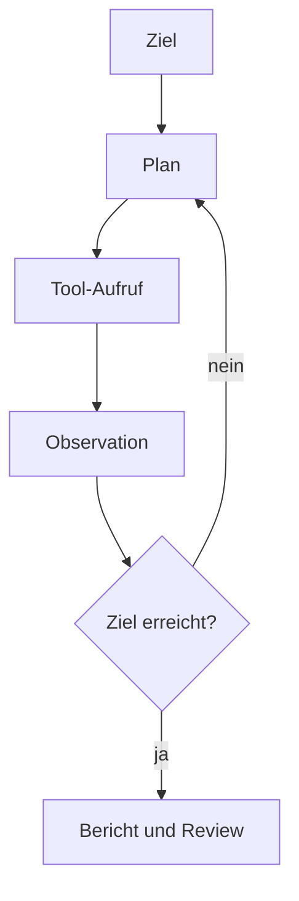

# Kapitel 26: KI-Agenten & autonome Software-Ingenieure

> [!IMPORTANT]
> KI-Agenten können Projektarbeit beschleunigen, ersetzen aber nicht Ihre Verantwortung für Architektur, Sicherheit, Tests und Review. Behandeln Sie Agenten wie sehr schnelle Junior-Teammitglieder mit Werkzeugzugriff.

## 26.1 Lernziele & Lernplan

Nach diesem Kapitel können Sie:

- KI-Agenten von Chatbots, Autovervollständigung und klassischen IDE-Erweiterungen unterscheiden;
- den agentischen Zyklus aus Ziel, Plan, Werkzeugnutzung, Beobachtung und Korrektur erklären;
- Rust-Aufgaben so prompten, dass ein Agent Compilerfeedback sinnvoll nutzen kann;
- Risiken wie Kontextverlust, Halluzinationen, übergroße Änderungen und Geheimnislecks erkennen;
- einen sicheren Arbeitsablauf für agentengestützte Rust-Entwicklung formulieren.

Lernplan:

| Schritt | Thema | Ergebnis |
|---|---|---|
| 1 | Definition | Sie kennen Agent, Tool Calling und Observation. |
| 2 | Motivation | Sie erkennen Grenzen manueller Chat-Workflows. |
| 3 | Fehler | Sie analysieren blind kopierten KI-Code. |
| 4 | Lösung | Sie formulieren agententaugliche Aufgaben. |
| 5 | Tutorial | Sie führen einen sicheren Agenten-Loop durch. |
| 6 | Deep Dive | Sie verstehen Autonomiegrade und Sicherheitsgrenzen. |
| 7 | Übungen | Sie üben Prompts, Reviews und Verifikation. |

## 26.2 Die Definition

Ein **KI-Agent** ist ein KI-System, das ein Ziel nicht nur beantwortet, sondern aktiv in einer Umgebung bearbeitet. Es kann planen, Werkzeuge auswählen, Dateien lesen oder ändern, Befehle ausführen, Ergebnisse beobachten und den Plan anpassen.

Abgrenzung:

| Werkzeugtyp | Fähigkeit | Grenze |
|---|---|---|
| Autovervollständigung | Schlägt Code im Editor vor. | Kein eigenständiger Projektplan. |
| Chatbot | Erklärt und generiert Text. | Kein direkter Datei- oder Testzugriff. |
| IDE-Agent | Arbeitet im Editor-Kontext. | Meist begrenzter Werkzeugraum. |
| CLI-Agent | Arbeitet im Terminal mit Projektdateien. | Braucht klare Rechte und Prüfungen. |
| Autonomer Software-Ingenieur | Bearbeitet größere Aufgaben in Sandbox oder Cloud. | Muss besonders streng reviewed werden. |

Wichtige Fachbegriffe:

| Begriff | Bedeutung |
|---|---|
| Prompt | Zielbeschreibung und Arbeitsanweisung. |
| Context | Dateien, Fehlermeldungen und Regeln, die der Agent kennt. |
| Tool Calling | Aufruf von Werkzeugen wie Dateisuche, Editor oder Testbefehl. |
| Observation | Ergebnis eines Werkzeugaufrufs, zum Beispiel Compilerfehler. |
| Guardrails | Grenzen, die erlaubte Aktionen einschränken. |

## 26.3 Das Problem & die Motivation

Der klassische KI-Workflow ist langsam:

1. Sie kopieren Code in einen Web-Chat.
2. Die KI antwortet ohne vollständigen Projektkontext.
3. Sie kopieren Code zurück.
4. Der Compiler meldet Fehler.
5. Sie kopieren Fehlermeldungen erneut in den Chat.

Dieser Ablauf ist fehleranfällig, weil Kontext verloren geht. Ein lokaler Agent kann die Schleife verkürzen: Er liest relevante Dateien, ändert Code, führt `cargo check` oder `cargo test` aus und reagiert auf die Ausgabe.

> [!NOTE]
> Der größte Vorteil eines Agenten ist nicht, dass er "mehr weiß". Der größte Vorteil ist, dass er die Feedbackschleife zwischen Änderung und Verifikation direkt im Projekt ausführen kann.

## 26.4 Der naive Versuch

Eine Web-KI liefert Code zum Schreiben in eine Datei:

```rust
use std::fs::OpenOptions;

fn append_log_entry(path: &str, message: &str) -> std::io::Result<()> {
    let mut file = OpenOptions::new()
        .create(true)
        .append(true)
        .open(path)?;

    file.write_all(message.as_bytes())?;
    file.write_all(b"\n")?;

    Ok(())
}

fn main() {
    append_log_entry("app.log", "Programm gestartet").unwrap();
}
```

Zeile-für-Zeile:

| Zeile | Problem |
|---|---|
| `OpenOptions` | Korrekt importiert. |
| `file.write_all(...)` | Methode stammt aus dem Trait `std::io::Write`. |
| fehlender Import | Der Trait ist nicht im Scope. |
| `unwrap()` | Fehler beim Schreiben führen zur Panic. |

EVA:

| Phase | Beschreibung |
|---|---|
| Eingabe | Dateipfad und Nachricht als `&str`. |
| Verarbeitung | Datei öffnen, Bytes schreiben, Zeilenumbruch schreiben. |
| Ausgabe | `Result<()>`, in `main` aber mit `unwrap()` erzwungen. |

## 26.5 Die Anatomie des Fehlers

Der Compiler meldet sinngemäß:

```text
error[E0599]: no method named `write_all` found for struct `File`
help: trait `Write` which provides `write_all` is implemented but not in scope
help: perhaps you want to import it: `use std::io::Write;`
```

Der technische Fehler:

- `File` implementiert `std::io::Write`.
- Trait-Methoden sind nur nutzbar, wenn der Trait im Scope ist.
- Die Web-KI hat einen kleinen, aber entscheidenden Import vergessen.

Der Workflow-Fehler:

- Der Code wurde blind übernommen.
- Es gab keine lokale Verifikationsschleife.
- Die Fehlermeldung wurde nicht sofort in die Änderung zurückgeführt.

## 26.6 Die Lösung

Korrigierter Code:

```rust
use std::fs::OpenOptions;
use std::io::Write;

fn append_log_entry(path: &str, message: &str) -> std::io::Result<()> {
    let mut file = OpenOptions::new()
        .create(true)
        .append(true)
        .open(path)?;

    file.write_all(message.as_bytes())?;
    file.write_all(b"\n")?;

    Ok(())
}

fn main() -> std::io::Result<()> {
    append_log_entry("app.log", "Programm gestartet")?;
    Ok(())
}
```

Warum dies funktioniert:

- `use std::io::Write;` bringt den Trait in den Scope.
- `write_all` wird dadurch als Trait-Methode sichtbar.
- `main` gibt `Result<()>` zurück und nutzt `?` statt `unwrap()`.
- Fehler werden kontrolliert weitergereicht.

Agententauglicher Auftrag:

```text
Aufgabe: Beheben Sie den aktuellen Compilerfehler in diesem Rust-Projekt.
Grenzen: Aendern Sie nur die Datei src/main.rs.
Vorgehen: Lesen Sie zuerst die Fehlermeldung, identifizieren Sie die verletzte Regel,
nehmen Sie die kleinste notwendige Aenderung vor, fuehren Sie cargo check aus,
und berichten Sie die geaenderten Zeilen sowie das Pruefergebnis.
```

## 26.7 Kleines Tutorial: Sicherer Agenten-Loop

### Schritt 1: Ziel und Grenzen formulieren

```text
Ziel: Funktion append_log_entry soll kompilieren und Fehler ohne unwrap weiterreichen.
Erlaubt: src/main.rs.
Nicht erlaubt: Cargo.toml, neue Dependencies, Formatierung ganzer fremder Dateien.
Verifikation: cargo check.
```

### Schritt 2: Agent beobachten lassen

Ein guter Agent liest zuerst:

- relevante Datei;
- Compilerfehler;
- Projektregeln;
- bestehende Tests.

### Schritt 3: Kleine Änderung erlauben

Der Agent sollte den fehlenden Import ergänzen und `main` auf `Result` umstellen. Er sollte nicht gleichzeitig Logging-Frameworks, neue Crates oder komplette Architekturänderungen einführen.

### Schritt 4: Prüfen

Nach der Änderung:

```text
cargo check
cargo test
git diff
```

### Schritt 5: Menschliches Review

Prüfen Sie:

- Ist die Änderung minimal?
- Wurde das ursprüngliche Ziel erfüllt?
- Sind neue Risiken entstanden?
- Sind Fehlermeldungen und Tests nachvollziehbar?

## 26.8 Mentale Modelle & Deep Dive

### Agentischer Zyklus



### Autonomiegrade

| Grad | Beschreibung | Geeignete Aufgaben |
|---|---|---|
| Assistenz | KI erklärt und schlägt vor. | Lernfragen, Fehlermeldungen. |
| Geführte Änderung | KI editiert klar begrenzte Dateien. | Kleine Bugfixes, Tests. |
| Teilautonomie | KI plant mehrere Schritte und verifiziert. | Refactoring mit klarer Akzeptanz. |
| Hohe Autonomie | KI arbeitet lange in Sandbox. | Prototypen, explorative Aufgaben. |

### Sicherheitsregeln

| Risiko | Gegenmaßnahme |
|---|---|
| Geheimnisse im Kontext | Keine Tokens, Keys oder privaten Daten in Prompts. |
| Zu große Änderungen | Dateigrenzen und Änderungsziel festlegen. |
| Halluzinierte APIs | Tests, Compiler und offizielle Dokumentation prüfen. |
| Versteckte Seiteneffekte | Diff lesen, nicht nur Abschlussbericht. |
| Abhängigkeiten ohne Prüfung | Neue Crates explizit genehmigen. |

> [!WARNING]
> Ein Agent kann sehr überzeugend über falsche Änderungen berichten. Vertrauen Sie nicht dem Bericht allein; prüfen Sie Diff und Tests.

## 26.9 Drei praktische Übungen

### Übung 1: Leicht - Prompt begrenzen

Schreiben Sie einen Agentenprompt für einen fehlenden Import.

Anforderungen:

- genaues Ziel;
- erlaubte Datei;
- Prüfbefehl;
- gewünschter Abschlussbericht.

Lösungshinweis: Formulieren Sie "kleinste notwendige Änderung".

### Übung 2: Mittel - KI-Code reviewen

Nehmen Sie den naiven Code aus Abschnitt 26.4 und schreiben Sie eine Review-Liste:

- Kompiliert der Code?
- Welche Imports fehlen?
- Wo kann eine Panic entstehen?
- Welche Signatur wäre idiomatischer?

Lösungshinweis: Unterscheiden Sie Compilerfehler und Qualitätsprobleme.

### Übung 3: Schwer - Agentenworkflow entwerfen

Entwerfen Sie einen Workflow für eine größere Änderung:

- Ausgangszustand prüfen;
- Plan erstellen;
- Tests ergänzen;
- Implementierung ändern;
- `cargo test` ausführen;
- Diff zusammenfassen.

Lösungshinweis: Jede Phase sollte ein überprüfbares Ergebnis haben.

## 26.10 Lernstrategie, Selbsteinschätzung & Merkzettel

### Cheat Sheet: Agentenprompt

```text
Rolle: Sie sind ein vorsichtiger Rust-Entwicklungsagent.
Ziel: [konkretes Ziel]
Kontext: [relevante Fehlermeldung oder Datei]
Erlaubt: [Dateien/Befehle]
Nicht erlaubt: [Dependencies, grosse Refactors, Secrets]
Vorgehen: Erst lesen, dann Plan, dann kleine Aenderung, dann Verifikation.
Bericht: Geaenderte Dateien, Grund, Pruefergebnis, offene Risiken.
```

### Active Recall

1. Was unterscheidet einen Agenten von einem Chatbot?
2. Warum ist Observation für Agenten wichtig?
3. Warum sind Dateigrenzen eine Sicherheitsmaßnahme?
4. Welche Prüfungen sollten nach KI-Änderungen laufen?
5. Warum reicht ein Agentenbericht ohne Diff nicht aus?

### Feynman-Methode

Erklären Sie KI-Agenten in drei Sätzen: Ziel, Werkzeuge, Feedbackschleife.

### Gezielte Fehlerprovokation

Lassen Sie den Import `use std::io::Write;` weg und lesen Sie die Compilerhilfe. Formulieren Sie anschließend einen Agentenprompt, der genau diesen Fehler behebt.

### Selbsttest

Sie können KI-Agenten verantwortungsvoll nutzen, wenn Sie:

- Prompts mit Ziel, Grenzen und Verifikation schreiben;
- Diffs lesen und nicht nur Berichte akzeptieren;
- Compiler- und Testergebnisse prüfen;
- neue Dependencies bewusst genehmigen;
- KI als Unterstützung, nicht als Autorität behandeln.

## 26.11 Zusammenfassung

- KI-Agenten bearbeiten Ziele in einer Umgebung mit Werkzeugen und Feedback.
- Der agentische Zyklus besteht aus Plan, Aktion, Observation und Korrektur.
- Rust eignet sich gut für Agenten, weil Compiler und Tests präzises Feedback liefern.
- Gute Agentenaufträge enthalten Grenzen, Prüfbefehle und Berichtspflichten.
- Menschliches Review bleibt Pflicht, besonders bei Sicherheit, Architektur und Abhängigkeiten.
