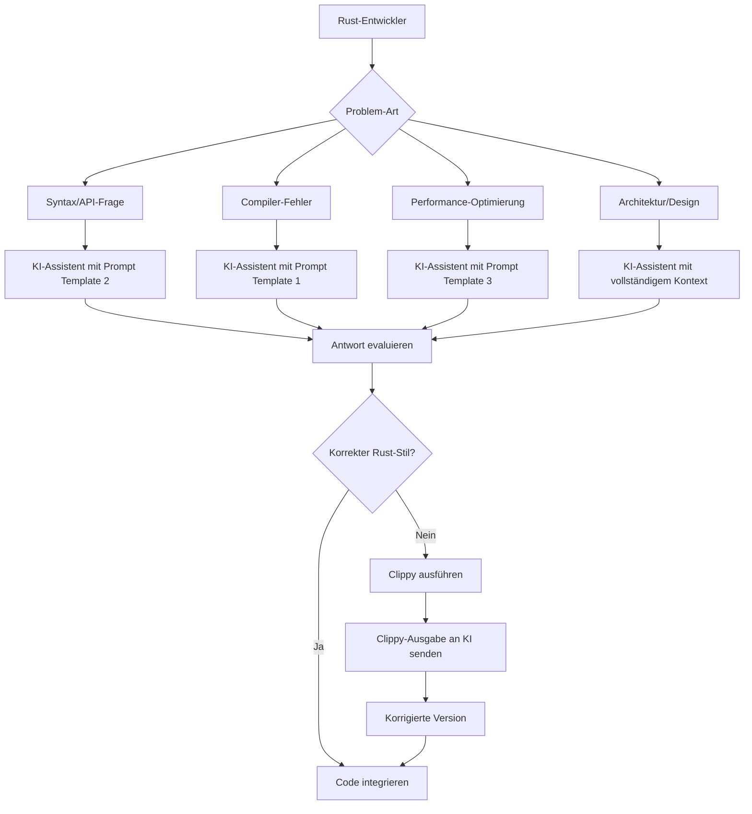
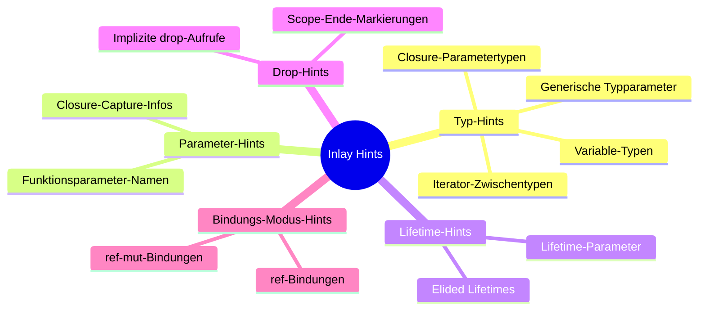

# Kapitel 3: KI-Assistenten & Tools

> [!NOTE]
> In diesem Kapitel lernen Sie, Ihre Rust-Entwicklungsumgebung mit VS Code und `rust-analyzer` professionell einzurichten. Darüber hinaus erfahren Sie, wie Sie KI-Assistenten gezielt für Rust nutzen, effektive Prompts formulieren und Compiler-Fehlermeldungen optimal an KI-Systeme übergeben.

---

## Schritt 1: Lernziele & Lernplan

### Lernziele nach der Bloom-Taxonomie

Nach dem Durcharbeiten dieses Kapitels werden Sie in der Lage sein:

1. **Anwenden (Bloom-Stufe 3):** Sie können VS Code mit `rust-analyzer` vollständig konfigurieren, Inlay Hints aktivieren, `clippy` als Standard-Linter einrichten und alle relevanten Erweiterungen installieren.
2. **Analysieren (Bloom-Stufe 4):** Sie können Rust-Fehlermeldungen des Compilers analysieren, ihre Struktur verstehen und beurteilen, welche Teile einer Fehlermeldung für eine KI besonders relevant sind.
3. **Erschaffen (Bloom-Stufe 6):** Sie können strukturierte, effektive Prompts für KI-Assistenten formulieren, die auf Rust-spezifische Probleme zugeschnitten sind, und die KI-Ausgaben kritisch evaluieren.

### Lernplan

| Phase | Tätigkeit | Zeit |
|---|---|---|
| Lesen | Kapitel vollständig lesen | 45 Min. |
| Praxis | VS Code + rust-analyzer konfigurieren | 20 Min. |
| Experiment | KI-Prompts ausprobieren mit echten Rust-Fehlern | 20 Min. |
| Übungen | Drei Übungsaufgaben bearbeiten | 20 Min. |
| Rückblick | Cheat Sheet, Active Recall | 10 Min. |

---

## Schritt 2: Die Definition

### Was ist rust-analyzer?

`rust-analyzer` ist die offizielle **Language Server Protocol (LSP)-Implementierung** für Rust. Es ist das Herzstück aller modernen Rust-IDEs und -Editoren.

Ein Language Server ist ein Hintergrundprozess, der:
- Den Quellcode kontinuierlich analysiert (ohne vollständig zu kompilieren)
- Fehlermeldungen und Warnungen in Echtzeit anzeigt
- Autovervollständigung, Hover-Informationen und Code-Navigation bereitstellt
- Refactoring-Operationen (Umbenennen, Extrahieren etc.) unterstützt

> [!IMPORTANT]
> `rust-analyzer` ist der **Nachfolger** des älteren `rls` (Rust Language Server). Wenn Sie in Tutorial-Videos oder Artikeln `rls` sehen, handelt es sich um veraltete Informationen. Installieren Sie immer `rust-analyzer`.

### Was sind Inlay Hints?

**Inlay Hints** sind kleine, nicht-bearbeitbare Beschriftungen, die der Editor direkt in den Quellcode einblendet, um Typinformationen anzuzeigen, die nicht explizit im Code stehen:

```rust
// Code, den Sie schreiben:
let zahlen = vec![1, 2, 3];
let verdoppelt = zahlen.iter().map(|x| x * 2).collect::<Vec<_>>();

// Was rust-analyzer einblendet (Inlay Hints):
let zahlen: Vec<i32> = vec![1, 2, 3];
let verdoppelt: Vec<i32> = zahlen.iter().map(|x: &i32| x * 2).collect::<Vec<_>>();
```

Inlay Hints sind eine der wertvollsten Funktionen für Rust-Anfänger, da Rust's Typ-Inferenz zwar mächtig ist, aber für Lernende manchmal undurchsichtig.

---

## Schritt 3: Das Problem & Die Motivation

### Warum braucht man spezielle Tools für Rust?

Rust's Compiler (`rustc`) ist deutlich anspruchsvoller als die meisten anderen Compiler. Er führt:
- **Borrow Checking** durch (prüft Ownership-Regeln)
- **Lifetime-Analyse** durch (prüft, wie lange Referenzen gültig sind)
- **Typ-Inferenz** durch (schließt Typen aus dem Kontext)

Ohne gute Werkzeugunterstützung würde die Entwicklung sehr mühsam sein:

**Ohne rust-analyzer:**
```
Workflow: Code schreiben → Terminal → cargo build → Fehler lesen → zurück zum Editor → Code finden → korrigieren → wiederholen
```

**Mit rust-analyzer:**
```
Workflow: Code schreiben → Fehler sofort im Editor sehen (Unterstreichung) → Hover für Details → Quick-Fix anklicken
```

### Das Problem mit KI und Rust

KI-Assistenten wie Gemini, ChatGPT oder Claude sind mächtige Helfer – aber sie haben **Rust-spezifische Schwachstellen**:

1. **Veraltetes Trainingsdaten-Problem:** Rust ändert sich schnell. KI-Modelle kennen möglicherweise keine Features, die nach ihrem Training-Cutoff eingeführt wurden.
2. **Ownership-Blindheit:** KI-Modelle machen häufig Fehler mit Ownership und Borrowing, weil diese Konzepte in anderen Sprachen nicht existieren.
3. **Unvollständige Fehlerkontexte:** Wenn Sie nur "mein Code compiliert nicht" schreiben, ohne den vollen Compiler-Output beizufügen, gibt die KI oft generische, falsche Antworten.
4. **Halluzinierte APIs:** KI-Modelle erfinden manchmal Methoden, die nicht existieren (z. B. `vec.push_front()` – gibt es nicht, der richtige Typ wäre `VecDeque`).

---

## Schritt 4: Der naive Versuch – Schlechte KI-Interaktion

### Schlechter Prompt – Was man vermeiden sollte

**Schlechter Prompt #1: Zu vage**

```
Nutzer: Mein Rust-Code funktioniert nicht. Kannst du helfen?

KI: Sicher! Zeigen Sie mir bitte Ihren Code und die Fehlermeldung.

Nutzer: Da ist ein Fehler mit Ownership.

KI: [Gibt generische Erklärung zu Ownership, die nicht auf das 
     spezifische Problem eingeht]
```

**Schlechter Prompt #2: Kein Compiler-Output**

```
Nutzer: Kannst du diesen Code reparieren?
        fn main() { let s = String::from("Hallo"); use_string(s); println!("{}", s); }
        fn use_string(s: String) {}

KI: [Gibt möglicherweise die falsche Lösung, weil der spezifische 
     Fehler und seine Zeile unbekannt sind]
```

**Schlechter Prompt #3: Falsche Erwartung**

```
Nutzer: Schreib mir eine async/await-Funktion mit tokio

KI: [Schreibt Code, der eine sehr alte tokio-API verwendet oder 
     einen falschen Rückgabetyp hat]
```

### Der naive Versuch mit der IDE

Viele Anfänger installieren VS Code und dann nur die "Rust" Extension (von rust-lang) – die aber veraltet ist und auf dem alten `rls` basiert. Oder sie installieren überhaupt keine Extension und kämpfen mit reinem Text-Editing.

```
Falsche Extension-Reihenfolge (Anfängerfehler):
1. "Rust" Extension installieren (veraltet!)
2. "RLS" (Rust Language Server, veraltet!) installieren
3. Sich wundern, warum Autocomplete langsam und unzuverlässig ist
```

---

## Schritt 5: Die Anatomie des Fehlers – Compiler-Output verstehen

### 5.1 Struktur einer Rust-Fehlermeldung

Rust-Compiler-Fehlermeldungen haben eine konsistente, mehrteilige Struktur:

```
error[E0382]: borrow of moved value: `s`
  --> src/main.rs:5:20
   |
2  |     let s = String::from("Hallo");
   |         - move occurs because `s` has type `String`,
   |           which does not implement the `Copy` trait
3  |     use_string(s);
   |                - value moved here
4  |     println!("{}", s);
   |                    ^ value borrowed here after move
   |
help: consider cloning the value if the intent is to use it elsewhere
   |
3  |     use_string(s.clone());
   |                 ++++++++
```

**Jedes Element hat eine Bedeutung:**

```
error[E0382]    ← Fehler-Code (eindeutige ID, nach der Sie suchen können)
    │
    ├── Erste Zeile: Kurzbeschreibung ("borrow of moved value")
    │
    ├── --> src/main.rs:5:20  ← Datei, Zeile, Spalte des Fehlers
    │
    ├── Quellcode-Ansicht mit Markierungen:
    │   ├── - (Minus)    = Relevante frühere Stelle
    │   ├── ^ (Dach)     = Genauer Fehlerort
    │   └── ~ (Tilde)    = Bereich des Fehlers
    │
    └── help:  ← Konkrete Lösungsvorschläge vom Compiler
```

### 5.2 Wichtige Fehler-Codes und ihre Bedeutungen

| Code | Bedeutung | Häufigste Ursache |
|---|---|---|
| E0282 | Typ-Annotation nötig | Rust kann den Typ nicht inferieren |
| E0308 | Typ-Mismatch | Falscher Typ übergeben |
| E0382 | Borrow nach Move | Variable nach Ownership-Transfer verwendet |
| E0502 | Borrow-Konflikt | Gleichzeitige mut und immut Borrows |
| E0505 | Cannot move out of | Variable gemoved, während Borrow existiert |
| E0507 | Cannot move out of ref | Versucht, von einer Referenz zu moven |
| E0596 | Cannot borrow as mutable | Unveränderliche Variable als mutable geborgt |
| E0597 | Referenz lebt nicht lang genug | Lifetime-Problem |
| E0716 | Temporär ohne Binding | Temporärer Wert wird zu früh freigegeben |

### 5.3 Welche Teile des Fehlers sind für KI am wichtigsten?

```
FÜR KI RELEVANT:
┌─────────────────────────────────────────────────────────┐
│ error[E0382]: borrow of moved value: `s`               │ ← Fehlercode + Beschreibung
│   --> src/main.rs:5:20                                  │ ← Ort (optional)
│                                                         │
│   Ihr vollständiger Code:                               │ ← KOMPLETTER CODE!
│   fn main() {                                           │
│       let s = String::from("Hallo");                    │
│       use_string(s);                                    │
│       println!("{}", s);                                │
│   }                                                     │
│   fn use_string(s: String) {}                           │
│                                                         │
│   Was ich versuche zu tun:                              │ ← Ihr Ziel
│   s soll nach dem Funktionsaufruf noch verfügbar sein   │
└─────────────────────────────────────────────────────────┘

NICHT NUR SCHICKEN:
"Ich habe einen E0382-Fehler" → zu wenig Kontext
"Mein Code geht nicht" → viel zu vage
```

---

## Schritt 6: Die Lösung – Optimale Konfiguration und KI-Nutzung

### 6.1 VS Code mit rust-analyzer konfigurieren

**Schritt 1: VS Code installieren**

Laden Sie VS Code von [https://code.visualstudio.com](https://code.visualstudio.com) herunter. Wählen Sie die Version für Ihr Betriebssystem.

**Schritt 2: rust-analyzer installieren**

Öffnen Sie VS Code und gehen Sie zur Extensions-Ansicht (`Ctrl+Shift+X`). Suchen Sie nach "rust-analyzer" und installieren Sie die Extension von der Publisher-ID `rust-lang.rust-analyzer`.

> [!WARNING]
> Es gibt mehrere Extensions mit ähnlichen Namen. Die korrekte Extension heißt **"rust-analyzer"** mit Publisher **rust-lang**. Nicht "Rust" (veraltet) und nicht "rust-analyzer" von einem anderen Publisher.

**Schritt 3: VS Code für Rust optimieren (settings.json)**

Öffnen Sie die VS Code-Einstellungen (`Ctrl+Shift+P` → "Open User Settings JSON") und fügen Sie folgende Konfiguration hinzu:

```json
{
    // rust-analyzer Einstellungen
    "[rust]": {
        "editor.defaultFormatter": "rust-lang.rust-analyzer",
        "editor.formatOnSave": true,
        "editor.rulers": [100]
    },
    
    // Inlay Hints aktivieren
    "rust-analyzer.inlayHints.bindingModeHints.enable": true,
    "rust-analyzer.inlayHints.chainingHints.enable": true,
    "rust-analyzer.inlayHints.closingBraceHints.enable": true,
    "rust-analyzer.inlayHints.closureCaptureHints.enable": true,
    "rust-analyzer.inlayHints.closureReturnTypeHints.enable": "always",
    "rust-analyzer.inlayHints.discriminantHints.enable": "always",
    "rust-analyzer.inlayHints.expressionAdjustmentHints.enable": "always",
    "rust-analyzer.inlayHints.genericParameterHints.type.enable": true,
    "rust-analyzer.inlayHints.genericParameterHints.lifetime.enable": true,
    "rust-analyzer.inlayHints.implicitDrops.enable": true,
    "rust-analyzer.inlayHints.lifetimeElisionHints.enable": "always",
    "rust-analyzer.inlayHints.maxLength": 50,
    "rust-analyzer.inlayHints.parameterHints.enable": true,
    "rust-analyzer.inlayHints.reborrowHints.enable": "always",
    "rust-analyzer.inlayHints.renderColons": true,
    "rust-analyzer.inlayHints.typeHints.enable": true,
    "rust-analyzer.inlayHints.typeHints.hideClosureInitialization": false,
    "rust-analyzer.inlayHints.typeHints.hideNamedConstructor": false,
    
    // clippy als Standard-Check verwenden
    "rust-analyzer.check.command": "clippy",
    "rust-analyzer.check.extraArgs": ["--", "-W", "clippy::pedantic"],
    
    // Automatische Imports
    "rust-analyzer.imports.granularity.group": "module",
    "rust-analyzer.imports.prefix": "self",
    
    // Erweiterte Features
    "rust-analyzer.rustfmt.extraArgs": ["--edition", "2021"],
    "rust-analyzer.hover.actions.enable": true,
    "rust-analyzer.hover.documentation.enable": true,
    "rust-analyzer.hover.documentation.keywords.enable": true,
    
    // Experimentelles Feature: Proc-Macro-Expansion anzeigen
    "rust-analyzer.procMacro.enable": true,
    "rust-analyzer.procMacro.attributes.enable": true
}
```

### 6.2 Weitere empfehlenswerte VS Code Extensions

```
Extension                   Publisher           Zweck
──────────────────────────────────────────────────────────────
rust-analyzer               rust-lang           LSP, Hauptextension
Even Better TOML            tamasfe             Cargo.toml Unterstützung
crates                      serayuzgur          Crate-Versionen inline anzeigen
Error Lens                  usernamehw          Fehler direkt in der Codezeile
GitLens                     GitKraken           Erweiterte Git-Integration
CodeLLDB                    vadimcn             Debugger für Rust
Dependi                     fill-labs           Dependency-Verwaltung
Todo Tree                   Gruntfuggly         TODO-Kommentare verwalten
```

**Wichtigste Installationsbefehle:**

```bash
# Über die VS Code CLI installieren
code --install-extension rust-lang.rust-analyzer
code --install-extension tamasfe.even-better-toml
code --install-extension serayuzgur.crates
code --install-extension usernamehw.errorlens
code --install-extension vadimcn.vscode-lldb
```

### 6.3 Optimale Prompts für KI-Assistenten

Das "Template" für einen guten Rust-KI-Prompt:

```
# Rust-Problem Prompt Template

## Kontext
- Rust-Version: [rustc --version Ausgabe]
- Betriebssystem: [Linux/macOS/Windows]
- Was ich versuche: [Klare Beschreibung des Ziels]

## Code
```rust
[VOLLSTÄNDIGER, REPRODUZIERBARER CODE]
```

## Fehlermeldung (vollständig)
```
[KOMPLETTE cargo build / rustc Ausgabe, copy-paste]
```

## Was ich bereits versucht habe
[Liste bisheriger Lösungsversuche]

## Frage
[Spezifische Frage]
```

**Konkretes Beispiel eines guten Prompts:**

```
Rust-Version: rustc 1.79.0
OS: Linux Ubuntu 22.04
Ziel: Ich möchte eine Funktion schreiben, die einen String empfängt
      und ihn nach dem Aufruf noch verwenden kann.

Code:
fn main() {
    let s = String::from("Hallo, Welt!");
    ausgeben(s);
    println!("{}", s); // Ich möchte s hier noch verwenden
}

fn ausgeben(s: String) {
    println!("{}", s);
}

Fehlermeldung:
error[E0382]: borrow of moved value: `s`
 --> src/main.rs:4:20
  |
2 |     let s = String::from("Hallo, Welt!");
  |         - move occurs because `s` has type `String`
3 |     ausgeben(s);
  |              - value moved here
4 |     println!("{}", s);
  |                    ^ value borrowed here after move

Versucht: Ich habe s.clone() versucht, aber das fühlt sich falsch an.

Frage: Was ist der idiomatische Rust-Weg, um dieses Problem zu lösen?
       Wann verwende ich &str vs String als Parametertyp?
```

---

## Schritt 7: Kleines Tutorial – Vollständige IDE-Einrichtung

### Schritt 7.1: rust-analyzer-Komponente installieren

`rust-analyzer` als VS Code Extension lädt die Binary automatisch herunter. Sie können es aber auch explizit über rustup installieren:

```bash
# rust-analyzer als rustup-Komponente installieren
rustup component add rust-analyzer

# Prüfen ob rust-analyzer verfügbar ist
rust-analyzer --version
# Ausgabe: rust-analyzer 1.79.0-standalone

# Falls VS Code rust-analyzer automatisch downloaded, kann es zu Konflikten kommen
# Setzen Sie den Pfad explizit in VS Code settings.json:
```

```json
{
    "rust-analyzer.server.path": "rust-analyzer"
}
```

### Schritt 7.2: Debugger einrichten (CodeLLDB)

Das Debugging von Rust-Code in VS Code erfordert die CodeLLDB Extension:

1. Extension `vadimcn.vscode-lldb` installieren
2. Im Projekt eine `.vscode/launch.json` erstellen:

```json
{
    "version": "0.2.0",
    "configurations": [
        {
            "type": "lldb",
            "request": "launch",
            "name": "Debug Rust Programm",
            "cargo": {
                "args": [
                    "build",
                    "--bin=mein-programm",
                    "--package=mein-paket"
                ],
                "filter": {
                    "name": "mein-programm",
                    "kind": "bin"
                }
            },
            "args": [],
            "cwd": "${workspaceFolder}",
            "sourceLanguages": ["rust"]
        },
        {
            "type": "lldb",
            "request": "launch",
            "name": "Debug Unit Tests",
            "cargo": {
                "args": [
                    "test",
                    "--no-run",
                    "--lib"
                ],
                "filter": {
                    "name": "mein-paket",
                    "kind": "lib"
                }
            },
            "args": [],
            "cwd": "${workspaceFolder}"
        }
    ]
}
```

### Schritt 7.3: Inlay Hints im Alltag nutzen

Erstellen Sie eine Test-Datei, um Inlay Hints zu erleben:

```rust
// src/main.rs
fn main() {
    // rust-analyzer zeigt: zahlen: Vec<i32>
    let zahlen = vec![1, 2, 3, 4, 5];
    
    // rust-analyzer zeigt den Closure-Parametertyp: x: &i32
    let summe = zahlen.iter().sum::<i32>();
    
    // rust-analyzer zeigt: ergebnis: Option<i32>
    let ergebnis = zahlen.iter().find(|&&x| x > 3);
    
    // Bei Method Chains zeigt rust-analyzer die Zwischentypen
    let verarbeitet = zahlen
        .iter()              // rust-analyzer: Iter<'_, i32>
        .filter(|&&x| x % 2 == 0)  // rust-analyzer: Filter<Iter<'_, i32>, ...>
        .map(|&x| x * x)     // rust-analyzer: Map<Filter<...>, ...>
        .collect::<Vec<_>>(); // rust-analyzer: Vec<i32>
    
    println!("{:?}", verarbeitet);
}
```

Bewegen Sie den Cursor über eine Variable. Ein Hover-Popup erscheint mit:
- Vollständigem Typ
- Dokumentation (falls vorhanden)
- Links zur Implementierung

### Schritt 7.4: Prompt Engineering für typische Rust-Probleme

**Template 1: Borrow-Checker-Fehler**

```
Ich lerne Rust und stoße auf folgenden Borrow-Checker-Fehler.
Bitte erkläre:
1. WARUM dieser Fehler auftritt (mentales Modell)
2. Wie ich ihn behebe (mit Code)
3. Was der idiomatische Rust-Weg für diesen Anwendungsfall ist

Rust-Version: [VERSION]
Code: [CODE]
Fehler: [VOLLSTÄNDIGER COMPILER-OUTPUT]
```

**Template 2: API-Design-Frage**

```
Ich designe eine Rust-API und bin unsicher über das richtige Design.
Rust-Version: [VERSION]

Ich habe diese zwei Optionen:
Option A: [CODE]
Option B: [CODE]

Was ist idiomatischer Rust? Was sind die Vor- und Nachteile beider Ansätze
hinsichtlich Performance, Ergonomie und API-Klarheit?
```

**Template 3: Performance-Analyse**

```
Ich möchte diesen Rust-Code bezüglich Performance verstehen.
Rust-Version: [VERSION]

Code: [CODE]

Fragen:
1. Werden hier Heap-Allokationen gemacht?
2. Gibt es unnötige Klone?
3. Wie verhält sich dies bei großen Eingaben?
```

### Schritt 7.5: Häufige KI-Fehler bei Rust erkennen und korrigieren

KI-Assistenten machen typische Fehler bei Rust. Hier sind die wichtigsten:

**Fehler 1: Unnötige Klone**

```rust
// KI schlägt vor (ineffizient):
fn verarbeite(daten: Vec<i32>) -> Vec<i32> {
    let kopie = daten.clone();  // Unnötig!
    kopie.iter().map(|x| x * 2).collect()
}

// Besser (idiomatisches Rust):
fn verarbeite(daten: &[i32]) -> Vec<i32> {
    daten.iter().map(|x| x * 2).collect()
}
```

**Fehler 2: `unwrap()` in Produktionscode**

```rust
// KI schlägt vor (gefährlich in Produktion):
fn lese_datei(pfad: &str) -> String {
    std::fs::read_to_string(pfad).unwrap()  // Panik bei Fehler!
}

// Besser (Fehlerbehandlung):
fn lese_datei(pfad: &str) -> Result<String, std::io::Error> {
    std::fs::read_to_string(pfad)
}
```

**Fehler 3: Veraltete Syntax**

```rust
// Alte Syntax (KI aus altem Training):
extern crate serde;  // Vor Rust 2018 Edition
#[macro_use] extern crate serde_derive;

// Modernes Rust 2021:
use serde::{Deserialize, Serialize};
```

---

## Schritt 8: Mentale Modelle & Deep Dive

### 8.1 Das rust-analyzer-Ökosystem (ASCII-Art)

```
VS CODE EDITOR

┌─────────────────────────────────────────────────────────────────┐
│  src/main.rs                                                     │
│                                                                  │
│  fn main() {                                                     │
│      let s: String = String::from("Hallo");  ← Inlay Hint      │
│            ^^^^^^^                                               │
│      let len = s.len();                                          │
│          ^^^: usize   ← Inlay Hint                             │
│  }                                                               │
│                                                                  │
│  ~~~ s.clne() ~~~  ← Rote Unterstreichung: Fehler              │
│  💡 Meinten Sie s.clone()? [Quick Fix]  ← Code Action          │
│                                                                  │
└─────────────────────────────────────────────────────────────────┘
            │                              ▲
            │ LSP-Protokoll                │
            │ (JSON-RPC über stdio)        │
            ▼                              │
┌─────────────────────────────────────────────────────────────────┐
│  RUST-ANALYZER (Hintergrundprozess)                             │
│                                                                  │
│  ├── Syntax-Analyse (Parser)                                    │
│  ├── Semantische Analyse (Type Checker)                         │
│  ├── Borrow-Checker-Analyse                                     │
│  ├── Completion Engine (Autovervollständigung)                  │
│  ├── Hover-Informationen                                        │
│  ├── Go-to-Definition                                           │
│  └── Refactoring-Operationen                                    │
│                                                                  │
│  Ruft auf: cargo check (für finale Validierung)                 │
└─────────────────────────────────────────────────────────────────┘
```

### 8.2 KI-Assistenten-Ökosystem für Rust (Mermaid)



### 8.3 Inlay Hints – Vollständige Kategorien



### 8.4 Vergleich: Verschiedene KI-Assistenten für Rust

| Assistent | Stärken für Rust | Schwächen | Empfehlung |
|---|---|---|---|
| **Gemini 2.5 Pro** | Aktuelles Training, Code-Ausführung in Sandbox, API-Zugriff | - | ✅ Für komplexe Rust-Fragen |
| **Claude 3.5+** | Exzellentes Rust-Verständnis, präzise Fehlererklärungen | Kein direkter rustc-Zugriff | ✅ Für Borrow-Checker-Probleme |
| **GitHub Copilot** | Direkt im Editor, Context-aware | Manchmal veraltete Patterns | ✅ Für Code-Completion |
| **GPT-4o** | Breites Wissen | Manchmal halluzinierte APIs | ⚠️ Output immer mit Compiler prüfen |

### 8.5 rust-analyzer Funktionen im Detail

**Go-to-Definition (F12):**
```
Drücken Sie F12 auf einem Funktionsnamen
    → Springt zur Funktionsdefinition (auch in Bibliotheken)
    → Funktioniert auch für Typen, Traits, Makros
```

**Find All References (Shift+F12):**
```
Zeigt alle Stellen im Code, wo eine Variable/Funktion verwendet wird
    → Unverzichtbar beim Refactoring
    → Zeigt auch Verwendungen in anderen Dateien
```

**Rename Symbol (F2):**
```
Benennt eine Variable/Funktion überall im Projekt um
    → Sicheres Refactoring ohne manuelle Suche/Ersetzen
    → Beachtet Rust-Scoping-Regeln
```

**Extract Function:**
```
Markieren Sie Code → Rechtsklick → Refactor → Extract into function
    → rust-analyzer extrahiert den Code in eine neue Funktion
    → Inferred die richtigen Parameter und Rückgabetypen
```

**Expand Macro:**
```
Rechtsklick auf einen Makro-Aufruf → Expand Macro
    → Zeigt den vollständig expandierten Makro-Code
    → Unverzichtbar zum Verstehen von derive-Makros
```

### 8.6 Prompt-Engineering: Fortgeschrittene Techniken

**Technik 1: Chain-of-Thought für Rust**

Statt direkt nach Code zu fragen, bitten Sie die KI, schrittweise zu denken:

```
Ich habe diesen Rust-Code und Fehler [CODE/FEHLER].

Bitte analysiere schrittweise:
1. Was versucht der Code zu tun?
2. Warum tritt dieser Fehler auf? (aus Compiler-Perspektive)
3. Welche Rust-Konzepte sind hier relevant?
4. Was sind alle möglichen Lösungen?
5. Welche Lösung ist am idiomatischsten und warum?
```

**Technik 2: Persona-Prompting für Rust**

```
Du bist ein erfahrener Rust-Senior-Entwickler mit Fokus auf systemnahe Programmierung.
Du legst besonderen Wert auf:
- Correctness über Performance
- Idiomatisches Rust (keine unnötigen Klone, kein unwrap() in Produktion)
- Ausführliche Kommentare für Lernende
- Erklärungen des "Warum", nicht nur des "Was"

Hier ist mein Code/Problem: [...]
```

**Technik 3: Kritische Evaluation der KI-Ausgabe**

```
Du hast mir diesen Code gegeben:
[KI-AUSGABE]

Bitte prüfe kritisch:
1. Compiliert der Code ohne Warnungen? (führe cargo clippy aus)
2. Gibt es unnötige Allokationen oder Klone?
3. Ist die Fehlerbehandlung vollständig?
4. Ist der Code idiomatisches Rust 2021?
```

---

## Schritt 9: Drei Übungen

### Übung 1 (Leicht): VS Code-Konfiguration verifizieren

Öffnen Sie VS Code in einem Rust-Projekt und verifizieren Sie die Konfiguration:

```bash
# Ein Test-Projekt erstellen
cargo new vs-code-test
cd vs-code-test
code .
```

Öffnen Sie `src/main.rs` in VS Code und führen Sie folgende Checks durch:

1. **Inlay Hints sichtbar?** Schreiben Sie `let x = vec![1, 2, 3];` – sehen Sie `: Vec<i32>` eingeblendet?
2. **Autovervollständigung funktioniert?** Tippen Sie `x.` und beobachten Sie die Dropdown-Liste mit Methodenvorschlägen.
3. **Fehler werden sofort angezeigt?** Schreiben Sie `let s = "Hallo"; println!("{}", s.nonexistent());` – erscheint die rote Unterstreichung?
4. **Quick Fix funktioniert?** Klicken Sie auf das Glühbirnen-Icon neben einem Fehler – welche Lösungsvorschläge werden angezeigt?
5. **rustfmt on save?** Formatieren Sie Code absichtlich falsch (falsche Einrückung) und speichern Sie – wird er automatisch formatiert?

> [!TIP]
> **Hint:** Falls Inlay Hints nicht angezeigt werden, prüfen Sie ob `rust-analyzer.inlayHints.typeHints.enable` in settings.json auf `true` gesetzt ist. Starten Sie VS Code nach Konfigurationsänderungen neu.

---

### Übung 2 (Mittel): Effektiven KI-Prompt erstellen

Sie stoßen auf folgenden Rust-Code mit einem Fehler. Erstellen Sie nach dem Prompt-Template aus diesem Kapitel einen vollständigen, effektiven Prompt für einen KI-Assistenten:

**Fehlerhafter Code:**

```rust
use std::collections::HashMap;

fn häufigste_wörter(text: &str) -> Vec<(&str, usize)> {
    let mut häufigkeit: HashMap<&str, usize> = HashMap::new();
    
    for wort in text.split_whitespace() {
        let zähler = häufigkeit.entry(wort).or_insert(0);
        *zähler += 1;
    }
    
    let mut ergebnis: Vec<(&str, usize)> = häufigkeit.into_iter().collect();
    ergebnis.sort_by(|a, b| b.1.cmp(&a.1));
    ergebnis
}

fn main() {
    let text = String::from("hallo welt hallo rust rust rust");
    let ergebnis = häufigste_wörter(&text);
    println!("{:?}", ergebnis);
}
```

**Compiler-Ausgabe:**

```
error[E0515]: cannot return value referencing local data `*text`
  --> src/main.rs:12:5
   |
12 |     ergebnis.sort_by(|a, b| b.1.cmp(&a.1));
13 |     ergebnis
   |     ^^^^^^^^ returns a value referencing data owned by the current function
```

**Ihre Aufgabe:**

1. Schreiben Sie einen vollständigen, strukturierten Prompt nach dem Template
2. Identifizieren Sie, welches Rust-Konzept hinter diesem Fehler steckt
3. Schlagen Sie eine Lösung vor, bevor Sie die KI fragen

> [!TIP]
> **Hints:**
> - Der Fehler betrifft Lifetimes und Referenzen auf lokale Daten
> - Die HashMap enthält `&str`-Referenzen, die auf den übergebenen `text`-Slice zeigen
> - Eine Lösung: `String` statt `&str` in der HashMap und im Rückgabetyp verwenden
> - Eine andere Lösung: Den Rückgabetyp anpassen

**Musterlösung (vereinfachte Version):**

```rust
use std::collections::HashMap;

// Lösung 1: String statt &str verwenden (einfacher, mehr Allokationen)
fn häufigste_wörter(text: &str) -> Vec<(String, usize)> {
    let mut häufigkeit: HashMap<String, usize> = HashMap::new();
    
    for wort in text.split_whitespace() {
        let zähler = häufigkeit.entry(wort.to_string()).or_insert(0);
        *zähler += 1;
    }
    
    let mut ergebnis: Vec<(String, usize)> = häufigkeit.into_iter().collect();
    ergebnis.sort_by(|a, b| b.1.cmp(&a.1));
    ergebnis
}

fn main() {
    let text = String::from("hallo welt hallo rust rust rust");
    let ergebnis = häufigste_wörter(&text);
    println!("{:?}", ergebnis);
}
```

---

### Übung 3 (Schwer): KI-Ausgabe evaluieren und korrigieren

Die KI hat folgenden Code als Antwort auf die Frage "Schreib eine Thread-sichere Konfigurationsstruktur in Rust" generiert:

```rust
// KI-generierter Code (enthält absichtliche Probleme)
use std::sync::Mutex;
use std::collections::HashMap;

struct Konfiguration {
    daten: Mutex<HashMap<String, String>>,
}

impl Konfiguration {
    fn neu() -> Self {
        Konfiguration {
            daten: Mutex::new(HashMap::new()),
        }
    }
    
    fn setze(&self, schlüssel: String, wert: String) {
        let mut map = self.daten.lock().unwrap();
        map.insert(schlüssel, wert);
    }
    
    fn hole(&self, schlüssel: &str) -> Option<String> {
        let map = self.daten.lock().unwrap();
        map.get(schlüssel).cloned()
    }
    
    fn alle_werte(&self) -> HashMap<String, String> {
        let map = self.daten.lock().unwrap();
        map.clone()
    }
}

fn main() {
    let config = Konfiguration::neu();
    config.setze("datenbankUrl".to_string(), "postgresql://localhost/db".to_string());
    
    if let Some(url) = config.hole("datenbankUrl") {
        println!("DB-URL: {}", url);
    }
}
```

**Ihre Aufgabe:** Analysieren Sie den Code kritisch:

1. Identifizieren Sie alle Probleme (Tipp: Es gibt mindestens 4)
2. Beurteilen Sie, ob der Code Panic-sicher ist
3. Schreiben Sie eine verbesserte Version

> [!TIP]
> **Hints:**
> - `unwrap()` auf einem Mutex kann paniken (Mutex Poisoning)
> - Für Thread-sharing braucht man `Arc<Mutex<...>>`
> - `alle_werte()` klont die gesamte HashMap – sehr teuer bei vielen Einträgen
> - Die Namenskonvention: Rust verwendet `snake_case` auch für Schlüssel

**Musterlösung:**

```rust
use std::sync::{Arc, Mutex, PoisonError};
use std::collections::HashMap;

#[derive(Debug)]
pub enum KonfigurationsError {
    MutexVergiftet,
    SchlüsselNichtGefunden(String),
}

impl<T> From<PoisonError<T>> for KonfigurationsError {
    fn from(_: PoisonError<T>) -> Self {
        KonfigurationsError::MutexVergiftet
    }
}

#[derive(Clone)]
pub struct Konfiguration {
    daten: Arc<Mutex<HashMap<String, String>>>,
}

impl Konfiguration {
    pub fn neu() -> Self {
        Konfiguration {
            daten: Arc::new(Mutex::new(HashMap::new())),
        }
    }
    
    pub fn setze(&self, schlüssel: &str, wert: &str) -> Result<(), KonfigurationsError> {
        let mut map = self.daten.lock()?;
        map.insert(schlüssel.to_string(), wert.to_string());
        Ok(())
    }
    
    pub fn hole(&self, schlüssel: &str) -> Result<Option<String>, KonfigurationsError> {
        let map = self.daten.lock()?;
        Ok(map.get(schlüssel).cloned())
    }
    
    // Statt alle Werte zu klonen: eine Closure auf der Map ausführen
    pub fn mit_daten<F, R>(&self, f: F) -> Result<R, KonfigurationsError>
    where
        F: FnOnce(&HashMap<String, String>) -> R,
    {
        let map = self.daten.lock()?;
        Ok(f(&map))
    }
}

fn main() -> Result<(), KonfigurationsError> {
    let config = Konfiguration::neu();
    
    config.setze("datenbank_url", "postgresql://localhost/db")?;
    config.setze("port", "8080")?;
    
    if let Some(url) = config.hole("datenbank_url")? {
        println!("DB-URL: {}", url);
    }
    
    // Effizientes Lesen ohne unnötige Klone:
    let anzahl = config.mit_daten(|map| map.len())?;
    println!("Anzahl Konfigurationseinträge: {}", anzahl);
    
    // Konfiguration ist Clone – kann für mehrere Threads geteilt werden
    let config2 = config.clone();
    let handle = std::thread::spawn(move || {
        let _ = config2.setze("thread_schlüssel", "thread_wert");
    });
    handle.join().unwrap();
    
    Ok(())
}
```

---

## Schritt 10: Lernstrategie & Merkzettel

### 10.1 Cheat Sheet – rust-analyzer & KI auf einen Blick

```
┌─────────────────────────────────────────────────────────────────┐
│           RUST-ANALYZER & KI CHEAT SHEET – Kapitel 3           │
├─────────────────────────────────────────────────────────────────┤
│ VS CODE SHORTCUTS (Rust-spezifisch)                             │
│  F12              → Zur Definition springen                     │
│  Shift+F12        → Alle Referenzen anzeigen                    │
│  F2               → Symbol umbenennen                           │
│  Ctrl+.           → Quick Fix Menü                              │
│  Hover            → Typ-Info und Dokumentation                  │
│  Ctrl+Shift+P     → Kommando-Palette                            │
├─────────────────────────────────────────────────────────────────┤
│ INLAY HINTS KONFIGURATION                                       │
│  typeHints.enable: true      → Variablentypen                   │
│  parameterHints.enable: true → Parameternamen                   │
│  chainingHints.enable: true  → Method-Chain-Typen               │
│  lifetimeElisionHints: always → Lifetime-Hints                  │
│  implicitDrops.enable: true  → Drop-Zeitpunkte                  │
├─────────────────────────────────────────────────────────────────┤
│ CLIPPY ALS STANDARD-CHECKER                                     │
│  "rust-analyzer.check.command": "clippy"                        │
│  Manuelle Ausführung: cargo clippy -- -W clippy::pedantic       │
├─────────────────────────────────────────────────────────────────┤
│ KI-PROMPT-TEMPLATE                                              │
│  1. Rust-Version angeben                                        │
│  2. VOLLSTÄNDIGEN Code beifügen                                 │
│  3. VOLLSTÄNDIGE Fehlermeldung beifügen                         │
│  4. Bisherige Versuche beschreiben                              │
│  5. Spezifische Frage stellen                                   │
├─────────────────────────────────────────────────────────────────┤
│ HÄUFIGE KI-FEHLER BEI RUST                                      │
│  • Unnötige .clone() Aufrufe                                    │
│  • .unwrap() statt Fehlerbehandlung                             │
│  • Veraltete Syntax (extern crate, etc.)                        │
│  • Halluzinierte Methoden (mit Compiler prüfen!)                │
│  • Arc<Mutex<>> fehlt bei Thread-Sharing                        │
├─────────────────────────────────────────────────────────────────┤
│ FEHLERCODE-NACHSCHLAGEWERK                                      │
│  rustc --explain E0382   → Detailerklärung für Fehler E0382    │
│  https://doc.rust-lang.org/error_codes/  → Online-Referenz     │
└─────────────────────────────────────────────────────────────────┘
```

### 10.2 Active Recall – Fragen für die Spaced Repetition

| Vorderseite | Rückseite |
|---|---|
| Was ist rust-analyzer? | LSP-Implementierung für Rust – analysiert Code in Echtzeit im Editor |
| Was sind Inlay Hints? | Eingeblendete Typ-/Lifetime-Infos, die nicht explizit im Code stehen |
| Welche Extension installieren (NICHT)? | rust-analyzer (Ja), rls oder "Rust" (Nein – veraltet) |
| Was muss ein guter Rust-KI-Prompt enthalten? | Rust-Version, vollständigen Code, vollständige Fehlermeldung, Ziel, Frage |
| Häufigster KI-Fehler bei Rust? | Unnötige .clone(), unwrap() statt Result, veraltete Syntax |
| Wie zeigt man Fehler-Erklärungen an? | rustc --explain EXXXX |
| Welcher Befehl startet clippy? | cargo clippy |
| Was ist der Debugger für Rust in VS Code? | CodeLLDB (Extension von vadimcn) |

### 10.3 Feynman-Technik

Erklären Sie einem Nicht-Programmierer: Was macht rust-analyzer besonders?

> *"Rust-analyzer ist wie ein sehr kluger Redakteur, der Ihren Aufsatz liest, während Sie noch schreiben – nicht erst wenn Sie fertig sind. Er unterstreicht Fehler sofort, schlägt bessere Formulierungen vor und erklärt Ihnen, warum ein Satz grammatikalisch falsch ist, bevor Sie ihn einreichen."*

---

## Schritt 11: Zusammenfassung

In diesem Kapitel haben Sie Ihre Rust-Entwicklungsumgebung auf professionelles Niveau gebracht.

**rust-analyzer** ist die Grundlage jeder modernen Rust-Entwicklung in VS Code. Es bietet Echtzeit-Fehleranzeige, Autovervollständigung, Inlay Hints, Go-to-Definition und umfangreiche Refactoring-Werkzeuge über das Language Server Protocol.

**Inlay Hints** sind besonders für Lernende wertvoll: Sie zeigen Typ-Inferenz-Ergebnisse, Closure-Parametertypen, Lifetime-Elision und implizite Drop-Aufrufe direkt im Code an – ohne dass Sie diese explizit schreiben müssen.

**Clippy** sollte als Standard-Checker in rust-analyzer konfiguriert werden. Er geht über `cargo check` hinaus und gibt idiomatische Rust-Hinweise.

**KI-Assistenten** sind mächtige Helfer, aber erfordern strukturierte Prompts: Rust-Version, vollständiger Code, vollständige Fehlermeldung, bisherige Versuche und eine spezifische Frage. Ohne vollständigen Kontext geben KI-Assistenten oft generische oder fehlerhafte Antworten.

**Häufige KI-Fehler** umfassen: unnötige Klone, `unwrap()` in Produktionscode, veraltete Syntax und halluzinierte APIs. Prüfen Sie KI-Ausgaben immer mit `cargo build` und `cargo clippy`.

> [!NOTE]
> Im nächsten Kapitel erstellen Sie Ihr erstes richtiges Cargo-Projekt, verstehen die Projektstruktur, `Cargo.toml`, `Cargo.lock` und alle wichtigen Cargo-Befehle.

---

**Lizenz- und Attributionshinweis**: Teile dieses Kapitels basieren auf Übersetzungen des offiziellen Buches [The Rust Programming Language](https://doc.rust-lang.org/book/) von Steve Klabnik und Carol Nichols, lizenziert unter [MIT](https://opensource.org/licenses/MIT) und [Apache 2.0](https://www.apache.org/licenses/LICENSE-2.0).
