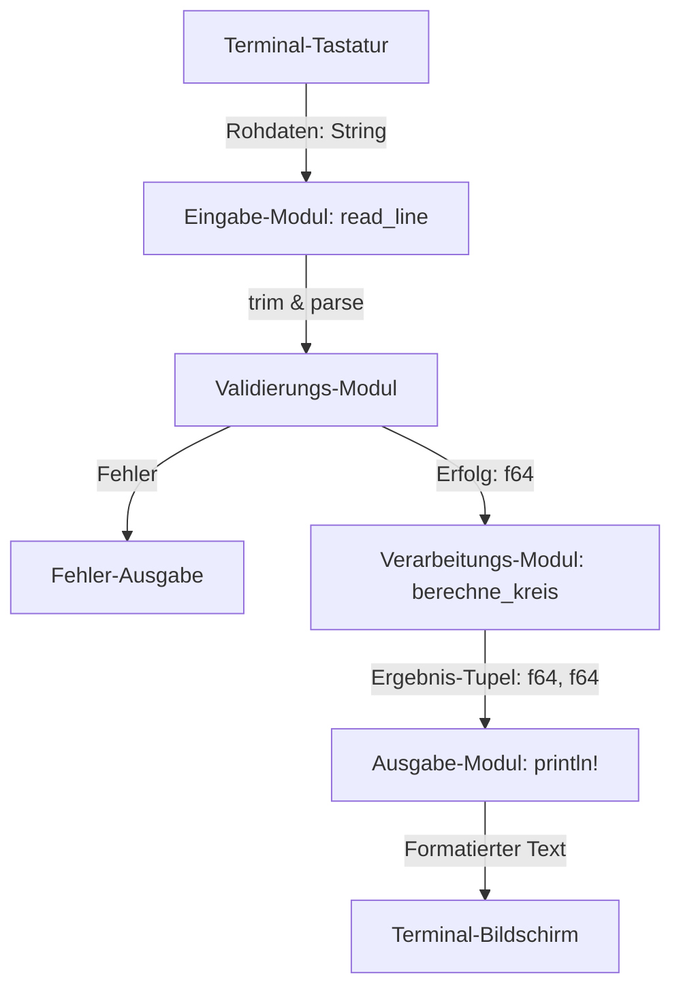

# Kapitel 7: Übungsprojekt (Terminal-Interaktion & Datenverarbeitung)

In diesem Kapitel führen wir Ihr erlerntes Wissen über Variablen, Datentypen und Zuweisungen in einem praxisnahen Übungsprojekt zusammen. Sie werden lernen, wie Sie ein interaktives Terminal-Programm von Grund auf planen, strukturieren und robust gegen Falscheingaben absichern. 

Dieses Kapitel baut die Brücke von der reinen Theorie hin zur praxisgerechten Anwendungsentwicklung unter Berücksichtigung bewährter Software-Architekturmuster.

---

## 1. Lernziele & Lernplan

### Lernziele
* **Sie können** den logischen Ablauf eines interaktiven Programms vor der eigentlichen Implementierung mithilfe von strukturiertem Pseudocode planen und beschreiben.
* **Sie können** das EVA-Prinzip (Eingabe, Verarbeitung, Ausgabe) auf Softwarearchitekturen anwenden und den Datenfluss innerhalb eines Rust-Programms sauber modularisieren.
* **Sie können** Benutzereingaben über den Standardeingabestrom (`std::io::stdin()`) sicher einlesen und potenzielle I/O-Fehler abfangen.
* **Sie können** rohe String-Daten mithilfe von `trim()` bereinigen und über die generische Methode `parse()` robust in numerische Datentypen konvertieren, ohne dass Fehleingaben zum Programmabsturz führen.
* **Sie können** das Zusammenspiel aus dem `Result`-Typ, Pattern Matching und Schleifen nutzen, um eine fehlertolerante Eingabe-Validierung zu realisieren.

### Lernplan
* [ ] **2. Die Definition**: Formale Begriffsbestimmung von Ablaufplanung, dem EVA-Prinzip und Terminal-I/O.
* [ ] **3. Das Problem & Die Motivation**: Warum ungefilterter Input in echten Programmen ein Sicherheits- und Stabilitätsrisiko darstellt.
* [ ] **4. Der naive Versuch**: Ein typischer, unvollständiger Code zum Einlesen und Konvertieren von Terminal-Eingaben.
* [ ] **5. Die Anatomie des Fehlers**: Analyse der Compiler-Meldungen und die Ursachen für Laufzeit-Panics bei Newlines.
* [ ] **6. Die Lösung**: Ein vollständiger, robuster Code mit sauberer Trennung nach dem EVA-Prinzip.
* [ ] **7. Kleines Tutorial**: Schritt-für-Schritt-Entwicklung eines interaktiven Kreisberechnungs-Werkzeugs.
* [ ] **8. Mentale Modelle & Deep Dive**:
  * **7.1 Systemarchitektur & Ablaufplanung**
    * **7.1.1 Pseudocode-Konstruktion**
    * **7.1.2 Das EVA-Prinzip**
  * **7.2 Praktische Implementierung**
    * **7.2.1 Terminal-I/O**
    * **7.2.2 Daten-Validierung**
* [ ] **9. Drei praktische Übungen**: Programmieraufgaben mit ansteigendem Schwierigkeitsgrad (Leicht, Mittel, Schwer) inklusive Hilfestellungen.
* [ ] **10. Lernstrategie, Selbsteinschätzung & Merkzettel**: Active Recall, Spickzettel, Fehlerprovokation und Selbsttest.
* [ ] **11. Zusammenfassung**: Kernpunkte auf einen Blick.

---

## 2. Die Definition

Bevor wir mit dem eigentlichen Projekt starten, definieren wir die grundlegenden Fachbegriffe, die für das Verständnis der Systemarchitektur und der praktischen Umsetzung unerlässlich sind:

* **Systemarchitektur & Ablaufplanung**: Die Strukturierung der Softwarekomponenten und des Kontrollflusses vor der eigentlichen Codierung. Eine solide Ablaufplanung visualisiert, in welcher Reihenfolge Daten eingelesen, verarbeitet und ausgegeben werden.
* **Pseudocode**: Eine sprachlich strukturierte, programmiersprachenunabhängige Beschreibung eines Algorithmus. Er dient dazu, die Logik eines Programms für Menschen lesbar zu machen, ohne sich um spezifische Syntax-Regeln kümmern zu müssen.
* **Das EVA-Prinzip**: Ein fundamentales Konzept der Informationstechnik. Es besagt, dass sich jedes Datenverarbeitungsprogramm in die drei Phasen **E**ingabe (Input), **V**erarbeitung (Processing) und **Ausgabe** (Output) unterteilen lässt. Diese Phasen sollten im Code streng voneinander getrennt werden.
* **Terminal-I/O**: Die Interaktion mit dem Anwender über die Befehlszeilenschnittstelle (Command Line Interface, CLI). Der Begriff bezeichnet das Einlesen von Tastatureingaben (Standard Input, `stdin`) und das Schreiben von Textausgaben in das Terminal-Fenster (Standard Output, `stdout`).
* **Daten-Validierung**: Der Prozess, bei dem eingehende, potenziell fehlerhafte Rohdaten überprüft, bereinigt und in einen für das System nutzbaren Zielzustand (z. B. einen numerischen Datentyp) überführt werden. Sie stellt die erste Schutzmauer gegen Laufzeitabstürze dar.

---

## 3. Das Problem & Die Motivation

In den vorherigen Kapiteln haben wir Variablen deklariert und mit Literalen (festen Werten im Code) gearbeitet. In realen Programmen stammen Daten jedoch fast nie aus dem Quellcode selbst, sondern werden zur Laufzeit von außen zugeführt – sei es durch Tastatureingaben, Dateien oder Netzwerkschnittstellen.

Das führt zu einer zentralen Herausforderung in der Softwareentwicklung: **Wir können den Eingaben des Benutzers niemals vertrauen.**

Wenn ein Programm beispielsweise eine Ganzzahl für eine mathematische Berechnung erwartet, gibt es keine Garantie dafür, dass der Anwender tatsächlich eine Zahl eingibt. Er könnte versehentlich Buchstaben eingeben, die Eingabetaste drücken, ohne etwas einzutippen, oder ungültige Sonderzeichen verwenden.

In vielen Programmiersprachen führt das unvorsichtige Einlesen solcher Daten zu undefiniertem Verhalten (Undefined Behavior) oder Sicherheitslücken (wie Buffer Overflows in C/C++). Rust verhindert diese kritischen Speicherfehler zwar durch sein Typsystem und strikte Laufzeitüberprüfungen, reagiert bei naiven Implementierungen jedoch mit einem sofortigen Programmabsturz (einer sogenannten *Panic*). 

Für den Endanwender ist ein abstürzendes Programm ein Zeichen mangelnder Qualität. Unsere Motivation ist es daher, ein Programm zu entwerfen, das:
1. Den Kontrollfluss logisch plant, um Sackgassen zu vermeiden.
2. Benutzereingaben liest, ohne zu blockieren oder abzustürzen.
3. Eingaben filtert, analysiert und Fehlermeldungen verständlich zurückgibt.
4. Erst nach erfolgreicher Validierung mit der Verarbeitung beginnt.

---

## 4. Der naive Versuch

Der folgende Code zeigt den naiven Versuch eines Anfängers, ein interaktives Programm zu schreiben, das eine Temperatur in Celsius über das Terminal einliest, in eine Fließkommazahl konvertiert, umrechnet und das Ergebnis ausgibt.

```rust
use std::io;

fn main() {
    println!("=== Celsius in Fahrenheit Konverter ===");
    println!("Bitte geben Sie die Temperatur in Celsius ein:");

    let mut input = String::new();
    
    // Naives Einlesen der Benutzereingabe
    io::stdin().read_line(&mut input);

    // Naives Konvertieren ohne Validierung
    let celsius: f64 = input.parse().unwrap();

    // Berechnung
    let fahrenheit = celsius * 1.8 + 32.0;

    // Ausgabe
    println!("Das Ergebnis lautet: {} °Fahrenheit", fahrenheit);
}
```

Wenn Sie diesen Code in einem Cargo-Projekt anlegen und mit `cargo run` ausführen, werden Sie feststellen, dass der Compiler zwar Warnungen ausgibt, das Programm aber startet. Sobald Sie jedoch eine Zahl eingeben und mit Enter bestätigen, stürzt das Programm abstürzen.

---

## 5. Die Anatomie des Fehlers

### Was sagt der Compiler?

Bereits beim Kompilieren des naiven Versuchs gibt der Rust-Compiler eine Warnung aus:

```text
warning: unused `Result` that must be used
  --> src/main.rs:10:5
   |
10 |     io::stdin().read_line(&mut input);
   |     ^^^^^^^^^^^^^^^^^^^^^^^^^^^^^^^^^
   = note: `#[warn(unused_must_use)]` on by default
   = note: this `Result` may be an `Err` variant, which should be handled
```

#### Erklärung der Warnung
Die Methode `read_line` gibt einen Wert vom Typ `Result<usize, std::io::Error>` zurück. Dieser signalisiert, ob das Einlesen vom Betriebssystem erfolgreich war oder ob ein Hardware- oder Stream-Fehler aufgetreten ist. Rust warnt uns nachdrücklich, dass wir dieses potenzielle Fehlersignal ignorieren.

---

### Was passiert zur Laufzeit?

Führen wir das Programm aus und geben die Zahl `25` ein, stürzt das Programm sofort nach dem Drücken der Enter-Taste ab:

```text
=== Celsius in Fahrenheit Konverter ===
Bitte geben Sie die Temperatur in Celsius ein:
25
thread 'main' panicked at src/main.rs:13:38:
called `Result::unwrap()` on an `Err` value: ParseFloatError { kind: Invalid }
note: run with `RUST_BACKTRACE=1` environment variable to display a backtrace
```

#### Warum stürzt das Programm ab?
Das Problem liegt im Speicherverhalten und der Funktionsweise von `read_line`.

1. **Das Zeilenumbruchzeichen (`\n`)**:
   Wenn Sie im Terminal `25` eintippen und die Enter-Taste drücken, sendet das Betriebssystem nicht nur die Zeichen `'2'` und `'5'`, sondern auch das Steuerzeichen für den Zeilenumbruch (Newline, unter Linux/macOS `\n` [ASCII-Wert 10], unter Windows `\r\n` [ASCII-Werte 13 und 10]).
2. **Die Pufferung**:
   Die Methode `read_line` liest alle Zeichen bis zum Newline-Zeichen ein und fügt sie inklusive des Newline-Zeichens an den übergebenen String-Puffer an. Im Heap-Speicher sieht unser String `input` nun wie folgt aus:
   
   ```text
   Heap-Speicheradresse des Strings:
   +---+---+----+
   |'2'|'5'|'\n'|
   +---+---+----+
     0   1   2   (Indizes)
   ```
   
3. **Das Scheitern von `parse`**:
   Die Methode `parse::<f64>()` versucht, den gesamten Inhalt des Strings in eine Fließkommazahl zu konvertieren. Die Zeichenkette `"25\n"` enthält jedoch das Steuerzeichen `\n`. Da ein Zeilenumbruch kein valides Zeichen für eine mathematische Zahl darstellt, schlägt die Konvertierung fehl. Sie gibt den Fehlerwert `Err(ParseFloatError)` zurück.
4. **Die ungeschützte Entpackung**:
   Der Aufruf von `.unwrap()` ist eine explizite Anweisung an die Laufzeitumgebung: *"Gib mir den erfolgreichen Wert. Wenn ein Fehler vorliegt, stürze sofort mit einer Panik ab!"* Da ein Fehler vorliegt, crasht das Programm unkontrolliert.

---

## 6. Die Lösung

Um diese Fehler robust zu beheben, müssen wir:
1. Das `Result` von `read_line` ordnungsgemäß behandeln.
2. Das störende Zeilenumbruchzeichen mit `trim()` entfernen.
3. Die Konvertierung mit `parse()` absichern, indem wir statt `.unwrap()` ein sicheres Pattern Matching verwenden.
4. Den Code strukturell in die Phasen Eingabe, Verarbeitung und Ausgabe aufteilen.

Hier ist die robuste Implementierung:

```rust
use std::io::{self, Write};

fn main() {
    println!("=== Robustes Celsius in Fahrenheit Konversions-Tool ===");

    // 1. EINGABE (Input)
    let raw_input = match read_terminal_input() {
        Ok(text) => text,
        Err(err) => {
            eprintln!("Kritischer I/O-Fehler beim Einlesen: {}", err);
            return;
        }
    };

    // 2. VERARBEITUNG (Processing)
    let celsius = match parse_celsius_value(&raw_input) {
        Ok(val) => val,
        Err(validation_error) => {
            eprintln!("Validierungsfehler: {}", validation_error);
            return;
        }
    };

    let fahrenheit = convert_celsius_to_fahrenheit(celsius);

    // 3. AUSGABE (Output)
    print_fahrenheit_result(celsius, fahrenheit);
}

/// Liest eine Zeile von der Standardeingabe ein und gibt sie zurück.
/// Behandelt I/O-Fehler des Betriebssystems.
fn read_terminal_input() -> Result<String, io::Error> {
    print!("Bitte geben Sie die Temperatur in Celsius ein: ");
    
    // Da print! standardmäßig zeilenweise puffert und keinen automatischen Zeilenumbruch erzeugt,
    // müssen wir stdout explizit leeren (flushen), damit der Text sofort angezeigt wird.
    io::stdout().flush()?;

    let mut buffer = String::new();
    
    // Der Fragezeichen-Operator reicht eventuelle I/O-Fehler direkt an den Aufrufer weiter
    io::stdin().read_line(&mut buffer)?;
    
    Ok(buffer)
}

/// Validiert und parst die rohe Eingabe.
/// Entfernt Whitespaces und prüft den numerischen Inhalt.
fn parse_celsius_value(input: &str) -> Result<f64, String> {
    // trim() entfernt führende/nachlaufende Whitespaces und Newlines (\n / \r\n)
    let cleaned = input.trim();

    if cleaned.is_empty() {
        return Err("Die Eingabe darf nicht leer sein.".to_string());
    }

    // Parsen in eine Fließkommazahl mit benutzerfreundlicher Fehlermeldung
    cleaned
        .parse::<f64>()
        .map_err(|_| format!("'{}' ist keine gültige Zahl. Bitte geben Sie z. B. '22' oder '15.5' ein.", cleaned))
}

/// Reine mathematische Berechnung ohne Seiteneffekte (Pure Function)
fn convert_celsius_to_fahrenheit(celsius: f64) -> f64 {
    celsius * 1.8 + 32.0
}

/// Formatiert und gibt das Ergebnis aus
fn print_fahrenheit_result(celsius: f64, fahrenheit: f64) {
    println!("{:.2} °Celsius entsprechen {:.2} °Fahrenheit.", celsius, fahrenheit);
}
```

### Zeile-für-Zeile-Analyse nach dem EVA-Prinzip

* **Eingabe (Input)**:
  Die Funktion `read_terminal_input` kapselt den I/O-Zugriff. Sie fordert den Benutzer zur Eingabe auf. Über `io::stdout().flush()?` stellen wir sicher, dass die Aufforderung im Terminal erscheint, bevor das Programm auf die Eingabe wartet. `read_line` schreibt den rohen Text in den Puffer. Eventuelle Betriebssystemfehler werden mit dem `?`-Operator nach oben gereicht.
* **Verarbeitung (Processing)**:
  * Die Validierung erfolgt in `parse_celsius_value`. Mit `input.trim()` wird der String bereinigt. Der resultierende Wert ist ein String-Slice (`&str`), der auf den bereinigten Heap-Bereich zeigt.
  * `cleaned.parse::<f64>()` versucht nun, die Bereinigung zu konvertieren. Schlägt dies fehl, wandelt `.map_err()` den Fehler in eine gut lesbare Fehlermeldung um.
  * In der `main`-Funktion wertet ein `match`-Ausdruck das Ergebnis aus. Bei einem Fehler bricht das Programm kontrolliert ab, statt abzustürzen.
  * Die Berechnung `convert_celsius_to_fahrenheit` arbeitet ausschließlich mit bereinigten Primitiven und besitzt keine Seiteneffekte (sie schreibt nicht in Terminals oder Dateien).
* **Ausgabe (Output)**:
  Die Funktion `print_fahrenheit_result` übernimmt die Darstellung. Mit `{:.2}` begrenzen wir die Fließkommazahlen-Ausgabe auf exakt zwei Nachkommastellen.

---

## 7. Kleines Tutorial: Entwicklung eines interaktiven Kreisrechners

Um die erlernten Konzepte in einer realistischen Praxisanwendung zu vertiefen, entwickeln wir nun Schritt für Schritt ein interaktives Kreisberechnungs-Werkzeug. Das Tool soll in einer Endlosschleife laufen und den Radius eines Kreises abfragen, um dessen Fläche und Umfang zu berechnen. Erst die Eingabe von `"exit"` beendet das Programm.

### Schritt 1: Das Projekt-Setup
Erstellen Sie ein neues Cargo-Projekt auf Ihrem System und wechseln Sie in das Verzeichnis:

```bash
cargo new --bin kreis_rechner
cd kreis_rechner
```

Öffnen Sie die Datei `src/main.rs` in Ihrem Editor.

### Schritt 2: Hilfsfunktion für die Terminal-Eingabe schreiben
Zuerst schreiben wir die Funktion, die das Einlesen und das Flushen von `stdout` übernimmt. Sie gibt das rohe Ergebnis zurück.

```rust
use std::io::{self, Write};

fn read_line(prompt: &str) -> String {
    print!("{}", prompt);
    io::stdout().flush().expect("Fehler beim Leeren des Puffers");

    let mut input = String::new();
    io::stdin()
        .read_line(&mut input)
        .expect("Fehler beim Lesen der Zeile");
    
    input
}
```

### Schritt 3: Berechnungslogik implementieren
Wir erstellen eine Strukturierte Logik für die Berechnungen. Da wir mit Kreisberechnungen arbeiten, nutzen wir die Konstante `std::f64::consts::PI` der Standardbibliothek.

```rust
fn berechne_kreis(radius: f64) -> (f64, f64) {
    let flaeche = std::f64::consts::PI * radius * radius;
    let umfang = 2.0 * std::f64::consts::PI * radius;
    (flaeche, umfang)
}
```

### Schritt 4: Die interaktive Programmschleife in `main`
Nun fügen wir die Schleife (`loop`) und die Validierung in der `main`-Funktion zusammen. Wenn der Benutzer eine ungültige Zahl eingibt, soll das Programm nicht abstürzen, sondern eine verständliche Fehlermeldung ausgeben und erneut fragen.

```rust
fn main() {
    println!("========================================");
    println!("       KREISBERECHNUNGS-WERKZEUG        ");
    println!("========================================");
    println!("Geben Sie einen Radius ein, um Fläche und");
    println!("Umfang zu berechnen. Tippen Sie 'exit',");
    println!("um das Programm zu beenden.");
    println!("----------------------------------------");

    loop {
        let input = read_line("\nRadius eingeben: ");
        let cleaned = input.trim();

        // Abbruchbedingung prüfen
        if cleaned.eq_ignore_ascii_case("exit") {
            println!("Programm beendet. Auf Wiedersehen!");
            break;
        }

        // Validierung und Parsing
        match cleaned.parse::<f64>() {
            Ok(radius) => {
                if radius < 0.0 {
                    eprintln!("Fehler: Der Radius darf nicht negativ sein!");
                    continue; // Springe zum nächsten Schleifendurchlauf
                }

                // Berechnung
                let (flaeche, umfang) = berechne_kreis(radius);

                // Ausgabe
                println!("-> Kreisfläche:  {:.4}", flaeche);
                println!("-> Kreisumfang:  {:.4}", umfang);
            }
            Err(_) => {
                eprintln!("Fehler: '{}' ist keine gültige Zahl!", cleaned);
            }
        }
    }
}
```

Starten Sie das Programm mit `cargo run`. Testen Sie Fehleingaben wie `"hallo"`, negative Zahlen oder die bloße Enter-Taste, um die Robustheit des Systems zu überprüfen.

---

## 8. Mentale Modelle & Deep Dive

Um ein tiefgreifendes Verständnis der Systemarchitektur und der I/O-Verarbeitung zu entwickeln, betrachten wir die technischen Hintergründe und das Speicherverhalten im Detail.

---

### 7.1 Systemarchitektur & Ablaufplanung

#### 7.1.1 Pseudocode-Konstruktion
Vor dem Schreiben von Code in einer komplexen Systemsprache wie Rust is es ratsam, den Algorithmus logisch im Kopf oder als Text zu strukturieren. Dies schützt Sie vor Logikfehlern (z. B. Deadlocks oder unendlichen Schleifen) und hilft, den Speicherfluss (Besitzverhältnisse) vorauszuplanen.

Der Ablauf unseres Kreisrechners lässt sich im folgenden standardisierten Pseudocode formulieren:

```text
SCHLEIFE (unendlich):
    SCHREIBE "Radius eingeben:" auf Bildschirm
    LIES Eingabe von Tastatur
    ENTFERNE Whitespaces von Eingabe
    
    WENN Eingabe gleich "exit" (Groß-/Kleinschreibung ignorieren):
        SCHREIBE "Programm beendet"
        BEENDE Schleife
        
    VERSUCHE Eingabe in Zahl (f64) umzuwandeln:
        ERFOLG (Zahl):
            WENN Zahl < 0:
                SCHREIBE "Fehler: Negativer Radius"
                WEITER mit nächstem Schleifendurchlauf
            SONST:
                Fläche = PI * Zahl * Zahl
                Umfang = 2 * PI * Zahl
                SCHREIBE Fläche und Umfang formatiert
        FEHLER:
            SCHREIBE "Fehler: Ungültige Zahl"
            WEITER mit nächstem Schleifendurchlauf
```

Dieser Pseudocode trennt den logischen Ablauf von der syntaktischen Komplexität Rusts (wie Fehlerbehandlung via `Result` oder Zeilenpuffer-Flushing).

---

#### 7.1.2 Das EVA-Prinzip
Das EVA-Prinzip ist eine Architektur-Richtlinie, die darauf abzielt, die Kopplung von Softwarekomponenten zu minimieren und die Kohäsion zu maximieren. 

* **Hohe Kohäsion**: Jede Funktion hat genau eine klar definierte Aufgabe (z. B. *nur* Berechnen oder *nur* Einlesen).
* **Lose Kopplung**: Die Komponenten wissen so wenig wie möglich voneinander. Die Berechnungsfunktion benötigt keine Kenntnis darüber, ob die Daten aus dem Terminal, einer Netzwerkverbindung oder einer Textdatei stammen.

##### Visualisierung des Datenflusses:



Dieses Design macht Ihren Code testbar. Da das Verarbeitungsmodul eine reine Funktion (Pure Function) ist, können Sie Unit-Tests dafür schreiben, ohne Tastatureingaben simulieren zu müssen.

---

### 7.2 Praktische Implementierung

#### 7.2.1 Terminal-I/O

Das Betriebssystem stellt dem ausgeführten Prozess drei Standard-Datenströme (Streams) zur Verfügung:
1. `stdin` (Standard Input, Filedeskriptor 0)
2. `stdout` (Standard Output, Filedeskriptor 1)
3. `stderr` (Standard Error, Filedeskriptor 2)

In Rust greifen wir über das Modul `std::io` auf diese Ströme zu.

##### Pufferung (Buffering)
Die Ausgabe auf den Bildschirm ist eine vergleichsweise langsame Systemoperation. Um die Performance zu optimieren, puffert das Betriebssystem Ausgaben in `stdout`. Das bedeutet: Ein Aufruf von `print!` schreibt den Text nicht direkt auf den Monitor, sondern sammelt die Daten in einem internen Speicherbereich (Puffer). Der Puffer wird erst geleert und auf den Bildschirm geschrieben, wenn:
* Ein Newline-Zeichen (`\n`) ausgegeben wird (Zeilenpufferung).
* Der Puffer voll ist.
* Der Puffer explizit durch `flush()` geleert wird.

Da wir bei interaktiven Abfragen (z. B. `Radius eingeben: `) keinen Zeilenumbruch erzeugen möchten (damit der Benutzer in derselben Zeile tippen kann), müssen wir `io::stdout().flush()` manuell aufrufen.

---

#### 7.2.2 Daten-Validierung

##### Die Methode `trim()`
Die Methode `trim()` ist auf dem Typ `str` definiert. Sie sucht nach Unicode-Whitespaces (Leerzeichen, Tabulatoren, Newlines wie `\n` und `\r\n`) am Anfang und Ende des Strings und gibt ein String-Slice (`&str`) zurück, das diesen Bereich ausschneidet.

> [!IMPORTANT]
> `trim()` kopiert keine Daten im Speicher! Es erzeugt lediglich einen neuen Fat Pointer auf dem Stack, dessen Startadresse hinter die führenden Whitespaces verschoben wurde und dessen Länge um die überflüssigen Zeichen gekürzt ist. Dies ist eine hocheffiziente Zero-Cost-Abstraktion.

##### Die generische Methode `parse()`
Die Signatur von `parse` in der Standardbibliothek lautet:

```rust
pub fn parse<F: FromStr>(&self) -> Result<F, F::Err>
```

Da `parse` generisch über dem Rückgabetyp `F` ist (wobei `F` das Trait `FromStr` implementieren muss), weiß die Methode zunächst nicht, in welchen Typ sie konvertieren soll. Wir müssen dies dem Compiler mitteilen. Dies kann auf zwei Arten geschehen:

1. **Durch explizite Typannotation**:
   ```rust
   let val: f64 = cleaned.parse().unwrap();
   ```
2. **Durch den Turbofisch-Operator `::<T>`**:
   ```rust
   let val = cleaned.parse::<f64>().unwrap();
   ```

Der Turbofisch-Operator ist in Ausdrücken oft lesbarer, da er den Typ direkt an die Methode bindet.

---

### Exhaustive API-Referenz der beteiligten Standardbibliotheksmethoden

Um Ihnen die Arbeit mit Terminal-I/O und Validierung zu erleichtern, sind im Folgenden alle relevanten Funktionen und Methoden der Standardbibliothek detailliert dokumentiert.

#### 1. `std::io::stdin`
* **Signatur**: `pub fn stdin() -> Stdin`
* **Beschreibung**: Erstellt ein neues Handle auf den Standard-Eingabestrom des aktuellen Prozesses. Das Handle ist thread-sicher und intern gepuffert.
* **Parameter**: Keine.
* **Rückgabetyp**: `std::io::Stdin` (Struktur, die das Handle repräsentiert).
* **Panics**: Keine.
* **Kurzbeispiel**:
  ```rust
  let stdin_handle = std::io::stdin();
  ```

#### 2. `std::io::Stdin::read_line`
* **Signatur**: `pub fn read_line(&self, buf: &mut String) -> Result<usize, std::io::Error>`
* **Beschreibung**: Liest alle Bytes aus dem Standard-Eingabestrom bis zum Zeilenumbruch (`\n`) ein und hängt sie an den übergebenen String-Puffer an. Das Zeilenumbruchzeichen selbst wird ebenfalls in den Puffer geschrieben.
* **Parameter**:
  * `buf: &mut String`: Eine veränderbare Referenz auf einen String-Puffer. Wichtig: Die Daten werden *angehängt*. Wenn Sie den Puffer wiederverwenden möchten, müssen Sie ihn vorher mit `.clear()` leeren.
* **Rückgabetyp**: `Result<usize, std::io::Error>`. Im Erfolgsfall (`Ok(n)`) wird die Anzahl der gelesenen Bytes (inklusive des Newline-Zeichens) zurückgegeben. Bei einem I/O-Fehler wird `Err` zurückgegeben.
* **Panics**: Panickt, wenn die eingelesenen Bytes keine gültige UTF-8-Zeichenkette ergeben.
* **Kurzbeispiel**:
  ```rust
  let mut input = String::new();
  std::io::stdin().read_line(&mut input).unwrap();
  ```

#### 3. `std::io::stdout`
* **Signatur**: `pub fn stdout() -> Stdout`
* **Beschreibung**: Erstellt ein Handle auf den Standard-Ausgabestrom des aktuellen Prozesses.
* **Parameter**: Keine.
* **Rückgabetyp**: `std::io::Stdout` (Struktur, die das Ausgabe-Handle repräsentiert).
* **Panics**: Keine.
* **Kurzbeispiel**:
  ```rust
  let stdout_handle = std::io::stdout();
  ```

#### 4. `std::io::Write::flush`
* **Signatur**: `fn flush(&mut self) -> Result<(), std::io::Error>`
* **Beschreibung**: Zwingt den gepufferten Ausgabestrom, alle zwischengespeicherten Bytes sofort an das Zielmedium (hier: das Terminal) zu schreiben.
* **Parameter**: `&mut self` (Das veränderbare Ausgabe-Handle).
* **Rückgabetyp**: `Result<(), std::io::Error>`. `Ok(())` bei Erfolg, `Err` bei Schreibfehlern.
* **Panics**: Keine.
* **Kurzbeispiel**:
  ```rust
  use std::io::Write;
  std::io::stdout().flush().unwrap();
  ```

#### 5. `str::trim`
* **Signatur**: `pub fn trim(&self) -> &str`
* **Beschreibung**: Entfernt alle führenden und nachlaufenden Whitespaces (Leerzeichen, Tabs, Newlines) aus dem String-Slice.
* **Parameter**: `&self` (Die Referenz auf den zu bereinigenden String).
* **Rückgabetyp**: `&str` (Ein neues String-Slice, das auf den bereinigten Ausschnitt zeigt).
* **Panics**: Keine.
* **Kurzbeispiel**:
  ```rust
  let text = "  hallo \n";
  assert_eq!(text.trim(), "hallo");
  ```

#### 6. `str::parse`
* **Signatur**: `pub fn parse<F: FromStr>(&self) -> Result<F, F::Err>`
* **Beschreibung**: Konvertiert ein String-Slice in einen anderen Datentyp, sofern dieser das `FromStr`-Trait implementiert.
* **Parameter**: `&self` (Die Referenz auf das zu parsende String-Slice).
* **Rückgabetyp**: `Result<F, F::Err>`. Gibt bei Erfolg den konvertierten Typ in der `Ok`-Variante zurück, andernfalls den spezifischen Parsing-Fehler in der `Err`-Variante.
* **Panics**: Keine. Die Fehlerbehandlung erfolgt explizit über den Rückgabetyp.
* **Kurzbeispiel**:
  ```rust
  let number: i32 = "42".parse().unwrap();
  ```

---

## 9. Drei praktische Übungen

### Übung 1 (Leicht): Absicherung des absoluten Nullpunkts
* **Aufgabe**: Erweitern Sie den korrekten Celsius-Fahrenheit-Konverter aus **Abschnitt 6** so, dass er keine Temperaturen unter dem absoluten Nullpunkt von `-273.15 °C` akzeptiert.
* **Anforderungen**:
  * Unterschreitet der eingegebene Wert diesen Grenzwert, soll eine verständliche Fehlermeldung ausgegeben und das Programm beendet werden.
  * Verwenden Sie für die Grenzwertprüfung eine Konstante `ABSOLUTER_NULLPUNKT: f64 = -273.15;`.
* **Lösungshinweis (Hint)**: Fügen Sie in `parse_celsius_value` oder nach dem Erhalt des Werts in `main` eine `if`-Bedingung ein, die prüft, ob `celsius < ABSOLUTER_NULLPUNKT` gilt, und geben Sie in diesem Fall ein `Err(..)` zurück.

---

### Übung 2 (Mittel): Robustes Währungsumrechnungs-Tool
* **Aufgabe**: Schreiben Sie ein interaktives CLI-Programm, das den Benutzer nach einem Euro-Betrag fragt, diesen in US-Dollar umrechnet und das Ergebnis ausgibt.
* **Anforderungen**:
  * Der Wechselkurs soll im Code als Konstante definiert sein (z. B. `EUR_TO_USD: f64 = 1.08;`).
  * Die Eingabe muss robust validiert werden. Leere Eingaben, negative Beträge sowie ungültige Zeichen müssen abgefangen werden.
  * Bei einer Falscheingabe soll das Programm nicht abbrechen, sondern den Benutzer in einer Schleife so lange erneut nach dem Betrag fragen, bis er einen validen Wert eingibt.
* **Lösungshinweis (Hint)**: Nutzen Sie eine `loop`-Schleife. Wenn die Validierung fehlschlägt, geben Sie die Fehlermeldung aus und rufen Sie `continue` auf, um die Schleife von vorne zu starten. Erst bei einer erfolgreichen Validierung weisen Sie das Ergebnis einer Variablen zu und brechen die Schleife mit `break` ab.

---

### Übung 3 (Schwer): Der Mini-Taschenrechner
* **Aufgabe**: Erstellen Sie einen interaktiven Rechner, der drei separate Eingaben vom Benutzer über das Terminal einliest:
  1. Die erste Zahl (Fließkommazahl)
  2. Den mathematischen Operator (als Zeichen: `+`, `-`, `*`, `/`)
  3. Die zweite Zahl (Fließkommazahl)
* **Anforderungen**:
  * Alle drei Eingaben müssen nacheinander robust eingelesen und validiert werden.
  * Bei der Division muss geprüft werden, ob die zweite Zahl `0.0` ist. Falls ja, muss das Programm die Berechnung mit einer Fehlermeldung verweigern, anstatt ein mathematisches Unendlich (`Infinity`) auszugeben oder abzustürzen.
  * Nutzen Sie das EVA-Prinzip. Trennen Sie I/O, Validierung und mathematische Berechnung strikt in separate Funktionen.
* **Lösungshinweis (Hint)**: 
  * Für den Operator können Sie den Typ `char` parsen oder direkt auf dem bereinigten `&str` arbeiten. 
  * Verwenden Sie ein `match` auf dem Operator, um die jeweilige Berechnung auszuführen:
    ```rust
    match operator {
        '+' => Ok(num1 + num2),
        // ...
        '/' => if num2 == 0.0 { Err("Division durch Null!") } else { Ok(num1 / num2) }
        _ => Err("Ungültiger Operator!")
    }
    ```

---

## 10. Lernstrategie, Selbsteinschätzung & Merkzettel

### Spickzettel (Cheat Sheet)

| Aktion | Rust-Syntax | Beschreibung |
| :--- | :--- | :--- |
| **I/O-Handle holen** | `let stdin = std::io::stdin();` | Erstellt ein Handle auf die Standardeingabe. |
| **Zeile einlesen** | `stdin.read_line(&mut buffer);` | Schreibt Terminal-Eingabe inkl. `\n` in den Puffer. |
| **Stdout leeren** | `std::io::stdout().flush();` | Zwingt das Terminal, gepufferten Text sofort anzuzeigen. |
| **Whitespace entfernen** | `let cleaned = input.trim();` | Schneidet Newlines, Tabs und Leerzeichen ab (Zero-Cost). |
| **Typ konvertieren** | `let num = cleaned.parse::<f64>();` | Konvertiert einen String in ein `f64`. Gibt ein `Result` zurück. |

---

### Active Recall (Verständnisfragen)
1. **Frage**: Warum führt die Eingabe von `"10"` bei einem naiven `read_line` und direktem `parse` ohne `trim` zu einem Fehler?
   * *Antwort*: Weil `read_line` das Zeilenumbruchzeichen (`\n` bzw. `\r\n`) im String belässt und `parse` dieses Zeichen nicht in eine Zahl konvertieren kann.
2. **Frage**: Warum müssen wir nach einem `print!`-Aufruf ohne Newline oft `flush()` aufrufen?
   * *Antwort*: Weil Standard-Ausgabeströme zeilenweise gepuffert werden und der Text ohne Newline erst auf dem Bildschirm erscheint, wenn der Puffer geleert wird.
3. **Frage**: Was ist der Unterschied im Speicher zwischen `input` (Typ `String`) und dem Rückgabewert von `input.trim()` (Typ `&str`)?
   * *Antwort*: `String` besitzt den Speicher auf dem Heap (24 Bytes auf dem Stack). `&str` is ein Fat Pointer (16 Bytes auf dem Stack), der auf einen Teilbereich desselben Heap-Speichers zeigt, ohne Daten zu kopieren.

---

### Feynman-Methode
Erklären Sie einem Programmier-Anfänger in drei einfachen Sätzen, warum Rust uns zwingt, beim Parsen einer Zahl mit dem Typ `Result` zu arbeiten, anstatt uns direkt die Zahl zurückzugeben.

---

### Gezielte Fehlerprovokation (Compiler-Guided Learning)
Nehmen Sie den funktionierenden Lösungscode aus **Abschnitt 6** und entfernen Sie in der Funktion `parse_celsius_value` den Aufruf `.trim()`. Starten Sie das Programm mit `cargo run` und geben Sie eine gültige Zahl ein. Beobachten Sie die Ausgabe und analysieren Sie, wie der Validierungsfehler nun ausgelöst wird.

---

### Metakognitiver Selbsttest
Wechseln Sie erst zu Kapitel 8, wenn Sie:
* [ ] Verstanden haben, warum `read_line` einen String mutiert, statt ihn als Rückgabetyp zu liefern.
* [ ] Den Unterschied zwischen I/O-Fehlern (z. B. Stream abgebrochen) und Validierungsfehlern (z. B. Text statt Zahl eingegeben) erklären können.
* [ ] In der Lage sind, eine Eingabeschleife zu schreiben, die den Benutzer so lange nach Daten fragt, bis die Eingabe gültig ist.

---

## 11. Zusammenfassung

* **Systemarchitektur** beginnt vor dem Code. Pseudocode hilft, logische Verzweigungen zu strukturieren und das Ownership-Modell im Voraus zu planen.
* Das **EVA-Prinzip** (Eingabe, Verarbeitung, Ausgabe) sorgt für sauberen Code. Logik (Berechnungen) sollte niemals direkt mit I/O-Operationen vermischt werden.
* **Terminal-I/O** liest über `stdin().read_line` immer auch den Zeilenumbruch (`\n` oder `\r\n`) mit ein.
* Die Methode **`trim()`** ist unverzichtbar, um diese Steuerzeichen effizient (ohne Kopier-Overhead) zu entfernen.
* Die Methode **`parse()`** benötigt eine explizite Typangabe (oder den Turbofisch `parse::<T>()`) und gibt immer ein `Result` zurück, um Parsing-Fehler sicher abzufangen.

---
**Lizenz- und Attributionshinweis**:
Teile dieses Kapitels basieren auf Übersetzungen und didaktischen Anpassungen des offiziellen Buches [The Rust Programming Language](https://doc.rust-lang.org/book/) von Steve Klabnik und Carol Nichols (sowie Beiträgen der Rust-Community), lizenziert unter [MIT](https://opensource.org/licenses/MIT) und [Apache 2.0](https://www.apache.org/licenses/LICENSE-2.0).