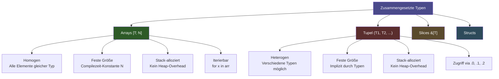
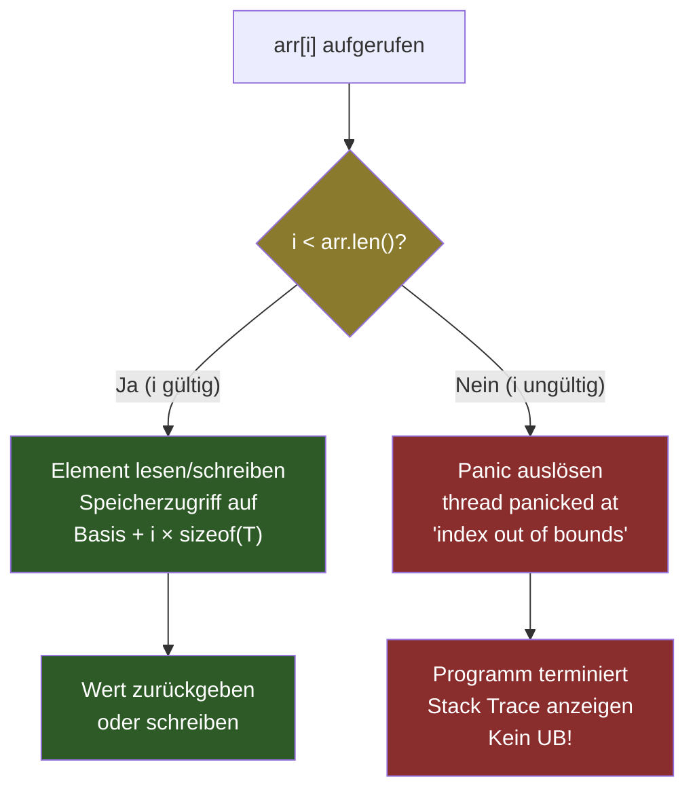
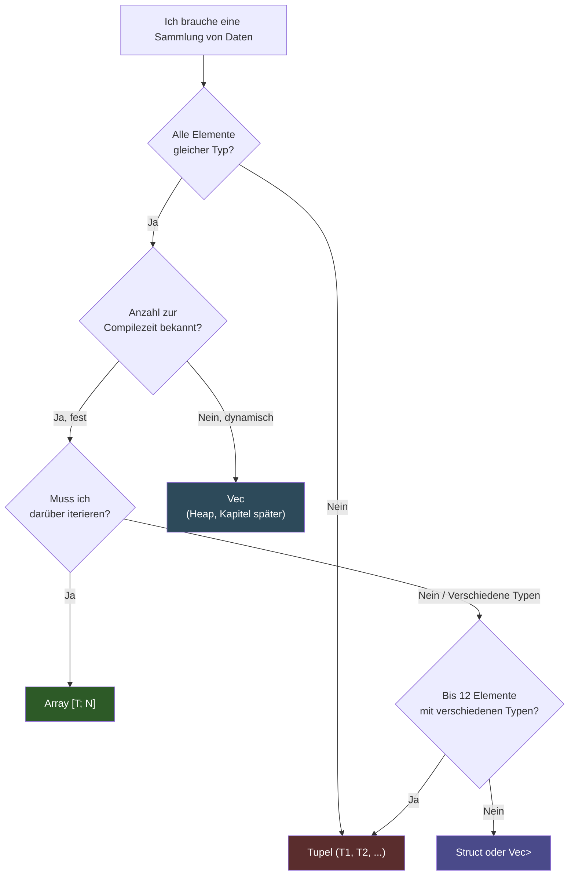
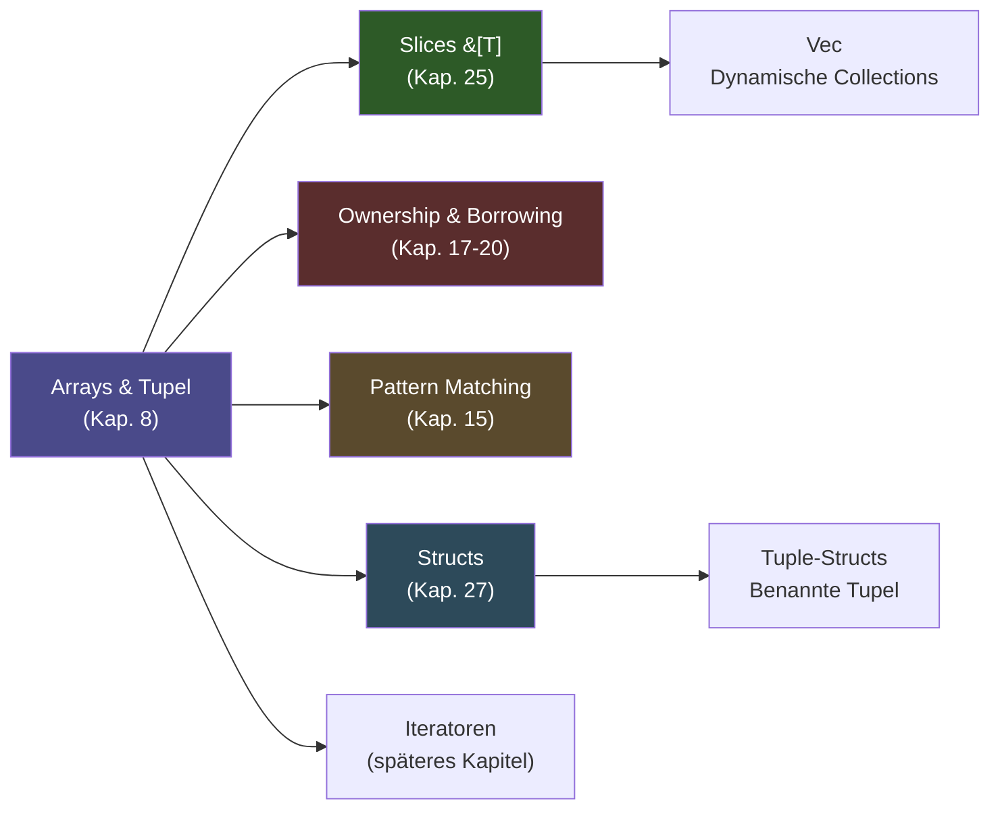

# Kapitel 8: Arrays & Tupel – Zusammengesetzte Datenstrukturen auf dem Stack

> [!IMPORTANT]
> Dieses Kapitel behandelt zwei der fundamentalsten zusammengesetzten Datenstrukturen in Rust: Arrays `[T; N]` und Tupel `(T1, T2, ...)`. Beide leben auf dem **Stack**, haben eine zur **Compilezeit bekannte Größe** und sind das Rückgrat vieler Rust-Programme. Das Verständnis dieser Typen ist Voraussetzung für alle weiteren Kapitel über Ownership, Slices und Collections.

---

## Inhaltsverzeichnis

1. [Lernziele & Lernplan](#1-lernziele--lernplan)
2. [Die Definition – Arrays und Tupel formal erklärt](#2-die-definition--arrays-und-tupel-formal-erklärt)
3. [Das Problem & Die Motivation](#3-das-problem--die-motivation)
4. [Der naive Versuch – Häufige Anfängerfehler](#4-der-naive-versuch--häufige-anfängerfehler)
5. [Die Anatomie des Fehlers](#5-die-anatomie-des-fehlers)
6. [Die Lösung – Korrekter Code für Arrays und Tupel](#6-die-lösung--korrekter-code-für-arrays-und-tupel)
7. [Kleines Tutorial – Matrix und RGB-Farbe](#7-kleines-tutorial--matrix-und-rgb-farbe)
8. [Mentale Modelle & Deep Dive](#8-mentale-modelle--deep-dive)
9. [Drei Übungen](#9-drei-übungen)
10. [Lernstrategie & Merkzettel](#10-lernstrategie--merkzettel)
11. [Zusammenfassung](#11-zusammenfassung)

---

## 1. Lernziele & Lernplan

### 1.1 Lernziele nach Bloom's Taxonomie

Die folgende Tabelle zeigt Ihre Lernziele für dieses Kapitel, geordnet nach der Bloom'schen Taxonomie – von einfachem Erinnern bis hin zu komplexer Analyse und Anwendung:

| Stufe | Lernziel |
|-------|----------|
| **Erinnern** (Remember) | Sie können die Syntaxformen `[T; N]` und `(T1, T2)` auswendig nennen und den Unterschied zwischen homogenen und heterogenen Typen definieren. |
| **Verstehen** (Understand) | Sie können erklären, warum Rust bei einem Array-Zugriff mit ungültigem Index zur Laufzeit einen `panic!` auslöst statt undefiniertes Verhalten (UB) zu erlauben, und diesen Mechanismus mit C-Arrays vergleichen. |
| **Anwenden** (Apply) | Sie sind in der Lage, eigene Programme zu schreiben, die Arrays für homogene Datensätze (z. B. Tagestemperaturen) und Tupel für heterogene Rückgabewerte (z. B. `(Quotient, Rest)`) korrekt einsetzen, einschließlich Destrukturierung und Pattern Matching. |
| **Analysieren** (Analyze) | Sie können das Speicherlayout von Arrays und Tupeln auf dem Stack analysieren, die Größe berechnen und entscheiden, wann ein Array, wann ein Tupel und wann eine andere Datenstruktur die bessere Wahl ist. |

### 1.2 Roadmap & Lerncheckliste

Nutzen Sie die folgende Checkliste, um Ihren Lernfortschritt zu verfolgen. Haken Sie jede Aufgabe ab, sobald Sie sie vollständig verstanden haben:

```
LERNCHECKLISTE – Kapitel 8: Arrays & Tupel
==========================================

ARRAYS [T; N]
[ ] Ich kann ein Array mit explizitem Typ deklarieren: let arr: [i32; 5] = [1,2,3,4,5];
[ ] Ich kann die Kurzschreibweise anwenden: let zeros = [0; 10];
[ ] Ich verstehe, warum N eine Compilezeit-Konstante sein muss
[ ] Ich kann auf Elemente mit arr[index] zugreifen
[ ] Ich kenne den Unterschied zwischen arr[i] und arr.get(i)
[ ] Ich weiß, was bei einem ungültigen Index passiert (panic! vs UB in C)
[ ] Ich kann über ein Array iterieren (for, iter(), enumerate())
[ ] Ich kann mehrdimensionale Arrays deklarieren und verwenden
[ ] Ich kenne die wichtigsten Array-Methoden

TUPEL (T1, T2, ...)
[ ] Ich kann ein Tupel deklarieren: let t: (i32, f64, bool) = (42, 3.14, true);
[ ] Ich kann auf Tupel-Elemente zugreifen: t.0, t.1, t.2
[ ] Ich kann ein Tupel destrukturieren: let (a, b, c) = t;
[ ] Ich verstehe das Unit-Tupel () und seinen Einsatz
[ ] Ich kann Tupel als Funktions-Rückgabewerte verwenden
[ ] Ich kenne Tupel-Structs als Vorschau

VERGLEICH & ENTSCHEIDUNG
[ ] Ich kann begründen, wann ich ein Array und wann ein Tupel verwende
[ ] Ich kann beide Typen in einem echten Programm kombinieren
```

### 1.3 Voraussetzungen

Bevor Sie mit diesem Kapitel beginnen, stellen Sie sicher, dass Sie folgende Themen aus den vorherigen Kapiteln beherrschen:

- **Kapitel 5 & 6**: Variablen, Shadowing, skalare Typen (`i32`, `f64`, `bool`, `char`)
- **Kapitel 10**: Funktionen und Rückgabewerte
- **Kapitel 15**: Kontrollstrukturen (`if`, `loop`, `while`, `for`)

> [!NOTE]
> Dieses Kapitel baut direkt auf Kapitel 6 (Skalare & zusammengesetzte Typen) auf. Dort haben Sie bereits eine kurze Einführung erhalten. Hier vertiefen wir jeden Aspekt erheblich und behandeln Themen wie Bounds-Checking, Speicherlayout und Pattern Matching ausführlich.

---

## 2. Die Definition – Arrays und Tupel formal erklärt

### 2.1 Was ist ein Array in Rust?

Ein **Array** in Rust ist eine geordnete, **homogene** Sammlung von Elementen **fester Länge**, die vollständig auf dem **Stack** gespeichert wird. Die Typsignatur lautet:

```
[T; N]
```

Hierbei gilt:
- `T` ist der **Elementtyp** – jedes Element im Array hat exakt diesen Typ.
- `N` ist die **Anzahl der Elemente** – eine nicht-negative ganze Zahl, die zur **Compilezeit** bekannt sein muss.

Die Typsignatur `[i32; 5]` beschreibt zum Beispiel ein Array von genau fünf 32-Bit-Ganzzahlen. Der Typ `[i32; 5]` und der Typ `[i32; 6]` sind in Rust **zwei völlig verschiedene Typen** – das ist ein fundamentaler Unterschied zu vielen anderen Sprachen!

### 2.2 Was ist ein Tupel in Rust?

Ein **Tupel** in Rust ist eine geordnete, **heterogene** Sammlung von Elementen **fester Länge**, die ebenfalls auf dem **Stack** gespeichert wird. Die Typsignatur lautet:

```
(T1, T2, T3, ...)
```

Hierbei gilt:
- Jedes Element kann einen **anderen Typ** haben.
- Die Reihenfolge der Typen ist Teil der Typsignatur.
- `(i32, f64, bool)` und `(f64, i32, bool)` sind zwei verschiedene Typen!

### 2.3 Formale Gegenüberstellung

| Eigenschaft | Array `[T; N]` | Tupel `(T1, T2, ...)` |
|-------------|-----------------|----------------------|
| **Homogenität** | Homogen (alle Elemente gleicher Typ) | Heterogen (verschiedene Typen möglich) |
| **Größe** | Compilezeit-Konstante `N` | Compilezeit-bekannt, implizit durch Typen |
| **Indexierung** | `arr[0]`, `arr[1]`, ... (dynamisch) | `t.0`, `t.1`, ... (Compilezeit-Literal) |
| **Speicherort** | Stack (immer) | Stack (immer) |
| **Iterierbar** | Ja, mit `for x in arr` | Nein, direkt nicht iterierbar |
| **Verwendung** | Homogene Daten gleicher Anzahl | Heterogene Rückgabewerte, Paare, Tripel |

> [!NOTE]
> Beide Typen – Array und Tupel – haben in Rust eine zur **Compilezeit bekannte Größe**. Das macht sie zu sogenannten **Sized Types** (implementieren das `Sized`-Trait). Dynamische Collections wie `Vec<T>` hingegen sind heap-alloziert und zur Compilezeit unbekannter Größe.

### 2.4 Die Typsignaturen im Detail

#### Array-Typsignatur `[T; N]`

```rust
// Vollständige Typsignatur-Notation:
// [ElementTyp; AnzahlElemente]

let zahlen: [i32; 5] = [10, 20, 30, 40, 50];
//          ^^^^^^^^
//          Typ: Array mit 5 Elementen vom Typ i32

let booleans: [bool; 3] = [true, false, true];
//            ^^^^^^^^^
//            Typ: Array mit 3 Elementen vom Typ bool

let texte: [&str; 4] = ["Montag", "Dienstag", "Mittwoch", "Donnerstag"];
//         ^^^^^^^^^
//         Typ: Array mit 4 String-Referenzen
```

**Wichtig:** Die Zahl `N` in `[T; N]` ist kein Wert, sondern ein **Typ-Parameter**. `[i32; 5]` ist ein anderer Typ als `[i32; 6]`. Sie können eine Funktion, die `[i32; 5]` erwartet, nicht mit `[i32; 6]` aufrufen.

#### Tupel-Typsignatur `(T1, T2, ...)`

```rust
// Vollständige Typsignatur-Notation:
// (Typ1, Typ2, Typ3, ...)

let person: (i32, &str, bool) = (42, "Alice", true);
//          ^^^^^^^^^^^^^^^^^^^
//          Typ: Tupel aus i32, &str und bool

let koordinate: (f64, f64) = (3.14, 2.71);
//              ^^^^^^^^^^
//              Typ: Paar aus zwei f64-Werten

let einzeln: (i32,) = (42,);
//           ^^^^^^
//           Typ: Einzel-Tupel (das Komma am Ende ist wichtig!)
```

> [!TIP]
> Ein Einzel-Tupel `(42,)` unterscheidet sich durch das Komma von einem einfachen Ausdruck in Klammern `(42)`. Ohne das Komma wäre `(42)` einfach die Zahl `42` in Klammern, kein Tupel!

---

## 3. Das Problem & Die Motivation

### 3.1 Warum brauchen wir zusammengesetzte Datenstrukturen?

Stellen Sie sich vor, Sie schreiben ein Programm, das die Tagestemperaturen einer Woche verarbeitet. Ohne Arrays müssten Sie sieben separate Variablen deklarieren:

```rust
fn main() {
    // Ohne Arrays: Sieben separate Variablen – unpraktisch und fehleranfällig!
    let temp_montag: f64 = 18.5;
    let temp_dienstag: f64 = 21.0;
    let temp_mittwoch: f64 = 19.3;
    let temp_donnerstag: f64 = 22.1;
    let temp_freitag: f64 = 23.7;
    let temp_samstag: f64 = 20.4;
    let temp_sonntag: f64 = 17.8;

    // Wie berechnet man jetzt den Durchschnitt?
    // Wir müssen alle sieben Variablen manuell addieren!
    let summe = temp_montag + temp_dienstag + temp_mittwoch
              + temp_donnerstag + temp_freitag + temp_samstag
              + temp_sonntag;
    let durchschnitt = summe / 7.0;
    println!("Durchschnittstemperatur: {:.1}°C", durchschnitt);
}
```

Dieses Vorgehen hat mehrere **schwerwiegende Probleme**:

1. **Skalierbarkeit**: Was, wenn Sie ein ganzes Jahr (365 Tage) verarbeiten müssen? 365 separate Variablen sind unmöglich zu warten.
2. **Keine Iteration**: Sie können nicht über separate Variablen mit einer Schleife iterieren.
3. **Fehleranfälligkeit**: Bei 365 Variablen können leicht Tippfehler entstehen.
4. **Keine Übergabe**: Wie übergeben Sie 365 Variablen an eine Funktion?

### 3.2 Das Problem mit heterogenen Daten

Ein weiteres Problem entsteht, wenn Sie zusammengehörige Daten verschiedener Typen gemeinsam verwalten möchten. Stellen Sie sich vor, eine Funktion soll sowohl den Quotienten als auch den Rest einer Division zurückgeben. In Sprachen ohne Tupel bräuchten Sie Ausgabeparameter oder globale Variablen:

```rust
// Problem: Wie gibt man zwei Werte zurück?
// Ansatz 1: Nur einen Wert zurückgeben (unvollständig)
fn dividiere_nur_quotient(a: i32, b: i32) -> i32 {
    a / b  // Den Rest verlieren wir!
}

// Ansatz 2: Globale Variablen (sehr schlechter Stil!)
static mut LETZTER_REST: i32 = 0;

fn dividiere_mit_global(a: i32, b: i32) -> i32 {
    unsafe {
        LETZTER_REST = a % b;
    }
    a / b
}
```

Beide Ansätze sind unbefriedigend. Tupel lösen dieses Problem elegant.

### 3.3 Warum Stack statt Heap?

Arrays und Tupel werden auf dem **Stack** gespeichert. Das hat wichtige Konsequenzen, die Sie verstehen sollten:

**Stack-Vorteile:**
- **Extrem schnelle Allokation**: Einen Stack-Frame zu erweitern ist eine einzige CPU-Instruktion (Stackpointer verschieben).
- **Kein Garbage Collector nötig**: Stack-Daten werden automatisch freigegeben, wenn die Funktion endet.
- **Cache-freundlich**: Stack-Daten liegen dicht beieinander im Speicher (hohe Cache-Lokalität).
- **Keine Fragmentierung**: Stack wächst und schrumpft linear.

**Stack-Einschränkungen:**
- **Feste Größe zur Compilezeit**: Die Größe muss bekannt sein, bevor das Programm läuft.
- **Begrenzte Gesamtgröße**: Ein typischer Stack ist 1–8 MB groß (konfigurierbar). Sehr große Arrays können einen Stack Overflow verursachen.

> [!WARNING]
> Deklarieren Sie keine sehr großen Arrays auf dem Stack! Ein Array `[i32; 1_000_000]` würde 4 MB Stack-Speicher belegen. Für große Datenmengen verwenden Sie `Vec<T>`, das auf dem Heap lebt.

### 3.4 Rust vs. C: Das Safety-Argument

In der Sprache C ist ein Array lediglich ein **Zeiger auf den ersten Speicherbereich**. Der Zugriff mit einem Index außerhalb der Grenzen ist **undefiniertes Verhalten (Undefined Behavior, UB)** – das Programm kann abstürzen, falsche Ergebnisse liefern oder – am gefährlichsten – scheinbar korrekt funktionieren, während es im Hintergrund Speicher korrumpiert.

Rust geht einen anderen Weg: **Jeder Array-Zugriff wird zur Laufzeit auf Gültigkeit geprüft** (Bounds Checking). Ist der Index ungültig, löst das Programm sofort einen kontrollierten **Panic** aus – ein kontrollierter, sicherer Absturz, der Speicher-Korrumpierung verhindert.

---

## 4. Der naive Versuch – Häufige Anfängerfehler

### 4.1 Fehler 1: Index außerhalb der Array-Grenzen

```rust
fn main() {
    let zahlen: [i32; 5] = [10, 20, 30, 40, 50];
    
    // FEHLER: Index 5 existiert nicht! Gültige Indizes: 0, 1, 2, 3, 4
    let sechstes_element = zahlen[5]; // Kompiliert, aber Panic zur Laufzeit!
    println!("Element: {}", sechstes_element);
}
```

Dieses Programm **kompiliert ohne Fehler**, aber beim Ausführen entsteht ein Laufzeitfehler (Panic). Wir werden diesen Fehler in Abschnitt 5 genau analysieren.

### 4.2 Fehler 2: Variable als Array-Größe

```rust
fn main() {
    let n = 5; // n ist eine Variable, kein Compilezeit-Literal
    
    // KOMPILIERFEHLER: Variablen dürfen nicht als Array-Größe verwendet werden!
    // (In einfachen Fällen kann der Compiler es erraten, aber im Allgemeinen gilt:
    //  N muss eine Compilezeit-Konstante sein)
    
    // Dieser Code zeigt das konzeptuelle Problem:
    // let arr: [i32; n] = [0; n]; // Würde scheitern, wenn n nicht const ist
    
    // Korrekt: Eine Konstante verwenden
    const GROESSE: usize = 5;
    let arr: [i32; GROESSE] = [0; GROESSE];
    println!("Array-Länge: {}", arr.len());
}
```

> [!WARNING]
> In Rust müssen Array-Größen `N` zur **Compilezeit** bekannt sein. Sie können keine Laufzeitvariable als Arraygröße verwenden. Wenn Sie zur Laufzeit bestimmen möchten, wie viele Elemente Sie brauchen, verwenden Sie `Vec<T>` statt eines Arrays.

### 4.3 Fehler 3: Falsche Typ-Annahmen beim Tupel-Zugriff

```rust
fn main() {
    let t = (42, 3.14, true);
    
    // FEHLER 1: Man kann keinen Index in einer Variable speichern
    // let index = 0;
    // let wert = t.index; // KOMPILIERFEHLER: Erwarte Literal, nicht Variable
    
    // FEHLER 2: Falsche Typ-Annahme
    let erster_wert: f64 = t.0 as f64; // Korrekt (explizite Konversion)
    // let erster_wert: f64 = t.0; // KOMPILIERFEHLER: t.0 ist i32, nicht f64!
    
    println!("Erster Wert: {}", erster_wert);
}
```

### 4.4 Fehler 4: Falsche Anzahl von Elementen bei Destrukturierung

```rust
fn main() {
    let t = (1, 2, 3);
    
    // KOMPILIERFEHLER: Zu wenige Variablen beim Destrukturieren
    // let (a, b) = t; // Fehler: erwartet Tupel mit 2 Elementen, bekam 3
    
    // KOMPILIERFEHLER: Zu viele Variablen beim Destrukturieren
    // let (a, b, c, d) = t; // Fehler: erwartet Tupel mit 4 Elementen, bekam 3
    
    // Korrekt: Genau die richtige Anzahl
    let (a, b, c) = t;
    println!("{} {} {}", a, b, c);
    
    // Oder: Rest ignorieren mit ..
    let (erstes, ..) = t;
    println!("Erstes Element: {}", erstes);
}
```

### 4.5 Fehler 5: Arrays verschiedener Größen mischen

```rust
fn verarbeite_fuenf_elemente(arr: [i32; 5]) {
    println!("Summe: {}", arr.iter().sum::<i32>());
}

fn main() {
    let klein: [i32; 3] = [1, 2, 3];
    let gross: [i32; 5] = [1, 2, 3, 4, 5];
    
    // KOMPILIERFEHLER: [i32; 3] ist nicht [i32; 5]!
    // verarbeite_fuenf_elemente(klein); // Typ-Mismatch!
    
    // Korrekt: Nur der passende Typ funktioniert
    verarbeite_fuenf_elemente(gross); // Korrekt
    
    // Für generische Längen: Slices verwenden
    // Aber das ist Thema von Kapitel 25!
}
```

---

## 5. Die Anatomie des Fehlers

### 5.1 Der Bounds-Check-Panic im Detail

Schauen wir uns genau an, was passiert, wenn Sie auf einen ungültigen Array-Index zugreifen:

```rust
fn main() {
    let arr: [i32; 5] = [10, 20, 30, 40, 50];
    let index = 10; // Ungültiger Index!
    
    println!("Element an Index {}: {}", index, arr[index]);
}
```

Wenn Sie dieses Programm ausführen, erhalten Sie folgende Ausgabe:

```
thread 'main' panicked at 'index out of bounds: the len is 5 but the index is 10', src/main.rs:5:42
note: run with `RUST_BACKTRACE=1` environment variable to display a backtrace
```

**Analyse der Fehlermeldung:**

| Teil der Meldung | Bedeutung |
|-----------------|-----------|
| `thread 'main' panicked` | Der Hauptthread wurde abrupt beendet (Panic). |
| `index out of bounds` | Art des Fehlers: ungültiger Array-Index. |
| `the len is 5` | Das Array hat 5 Elemente (Indizes 0–4). |
| `but the index is 10` | Der verwendete Index war 10. |
| `src/main.rs:5:42` | Datei, Zeile und Spalte des fehlerhaften Ausdrucks. |

**Mit Backtrace:**

```
$ RUST_BACKTRACE=1 cargo run

thread 'main' panicked at 'index out of bounds: the len is 5 but the index is 10', src/main.rs:5:42
stack backtrace:
   0: rust_begin_unwind
             at /rustc/.../library/std/src/panicking.rs:584:5
   1: core::panicking::panic_fmt
             at /rustc/.../library/core/src/panicking.rs:142:14
   2: core::slice::index::slice_index_usize_fail_rt
             at /rustc/.../library/core/src/slice/index.rs:74:5
   3: mein_programm::main
             at ./src/main.rs:5:42
```

### 5.2 Warum der Compiler den Fehler nicht immer erkennt

In manchen Fällen kann der Rust-Compiler den Bounds-Check schon zur **Compilezeit** durchführen:

```rust
fn main() {
    let arr: [i32; 5] = [1, 2, 3, 4, 5];
    
    // Compilezeit-Fehler! Der Compiler weiß, dass 10 zu groß ist.
    // let x = arr[10];
}
```

Der Compiler würde ausgeben:

```
error: this operation will panic at runtime
 --> src/main.rs:4:13
  |
4 |     let x = arr[10];
  |             ^^^^^^^ index out of bounds: the len is 5 but the index is 10
  |
  = note: `#[deny(unconditional_panic)]` on by default
```

Wenn der Index jedoch zur Laufzeit berechnet wird (z. B. aus einer Benutzereingabe), kann der Compiler dies nicht vorab prüfen – das Bounds-Checking passiert dann zur Laufzeit.

### 5.3 Der Unterschied zu C: Buffer Overflow

In C würde folgender Code **still** einen Speicherfehler verursachen:

```c
// C-Code (GEFÄHRLICH – Buffer Overflow!)
int arr[5] = {10, 20, 30, 40, 50};
int x = arr[10]; // Liest 40 Bytes hinter dem Array-Ende – undefiniertes Verhalten!
printf("x = %d\n", x); // Könnte irgendeinen Wert ausgeben, Programmabsturz, oder Sicherheitslücke
```

Das Programm würde vielleicht scheinbar funktionieren und irgendeinen Wert aus einem fremden Speicherbereich lesen. In schlimmsten Fällen können solche Buffer-Overflows von Angreifern ausgenutzt werden, um Schadcode einzuschleusen (bekannt als **Buffer-Overflow-Angriff**).

Rust macht dies **unmöglich** durch zuverlässiges Bounds-Checking.

### 5.4 Typ-Mismatch-Fehler beim Tupel

```rust
fn main() {
    let t: (i32, f64) = (42, 3.14);
    
    // FEHLER: t.0 ist i32, kann nicht direkt als f64 verwendet werden
    // let als_float: f64 = t.0; // Kompilierfehler!
}
```

Fehlermeldung:

```
error[E0308]: mismatched types
 --> src/main.rs:4:24
  |
4 |     let als_float: f64 = t.0;
  |                    ---   ^^^ expected `f64`, found `i32`
  |                    |
  |                    expected due to this
  |
help: you can convert an `i32` to an `f64`: `t.0.into()`
```

Der Compiler ist nicht nur hilfreich beim Identifizieren des Fehlers – er schlägt auch gleich eine **Lösung** vor!

### 5.5 Compile-Zeit-Fehler: Falsche Array-Größe

```rust
fn verarbeite(arr: [i32; 5]) {
    println!("{:?}", arr);
}

fn main() {
    let arr: [i32; 3] = [1, 2, 3];
    verarbeite(arr); // KOMPILIERFEHLER
}
```

Fehlermeldung:

```
error[E0308]: mismatched types
 --> src/main.rs:7:16
  |
7 |     verarbeite(arr);
  |                ^^^ expected an array with a fixed size of 5 elements,
  |                    found one with 3 elements
  |                    expected `[i32; 5]`, found `[i32; 3]`
```

---

## 6. Die Lösung – Korrekter Code für Arrays und Tupel

### 6.1 Arrays korrekt deklarieren und verwenden

#### 6.1.1 Grundlegende Deklaration

```rust
fn main() {
    // Form 1: Vollständige explizite Typsignatur mit Initialisierung
    let temperaturen: [f64; 7] = [18.5, 21.0, 19.3, 22.1, 23.7, 20.4, 17.8];
    //                ^^^^^^^^^   Array-Literal mit 7 Elementen
    //                |
    //                Typ: Array mit 7 f64-Elementen

    // Form 2: Typ-Inferenz (Compiler leitet den Typ ab)
    let tage = ["Mo", "Di", "Mi", "Do", "Fr", "Sa", "So"];
    // Compiler leitet ab: [&str; 7]

    // Form 3: Kurzschreibweise – alle Elemente gleich initialisieren
    let nullen: [i32; 10] = [0; 10];
    //                        ^^^^^ Bedeutet: 10 Mal die Zahl 0
    // Entspricht: [0, 0, 0, 0, 0, 0, 0, 0, 0, 0]

    // Form 4: Konstante als Größe
    const WOCHEN_TAGE: usize = 7;
    let wochentage_array: [&str; WOCHEN_TAGE] = ["Mo", "Di", "Mi", "Do", "Fr", "Sa", "So"];

    // Ausgabe
    println!("Temperaturen: {:?}", temperaturen);
    println!("Tage: {:?}", tage);
    println!("Nullen: {:?}", nullen);
    println!("Wochentage: {:?}", wochentage_array);
}
```

**Zeile-für-Zeile-Erklärung:**

- `let temperaturen: [f64; 7] = [18.5, 21.0, ...]`: Deklariert eine Variable `temperaturen` mit dem Typ `[f64; 7]`. Das Array-Literal auf der rechten Seite muss **exakt 7** `f64`-Werte enthalten.
- `let tage = [...]`: Rust nutzt **Typ-Inferenz**, um automatisch `[&str; 7]` zu ermitteln.
- `[0; 10]`: Das ist die **Wiederholungssyntax**. Der erste Teil `0` ist der Wert, der zweite Teil `10` ist die Anzahl. Funktioniert nur für Typen, die `Copy` implementieren.
- `const WOCHEN_TAGE: usize = 7`: Eine Konstante (immer großgeschrieben per Konvention) kann als Array-Größe verwendet werden.

#### 6.1.2 Elementzugriff – sicher und unsicher

```rust
fn main() {
    let zahlen: [i32; 5] = [10, 20, 30, 40, 50];

    // METHODE 1: Direkter Indexzugriff mit arr[index]
    // Schnell, aber Panic bei ungültigem Index
    let erstes = zahlen[0];  // 10
    let letztes = zahlen[4]; // 50
    println!("Erstes: {}, Letztes: {}", erstes, letztes);

    // METHODE 2: Sicherer Zugriff mit arr.get(index)
    // Gibt Option<&T> zurück – kein Panic möglich!
    let sicher = zahlen.get(2); // Some(&30)
    let zu_gross = zahlen.get(10); // None

    match sicher {
        Some(wert) => println!("Gefunden: {}", wert),
        None => println!("Index ungültig!"),
    }

    match zu_gross {
        Some(wert) => println!("Gefunden: {}", wert),
        None => println!("Index ungültig!"),
    }

    // METHODE 3: Mit if let (eleganter für einfache Fälle)
    if let Some(wert) = zahlen.get(1) {
        println!("Index 1 enthält: {}", wert);
    }

    // METHODE 4: unwrap_or für Standardwerte
    let wert_oder_null = zahlen.get(99).copied().unwrap_or(0);
    println!("Wert oder Null: {}", wert_oder_null);
}
```

**Zeile-für-Zeile-Erklärung:**

- `zahlen[0]`: Direkter Zugriff. Der Compiler generiert Code, der `0 < 5` prüft. Ist die Bedingung falsch, panic!
- `zahlen.get(2)`: Gibt `Option<&i32>` zurück. `Some(&30)` wenn Index gültig, `None` wenn ungültig. **Nie ein Panic!**
- `match sicher { Some(wert) => ..., None => ... }`: Pattern Matching auf `Option` – der idiomatische Rust-Weg.
- `.copied()`: Wandelt `Option<&i32>` in `Option<i32>` um (kopiert den `i32`-Wert aus der Referenz).
- `.unwrap_or(0)`: Gibt den Wert aus `Some(...)` zurück, oder `0` wenn `None`.

#### 6.1.3 Iteration über Arrays

```rust
fn main() {
    let wochentage: [&str; 7] = ["Montag", "Dienstag", "Mittwoch",
                                  "Donnerstag", "Freitag", "Samstag", "Sonntag"];

    // METHODE 1: for x in arr (nimmt Ownership oder kopiert bei Copy-Typen)
    println!("=== for x in arr ===");
    for tag in wochentage {
        print!("{} ", tag);
    }
    println!();

    // METHODE 2: for x in arr.iter() (leiht Referenzen aus)
    println!("=== for x in arr.iter() ===");
    for tag in wochentage.iter() {
        print!("{} ", tag); // tag ist &&str hier
    }
    println!();

    // METHODE 3: for (i, x) in arr.iter().enumerate() (mit Index)
    println!("=== Mit Index ===");
    for (index, tag) in wochentage.iter().enumerate() {
        println!("Tag {}: {}", index + 1, tag);
    }

    // METHODE 4: Klassische for-Schleife mit Index
    println!("=== Klassisch mit Indexzugriff ===");
    for i in 0..wochentage.len() {
        println!("wochentage[{}] = {}", i, wochentage[i]);
    }

    // METHODE 5: Mit iter_mut() für veränderliche Iteration
    let mut zahlen = [1, 2, 3, 4, 5];
    for x in zahlen.iter_mut() {
        *x *= 2; // Jedes Element verdoppeln
    }
    println!("Verdoppelt: {:?}", zahlen); // [2, 4, 6, 8, 10]
}
```

**Zeile-für-Zeile-Erklärung:**

- `for tag in wochentage`: Iteriert direkt über das Array. Bei `Copy`-Typen (wie `&str`) werden Kopien gemacht. Bei `!Copy`-Typen würde das Array nach der Schleife nicht mehr verwendbar sein.
- `for tag in wochentage.iter()`: Erzeugt einen **Iterator über Referenzen** (`&T`). Das Array bleibt verwendbar.
- `.enumerate()`: Fügt dem Iterator einen Index hinzu. Ergibt Tupel `(usize, &T)`.
- `for i in 0..wochentage.len()`: Die `..`-Syntax erzeugt einen **Range** von 0 bis `len()-1` (exklusive Ende). `.len()` gibt die Länge als `usize` zurück.
- `for x in zahlen.iter_mut()`: Iteriert mit **veränderlichen Referenzen** (`&mut T`). `*x *= 2` dereferenziert `x` und multipliziert.

### 6.2 Tupel korrekt deklarieren und verwenden

#### 6.2.1 Grundlegende Deklaration und Zugriff

```rust
fn main() {
    // Einfaches Tupel mit expliziter Typsignatur
    let person: (i32, &str, bool) = (30, "Alice", true);
    //           ^^^^^^^^^^^^^^^^^^
    //           Typ: (i32, &str, bool)

    // Tupel-Zugriff mit .0, .1, .2
    let alter = person.0;       // 30 (i32)
    let name = person.1;        // "Alice" (&str)
    let aktiv = person.2;       // true (bool)

    println!("Name: {}, Alter: {}, Aktiv: {}", name, alter, aktiv);

    // Veränderliches Tupel
    let mut punkt = (0.0f64, 0.0f64);
    punkt.0 = 3.14;  // x-Koordinate setzen
    punkt.1 = 2.71;  // y-Koordinate setzen
    println!("Punkt: ({}, {})", punkt.0, punkt.1);

    // Typ-Inferenz: Compiler leitet Tupel-Typ ab
    let farbe = (255u8, 128u8, 0u8); // Typ: (u8, u8, u8)
    println!("RGB: ({}, {}, {})", farbe.0, farbe.1, farbe.2);

    // Verschachteltes Tupel
    let verschachtelt = ((1, 2), (3.0, 4.0), true);
    println!("Erstes Paar: ({}, {})", verschachtelt.0.0, verschachtelt.0.1);
    println!("Zweites Paar: ({}, {})", verschachtelt.1.0, verschachtelt.1.1);
}
```

**Zeile-für-Zeile-Erklärung:**

- `let person: (i32, &str, bool) = (30, "Alice", true)`: Das Tupel-Literal auf der rechten Seite muss **exakt** zu den Typen in der Signatur passen. Reihenfolge ist entscheidend!
- `person.0`: Greift auf das **erste** Element des Tupels zu. Die Indizierung beginnt bei 0, genau wie bei Arrays.
- `let mut punkt`: Ein Tupel muss mit `mut` markiert sein, damit seine Felder verändert werden können.
- `punkt.0 = 3.14`: Direktes Setzen eines Tupel-Elements.
- `(255u8, ...)`: Das Suffix `u8` spezifiziert den Typ des Literals direkt. Ohne Suffix würde Rust `i32` annehmen.
- `verschachtelt.0.0`: Zugriff auf das erste Element (`(1, 2)`) des äußeren Tupels, dann auf das erste Element `1` des inneren Tupels.

#### 6.2.2 Destrukturierung

```rust
fn main() {
    // Vollständige Destrukturierung
    let koordinaten = (10.0f64, 20.0f64, 30.0f64);
    let (x, y, z) = koordinaten;
    println!("x={}, y={}, z={}", x, y, z);

    // Teildestrukturierung mit _ (einzelne Elemente ignorieren)
    let (a, _, c) = (1, 2, 3);
    println!("a={}, c={}", a, c); // b wurde ignoriert

    // Restliche Elemente ignorieren mit ..
    let (erstes, ..) = (100, 200, 300, 400);
    println!("Erstes: {}", erstes); // Nur das erste Element

    // Letztes Element
    let (.., letztes) = (100, 200, 300, 400);
    println!("Letztes: {}", letztes); // 400

    // Mittlere ignorieren
    let (start, .., ende) = (1, 2, 3, 4, 5);
    println!("Start: {}, Ende: {}", start, ende);

    // Verschachtelte Destrukturierung
    let ((r, g), b) = ((255, 128), 0);
    println!("Rot: {}, Grün: {}, Blau: {}", r, g, b);

    // Destrukturierung in einer for-Schleife
    let punkte = [(0, 0), (1, 2), (3, 4)];
    for (x, y) in punkte {
        println!("Punkt: ({}, {})", x, y);
    }

    // Destrukturierung in Funktionsparametern
    fn zeige_punkt((x, y): (i32, i32)) {
        println!("Punkt liegt bei x={} und y={}", x, y);
    }
    zeige_punkt((5, 10));
}
```

**Zeile-für-Zeile-Erklärung:**

- `let (x, y, z) = koordinaten`: **Destrukturierung** – die drei Werte werden auf drei separate Variablen aufgeteilt. `x` erhält `10.0`, `y` erhält `20.0`, `z` erhält `30.0`.
- `let (a, _, c) = (1, 2, 3)`: `_` ist ein **Platzhalter** – das zweite Element wird bewusst ignoriert und erhält keinen Namen.
- `let (erstes, ..) = (100, 200, 300, 400)`: `..` ignoriert **alle restlichen** Elemente. Muss eindeutig sein.
- `fn zeige_punkt((x, y): (i32, i32))`: Destrukturierung direkt in der Funktionssignatur! Das Tupel wird beim Aufruf automatisch aufgeteilt.

#### 6.2.3 Tupel als Funktionsrückgabewert

```rust
// Funktion, die mehrere Werte zurückgibt
fn divmod(dividend: i32, divisor: i32) -> (i32, i32) {
    //                                     ^^^^^^^^^^^
    //                                     Gibt ein Tupel zurück!
    let quotient = dividend / divisor;
    let rest = dividend % divisor;
    (quotient, rest) // Tupel-Literal als Rückgabewert (kein Semikolon!)
}

// Funktion für Statistiken
fn statistiken(daten: &[f64]) -> (f64, f64, f64) {
    // Gibt (Minimum, Maximum, Durchschnitt) zurück
    let min = daten.iter().cloned().fold(f64::INFINITY, f64::min);
    let max = daten.iter().cloned().fold(f64::NEG_INFINITY, f64::max);
    let summe: f64 = daten.iter().sum();
    let durchschnitt = summe / daten.len() as f64;
    (min, max, durchschnitt)
}

fn main() {
    // divmod verwenden
    let (q, r) = divmod(17, 5);
    println!("17 ÷ 5 = {} Rest {}", q, r);
    // Ausgabe: 17 ÷ 5 = 3 Rest 2

    // Ohne Destrukturierung (falls man das Tupel aufbewahren möchte)
    let ergebnis = divmod(100, 7);
    println!("Quotient: {}, Rest: {}", ergebnis.0, ergebnis.1);

    // Statistiken
    let messwerte = [18.5, 21.0, 19.3, 22.1, 23.7, 20.4, 17.8];
    let (min, max, avg) = statistiken(&messwerte);
    println!("Min: {:.1}, Max: {:.1}, Durchschnitt: {:.1}", min, max, avg);
}
```

**Zeile-für-Zeile-Erklärung:**

- `-> (i32, i32)`: Der Rückgabetyp ist ein Tupel. Funktionen können so **mehrere Werte** zurückgeben.
- `(quotient, rest)`: Das letzte Ausdrucks-Statement ohne Semikolon wird als **Rückgabewert** verwendet (Rust ist eine Expression-basierte Sprache).
- `daten: &[f64]`: `&[f64]` ist ein **Slice** – eine Referenz auf einen Teilbereich eines Arrays oder Vektors. Das ist das Thema von Kapitel 25.
- `let (q, r) = divmod(17, 5)`: Unmittelbare **Destrukturierung** des Rückgabetupels in einer Anweisung.

### 6.3 Das Unit-Tupel ()

```rust
// Das Unit-Tupel ist der implizite Rückgabetyp von Funktionen ohne Return-Wert
fn gruesse_ausgeben() {
    // Keine explizite return-Anweisung
    println!("Hallo, Welt!");
    // Implizit wird () zurückgegeben
}

// Explizit als Rückgabetyp angegeben (identisch zur obigen Funktion)
fn gruesse_ausgeben_explizit() -> () {
    println!("Hallo, Welt!");
}

// Verwendung in Result<(), Error>
use std::fs;

fn datei_schreiben(pfad: &str, inhalt: &str) -> Result<(), std::io::Error> {
    //                                                   ^^
    //                                                   () bedeutet: kein sinnvoller Rückgabewert im Erfolgsfall
    fs::write(pfad, inhalt)?;
    Ok(()) // Explizites OK mit Unit-Wert
}

fn main() {
    // Das Ergebnis von gruesse_ausgeben() ist ()
    let ergebnis = gruesse_ausgeben();
    println!("Rückgabewert: {:?}", ergebnis); // Ausgabe: ()

    // () hat genau einen möglichen Wert: ()
    let einheit: () = ();
    println!("Unit-Wert: {:?}", einheit); // Ausgabe: ()

    // In Result<(), E>: Fehler ignorieren oder behandeln
    match datei_schreiben("/tmp/test.txt", "Hallo") {
        Ok(()) => println!("Erfolgreich geschrieben!"),
        Err(e) => println!("Fehler: {}", e),
    }
}
```

**Zeile-für-Zeile-Erklärung:**

- `()` ist das **Unit-Tupel** (oder **Unit-Typ**). Es hat genau einen Wert: `()`.
- Eine Funktion ohne `->` im Rückgabetyp gibt implizit `()` zurück. Das ist nicht "void" aus C – es ist ein echter Wert.
- `Result<(), Error>`: Wenn eine Operation entweder **erfolgreich (ohne Wert)** oder **fehlerhaft** ist, verwendet man `()` als Success-Typ.
- `Ok(())`: Das `Ok`-Variant enthält den Unit-Wert.

---

## 7. Kleines Tutorial – Matrix und RGB-Farbe

Dieses Tutorial führt Sie Schritt für Schritt durch zwei praktische Anwendungen: eine 3x3-Matrix-Simulation mit Arrays und eine RGB-Farbverwaltung mit Tupeln.

### Schritt 1: Aufbau der 3x3-Matrix mit Arrays

Eine Matrix ist eine mathematische Struktur mit Zeilen und Spalten. Wir simulieren sie mit einem **Array von Arrays** (`[[i32; 3]; 3]`).

```rust
fn main() {
    // Eine 3x3-Matrix als Array von Arrays
    // Typ: [[i32; 3]; 3] = 3 Zeilen, jede mit 3 Spalten
    let matrix: [[i32; 3]; 3] = [
        [1, 2, 3],  // Zeile 0
        [4, 5, 6],  // Zeile 1
        [7, 8, 9],  // Zeile 2
    ];

    // Zugriff: matrix[zeile][spalte]
    println!("Element [0][0]: {}", matrix[0][0]); // 1
    println!("Element [1][2]: {}", matrix[1][2]); // 6
    println!("Element [2][1]: {}", matrix[2][1]); // 8

    // Die Matrix schön ausgeben
    println!("\nMatrix:");
    for zeile in &matrix {
        for &element in zeile {
            print!("{:3}", element); // Breite 3 für Ausrichtung
        }
        println!();
    }
}
```

**Ausgabe:**
```
Element [0][0]: 1
Element [1][2]: 6
Element [2][1]: 8

Matrix:
  1  2  3
  4  5  6
  7  8  9
```

**Zeile-für-Zeile-Erklärung:**
- `[[i32; 3]; 3]`: Ein Array von 3 Elementen, wobei jedes Element ein `[i32; 3]` ist. Äußere Klammern = Zeilen, innere Klammern = Spalten.
- `matrix[0][0]`: Zugriff auf Zeile 0, Spalte 0 (oben links).
- `for zeile in &matrix`: Iteriert über **Referenzen** auf die Zeilen (damit wir `matrix` danach noch verwenden können).
- `for &element in zeile`: Das `&` im Pattern destrukturiert die Referenz – `element` ist direkt der `i32`-Wert.
- `{:3}`: Formatiert die Zahl mit Mindestbreite 3 (rechtsbündig).

### Schritt 2: Matrix-Transposition

```rust
fn transponiere(m: [[i32; 3]; 3]) -> [[i32; 3]; 3] {
    // Transponierte Matrix: Zeilen und Spalten vertauschen
    // m[i][j] wird zu result[j][i]
    let mut result = [[0i32; 3]; 3]; // 3x3 Nullmatrix

    for i in 0..3 {
        for j in 0..3 {
            result[j][i] = m[i][j]; // Zeile i, Spalte j wird zu Zeile j, Spalte i
        }
    }

    result // Gibt die transponierte Matrix zurück
}

fn matrix_ausgeben(m: &[[i32; 3]; 3], titel: &str) {
    println!("{}:", titel);
    for zeile in m {
        for &element in zeile {
            print!("{:4}", element);
        }
        println!();
    }
    println!();
}

fn main() {
    let original: [[i32; 3]; 3] = [
        [1, 2, 3],
        [4, 5, 6],
        [7, 8, 9],
    ];

    let transponiert = transponiere(original);

    matrix_ausgeben(&original, "Original");
    matrix_ausgeben(&transponiert, "Transponiert");
}
```

**Ausgabe:**
```
Original:
   1   2   3
   4   5   6
   7   8   9

Transponiert:
   1   4   7
   2   5   8
   3   6   9
```

**Zeile-für-Zeile-Erklärung:**
- `let mut result = [[0i32; 3]; 3]`: Erstellt eine 3x3-Matrix, alle Elemente 0. Das Suffix `i32` am Literal spezifiziert den Typ.
- `for i in 0..3`: Iteriert `i` von 0 bis 2 (inklusiv). `0..3` ist ein Range, der 0, 1, 2 erzeugt.
- `result[j][i] = m[i][j]`: Der Kern der Transposition – Zeile und Spalte werden getauscht.
- `m: &[[i32; 3]; 3]`: Die Funktion nimmt eine **Referenz** auf die Matrix, um keine Kopie zu erstellen.

### Schritt 3: RGB-Farbe als Tupel

```rust
// Einen Farbtyp als Tupel repräsentieren
// (Rot, Grün, Blau) – jeder Wert 0–255

fn rgb_zu_hex(farbe: (u8, u8, u8)) -> String {
    // Konvertiert (255, 128, 0) zu "#FF8000"
    let (r, g, b) = farbe; // Destrukturierung für Lesbarkeit
    format!("#{:02X}{:02X}{:02X}", r, g, b)
    //       ^^^^^^
    //       :02X = mindestens 2 Zeichen, Großbuchstaben, Hexadezimal
}

fn mische_farben(f1: (u8, u8, u8), f2: (u8, u8, u8)) -> (u8, u8, u8) {
    // Mischt zwei Farben durch Mittelwertbildung
    let r = (f1.0 as u16 + f2.0 as u16) / 2;
    let g = (f1.1 as u16 + f2.1 as u16) / 2;
    let b = (f1.2 as u16 + f2.2 as u16) / 2;
    (r as u8, g as u8, b as u8)
}

fn helligkeit(farbe: (u8, u8, u8)) -> f64 {
    // Relative Helligkeit (luminance) nach Rec. 709
    let (r, g, b) = farbe;
    0.2126 * r as f64 + 0.7152 * g as f64 + 0.0722 * b as f64
}

fn main() {
    // Farb-Konstanten als Tupel
    let rot = (255u8, 0u8, 0u8);
    let gruen = (0u8, 255u8, 0u8);
    let blau = (0u8, 0u8, 255u8);
    let weiss = (255u8, 255u8, 255u8);
    let schwarz = (0u8, 0u8, 0u8);

    // Hex-Darstellung
    println!("Rot:    {}", rgb_zu_hex(rot));
    println!("Grün:   {}", rgb_zu_hex(gruen));
    println!("Blau:   {}", rgb_zu_hex(blau));

    // Farben mischen
    let gelb = mische_farben(rot, gruen);
    println!("\nRot + Grün gemischt: {:?} = {}", gelb, rgb_zu_hex(gelb));

    // Helligkeit berechnen
    println!("\nHelligkeit:");
    println!("Weiß:   {:.1}", helligkeit(weiss));
    println!("Schwarz:{:.1}", helligkeit(schwarz));
    println!("Rot:    {:.1}", helligkeit(rot));
    println!("Grün:   {:.1}", helligkeit(gruen));
    println!("Blau:   {:.1}", helligkeit(blau));
}
```

**Ausgabe:**
```
Rot:    #FF0000
Grün:   #00FF00
Blau:   #0000FF

Rot + Grün gemischt: (127, 127, 0) = #7F7F00

Helligkeit:
Weiß:   255.0
Schwarz:0.0
Rot:    54.2
Grün:   182.4
Blau:   18.4
```

**Zeile-für-Zeile-Erklärung:**
- `(r, g, b) = farbe`: Destrukturierung direkt im `let` – sauberer und lesbarer als dreimal `.0`, `.1`, `.2`.
- `format!("#{:02X}{:02X}{:02X}", r, g, b)`: Der Formatstring `:02X` bedeutet: mindestens 2 Zeichen (`02`), Hexadezimal Großbuchstaben (`X`). Mit führender Null wenn nötig.
- `f1.0 as u16`: **Cast** von `u8` zu `u16`, um Überlauf bei der Addition zu vermeiden. `255 + 255 = 510`, das passt nicht in `u8` (Max 255), aber in `u16`.
- `r as u8`: Cast zurück zu `u8` nach der Division.
- `0.2126 * r as f64`: Die Helligkeit basiert auf der Rec. 709-Norm, die Grün das stärkste Gewicht gibt (das menschliche Auge ist am empfindlichsten für Grün).

### Schritt 4: Kombination von Arrays und Tupeln

```rust
fn main() {
    // Eine Farbpalette: Array von Tupeln!
    let palette: [(u8, u8, u8); 5] = [
        (255, 0, 0),    // Rot
        (0, 255, 0),    // Grün
        (0, 0, 255),    // Blau
        (255, 255, 0),  // Gelb
        (128, 0, 128),  // Lila
    ];

    let namen: [&str; 5] = ["Rot", "Grün", "Blau", "Gelb", "Lila"];

    // Über die Palette iterieren
    println!("Farbpalette:");
    println!("{:-<40}", ""); // Trennlinie

    for (i, farbe) in palette.iter().enumerate() {
        let (r, g, b) = farbe; // Destrukturierung der Tupel-Referenz
        println!("{}: RGB({:3}, {:3}, {:3}) = #{:02X}{:02X}{:02X}",
                 namen[i], r, g, b, r, g, b);
    }

    // Die hellste Farbe finden
    let hellste_idx = palette.iter()
        .enumerate()
        .map(|(i, &(r, g, b))| {
            let helligkeit = 0.2126 * r as f64 + 0.7152 * g as f64 + 0.0722 * b as f64;
            (i, helligkeit)
        })
        .max_by(|(_, h1), (_, h2)| h1.partial_cmp(h2).unwrap())
        .map(|(idx, _)| idx)
        .unwrap_or(0);

    println!("\nHellste Farbe: {} (Index {})", namen[hellste_idx], hellste_idx);
}
```

**Zeile-für-Zeile-Erklärung:**
- `[(u8, u8, u8); 5]`: Ein Array von 5 Tupeln! Arrays und Tupel können beliebig kombiniert werden.
- `for (i, farbe) in palette.iter().enumerate()`: Iteriert über das Array und gibt `(index, &(u8, u8, u8))`-Tupel zurück.
- `let (r, g, b) = farbe`: Da `farbe` eine Referenz auf ein Tupel ist (`&(u8, u8, u8)`), destrukturiert Rust automatisch durch die Referenz.
- `.map(|(i, &(r, g, b))| ...)`: Komplexere Destrukturierung im Closure-Parameter. Das `&` entfernt die Referenz, `(r, g, b)` destrukturiert das Tupel.

### Schritt 5: Vollständiges RGB-Programm mit Eingabe

```rust
use std::io;

fn parse_rgb(eingabe: &str) -> Option<(u8, u8, u8)> {
    // Parst "255,128,0" zu (255, 128, 0)
    let teile: Vec<&str> = eingabe.trim().split(',').collect();
    if teile.len() != 3 {
        return None;
    }
    let r = teile[0].trim().parse::<u8>().ok()?;
    let g = teile[1].trim().parse::<u8>().ok()?;
    let b = teile[2].trim().parse::<u8>().ok()?;
    Some((r, g, b))
}

fn rgb_info(farbe: (u8, u8, u8)) {
    let (r, g, b) = farbe;
    println!("RGB:         ({}, {}, {})", r, g, b);
    println!("Hex:         #{:02X}{:02X}{:02X}", r, g, b);
    let helligkeit = 0.2126 * r as f64 + 0.7152 * g as f64 + 0.0722 * b as f64;
    println!("Helligkeit:  {:.1}/255.0", helligkeit);
    let typ = if helligkeit > 127.5 { "Hell" } else { "Dunkel" };
    println!("Einordnung:  {}", typ);
}

fn main() {
    println!("=== RGB-Farbanalyse ===");
    println!("Geben Sie eine Farbe ein (Format: R,G,B, z.B. 255,128,0):");

    let mut eingabe = String::new();
    io::stdin().read_line(&mut eingabe).expect("Fehler beim Lesen");

    match parse_rgb(&eingabe) {
        Some(farbe) => {
            println!("\nFarbinformationen:");
            println!("{:-<30}", "");
            rgb_info(farbe);
        }
        None => {
            println!("Ungültige Eingabe! Bitte Format R,G,B (0-255) verwenden.");
        }
    }
}
```

---

## 8. Mentale Modelle & Deep Dive

### 8.1 Das Stack-Speichermodell

Um Arrays und Tupel wirklich zu verstehen, müssen Sie sich vorstellen, wie sie im Arbeitsspeicher (RAM) abgelegt werden. Der **Stack** ist ein Bereich des Arbeitsspeichers, der nach dem **LIFO-Prinzip** (Last In, First Out) funktioniert – wie ein Stapel Teller.

#### 8.1.1 Array-Speicherlayout – ASCII-Art Diagramm

```
Beispiel: let arr: [i32; 5] = [10, 20, 30, 40, 50];

STACK (wächst nach unten)
╔══════════════════════════════════════════════╗
║ STACK FRAME von main()                       ║
╠══════════════════════════════════════════════╣
║                                              ║
║  Variable: arr                               ║
║  Typ: [i32; 5]                               ║
║  Gesamtgröße: 5 × 4 Bytes = 20 Bytes         ║
║                                              ║
║  Adresse  │ Index │ Wert │ Hex               ║
║  ─────────┼───────┼──────┼──────             ║
║  0x7fff10 │ [0]   │  10  │ 0x0000000A        ║
║  0x7fff14 │ [1]   │  20  │ 0x00000014        ║
║  0x7fff18 │ [2]   │  30  │ 0x0000001E        ║
║  0x7fff1C │ [3]   │  40  │ 0x00000028        ║
║  0x7fff20 │ [4]   │  50  │ 0x00000032        ║
║                                              ║
║  Jedes Element: 4 Bytes (i32)                ║
║  Kontiguös im Speicher (keine Lücken!)       ║
╚══════════════════════════════════════════════╝

Berechnung der Adresse von arr[i]:
  Adresse(arr[i]) = Basisadresse + i × sizeof(i32)
  Adresse(arr[2]) = 0x7fff10   + 2 × 4 = 0x7fff18  ✓
```

**Warum kontiguöser Speicher wichtig ist:**
Die Elemente eines Arrays liegen **nahtlos nebeneinander** im Speicher. Das bedeutet:
1. **Cache-Effizienz**: Die CPU lädt Speicher in sogenannten Cache-Lines (typisch 64 Bytes). Wenn Sie `arr[0]` lesen, werden auch `arr[1]` bis `arr[15]` bereits in den Cache geladen. Das nächste Lesen ist dann extrem schnell.
2. **Einfache Adressrechnung**: Der Zugriff auf `arr[i]` ist `O(1)` – unabhängig von der Arraygröße.

#### 8.1.2 Tupel-Speicherlayout – Padding und Alignment

```
Beispiel: let t: (i32, f64, bool) = (42, 3.14, true);

STACK
╔══════════════════════════════════════════════════╗
║ STACK FRAME von main()                           ║
╠══════════════════════════════════════════════════╣
║                                                  ║
║  Variable: t                                     ║
║  Typ: (i32, f64, bool)                           ║
║                                                  ║
║  Naives Layout (FALSCH – Alignment-Problem):     ║
║  ─────────────────────────────────────────────   ║
║  Adresse │ Feld │ Typ  │ Größe │ Wert            ║
║  ────────┼──────┼──────┼───────┼──────────────   ║
║  +0      │ .0   │ i32  │ 4     │ 42              ║
║  +4      │ .1   │ f64  │ 8     │ 3.14 (PROBLEM!) ║
║         f64 muss an 8-Byte-Grenze ausgerichtet!  ║
║                                                  ║
║  Tatsächliches Layout (MIT PADDING):             ║
║  ─────────────────────────────────────────────   ║
║  Offset │ Feld    │ Typ    │ Größe │ Wert         ║
║  ───────┼─────────┼────────┼───────┼───────────   ║
║  +0     │ .0      │ i32    │ 4     │ 42            ║
║  +4     │ [PADDING]        │ 4     │ (unbenutzt)   ║
║  +8     │ .1      │ f64    │ 8     │ 3.14          ║
║  +16    │ .2      │ bool   │ 1     │ true          ║
║  +17    │ [PADDING]        │ 7     │ (unbenutzt)   ║
║         Total: 24 Bytes (nicht 13!)               ║
║                                                   ║
╚══════════════════════════════════════════════════╝
```

> [!NOTE]
> Rust gibt **keine Garantie** über die genaue Reihenfolge der Felder in einem Tupel im Speicher. Der Compiler kann die Felder **umsortieren**, um das Padding zu minimieren! Dieses Verhalten ist nur für `repr(C)`-Typen definiert. Für normale Tupel sollten Sie sich nicht auf die genaue Speicherreihenfolge verlassen.

#### 8.1.3 Mehrdimensionales Array – Row-Major Order

```
Beispiel: let matrix: [[i32; 3]; 3] = [[1,2,3],[4,5,6],[7,8,9]];

KONZEPTUELLES LAYOUT (als Tabelle):
  Spalte: [0]  [1]  [2]
Zeile [0]:  1    2    3
Zeile [1]:  4    5    6
Zeile [2]:  7    8    9

TATSÄCHLICHES SPEICHER-LAYOUT (Row-Major):
╔═══════════════════════════════════════════════════╗
║ Offset │ Element      │ Wert                      ║
╠═══════════════════════════════════════════════════╣
║ +0     │ matrix[0][0] │ 1                         ║
║ +4     │ matrix[0][1] │ 2                         ║
║ +8     │ matrix[0][2] │ 3                         ║
║ +12    │ matrix[1][0] │ 4                         ║
║ +16    │ matrix[1][1] │ 5                         ║
║ +20    │ matrix[1][2] │ 6                         ║
║ +24    │ matrix[2][0] │ 7                         ║
║ +28    │ matrix[2][1] │ 8                         ║
║ +32    │ matrix[2][2] │ 9                         ║
╚═══════════════════════════════════════════════════╝

Adressformel für matrix[i][j]:
  Adresse = Basis + (i × 3 + j) × sizeof(i32)
  matrix[1][2] = Basis + (1 × 3 + 2) × 4 = Basis + 20 ✓
```

**Row-Major vs. Column-Major:** In Rust (und C) werden Arrays **zeilenweise** gespeichert (Row-Major Order). Bei Matrixoperationen ist es daher **effizienter**, über Zeilen zu iterieren (bessere Cache-Nutzung) als über Spalten.

### 8.2 Mermaid-Diagramme

#### 8.2.1 Typ-Hierarchie Arrays und Tupel



#### 8.2.2 Bounds-Check-Ablauf



#### 8.2.3 Array vs Tupel Entscheidungsbaum



### 8.3 Array-Methoden – vollständige Referenz

```rust
fn main() {
    let arr: [i32; 8] = [3, 1, 4, 1, 5, 9, 2, 6];
    let mut sortierbar = arr.clone();

    // === INFORMATIONS-METHODEN ===

    println!("len():       {}", arr.len());       // 8 – Anzahl der Elemente
    println!("is_empty():  {}", arr.is_empty());  // false – Array ist nicht leer

    // === SUCHE ===

    println!("contains(5): {}", arr.contains(&5)); // true – 5 ist vorhanden
    println!("contains(7): {}", arr.contains(&7)); // false – 7 ist nicht vorhanden

    // binary_search erfordert ein sortiertes Array!
    sortierbar.sort();
    println!("Sortiert:    {:?}", sortierbar);
    match sortierbar.binary_search(&5) {
        Ok(idx)  => println!("binary_search(5): Gefunden bei Index {}", idx),
        Err(idx) => println!("binary_search(5): Nicht gefunden, würde bei {} eingefügt", idx),
    }

    // === ITERATION ===

    // iter() – unveränderliche Referenzen
    let summe: i32 = arr.iter().sum();
    println!("Summe (iter):    {}", summe);

    // iter_mut() – veränderliche Referenzen
    let mut verdoppelt = arr.clone();
    verdoppelt.iter_mut().for_each(|x| *x *= 2);
    println!("Verdoppelt:  {:?}", verdoppelt);

    // into_iter() – nimmt Ownership (gibt Werte heraus)
    let kopie = arr;
    for wert in kopie.into_iter() {
        print!("{} ", wert);
    }
    println!();

    // map() – transformiert jedes Element
    let quadrate: [i32; 8] = arr.map(|x| x * x);
    println!("Quadrate:    {:?}", quadrate);

    // === SORTIERUNG ===

    let mut zu_sortieren = [5, 2, 8, 1, 9, 3];
    zu_sortieren.sort(); // Stabile Sortierung (Merge Sort oder Timsort)
    println!("sort():          {:?}", zu_sortieren);

    let mut zu_sortieren2 = [5, 2, 8, 1, 9, 3];
    zu_sortieren2.sort_unstable(); // Schnellere unstabile Sortierung
    println!("sort_unstable(): {:?}", zu_sortieren2);

    let mut zu_sortieren3 = [5, 2, 8, 1, 9, 3];
    zu_sortieren3.sort_by(|a, b| b.cmp(a)); // Absteigende Sortierung
    println!("sort_by desc:    {:?}", zu_sortieren3);

    // === FENSTER UND BLÖCKE ===

    let daten = [1, 2, 3, 4, 5];

    // windows(n): Überlappende Fenster
    print!("windows(3): ");
    for fenster in daten.windows(3) {
        print!("{:?} ", fenster);
    }
    println!();
    // Ausgabe: [1, 2, 3] [2, 3, 4] [3, 4, 5]

    // chunks(n): Nicht-überlappende Blöcke
    print!("chunks(2):  ");
    for block in daten.chunks(2) {
        print!("{:?} ", block);
    }
    println!();
    // Ausgabe: [1, 2] [3, 4] [5]

    // === TEILEN ===

    let (links, rechts) = daten.split_at(2);
    println!("split_at(2): links={:?}, rechts={:?}", links, rechts);
    // Ausgabe: links=[1, 2], rechts=[3, 4, 5]
}
```

**Erklärungen zu den Methoden:**

- **`len()`**: Gibt die Anzahl der Elemente als `usize` zurück. Für `[T; N]` immer gleich `N`.
- **`is_empty()`**: Gibt `true` zurück, wenn `len() == 0`. Für Arrays immer `false` wenn `N > 0`.
- **`contains(&wert)`**: Sucht linear nach `wert`. Gibt `true` wenn gefunden. Beachten Sie das `&` – es wird eine Referenz erwartet.
- **`binary_search(&wert)`**: Logarithmische Binärsuche. **Nur auf sortierten Arrays korrekt!** Gibt `Ok(index)` wenn gefunden, `Err(insert_pos)` wenn nicht.
- **`sort()`**: Stabile Sortierung. Gleiche Elemente behalten ihre relative Reihenfolge. Etwas langsamer als `sort_unstable()`.
- **`sort_unstable()`**: Schnellere Sortierung, aber die Reihenfolge gleicher Elemente ist undefiniert.
- **`sort_by(vergleich)`**: Sortierung mit benutzerdefiniertem Vergleich (Closure). `b.cmp(a)` für absteigende Reihenfolge.
- **`map(funktion)`**: Transformiert **jedes Element** mit der Funktion und gibt ein neues Array gleicher Größe zurück. (Stabil seit Rust 1.55)
- **`windows(n)`**: Erzeugt überlappende Teilstücke (Slices) der Länge `n`. Gut für gleitende Durchschnitte etc.
- **`chunks(n)`**: Erzeugt nicht-überlappende Blöcke. Letzter Block kann kürzer sein.
- **`split_at(mitte)`**: Teilt das Array an `mitte` in zwei Slices. Gibt ein Tupel `(&[T], &[T])` zurück!

### 8.4 Die Größe von Typen berechnen

```rust
use std::mem;

fn main() {
    // Größe elementarer Typen
    println!("=== Elementare Typen ===");
    println!("bool:   {} Byte(s)", mem::size_of::<bool>());   // 1
    println!("i32:    {} Byte(s)", mem::size_of::<i32>());    // 4
    println!("i64:    {} Byte(s)", mem::size_of::<i64>());    // 8
    println!("f64:    {} Byte(s)", mem::size_of::<f64>());    // 8
    println!("char:   {} Byte(s)", mem::size_of::<char>());   // 4

    // Größe von Arrays
    println!("\n=== Arrays ===");
    println!("[i32; 5]:  {} Bytes", mem::size_of::<[i32; 5]>());  // 20 = 5 × 4
    println!("[i64; 10]: {} Bytes", mem::size_of::<[i64; 10]>());  // 80 = 10 × 8
    println!("[bool; 8]: {} Bytes", mem::size_of::<[bool; 8]>()); // 8  = 8 × 1

    // Größe von Tupeln (mit Padding!)
    println!("\n=== Tupel (mit möglichem Padding) ===");
    println!("(i32, i32):          {} Bytes", mem::size_of::<(i32, i32)>());          // 8
    println!("(i32, f64):          {} Bytes", mem::size_of::<(i32, f64)>());          // 16 (Padding!)
    println!("(bool, i32):         {} Bytes", mem::size_of::<(bool, i32)>());         // 8 (Padding!)
    println!("(i32, f64, bool):    {} Bytes", mem::size_of::<(i32, f64, bool)>());    // 24 (Padding!)
    println!("(bool, bool, bool):  {} Bytes", mem::size_of::<(bool, bool, bool)>());  // 3

    // Das Unit-Tupel hat Größe 0!
    println!("():                  {} Bytes", mem::size_of::<()>());                  // 0
}
```

> [!NOTE]
> `mem::size_of::<T>()` ist eine Funktion aus dem Standardbibliotheks-Modul `std::mem`, die die **Größe eines Typs in Bytes** zur Compilezeit zurückgibt. Sie ist nützlich für Debugging und Performance-Analysen. Beachten Sie, dass Tupel durch **Alignment-Padding** größer sein können als die Summe ihrer Einzelteile!

### 8.5 Tuple-Structs als elegantere Alternative

Für wiederkehrende Tupel-Typen bietet Rust **Tuple-Structs** an – benannte Wrapper um Tupel, die Typsicherheit erhöhen:

```rust
// Problem: (f64, f64) könnte ein Punkt ODER ein Vektor ODER etwas anderes sein
// Man kann versehentlich einen Punkt dort einsetzen, wo ein Vektor erwartet wird

// Lösung: Tuple-Structs für Typsicherheit
struct Punkt(f64, f64);
struct Vektor(f64, f64);
struct RgbFarbe(u8, u8, u8);

impl Punkt {
    fn abstand(&self, other: &Punkt) -> f64 {
        let dx = self.0 - other.0;
        let dy = self.1 - other.1;
        (dx * dx + dy * dy).sqrt()
    }
}

impl RgbFarbe {
    fn zu_hex(&self) -> String {
        format!("#{:02X}{:02X}{:02X}", self.0, self.1, self.2)
    }
}

fn bewege_punkt(p: &Punkt, v: &Vektor) -> Punkt {
    Punkt(p.0 + v.0, p.1 + v.1)
}

fn main() {
    let p1 = Punkt(0.0, 0.0);
    let p2 = Punkt(3.0, 4.0);
    let v  = Vektor(1.0, 2.0);
    let farbe = RgbFarbe(255, 128, 0);

    println!("Abstand: {}", p1.abstand(&p2)); // 5.0

    let p3 = bewege_punkt(&p1, &v);
    println!("Neuer Punkt: ({}, {})", p3.0, p3.1); // (1.0, 2.0)

    println!("Farbe: {}", farbe.zu_hex()); // #FF8000

    // Typsicherheit: Folgendes würde NICHT kompilieren:
    // bewege_punkt(&p1, &p1); // FEHLER: Erwartet Vektor, bekam Punkt!
}
```

**Zeile-für-Zeile-Erklärung:**
- `struct Punkt(f64, f64)`: Definiert einen Tuple-Struct namens `Punkt`, der intern zwei `f64`-Werte enthält.
- `self.0`, `self.1`: Zugriff auf Felder eines Tuple-Structs, genau wie bei normalen Tupeln.
- `impl Punkt { ... }`: Ermöglicht das Hinzufügen von Methoden (wie `abstand`) zu einem Tuple-Struct.
- Typsicherheit: `bewege_punkt` erwartet `(&Punkt, &Vektor)`. Sie können nicht aus Versehen zwei Punkte übergeben, auch wenn beide intern `(f64, f64)` wären.

---

## 9. Drei Übungen

### Übung 1 (Leicht): Temperaturen der Woche

**Aufgabe:** Schreiben Sie ein Rust-Programm, das:
1. Ein Array mit 7 Tagestemperaturen (als `f64`) speichert.
2. Die **Durchschnittstemperatur** berechnet und ausgibt.
3. Den **wärmsten** und den **kältesten** Tag (mit Name) ausgibt.
4. Alle Tage ausgibt, an denen die Temperatur über dem Durchschnitt lag.

```
Beispiel-Ausgabe:
Temperaturen der Woche:
  Montag:     18.5°C
  Dienstag:   21.0°C
  Mittwoch:   19.3°C
  Donnerstag: 22.1°C
  Freitag:    23.7°C
  Samstag:    20.4°C
  Sonntag:    17.8°C

Durchschnitt: 20.4°C
Wärmster Tag: Freitag (23.7°C)
Kältester Tag: Sonntag (17.8°C)

Über dem Durchschnitt:
  Dienstag (21.0°C)
  Donnerstag (22.1°C)
  Freitag (23.7°C)
```

> [!TIP]
> **Hints für Übung 1:**
> - Verwenden Sie **zwei Arrays**: `let temperaturen: [f64; 7]` und `let tage: [&str; 7]`.
> - Für den Durchschnitt: Summieren Sie mit `.iter().sum::<f64>()` und dividieren Sie durch `7.0`.
> - Für Maximum/Minimum: Verwenden Sie `.iter().enumerate()` und vergleichen Sie in einer Schleife.
> - Für "über dem Durchschnitt": Eine zweite Schleife mit `if temperatur > durchschnitt`.

**Musterlösung:**

```rust
fn main() {
    let tage: [&str; 7] = [
        "Montag", "Dienstag", "Mittwoch",
        "Donnerstag", "Freitag", "Samstag", "Sonntag"
    ];
    let temperaturen: [f64; 7] = [18.5, 21.0, 19.3, 22.1, 23.7, 20.4, 17.8];

    // Ausgabe aller Temperaturen
    println!("Temperaturen der Woche:");
    for (tag, &temp) in tage.iter().zip(temperaturen.iter()) {
        println!("  {:12}: {:.1}°C", tag, temp);
    }

    // Durchschnitt berechnen
    let summe: f64 = temperaturen.iter().sum();
    let durchschnitt = summe / temperaturen.len() as f64;
    println!("\nDurchschnitt: {:.1}°C", durchschnitt);

    // Wärmster und kältester Tag
    let mut max_idx = 0;
    let mut min_idx = 0;
    for i in 1..temperaturen.len() {
        if temperaturen[i] > temperaturen[max_idx] { max_idx = i; }
        if temperaturen[i] < temperaturen[min_idx] { min_idx = i; }
    }
    println!("Wärmster Tag: {} ({:.1}°C)", tage[max_idx], temperaturen[max_idx]);
    println!("Kältester Tag: {} ({:.1}°C)", tage[min_idx], temperaturen[min_idx]);

    // Tage über dem Durchschnitt
    println!("\nÜber dem Durchschnitt:");
    for (tag, &temp) in tage.iter().zip(temperaturen.iter()) {
        if temp > durchschnitt {
            println!("  {} ({:.1}°C)", tag, temp);
        }
    }
}
```

### Übung 2 (Mittel): Statistik-Tupel und Caesar-Verschlüsselung

**Aufgabe:** Schreiben Sie eine Funktion `statistik(daten: &[f64]) -> (f64, f64, f64, f64)`, die ein **4-Tupel** aus (Minimum, Maximum, Durchschnitt, Standardabweichung) zurückgibt. Testen Sie sie mit einem Array von 10 Messwerten.

**Bonus:** Implementieren Sie eine Caesar-Verschlüsselung mit dem Verschiebungswert und dem verschlüsselten Text als Tupel.

> [!TIP]
> **Hints für Übung 2:**
> - Standardabweichung: `σ = sqrt( Σ(x_i - μ)² / N )` wobei `μ` der Durchschnitt ist.
> - Verwenden Sie `.map()` auf einem Iterator, um `(x - durchschnitt).powi(2)` zu berechnen.
> - Für Caesar: Iterieren Sie über die Bytes des Strings. Buchstaben a-z und A-Z verschieben, andere unverändert lassen.
> - Rückgabetyp: `(u8, String)` für (Verschiebung, verschlüsselter Text).

**Musterlösung:**

```rust
fn statistik(daten: &[f64]) -> (f64, f64, f64, f64) {
    // Sicherheitscheck
    assert!(!daten.is_empty(), "Daten darf nicht leer sein!");

    let n = daten.len() as f64;

    // Minimum und Maximum
    let mut min = daten[0];
    let mut max = daten[0];
    for &wert in daten.iter() {
        if wert < min { min = wert; }
        if wert > max { max = wert; }
    }

    // Durchschnitt
    let summe: f64 = daten.iter().sum();
    let durchschnitt = summe / n;

    // Standardabweichung
    let varianz: f64 = daten.iter()
        .map(|&x| (x - durchschnitt).powi(2))
        .sum::<f64>() / n;
    let stdabw = varianz.sqrt();

    (min, max, durchschnitt, stdabw)
}

fn caesar(text: &str, verschiebung: u8) -> (u8, String) {
    let verschluesselt: String = text.chars().map(|c| {
        match c {
            'a'..='z' => {
                let basis = b'a';
                let versetzt = (c as u8 - basis + verschiebung) % 26;
                (basis + versetzt) as char
            }
            'A'..='Z' => {
                let basis = b'A';
                let versetzt = (c as u8 - basis + verschiebung) % 26;
                (basis + versetzt) as char
            }
            _ => c // Alle anderen Zeichen unverändert
        }
    }).collect();
    (verschiebung, verschluesselt)
}

fn main() {
    // Statistik-Test
    let messwerte: [f64; 10] = [23.1, 19.8, 25.4, 21.0, 22.7,
                                  18.5, 24.3, 20.1, 23.8, 21.9];
    let (min, max, avg, stdabw) = statistik(&messwerte);
    println!("=== Statistik ===");
    println!("Minimum:          {:.2}", min);
    println!("Maximum:          {:.2}", max);
    println!("Durchschnitt:     {:.2}", avg);
    println!("Standardabw.:     {:.2}", stdabw);

    // Caesar-Test
    println!("\n=== Caesar-Verschlüsselung ===");
    let (shift, code) = caesar("Hallo Welt!", 13);
    println!("Original:         Hallo Welt!");
    println!("Verschiebung:     {}", shift);
    println!("Verschlüsselt:    {}", code);

    // Entschlüsseln: mit 26 - shift verschlüsseln
    let (_, dekodiert) = caesar(&code, 26 - shift);
    println!("Entschlüsselt:    {}", dekodiert);
}
```

### Übung 3 (Schwer): Matrixmultiplikation mit 2D-Arrays

**Aufgabe:** Implementieren Sie eine Funktion `matrix_mult(a: &[[f64; 3]; 3], b: &[[f64; 3]; 3]) -> [[f64; 3]; 3]`, die zwei 3x3-Matrizen multipliziert. Implementieren Sie außerdem:
- `einheitsmatrix() -> [[f64; 3]; 3]`: Gibt die Einheitsmatrix zurück.
- `matrix_ausgeben(m: &[[f64; 3]; 3])`: Gibt eine Matrix formatiert aus.
- Testen Sie, dass `A × E = A` gilt (wobei `E` die Einheitsmatrix ist).

> [!TIP]
> **Hints für Übung 3:**
> - Die Matrixmultiplikation `C = A × B` berechnet: `C[i][j] = Σ_k A[i][k] × B[k][j]`
> - Drei verschachtelte Schleifen: äußere Schleife für `i` (Zeilen von A), mittlere für `j` (Spalten von B), innerste für `k` (Summation).
> - Beginnen Sie mit `let mut result = [[0.0f64; 3]; 3];`.
> - Die Einheitsmatrix hat `1.0` auf der Hauptdiagonale, `0.0` überall sonst: `if i == j { 1.0 } else { 0.0 }`.

**Musterlösung:**

```rust
fn matrix_mult(a: &[[f64; 3]; 3], b: &[[f64; 3]; 3]) -> [[f64; 3]; 3] {
    let mut result = [[0.0f64; 3]; 3];
    for i in 0..3 {           // Zeile von a
        for j in 0..3 {       // Spalte von b
            for k in 0..3 {   // Summations-Index
                result[i][j] += a[i][k] * b[k][j];
            }
        }
    }
    result
}

fn einheitsmatrix() -> [[f64; 3]; 3] {
    let mut e = [[0.0f64; 3]; 3];
    for i in 0..3 {
        e[i][i] = 1.0; // Hauptdiagonale
    }
    e
}

fn matrix_ausgeben(m: &[[f64; 3]; 3], titel: &str) {
    println!("{}:", titel);
    for zeile in m {
        print!("│ ");
        for &elem in zeile {
            print!("{:6.2} ", elem);
        }
        println!("│");
    }
    println!();
}

fn matrizen_gleich(a: &[[f64; 3]; 3], b: &[[f64; 3]; 3], toleranz: f64) -> bool {
    for i in 0..3 {
        for j in 0..3 {
            if (a[i][j] - b[i][j]).abs() > toleranz {
                return false;
            }
        }
    }
    true
}

fn main() {
    let a: [[f64; 3]; 3] = [
        [1.0, 2.0, 3.0],
        [4.0, 5.0, 6.0],
        [7.0, 8.0, 9.0],
    ];

    let e = einheitsmatrix();
    let produkt = matrix_mult(&a, &e);

    matrix_ausgeben(&a, "Matrix A");
    matrix_ausgeben(&e, "Einheitsmatrix E");
    matrix_ausgeben(&produkt, "A × E");

    if matrizen_gleich(&a, &produkt, 1e-10) {
        println!("✓ Test bestanden: A × E = A");
    } else {
        println!("✗ Test fehlgeschlagen!");
    }

    // Bonus: Quadrat einer Matrix
    let a_quadrat = matrix_mult(&a, &a);
    matrix_ausgeben(&a_quadrat, "A² = A × A");
}
```

---

## 10. Lernstrategie & Merkzettel

### 10.1 Cheat Sheet – Arrays & Tupel

```
╔══════════════════════════════════════════════════════════════════════╗
║              RUST CHEAT SHEET: Arrays & Tupel                       ║
╠══════════════════════════════════════════════════════════════════════╣
║                                                                      ║
║  ARRAYS [T; N]                                                       ║
║  ──────────────────────────────────────────────────────────────────  ║
║  Deklaration:                                                        ║
║    let a: [i32; 5] = [1, 2, 3, 4, 5];    // explizit               ║
║    let b = [0; 10];                        // 10 Nullen             ║
║    const N: usize = 5;                                               ║
║    let c: [i32; N] = [0; N];              // Konstante als Größe    ║
║                                                                      ║
║  Zugriff:                                                            ║
║    a[0]              // Direkt (panic bei ungültigem Index!)         ║
║    a.get(0)          // Sicher: Option<&T>                           ║
║    a.len()           // Länge als usize                             ║
║                                                                      ║
║  Iteration:                                                          ║
║    for x in a              // Werte (Copy) oder Ownership            ║
║    for x in a.iter()       // Referenzen &T                         ║
║    for x in a.iter_mut()   // Mut. Ref. &mut T                      ║
║    for (i, x) in a.iter().enumerate()  // Mit Index                 ║
║                                                                      ║
║  Nützliche Methoden:                                                 ║
║    a.contains(&x)          // bool                                  ║
║    a.sort()                // Sortiert in-place                     ║
║    a.binary_search(&x)     // Result<usize, usize>                  ║
║    a.map(|x| x * 2)        // Neues Array [T; N]                    ║
║    a.windows(n)            // Überlappende Slices                   ║
║    a.chunks(n)             // Nicht-überlappende Slices             ║
║    a.split_at(mid)         // (&[T], &[T])                          ║
║                                                                      ║
╠══════════════════════════════════════════════════════════════════════╣
║                                                                      ║
║  TUPEL (T1, T2, ...)                                                 ║
║  ──────────────────────────────────────────────────────────────────  ║
║  Deklaration:                                                        ║
║    let t: (i32, f64, bool) = (42, 3.14, true);                      ║
║    let einzel: (i32,) = (42,);   // Komma nicht vergessen!          ║
║    let leer: () = ();             // Unit-Tupel                     ║
║                                                                      ║
║  Zugriff:                                                            ║
║    t.0  t.1  t.2           // Nur Literale, keine Variablen!        ║
║                                                                      ║
║  Destrukturierung:                                                   ║
║    let (a, b, c) = t;              // Vollständig                   ║
║    let (a, _, c) = t;              // Mit Platzhalter               ║
║    let (a, ..) = t;                // Rest ignorieren               ║
║    let (.., z) = t;                // Nur letztes Element           ║
║    fn f((x, y): (i32, i32))        // In Funktionsparametern        ║
║                                                                      ║
║  Rückgabewerte:                                                      ║
║    fn divmod(a: i32, b: i32) -> (i32, i32) {                        ║
║        (a / b, a % b)                                                ║
║    }                                                                 ║
║                                                                      ║
╠══════════════════════════════════════════════════════════════════════╣
║                                                                      ║
║  VERGLEICH                                                           ║
║  ──────────────────────────────────────────────────────────────────  ║
║    Feature          │ Array [T;N]  │ Tupel (T1,T2)                  ║
║    ─────────────────┼─────────────┼──────────────                   ║
║    Homogen          │ Ja          │ Nein                            ║
║    Iteration        │ Ja          │ Nein (direkt)                   ║
║    Index-Art        │ Dynamisch   │ Compilezeit-Lit.                ║
║    Typischer Zweck  │ Daten-Menge │ Mehrere Rückgaben               ║
║    Speicherort      │ Stack       │ Stack                            ║
║                                                                      ║
╚══════════════════════════════════════════════════════════════════════╝
```

### 10.2 Active Recall – Selbsttest-Fragen

Beantworten Sie die folgenden Fragen aus dem Gedächtnis, **bevor** Sie in den Notizen nachschlagen. Das ist die wirkungsvollste Lernmethode (Active Recall):

**Fragen zur Wiederholung:**

1. **Was ist der Unterschied** zwischen `[i32; 5]` und `[i32; 6]`? Sind das zwei Werte desselben Typs?
2. **Was gibt `arr.get(99)` zurück**, wenn das Array nur 5 Elemente hat? Löst es einen Panic aus?
3. **Warum kann man** `let n = 5; let arr = [0; n];` nicht schreiben?
4. **Was ist der Unterschied** zwischen `for x in arr` und `for x in arr.iter()`?
5. **Wie destrukturiert** man ein Tupel `(1, 2, 3)` und ignoriert das mittlere Element?
6. **Was ist das Unit-Tupel** `()` und wo wird es verwendet?
7. **Wie gibt man** zwei Werte aus einer Funktion zurück?
8. **Warum ist** `(i32, f64)` möglicherweise 16 Bytes groß, obwohl `i32` nur 4 und `f64` nur 8 Bytes benötigen?
9. **Was ist der Unterschied** zwischen `arr.sort()` und `arr.sort_unstable()`?
10. **Wie greift man** auf das dritte Element der zweiten Zeile einer 3x3-Matrix zu?

> [!TIP]
> **Active Recall Methode:** Schreiben Sie Ihre Antworten auf ein Blatt Papier, ohne in die Notizen zu schauen. Überprüfen Sie dann Ihre Antworten. Für jede falsche Antwort: Lesen Sie den entsprechenden Abschnitt erneut und wiederholen Sie die Frage nach einer Stunde (Spaced Repetition).

### 10.3 Feynman-Technik – Arrays in eigenen Worten

Die **Feynman-Technik** ist eine mächtige Lernmethode: Erklären Sie ein Konzept, als würden Sie es einem Anfänger erklären. Wenn Sie nicht einfach erklären können, haben Sie es noch nicht vollständig verstanden.

**Übung: Erklären Sie folgendes Konzept in einfachen Worten:**

> *"Warum löst Rust einen Panic aus, wenn ich mit einem ungültigen Index auf ein Array zugreife, anstatt einfach irgendeinen Speicher zu lesen?"*

**Muster-Erklärung (Feynman-Stil):**

*"Stellen Sie sich vor, Sie haben einen Aktenschrank mit genau 5 Schubladen, nummeriert 0 bis 4. In jeder Schublade liegt ein Dokument. Wenn Sie Schublade 10 öffnen wollen, gibt es zwei Möglichkeiten: Entweder sagen Ihnen jemand 'Es gibt keine Schublade 10!' (das ist was Rust tut), oder Sie laufen blind durch das Büro, öffnen eine zufällige Schublade und nehmen ein fremdes Dokument heraus, ohne zu merken, dass es das falsche ist (das ist was C macht). Rust wählt die erste Option, weil die zweite zu Datenverlust, Sicherheitslücken und schwer findbaren Bugs führt."*

### 10.4 Spaced Repetition – Wiederholungsplan

```
TAG 1:  Kapitel lesen, alle Beispiele selbst tippen und ausführen
TAG 2:  Active Recall Fragen beantworten (ohne Notizen), Übung 1 lösen
TAG 4:  Cheat Sheet aus dem Gedächtnis aufschreiben, Übung 2 lösen
TAG 7:  Alle Beispiele nochmals durchgehen, Übung 3 lösen
TAG 14: Kapitel-Zusammenfassung aus dem Gedächtnis schreiben
TAG 30: Mini-Projekt: Ein eigenes Programm mit Arrays und Tupeln schreiben
```

> [!NOTE]
> **Warum Spaced Repetition?** Das Vergessen ist ein natürlicher Prozess. Die Erinnerungskurve zeigt, dass wir Material nach einem Tag bereits ~60% vergessen haben. Durch bewusstes Wiederholen kurz bevor Sie vergessen (Spaced Repetition) wird das Gedächtnis gestärkt und das Wissen langfristig im Langzeitgedächtnis gespeichert.

---

## 8.1 Arrays [T; N] – Vollständige Referenz

In diesem Abschnitt fassen wir alle Aspekte von Arrays noch einmal vollständig zusammen und vertiefen Details, die für das tägliche Programmieren wichtig sind.

### 8.1.1 Deklaration und Initialisierung – alle Formen

```rust
fn main() {
    // ============================================================
    // FORM 1: Vollständige Deklaration mit explizitem Typ
    // ============================================================
    let arr1: [i32; 5] = [1, 2, 3, 4, 5];
    //         ^^^^^^^^   ^^^^^^^^^^^^^^^^^
    //         Typ        Initialisierungs-Literal
    //
    // Typsignatur: [ElementTyp; Anzahl]
    // Compiler prüft: Anzahl der Literale == 5? ✓

    // ============================================================
    // FORM 2: Typ-Inferenz
    // ============================================================
    let arr2 = [1, 2, 3, 4, 5];
    // Compiler erkennt: 5 Literale, alle i32 → Typ: [i32; 5]

    // ============================================================
    // FORM 3: Wiederholungssyntax [wert; anzahl]
    // ============================================================
    let arr3 = [0; 10];
    //          ^^^^^^
    //          Wert: 0, Anzahl: 10 → [0, 0, 0, 0, 0, 0, 0, 0, 0, 0]
    //          Typ wird inferiert: [i32; 10]

    let arr4: [f64; 3] = [0.0; 3]; // [0.0, 0.0, 0.0]
    let arr5: [bool; 4] = [false; 4]; // [false, false, false, false]

    // ============================================================
    // FORM 4: Konstanten als Größe
    // ============================================================
    const MAX_SPIELER: usize = 8;
    let punkte: [u32; MAX_SPIELER] = [0; MAX_SPIELER];
    //                 ^^^^^^^^^^^
    //                 Konstante darf als Größe verwendet werden

    // ============================================================
    // FORM 5: Vergleich mit C-Arrays
    // ============================================================
    // In C:
    //   int c_arr[5] = {1, 2, 3, 4, 5};  // C-Array
    //
    // In Rust:
    //   let rust_arr: [i32; 5] = [1, 2, 3, 4, 5];  // Rust-Array
    //
    // Unterschiede:
    // - In C: c_arr ist ein Zeiger auf das erste Element (decay)
    // - In Rust: rust_arr ist ein echter Wert-Typ, kein Zeiger
    // - In C: sizeof(c_arr) gibt 20 (Gesamtgröße) nur im selben Scope
    // - In Rust: std::mem::size_of_val(&rust_arr) immer korrekt
    // - In C: Kein Bounds-Checking (undefined behavior)
    // - In Rust: Garantiertes Bounds-Checking (panic statt UB)

    println!("arr1: {:?}", arr1);
    println!("arr2: {:?}", arr2);
    println!("arr3: {:?}", arr3);
    println!("arr4: {:?}", arr4);
    println!("arr5: {:?}", arr5);
    println!("punkte: {:?}", punkte);
}
```

### 8.1.2 Warum N eine Compilezeit-Konstante sein muss

```rust
fn main() {
    // Das geht NICHT:
    // let n = 5;          // n ist eine Laufzeit-Variable
    // let arr = [0; n];   // FEHLER: n ist keine Compilezeit-Konstante

    // Das geht:
    const N: usize = 5;    // N ist eine Compilezeit-Konstante
    let arr = [0; N];      // OK!

    // Warum diese Einschränkung?
    // Das Array liegt auf dem STACK. Der Compiler muss wissen,
    // wie viel Platz er im Stack-Frame reservieren soll.
    // Das ist nur zur Compilezeit möglich!
    //
    // Stack-Frame für fn main():
    // ┌─────────────────────┐
    // │ arr: 20 Bytes [i32;5]│ ← Compiler reserviert genau diesen Platz
    // └─────────────────────┘
    //
    // Wenn N zur Laufzeit bestimmt werden soll, muss Heap-Allokation
    // verwendet werden → Vec<T> ist die Lösung!

    println!("{:?}", arr);

    // Auch statische Ausdrücke sind erlaubt:
    const ZEILEN: usize = 3;
    const SPALTEN: usize = 4;
    let matrix: [[i32; SPALTEN]; ZEILEN] = [[0; SPALTEN]; ZEILEN];
    println!("{:?}", matrix);
}
```

> [!IMPORTANT]
> Der Hauptgrund, warum Array-Größen zur Compilezeit bekannt sein müssen, ist die **Stack-Allokation**. Der Compiler erzeugt Maschinencode, der beim Aufrufen einer Funktion den Stack-Pointer um eine feste Anzahl von Bytes verschiebt. Diese Zahl muss zur Compilezeit feststehen. Wenn Sie Größen zur Laufzeit benötigen, verwenden Sie `Vec<T>` (heap-alloziert).

---

## 8.2 Tupel – Vollständige Referenz

### 8.2.1 Alle Eigenschaften im Überblick

```rust
fn main() {
    // Tupel sind heterogen – verschiedene Typen
    let t1: (i32, f64, bool, char) = (42, 3.14, true, 'A');

    // Die Länge ist zur Compilezeit bekannt
    // Typ: (i32, f64, bool, char) – 4 Elemente, verschiedene Typen

    // Reihenfolge der Typen ist Teil der Typsignatur!
    let a: (i32, f64) = (1, 2.0);
    let b: (f64, i32) = (1.0, 2);
    // a und b haben VERSCHIEDENE Typen: (i32, f64) ≠ (f64, i32)

    // Tupel können kopiert werden, wenn alle Elemente Copy sind
    let original = (1, 2, 3);
    let kopie = original; // OK, alle i32 sind Copy
    println!("Original noch gültig: {:?}", original);
    println!("Kopie: {:?}", kopie);

    // Maximale Größe: praktisch bis 12 gut unterstützt (Std-Traits)
    // (theoretisch unbegrenzt, aber Traits wie Debug, Clone etc.
    //  sind nur bis zu Tupeln mit 12 Elementen implementiert)
    let gross = (1, 2, 3, 4, 5, 6, 7, 8, 9, 10, 11, 12);
    println!("12-Tupel: {:?}", gross);

    // Für 13+ Elemente: Debug etc. nicht automatisch verfügbar
    // let zu_gross = (1,2,3,4,5,6,7,8,9,10,11,12,13); // println! würde scheitern

    println!("t1: {:?}", t1);
}
```

### 8.2.2 Warum beim Tupelzugriff keine Variable als Index verwendet werden kann

```rust
fn main() {
    let t = (10, 20.0, true);

    // Der Zugriff t.0 funktioniert, weil .0, .1, .2 vom COMPILER
    // als Felder interpretiert werden, nicht als Indexoperationen.
    //
    // Das Äquivalent zu einer Struct wäre:
    // struct MeinTupel { field_0: i32, field_1: f64, field_2: bool }
    // t.field_0 ← Feldzugriff, kein Index!
    //
    // Der Compiler muss zur COMPILEZEIT wissen, welches Feld
    // angesprochen wird, um den korrekten Typ zurückzugeben:
    //   t.0 → i32
    //   t.1 → f64
    //   t.2 → bool
    // Diese haben verschiedene Typen! Eine Variable als Index würde
    // bedeuten, der Compiler weiß nicht, welchen Typ er zurückgeben soll.

    let a = t.0;   // Typ: i32
    let b = t.1;   // Typ: f64
    let c = t.2;   // Typ: bool

    println!("{} {} {}", a, b, c);

    // WÜRDE NICHT KOMPILIEREN:
    // let index = 0;
    // let x = t.index; // FEHLER: Erwarte Integer-Literal
}
```

### 8.2.3 Muster-Matching mit Tupeln

```rust
fn kategorisiere_punkt(punkt: (i32, i32)) -> &'static str {
    match punkt {
        (0, 0)  => "Ursprung",
        (x, 0) if x > 0 => "Positive x-Achse",
        (x, 0) if x < 0 => "Negative x-Achse",
        (0, y) if y > 0 => "Positive y-Achse",
        (0, y) if y < 0 => "Negative y-Achse",
        (x, y) if x > 0 && y > 0 => "Erster Quadrant",
        (x, y) if x < 0 && y > 0 => "Zweiter Quadrant",
        (x, y) if x < 0 && y < 0 => "Dritter Quadrant",
        _ => "Vierter Quadrant",
    }
}

fn http_status(code: u16) -> (&'static str, &'static str) {
    match code {
        200 => ("OK", "Anfrage erfolgreich"),
        404 => ("Not Found", "Ressource nicht gefunden"),
        500 => ("Internal Server Error", "Serverfehler"),
        code if code >= 400 && code < 500 => ("Client Error", "Clientseitiger Fehler"),
        code if code >= 500 => ("Server Error", "Serverseitiger Fehler"),
        _ => ("Unknown", "Unbekannter Statuscode"),
    }
}

fn main() {
    let punkte = [(0, 0), (3, 0), (-1, 4), (2, -3)];
    for punkt in punkte {
        println!("{:?}: {}", punkt, kategorisiere_punkt(punkt));
    }

    println!();

    let codes = [200u16, 404, 500, 403, 502];
    for code in codes {
        let (status, beschreibung) = http_status(code);
        println!("{}: {} – {}", code, status, beschreibung);
    }
}
```

**Zeile-für-Zeile-Erklärung:**
- `match punkt { (0, 0) => ... }`: Pattern Matching auf ein Tupel! Das `match`-Statement kann Tupel-Patterns direkt vergleichen.
- `(x, 0) if x > 0 => ...`: Ein **Guard** (`if x > 0`) fügt eine zusätzliche Bedingung hinzu. `x` wird hier als Variable gebunden.
- `_ => ...`: Das Wildcard-Pattern matcht alle verbleibenden Fälle.
- Die Funktion `http_status` gibt selbst ein Tupel zurück, das sofort destrukturiert wird.

---

## 8.3 Vergleich Array vs Tupel – Wann was verwenden?

### 8.3.1 Vollständiger tabellarischer Vergleich

| Eigenschaft | Array `[T; N]` | Tupel `(T1, T2, ...)` |
|-------------|----------------|----------------------|
| **Homogenität** | Homogen (alle Elemente gleicher Typ T) | Heterogen (verschiedene Typen möglich) |
| **Größe zur Compilezeit** | Ja, durch N | Ja, implizit durch Typen |
| **Indexierung** | Dynamisch: `arr[i]` | Compilezeit-Literal: `t.0`, `t.1` |
| **Sichere Indexierung** | `arr.get(i) -> Option<&T>` | Nicht anwendbar (keine dynamische Indexierung) |
| **Iteration** | Direkt: `for x in arr` | Nicht direkt iterierbar |
| **Speicherort** | Stack | Stack |
| **Padding** | Kein Padding (homogen) | Möglich (Alignment-Anforderungen) |
| **Größenberechnung** | `N × sizeof(T)` exakt | `≥ Σ sizeof(Ti)` (+ Padding) |
| **Typparameter** | `[T; N]` – ein Typ-Param + eine Const | `(T1, T2, ...)` – mehrere Typ-Params |
| **Bounds-Checking** | Zur Laufzeit (oder Compilezeit) | Nicht relevant (Compilezeit-Felder) |
| **Destrukturierung** | `let [a, b, c] = arr` (Array-Patterns) | `let (a, b, c) = t` (sehr gebräuchlich) |
| **Als Funktionsargument** | `arr: [i32; 5]` (feste Größe!) | `t: (i32, f64)` |
| **Als Rückgabewert** | `-> [i32; 5]` | `-> (i32, f64)` (sehr gebräuchlich) |
| **Max. sinnvolle Größe** | Mehrere MB theoretisch (Stack-begrenzt) | Bis 12 Elemente gut (Trait-Unterstützung) |
| **Implementiert Debug?** | Ja (für alle unterstützten T) | Ja (bis 12 Elemente) |
| **Implementiert Clone?** | Ja (wenn T: Clone) | Ja (wenn alle Ti: Clone, bis 12) |
| **Typischer Verwendungszweck** | Homogene Datensätze, Matrizen, Puffer | Mehrere Rückgabewerte, Paare, Konfiguration |

### 8.3.2 Entscheidungshilfe: Wann welchen Typ?

**Verwenden Sie ein Array `[T; N]`, wenn:**

```rust
// ✓ Sie eine Sammlung von Elementen gleichen Typs haben
let tagestemperaturen: [f64; 7] = [18.5, 21.0, 19.3, 22.1, 23.7, 20.4, 17.8];

// ✓ Sie über die Daten iterieren müssen
for temp in tagestemperaturen { /* ... */ }

// ✓ Die Anzahl zur Compilezeit feststeht und nicht sehr groß ist
let rgb_palette: [[u8; 3]; 16] = [[0;3]; 16]; // 16 Farben, je 3 Bytes

// ✓ Sie Suche oder Sortierung benötigen
let mut werte = [5, 2, 8, 1, 9];
werte.sort();

// ✓ Sie eine Puffer-Struktur fester Größe brauchen
let mut puffer: [u8; 1024] = [0; 1024]; // 1KB Puffer
```

**Verwenden Sie ein Tupel `(T1, T2, ...)`, wenn:**

```rust
// ✓ Sie mehrere Werte verschiedener Typen aus einer Funktion zurückgeben
fn parse_datum(s: &str) -> (u32, u32, u32) { // (Jahr, Monat, Tag)
    (2024, 1, 15) // Beispiel
}

// ✓ Sie zusammengehörige Daten kurz bündeln (ohne einen Struct zu definieren)
let benutzer_info = ("Alice", 30, true); // (name, alter, aktiv)

// ✓ Sie im Pattern Matching mehrere Werte gleichzeitig abgleichen
let zustand = (wahr, &mut x);
match zustand { (true, ref mut x) => *x += 1, _ => {} }

// ✓ Sie einen Wert zusammen mit Metadaten zurückgeben
fn messung() -> (f64, &'static str) { (42.5, "Celsius") }

// ✓ Sie mit enumerate() oder zip() arbeiten
for (index, wert) in arr.iter().enumerate() { /* ... */ }
```

**Verwenden Sie weder Array noch Tupel, wenn:**

```rust
// Dynamische Größe → Vec<T>
let mut liste: Vec<i32> = Vec::new();
liste.push(1); // Größe kann wachsen

// Viele benannte Felder → Struct
struct Benutzer {
    name: String,
    alter: u32,
    aktiv: bool,
}

// Verschiedene Typen, iterierbar → Vec<Box<dyn Trait>>
```

---

## 11. Zusammenfassung

### 11.1 Die wichtigsten Erkenntnisse

In diesem Kapitel haben Sie zwei der fundamentalsten zusammengesetzten Datentypen in Rust gründlich kennengelernt:

#### Arrays `[T; N]` – Das Wichtigste auf einen Blick

1. **Homogen und fix**: Ein Array enthält **immer** Elemente desselben Typs, und seine Größe ist eine Compilezeit-Konstante. `[i32; 5]` und `[i32; 6]` sind **verschiedene Typen**.

2. **Stack-Allokation**: Arrays leben vollständig auf dem Stack, sind kontiguös im Speicher angeordnet und haben keinerlei Heap-Overhead. Die Adresse von `arr[i]` ist `Basis + i × sizeof(T)`.

3. **Bounds-Checking**: Jeder Zugriff `arr[i]` wird auf Gültigkeit geprüft. Bei ungültigem Index: `panic!` (kontrollierter Abbruch) statt undefiniertem Verhalten wie in C.

4. **Sichere Alternative**: `arr.get(i)` gibt `Option<&T>` zurück – `Some(&wert)` oder `None` – niemals ein Panic.

5. **Reiche Methodenvielfalt**: Arrays bieten `sort()`, `contains()`, `binary_search()`, `map()`, `windows()`, `chunks()`, `split_at()` und mehr.

6. **Mehrdimensionalität**: `[[T; M]; N]` für N×M-Matrizen, im Speicher als Row-Major abgelegt.

#### Tupel `(T1, T2, ...)` – Das Wichtigste auf einen Blick

1. **Heterogen und fix**: Tupel können Elemente verschiedener Typen enthalten. Die Reihenfolge der Typen ist Teil der Typsignatur.

2. **Feldzugriff, kein Index**: `t.0`, `t.1`, `t.2` sind Compilezeit-Feldansprachen, keine dynamische Indexierung. Typ ist daher immer statisch bekannt.

3. **Destrukturierung**: `let (a, b, c) = t;` ist der idiomatische Rust-Weg, um Tupel-Werte zu extrahieren. Teildestrukturierung mit `_` und `..` ist möglich.

4. **Mehrere Rückgabewerte**: Tupel ermöglichen Funktionen, mehrere Werte zurückzugeben: `fn divmod(a: i32, b: i32) -> (i32, i32)`.

5. **Unit-Tupel `()`**: Der leere Typ mit genau einem Wert. Impliziter Rückgabetyp aller Funktionen ohne expliziten `return`-Wert. Verwendung in `Result<(), Error>`.

6. **Alignment-Padding**: Tupel können durch Alignment-Anforderungen größer sein als die Summe ihrer Elemente. Rust optimiert das Layout intern.

### 11.2 Verbindung zu anderen Konzepten



- **Kapitel 25 (Slices)**: Sie werden lernen, wie `&[T]` als flexible Referenz auf Teil-Arrays verwendet wird – die wichtigste Erweiterung des Array-Konzepts.
- **Kapitel 17-20 (Ownership)**: Wie Arrays und Tupel eigentümlich übertragen, geliehen und zurückgegeben werden.
- **Kapitel 27 (Structs)**: Wie Tuple-Structs benannte Versionen von Tupeln sind und warum sie für die Typsicherheit wichtig sind.

### 11.3 Häufige Fallstricke – nochmals zusammengefasst

> [!WARNING]
> **Die 5 häufigsten Fehler mit Arrays und Tupeln:**
>
> 1. **Falscher Index**: `arr[arr.len()]` ist immer ungültig. Letztes Element: `arr[arr.len() - 1]`.
> 2. **Variable als Tupel-Index**: `t.index` funktioniert nicht – nur Literale wie `t.0`, `t.1`.
> 3. **Falsche Anzahl bei Destrukturierung**: `let (a, b) = (1, 2, 3)` ist ein Kompilierfehler.
> 4. **Array-Größen mischen**: `[i32; 3]` ist **nicht kompatibel** mit `[i32; 5]`.
> 5. **Zu großes Array auf dem Stack**: `[u8; 10_000_000]` kann einen Stack Overflow verursachen – stattdessen `Vec<u8>` verwenden.

### 11.4 Abschließendes Codebeispiel – Alles kombiniert

```rust
// Ein vollständiges Beispiel, das Arrays und Tupel kombiniert:
// Ein einfaches Statistik-Programm für Schüler-Noten

const FAECHER: usize = 5;

fn noten_statistik(noten: &[f64; FAECHER]) -> (f64, f64, f64, &'static str) {
    let summe: f64 = noten.iter().sum();
    let durchschnitt = summe / FAECHER as f64;

    let min = noten.iter().cloned().fold(f64::INFINITY, f64::min);
    let max = noten.iter().cloned().fold(f64::NEG_INFINITY, f64::max);

    let bewertung = match durchschnitt as u32 {
        1 => "Sehr gut",
        2 => "Gut",
        3 => "Befriedigend",
        4 => "Ausreichend",
        _ => "Mangelhaft/Ungenügend",
    };

    (min, max, durchschnitt, bewertung)
}

fn main() {
    let faecher: [&str; FAECHER] = ["Mathematik", "Deutsch", "Englisch", "Physik", "Geschichte"];
    let noten: [f64; FAECHER] = [2.0, 1.5, 2.5, 3.0, 2.0];

    println!("╔══════════════════════════════════════╗");
    println!("║         ZEUGNIS-AUSWERTUNG           ║");
    println!("╠══════════════════════════════════════╣");

    for (fach, &note) in faecher.iter().zip(noten.iter()) {
        println!("║ {:15} Note: {:4.1}          ║", fach, note);
    }

    println!("╠══════════════════════════════════════╣");

    let (min, max, avg, bewertung) = noten_statistik(&noten);
    println!("║ Beste Note:   {:.1}                   ║", min);
    println!("║ Schlechteste: {:.1}                   ║", max);
    println!("║ Durchschnitt: {:.2}                  ║", avg);
    println!("║ Bewertung:    {:20}  ║", bewertung);
    println!("╚══════════════════════════════════════╝");

    // Fächer nach Note sortieren (parallel sort via Index-Array)
    let mut indices: [usize; FAECHER] = [0, 1, 2, 3, 4];
    indices.sort_by(|&a, &b| noten[a].partial_cmp(&noten[b]).unwrap());

    println!("\nFächer von bestem zu schlechtestem:");
    for (rang, &idx) in indices.iter().enumerate() {
        println!("  {}. {} ({:.1})", rang + 1, faecher[idx], noten[idx]);
    }
}
```

**Ausgabe:**
```
╔══════════════════════════════════════╗
║         ZEUGNIS-AUSWERTUNG           ║
╠══════════════════════════════════════╣
║ Mathematik     Note:  2.0          ║
║ Deutsch        Note:  1.5          ║
║ Englisch       Note:  2.5          ║
║ Physik         Note:  3.0          ║
║ Geschichte     Note:  2.0          ║
╠══════════════════════════════════════╣
║ Beste Note:   1.5                   ║
║ Schlechteste: 3.0                   ║
║ Durchschnitt: 2.20                  ║
║ Bewertung:    Gut                   ║
╚══════════════════════════════════════╝

Fächer von bestem zu schlechtestem:
  1. Deutsch (1.5)
  2. Mathematik (2.0)
  3. Geschichte (2.0)
  4. Englisch (2.5)
  5. Physik (3.0)
```

Dieses abschließende Beispiel demonstriert:
- **Arrays für homogene Daten**: Fächer- und Noten-Arrays fester Größe.
- **Tupel für Rückgabewerte**: `noten_statistik` gibt `(min, max, avg, bewertung)` zurück.
- **Destrukturierung**: Sofortige Destrukturierung des Rückgabe-Tupels.
- **Iteration mit zip**: Parallele Iteration über zwei Arrays.
- **Index-Array für Sortierung**: Ein cleverer Trick, bei dem ein Array von Indizes sortiert wird, um die Reihenfolge einer anderen Datenstruktur zu bestimmen.

---

**Lizenz- und Attributionshinweis**: Teile dieses Kapitels basieren auf Übersetzungen des offiziellen Buches [The Rust Programming Language](https://doc.rust-lang.org/book/) von Steve Klabnik und Carol Nichols, lizenziert unter [MIT](https://opensource.org/licenses/MIT) und [Apache 2.0](https://www.apache.org/licenses/LICENSE-2.0).