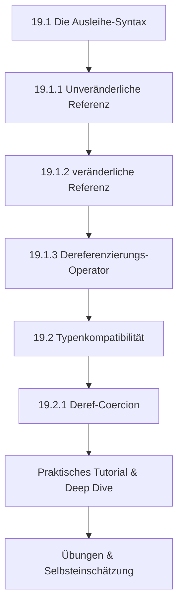

# Kapitel 19: Referenzen & Borrowing (Ausleihen)

Das Ownership-System von Rust (siehe [Kapitel 18](file:///home/thorsten/RustKurs/doc/src/18.md)) stellt sicher, dass zu jedem Zeitpunkt genau ein Besitzer für jeden Wert im Speicher existiert. Dieses Prinzip verhindert typische Speicherverwaltungsfehler wie Double-Free-Bugs oder Use-After-Free-Sicherheitslücken zur Kompilierzeit. In der praktischen Softwareentwicklung führt diese Striktheit jedoch schnell zu Hürden: Wenn jeder Funktionsaufruf den Besitz an den übergebenen Daten übernimmt, müssten wir Werte ständig als Rückgabewerte zurückgeben, um sie in der aufrufenden Funktion weiterzuverwenden.

Dieses Kapitel widmet sich der eleganten Lösung dieses Problems: **Referenzen (References)** und dem Prinzip des **Ausleihens (Borrowing)**. Wir untersuchen die zugrunde liegende Syntax, betrachten die physischen Auswirkungen auf Stack und Heap und beleuchten, wie Rust über Typenkompatibilität und die sogenannte **Deref-Coercion** Entwicklern das Leben vereinfacht, ohne die Performance zu beeinträchtigen.

---

## 19.1 Die Ausleihe-Syntax

### 19.1.1 Unveränderliche Referenz (&T)

Eine unveränderliche Referenz (`&T`) ermöglicht es Ihnen, auf einen Wert zuzugreifen und ihn zu lesen, ohne dessen Eigentum (Ownership) zu übernehmen. Im Systemkontext von Rust wird dieser Vorgang als "unveränderliches Ausleihen" bezeichnet.

#### Die Alltagsanalogie: Die Präsenzbibliothek
Stellen Sie sich ein historisches, wertvolles Buch in einer Präsenzbibliothek vor. Das Buch liegt fest an seinem Platz (Besitzer ist die Bibliothek).
* Beliebig viele Besucher dürfen an den Tisch treten und das Buch gleichzeitig lesen.
* Keiner der Besucher besitzt das Buch.
* Kein Besucher darf Seiten herausreißen, unterstreichen oder Text hinzufügen (Schreibschutz / Unveränderlichkeit).
* Sobald die Besucher die Bibliothek verlassen, bleibt das Buch unverändert an seinem Platz.

#### Physische Funktionsweise im Speicher
Unter der Haube ist eine Referenz nichts anderes als ein **Zeiger (Pointer)**, der eine physische Speicheradresse enthält. Auf einer modernen 64-Bit-CPU belegt jede Referenz exakt 8 Byte (64 Bit) auf dem Stack, da dies der Wortbreite des Adressbusses entspricht. Auf einer 32-Bit-Architektur sind es entsprechend 4 Byte (32 Bit).

Wenn Sie eine unveränderliche Referenz auf eine Variable erzeugen, speichert Rust im Stack-Frame der aktuellen Funktion die Speicheradresse der Zielvariable. Zeigt diese Referenz auf ein Objekt, das wiederum Daten auf dem Heap verwaltet (wie ein `String` oder ein `Vec<T>`), zeigt die Referenz auf den Stack-Eintrag der Originalvariable, welche wiederum den echten Zeiger auf den Heap-Speicher hält. Dies wird als Indirektion bezeichnet.

#### Syntaktische Deklaration und Nutzung
Eine unveränderliche Referenz wird durch das Voranstellen des Ampersand-Symbols `&` vor den Typ deklariert. 

```rust
fn main() {
    let text: String = String::from("Rust-Systemprogrammierung");
    
    // Erstellung einer unveränderlichen Referenz:
    let referenz: &String = &text;
    
    // Die Originalvariable bleibt voll funktionsfähig und im Besitz der Daten:
    println!("Originaler Text: {}", text);
    println!("Ausgelesener Text über Referenz: {}", referenz);
}
```

Da eine unveränderliche Referenz Lesezugriff garantiert, können Sie beliebig viele unveränderliche Referenzen auf den selben Wert gleichzeitig erstellen und im selben Scope halten. Der Compiler stellt sicher, dass während der gesamten Lebenszeit dieser Referenzen der Originalwert nicht verschoben (Move) oder gelöscht werden kann.

---

### 19.1.2 veränderliche Referenz (&mut T)

Wenn Sie Daten nicht nur auslesen, sondern direkt modifizieren möchten, ohne das Eigentum zu übernehmen, verwenden Sie eine veränderliche Referenz (`&mut T`).

#### Die Alltagsanalogie: Der Steuerberater
Stellen Sie sich vor, Sie besitzen ein Steuerdokument (die Originalvariable). Sie müssen Korrekturen vornehmen lassen.
* Sie übergeben das Dokument Ihrem Steuerberater und erteilen ihm das exklusive Schreibrecht (`&mut`).
* Während der Steuerberater das Dokument bearbeitet und Zahlen korrigiert, darf **kein anderer** Steuerberater das Dokument gleichzeitig lesen oder darauf schreiben.
* Auch Sie selbst dürfen das Dokument währenddessen nicht lesen, da sich die Daten im Zustand der Modifikation befinden und unvollständig oder inkonsistent sein könnten.
* Sobald der Steuerberater fertig ist, gibt er Ihnen das Dokument zurück.

#### Physische Funktionsweise im Speicher
Physisch belegt auch die veränderliche Referenz 8 Byte (auf 64-Bit-Systemen) auf dem Stack und enthält die Speicheradresse der Zielvariable. Der fundamentale Unterschied liegt in den Rechten, die der Compiler dieser Adresse zuschreibt, und in den Garantien, die er erzwingt.

#### Syntaktische Deklaration und Nutzung
Um eine veränderliche Referenz zu erstellen, müssen zwei Bedingungen erfüllt sein:
1. Die zu referenzierende Originalvariable muss explizit als veränderbar (`let mut`) deklariert sein.
2. Die Referenzierung muss mit der Syntax `&mut` erfolgen.

```rust
fn main() {
    let mut daten: String = String::from("Kernel");
    
    // Erstellung der veränderlichen Referenz:
    let schreiber: &mut String = &mut daten;
    
    // Modifikation über die veränderliche Referenz:
    schreiber.push_str(" v6.1");
    
    println!("Modifizierte Daten: {}", daten);
}
```

#### Die Aliasing-Regel und das Verbot der Mehrfach-Referenzierung
Die wichtigste Sicherheitsgarantie von Rust lautet: **Entweder beliebig viele unveränderliche Referenzen ODER exakt eine veränderliche Referenz auf einen Wert in einem Gültigkeitsbereich.**

Warum ist das so wichtig? Wenn mehrere veränderliche Referenzen auf denselben Speicherbereich verweisen würden, könnten Datenrennen (Data Races) auftreten. Ein Thread oder Programmabschnitt könnte Daten modifizieren, während ein anderer zeitgleich versucht, sie zu lesen oder ebenfalls zu modifizieren. Dies führt zu undefiniertem Verhalten (Undefined Behavior), das in C/C++ berüchtigt für Abstürze und Sicherheitslücken ist.

#### Der Move bei veränderlichen Referenzen
Ein kritischer Unterschied zwischen `&T` und `&mut T` auf Typenebene ist die Implementierung des `Copy`-Traits.
* `&T` implementiert das `Copy`-Trait. Das bedeutet, wenn Sie eine unveränderliche Referenz einer neuen Variable zuweisen, wird die Adresse kopiert. Beide Variablen sind danach gültig.
* `&mut T` implementiert das `Copy`-Trait **nicht**. Es besitzt ausschließlich die Move-Semantik. Wenn Sie eine veränderliche Referenz einer anderen Variable zuweisen, wird die Referenz verschoben. Die ursprüngliche Referenzvariable ist danach ungültig. Dadurch garantiert Rust, dass niemals zwei aktive veränderliche Zeiger auf den selben Wert existieren.

```rust
fn main() {
    let mut wert = 42;
    
    let ref1 = &mut wert;
    let ref2 = ref1; // MOVE! ref1 überträgt sein Schreibrecht auf ref2.
    
    // *ref1 += 1; // ❌ COMPILER-FEHLER: ref1 ist nach dem Move ungültig!
    *ref2 += 1; // 🟢 Erlaubt.
}
```

---

### 19.1.3 Dereferenzierungs-Operator (*)

Wenn Sie mit Referenzen arbeiten, halten Sie die Adresse einer Speicherstelle in Händen. Um auf den tatsächlichen Wert zuzugreifen, der an dieser Adresse liegt, müssen Sie die Referenz "verfolgen". Dieser Vorgang heißt **Dereferenzieren (Dereferencing)** und wird syntaktisch mit dem unären Stern-Operator `*` eingeleitet.

#### Funktionsweise auf Hardware-Ebene
Wenn die CPU den Maschinenbefehl zur Dereferenzierung ausführt, lädt sie die im Zeiger gespeicherte Adresse in ein Adressregister und liest anschließend den Speicherinhalt, auf den dieses Register zeigt.

#### Syntaktische Nutzung
Der `*`-Operator wird der Referenzvariable vorangestellt:

```rust
fn main() {
    let x: i32 = 100;
    let r: &i32 = &x;
    
    // Manueller Lesezugriff durch Dereferenzierung:
    let wert_von_x: i32 = *r;
    
    println!("Wert hinter der Referenz: {}", wert_von_x);
    
    let mut y: i32 = 200;
    let r_mut: &mut i32 = &mut y;
    
    // Manueller Schreibzugriff durch Dereferenzierung:
    *r_mut = 500;
    
    println!("Wert von y nach der Mutation: {}", y);
}
```

#### Automatische Dereferenzierung (Deref Coercion und Dot-Operator)
In der täglichen Programmierpraxis müssen Sie den `*`-Operator überraschend selten manuell schreiben. Der Grund dafür ist, dass Rust an vielen Stellen eine automatische Dereferenzierung vornimmt:
1. **Der Dot-Operator (`.`):** Wenn Sie eine Methode aufrufen oder auf ein Feld einer Struktur zugreifen, dereferenziert Rust die Referenz automatisch, bis sie den Basistyp erreicht. Schreiben Sie `objekt.methode()`, wandelt Rust dies intern in `(*objekt).methode()` oder `(&mut *objekt).methode()` um, je nachdem, welche Signatur die Methode verlangt.
2. **Formatierungs-Makros:** Makros wie `println!` oder `format!` dereferenzieren Argumente implizit für die Textausgabe.

---

## 19.2 Typenkompatibilität

In streng typisierten Sprachen müssen Typen bei Funktionsaufrufen oder Zuweisungen exakt übereinstimmen. In Rust würde dies bedeuten, dass eine Funktion, die eine Referenz auf ein String-Slice (`&str`) erwartet, nicht mit einer Referenz auf ein Heap-String-Objekt (`&String`) aufgerufen werden kann. Da dies zu extrem unergonomischem Code führen würde, bietet Rust Mechanismen zur impliziten Typenkompatibilität an.

---

### 19.2.1 Deref-Coercion

**Deref-Coercion (Deref-Koerzition)** ist eine automatische Konvertierung, die Rust bei Argumenten von Funktionen und Methoden anwendet. Sie greift ein, wenn Sie eine Referenz auf einen Typ `T` an eine Stelle übergeben, die eine Referenz auf einen Typ `U` erwartet, sofern `T` den Trait `std::ops::Deref` implementiert und dessen Zieltyp (`Target`) genau `U` ist.

#### Der `std::ops::Deref` Trait
Um zu verstehen, wie die Konvertierung abläuft, müssen wir uns den Trait `Deref` aus der Standardbibliothek ansehen. Die Signatur lautet:

```rust
pub trait Deref {
    type Target: ?Sized;

    fn deref(&self) -> &Self::Target;
}
```

* **`type Target`**: Ein assoziierter Typ, der bestimmt, wohin die Reise beim Dereferenzieren geht. Bei `String` ist dieser Typ `str`. Bei `Vec<T>` ist er `[T]`.
* **`deref(&self)`**: Die Methode, die eine unveränderliche Referenz auf das Objekt nimmt und eine unveränderliche Referenz auf den assoziierten Typ `Target` zurückgibt.

Es gibt analog dazu den Trait `DerefMut` für veränderliche Referenzen:

```rust
pub trait DerefMut: Deref {
    fn deref_mut(&mut self) -> &mut Self::Target;
}
```

#### Der Such- und Auflösungsalgorithmus des Compilers
Wenn der Compiler eine Referenz vom Typ `&T` sieht, aber eine Referenz vom Typ `&Target` benötigt wird, führt er folgende Schritte aus:
1. Er prüft, ob `T` den Trait `Deref` implementiert.
2. Wenn ja, ersetzt er den Typ implizit durch den Aufruf von `T::deref(&T)`, was den Typ `&Target` liefert.
3. Dieser Prozess wird **rekursiv** wiederholt. Das bedeutet: Wenn `Target` wiederum `Deref` implementiert, sucht der Compiler tiefer. So kann beispielsweise ein benutzerdefinierter Smart-Pointer `MeinSmartPointer<String>` über die Kette `&MeinSmartPointer<String>` -> `&String` -> `&str` aufgelöst werden.

#### Warum Deref-Coercion eine Zero-Cost-Abstraction ist
Alle Berechnungen und Typtransformationen der Deref-Coercion werden vollständig während der Kompilierung durchgeführt. Zur Laufzeit des Programms gibt es keinen zusätzlichen Performance-Overhead. Der generierte Maschinencode entspricht exakt dem Code, den Sie geschrieben hätten, wenn Sie die Referenzen manuell über mehrere Schritte dereferenziert und neu referenziert hätten.

#### Code-Beispiel zur Deref-Coercion:

```rust
fn gruss_empfaenger(name: &str) {
    println!("Hallo, {}!", name);
}

fn main() {
    let name_string: String = String::from("Monika");
    
    // Ohne Deref-Coercion müssten wir schreiben:
    // gruss_empfaenger(&(*name_string)[..]);
    
    // Mit Deref-Coercion reicht die Übergabe der String-Referenz:
    gruss_empfaenger(&name_string); // String implementiert Deref<Target = str>
}
```

---

## 1. Lernziele & Lernplan

### Lernziele (Bloom'sche Taxonomie)
* **Sie können** den Unterschied im Speicher- und Zugriffsverhalten zwischen unveränderlichen (`&T`) und veränderlichen (`&mut T`) Referenzen präzise erklären und diese syntaktisch fehlerfrei in Funktionssignaturen deklarieren.
* **Sie können** den Dereferenzierungs-Operator (`*`) anwenden, um den Wert hinter einer Referenz im Speicher manuell zu lesen oder zu modifizieren.
* **Sie können** Compiler-Fehler bezüglich der Verletzung von Aliasing-Regeln (wie Double-Borrowing oder unzulässige Mutationen) selbstständig analysieren, interpretieren und korrigieren.
* **Sie können** die Funktionsweise der Deref-Coercion erklären und eigene Typen entwerfen, die den `Deref`-Trait implementieren, um eine automatische Typkompatibilität zu gewährleisten.

### Lernplan (Roter Faden)


---

## 2. Die Definition

In Rust wird das sichere und effiziente Arbeiten mit Speicheradressen über ein klar definiertem System von Referenzen geregelt:

* **Referenz (`&T` bzw. `&mut T`)**: Eine Referenz ist ein sicherer, garantiert nicht-nullwertiger Zeiger im Speicher, der auf die Adresse eines anderen Wertes verweist, ohne dessen Eigentum (Ownership) zu übernehmen.
* **Borrowing (Ausleihen)**: Der Vorgang des Erstellens einer Referenz. Das Eigentum verbleibt beim ursprünglichen Besitzer, während der Zugriff temporär ausgeliehen wird.
* **Dereferenzierungs-Operator (`*`)**: Ein unärer Operator, der es ermöglicht, die Adresse einer Referenz zu verfolgen und direkt auf den dort gespeicherten Wert zuzugreifen.
* **Deref-Coercion (Deref-Koerzition)**: Eine implizite Typkonvertierung durch den Rust-Compiler, die eine Referenz auf einen Typen `T`, der den Trait `Deref` implementiert, automatisch in eine Referenz auf den Zieltyp `Target` umwandelt, um Funktionsaufrufe zu vereinfachen.

---

## 3. Das Problem & Die Motivation

Wenn eine Programmiersprache ausschließlich das Konzept der Wertübergabe (Pass-by-Value / Move-Semantik) unterstützt, ergeben sich drei schwerwiegende Probleme:

1. **Eigentumsverlust (Ownership-Transfer)**: Sobald Daten an eine Funktion übergeben werden, verliert der Aufrufer den Zugriff auf diese Daten. Um die Daten weiter zu nutzen, müsste die Funktion sie mühsam als Teil eines Tupels wieder zurückgeben.
2. **Kopier- und Allokations-Overhead**: Große Datenstrukturen (z. B. Arrays mit Tausenden von Einträgen oder lange Strings) müssten bei jedem Funktionsaufruf im Speicher tief kopiert (geklont) werden. Dies belastet den Heap-Speicher und reduziert die CPU-Performance durch unnötige Lese- und Schreibzyklen dramatisch.
3. **Pointer-Unsicherheit**: Sprachen wie C und C++ umgehen diese Probleme mit rohen Zeigern (Raw Pointers). Diese sind jedoch extrem unsicher: Sie können auf ungültigen Speicher zeigen (Dangling Pointers), `NULL` sein (was zu Abstürzen führt) oder Datenrennen verursachen, wenn mehrere Zeiger parallel auf dieselben veränderlichen Daten zugreifen.
4. **Garbage Collection Overhead**: Sprachen wie Java, Go oder Python nutzen Referenzen und überlassen die Bereinigung einem Garbage Collector (GC). Dies führt zu unvorhersehbaren Pausen in der Ausführung ("Stop-the-World"-Latenzen) und verbraucht signifikant mehr Arbeitsspeicher.

Rust löst diese Konflikte, indem es sichere Zeiger (Referenzen) einführt, deren Einhaltung vom Compiler zur Compilezeit (Borrow Checker) lückenlos verifiziert wird.

---

## 4. Der naive Versuch

Im Folgenden betrachten wir zwei naive Versuche, die typische Fallstricke beim Umgang mit Referenzen und Eigentum aufzeigen.

### Naiver Versuch A: Datenmodifikation über eine unveränderliche Referenz
Der Entwickler möchte den Namen eines Servers über eine Referenz ändern, verwendet jedoch die falsche Syntax.

```rust
// Dieser Code lässt sich nicht kompilieren!
fn main() {
    let server_name = String::from("Production_Server");
    
    // Wir erstellen eine unveränderliche Referenz
    let referenz = &server_name;
    
    // Versuch, den String über eine unveränderliche Referenz zu mutieren
    referenz.push_str("_Backup"); 
    
    println!("Server: {}", referenz);
}
```

### Naiver Versuch B: Gleichzeitiges Kopieren einer veränderlichen Referenz
Der Entwickler versucht, zwei schreibende Zugriffe parallel zu verwalten, indem er eine veränderliche Referenz einer zweiten Variable zuweist.

```rust
// Dieser Code lässt sich nicht kompilieren!
fn main() {
    let mut datenbank_status = String::from("Aktiv");
    
    let ref_schreiber1 = &mut datenbank_status;
    
    // Versuch, die veränderliche Referenz zu kopieren
    let ref_schreiber2 = ref_schreiber1; 
    
    // Der Entwickler denkt, er könne nun beide Referenzen nutzen:
    ref_schreiber1.push_str("_Modus1");
    ref_schreiber2.push_str("_Modus2");
    
    println!("Status: {}", datenbank_status);
}
```

---

## 5. Die Anatomie des Fehlers

### Analyse zu Versuch A: Mutation über unveränderliche Referenz
Wenn Sie versuchen, Versuch A zu kompilieren, meldet der Rust-Compiler Folgendes:

```text
error[E0596]: cannot borrow `*referenz` as mutable, as it is behind a `&` reference
 --> src/main.rs:8:5
  |
5 |     let referenz = &server_name;
  |                    ------------ help: consider changing this to be a mutable reference: `&mut server_name`
6 |     
7 |     // Versuch, den String über eine unveränderliche Referenz zu mutieren
8 |     referenz.push_str("_Backup"); 
  |     ^^^^^^^^^^^^^^^^^^^^^^^^^^^^ `referenz` is a `&` reference, so the data it refers to cannot be borrowed as mutable
```

#### Der Blick hinter die Kulissen (Speicherlayout)
Im Speicher der CPU sieht die Situation wie folgt aus:
* Auf dem Stack liegt die Variable `server_name` (24 Byte: Pointer auf Heap, Kapazität, Länge).
* Die Variable `referenz` liegt ebenfalls auf dem Stack (8 Byte) und enthält die Startadresse von `server_name`.
* Da `referenz` vom Typ `&String` (und nicht `&mut String`) ist, kennzeichnet der Compiler diesen Zeiger im Typsystem als rein lesbar. Der Versuch, die Methode `push_str(&mut self, ...)` aufzurufen, scheitert, da die Methode eine veränderliche Referenz (`&mut String`) auf den String verlangt, der Aufrufer jedoch nur eine unveränderliche Referenz (`&String`) besitzt.

```text
Stack Frame (main)
+-----------------------------+
| server_name (24 Byte)       | ===> Zeigt auf Heap: "Production_Server"
| - Address: 0x7ffe01         |
+-----------------------------+
| referenz (8 Byte)           |
| - Value: 0x7ffe01           | ===> Zeigt unveränderlich auf server_name
| - Typ: &String (schreibgeschützt)
+-----------------------------+
```

---

### Analyse zu Versuch B: Kopieren einer veränderlichen Referenz
Wenn Sie versuchen, Versuch B zu kompilieren, meldet der Rust-Compiler:

```text
error[E0382]: use of moved value: `ref_schreiber1`
  --> src/main.rs:11:5
   |
5  |     let ref_schreiber1 = &mut datenbank_status;
   |                          --------------------- move occurs because `ref_schreiber1` has type `&mut String`, which does not implement the `Copy` trait
6  |     
7  |     // Versuch, die veränderliche Referenz zu kopieren
8  |     let ref_schreiber2 = ref_schreiber1; 
   |                          -------------- value moved here
9  |     
10 |     // Der Entwickler denkt, er könne nun beide Referenzen nutzen:
11 |     ref_schreiber1.push_str("_Modus1");
   |     ^^^^^^^^^^^^^^ value used here after move
```

#### Der Blick hinter die Kulissen (Speicherlayout)
* `ref_schreiber1` is eine veränderliche Referenz (`&mut String`), die auf `datenbank_status` zeigt.
* Da veränderliche Referenzen exklusiven Zugriff garantieren müssen, dürfen sie nicht kopiert werden. Rust implementiert das `Copy`-Trait für `&mut T` bewusst nicht.
* Bei der Zuweisung `let ref_schreiber2 = ref_schreiber1;` findet daher ein **Move** statt. Die Adresse wird in `ref_schreiber2` kopiert, während `ref_schreiber1` vom Compiler als ungültig markiert wird.
* Der anschließende Zugriff auf `ref_schreiber1` in Zeile 11 ist illegal, da die Gültigkeit der Referenz erloschen ist. Dadurch wird garantiert, dass zu jedem Zeitpunkt maximal ein aktiver Schreibzeiger auf die Daten zugreifen kann.

---

## 6. Die Lösung (EVA-Prinzip)

Um die Probleme korrekt zu lösen, müssen wir die Ausleihe-Syntax und die Aliasing-Garantien von Rust exakt einhalten.

### Didaktischer Pseudocode
```text
PROZESS ServerVerwaltung:
    EINGABE: Ein veränderbarer Text name
    VERARBEITUNG:
        Erstelle eine veränderliche Referenz auf name
        Hänge über die Referenz den Text "_Backup" an
    AUSGABE: Keine (Seiteneffekt: Originaler Text ist geändert)
    
PROZESS StatusVerwaltung:
    EINGABE: Ein veränderbarer Text status
    VERARBEITUNG:
        Erstelle eine veränderliche Referenz ref1 auf status
        Verschiebe diese Referenz auf ref2
        Verwende ausschließlich ref2, um den Text zu ändern
    AUSGABE: Keine (Seiteneffekt: Originaler Status ist geändert)
```

### Korrekter Rust-Code

```rust
fn main() {
    // Lösung für A: Korrekte Verwendung von &mut
    let mut server_name = String::from("Production_Server");
    
    // Die Funktion erwartet eine veränderliche Referenz:
    server_aktualisieren(&mut server_name);
    
    println!("A: Aktualisierter Server: {}", server_name);

    // Lösung für B: Respektieren der Move-Semantik von &mut
    let mut datenbank_status = String::from("Aktiv");
    
    {
        let ref_schreiber1 = &mut datenbank_status;
        // Wir verschieben die Referenz:
        let ref_schreiber2 = ref_schreiber1; 
        
        // Wir nutzen NUR noch den neuen Besitzer der Referenz:
        ref_schreiber2.push_str("_Modus2");
    } // Hier stirbt ref_schreiber2, und die Sperrung für datenbank_status wird aufgehoben.
    
    println!("B: Aktualisierter Status: {}", datenbank_status);
}

// Hilfsfunktion für A
fn server_aktualisieren(name: &mut String) {
    name.push_str("_Backup");
}
```

### Ablaufbeschreibung und EVA-Aufschlüsselung

#### Zeile-für-Zeile-Erklärung (Lösung A):
1. `let mut server_name = String::from("Production_Server");`: Erstellt einen veränderbaren String auf dem Heap. `server_name` ist der Besitzer.
2. `server_aktualisieren(&mut server_name);`: Der Compiler erzeugt eine veränderliche Referenz auf `server_name` und übergibt sie.
3. In `server_aktualisieren(name: &mut String)`: Der Parameter `name` nimmt das Schreibrecht entgegen.
4. `name.push_str("_Backup");`: Über den Zeiger wird direkt den Heap-Speicher modifiziert.
5. Nach dem Ende der Funktion erlischt die Referenz `name`. Der Zugriff auf `server_name` in `main` ist wieder freigegeben.

#### EVA-Strukturierung der Funktion `server_aktualisieren`:
* **Eingabe (Input)**: Eine veränderliche Referenz auf ein String-Objekt (`name: &mut String`). Ownership verbleibt beim Aufrufer.
* **Verarbeitung (Processing)**: Aufruf der Methode `.push_str()` auf dem dereferenzierten String-Objekt.
* **Ausgabe (Output)**: Keine Rückgabe (`()`). Als Seiteneffekt (Side Effect) wurden die Daten auf dem Heap direkt modifiziert.

---

## 7. Kleines Tutorial (Schritt-für-Schritt-Praxis)

Wir entwickeln eine kleine, textbasierte Konfigurationsdatenbank für einen Netzwerk-Dienst. Unser Ziel ist es, Einstellungen zu verwalten, Werte über Referenzen auszulesen, Einstellungen veränderlich zu aktualisieren und die automatische Deref-Coercion in der Praxis anzuwenden.

### Schritt 1: Struktur definieren
Erstellen Sie eine neue Struktur `NetzwerkKonfig`, die den Servernamen, die IP-Adresse und den Port speichert.

```rust
struct NetzwerkKonfig {
    server_name: String,
    ip_adresse: String,
    port: u16,
}
```

### Schritt 2: Lese- und Schreibzugriff implementieren
Wir implementieren Methoden im `impl`-Block von `NetzwerkKonfig`.
* `anzeigen(&self)`: Liest die Konfiguration unveränderlich aus.
* `port_aktualisieren(&mut self, neuer_port: u16)`: Ändert den Port veränderlich.

```rust
impl NetzwerkKonfig {
    // Unveränderliche Methode (Lesezugriff)
    fn anzeigen(&self) {
        println!("Server: {} | IP: {} | Port: {}", self.server_name, self.ip_adresse, self.port);
    }

    // Veränderliche Methode (Schreibzugriff)
    fn port_aktualisieren(&mut self, neuer_port: u16) {
        self.port = neuer_port;
    }
}
```

### Schritt 3: Deref-Coercion demonstrieren
Wir schreiben eine Hilfsfunktion `logge_ip(ip: &str)`. Diese erwartet ein String-Slice (`&str`). Wir wollen ihr jedoch eine Referenz auf das Feld `ip_adresse` übergeben, welches vom Typ `String` ist. Rust soll die Typenkompatibilität über die Deref-Coercion automatisch auflösen.

```rust
fn logge_ip(ip: &str) {
    println!("[LOG] Verbindung wird aufgebaut zu IP-Adresse: {}", ip);
}
```

### Schritt 4: Das Hauptprogramm zusammenführen
Verbinden wir alle Teile in der `main`-Funktion:

```rust
fn main() {
    // 1. Initialisierung
    let mut config = NetzwerkKonfig {
        server_name: String::from("Gateway_East"),
        ip_adresse: String::from("192.168.1.100"),
        port: 8080,
    };

    // 2. Unveränderliche Ausleihe über Methode
    println!("--- Initialer Zustand ---");
    config.anzeigen();

    // 3. Veränderliche Ausleihe zur Modifikation
    println!("\n--- Port-Aktualisierung ---");
    config.port_aktualisieren(9090);
    config.anzeigen();

    // 4. Anwendung der Deref-Coercion
    println!("\n--- IP-Protokollierung ---");
    // Wir übergeben &config.ip_adresse (&String) an eine Funktion, die &str erwartet.
    // Der Compiler wendet automatisch Deref-Coercion an!
    logge_ip(&config.ip_adresse);
}
```

---

## 8. Mentale Modelle & Deep Dive (Hintergrundwissen)

### Das physische Speicherlayout im Detail
Um zu verstehen, was im Arbeitsspeicher geschieht, betrachten wir die Belegung der Stack-Frames und des Heaps während des Tutorials aus Abschnitt 7.

```text
       STACK FRAME (main)                         HEAP-SPEICHER
+------------------------------------+      +---------------------------------+
| config: NetzwerkKonfig             |      | Adresse: 0x100a                 |
| - server_name (24 Byte)            |      | Daten: ['G','a','t','e','w',...] |
|   - Pointer: 0x100a ---------------|----->+---------------------------------+
|   - Capacity: 12, Length: 12       |      | Adresse: 0x200b                 |
| - ip_adresse (24 Byte)             |      | Daten: ["192.168.1.100"]        |
|   - Pointer: 0x200b ---------------|----->+---------------------------------+
|   - Capacity: 13, Length: 13       |
| - port (2 Byte): 9090              |
| Address: 0x7ffeef01                |
+------------------------------------+
                  ^
                  |
         Referenz-Adresse (0x7ffeef01)
                  |
+-----------------+------------------+
| Parameter self in anzeigen (&self) |
| - Value: 0x7ffeef01                |
+------------------------------------+
```

### Die Anatomie der Deref-Coercion
Wie funktioniert die Deref-Coercion technisch im Compiler?
Wenn Sie die Adresse eines Typs `&T` übergeben und der Typ `&U` erwartet wird, führt der Compiler eine Typsuche durch:

```text
Typ &T (z. B. &String)
   │
   ▼
Implementiert T std::ops::Deref?
   │
   ├─► Ja: Hole T::Target (z. B. str)
   │       Typ wird zu &U (z. B. &str)
   │       Entspricht der Zieltyp dem erwarteten Typ?
   │          ├─► Ja: Kompilierung erfolgreich!
   │          └─► Nein: Führe Suche erneut mit &U aus (rekursiv).
   │
   └─► Nein: Compiler-Fehler (Type Mismatch)
```

---

### Exhaustive API-Reference der Standardbibliothek (Referenz- & Konvertierungs-Traits)

Hier dokumentieren wir die sechs wichtigsten Traits der Standardbibliothek, die das Ausleih- und Dereferenzierungsverhalten von Rust steuern.

#### 1. `std::ops::Deref`
* **Signatur**:
  ```rust
  pub trait Deref {
      type Target: ?Sized;
      fn deref(&self) -> &Self::Target;
  }
  ```
* **Parameter**: `&self` (eine unveränderliche Referenz auf das implementierende Objekt).
* **Rückgabetyp**: `&Self::Target` (eine unveränderliche Referenz auf den Zieltyp).
* **Sicherheitsaspekte & Panics**: Die Implementierung sollte rein deterministisch sein und niemals panicken oder Seiteneffekte erzeugen, da sie implizit vom Compiler aufgerufen wird.
* **Mini-Beispiel**:
  ```rust
  use std::ops::Deref;
  struct Container<T>(T);
  impl<T> Deref for Container<T> {
      type Target = T;
      fn deref(&self) -> &Self::Target { &self.0 }
  }
  fn main() {
      let c = Container(42);
      assert_eq!(*c, 42); // Ruft implizit deref() auf
  }
  ```

#### 2. `std::ops::DerefMut`
* **Signatur**:
  ```rust
  pub trait DerefMut: Deref {
      fn deref_mut(&mut self) -> &mut Self::Target;
  }
  ```
* **Parameter**: `&mut self` (eine veränderliche Referenz auf das implementierende Objekt).
* **Rückgabetyp**: `&mut Self::Target` (eine veränderliche Referenz auf den Zieltyp).
* **Sicherheitsaspekte & Panics**: Analog zu `Deref` sollte diese Methode absturzfrei und stabil arbeiten.
* **Mini-Beispiel**:
  ```rust
  use std::ops::{Deref, DerefMut};
  struct Container<T>(T);
  impl<T> Deref for Container<T> {
      type Target = T;
      fn deref(&self) -> &Self::Target { &self.0 }
  }
  impl<T> DerefMut for Container<T> {
      fn deref_mut(&mut self) -> &mut Self::Target { &mut self.0 }
  }
  fn main() {
      let mut c = Container(42);
      *c = 100; // Ruft implizit deref_mut() auf
      assert_eq!(*c, 100);
  }
  ```

#### 3. `std::borrow::Borrow`
* **Signatur**:
  ```rust
  pub trait Borrow<Borrowed: ?Sized> {
      fn borrow(&self) -> &Borrowed;
  }
  ```
* **Parameter**: `&self` (unveränderliche Referenz).
* **Rückgabetyp**: `&Borrowed` (Referenz auf den geliehenen Typ).
* **Sicherheitsaspekte & Panics**: Im Gegensatz zu `Deref` verlangt `Borrow`, dass der geliehene Typ dieselbe Hash- und Äquivalenz-Semantik (`Eq`, `Hash`) besitzt wie der Ausgangstyp. Wird intensiv in Assoziativspeichern (wie `HashMap`) verwendet.
* **Mini-Beispiel**:
  ```rust
  use std::borrow::Borrow;
  fn verarbeite<T: Borrow<str>>(daten: T) {
      assert_eq!(daten.borrow(), "Test");
  }
  fn main() {
      let s = String::from("Test");
      verarbeite(s);
  }
  ```

#### 4. `std::borrow::BorrowMut`
* **Signatur**:
  ```rust
  pub trait BorrowMut<Borrowed: ?Sized>: Borrow<Borrowed> {
      fn borrow_mut(&mut self) -> &mut Borrowed;
  }
  ```
* **Parameter**: `&mut self`.
* **Rückgabetyp**: `&mut Borrowed`.
* **Sicherheitsaspekte & Panics**: Gewährleistet konsistente veränderliche Ausleihen unter Beibehaltung der Identitätseigenschaften.
* **Mini-Beispiel**:
  ```rust
  use std::borrow::BorrowMut;
  fn modifiziere<T: BorrowMut<String>>(mut daten: T) {
      daten.borrow_mut().push_str("!");
  }
  fn main() {
      let mut s = String::from("Hallo");
      modifiziere(&mut s);
      assert_eq!(s, "Hallo!");
  }
  ```

#### 5. `std::convert::AsRef`
* **Signatur**:
  ```rust
  pub trait AsRef<T: ?Sized> {
      fn as_ref(&self) -> &T;
  }
  ```
* **Parameter**: `&self`.
* **Rückgabetyp**: `&T`.
* **Sicherheitsaspekte & Panics**: Dient der reinen Typ-zu-Typ-Referenzkonvertierung. Sehr generisch gehalten, stellt keine Anforderungen an die Gleichheit von Hash-Funktionen.
* **Mini-Beispiel**:
  ```rust
  fn print_laenge<T: AsRef<str>>(val: T) {
      println!("Länge: {}", val.as_ref().len());
  }
  fn main() {
      print_laenge(String::from("Rust"));
      print_laenge("Rust");
  }
  ```

#### 6. `std::convert::AsMut`
* **Signatur**:
  ```rust
  pub trait AsMut<T: ?Sized> {
      fn as_mut(&mut self) -> &mut T;
  }
  ```
* **Parameter**: `&mut self`.
* **Rückgabetyp**: `&mut T`.
* **Sicherheitsaspekte & Panics**: Ermöglicht eine billige, veränderliche Typ-zu-Typ-Konvertierung.
* **Mini-Beispiel**:
  ```rust
  fn nullstelle<T: AsMut<[i32]>>(mut sammlung: T) {
      let slice = sammlung.as_mut();
      if !slice.is_empty() {
          slice[0] = 0;
      }
  }
  fn main() {
      let mut array = [5, 10, 15];
      nullstelle(&mut array);
      assert_eq!(array[0], 0);
  }
  ```

---

## 9. Drei praktische Übungen (Herausforderungen)

### Übung 1 (Leicht - Syntax festigen): Sensor-Messung
**Aufgabe**: Schreiben Sie ein Programm, das die Temperatur eines Sensors verwaltet. 
1. Definieren Sie ein Struct `Sensor` mit dem Feld `temperatur` (`f32`).
2. Schreiben Sie eine Funktion `lese_temperatur(sensor: &Sensor)`, die die Temperatur auf der Konsole ausgibt.
3. Schreiben Sie eine Funktion `kalibriere_sensor(sensor: &mut Sensor, delta: f32)`, die den Temperaturwert des Sensors um den Wert `delta` erhöht oder verringert.

* **Erwartete Signaturen**:
  ```rust
  struct Sensor { temperatur: f32 }
  fn lese_temperatur(sensor: &Sensor);
  fn kalibriere_sensor(sensor: &mut Sensor, delta: f32);
  ```
* **Lösungshinweis**: Denken Sie daran, dass Sie in `kalibriere_sensor` den Sensor über die veränderliche Referenz direkt mutieren müssen. Sie benötigen hier keinen Rückgabetyp.

---

### Übung 2 (Mittel - Logik erweitern): Der Smart-Warenkorb
**Aufgabe**: Verwalten Sie den Preis eines Warenkorbs.
1. Definieren Sie ein Struct `Warenkorb` mit einem Feld `gesamtpreis` (`f64`).
2. Schreiben Sie eine Methode `rabatt_anwenden(&mut self, prozentsatz: f64)`.
3. Schreiben Sie eine freie Funktion `vergleiche_und_drucke(w1: &Warenkorb, w2: &Warenkorb)`, die den günstigeren der beiden Warenkörbe ermittelt und dessen Gesamtpreis auf der Konsole ausgibt.

* **Beispiel-Input**: `w1.gesamtpreis = 100.0`, `w2.gesamtpreis = 120.0`, nach 20% Rabatt auf `w2` sind beide gleich.
* **Lösungshinweis**: Übergeben Sie in `vergleiche_und_drucke` beide Warenkörbe als unveränderliche Referenzen, da die Funktion nur lesend auf die Daten zugreifen muss.

---

### Übung 3 (Schwer - Transferleistung): Der Logging-Wrapper
**Aufgabe**: Erstellen Sie einen eigenen Smart-Pointer namens `LoggerBox<T>`, der jeden Lesezugriff auf den inneren Wert protokolliert.
1. Implementieren Sie das Struct `LoggerBox<T>`.
2. Implementieren Sie den `Deref`-Trait für `LoggerBox<T>`. Bei jedem Aufruf der Methode `deref()` soll auf der Konsole die Nachricht `"[INFO] Lesezugriff auf LoggerBox erfolgt!"` ausgegeben werden.
3. Demonstrieren Sie in `main`, dass Sie ein `LoggerBox<String>` nahtlos an eine Funktion übergeben können, die ein `&str` erwartet (Nutzung der Deref-Coercion über zwei Stufen).

* **Erwarteter Output**: Bei jedem Lesezugriff muss die Info-Meldung auf der Konsole erscheinen.
* **Lösungshinweis**: Der assoziierte Typ `Target` Ihres Traits `Deref` muss `T` sein. Die Methode `deref(&self)` gibt eine unveränderliche Referenz auf den inneren Wert zurück (`&self.0`).

---

## 10. Lernstrategie, Selbsteinschätzung & Merkzettel

### Spickzettel (Cheat Sheet)

| Syntax | Typbezeichnung | Lesezugriff | Schreibzugriff | Ownership-Transfer |
| :--- | :--- | :---: | :---: | :---: |
| `&T` | Unveränderliche Referenz | Ja | Nein | Nein |
| `&mut T` | Veränderliche Referenz | Ja | Ja | Nein (Move bei Zuweisung) |
| `*r` | Dereferenzierung | - | - | Abhängig vom Typ `T` |
| `&String` -> `&str` | Deref-Coercion (implizit) | - | - | Nein |

---

### Active Recall (Selbsttestfragen)
1. **Frage**: Warum implementiert eine unveränderliche Referenz (`&T`) das `Copy`-Trait, eine veränderliche Referenz (`&mut T`) hingegen nur das `Move`-Verhalten?
2. **Frage**: Was passiert auf der Hardware-Ebene der CPU, wenn eine Referenz dereferenziert wird?
3. **Frage**: Unter welchen Bedingungen wendet der Rust-Compiler die Deref-Coercion auf ein Funktionsargument an?
4. **Frage**: Kann ein Datenrennen auftreten, wenn ein Programm gleichzeitig zehn unveränderliche Referenzen und null veränderliche Referenzen auf denselben Speicherbereich hält? Begründen Sie Ihre Antwort.

---

### Die Feynman-Methode
Erklären Sie einem Programmierer, der nur Java oder Python kennt, in maximal drei einfachen Sätzen, warum Rusts System des Ausleihens (Borrowing) Speicherbereinigungsfehler zur Laufzeit unmöglich macht, ohne dass ein Garbage Collector benötigt wird.

---

### Gezielte Fehlerprovokation (Compiler-Guided Learning)
Nehmen Sie den korrekten Lösungscode aus Abschnitt 6 (Lösung A) und entfernen Sie das Schlüsselwort `mut` aus der Deklaration von `server_name` in der `main`-Funktion, während Sie versuchen, weiterhin `&mut server_name` zu übergeben. Analysieren Sie die Compiler-Fehlermeldung. Welcher Fehler-Code (E-Nummer) wird ausgegeben und welche Hilfestellung gibt Ihnen der Compiler?

---

### Metakognitiver Selbsttest
Wechseln Sie erst zu [Kapitel 20](file:///home/thorsten/RustKurs/doc/src/20.md), wenn Sie:
* [ ] Den Unterschied im Speicherbedarf einer Referenz zwischen einer 32-Bit- und einer 64-Bit-Architektur benennen können.
* [ ] Den Unterschied zwischen `&T` und `&mut T` in Bezug auf das `Copy`-Trait erklären können.
* [ ] Den Unterschied zwischen dem `Deref`-Trait und der impliziten Deref-Coercion verstanden haben.
* [ ] Einen Compiler-Fehler des Typs `cannot borrow as mutable` ohne fremde Hilfe durch syntaktische Korrekturen auflösen können.

---

## 11. Zusammenfassung

* **Referenzen sind sichere Zeiger**: Sie verweisen auf die Speicheradresse einer Variable auf Stack oder Heap, ohne deren Eigentümer zu werden. Eine Referenz ist in Rust niemals null und zeigt niemals auf ungültigen Speicher.
* **Unveränderliche Referenz (`&T`)**: Ermöglicht den reinen Lesezugriff. Es können beliebig viele unveränderliche Referenzen gleichzeitig auf denselben Wert existieren. Sie implementieren das `Copy`-Trait.
* **Veränderliche Referenz (`&mut T`)**: Ermöglicht den Lese- und Schreibzugriff auf den referenzierten Wert. Es darf zu jedem Zeitpunkt nur eine einzige veränderliche Referenz auf einen Wert im selben Gültigkeitsbereich existieren. Sie implementieren das `Copy`-Trait nicht (Move-Semantik).
* **Dereferenzierung (`*`)**: Ermöglicht das Verfolgen des Zeigers zur Modifikation oder zum Auslesen des darunterliegenden Werts. Bei Methodenaufrufen und dem Zugriff auf Felder nimmt der Dot-Operator (`.`) die Dereferenzierung automatisch vor.
* **Deref-Coercion**: Ermöglicht eine implizite, kostenlose Typkonvertierung von Referenzen zur Compilezeit (z. B. von `&String` zu `&str`), sofern der Ausgangstyp den `Deref`-Trait implementiert.

---
**Lizenz- und Attributionshinweis**:
Teile dieses Kapitels basieren auf Übersetzungen und didaktischen Anpassungen des offiziellen Buches [The Rust Programming Language](https://doc.rust-lang.org/book/) von Steve Klabnik und Carol Nichols (sowie Beiträgen der Rust-Community), lizenziert unter [MIT](https://opensource.org/licenses/MIT) und [Apache 2.0](https://www.apache.org/licenses/LICENSE-2.0).
