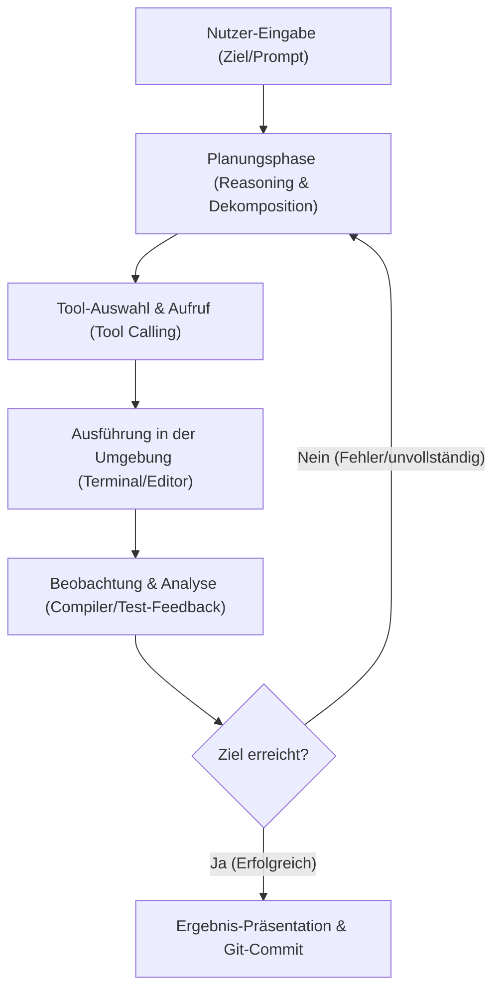

# Kapitel 26: KI-Agenten & autonome Software-Ingenieure

In der modernen Softwareentwicklung haben sich KI-gestützte Werkzeuge von reinen Code-Vervollständigungen zu autonomen Agenten weiterentwickelt. Dieses Kapitel vermittelt Ihnen die Konzepte, Architekturen und praktischen Workflows von KI-Agenten und autonomen Software-Ingenieuren. Sie lernen, wie diese Systeme arbeiten, wie sie sich von klassischen IDE-Erweiterungen unterscheiden und wie Sie diese Werkzeuge effizient in Ihrem Rust-Entwicklungsalltag einsetzen können. Die didaktischen und strukturellen Vorgaben für dieses Kapitel wurden gemäß den Richtlinien in [markdown.md](file:///home/thorsten/RustKurs/markdown.md) und [AGENTS.md](file:///home/thorsten/RustKurs/AGENTS.md) umgesetzt.

---

## 1. Lernziele & Lernplan

### Lernziele
* **Sie können** den fundamentalen Unterschied zwischen traditionellen IDE-Autovervollständigungen, interaktiven Chatbots und autonomen KI-Software-Agenten anhand ihrer Systemarchitektur und Handlungsspielräume erklären.
* **Sie können** die Funktionsweise eines agentischen Entwicklungszyklus bestehend aus Planung (Reasoning), Werkzeugnutzung (Tool Calling) und Umgebungsauswertung (Environment Observation) im Kontext von Compiler-Fehlermeldungen analysieren und bewerten.
* **Sie können** lokale Terminal-Agenten (wie Claude Code und die Antigravity CLI) sowie Web-basierte Plattformen (wie Devin) vergleichen und deren spezifische Vor- und Nachteile für die Softwareentwicklung benennen.
* **Sie können** Fehler in einem Rust-Projekt mithilfe eines CLI-basierten Agenten-Tools durch gezieltes Prompting und iteratives Testen selbstständig identifizieren, beheben und verifizieren.

### Lernplan
* [ ] **2. Die Definition**: Präzise Abgrenzung von KI-Agenten, CLI-Tools, autonomen Software-Ingenieuren und IDE-Erweiterungen mit einer eingängigen Metapher.
* [ ] **3. Das Problem & Die Motivation**: Warum klassische Chats und manuelles Kopieren von Code in der Praxis zu Reibungsverlusten und Fehlern führen.
* [ ] **4. Der naive Versuch**: Ein typisches Szenario, in dem unvollständiger Code aus einem Web-Chat kopiert wird und fehlschlägt.
* [ ] **5. Die Anatomie des Fehlers**: Detaillierte Analyse des Compilerfehlers (fehlender Trait-Import) und dessen technische Ursachen.
* [ ] **6. Die Lösung**: Der korrekte Rust-Code inklusive detaillierter Ablaufbeschreibung und Erklärung des agentischen Korrektur-Loops.
* [ ] **7. Kleines Tutorial**: Schritt-für-Schritt Walkthrough zur praktischen Nutzung eines CLI-Agenten im Terminal.
* [ ] **8. Mentale Modelle & Deep Dive**: Die agentische Regelschleife mit Mermaid-Visualisierung und ein lückenloser, tabellarischer Vergleich aller gängigen Agenten-Tools.
* [ ] **9. Drei praktische Übungen**: Praktische Aufgaben (Leicht, Mittel, Schwer) mit steigendem Schwierigkeitsgrad und Lösungshinweisen.
* [ ] **10. Lernstrategie, Selbsteinschätzung & Merkzettel**: Spickzettel, Active-Recall-Fragen, Feynman-Methode und eine Checkliste für Ihren Lernerfolg.
* [ ] **11. Zusammenfassung**: Die wichtigsten Lektionen kurz und bündig auf den Punkt gebracht.

---

## 2. Die Definition

Um die Funktionsweise moderner KI-Werkzeuge zu verstehen, müssen wir zunächst die verschiedenen Kategorien präzise voneinander abgrenzen:

* **KI-Agent (AI Agent)**: Ein Software-System, das auf einem Large Language Model (LLM) basiert und in der Lage ist, selbstständig Ziele zu verfolgen. Ein Agent arbeitet nicht nur reaktiv auf einzelne Prompts, sondern plant Handlungen, wählt geeignete Werkzeuge aus, führt Aktionen in einer Umgebung aus und bewertet das Ergebnis (Observation), um seinen Plan anzupassen.
* **Lokale CLI-Agenten (Terminal-Agenten)**: Diese Tools (wie *Claude Code* oder *Agy / Antigravity CLI*) laufen direkt auf Ihrem lokalen Rechner im Terminal. Sie haben Zugriff auf das lokale Dateisystem, können Compiler-Befehle ausführen, Tests laufen lassen und Git-Commits erstellen.
* **Autonome Software-Ingenieure (Web-Plattformen)**: Systeme wie *Devin* or *Devika* operieren meist in einer isolierten Cloud-Sandbox (z. B. Docker). Sie verfügen über ein eigenes Terminal, einen Web-Browser zum Suchen von Dokumentationen und visuelle Editoren. Sie können komplexe Aufgaben über Stunden hinweg eigenständig bearbeiten.
* **IDE-integrierte Agenten & Erweiterungen**: Klassische Assistenten wie *GitHub Copilot* oder *Cursor* (mit Features wie Composer) sind direkt in die Entwicklungsumgebung integriert. Während einfache Erweiterungen zeilenweise Code vorschlagen, können fortgeschrittene IDE-Agenten mehrere Dateien im Hintergrund editieren und direkt im Editor-Kontext auf Fehler reagieren.

### Die Autopilot-Metapher

> [!NOTE]
> **Der Fahrlehrer vs. der Autopilot**: 
> Stellen Sie sich eine Fahrt in einem Auto vor. Eine klassische IDE-Erweiterung oder ein Web-Chat verhält sich wie ein **Fahrlehrer** auf dem Beifahrersitz. Er gibt Ihnen Hinweise, warnt Sie vor Fehlern oder schreibt Ihnen auf Wunsch einen Routenplan auf einen Zettel. Lenken, Gas geben und auf plötzliche Hindernisse (Compilerfehler) reagieren müssen Sie jedoch selbst.
> 
> Ein autonomer KI-Agent hingegen entspricht einem **hochentwickelten Autopiloten**. Sie geben das Ziel ein (z. B. „Fahre mich zum Hauptbahnhof“ bzw. „Implementiere eine JSON-Exportfunktion“). Der Autopilot plant die Route selbstständig, lenkt um Baustellen herum, bremst bei Ampeln ab und parkt das Auto am Ziel ein. Er nutzt die Pedale und das Lenkrad (die Tools des Systems) und wertet Kamerabilder (Compiler- und Test-Feedback) aus, bis das Ziel erreicht ist. Sie überwachen den Prozess lediglich und greifen nur bei Bedarf korrigierend ein.

---

## 3. Das Problem & Die Motivation

Viele Entwickler nutzen standardmäßig Weboberflächen (wie ChatGPT oder Claude Web-UI), um Programmierfragen zu lösen. Dieser Workflow stößt jedoch schnell an seine Grenzen und erzeugt erhebliche Reibungsverluste:

1. **Fehlender Datei- und Projektkontext**: Der Web-Chat kennt Ihre Verzeichnisstruktur, Ihre `Cargo.toml` oder benachbarte Rust-Module nicht. Sie müssen den relevanten Code mühsam manuell kopieren und als Kontext in das Chatfenster einfügen.
2. **Kopier- und Einfügebeschränkungen (Friction)**: Nach jeder Antwort der KI müssen Sie den Code kopieren, in der IDE die richtige Zeile suchen, den Code ersetzen und hoffen, dass keine Einrückungs- oder Klammerfehler entstehen.
3. **Kein Compiler-Feedback**: Die KI generiert den Code rein theoretisch. Ob das Zusammenspiel mit dem Rust Borrow Checker funktioniert, ob alle Traits importiert sind oder ob Bibliotheks-Versionen übereinstimmen, merken Sie erst, wenn Sie den Code manuell einfügen und lokal kompilieren.
4. **Langsame Korrekturschleifen**: Kompiliert der kopierte Code nicht, müssen Sie die Fehlermeldung kopieren, zurück in den Web-Chat einfügen, auf die Antwort warten und das Spiel von vorn beginnen. Dieser Prozess ist zeitaufwendig und frustrierend.

Ein lokaler KI-Agent löst diese Probleme, indem er die manuelle Schleife automatisiert. Er liest den Code, schreibt ihn in die Datei, führt den Compiler aus, analysiert Fehlermeldungen und korrigiert den Code so lange, bis er erfolgreich kompiliert und alle Tests bestehen.

---

## 4. Der naive Versuch

Nehmen wir an, Sie möchten in Ihrem Rust-Projekt eine Funktion implementieren, die Textzeilen an eine Logdatei anhängt. Sie nutzen eine Standard-Web-KI und fragen: *„Wie kann ich in Rust Text an eine Datei anhängen?“*

Die KI generiert Ihnen folgenden Code, den Sie blind in Ihre [main.rs](file:///home/thorsten/RustKurs/src/main.rs) kopieren:

```rust
use std::fs::OpenOptions;

// Funktion zum Anhängen von Protokolleinträgen
fn append_log_entry(filename: &str, message: &str) -> std::io::Result<()> {
    // Öffnet die Datei im Schreibmodus, erstellt sie falls nötig und hängt Daten an
    let mut file = OpenOptions::new()
        .create(true)
        .append(true)
        .open(filename)?;

    // Text in Bytes schreiben und einen Zeilenumbruch hinzufügen
    file.write_all(message.as_bytes())?;
    file.write_all(b"\n")?;

    Ok(())
}

fn main() {
    let result = append_log_entry("app.log", "System initialisiert");
    match result {
        Ok(_) => println!("Erfolgreich geschrieben!"),
        Err(e) => eprintln!("Fehler aufgetreten: {}", e),
    }
}
```

Sie versuchen nun, das Projekt mit `cargo run` zu überprüfen.

---

## 5. Die Anatomie des Fehlers

### Das Compiler-Feedback

Obwohl der Code logisch korrekt erscheint, verweigert der Rust-Compiler die Kompilierung und gibt folgende Fehlermeldung aus:

```text
error[E0599]: no method named `write_all` found for struct `std::fs::File` in the current scope
  --> src/main.rs:11:10
   |
11 |     file.write_all(message.as_bytes())?;
   |          ^^^^^^^^^ method not found in `File`
   |
   = note: the method `write_all` exists but the following trait bounds were not satisfied:
           `std::fs::File: std::io::Write`
           which is associated with trait `std::io::Write`
help: items from traits can only be used if the trait is in scope
   |
1  + use std::io::Write;
   |
```

### Technische Fehleranalyse & Speicher-Scope

* **Das Scope-Problem von Traits**: In Rust sind Methoden, die über einen Trait definiert sind (wie `write_all` aus dem Trait `std::io::Write`), nur dann auf einem Typ aufrufbar, wenn dieser Trait explizit im aktuellen Namensraum (Scope) importiert wurde. Das Struct `std::fs::File` implementiert zwar diesen Trait, aber ohne den Import `use std::io::Write;` ist die Methode für den Compiler unsichtbar. Dies verhindert, dass versehentlich namensgleiche Methoden aus unterschiedlichen Traits kollidieren.
* **Der manuelle Korrekturaufwand**: Ein menschlicher Entwickler muss nun die Fehlermeldung analysieren, verstehen, dass ein Trait fehlt, den vorgeschlagenen Import am Anfang der Datei einfügen und den Build-Prozess manuell neu starten. Bei Dutzenden solcher kleinen Fehler während einer Refaktorisierung summiert sich dieser Aufwand zu einem erheblichen Zeitverlust.

---

## 6. Die Lösung

### Didaktischer Pseudocode

Bevor wir die korrekte Rust-Implementierung betrachten, veranschaulicht der folgende Pseudocode den logischen Ablauf:

```text
FUNKTION haenge_log_eintrag_an(dateiname, nachricht) -> Ergebnis:
    Versuche, Datei (dateiname) mit den Optionen "Erstellen" und "Anhängen" zu öffnen.
    Wenn Öffnen fehlschlägt: Gib den Fehler zurück.
    
    Wandle die nachricht in eine Byte-Sequenz um.
    Schreibe die Byte-Sequenz in die Datei.
    Wenn Schreiben fehlschlägt: Gib den Fehler zurück.
    
    Schreibe einen Zeilenumbruch in die Datei.
    Wenn Schreiben fehlschlägt: Gib den Fehler zurück.
    
    Gib ERFOLG (Ok) zurück.
```

### Der korrekte Rust-Code

Hier ist die fehlerfreie Implementierung, bei der der benötigte Trait korrekt importiert wurde:

```rust
use std::fs::OpenOptions;
use std::io::Write; // Der entscheidende Import, der den Trait in den Scope brings

// Funktion zum Anhängen von Protokolleinträgen
fn append_log_entry(filename: &str, message: &str) -> std::io::Result<()> {
    // EINGABE: Dateiname und Nachricht als String-Slices
    // VERARBEITUNG: Datei öffnen und Byte-Sequenzen schreiben
    let mut file = OpenOptions::new()
        .create(true)
        .append(true)
        .open(filename)?;

    file.write_all(message.as_bytes())?;
    file.write_all(b"\n")?;

    // AUSGABE: Erfolgreiches Ergebnis zurückgeben
    Ok(())
}

fn main() {
    let result = append_log_entry("app.log", "System initialisiert");
    match result {
        Ok(_) => println!("Erfolgreich geschrieben!"),
        Err(e) => eprintln!("Fehler aufgetreten: {}", e),
    }
}
```

### Ablaufbeschreibung nach dem EVA-Prinzip

1. **Eingabe (Input)**: Die Funktion `append_log_entry` akzeptiert zwei Parameter: `filename` (den Pfad zur Logdatei) und `message` (den anzuhängenden Text). Beide werden als effiziente, unveränderliche String-Slices (`&str`) übergeben. Dies vermeidet unnötige Speicherallokationen auf dem Heap, da lediglich die Speicheradresse und die Länge der Strings kopiert werden.
2. **Verarbeitung (Processing)**:
   * `OpenOptions::new()` instanziiert einen neuen Builder für Datei-Zugriffsrechte auf dem Stack.
   * `.create(true)` stellt sicher, dass die Datei erstellt wird, falls sie noch nicht existiert.
   * `.append(true)` sorgt dafür, dass neue Daten ans Ende der Datei angehängt werden, statt den bestehenden Inhalt zu überschreiben.
   * `.open(filename)?` versucht, die Datei im Betriebssystem zu öffnen. Tritt dabei ein I/O-Fehler auf (z. B. wenn der Pfad ungültig ist), bricht die Funktion ab und gibt den Fehler dank des `?`-Operators an den Aufrufer zurück.
   * `file.write_all(...)?` schreibt die Daten blockweise auf das Speichermedium. Der `Write`-Trait stellt die Methode bereit und stellt sicher, dass alle Bytes vollständig übertragen werden.
3. **Ausgabe (Output)**: Wenn alle Operationen fehlerfrei durchlaufen wurden, gibt die Funktion `Ok(())` zurück.

### Der agentische Lösungsansatz (Reasoning & Tool-Loop)

Ein lokaler KI-Agent (wie die Antigravity CLI oder Claude Code) löst diesen Fehler vollautomatisch in einer geschlossenen Schleife:

1. **Zielerfassung**: Sie weisen den Agenten an: „Implementiere eine Funktion zum Anhängen von Text an eine Datei.“
2. **Erster Entwurf (Action)**: Der Agent writes den naiven Code (aus Abschnitt 4) in die Datei.
3. **Kompilierungsversuch (Action)**: Der Agent führt das Tool `run_command` mit dem Befehl `cargo check` aus.
4. **Fehleranalyse (Observation)**: Der Agent fängt die Fehlermeldung `error[E0599]: no method named write_all found...` ab.
5. **Wissensabruf & Planänderung (Reasoning)**: Das LLM des Agenten analysiert den Fehler und erkennt, dass der Compiler den Import von `std::io::Write` vorschlägt.
6. **Code-Korrektur (Action)**: Der Agent editiert die Datei und fügt die Zeile `use std::io::Write;` hinzu.
7. **Verifikation (Observation)**: Der Agent führt erneut `cargo check` aus. Der Compiler meldet Erfolg.
8. **Abschluss**: Der Agent meldet Ihnen die erfolgreiche Implementierung, ohne dass Sie manuell eingreifen mussten.

---

## 7. Kleines Tutorial

In diesem kurzen Walkthrough lernen Sie, wie Sie einen lokalen CLI-Agenten (wie *Claude Code* oder *Agy*) in der Praxis einsetzen, um eine neue Funktion zu implementieren und zu testen.

### Schritt 1: Agenten im Terminal starten

Öffnen Sie Ihr Terminal im Stammverzeichnis Ihres Rust-Projekts und starten Sie das Tool (hier beispielhaft mit Claude Code):

```bash
claude
```

Der Agent liest daraufhin die Projektstruktur ein und wartet auf Ihre Anweisung.

### Schritt 2: Den Auftrag formulieren

Geben Sie dem Agenten ein klares Ziel vor. Nennen Sie die Zieldatei und fordern Sie ihn auf, Tests zur Absicherung zu schreiben:

> **Ihre Anweisung**:
> „Erstelle eine Funktion `read_last_line` in `src/main.rs`, die die letzte Zeile einer Datei liest. Nutze `cargo check` und schreibe einen Unit-Test, der die Funktion verifiziert.“

### Schritt 3: Den Denk- und Arbeitsprozess beobachten

Der Agent führt nun selbstständig eine Reihe von Aktionen aus:
1. Er liest die Datei `src/main.rs` mithilfe eines Datei-Lesewerkzeugs.
2. Er plant die Implementierung (z. B. das Öffnen der Datei, das Puffern der Zeilen und das Zurückgeben der letzten Zeile als `Option<String>`).
3. Er editiert `src/main.rs` und fügt die Funktion sowie den Test hinzu.

### Schritt 4: Die iterative Fehlerkorrektur

Angenommen, der Agent vergisst beim Schreiben den Import von `std::io::BufRead`. Er führt intern Folgendes aus:

```bash
cargo test
```

Er erhält einen Compilerfehler. Der Agent analysiert den Fehler, erkennt, dass `use std::io::BufRead` fehlt, fügt den Import hinzu und startet die Tests erneut. Sobald alle Tests erfolgreich durchlaufen, stoppt der Loop.

### Schritt 5: Ergebnis prüfen und bestätigen

Der Agent präsentiert Ihnen das Ergebnis:

```rust
use std::fs::File;
use std::io::{BufRead, BufReader};

pub fn read_last_line(filename: &str) -> std::io::Result<Option<String>> {
    let file = File::open(filename)?;
    let reader = BufReader::new(file);
    
    // Alle Zeilen lesen und die letzte auswählen
    let last_line = reader.lines().last().transpose()?;
    Ok(last_line)
}

#[cfg(test)]
mod tests {
    use super::*;
    use std::io::Write;

    #[test]
    fn test_read_last_line() {
        let test_file = "test_last_line.txt";
        let mut file = File::create(test_file).unwrap();
        writeln!(file, "Erste Zeile").unwrap();
        writeln!(file, "Letzte Zeile").unwrap();
        
        let last = read_last_line(test_file).unwrap();
        assert_eq!(last, Some("Letzte Zeile".to_string()));
        
        std::fs::remove_file(test_file).unwrap(); // Aufräumen
    }
}
```

Sie müssen das Projekt nun lediglich mit `git commit` sichern. Der Agent hat Ihnen das manuelle Schreiben, Kompilieren und Testen komplett abgenommen.

---

## 8. Mentale Modelle & Deep Dive

### Der Agenten-Loop (ReAct-Pattern)

Das mentale Modell hinter autonomen Software-Agenten basiert auf dem sogenannten **ReAct-Pattern** (Reasoning + Acting). Ein Agent arbeitet in einer kontinuierlichen Schleife, bis er sein Ziel erreicht hat oder auf ein unlösbares Problem stößt.



### Vollständiger Vergleich der Agenten- und KI-Werkzeuge

Die folgende Tabelle bietet eine lückenlose Übersicht und einen direkten Vergleich aller etablierten Werkzeuge für die softwarenahe KI-Unterstützung:

| Werkzeug | Kategorie / Typ | Entwickler | Kern-Features | Ideales Einsatzgebiet | Vorteile / Nachteile |
| :--- | :--- | :--- | :--- | :--- | :--- |
| **Claude Code** | Lokales CLI-Tool | Anthropic | - Voller Zugriff auf Terminal & Git<br>- Semantische Code-Suche<br>- Iteratives Beheben von Compiler-Fehlern | Schnelle, interaktive Refaktorierungen und Bugfixes direkt im Terminal. | **+** Extrem schnell & präzise<br>**+** Direkter Terminal-Kontext<br>**-** Benötigt API-Guthaben / Kosten pro Token |
| **Agy / Antigravity CLI** | Lokales CLI-Tool | Google / DeepMind | - Optimierte Workspace-Editierung<br>- Strukturierte Code- und Dokumentengenerierung<br>- System-Validierungs-Loops | Automatisierte Skripte, Dokumentations-Updates, Einhaltung strenger Codierungs-Richtlinien. | **+** Perfekt auf Kurs-Richtlinien angepasst<br>**+** Sehr robust im Dateihandling<br>**-** CLI-orientiert (wenig visuelles UI) |
| **Devin** | Autonomer Software-Ingenieur | Cognition AI | - Eigene Cloud-Sandbox mit OS & Browser<br>- Komplexe Suchen in Web-Dokumenten<br>- Stundelanges autonomes Arbeiten | End-to-End-Erstellung komplexer Web-Apps, Migrationen und das Einlernen in fremde APIs. | **+** Vollständig autonom<br>**+** Eigener Web-Browser für Recherchen<br>**-** Teuer im Betrieb<br>**-** Cloud-Zwang |
| **Devika / OpenDevin (OpenHands)** | Autonomer Software-Ingenieur | Open-Source-Community / AllHands AI | - Lokaler Betrieb via Docker<br>- Unterstützung freier LLMs (Ollama, etc.)<br>- Web-Dashboard zur Fortschrittsanalyse | Kostenlose, lokale Alternative zu Devin für sensible Unternehmensdaten. | **+** Open Source & lokal installierbar<br>**+** Flexibler LLM-Support<br>**-** Höherer Einrichtungsaufwand<br>**-** Qualität hängt stark vom genutzten LLM ab |
| **Cursor** | IDE-integrierter Agent | Anysphere | - VS Code Fork mit nativem KI-Fokus<br>- Composer für dateiübergreifende Änderungen<br>- Direktes inline-Editieren | Tägliche Programmierarbeit, interaktives Schreiben von Code mit direktem visuellen Feedback. | **+** Exzellente Benutzeroberfläche<br>**+** Sehr gute Kontext-Erkennung<br>**-** Bindung an einen VS Code-Abkömmling |
| **GitHub Copilot Workspace** | Cloud-basierter Agent | GitHub / Microsoft | - Issue-zu-Pull-Request Workflow<br>- Automatische PR-Planung und Sandbox-Tests<br>- GitHub-native Integration | Abarbeiten von Tickets und Software-Fehlern in kollaborativen GitHub-Projekten. | **+** Nahtlos in GitHub integriert<br>**+** Kollaboration im Team möglich<br>**-** Funktioniert nur innerhalb des GitHub-Ökosystems |

### Sicherheitsaspekte & Sandboxing: Schutz vor destruktiven Aktionen

Da lokale Agenten (wie *Claude Code* oder *Agy*) direkten Zugriff auf Ihr Terminal haben, führen sie Befehle im Kontext Ihres Benutzerkontos aus. Dies birgt erhebliche Sicherheitsrisiken:
* **Unbeabsichtigte Zerstörung**: Ein Agent könnte durch ein Missverständnis oder Halluzinationen destruktive Befehle ausführen (z. B. `rm -rf /` oder das Löschen wichtiger Systemdateien).
* **Ausführung von Schadcode**: Wenn der Agent Code aus externen, nicht verifizierten Quellen lädt (z. B. über `curl` oder `cargo install`), kann dies Hintertüren öffnen oder Schadcode auf Ihrem System ausführen.
* **Datenabfluss (Data Leakage)**: Ein kompromittierter Agent oder ein manipuliertes Modell könnte sensible Zugangsdaten, Umgebungsvariablen (`.env`) oder privaten Quellcode an externe Server senden.

#### Best Practices zur Risikominimierung

1. **Sandboxing verwenden (Docker/VMs)**: Führen Sie hochautonome Agenten in einer isolierten Docker-Umgebung oder einer virtuellen Maschine (VM) aus. Werkzeuge wie *Devika* oder *OpenHands* nutzen standardmäßig Docker-Container, um das Wirtssystem abzuriegeln.
2. **Manuelle Bestätigung (Human-in-the-Loop)**: Konfigurieren Sie lokale Agenten so, dass sie für kritische Aktionen (z. B. Befehlsausführung, Netzwerkanfragen, Dateilöschungen) explizit Ihre Bestätigung einholen. Geben Sie niemals Root-Rechte (`sudo`) frei.
3. **Schreibgeschützte Verzeichnisse**: Beschränken Sie den Zugriff des Agenten auf das aktuelle Projektverzeichnis und unterbinden Sie den Lesezugriff auf sensible Verzeichnisse wie `~/.ssh` oder `~/.aws`.
4. **Git als Sicherheitsnetz**: Stellen Sie sicher, dass Ihr Arbeitsverzeichnis vor dem Start eines Agenten absolut sauber ist (`git status`). Dadurch können Sie alle vom Agenten vorgenommenen Änderungen jederzeit über `git reset --hard` rückgängig machen.

---


## 9. Drei praktische Übungen

### Übung 1 (Leicht - Syntax festigen)
* **Aufgabe**: Erweitern Sie die Funktion `append_log_entry` so, dass jedem Log-Eintrag ein präziser Zeitstempel im Format `[Zeitstempel-Sekunden] Log-Nachricht` vorangestellt wird. Nutzen Sie dazu die Standardbibliothek.
* **Anforderungen**:
  * Die Ausgabe in der Datei muss wie folgt aussehen: `[Sekunden] Ihre Log-Nachricht`.
  * Verwenden Sie keine externen Crates für diese leichte Übung, sondern ausschließlich die Rust-Standardbibliothek.
* **Lösungshinweis (Hint)**: Über `std::time::SystemTime::now()` erhalten Sie die aktuelle Systemzeit. Da die Formatierung der Systemzeit in der Standardbibliothek ohne externe Crates etwas umständlich ist, können Sie die Zeit in Sekunden seit der Unix-Epoche berechnen (`duration_since(UNIX_EPOCH)`) und diese Zahl ausgeben. Lassen Sie sich bei der Berechnung und Konvertierung von Ihrem CLI-Agenten unterstützen!

### Übung 2 (Mittel - Logik erweitern)
* **Aufgabe**: Strukturieren Sie das Logging-System auf ein standardisiertes JSON-Format um. Erstellen Sie ein Struct `LogEntry` mit den Feldern `timestamp` (String), `level` (Enum mit Varianten `Info`, `Warning`, `Error`) und `message` (String).
* **Anforderungen**:
  * Jedes Mal, wenn Sie `append_log_entry` aufrufen, soll ein `LogEntry` erzeugt, in eine JSON-Zeile serialisiert und an die Datei angehängt werden.
  * Binden Sie die Crates `serde` (mit dem Feature `derive`) und `serde_json` in Ihr Projekt ein.
* **Lösungshinweis (Hint)**: Weisen Sie Ihren Agenten an: „Füge serde und serde_json als Abhängigkeiten hinzu. Erstelle das Struct LogEntry mit Serialize-Derive und passe append_log_entry so an, dass JSON-Zeilen geschrieben werden.“ Der Agent wird die `Cargo.toml` modifizieren, die Typen importieren und die Fehlerbehandlung anpassen.

### Übung 3 (Schwer - Transferleistung)
* **Aufgabe**: Implementieren Sie einen robusten **Log-Rotator**. Wenn die Protokolldatei eine Größe von 1 Megabyte (MB) überschreitet, soll sie automatisch in `app.log.1` umbenannt werden (wobei eine eventuell bereits vorhandene `app.log.1` überschrieben wird), und eine neue, leere `app.log` soll für zukünftige Einträge angelegt werden.
* **Anforderungen**:
  * Schreiben Sie die Rotationslogik als eigenständige Funktion `rotate_logs(filename: &str) -> std::io::Result<()>`.
  * Schreiben Sie einen automatisierten Integrationstest, der das Rotationsverhalten simuliert (z. B. durch Schreiben vieler großer Textblöcke und anschließendes Überprüfen der Existenz beider Dateien).
* **Lösungshinweis (Hint)**: Nutzen Sie `std::fs::metadata(filename)?.len()`, um die Dateigröße in Bytes abzufragen. Verwenden Sie `std::fs::rename`, um die Datei umzubenennen. Beauftragen Sie Ihren CLI-Agenten mit der gesamten Implementierung und Testabdeckung. Achten Sie darauf, wie der Agent eventuelle I/O-Fehler (z. B. wenn die Datei gesperrt ist) abfängt und korrigiert.

---

## 10. Lernstrategie, Selbsteinschätzung & Merkzettel

### Spickzettel (Cheat Sheet)

| Agenten-Befehl / Aktion | Syntax (z. B. Claude Code) | Beschreibung |
| :--- | :--- | :--- |
| **Starten** | `claude` | Initialisiert den Agenten im aktuellen Verzeichnis |
| **Aufgabe erteilen** | `claude "Implementiere X"` | Startet die Ausführung eines direkten Arbeitsauftrags |
| **Prüfen & Testen** | `claude "Führe cargo test aus und behebe alle Fehler"` | Startet die iterative Compiler-Fehlerschleife |
| **Dokumentation lesen** | `claude "Lies die Datei doc/src/SUMMARY.md"` | Lädt spezifische Dateien in den Kontext des Agenten |
| **Git-Integration** | `claude "Erstelle einen Git commit mit passender Nachricht"` | Automatisiert die Versionskontrolle nach erfolgreicher Arbeit |

### Active Recall (Verständnisfragen)
1. Warum führt das bloße Kopieren von Code aus einem Web-Chat bei Rust-Projekten häufiger zu Fehlern (z. B. `E0599`) als bei dynamisch typisierten Sprachen wie Python?
2. Was unterscheidet die Arbeitsweise eines lokalen CLI-Agenten von einer klassischen IDE-Autovervollständigung (wie der Tab-Vervollständigung bei Copilot)?
3. Welche Rolle spielt das Feedback-Werkzeug (z. B. das Ausführen von `cargo check` im Terminal) im internen Entscheidungs- und Korrekturzyklus eines autonomen Agenten?
4. In welchen Szenarien ist ein Web-basierter Software-Ingenieur mit eigener Cloud-Sandbox (wie Devin) einem lokalen CLI-Agenten überlegen, und wann überwiegen die Nachteile?

### Die Feynman-Methode
* Erklären Sie das ReAct-Pattern (Planen - Handeln - Beobachten) und die Funktionsweise von KI-Agenten einer Person, die noch nie programmiert hat. Nutzen Sie dafür eine alltagsnahe Analogie (z. B. einen Saugroboter oder einen Handwerker). Begrenzen Sie Ihre Erklärung auf maximal drei Sätze.

### Gezielte Fehlerprovokation
* Nehmen Sie den funktionierenden Code aus Abschnitt 6 und entziehen Sie der Datei `app.log` manuell die Schreibrechte (unter Linux z. B. mit `chmod 400 app.log`). Starten Sie dann Ihren CLI-Agenten und bitten Sie ihn, einen Logeintrag zu schreiben.
* **Beobachten Sie**: Wie reagiert der Agent auf den I/O-Fehler der Laufzeit (Permission Denied)? Versucht er, die Dateirechte selbstständig anzupassen, oder schlägt er eine strukturierte Fehlerbehandlung im Rust-Code vor?

### Metakognitiver Selbsttest
Wechseln Sie erst zu Kapitel 27, wenn Sie:
- [ ] Den Unterschied zwischen reaktiven LLM-Chats und autonomen Agenten-Loops erklären können.
- [ ] Verstanden haben, warum Traits in Rust im Scope müssen, um deren Methoden aufrufen, und wie Agenten diesen Fehler beheben.
- [ ] Erfolgreich ein Mini-Projekt oder eine Übung mithilfe eines lokalen CLI-Agenten umgesetzt und getestet haben.
- [ ] Die Stärken und Grenzen der verschiedenen Agenten-Tools (Claude Code, Devin, Cursor etc.) einschätzen können.

---

## 11. Zusammenfassung

* **Autonome Agenten** gehen über einfache Code-Generierung hinaus: Sie arbeiten zielorientiert in einer geschlossenen Schleife aus Planung, Aktion (Code editieren, Terminalbefehle ausführen) und Beobachtung (Fehler analysieren).
* **Der manuelle Copy-Paste-Workflow** erzeugt hohen Reibungsverlust, da Web-Chats den Projektkontext und das direkte Compiler-Feedback nicht nutzen können.
* **Der Compiler als Mentor**: Lokale CLI-Agenten nutzen die hervorragenden Fehlermeldungen und Vorschläge des Rust-Compilers (`cargo check`), um Fehler wie fehlende Trait-Imports (`use std::io::Write;`) vollautomatisch zur Kompilierzeit zu beheben.
* **Tool-Landschaft**: Je nach Einsatzzweck bieten sich hochintegrierte IDE-Agenten (Cursor), extrem schnelle Terminal-Assistenten (Claude Code, Agy) oder vollautonome Cloud-Plattformen (Devin) an.

---
**Lizenz- und Attributionshinweis**:
Dieses Kapitel ist eine Ergänzung zum offiziellen Rust-Lehrbuch und wurde speziell für diesen Kurs entwickelt, um moderne Workflows mit KI-Agenten und autonomen Software-Ingenieuren zu vermitteln.
