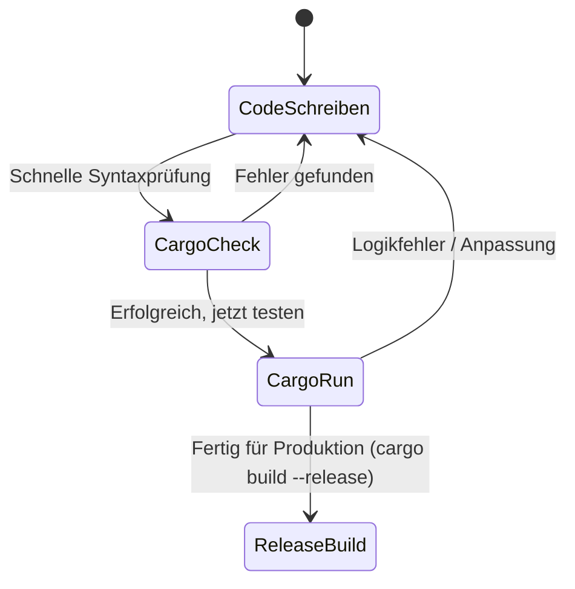
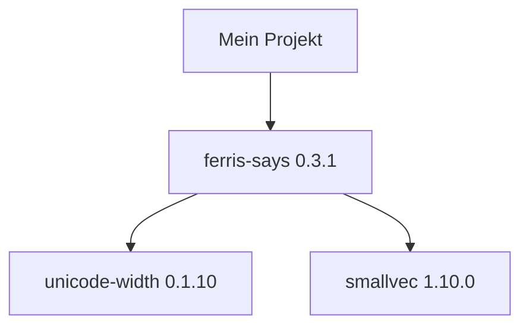

# 4. Erstes Cargo-Projekt

Herzlich willkommen zu diesem Kapitel. Wenn Sie die ersten drei Kapitel durchgearbeitet haben, besitzen Sie nun eine installierte Rust-Toolchain und eine einsatzbereite Entwicklungsumgebung mit Visual Studio Code und dem Sprachserver `rust-analyzer`. In diesem Kapitel machen wir den entscheidenden Schritt von der theoretischen Betrachtung einzelner Quellcodedateien hin zu einer professionellen, strukturierten Projektentwicklung.

Wir werden das offizielle Build-System und den Paketmanager von Rust – **Cargo** – im Detail kennenlernen. Dieses Werkzeug ist das Rückgrat des Rust-Ökosystems. Es nimmt Ihnen die manuelle Arbeit der Compilersteuerung, der Bibliotheksauflösung und der Build-Konfiguration ab. Um die Funktionsweise und die Mechanismen dahinter tiefgreifend zu verstehen, werden wir zunächst die Grenzen der manuellen Kompilierung betrachten, bevor wir uns den automatisierten Workflows von Cargo widmen.

---

## 4.1 Projekt-Initialisierung

Die Erstellung eines neuen Projekts ist der erste Schritt in jedem Rust-Entwicklungszyklus. Cargo stellt uns hierfür spezialisierte Werkzeuge zur Verfügung, um standardisierte Projektstrukturen aufzubauen.

### 4.1.1 Cargo-Befehle

Es gibt zwei Hauptbefehle, um ein neues Cargo-Projekt ins Leben zu rufen: `cargo new` und `cargo init`.

#### 1. `cargo new <projektname>`
Dies ist der am häufigsten verwendete Befehl. Er erstellt ein komplett neues Verzeichnis mit dem angegebenen Namen und initialisiert darin die Standard-Projektstruktur.

```bash
cargo new mein_projekt
```

Standardmäßig erstellt dieser Befehl ein **ausführbares Programm (Binary)**. Das bedeutet, das Projekt enthält eine `main.rs` mit einer `main`-Funktion, die vom Betriebssystem direkt gestartet werden kann. Das explizite Flag hierfür lautet `--bin`:

```bash
cargo new mein_projekt --bin
```

Wenn Sie stattdessen eine **Bibliothek (Library)** erstellen möchten, die von anderen Programmen als Abhängigkeit eingebunden werden soll, nutzen Sie das Flag `--lib`:

```bash
cargo new mein_bibliotheksprojekt --lib
```

> [!TIP]
> Der Unterschied auf Dateisystemebene: Ein Binary-Projekt generiert eine `src/main.rs`, während ein Library-Projekt eine `src/lib.rs` generiert. Letztere besitzt keine `main`-Funktion, sondern enthält wiederverwendbare Funktionen und Strukturen sowie ein standardmäßig generiertes Testgerüst.

#### 2. `cargo init`
Manchmal haben Sie bereits ein Verzeichnis erstellt (z. B. über ein Git-Repository, das Sie geklont haben) und möchten dieses und dessen Inhalt nachträglich in ein Cargo-Projekt umwandeln. In diesem Fall wechseln Sie in das bestehende Verzeichnis und führen `cargo init` aus:

```bash
cd mein_existierendes_verzeichnis
cargo init
```

Auch hier können Sie das `--lib`-Flag verwenden, falls eine Bibliothek statt eines Binaries initialisiert werden soll.

Sowohl `cargo new` als auch `cargo init` führen im Hintergrund eine sehr wichtige Systemoperation aus: Sie initialisieren automatisch ein neues **Git-Repository** im Projektordner, sofern sich dieser nicht bereits innerhalb eines übergeordneten Git-Repositorys befindet. Es wird eine `.git`-Struktur angelegt und eine `.gitignore`-Datei erstellt. Wenn Sie dies explizit verhindern möchten, können Sie das Flag `--vcs none` übergeben:

```bash
cargo new mein_projekt --vcs none
```

---

### 4.1.2 Projektstruktur

Wenn wir uns die von `cargo new mein_projekt` erstellte Ordnerstruktur ansehen, finden wir ein minimalistisches, aber durchdachtes Layout vor:

```text
mein_projekt/
├── Cargo.toml
├── .git/
├── .gitignore
└── src/
    └── main.rs
```

Lassen Sie uns die Rolle und den Inhalt jeder dieser Komponenten auf Systemebene detailliert analysieren:

#### 1. `Cargo.toml`
Das Herzstück jedes Cargo-Projekts. Dies ist das **Manifest** (Konfigurationsdatei), in dem alle Metadaten Ihres Projekts sowie dessen Abhängigkeiten in einer menschenlesbaren Form deklariert werden. Wir untersuchen diese Datei im nächsten Abschnitt genauer.

#### 2. Die Quellcodedatei `src/main.rs`
Der gesamte Rust-Quellcode gehört zwingend in das Verzeichnis `src/` (Source). Cargo erwartet bei einem ausführbaren Projekt standardmäßig, dass sich der Einstiegspunkt in der Datei `src/main.rs` befindet. Der standardmäßig generierte Inhalt sieht wie folgt aus:

```rust
fn main() {
    println!("Hello, world!");
}
```

#### 3. Die Versionsverwaltungskonfiguration `.gitignore`
Cargo ist eng mit dem Versionsverwaltungssystem Git verzahnt. Die generierte `.gitignore`-Datei hat standardmäßig folgenden Inhalt:

```text
/target
```

Dies ist eine kritische Einstellung für Ihr Betriebssystem und Ihr Repository. Sie weist Git an, das gesamte Verzeichnis `/target` zu ignorieren. Das Verzeichnis `target/` wird erst beim Kompilieren (z. B. durch `cargo build`) erzeugt. Es enthält alle vom Compiler generierten Zwischenstufen, Systembibliotheken, Abhängigkeitskompilate und schließlich das fertige ausführbare Maschinenprogramm. Dieses Verzeichnis kann sehr schnell Hunderte von Megabytes oder gar Gigabytes groß werden. Da diese Daten jederzeit aus dem Quellcode neu generiert werden können, gehören sie niemals in die Versionsverwaltung. Das Einchecken von `target/` würde Repositorys extrem aufblähen und zu massiven Merge-Konflikten führen, da sich die Binärdateien bei jedem Kompilierungsvorgang ändern.

---

## 4.2 Die Projektkonfiguration

Die gesamte Steuerung des Projekts erfolgt über zwei Dateien im Stammverzeichnis: `Cargo.toml` (das Manifest) und `Cargo.lock` (die Sperrdatei). Obwohl beide Dateien Konfigurationen darstellen, erfüllen sie völlig unterschiedliche Zwecke im Build-Prozess.

---

### 4.2.1 Das Manifest (Cargo.toml)

Das Manifest wird im TOML-Format geschrieben. **TOML** steht für *Tom's Obvious Minimal Language* und wurde speziell entworfen, um durch eine einfache Schlüssel-Wert-Struktur leicht lesbar und schreibbar zu sein.

> [!IMPORTANT]
> Achten Sie bei der Endung der Datei genau auf die Groß- und Kleinschreibung: Es muss zwingend ein großes **C** und der Rest klein geschrieben werden: **`Cargo.toml`**. Das Betriebssystem Linux unterscheidet strikt zwischen Groß- und Kleinschreibung (Case Sensitivity); eine Datei namens `cargo.toml` wird von Cargo nicht erkannt.

Betrachten wir das von Cargo standardmäßig generierte Manifest:

```toml
[package]
name = "mein_projekt"
version = "0.1.0"
edition = "2021"

[dependencies]
```

Diese Datei ist in verschiedene **Sektionen** (in eckigen Klammern `[...]`) unterteilt:

#### 1. Die Sektion `[package]`
Hier werden die Metadaten definiert, die das Paket selbst beschreiben. Diese Daten sind insbesondere dann wichtig, wenn Sie Ihr Paket auf crates.io veröffentlichen möchten.
*   `name`: Der eindeutige Bezeichner Ihres Projekts. Er darf nur aus alphanumerischen Zeichen, Unterstrichen `_` und Bindestrichen `-` bestehen.
*   `version`: Die aktuelle Version Ihres Projekts. Rust erzwingt hier das System der **semantischen Versionierung (SemVer)**. Eine Version besteht immer aus drei Ziffern: `Major.Minor.Patch` (z. B. `0.1.0`).
    *   **Major**: Erhöhung bei inkompatiblen API-Änderungen (Bruch der Abwärtskompatibilität).
    *   **Minor**: Erhöhung bei funktionalen Erweiterungen, die abwärtskompatibel sind.
    *   **Patch**: Erhöhung bei abwärtskompatiblen Fehlerbehebungen (Bugfixes).
*   `edition`: Definiert die Sprachversion von Rust. Im Gegensatz zu C++ (wo verschiedene Standards wie C++11, C++20 oft zu Inkompatibilitäten führen) garantieren Rust-Editionen (wie `2015`, `2018`, `2021`) vollkommene Interoperabilität. Eine Edition ermöglicht es dem Rust-Team, neue Schlüsselwörter einzuführen (z. B. `async` und `await` in der Edition 2018), ohne dass alter Code bricht. Compiler-Editionen sind abwärtskompatibel; ein Projekt der Edition 2021 kann problemlos Bibliotheken nutzen, die in der Edition 2015 geschrieben wurden.

#### 2. Die Sektion `[dependencies]`
Hier tragen Sie alle externen Bibliotheken ein, die Ihr Projekt benötigt. Cargo lädt diese automatisch herunter. Dabei können Sie Versionen auf verschiedene Arten spezifizieren:

| Syntax-Typ | Beispiel in `Cargo.toml` | Erlaubter Versionsbereich | Erklärung |
| :--- | :--- | :--- | :--- |
| **Caret (Standard)** | `rand = "0.8.5"` oder `^0.8.5` | `>=0.8.5, <0.9.0` | Erlaubt Updates, die die am weitesten links stehende Ziffer ungleich Null nicht verändern. Dies garantiert maximale Sicherheit bei gleichzeitiger Aktualität. |
| **Tilde** | `rand = "~0.8.5"` | `>=0.8.5, <0.9.0` | Ermöglicht nur Updates auf Patch-Ebene. Bei `~0.8` wäre es `>=0.8.0, <0.9.0`. |
| **Wildcard** | `rand = "0.8.*"` | `>=0.8.0, <0.9.0` | Akzeptiert jeden beliebigen Patch-Level innerhalb der spezifizierten Minor-Version. |
| **Exakte Version** | `rand = "=0.8.5"` | `==0.8.5` | Friert die Version starr ein. Es werden keinerlei Updates zugelassen. |
| **Bereiche** | `rand = ">=0.8.0, <0.8.4"` | Spezifizierter Bereich | Erlaubt die genaue mathematische Eingrenzung von Versionen. |

---

### 4.2.2 Die Sperrdatei (Cargo.lock)

Während Sie in der `Cargo.toml` Ihre *Wünsche* und *Zulässigkeiten* deklarieren (z. B. "Ich möchte eine beliebige, kompatible Version von `rand` ab `0.8.5`"), dokumentiert die Datei `Cargo.lock` den **exakten Ist-Zustand** zum Zeitpunkt des letzten erfolgreichen Builds.

Ein Auszug aus einer typischen `Cargo.lock` zeigt die Detailtiefe:

```toml
# Dieses File wird automatisch von Cargo gepflegt.
# Es wird NICHT empfohlen, es manuell zu bearbeiten.
[[package]]
name = "mein_projekt"
version = "0.1.0"
dependencies = [
 "rand",
]

[[package]]
name = "rand"
version = "0.8.5"
source = "registry+https://github.com/rust-lang/crates.io-index"
checksum = "34af8d1a0e25924bc5b7c43c079c942339d8f0a8b57c39049bef581b46327404"
dependencies = [
 "libc",
 "rand_chacha",
 "rand_core",
]
```

#### Wie arbeitet `Cargo.lock` auf Systemebene?
Wenn Sie oder ein Teammitglied das Projekt zum ersten Mal ausführen, analysiert Cargo die `Cargo.toml`. Es stellt fest, dass `rand = "0.8.5"` benötigt wird. Cargo kontaktiert crates.io, stellt fest, dass die aktuellste Version der `0.8`-Reihe beispielsweise `0.8.5` ist, lädt diese herunter und ermittelt deren kryptografischen Hashwert (SHA-256 Checksum).

Cargo schreibt nun diese exakten Daten in die `Cargo.lock`. 
*   **Der Clou**: Wenn ein anderer Entwickler Ihr Projekt klont und `cargo build` ausführt, liest Cargo zuerst die `Cargo.lock`. Selbst wenn in der Zwischenzeit eine Version `0.8.6` auf crates.io veröffentlicht wurde, ignoriert Cargo diese und lädt exakt die Version `0.8.5` herunter, verifiziert sie mit dem gespeicherten Hashwert und baut das Projekt.
*   **Resultat**: 100 % reproduzierbare Builds. Kein unerwarteter Code-Bruch durch automatische Hintergrund-Updates von Bibliotheken.

#### Git-Best-Practice: Einchecken oder nicht?
*   **Anwendungen (Binaries/Executables)**: **Ja!** Checken Sie `Cargo.lock` immer in Ihr Git-Repository ein. Nur so stellen Sie sicher, dass Ihre Kollegen, Ihre CI/CD-Pipeline und Ihre Produktions-Server exakt denselben Byte-Code erzeugen.
*   **Bibliotheken (Libraries)**: **Nein!** Fügen Sie `Cargo.lock` bei Bibliotheken zur `.gitignore` hinzu. Warum? Wenn Ihre Bibliothek von anderen Projekten genutzt wird, bestimmt das Endprodukt (die Anwendung) die genaue Versionierung. Ihre Bibliothek muss flexibel gegenüber verschiedenen kompatiblen Versionen der Abhängigkeiten sein. Das Einchecken der Lock-Datei würde hier falsche Garantien suggerieren.

---

## 4.3 Der Cargo-Workflow

Der alltägliche Arbeitsfluss mit Rust zeichnet sich durch extrem schnelle Feedback-Schleifen aus. Cargo stellt vier primäre Befehle für diesen Zyklus bereit.

---

### 4.3.1 Entwicklungszyklen



#### 1. `cargo check`
Der mit Abstand wichtigste Befehl während des aktiven Programmierens. `cargo check` durchläuft die lexikalische Analyse, das Parsing, die Typprüfung und den Borrow Checker von Rust. Er überspringt jedoch den zeitintensiven letzten Schritt: Die Codegenerierung durch das LLVM-Compiler-Backend (das Erzeugen von Assembler-Code und Maschinencode) sowie das Linken der Binärdateien.
*   **Vorteil**: `cargo check` ist oft um den Faktor 10 bis 50 schneller als ein vollständiger Build. Es gibt Ihnen sofortiges Feedback, ob Ihr Code syntaktisch korrekt ist und die strengen Regeln der Speicherverwaltung einhält.
*   **Praxis**: Führen Sie `cargo check` alle paar Minuten oder direkt nach dem Speichern einer Datei aus.

#### 2. `cargo build`
Dieser Befehl kompiliert Ihr Projekt und alle seine Abhängigkeiten vollständig. Wenn Sie keinen weiteren Parameter übergeben, baut Cargo das Projekt im **Debug-Modus** (siehe Abschnitt 4.3.2).
Die fertigen Kompilate und die ausführbare Datei landen im Verzeichnis `target/debug/`.
Der Name des ausführbaren Programms entspricht dem in der `Cargo.toml` definierten Paketnamen.

#### 3. `cargo run`
Ein Komfort-Befehl. Er prüft, ob sich seit dem letzten Build Quellcodedateien geändert haben. Wenn ja, führt er implizit ein `cargo build` aus. Danach startet er die generierte ausführbare Binärdatei direkt und leitet deren Standard-Eingabe und -Ausgabe (`stdin`, `stdout`, `stderr`) in Ihr Terminal um.
*   **Übergabe von Argumenten**: Wenn Sie Argumente an Ihr eigenes Programm (nicht an Cargo) übergeben möchten, müssen Sie diese nach einem doppelten Bindestrich `--` anhängen:
    `cargo run -- --hilfe-ausgeben --pfad /daten`

#### 4. `cargo clean`
Dieser Befehl löscht das komplette Verzeichnis `target/` von Ihrer Festplatte. Er ist nützlich, um Speicherplatz freizugeben (da sich dort im Laufe der Zeit Gigabytes an Zwischenstufen ansammeln können) oder um eine saubere, vollständige Neukompilierung des gesamten Projekts von Grund auf zu erzwingen, falls sich Systembibliotheken geändert haben.

---

### 4.3.2 Build-Profile

Rust bietet Ihnen die Möglichkeit, die Übersetzung Ihres Codes exakt auf den Verwendungszweck abzustimmen. Standardmäßig sind zwei Profile vordefiniert:

#### 1. Das Debug-Profil (Entwicklungsmodus)
Wird aufgerufen durch einfaches `cargo build` oder `cargo run`.
*   **Compiler-Optimierung**: Keine Optimierung (`opt-level = 0`). Der Compiler übersetzt den Rust-Code eins zu eins in Maschinencode. Das geht extrem schnell, führt aber zu langsamem und großem Maschinencode.
*   **Debug-Symbole**: Vollständig vorhanden. Der Maschinencode enthält Verweise auf den ursprünglichen Quelltext (Dateinamen, Zeilennummern, Variablennamen). Wenn das Programm abstürzt, erhalten Sie einen detaillierten Stack-Trace (Aufrufpfad).
*   **Integer-Überläufe**: Führen zur Compile- oder Laufzeit zu einer kontrollierten Panik (`panic!`). Das verhindert unbemerktes Fehlverhalten im mathematischen Bereich.

#### 2. Das Release-Profil (Produktionsmodus)
Wird aufgerufen durch `cargo build --release` oder `cargo run --release`.
*   **Compiler-Optimierung**: Maximale Optimierung (`opt-level = 3`). Der Compiler analysiert den Code global über das LLVM-Backend. Er führt komplexe mathematische Optimierungen durch:
    *   **Inlining**: Kleine Funktionen werden direkt an den Aufrufort kopiert, um den Overhead des Stack-Frame-Aufbaus zu eliminieren.
    *   **Dead Code Elimination**: Code, der niemals ausgeführt werden kann, wird physisch aus dem Binary gelöscht.
    *   **Loop Unrolling**: Schleifen werden flach geklopft, um Sprungbefehle auf CPU-Ebene zu minimieren.
*   **Debug-Symbole**: Werden standardmäßig komplett entfernt. Das verringert die Dateigröße des Programms massiv.
*   **Integer-Überläufe**: Lösen **keine** Panik aus. Stattdessen kommt es zu einem lautlosen Überlauf nach den Regeln der modularen Arithmetik (Zweierkomplement-Wrapping, z. B. `255u8 + 1u8 == 0u8`). Dies spart CPU-Zyklen.

#### Vergleich auf Systemebene

| Eigenschaft | Debug-Profil (`cargo build`) | Release-Profil (`cargo build --release`) |
| :--- | :--- | :--- |
| **Optimierungsstufe** | `opt-level = 0` (Keine) | `opt-level = 3` (Maximal) |
| **Kompilierungszeit** | Sehr kurz | Deutlich länger (wegen Optimierungsschleifen) |
| **Ausführungsgeschwindigkeit** | Normal bis langsam | Extrem schnell (Faktor 10 bis 100 schneller) |
| **Binary-Größe** | Sehr groß (enthält Debug-Metadaten) | Sehr klein (optimiert und gestrippt) |
| **Integer-Overflow** | Absturz (`panic!`) | Wrapping (Zweierkomplement-Verhalten) |
| **Zielordner** | `target/debug/` | `target/release/` |

> [!WARNING]
> Führen Sie niemals Performance-Messungen (Benchmarks) an einem Programm aus, das im Debug-Modus kompiliert wurde. Die Ergebnisse sind absolut nicht repräsentativ. Nutzen Sie für jegliche Laufzeitanalyse ausnahmslos das `--release`-Flag.

#### Anpassung von Profilen in der `Cargo.toml`
Sie können das Verhalten der Profile an Ihre Bedürfnisse anpassen. Fügen Sie dazu einfach entsprechende Sektionen in Ihr Manifest ein:

```toml
# Optimierungen auch im Debug-Modus leicht aktivieren (beschleunigt Tests)
[profile.dev]
opt-level = 1

# Im Release-Modus Debug-Symbole für Profiling-Tools behalten
[profile.release]
debug = true
opt-level = 3
```

---

## 4.4 Didaktisches 11-Schritte-Zusatzmaterial

Um dem 11-Schritte-Schema aus markdown.md (file:///home/thorsten/RustKurs/markdown.md) gerecht zu werden, vertiefen wir nun die Konzepte durch didaktisch aufbereitete Abschnitte zur Motivation, zur Fehleranatomie bei manueller Übersetzung und bieten ein praxisnahes Tutorial, mentale Modelle und strukturierte Übungen.

### 4.4.1 Das Problem & Die Motivation (Vertiefung)

In der traditionellen Systemprogrammierung (z.B. C/C++) ist das Linker- und Dependency-Management dezentralisiert. Jedes Betriebssystem besitzt eigene Verzeichnisse für Systembibliotheken (z. B. `/usr/lib` unter Linux oder Systemordner unter Windows). Das Fehlen eines standardisierten Paketmanagers führt dazu, dass Entwickler oft Stunden damit verbringen, Makefiles zu schreiben, statische Links zu konfigurieren oder Compilerpfade zu biegen. 

Rust beseitigt diesen Aufwand fundamental. Cargo standardisiert das Build-System und die Paketverwaltung so eng, dass ein einziger Befehl genügt, um ein komplexes Projekt mit Hunderten von Modulen auf jedem Betriebssystem identisch zu kompilieren.

### 4.4.2 Der naive Versuch (Manuelles Kompilieren ohne Cargo)

Stellen wir uns vor, wir möchten ein einfaches Projekt mit einer externen Bibliothek manuell mit dem nackten Compiler `rustc` übersetzen. Unser Programm soll Text mithilfe der Bibliothek `ferris-says` formatiert ausgeben.

Wir schreiben folgende Quellcodedatei namens `main.rs`:

```rust
// Datei: main.rs
fn main() {
    let botschaft = "Hallo Welt!";
    let breite = botschaft.chars().count();
    let mut stdout = std::io::stdout();
    
    // Versuch, die externe Bibliothek ferris-says aufzurufen
    ferris_says::say(botschaft.as_bytes(), breite, &mut stdout).unwrap();
}
```

Wir versuchen nun im Terminal, diese Datei direkt mit dem Compiler zu übersetzen:

```bash
rustc main.rs
```

### 4.4.3 Die Anatomie des Fehlers (Compiler-Fehler und Speicherdiagramm-Beschreibung)

Der Compiler bricht die Ausführung sofort mit folgendem Fehler ab:

```text
error[E0433]: failed to resolve: use of undeclared crate or module `ferris_says`
 --> main.rs:7:5
  |
7 |     ferris_says::say(botschaft.as_bytes(), breite, &mut stdout).unwrap();
  |     ^^^^^^^^^^^ use of undeclared crate or module `ferris_says`
```

#### Die Analyse
*   **Ursache**: Der Compiler `rustc` arbeitet im luftleeren Raum des Dateisystems. Er hat keinen Bezug zu einer Online-Registrierung oder einem Paketordner. 
*   **Speicher- und Dateisystemverhalten**: `rustc` versucht, den Bezeichner `ferris_says` in den Modulpfaden des aktuellen Projekts oder in der Standardbibliothek zu finden. Da keine Referenz auf eine `.rlib`-Datei (Rusts statische Bibliothek) über das Kommandozeilenflag `--extern` übergeben wurde, kann das Symbol nicht aufgelöst werden. Der Build-Prozess scheitert, bevor überhaupt Maschinencode generiert werden kann.

---

### 4.4.4 Die Lösung (EVA-Prinzip)

Die Lösung besteht darin, das Projekt über Cargo zu verwalten und die Abhängigkeit in der `Cargo.toml` zu registrieren.

#### Das EVA-Prinzip des Cargo-Build-Prozesses:
1.  **Eingabe (Input)**: Die Quelldateien (`src/main.rs`), das Manifest (`Cargo.toml`) und optional die Sperrdatei (`Cargo.lock`).
2.  **Verarbeitung (Processing)**: Cargo liest das Manifest, prüft die Versionen, lädt die fehlenden Crates herunter, speichert sie im globalen Cache, ruft `rustc` für jedes Crate in der korrekten Reihenfolge auf und verlinkt die entstehenden Zwischenkompilate statisch miteinander.
3.  **Ausgabe (Output)**: Ein lauffähiges, statisch gelinktes Binary im Zielordner (`target/debug/` oder `target/release/`) und eine aktualisierte `Cargo.lock`-Sperrdatei.

---

### 4.4.5 Kleines Tutorial (Schritt-für-Schritt-Praxis)

Wir erstellen nun Schritt für Schritt ein echtes Projekt namens `text_schmiede` unter Verwendung von Cargo.

#### Schritt 1: Projekt anlegen
Erstellen Sie das Projekt in Ihrem Terminal:
```bash
cargo new text_schmiede --bin
cd text_schmiede
```

#### Schritt 2: Abhängigkeit deklarieren
Öffnen Sie `Cargo.toml` und fügen Sie das Crate `ferris-says` hinzu:
```toml
[package]
name = "text_schmiede"
version = "0.1.0"
edition = "2021"

[dependencies]
ferris-says = "0.3.1"
```

#### Schritt 3: Quellcode implementieren
Ersetzen Sie den Inhalt von `src/main.rs` durch ein interaktives Programm, das die Standardeingabe liest und formatiert ausgibt:

```rust
// Datei: src/main.rs
use ferris_says::say;
use std::io::{stdin, stdout, BufWriter, Write};

fn main() {
    print!("Geben Sie Text für Ferris ein: ");
    stdout().flush().unwrap();

    let mut eingabe = String::new();
    stdin().read_line(&mut eingabe).expect("Fehler beim Lesen");
    
    let text = eingabe.trim();
    let breite = text.chars().count();
    
    let ausgabe = stdout();
    let mut schreiber = BufWriter::new(ausgabe.lock());
    
    say(text.as_bytes(), breite, &mut schreiber).unwrap();
    schreiber.flush().unwrap();
}
```

#### Schritt 4: Ausführen
Starten Sie das Programm mit:
```bash
cargo run
```
Geben Sie einen Text ein (z.B. `Hallo Cargo!`) und beobachten Sie die Ausgabe von Ferris dem Krebs.

---

### 4.4.6 Mentale Modelle & Deep Dive (Hintergrundwissen)

#### Visualisierung des Abhängigkeits-Resolution-Prozesses
Wenn Cargo die `Cargo.toml` parst, baut es im RAM einen gerichteten kreisfreien Graphen (DAG) auf, um zyklische Abhängigkeiten auszuschließen:



#### Deep Dive: Die LLVM-Optimierungskette
Bei einem Release-Build (`cargo build --release`) übergibt `rustc` den generierten Zwischencode (LLVM-IR) an das LLVM-Compiler-Backend. LLVM führt hunderte von Optimierungsdurchläufen aus:
*   **Inlining**: Die Funktion `kreis_flaeche(r)` wird direkt durch den Term `r * r * 3.1415...` ersetzt. Dadurch entfällt der CPU-Register-Speicher-Wechsel (Funktionsaufruf-Overhead).
*   **Loop Unrolling**: Eine Schleife, die 3 Mal läuft, wird vom Compiler in 3 aufeinanderfolgende Codeblöcke kopiert. Das verhindert Sprungvorhersage-Fehler auf der CPU-Pipeline.

---

### 4.4.7 Drei praktische Übungen (Herausforderungen)

#### Übung 1 (Leicht - Syntax festigen)
*   **Aufgabe**: Initialisieren Sie ein neues Bibliotheksprojekt namens `rechner_kern` mit `cargo new rechner_kern --lib`.
*   **Anforderung**: Implementieren Sie eine mathematische Additionsfunktion in `src/lib.rs` und dokumentieren Sie diese. Führen Sie `cargo check` aus.
*   **Lösungshinweis**: `pub fn addiere(x: i32, y: i32) -> i32 { x + y }` in `src/lib.rs` einfügen.

#### Übung 2 (Mittel - Profile konfigurieren)
*   **Aufgabe**: Fügen Sie Ihrem Projekt `text_schmiede` ein benutzerdefiniertes Profil hinzu. Im Standard-Entwicklungsprofil soll das Optimierungslevel auf `1` gesetzt werden, um die Performance bei lokalen Tests zu erhöhen.
*   **Anforderung**: Passen Sie die `Cargo.toml` an.
*   **Lösungshinweis**:
    ```toml
    [profile.dev]
    opt-level = 1
    ```

#### Übung 3 (Schwer - Dependency Hell auflösen)
*   **Aufgabe**: Simulieren Sie die Einbindung zweier inkompatibler Versionen eines Hilfs-Crates in einem komplexeren Projekt und lösen Sie den Konflikt auf, indem Sie ein Crate über das Feld `[patch.crates-io]` auf eine lokale, modifizierte Kopie umleiten.
*   **Anforderung**: Erstellen Sie eine minimale lokale Modifikation und verlinken Sie diese über die Sektion `[patch]`.
*   **Lösungshinweis**: Die Syntax lautet:
    ```toml
    [patch.crates-io]
    externe-bibliothek = { path = "./lokale_kopie" }
    ```

---

### 4.4.8 Lernstrategie, Selbsteinschätzung & Merkzettel

#### Spickzettel (Cheat Sheet)
| Befehl | Aktion | Detail |
| :--- | :--- | :--- |
| `cargo new <name> --bin` | Neues ausführbares Projekt | Erstellt `main.rs` |
| `cargo new <name> --lib` | Neues Bibliotheksprojekt | Erstellt `lib.rs` |
| `cargo check` | Nur Syntax- und Typprüfung | Extrem schnell |
| `cargo build --release` | Optimierter Build | Code-Optimierung Stufe 3 |

#### Active Recall
1.  **Frage**: Was passiert auf Systemebene, wenn `Cargo.lock` gelöscht wird?
    *   *Antwort*: Cargo ermittelt beim nächsten Build alle Abhängigkeitsversionen komplett neu anhand der `Cargo.toml` und lädt potenziell neuere Minor- oder Patch-Versionen herunter.
2.  **Frage**: Warum ist `cargo run` im Debug-Modus ungeeignet für Benchmarks?
    *   *Antwort*: Weil der Maschinencode ohne jegliche Compiler-Optimierungen generiert wird.
3.  **Frage**: Welche Rolle hat der `target/`-Ordner im Kontext von Git?
    *   *Antwort*: Er enthält flüchtige Kompilate und darf niemals in Git eingecheckt werden (daher standardmäßig in `.gitignore`).

#### Feynman-Methode
Erklären Sie in maximal 3 Sätzen die Rolle von `Cargo.toml` im Vergleich zu `Cargo.lock`:
> *"Die `Cargo.toml` enthält die Bauanleitung und die groben Anforderungen, die ich als Programmierer stelle. Die `Cargo.lock` ist das exakte Zustandsprotokoll, das dokumentiert, welche präzisen Versionen Cargo beim letzten Build tatsächlich heruntergeladen hat. Dadurch wird garantiert, dass das Programm überall exakt gleich kompiliert wird."*

#### Gezielte Fehlerprovokation
Entfernen Sie eine eckige Klammer in der Sektion `[dependencies` in `Cargo.toml` und starten Sie `cargo check`. Der TOML-Parser wird mit einer präzisen Angabe der fehlerhaften Zeilennummer abbrechen.

#### Metakognitiver Selbsttest
Wechseln Sie erst zu Kapitel 5, wenn Sie:
* [ ] Den Unterschied zwischen `Cargo.toml` und `Cargo.lock` sicher erklären können.
* [ ] Wissen, wo Cargo die heruntergeladenen Abhängigkeiten speichert.
* [ ] Den Vorteil von `cargo check` gegenüber `cargo build` verstanden haben.

---

### 4.4.9 Zusammenfassung

*   **Cargo** ist das zentrale Build-System und der Paketmanager von Rust.
*   **Initialisierung**: Mit `cargo new` werden standardisierte Projektstrukturen inklusive Git-Anbindung erzeugt.
*   **Projektkonfiguration**: `Cargo.toml` deklariert Wünsche und Paket-Metadaten. `Cargo.lock` friert den exakten Abhängigkeitsbaum für reproduzierbare Builds ein.
*   **Workflow**: `cargo check` ist das primäre Werkzeug zur schnellen Code-Prüfung. `cargo run` führt das Programm aus.
*   **Build-Profile**: Das Debug-Profil (`cargo build`) optimiert nicht und behält Debug-Symbole; das Release-Profil (`cargo build --release`) bietet maximale Performance auf Maschinenebene.

---

### 4.4.10 API-Referenz (Cargo-Befehle, Manifest-Schlüssel & std::env)

Hier werden wichtige systembezogene APIs dokumentiert, die in Cargo-Projekten Anwendung finden.

#### 1. `std::env::var`
*   **Signatur**: `pub fn var<K: AsRef<OsStr>>(key: K) -> Result<String, VarError>`
*   **Parameter**: `key` (Typ `K`, Name der Umgebungsvariable).
*   **Rückgabetyp**: `Result<String, VarError>`
*   **Panics**: Keine.
*   **Kurzbeispiel**:
    ```rust
    let manifest_pfad = std::env::var("CARGO_MANIFEST_DIR").unwrap();
    ```

#### 2. `std::env::args`
*   **Signatur**: `pub fn args() -> Args`
*   **Parameter**: Keine.
*   **Rückgabetyp**: `Args` (Iterator über String-Argumente).
*   **Panics**: Panikt bei ungültigem Unicode in den Argumenten.
*   **Kurzbeispiel**:
    ```rust
    let argumente: Vec<String> = std::env::args().collect();
    ```

#### 3. `std::env::current_dir`
*   **Signatur**: `pub fn current_dir() -> Result<PathBuf, Error>`
*   **Parameter**: Keine.
*   **Rückgabetyp**: `Result<PathBuf, std::io::Error>`
*   **Panics**: Keine.
*   **Kurzbeispiel**:
    ```rust
    let aktueller_ordner = std::env::current_dir().unwrap();
    ```

---
**Lizenz- und Attributionshinweis**:
Teile dieses Kapitels basieren auf Übersetzungen und didaktischen Anpassungen des offiziellen Buches [The Rust Programming Language](https://doc.rust-lang.org/book/) von Steve Klabnik und Carol Nichols (sowie Beiträgen der Rust-Community), lizenziert unter [MIT](https://opensource.org/licenses/MIT) und [Apache 2.0](https://www.apache.org/licenses/LICENSE-2.0).